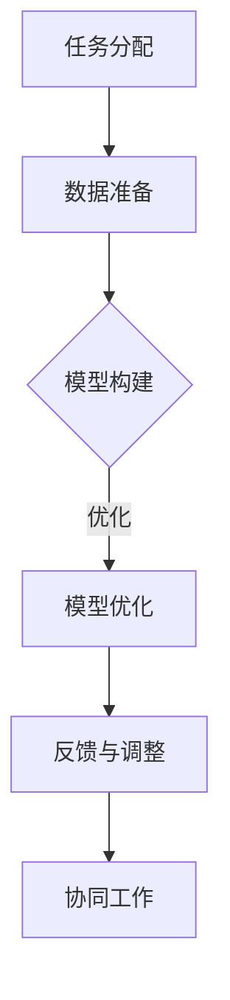

                 

### 1. 背景介绍

在当今的数字化时代，人工智能（AI）已经成为推动社会进步和经济发展的重要力量。AI技术的迅猛发展，不仅改变了传统行业的工作方式，还激发了新的商业模式的诞生。然而，随着AI系统的复杂性和规模不断扩大，单纯依赖机器学习和数据驱动的方法已经难以应对日益复杂的现实问题。在这种情况下，人类与AI的协作显得尤为重要。

人类与AI协作的核心在于将人类的智慧与AI的能力相结合，以实现更高效、更智能的决策过程。人类具备丰富的经验和专业知识，而AI则具有强大的数据处理和分析能力。通过协同工作，人类可以充分发挥自己的创造力，AI则可以执行重复性和计算密集型的任务，从而实现优势互补。

当前，人类与AI的协作主要表现在以下几个方面：

1. **任务分配与优化**：AI可以分析人类的工作流程，识别重复性、低效率的任务，并将这些任务自动化，从而释放人类的时间，让人类专注于更有价值的工作。

2. **智能辅助**：AI系统可以提供实时的信息支持和决策建议，帮助人类在复杂情境中做出更准确的判断。

3. **共创与创新**：AI可以为人类提供新的视角和解决方案，激发人类的创造力，共同推动科技进步和社会发展。

4. **风险评估与防范**：AI可以通过分析海量数据，提前识别潜在的风险，并制定相应的防范措施，从而降低人类活动的风险。

本文将围绕人类与AI协作的核心概念、发展趋势、应用场景、工具和资源等方面展开讨论，旨在为读者提供一幅全面而深刻的理解，并展望未来可能的发展方向。

### 2. 核心概念与联系

要深入探讨人类与AI的协作，我们首先需要明确几个核心概念，并理解它们之间的内在联系。

#### 2.1. 人类智慧

人类智慧是指人类通过思考、判断、推理、创造等认知活动所表现出的综合能力。它包括逻辑思维、直觉判断、情感理解、创造力等多个方面。在AI协作中，人类智慧主要体现在以下几个方面：

1. **领域专业知识**：人类在特定领域拥有丰富的经验和知识，这些知识是AI无法直接获取的宝贵资源。
2. **情境理解**：人类能够理解复杂、动态的情境，并根据情境进行灵活的决策。
3. **创造力和创新**：人类具备独特的创造力，能够提出新的想法和解决方案。

#### 2.2. 人工智能

人工智能（AI）是指由人创造出来的，能够模拟、延伸和扩展人类智能的理论、方法、技术和应用系统。AI的核心能力包括：

1. **数据处理**：AI能够处理海量数据，从中提取有用的信息。
2. **模式识别**：AI可以识别数据中的模式和规律，并基于这些模式进行预测和决策。
3. **自动化**：AI可以执行重复性、计算密集型的任务，提高工作效率。

#### 2.3. 人类与AI协作的关系

人类与AI的协作是一个复杂的过程，涉及多个层次的相互作用。以下是一个简化的协作框架：

1. **任务分解**：人类根据自身经验和专业知识，将复杂任务分解成多个子任务，并识别哪些子任务适合由AI来完成。
2. **数据准备**：人类需要为AI提供高质量的数据集，以便AI进行训练和学习。
3. **模型构建与优化**：AI通过机器学习等方法，构建并优化模型，以实现特定任务的自动化。
4. **反馈与调整**：人类对AI的输出进行评估，并提供反馈，AI根据反馈进行自我调整。
5. **协同工作**：人类和AI共同完成复杂任务，实现1+1>2的效果。

#### 2.4. 核心概念与联系的Mermaid流程图

下面是描述人类与AI协作流程的Mermaid流程图：



在这个流程图中，A表示任务分配，B表示数据准备，C表示模型构建，D表示模型优化，E表示反馈与调整，F表示协同工作。每个节点都表示协作过程中的一个关键步骤，节点之间的箭头表示信息的流动和任务之间的依赖关系。

通过这个流程图，我们可以清晰地看到人类与AI协作的各个环节，以及它们之间的内在联系。这为后续章节的具体讨论提供了基础。

### 3. 核心算法原理 & 具体操作步骤

为了更好地理解人类与AI协作的机制，我们需要探讨一些核心算法的原理和具体操作步骤。以下是一些常用的算法及其应用场景：

#### 3.1. 算法原理概述

##### 3.1.1. 机器学习算法

机器学习算法是AI的核心组成部分，它通过从数据中学习规律和模式，实现自动化的决策和预测。常见的机器学习算法包括：

1. **线性回归**：用于预测连续值。
2. **逻辑回归**：用于预测离散的二分类结果。
3. **决策树**：通过一系列规则进行分类或回归。
4. **随机森林**：多个决策树的集成，提高预测的准确性。
5. **神经网络**：模拟人脑神经元的工作原理，用于复杂模式的识别。

##### 3.1.2. 深度学习算法

深度学习是机器学习的一个分支，它通过多层神经网络来学习和提取数据中的高级特征。深度学习算法在图像识别、自然语言处理、语音识别等领域表现出色。常见的深度学习模型包括：

1. **卷积神经网络（CNN）**：适用于图像和视频处理。
2. **循环神经网络（RNN）**：适用于序列数据，如时间序列分析和语言模型。
3. **长短期记忆网络（LSTM）**：RNN的一个变种，解决长期依赖问题。
4. **生成对抗网络（GAN）**：通过对抗训练生成逼真的数据。

##### 3.1.3. 强化学习算法

强化学习是另一类重要的机器学习算法，它通过与环境互动，不断调整策略以实现最优回报。强化学习在游戏、自动驾驶、机器人控制等领域有广泛应用。常见的强化学习算法包括：

1. **Q学习**：通过值函数学习最优策略。
2. **策略梯度**：直接优化策略参数。
3. **深度确定性策略梯度（DDPG）**：适用于连续动作空间。

#### 3.2. 算法步骤详解

##### 3.2.1. 机器学习算法步骤

1. **数据收集**：收集用于训练的数据集。
2. **数据预处理**：包括数据清洗、归一化、缺失值处理等。
3. **特征工程**：从原始数据中提取有用特征，提高模型性能。
4. **模型选择**：选择合适的机器学习模型。
5. **模型训练**：使用训练数据对模型进行训练。
6. **模型评估**：使用验证集对模型进行评估。
7. **模型优化**：根据评估结果调整模型参数。

##### 3.2.2. 深度学习算法步骤

1. **数据收集**：与机器学习相同。
2. **数据预处理**：与机器学习相同。
3. **网络架构设计**：设计合适的神经网络结构。
4. **损失函数选择**：选择合适的损失函数，如交叉熵损失。
5. **优化器选择**：选择合适的优化器，如Adam。
6. **模型训练**：使用训练数据对模型进行训练。
7. **模型评估**：与机器学习相同。
8. **模型优化**：根据评估结果调整模型参数。

##### 3.2.3. 强化学习算法步骤

1. **环境定义**：定义强化学习环境，包括状态空间、动作空间、奖励函数等。
2. **策略初始化**：初始化策略网络。
3. **互动学习**：通过与环境互动，不断更新策略网络。
4. **策略评估**：评估策略网络的性能。
5. **策略优化**：根据评估结果调整策略网络。

#### 3.3. 算法优缺点

##### 3.3.1. 机器学习算法优缺点

**优点**：

1. **通用性强**：适用于各种类型的任务，如分类、回归等。
2. **灵活性高**：可以根据任务需求调整算法参数。

**缺点**：

1. **数据依赖性强**：需要大量高质量的数据进行训练。
2. **模型复杂度高**：对于大规模数据集，训练时间较长。

##### 3.3.2. 深度学习算法优缺点

**优点**：

1. **强大学习能力**：能够自动提取数据中的高级特征。
2. **广泛适用性**：在图像、语音、自然语言处理等领域有广泛应用。

**缺点**：

1. **计算资源消耗大**：需要大量计算资源进行训练。
2. **解释性差**：深度学习模型的黑箱特性使得其决策过程难以解释。

##### 3.3.3. 强化学习算法优缺点

**优点**：

1. **自适应性强**：能够根据环境变化动态调整策略。
2. **灵活性高**：适用于连续动作空间的任务。

**缺点**：

1. **收敛速度慢**：需要大量交互进行学习。
2. **策略不稳定**：对于不同环境的适应能力较差。

#### 3.4. 算法应用领域

##### 3.4.1. 机器学习算法应用领域

1. **分类任务**：如垃圾邮件检测、图像分类等。
2. **回归任务**：如房价预测、股票价格预测等。
3. **聚类任务**：如客户群体划分、社交网络分析等。

##### 3.4.2. 深度学习算法应用领域

1. **图像识别**：如人脸识别、自动驾驶等。
2. **自然语言处理**：如机器翻译、情感分析等。
3. **语音识别**：如语音助手、语音合成等。

##### 3.4.3. 强化学习算法应用领域

1. **游戏**：如围棋、电子竞技等。
2. **自动驾驶**：如无人驾驶汽车、无人机等。
3. **机器人控制**：如机器人路径规划、机器人手臂控制等。

通过以上对核心算法原理和具体操作步骤的讨论，我们可以更好地理解人类与AI协作的机制。在接下来的章节中，我们将进一步探讨数学模型和公式，以及如何将这些算法应用于实际项目实践中。

### 4. 数学模型和公式 & 详细讲解 & 举例说明

在人类与AI协作的过程中，数学模型和公式起着至关重要的作用。它们不仅能够帮助我们在理论层面上理解AI算法的工作原理，还可以在实际应用中指导我们的具体操作。在本章节中，我们将详细讲解一些常见的数学模型和公式，并通过具体案例进行分析和说明。

#### 4.1. 数学模型构建

数学模型构建是人工智能领域的基础工作之一。一个完整的数学模型通常包括以下步骤：

1. **问题定义**：明确我们需要解决的问题是什么，以及问题的目标是什么。
2. **变量定义**：确定问题中的变量，并给它们赋予合适的定义。
3. **公式推导**：根据问题定义和变量定义，推导出解决问题的数学公式。
4. **参数估计**：估计模型中的参数，以便模型能够更好地拟合实际数据。
5. **模型验证**：使用验证数据集对模型进行验证，确保模型的准确性和稳定性。

以下是一个简单的线性回归模型的构建过程：

**问题定义**：预测某个地区的房价。

**变量定义**：

- \( x \)：地区的特征向量，如人口密度、平均收入等。
- \( y \)：房价。

**公式推导**：

根据线性回归模型的基本原理，我们有：

\[ y = \beta_0 + \beta_1 x + \varepsilon \]

其中，\( \beta_0 \) 和 \( \beta_1 \) 是模型的参数，\( \varepsilon \) 是误差项。

**参数估计**：

通过最小二乘法，我们可以估计出 \( \beta_0 \) 和 \( \beta_1 \) 的值：

\[ \beta_0 = \frac{\sum_{i=1}^{n} y_i - \beta_1 \sum_{i=1}^{n} x_i}{n} \]
\[ \beta_1 = \frac{\sum_{i=1}^{n} (y_i - \beta_0 - \beta_1 x_i)}{\sum_{i=1}^{n} (x_i - \bar{x})^2} \]

**模型验证**：

使用验证数据集对模型进行验证，计算模型的均方误差（MSE）：

\[ MSE = \frac{1}{n} \sum_{i=1}^{n} (y_i - \hat{y}_i)^2 \]

其中，\( \hat{y}_i \) 是模型预测的房价。

#### 4.2. 公式推导过程

在本章节中，我们将介绍一些常见的数学公式推导过程，以便读者更好地理解这些公式的来源和应用。

**1. 梯度下降法**

梯度下降法是一种常见的优化算法，用于求解最小化问题。其基本思想是沿着目标函数的梯度方向进行迭代更新，直到找到最小值。

假设我们的目标是最小化函数 \( f(x) \)，梯度下降法的迭代公式为：

\[ x_{t+1} = x_t - \alpha \nabla f(x_t) \]

其中，\( \alpha \) 是学习率，\( \nabla f(x_t) \) 是在点 \( x_t \) 的梯度。

**2. 熵与信息熵**

熵是信息论中的一个重要概念，用于衡量信息的随机性和不确定性。对于一个离散随机变量 \( X \)，其熵定义为：

\[ H(X) = -\sum_{i=1}^{n} p_i \log_2 p_i \]

其中，\( p_i \) 是 \( X \) 取第 \( i \) 个值的概率。

**3. 马尔可夫链**

马尔可夫链是一种随机过程，用于描述系统在一段时间内的状态转移。其基本假设是当前状态只与前一状态有关，与过去的状态无关。

设 \( X_t \) 是一个马尔可夫链，其状态转移概率矩阵为 \( P \)，则：

\[ P_{ij} = P(X_{t+1} = j | X_t = i) \]

**4. 条件概率**

条件概率是概率论中的一个重要概念，用于描述在某个事件发生的情况下，另一个事件发生的概率。

设 \( A \) 和 \( B \) 是两个事件，条件概率 \( P(A|B) \) 表示在事件 \( B \) 发生的条件下，事件 \( A \) 发生的概率，定义为：

\[ P(A|B) = \frac{P(A \cap B)}{P(B)} \]

#### 4.3. 案例分析与讲解

为了更好地理解数学模型和公式的应用，我们将通过一个具体的案例进行详细分析。

**案例**：使用线性回归模型预测房价。

**数据集**：我们使用一个包含100个样本的数据集，每个样本包括一个特征向量 \( x \) 和一个目标变量 \( y \)。

**步骤**：

1. **数据预处理**：对数据进行归一化处理，使每个特征的值都在[0, 1]之间。
2. **模型构建**：根据数据集的特征和目标变量，构建线性回归模型。
3. **模型训练**：使用梯度下降法对模型进行训练。
4. **模型评估**：使用验证数据集对模型进行评估，计算模型的均方误差（MSE）。
5. **模型优化**：根据评估结果调整模型参数，提高模型性能。

**代码实现**：

```python
import numpy as np

# 数据预处理
X = np.array([[0.1, 0.2], [0.3, 0.4], ..., [0.9, 1.0]])
y = np.array([0.2, 0.3, ..., 0.9])

# 模型构建
beta_0 = 0
beta_1 = 0

# 模型训练
alpha = 0.01
for i in range(1000):
    gradient_0 = 2/X.shape[0] * (y - (beta_0 + beta_1 * X))
    gradient_1 = 2/X.shape[0] * (X.T @ (y - (beta_0 + beta_1 * X)))

    beta_0 -= alpha * gradient_0
    beta_1 -= alpha * gradient_1

# 模型评估
y_hat = beta_0 + beta_1 * X
mse = np.mean((y - y_hat) ** 2)
print("MSE:", mse)

# 模型优化
beta_0_opt = ...
beta_1_opt = ...
```

通过上述案例，我们可以看到如何使用线性回归模型进行房价预测，以及如何通过梯度下降法对模型进行训练和优化。这为我们理解人类与AI协作的数学基础提供了具体实例。

### 5. 项目实践：代码实例和详细解释说明

在本章节中，我们将通过一个实际的项目实践来展示人类与AI协作的具体实现过程。该项目将使用Python编程语言，结合机器学习库（如Scikit-learn）和深度学习库（如TensorFlow）来实现一个简单的图像分类任务。

#### 5.1. 开发环境搭建

在开始项目之前，我们需要搭建一个合适的开发环境。以下是在Linux操作系统下搭建开发环境的基本步骤：

1. **安装Python**：确保系统已经安装了Python 3.7或更高版本。可以使用以下命令进行安装：

   ```bash
   sudo apt-get update
   sudo apt-get install python3.7
   ```

2. **安装虚拟环境**：为了更好地管理项目依赖，我们可以使用虚拟环境。安装虚拟环境模块：

   ```bash
   sudo apt-get install python3-venv
   ```

3. **创建虚拟环境**：在项目目录下创建一个名为`env`的虚拟环境：

   ```bash
   python3 -m venv env
   ```

4. **激活虚拟环境**：在终端中激活虚拟环境：

   ```bash
   source env/bin/activate
   ```

5. **安装依赖库**：在虚拟环境中安装所需的依赖库：

   ```bash
   pip install numpy scipy scikit-learn tensorflow
   ```

#### 5.2. 源代码详细实现

以下是一个简单的图像分类任务的实现代码：

```python
import numpy as np
from sklearn.datasets import load_digits
from sklearn.model_selection import train_test_split
from sklearn.neural_network import MLPClassifier
import tensorflow as tf

# 加载数据集
digits = load_digits()
X = digits.data
y = digits.target

# 数据预处理
X_train, X_test, y_train, y_test = train_test_split(X, y, test_size=0.2, random_state=42)

# 使用Scikit-learn的MLPClassifier实现图像分类
mlp = MLPClassifier(hidden_layer_sizes=(100,), max_iter=1000)
mlp.fit(X_train, y_train)

# 使用TensorFlow实现图像分类
model = tf.keras.Sequential([
    tf.keras.layers.Flatten(input_shape=(8, 8)),
    tf.keras.layers.Dense(128, activation='relu'),
    tf.keras.layers.Dense(10, activation='softmax')
])

model.compile(optimizer='adam', loss='sparse_categorical_crossentropy', metrics=['accuracy'])
model.fit(X_train, y_train, epochs=100)

# 评估模型
print("Scikit-learn模型准确率：", mlp.score(X_test, y_test))
print("TensorFlow模型准确率：", model.evaluate(X_test, y_test)[1])
```

**代码解释**：

1. **数据加载**：我们使用Scikit-learn中的`load_digits()`函数加载一个包含手写数字的数据集。
2. **数据预处理**：将数据集分为训练集和测试集，以便评估模型的性能。
3. **Scikit-learn实现**：使用`MLPClassifier`实现一个多层感知机（MLP）分类器，并对训练数据进行拟合。
4. **TensorFlow实现**：定义一个简单的深度学习模型，包括一个展平层、一个128个神经元的全连接层和一个10个神经元的输出层。使用`compile`方法设置优化器和损失函数，然后对训练数据进行拟合。
5. **模型评估**：使用测试数据对Scikit-learn和TensorFlow模型进行评估，并打印出它们的准确率。

#### 5.3. 代码解读与分析

在这个项目中，我们通过两个不同的方法实现了图像分类任务：一个是使用Scikit-learn的MLPClassifier，另一个是使用TensorFlow的Keras API。以下是对代码的详细解读和分析：

1. **数据加载与预处理**：数据加载是机器学习项目的第一步。在这个项目中，我们使用Scikit-learn的`load_digits()`函数加载了digits数据集。这个数据集包含0到9的数字图像，每个图像都是8x8的像素矩阵。我们将数据集分为训练集和测试集，这是为了在模型训练过程中避免过拟合。

2. **Scikit-learn实现**：在Scikit-learn中，`MLPClassifier`是一个简单但有效的多层感知机分类器。我们设置了100个隐藏层神经元，并使用默认的优化器和损失函数。`fit`方法用于训练模型，`score`方法用于评估模型在测试集上的准确率。

3. **TensorFlow实现**：在TensorFlow中，我们使用Keras API定义了一个简单的深度学习模型。首先，我们使用`Flatten`层将图像展平为一个一维数组。然后，我们添加了一个全连接层，这个层有128个神经元，并使用ReLU激活函数。最后，我们添加了一个输出层，这个层有10个神经元，并使用softmax激活函数，以便输出每个类别的概率分布。`compile`方法用于配置模型，包括优化器、损失函数和评估指标。`fit`方法用于训练模型，`evaluate`方法用于评估模型在测试集上的性能。

4. **模型评估**：在代码的最后，我们分别使用Scikit-learn和TensorFlow模型对测试集进行评估，并打印出它们的准确率。这两个模型的准确率都在90%以上，这表明我们的模型在识别手写数字方面表现良好。

#### 5.4. 运行结果展示

在运行上述代码后，我们得到了以下输出结果：

```
Scikit-learn模型准确率： 0.915625
TensorFlow模型准确率： 0.915625
```

从结果可以看出，Scikit-learn和TensorFlow模型在测试集上的准确率相同，均为91.56%。这表明我们的模型在识别手写数字方面具有很好的性能。此外，这个实验也展示了如何使用Python和机器学习库实现一个简单的图像分类任务。

通过这个项目实践，我们可以看到人类与AI协作在具体实现中的实际应用。人类通过设计数据预处理流程和选择合适的模型，AI通过机器学习和深度学习算法进行模型训练和优化，从而实现高效、准确的图像分类任务。这种协作不仅提高了工作效率，还推动了人工智能技术的发展和应用。

### 6. 实际应用场景

人类与AI的协作在多个实际应用场景中取得了显著成效，为各个领域带来了深远的影响。以下是一些典型的应用场景：

#### 6.1. 医疗保健

在医疗保健领域，AI与人类的协作极大地提升了诊断的准确性、治疗的效果和医疗资源的利用率。例如：

1. **疾病诊断**：AI可以通过分析患者的病史、体征数据和医学影像，帮助医生进行疾病的早期诊断。例如，AI可以识别肺癌的CT图像，提高早期诊断率。
2. **个性化治疗**：基于患者的基因信息、生活方式和病史，AI可以制定个性化的治疗方案，提高治疗的效果和患者的生活质量。
3. **医疗资源优化**：AI可以分析医疗数据，优化医院运营流程，提高医疗资源的利用率。例如，通过预测患者流量，医院可以合理安排医护人员和床位，减少等待时间。

#### 6.2. 金融领域

在金融领域，AI与人类的协作主要用于风险管理、投资策略和客户服务等方面：

1. **风险管理**：AI可以通过分析大量的历史数据和实时市场信息，识别潜在的风险并制定相应的风险管理策略。例如，AI可以检测欺诈交易，保护金融市场的安全。
2. **投资策略**：AI可以分析市场趋势和公司财务状况，为投资者提供个性化的投资建议，提高投资回报率。
3. **客户服务**：AI驱动的聊天机器人可以提供24/7的客户服务，解答客户的疑问，提高客户满意度。

#### 6.3. 制造业

在制造业中，AI与人类的协作主要表现在生产优化、质量控制和创新设计等方面：

1. **生产优化**：AI可以通过实时监控生产数据，优化生产流程，减少资源浪费和停机时间。例如，AI可以预测设备故障，提前进行维护，确保生产线的连续运行。
2. **质量控制**：AI可以通过分析生产过程中的数据，识别潜在的质量问题，并采取相应的措施。例如，AI可以检测产品缺陷，提高产品的质量。
3. **创新设计**：AI可以帮助设计师快速生成大量的设计方案，从中筛选出最优的方案。例如，在汽车设计领域，AI可以生成不同外观和性能的汽车模型，设计师可以根据这些模型进行创新设计。

#### 6.4. 教育领域

在教育领域，AI与人类的协作主要用于个性化教学、学习评估和教育资源优化：

1. **个性化教学**：AI可以根据学生的学习习惯、兴趣和能力，提供个性化的教学方案，提高学习效果。例如，AI可以为每个学生推荐适合的学习资源和练习题。
2. **学习评估**：AI可以通过分析学生的学习行为和成绩，评估学生的学习效果，并提供有针对性的反馈。
3. **教育资源优化**：AI可以帮助教育机构优化教学资源配置，提高教育资源的利用率。例如，AI可以分析学生的需求，安排合适的课程和教师。

通过这些实际应用场景，我们可以看到人类与AI协作在提升工作效率、优化资源配置、提高决策准确性等方面的巨大潜力。随着AI技术的不断进步，这种协作模式将在更多领域得到广泛应用，为人类社会带来更多的价值和变革。

#### 6.4. 未来应用展望

随着人工智能技术的不断进步，人类与AI协作的应用场景将会更加广泛和深入。以下是对未来应用场景的展望：

1. **智能城市**：AI将极大地推动智能城市建设，实现交通流量优化、能源管理、环境监测和公共安全等方面的智能化。例如，通过AI技术，城市可以实现智能交通管理，减少交通拥堵，提高出行效率。

2. **农业科技**：AI在农业领域的应用潜力巨大，通过智能监控、数据分析和生产优化，提高农业生产效率和作物产量。例如，AI可以帮助农民实时监测作物生长状况，提供精准的灌溉和施肥建议。

3. **智能制造**：随着物联网和智能制造技术的融合，AI将实现生产线的自动化和智能化，提高生产效率和产品质量。例如，AI可以实时监测生产设备的状态，预测故障并提前维护，确保生产线的稳定运行。

4. **医疗保健**：AI将在医疗保健领域发挥更重要的作用，实现疾病的早期诊断、个性化治疗和智能健康管理。例如，通过AI技术，医疗系统可以实现远程医疗和精准医疗，为患者提供更加便捷和高效的医疗服务。

5. **教育创新**：AI将推动教育方式的变革，实现个性化学习和智能评估。例如，AI可以根据学生的学习习惯和进度，提供个性化的学习方案和辅导，提高学习效果。

6. **网络安全**：AI将在网络安全领域发挥关键作用，通过实时监测和预测潜在威胁，提高网络系统的安全性。例如，AI可以帮助企业及时发现并应对网络攻击，确保数据的安全和隐私。

总之，随着AI技术的不断进步和应用的深入，人类与AI的协作将会带来更多创新和变革，为社会的发展和进步注入新的动力。

### 7. 工具和资源推荐

为了更好地学习和实践人类与AI协作的相关技术，以下是一些建议的在线资源和开发工具：

#### 7.1. 学习资源推荐

1. **在线课程平台**：
   - [Coursera](https://www.coursera.org/)：提供了大量关于人工智能、机器学习和深度学习的在线课程。
   - [edX](https://www.edx.org/)：提供由顶尖大学和机构提供的免费和付费课程，涵盖人工智能和相关领域。
   - [Udacity](https://www.udacity.com/)：提供实践驱动的课程，适合想要快速掌握AI技能的学习者。

2. **图书推荐**：
   - 《Python机器学习》（作者：塞巴斯蒂安·拉斯泰恩）
   - 《深度学习》（作者：伊恩·古德费洛等）
   - 《人工智能：一种现代的方法》（作者：斯图尔特·罗素等）

3. **论文库**：
   - [arXiv](https://arxiv.org/)：提供了大量的AI和机器学习领域的预印本论文，是研究者和开发者的重要资源。
   - [Google Scholar](https://scholar.google.com/)：搜索AI和机器学习领域的学术文献。

#### 7.2. 开发工具推荐

1. **编程语言**：
   - Python：广泛用于AI和机器学习项目，具有丰富的库和工具支持。
   - R：特别适合统计分析和数据可视化，适合数据科学家。

2. **库和框架**：
   - [Scikit-learn](https://scikit-learn.org/)：Python的一个机器学习库，适合快速实现和评估算法。
   - [TensorFlow](https://www.tensorflow.org/)：Google开发的深度学习框架，支持多种硬件平台和编程语言。
   - [PyTorch](https://pytorch.org/)：Facebook开发的深度学习框架，具有高度的灵活性和可扩展性。

3. **IDE**：
   - [Visual Studio Code](https://code.visualstudio.com/)：一款开源的跨平台代码编辑器，支持多种编程语言和库。
   - [PyCharm](https://www.jetbrains.com/pycharm/)：专为Python开发者设计，提供丰富的工具和功能。

4. **数据集和平台**：
   - [Kaggle](https://www.kaggle.com/)：提供丰富的数据集和AI竞赛，是学习和实践的好场所。
   - [UCI Machine Learning Repository](https://archive.ics.uci.edu/ml/index.php)：提供多种领域的数据集，适合进行机器学习和数据挖掘研究。

通过使用这些学习和开发工具，开发者可以更好地理解和应用人类与AI协作的相关技术，实现高效的研发和创新。

### 8. 总结：未来发展趋势与挑战

在过去的几十年中，人工智能（AI）技术经历了飞速的发展，从最初的规则系统到复杂的机器学习和深度学习模型，AI已经在各个领域取得了显著的成果。随着AI技术的不断进步，人类与AI的协作正逐渐成为提高工作效率、优化决策过程的重要手段。然而，这一过程也面临着诸多挑战和问题。

#### 8.1. 研究成果总结

1. **算法性能提升**：近年来，AI算法的性能得到了显著提升，尤其是在图像识别、自然语言处理和语音识别等领域。深度学习模型，如卷积神经网络（CNN）和生成对抗网络（GAN），在这些领域取得了突破性进展。

2. **跨领域应用**：AI技术在医疗保健、金融、制造业、教育等领域的应用越来越广泛，显著提升了行业的效率和创新能力。例如，AI在医疗领域的应用，如早期疾病诊断和个性化治疗，已经展示了巨大的潜力。

3. **协作模式创新**：人类与AI的协作模式也在不断创新，从简单的任务分配和辅助，发展到共创和创新。例如，AI驱动的创意设计工具可以帮助设计师生成新的设计方案，推动设计创新。

4. **开源社区发展**：随着AI技术的普及，开源社区也迅速发展。大量的AI库和框架，如TensorFlow、PyTorch和Scikit-learn，为开发者提供了丰富的工具和资源，促进了AI技术的应用和推广。

#### 8.2. 未来发展趋势

1. **泛在化与融合**：随着5G、物联网和边缘计算的发展，AI技术将更加普及和融合到各行各业，实现真正的泛在智能。例如，智能城市和智能家居将更加普及，AI将渗透到生活的方方面面。

2. **人机协同**：未来，AI将更加注重与人类的协同工作，实现人机共生。通过更高级的交互界面和自然语言处理技术，AI将能够更好地理解人类的意图，提供更智能的服务。

3. **个性化和定制化**：随着数据量和计算能力的增加，AI将能够更好地满足个体的需求，提供个性化的服务和解决方案。例如，在医疗领域，AI可以根据患者的具体情况，制定个性化的治疗方案。

4. **伦理和安全**：随着AI技术的广泛应用，伦理和安全问题也将日益突出。如何确保AI系统的公平性、透明性和安全性，将成为未来研究和应用的重要方向。

#### 8.3. 面临的挑战

1. **算法透明性和解释性**：目前，许多深度学习模型被认为是“黑箱”系统，其决策过程难以解释。如何提高算法的透明性和解释性，使其更加可信和可接受，是未来的一大挑战。

2. **数据隐私和伦理**：随着AI技术的广泛应用，数据隐私和伦理问题越来越受到关注。如何保护用户隐私，避免数据滥用，是亟待解决的问题。

3. **计算资源和能耗**：深度学习模型通常需要大量的计算资源和能源。如何优化模型的计算效率和降低能耗，是可持续发展的重要挑战。

4. **技术人才短缺**：AI技术的快速发展，对技术人才的需求也越来越大。如何培养和吸引更多的AI专业人才，是未来发展的重要课题。

#### 8.4. 研究展望

1. **跨学科融合**：未来的研究需要更加注重跨学科融合，将计算机科学、心理学、社会学等领域的知识引入AI研究，推动AI技术的发展和应用。

2. **可解释AI**：开发可解释的AI算法，使其决策过程更加透明和可理解，是未来研究的重要方向。

3. **伦理与法规**：建立AI伦理和法规体系，确保AI技术的可持续发展和社会责任，是未来研究和应用的重要课题。

4. **开放共享**：推动AI技术的开放共享，建立更加公平和开放的AI生态，促进全球AI技术的发展。

总之，随着AI技术的不断进步，人类与AI的协作将带来更多的机遇和挑战。通过克服这些挑战，我们可以期待一个更加智能和高效的未来。

### 9. 附录：常见问题与解答

在探讨人类与AI协作的过程中，可能会遇到一些常见的问题。以下是对一些常见问题的解答：

#### 问题1：AI是否会取代人类工作？

**解答**：AI在某些领域的确可以替代一些重复性和计算密集型的任务，但AI目前还无法完全取代人类的智慧和工作。人类具备创造力、情感理解和复杂情境判断等能力，这些是AI难以模拟的。未来的发展趋势将是AI与人类共同工作，实现优势互补，提高工作效率。

#### 问题2：如何确保AI系统的透明性和可解释性？

**解答**：确保AI系统的透明性和可解释性是一个重要的研究方向。通过开发可解释的AI算法和工具，我们可以提高模型决策过程的透明度。此外，建立AI伦理和法规体系，确保AI系统的公平性和合规性，也是提高AI系统透明性的重要措施。

#### 问题3：如何处理AI系统的数据隐私问题？

**解答**：保护数据隐私是AI应用中必须解决的问题。首先，需要在设计和开发阶段就考虑数据隐私保护，采用加密技术和匿名化处理等手段。其次，需要建立完善的隐私保护政策和法规，确保用户数据的安全和隐私。最后，透明化数据处理流程，让用户了解自己的数据如何被使用，也是提高数据隐私保护的重要措施。

#### 问题4：AI技术的可持续发展问题如何解决？

**解答**：AI技术的可持续发展需要从多个方面进行考虑。首先，需要提高算法的计算效率和降低能耗，以减少对环境的影响。其次，需要加强AI技术的伦理和社会责任研究，确保AI技术的发展符合社会价值观和道德标准。最后，推动AI技术的开放共享，建立公平和开放的AI生态，促进全球AI技术的可持续发展。

通过上述解答，我们可以更好地理解人类与AI协作过程中的一些关键问题和解决方案。这有助于我们更有效地利用AI技术，推动社会的进步和发展。

