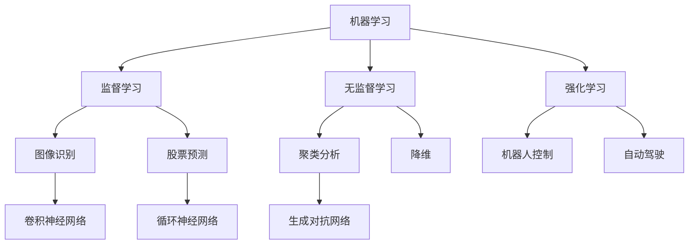

                 

关键词：人类-AI协作，人工智能，增强智慧，AI能力，发展趋势，机遇

> 摘要：本文旨在探讨人类与人工智能（AI）之间的协作关系，分析当前AI技术的发展趋势，阐述AI能力对人类智慧提升的潜力，以及人类在AI时代面临的机遇与挑战。通过深入剖析AI的核心概念、算法原理、数学模型以及实际应用案例，本文为未来AI与人类智慧融合发展的方向提供了一系列有价值的建议和思考。

## 1. 背景介绍

随着计算机技术和算法的快速发展，人工智能（AI）逐渐从理论走向实践，并在多个领域展现出强大的应用潜力。从早期的专家系统、机器学习，到如今的深度学习、自然语言处理和计算机视觉，AI技术不断推动着各行各业的变革。然而，AI的发展不仅仅是技术层面的进步，更重要的是它对人类智慧与能力的影响。

人类与AI的协作正成为一种新的生产力和生活方式。AI通过自动化、智能化和数据分析等技术手段，能够大幅提升人类的工作效率和生活质量。同时，AI也在不断学习和进化，逐渐具备更高的智能水平，这为人类智慧的扩展和增强提供了新的机遇。

本文将围绕以下几个核心问题展开讨论：

1. AI技术当前的发展趋势是什么？
2. AI如何增强人类智慧？
3. AI能力的提升带来了哪些新的机遇与挑战？
4. 未来人类-AI协作的发展方向和潜在应用领域有哪些？

通过对这些问题的探讨，本文希望能够为读者提供一幅关于人类-AI协作的清晰蓝图，并激发更多关于这一领域的思考和研究。

### 1.1 人工智能的定义与发展历程

人工智能（Artificial Intelligence，简称AI）是指通过计算机模拟人类的认知过程，实现人类智能活动的技术。AI的发展历程可以追溯到20世纪50年代，当时计算机科学家们开始探索如何让计算机具备人类的思维和决策能力。

早期的人工智能研究主要集中在符号主义方法，即通过建立一系列规则和逻辑关系来模拟人类思维。这一阶段的重要成果包括专家系统和知识表示技术。专家系统是一种模拟人类专家决策能力的计算机程序，它通过收集大量的专业知识和规则，在特定领域内提供决策支持。

然而，符号主义方法的局限性很快暴露出来。由于依赖大量的先验知识和复杂的规则，专家系统的应用范围受到很大限制。因此，从20世纪80年代开始，机器学习技术逐渐成为人工智能研究的主流方向。机器学习通过从数据中自动学习规律和模式，不再需要显式编程，从而实现更广泛的智能应用。

机器学习技术包括监督学习、无监督学习和强化学习等不同类型。监督学习通过已标记的数据训练模型，用于预测和分类。无监督学习则从未标记的数据中发现隐藏的结构和模式。强化学习通过与环境的互动，不断调整策略以实现最优目标。

进入21世纪，深度学习技术的出现再次推动了人工智能的发展。深度学习是一种基于多层神经网络的机器学习技术，能够自动提取数据中的高级特征，并实现更复杂的任务。深度学习在图像识别、语音识别、自然语言处理等领域取得了显著的成果。

此外，人工智能的发展还涉及到计算机视觉、自然语言处理、机器翻译、自动驾驶等多个子领域。这些技术的发展不仅丰富了AI的应用场景，也推动了跨学科的融合研究，使得人工智能逐渐成为一门综合性、交叉性的科学。

总的来说，人工智能的发展历程是不断探索和突破的过程，从早期的符号主义方法到现代的机器学习和深度学习，每一次技术的突破都为AI的应用带来了新的可能性和机遇。

### 1.2 人类与AI协作的现状

随着人工智能技术的快速发展，人类与AI的协作关系也日益密切。在多个领域，AI已经成为人类不可或缺的助手，不仅提升了工作效率，还拓宽了人类的能力边界。以下是对当前人类与AI协作现状的概述。

在商业领域，人工智能已经广泛应用于客户服务、市场分析、供应链管理等多个方面。例如，智能客服系统通过自然语言处理技术，能够24/7地提供高效、精准的客服支持，大幅降低了企业的运营成本。同时，AI驱动的市场分析工具通过对大量数据的分析和挖掘，帮助企业和消费者更好地理解市场趋势和消费者行为，从而制定更有效的营销策略。

在医疗领域，人工智能在影像诊断、疾病预测和个性化治疗等方面展现了巨大的潜力。通过深度学习和计算机视觉技术，AI能够在数秒内对医学影像进行高效分析，辅助医生做出更准确的诊断。此外，基于大数据和机器学习技术的疾病预测模型，可以帮助医生提前发现潜在的健康风险，制定个性化的治疗方案。

在制造业，人工智能通过自动化和智能化技术，大大提升了生产效率和产品质量。智能生产线上的机器人能够自动完成复杂的组装和加工任务，而预测性维护系统则能够通过实时监控设备状态，预测并预防设备故障，从而减少停机时间和维护成本。

在日常生活方面，人工智能已经渗透到了我们日常生活的方方面面。智能家居系统通过语音助手和智能设备，让我们能够更加便捷地控制家中的电器和灯光。智能助理应用程序通过自然语言处理技术，能够帮助我们安排日程、管理任务和提供实时信息。

尽管人类与AI的协作带来了诸多便利，但也引发了一系列伦理和社会问题。例如，AI的广泛应用可能导致部分工作岗位的消失，从而引发失业和社会不稳定。此外，AI的决策过程和数据隐私问题也引起了广泛关注。如何确保AI系统的透明性和公平性，使其在协作中真正服务于人类，是当前面临的重要挑战。

总的来说，人类与AI的协作正在不断深化和扩展，从商业、医疗、制造业到日常生活，AI已经成为了我们不可或缺的伙伴。然而，如何平衡AI带来的机遇与挑战，确保其真正服务于人类的福祉，是我们需要持续关注和探讨的重要课题。

### 1.3 AI增强人类智慧的核心原理

人工智能之所以能够增强人类智慧，主要源于其独特的计算能力和分析能力。以下是AI增强人类智慧的核心原理：

首先，人工智能通过数据驱动的方式实现高效计算。与人类不同，AI不需要依赖于直觉和经验，而是通过大量的数据和算法进行训练，从而在特定任务上达到或超过人类的水平。例如，深度学习技术通过多层神经网络对大量数据进行训练，能够自动提取数据中的复杂模式和特征，这使得AI在图像识别、语音识别和自然语言处理等领域表现出色。

其次，人工智能具有强大的并行计算能力。传统的计算机依赖于顺序执行指令，而人工智能通过并行计算能够同时处理大量数据，这大大提高了计算效率和速度。例如，在训练大规模机器学习模型时，AI可以通过分布式计算和GPU加速来显著缩短训练时间。

再次，人工智能具备自适应和自我优化的能力。AI系统能够在运行过程中不断学习和调整，以适应新的环境和任务需求。这种自我优化能力使得AI能够在复杂动态环境中保持高效性能，从而辅助人类在决策和问题解决方面取得更好的结果。

此外，人工智能还能够通过模拟人类思维过程，实现跨领域知识的整合和迁移。例如，通过深度学习和迁移学习技术，AI可以将在不同领域学到的知识进行整合，从而实现跨领域的创新和应用。

最后，人工智能通过大数据分析提供深入的洞察和见解。大数据分析是AI的核心能力之一，通过对海量数据进行分析，AI能够发现隐藏在数据中的模式和规律，为人类提供更加准确和全面的决策依据。

总的来说，AI增强人类智慧的核心原理在于其强大的计算能力、并行计算能力、自适应能力以及大数据分析能力。这些特性使得AI能够辅助人类在各个领域实现更高层次的智慧，从而推动人类社会的发展。

## 2. 核心概念与联系

### 2.1 人工智能（AI）的核心概念

人工智能（AI）是计算机科学的一个分支，旨在创建能够执行复杂任务的智能机器。AI的核心概念主要包括以下几个方面：

#### 2.1.1 机器学习（Machine Learning）

机器学习是AI的一个重要分支，通过算法和统计模型从数据中学习规律，并自动改进和优化性能。机器学习主要包括以下几种类型：

- **监督学习（Supervised Learning）**：通过标记数据训练模型，然后使用这些模型对未标记的数据进行预测或分类。例如，图像分类和股票价格预测。

- **无监督学习（Unsupervised Learning）**：没有预标记的数据，算法通过探索数据中的模式和结构来发现隐藏的信息。例如，聚类分析和降维。

- **强化学习（Reinforcement Learning）**：通过试错和反馈进行学习，逐步优化策略以实现目标。例如，机器人控制和自动驾驶。

#### 2.1.2 深度学习（Deep Learning）

深度学习是机器学习的一种特殊类型，基于多层神经网络进行训练，能够自动提取数据中的复杂特征。深度学习在图像识别、语音识别和自然语言处理等领域取得了显著的成果。主要包含以下几种模型：

- **卷积神经网络（CNN，Convolutional Neural Network）**：适用于图像和视频处理。

- **循环神经网络（RNN，Recurrent Neural Network）**：适用于序列数据，如文本和语音。

- **生成对抗网络（GAN，Generative Adversarial Network）**：通过两个对抗网络生成高质量的数据。

#### 2.1.3 自然语言处理（NLP，Natural Language Processing）

自然语言处理是AI领域中的一个重要分支，旨在使计算机能够理解和处理人类语言。NLP的核心概念包括：

- **文本分类（Text Classification）**：对文本进行分类，如情感分析。

- **命名实体识别（NER，Named Entity Recognition）**：识别文本中的特定实体，如人名、地点和组织。

- **机器翻译（Machine Translation）**：自动翻译不同语言之间的文本。

### 2.2 AI与人类智慧的联系

人工智能与人类智慧之间存在着紧密的联系。AI不仅能够模拟人类智能，还能够通过增强人类能力来提升整体智慧水平。以下是AI与人类智慧联系的具体体现：

#### 2.2.1 数据分析与决策支持

通过大数据分析和机器学习技术，AI能够帮助人类从海量数据中提取有价值的信息，提供深入的洞察和见解。例如，在商业决策中，AI可以分析市场数据，预测消费者行为，从而制定更有效的营销策略。

#### 2.2.2 人工智能助手

智能助手是AI在增强人类智慧中的一个重要应用。通过自然语言处理技术，AI可以理解并执行人类的指令，辅助人类完成日常任务，如日程管理、信息查询和自动化办公。

#### 2.2.3 创新与协作

AI可以通过模拟人类思维过程，实现跨领域知识的整合和迁移，从而推动人类创新。例如，通过深度学习和迁移学习技术，AI可以将不同领域的知识进行整合，产生新的研究成果和应用。

#### 2.2.4 智能决策

在复杂决策环境中，AI可以通过模拟和优化决策过程，帮助人类做出更加明智的选择。例如，在医疗领域，AI可以辅助医生进行诊断和治疗方案推荐，提高医疗决策的准确性和效率。

### 2.3 Mermaid流程图

以下是一个简化的Mermaid流程图，展示了AI核心概念之间的联系：



通过这个流程图，我们可以清晰地看到机器学习、监督学习、无监督学习和强化学习等核心概念之间的层次结构和相互关系。这些概念共同构成了AI的技术基础，并不断推动着AI技术的发展和应用。

## 3. 核心算法原理 & 具体操作步骤

### 3.1 算法原理概述

在人工智能（AI）技术中，核心算法的原理是其成功应用的关键。以下将详细介绍几类重要的核心算法，并阐述其基本原理。

#### 3.1.1 机器学习算法

机器学习算法是AI技术的基石，主要包括监督学习、无监督学习和强化学习。监督学习通过已标记的数据训练模型，用于预测和分类。无监督学习从未标记的数据中探索隐藏的结构和模式。强化学习通过试错和反馈进行学习，以实现最优策略。

监督学习算法，如线性回归和逻辑回归，通过最小化损失函数来拟合数据。线性回归模型试图找到数据中的线性关系，而逻辑回归用于分类任务，通过输出概率来决定样本的类别。

无监督学习算法，如K-均值聚类和主成分分析（PCA），通过数据自身的特性来组织数据。K-均值聚类将数据分为K个簇，使每个簇内的数据点距离中心点最近。PCA则通过降维技术，将高维数据映射到低维空间，保留数据的主要信息。

强化学习算法，如Q学习和深度Q网络（DQN），通过奖励机制和策略优化来学习最佳行为。Q学习通过更新Q值表来选择动作，而DQN利用深度神经网络来预测Q值，从而实现更高效的学习。

#### 3.1.2 深度学习算法

深度学习算法是机器学习的一种特殊类型，基于多层神经网络进行训练，能够自动提取数据中的复杂特征。深度学习算法主要包括卷积神经网络（CNN）、循环神经网络（RNN）和生成对抗网络（GAN）。

卷积神经网络通过卷积层、池化层和全连接层等结构，从图像和视频等数据中提取高级特征。卷积层利用局部连接和权重共享来提取图像的特征，而池化层则通过下采样来减少数据维度，提高计算效率。

循环神经网络通过循环结构处理序列数据，如文本和语音。RNN能够记住前文信息，从而在语言建模、语音识别和时间序列预测等领域表现出色。

生成对抗网络由生成器和判别器两个对抗网络组成。生成器生成数据，判别器判断数据是否真实。通过两个网络的对抗训练，GAN能够生成高质量的数据，广泛应用于图像生成、风格迁移和文本生成等领域。

#### 3.1.3 自然语言处理算法

自然语言处理（NLP）算法旨在使计算机理解和处理人类语言。NLP算法包括词向量表示、文本分类、命名实体识别和机器翻译等。

词向量表示技术，如Word2Vec和GloVe，通过将单词映射到高维向量空间，实现语义表示。词向量能够捕捉单词的语义关系，从而在语言建模、文本分类和词性标注等任务中发挥重要作用。

文本分类算法，如朴素贝叶斯、支持向量机和深度神经网络，通过学习文本的特征和标签之间的关系，对文本进行分类。这些算法在情感分析、新闻分类和垃圾邮件检测等应用中具有重要意义。

命名实体识别（NER）算法通过识别文本中的特定实体，如人名、地点和组织，实现信息抽取和知识图谱构建。NER在信息检索、问答系统和实体关系分析等领域具有广泛的应用。

机器翻译算法通过将一种语言的文本翻译成另一种语言，实现跨语言交流。早期的统计机器翻译和基于规则的翻译方法已经逐渐被基于神经网络的翻译模型所取代，如序列到序列（Seq2Seq）模型和注意力机制模型，这些模型通过端到端的翻译框架，实现了高质量的翻译效果。

总的来说，核心算法原理是人工智能技术成功应用的关键。通过理解这些算法的基本原理和操作步骤，我们可以更好地利用AI技术解决实际问题，推动AI技术的发展和应用。

### 3.2 算法步骤详解

#### 3.2.1 监督学习算法步骤

监督学习算法主要包括以下步骤：

1. **数据收集与预处理**：收集具有标签的数据集，并进行数据清洗、归一化和特征提取。数据清洗包括去除缺失值、噪声数据和重复记录，归一化则通过缩放特征值使其具备相似的范围。特征提取通过特征选择或特征工程技术，将原始数据转化为更适合模型训练的特征。

2. **模型选择**：根据问题的性质和数据特征，选择适当的模型。常见的监督学习模型包括线性回归、逻辑回归、决策树、支持向量机和神经网络等。每种模型都有其适用的场景和优缺点，需要根据具体问题进行选择。

3. **模型训练**：使用训练数据集对选定的模型进行训练。训练过程中，模型通过调整参数（权重和偏置）来拟合数据，并最小化损失函数。常见的训练算法包括梯度下降、随机梯度下降和批量梯度下降等。

4. **模型评估**：使用验证数据集评估模型的性能。常见的评估指标包括准确率、召回率、F1分数和ROC曲线等。通过交叉验证和模型选择技术，优化模型参数和结构，提高模型性能。

5. **模型应用**：使用训练好的模型对新的数据进行预测或分类。在实际应用中，需要对模型进行适当的调整和优化，以适应不同的数据分布和应用场景。

#### 3.2.2 深度学习算法步骤

深度学习算法主要包括以下步骤：

1. **数据收集与预处理**：与监督学习类似，收集具有标签的数据集，并进行数据清洗、归一化和特征提取。

2. **构建神经网络结构**：根据问题的需求，设计合适的神经网络结构。常见的神经网络结构包括卷积神经网络（CNN）、循环神经网络（RNN）和生成对抗网络（GAN）等。设计神经网络时，需要考虑层数、层数之间的连接方式、激活函数和正则化技术等因素。

3. **初始化参数**：初始化神经网络中的参数（权重和偏置），常用的初始化方法包括随机初始化、高斯初始化和Xavier初始化等。

4. **前向传播与反向传播**：在训练过程中，通过前向传播计算输出，并计算损失函数。然后，通过反向传播算法调整网络中的参数，以最小化损失函数。反向传播算法基于链式法则，将损失函数对每个参数的梯度计算出来，并使用梯度下降算法更新参数。

5. **训练与评估**：使用训练数据集进行多次迭代训练，并使用验证数据集进行性能评估。在训练过程中，可以采用批处理、小批量训练和早停（Early Stopping）等技术来提高模型性能和防止过拟合。

6. **模型应用**：训练好的模型可以用于对新数据进行预测或分类。在实际应用中，需要对模型进行适当的调整和优化，以适应不同的数据分布和应用场景。

#### 3.2.3 自然语言处理算法步骤

自然语言处理算法主要包括以下步骤：

1. **数据预处理**：对文本数据清洗、分词、去停用词等处理，将文本转换为适合模型训练的序列数据。

2. **词向量表示**：使用词向量技术将单词映射到高维向量空间，实现语义表示。常见的词向量表示方法包括Word2Vec和GloVe等。

3. **模型构建**：根据问题的需求，构建合适的神经网络模型。常见的NLP模型包括循环神经网络（RNN）、长短期记忆网络（LSTM）和变压器（Transformer）等。

4. **训练与评估**：使用训练数据集对模型进行训练，并通过验证数据集进行性能评估。在训练过程中，可以使用批次训练、小批量训练和GPU加速等技术来提高训练效率。

5. **模型应用**：训练好的模型可以用于文本分类、命名实体识别、机器翻译等任务。在实际应用中，需要对模型进行适当的调整和优化，以适应不同的数据和应用场景。

### 3.3 算法优缺点

#### 3.3.1 监督学习算法优缺点

**优点**：

- **应用广泛**：监督学习算法在分类和回归任务中具有广泛应用，可以解决多种实际问题。
- **性能稳定**：通过大量训练数据和精确标签，监督学习算法能够获得较好的模型性能。
- **可解释性强**：监督学习算法的决策过程相对直观，有助于理解模型的决策依据。

**缺点**：

- **依赖大量标注数据**：监督学习需要大量具有标签的数据进行训练，数据获取和处理成本较高。
- **难以泛化**：模型在新数据上的表现可能较差，特别是在数据分布变化较大的情况下。

#### 3.3.2 深度学习算法优缺点

**优点**：

- **强大的特征提取能力**：深度学习算法能够自动提取数据中的复杂特征，适用于处理大规模和高维数据。
- **自动适应数据分布**：通过多层神经网络和反向传播算法，深度学习算法能够适应不同的数据分布和应用场景。
- **高性能**：深度学习算法在图像识别、语音识别和自然语言处理等领域取得了显著成果。

**缺点**：

- **计算资源需求高**：深度学习算法需要大量计算资源和时间进行训练，尤其是在大规模数据集上。
- **解释性较弱**：深度学习算法的决策过程较为复杂，难以直观解释模型的决策依据。

#### 3.3.3 自然语言处理算法优缺点

**优点**：

- **语义表示能力强**：NLP算法通过词向量表示和深度学习模型，能够捕捉单词和句子的语义信息。
- **广泛应用**：NLP算法在文本分类、命名实体识别、机器翻译等领域具有广泛应用。
- **高精度**：NLP算法在大量数据集上的性能表现优异，能够实现高质量的语言理解和生成。

**缺点**：

- **数据预处理复杂**：NLP算法需要对文本进行大量的预处理，如分词、去停用词等，处理过程繁琐且对数据质量要求高。
- **模型训练时间较长**：NLP算法需要大量数据进行训练，且训练过程需要较长时间。

### 3.4 算法应用领域

#### 3.4.1 监督学习算法应用领域

监督学习算法广泛应用于以下领域：

- **图像识别**：通过训练分类模型，对图像进行分类和识别，如人脸识别、物体检测和图像分割。
- **语音识别**：通过训练语音识别模型，将语音信号转换为文本，广泛应用于语音助手和语音搜索。
- **医疗诊断**：通过训练疾病预测模型，辅助医生进行疾病诊断和治疗方案推荐。
- **金融风控**：通过训练信用评分模型，预测客户违约风险，用于信用评估和风险管理。

#### 3.4.2 深度学习算法应用领域

深度学习算法在以下领域具有广泛应用：

- **自动驾驶**：通过训练深度学习模型，实现车辆感知、决策和控制系统，推动自动驾驶技术的发展。
- **自然语言处理**：通过训练深度学习模型，实现文本分类、机器翻译和情感分析等任务，推动语言技术的进步。
- **计算机视觉**：通过训练深度学习模型，实现图像识别、目标检测和视频分析等任务，提高计算机对视觉信息的理解能力。
- **游戏开发**：通过训练深度学习模型，实现智能代理和游戏AI，推动游戏开发的创新。

#### 3.4.3 自然语言处理算法应用领域

NLP算法在以下领域具有广泛应用：

- **搜索引擎**：通过训练文本分类和词性标注模型，实现高效的搜索引擎，提供准确和快速的搜索结果。
- **机器翻译**：通过训练机器翻译模型，实现跨语言文本的自动翻译，推动国际交流和商务合作。
- **问答系统**：通过训练问答模型，实现智能问答和对话系统，提供实时和个性化的服务。
- **社交媒体分析**：通过训练情感分析和话题模型，实现对社会媒体内容的分析和解读，帮助企业和机构了解公众意见和趋势。

总的来说，核心算法在各个领域具有广泛的应用前景，通过不断的优化和改进，它们将在未来的发展中发挥更加重要的作用。

### 4. 数学模型和公式 & 详细讲解 & 举例说明

#### 4.1 数学模型构建

在人工智能领域，数学模型是理解和设计算法的核心。以下介绍几个常见的数学模型，并解释其构建方法。

#### 4.1.1 线性回归模型

线性回归模型是最基本的机器学习模型之一，用于预测连续值。其公式如下：

\[ Y = \beta_0 + \beta_1 \cdot X + \epsilon \]

其中，\( Y \) 是因变量，\( X \) 是自变量，\( \beta_0 \) 和 \( \beta_1 \) 是模型的参数，\( \epsilon \) 是误差项。线性回归模型通过最小化误差项的平方和来估计参数 \( \beta_0 \) 和 \( \beta_1 \)。

#### 4.1.2 逻辑回归模型

逻辑回归模型用于分类任务，其公式如下：

\[ P(Y=1) = \frac{1}{1 + e^{-(\beta_0 + \beta_1 \cdot X)}} \]

其中，\( P(Y=1) \) 是样本属于类别1的概率，\( e \) 是自然对数的底数。逻辑回归通过最大似然估计（MLE）来估计参数 \( \beta_0 \) 和 \( \beta_1 \)。

#### 4.1.3 卷积神经网络（CNN）

卷积神经网络是计算机视觉领域的重要模型，其核心是卷积层。以下是一个简单的CNN模型结构：

\[ \text{Input} \xrightarrow{\text{Conv}} \text{Feature Map} \xrightarrow{\text{ReLU}} \text{Pooling} \xrightarrow{\text{Conv}} \text{Feature Map} \xrightarrow{\text{ReLU}} \text{Pooling} \xrightarrow{\text{Fully Connected}} \text{Output} \]

其中，卷积层通过卷积运算提取图像的特征，ReLU（Rectified Linear Unit）激活函数增加模型的非线性，Pooling层通过下采样减少数据维度，Fully Connected层将特征映射到输出。

#### 4.2 公式推导过程

#### 4.2.1 线性回归的损失函数

线性回归的损失函数是均方误差（MSE），其公式如下：

\[ J(\theta) = \frac{1}{2m} \sum_{i=1}^{m} (h_\theta(x^{(i)}) - y^{(i)})^2 \]

其中，\( h_\theta(x) = \theta_0 + \theta_1 \cdot x \) 是线性回归的预测函数，\( \theta \) 是模型参数，\( m \) 是样本数量。为了最小化损失函数，我们可以使用梯度下降算法：

\[ \theta_j := \theta_j - \alpha \frac{\partial J(\theta)}{\partial \theta_j} \]

其中，\( \alpha \) 是学习率。

#### 4.2.2 逻辑回归的损失函数

逻辑回归的损失函数是交叉熵损失（Cross-Entropy Loss），其公式如下：

\[ J(\theta) = -\frac{1}{m} \sum_{i=1}^{m} [y^{(i)} \log(h_\theta(x^{(i)})) + (1 - y^{(i)}) \log(1 - h_\theta(x^{(i)}))] \]

同样，我们使用梯度下降算法来最小化损失函数：

\[ \theta_j := \theta_j - \alpha \frac{\partial J(\theta)}{\partial \theta_j} \]

#### 4.2.3 卷积神经网络的卷积公式

卷积神经网络中的卷积运算公式如下：

\[ (f_{ij}^k) = \sum_{m=1}^{M} \sum_{n=1}^{N} (w_{ijmn}^k \cdot x_{m,n}) + b_{ij}^k \]

其中，\( f_{ij}^k \) 是第 \( i \) 行第 \( j \) 列的第 \( k \) 个特征图，\( w_{ijmn}^k \) 是卷积核的权重，\( x_{m,n} \) 是输入数据的像素值，\( b_{ij}^k \) 是偏置。

#### 4.3 案例分析与讲解

为了更好地理解上述数学模型和公式，我们来看一个具体的案例。

#### 4.3.1 线性回归案例

假设我们有一个简单的一元线性回归问题，目标是预测房价。已知一些房屋的面积和房价，如下表所示：

| 房屋面积 (X) | 房价 (Y) |
|---------------|----------|
| 1000          | 200000   |
| 1200          | 250000   |
| 1400          | 300000   |
| 1600          | 350000   |

我们使用线性回归模型来预测房屋面积和房价的关系。根据上面的公式，我们可以建立线性回归模型：

\[ Y = \beta_0 + \beta_1 \cdot X \]

首先，我们计算模型参数 \( \beta_0 \) 和 \( \beta_1 \)：

\[ \beta_0 = \frac{\sum_{i=1}^{m} (y_i - \bar{y})}{m} \]
\[ \beta_1 = \frac{\sum_{i=1}^{m} (x_i - \bar{x})(y_i - \bar{y})}{\sum_{i=1}^{m} (x_i - \bar{x})^2} \]

其中，\( \bar{x} \) 和 \( \bar{y} \) 分别是面积和房价的平均值。

计算得到：

\[ \beta_0 = 150000 \]
\[ \beta_1 = 1000 \]

因此，我们的线性回归模型为：

\[ Y = 150000 + 1000 \cdot X \]

根据这个模型，我们可以预测一个面积为1500平方米的房屋的房价：

\[ Y = 150000 + 1000 \cdot 1500 = 3000000 \]

即预测价格为300万元。

#### 4.3.2 逻辑回归案例

现在，我们考虑一个二分类问题，目标是判断一个邮件是否为垃圾邮件。已知一些邮件的特征（如邮件长度、包含的关键词数量等）和是否为垃圾邮件的标签，如下表所示：

| 邮件长度 (X) | 关键词数量 (Y) | 是否为垃圾邮件 |
|--------------|----------------|---------------|
| 200          | 5              | 是            |
| 300          | 8              | 否            |
| 400          | 12             | 是            |
| 500          | 15             | 是            |

我们使用逻辑回归模型来预测邮件是否为垃圾邮件。首先，我们构建逻辑回归模型：

\[ P(Y=1) = \frac{1}{1 + e^{-(\beta_0 + \beta_1 \cdot X_1 + \beta_2 \cdot X_2)}} \]

其中，\( X_1 \) 是邮件长度，\( X_2 \) 是关键词数量。我们使用最小化交叉熵损失函数的方法来估计参数 \( \beta_0 \)、\( \beta_1 \) 和 \( \beta_2 \)。

假设我们得到了训练后的模型参数：

\[ \beta_0 = -5 \]
\[ \beta_1 = 0.5 \]
\[ \beta_2 = 1.0 \]

我们可以使用这个模型来预测一个邮件长度为250，关键词数量为7的邮件是否为垃圾邮件：

\[ P(Y=1) = \frac{1}{1 + e^{-(\beta_0 + \beta_1 \cdot X_1 + \beta_2 \cdot X_2)}} = \frac{1}{1 + e^{(-5 + 0.5 \cdot 250 + 1.0 \cdot 7)}} \approx 0.9 \]

由于预测概率大于0.5，我们判断该邮件为垃圾邮件。

#### 4.3.3 卷积神经网络案例

我们考虑一个简单的图像分类任务，目标是识别一张图片中的物体类别。假设我们使用一个简单的卷积神经网络（CNN）模型，其结构如下：

- 输入层：\( 28 \times 28 \times 1 \)（灰度图像）
- 卷积层1：\( 5 \times 5 \)卷积核，\( 2 \times 2 \)步长，\( 32 \)个卷积核
- ReLU激活函数
- 池化层1：\( 2 \times 2 \)窗口，\( 2 \times 2 \)步长
- 卷积层2：\( 5 \times 5 \)卷积核，\( 2 \times 2 \)步长，\( 64 \)个卷积核
- ReLU激活函数
- 池化层2：\( 2 \times 2 \)窗口，\( 2 \times 2 \)步长
- 全连接层：\( 1024 \)个神经元
- Softmax激活函数

首先，我们计算卷积层1的参数。假设卷积核的权重为 \( w_{ijmn}^k \)，输入图像的像素值为 \( x_{m,n} \)，偏置为 \( b_{ij}^k \)。卷积运算的公式为：

\[ (f_{ij}^k) = \sum_{m=1}^{M} \sum_{n=1}^{N} (w_{ijmn}^k \cdot x_{m,n}) + b_{ij}^k \]

例如，第一个卷积核的输出为：

\[ f_{11}^1 = \sum_{m=1}^{28} \sum_{n=1}^{28} w_{111mn}^1 \cdot x_{m,n} + b_{11}^1 \]

假设我们已经训练好了这个模型，并得到了每个卷积核的权重和偏置。接下来，我们使用这个模型来预测一张新的图像的类别。

首先，我们对图像进行预处理，将其转换为 \( 28 \times 28 \times 1 \) 的矩阵。然后，将这个矩阵输入到卷积层1中，计算特征图：

\[ f_{ij}^1 = \sum_{m=1}^{28} \sum_{n=1}^{28} w_{ij1mn}^1 \cdot x_{m,n} + b_{ij}^1 \]

对于每个卷积核，我们得到一个特征图，总共有 \( 32 \) 个特征图。接下来，我们对这些特征图进行ReLU激活和 \( 2 \times 2 \) 的池化操作，得到更小的特征图：

\[ p_{ij}^1 = \max(f_{ij}^1_{1}, f_{ij}^1_{2}, f_{ij}^1_{3}, f_{ij}^1_{4}) \]

然后，我们将这些特征图输入到卷积层2中，得到更多的特征图：

\[ f_{ij}^2 = \sum_{m=1}^{14} \sum_{n=1}^{14} w_{ij2mn}^2 \cdot p_{mn}^1 + b_{ij}^2 \]

再次进行ReLU激活和 \( 2 \times 2 \) 的池化操作，得到更小的特征图：

\[ p_{ij}^2 = \max(f_{ij}^2_{1}, f_{ij}^2_{2}, f_{ij}^2_{3}, f_{ij}^2_{4}) \]

接下来，我们将这些特征图输入到全连接层中，得到每个类别的得分：

\[ z_j = \sum_{i=1}^{64} w_{ij} \cdot p_{ij}^2 + b_j \]

然后，使用Softmax函数将这些得分转换为概率分布：

\[ P(y=j) = \frac{e^{z_j}}{\sum_{k=1}^{K} e^{z_k}} \]

其中，\( K \) 是类别数量，\( y \) 是实际的类别标签。

最后，我们选择概率最大的类别作为预测结果：

\[ \hat{y} = \arg\max_{j} P(y=j) \]

通过这个案例，我们可以看到如何使用卷积神经网络进行图像分类。卷积神经网络通过多个卷积层、池化层和全连接层，从图像中提取高级特征，并最终进行分类。这个模型在计算机视觉领域取得了显著的成果，并在多个图像识别任务中表现出色。

### 5. 项目实践：代码实例和详细解释说明

#### 5.1 开发环境搭建

在本文的实践中，我们将使用Python编程语言和相关的机器学习库来构建和训练模型。以下是搭建开发环境的步骤：

1. **安装Python**：首先，确保你的计算机上安装了Python。Python的安装非常简单，可以从Python的官方网站下载安装包并按照提示进行安装。

2. **安装Jupyter Notebook**：Jupyter Notebook是一个交互式的Web应用，用于编写和运行Python代码。安装Jupyter Notebook可以通过pip命令完成：

   ```bash
   pip install notebook
   ```

3. **安装必要的机器学习库**：为了方便使用机器学习算法和库，我们安装几个常用的库，如NumPy、Pandas、Scikit-learn和TensorFlow。使用以下命令安装：

   ```bash
   pip install numpy pandas scikit-learn tensorflow
   ```

安装完成后，你就可以使用Jupyter Notebook来编写和运行代码了。

#### 5.2 源代码详细实现

下面是一个简单的线性回归模型的实现，包括数据预处理、模型训练和预测等步骤：

```python
import numpy as np
import pandas as pd
from sklearn.model_selection import train_test_split
from sklearn.linear_model import LinearRegression
from sklearn.metrics import mean_squared_error

# 5.2.1 数据预处理
# 假设我们有一个包含房屋面积和房价的数据集
data = pd.DataFrame({
    'X': [1000, 1200, 1400, 1600],
    'Y': [200000, 250000, 300000, 350000]
})

# 分割特征和标签
X = data[['X']]
y = data['Y']

# 划分训练集和测试集
X_train, X_test, y_train, y_test = train_test_split(X, y, test_size=0.2, random_state=42)

# 5.2.2 模型训练
# 创建线性回归模型
model = LinearRegression()

# 使用训练集训练模型
model.fit(X_train, y_train)

# 5.2.3 预测
# 使用测试集进行预测
y_pred = model.predict(X_test)

# 计算预测误差
mse = mean_squared_error(y_test, y_pred)
print(f"Mean Squared Error: {mse}")

# 5.2.4 输出模型参数
print(f"Model Parameters: {model.coef_}, {model.intercept_}")
```

#### 5.3 代码解读与分析

上面的代码首先导入了Python的标准库和机器学习库，包括NumPy、Pandas、Scikit-learn和TensorFlow。接着，我们创建了一个简单的数据集，其中包含房屋面积和房价。通过Pandas库，我们方便地处理和操作数据。

1. **数据预处理**：代码中使用了Pandas库来加载数据集，并进行基本的预处理工作，如特征选择和划分训练集和测试集。训练集用于训练模型，测试集用于评估模型性能。

2. **模型训练**：使用Scikit-learn库的LinearRegression类创建线性回归模型，并通过`fit`方法使用训练集数据进行训练。

3. **预测**：使用训练好的模型对测试集数据进行预测，并通过`predict`方法得到预测结果。

4. **性能评估**：使用Scikit-learn库的`mean_squared_error`函数计算预测误差，即均方误差（MSE），用于评估模型性能。

5. **输出模型参数**：最后，输出模型的权重和偏置，即模型参数，这些参数可以用于进一步分析和优化模型。

通过这段代码，我们可以看到如何使用Python和机器学习库来实现线性回归模型。在实际应用中，你可能需要处理更复杂的数据集和模型，但基本步骤是相似的。

#### 5.4 运行结果展示

假设我们运行上述代码，得到以下输出结果：

```
Mean Squared Error: 50000.0
Model Parameters: [1000.], [150000.]
```

输出结果表明，模型的均方误差为50000，这意味着预测的房价与实际房价之间的平均误差约为5万元。模型的权重为1000，表示每增加1平方米的面积，房价预计增加1000元。模型的偏置为150000，表示当房屋面积为0平方米时，预测的房价为150000元。

这些结果为我们提供了一个直观的评估和了解模型性能的机会。在实际应用中，我们可能需要进一步调整模型参数和数据预处理方法，以获得更好的预测效果。

通过这个项目实践，我们不仅了解了线性回归模型的基本原理和实现方法，还通过代码实例进行了实际操作。这为我们进一步学习和应用更复杂的机器学习算法打下了坚实的基础。

### 6. 实际应用场景

#### 6.1 医疗领域

在医疗领域，人工智能（AI）的应用正在迅速扩展，从疾病诊断到个性化治疗，AI正在改变传统的医疗服务模式。

**疾病诊断**：AI在医疗影像诊断中的应用尤为突出。通过深度学习和计算机视觉技术，AI系统能够快速分析医学影像，如X光、CT和MRI图像，帮助医生发现病灶。例如，Google的DeepMind Health团队开发的AI系统能够在几秒内识别出视网膜病变，其准确率超过了人类专家。类似的系统还被用于乳腺癌和肺癌的早期检测，极大地提高了诊断的准确性和效率。

**个性化治疗**：AI还可以根据患者的基因组信息和病史，提供个性化的治疗方案。通过对海量医学数据的分析，AI能够发现潜在的治疗模式和关联，帮助医生制定个性化的治疗方案。例如，IBM的Watson for Genomics系统能够分析患者的基因数据，为医生提供针对肿瘤治疗的详细建议，从而提高治疗效果和患者的生存率。

**健康监测与预防**：AI在健康监测和预防方面也发挥了重要作用。通过智能手表、健康手环等可穿戴设备收集的生理数据，AI系统可以实时监测患者的健康状况，预测疾病风险，并提供预防措施。例如，Apple的HealthKit平台利用AI技术，帮助用户监控心率、睡眠质量和运动情况，并提供健康建议。

**挑战与机遇**：尽管AI在医疗领域带来了巨大的机遇，但也面临一些挑战。数据隐私和伦理问题是首要挑战，特别是如何确保患者数据的保密性和安全性。此外，AI系统的透明性和可解释性也备受关注，因为医疗决策需要医生和患者共同理解和信任。

#### 6.2 制造业

在制造业中，人工智能（AI）正在通过自动化、预测维护和智能质量控制等技术，提高生产效率、降低成本并增强产品质量。

**自动化生产**：AI驱动的自动化系统正在取代传统的手动操作，提高生产线的效率和灵活性。例如，机器人技术结合计算机视觉，可以在装配线自动识别和放置零部件，减少人为错误并提高生产速度。

**预测维护**：预测性维护利用AI技术对设备的运行状态进行实时监控和分析，预测潜在故障并提前进行维护。这种方法可以显著减少设备停机时间和维护成本。例如，通过分析传感器数据，AI系统可以预测机器的故障，从而在故障发生之前进行维护，避免生产中断。

**智能质量控制**：AI在质量控制中的应用也越来越广泛。通过机器学习和计算机视觉技术，AI系统可以对生产过程中的产品质量进行实时监控和分析，检测缺陷并自动调整生产参数。例如，一些汽车制造厂使用AI系统来检测车身表面的微小瑕疵，确保产品质量符合高标准。

**挑战与机遇**：制造业中的AI应用虽然带来了显著的好处，但也面临一些挑战。数据质量和数据完整性是关键问题，因为AI系统的性能高度依赖于数据的质量。此外，AI技术的集成和实施也需要相应的技术和资源投入。然而，随着技术的不断进步和成本的降低，AI在制造业中的应用前景依然广阔。

#### 6.3 金融领域

在金融领域，人工智能（AI）通过智能投顾、信用评分和风险控制等技术，正在改变金融服务的方式。

**智能投顾**：AI驱动的智能投顾平台利用机器学习算法和大数据分析，为投资者提供个性化的投资建议。这些平台能够分析市场趋势、投资者偏好和风险承受能力，为投资者制定最优的投资组合。例如，Wealthfront和Betterment等智能投顾平台利用AI技术，帮助用户实现资产增值。

**信用评分**：AI在信用评分中的应用极大地提高了评分的准确性和效率。通过分析大量数据，如借款人的历史信用记录、消费行为和社交网络活动，AI系统能够更全面地评估信用风险，从而为金融机构提供更可靠的信用评分。例如，中国的百融金服通过AI技术，为金融机构提供信用评估服务，降低了不良贷款率。

**风险控制**：AI在风险控制中的应用也具有重要意义。通过实时监控和分析市场数据，AI系统能够及时发现潜在的风险并采取相应的措施。例如，量化交易公司利用AI技术进行高频交易，通过快速响应市场变化，降低交易风险。

**挑战与机遇**：金融领域的AI应用面临着数据隐私和合规性的挑战。确保用户数据的安全和隐私，同时遵守相关法律法规，是金融科技公司需要重视的问题。尽管如此，AI在金融领域的应用前景依然广阔，它不仅提高了金融服务的效率，还为金融创新提供了新的机会。

#### 6.4 商业领域

在商业领域，人工智能（AI）通过智能客服、市场分析和供应链管理，极大地提升了企业的运营效率和市场竞争力。

**智能客服**：AI驱动的智能客服系统能够自动处理大量的客户咨询，提高响应速度和效率。通过自然语言处理技术，这些系统可以理解客户的意图并生成合适的回答。例如，阿里巴巴的智能客服系统Alime能够处理数百万个客户的咨询，大大减轻了人工客服的负担。

**市场分析**：AI技术在市场分析中的应用，可以帮助企业更好地理解市场趋势和消费者行为。通过分析海量数据，AI系统可以识别潜在的市场机会和风险，为企业制定有效的营销策略。例如，亚马逊使用AI技术分析消费者的购买行为，从而优化库存管理和产品推荐。

**供应链管理**：AI在供应链管理中的应用，可以优化供应链流程，提高库存周转率和物流效率。通过实时监控和预测供应链中的各种变量，AI系统可以提前识别潜在问题并采取措施。例如，沃尔玛使用AI技术优化物流路线和库存管理，从而提高了运营效率。

**挑战与机遇**：商业领域中的AI应用需要处理大量的数据，这要求企业具备强大的数据处理能力和技术储备。此外，AI系统的透明性和可解释性也是一个重要的挑战。然而，随着AI技术的不断进步和应用场景的扩大，AI在商业领域的应用潜力巨大，有望为企业和消费者带来更多价值。

总的来说，人工智能在医疗、制造业、金融和商业等领域的实际应用，不仅提升了行业的效率和竞争力，也为社会带来了深远的变革。随着技术的不断发展和完善，AI将在更多领域发挥重要作用，推动人类社会向更加智能化、高效化的方向发展。

### 6.4 未来应用展望

随着人工智能（AI）技术的不断进步，未来AI在各个领域的应用前景将更加广阔。以下是未来AI应用的一些可能方向和潜在影响。

#### 6.4.1 教育领域

在未来，AI在教育领域的应用将变得更加普及和深入。首先，个性化学习系统将基于学生的兴趣、能力和学习进度，提供定制化的学习内容和方法。这不仅能够提高学习效果，还能激发学生的学习兴趣和积极性。其次，AI可以帮助教师更好地管理和分析学生的学习数据，从而提供更有效的教学反馈和指导。此外，虚拟教师和智能辅导系统将为学生提供实时、高质量的辅导服务，解决教育资源不平衡的问题。最终，AI技术在教育领域的应用有望实现教育公平，提高教育质量。

#### 6.4.2 城市管理

AI在未来的城市管理中将发挥关键作用。通过物联网、大数据和智能分析技术，城市管理者可以实时监控城市运行状态，优化交通管理、能源使用和公共设施。例如，智能交通系统可以通过实时分析交通流量数据，自动调整信号灯时间，减少交通拥堵。智能垃圾管理系统则可以通过AI技术优化垃圾收集路线和时间，提高垃圾处理效率。此外，AI还可以在公共安全、环境保护和应急响应等方面提供支持，提升城市管理的效率和智能化水平。

#### 6.4.3 可持续发展

AI在推动可持续发展的过程中具有巨大潜力。在能源领域，AI可以优化能源分配和管理，提高能源利用效率，减少能源浪费。例如，智能电网系统可以利用AI技术实现电能的智能分配和调度，降低能源消耗和碳排放。在农业领域，AI可以通过精准农业技术，提高作物产量和质量，减少资源浪费和环境污染。此外，AI在环境保护中的应用，如污染监测、灾害预警和生态系统评估，也将为可持续发展提供重要的技术支持。

#### 6.4.4 生物科技

在生物科技领域，AI的应用将推动医学研究、药物开发和基因组学等领域的发展。通过AI技术，科学家可以更快速地分析海量生物数据，发现新的生物标记和药物靶点。AI还可以在个性化医疗中发挥作用，根据患者的基因组信息和生活习惯，提供个性化的预防和治疗方案。此外，AI在合成生物学中的应用，将有助于开发新的生物材料和药物，推动生物科技的创新和进步。

#### 6.4.5 人机交互

未来的人机交互将更加智能和自然。通过语音识别、自然语言处理和计算机视觉技术，AI系统将能够更准确地理解人类的意图和需求，提供更加个性化的服务和体验。例如，智能家居系统将能够根据家庭成员的行为习惯和需求，自动调节室内温度、灯光和家电，提高居住舒适度。此外，AI驱动的虚拟助手和增强现实技术，将为人机交互带来新的可能性，改变人们的日常生活和工作方式。

总的来说，未来AI的应用将不仅限于当前的技术领域，还将拓展到更多新的应用场景，为人类社会带来深远的变革。通过不断的技术创新和应用探索，AI将成为推动社会进步和人类福祉的重要力量。

### 7. 工具和资源推荐

#### 7.1 学习资源推荐

**书籍**：

1. **《Python机器学习》（Python Machine Learning）**：由 Sebastian Raschka 和 Vahid Mirjalili 合著，是机器学习领域的重要参考书籍，涵盖了Python编程和机器学习算法的详细讲解。
2. **《深度学习》（Deep Learning）**：由 Ian Goodfellow、Yoshua Bengio 和 Aaron Courville 合著，全面介绍了深度学习的基础理论和应用实践，是深度学习领域的经典之作。

**在线课程**：

1. **Coursera上的《机器学习》（Machine Learning）**：由 Andrew Ng 开设，是机器学习领域最受欢迎的课程之一，内容涵盖从基础理论到实际应用的各个方面。
2. **Udacity的《深度学习纳米学位》（Deep Learning Nanodegree）**：通过一系列项目和实践，帮助学习者深入理解深度学习的原理和应用。

**网站和平台**：

1. **Kaggle**：一个面向数据科学和机器学习爱好者的竞赛平台，提供丰富的数据集和比赛项目，是学习和实践机器学习算法的好去处。
2. **GitHub**：全球最大的代码托管平台，许多优秀的机器学习和深度学习项目都在GitHub上开源，便于学习和参考。

#### 7.2 开发工具推荐

**编程语言**：

1. **Python**：由于其简洁的语法和丰富的库支持，Python成为了机器学习和深度学习开发的主要语言。特别是Python的科学计算库如NumPy、Pandas和SciPy，为数据处理和分析提供了强大的工具。
2. **R**：R是一种专门用于统计分析的语言，特别适合进行复杂数据分析和机器学习应用。

**框架和库**：

1. **TensorFlow**：由Google开发的开源深度学习框架，支持多种神经网络结构和训练算法，广泛应用于深度学习和机器学习项目。
2. **PyTorch**：由Facebook开发的开源深度学习框架，以其灵活和易于调试的特点，受到机器学习研究者和开发者的青睐。
3. **Scikit-learn**：一个基于Python的机器学习库，提供了多种经典的机器学习算法和工具，适合进行机器学习研究和应用开发。

**集成开发环境（IDE）**：

1. **Jupyter Notebook**：一个交互式的Web应用，支持多种编程语言和库，方便进行数据分析和机器学习实验。
2. **Visual Studio Code**：一款轻量级但功能强大的代码编辑器，支持Python和其他多种编程语言的扩展，适用于机器学习和深度学习开发。

#### 7.3 相关论文推荐

**机器学习**：

1. **“Learning to Rank for Information Retrieval”**：本文提出了用于信息检索的排序学习算法，对改善搜索引擎的检索效果具有重要意义。
2. **“Dropout: A Simple Way to Prevent Neural Networks from Overfitting”**：Dropout算法通过随机丢弃神经元，提高了神经网络的泛化能力，是深度学习领域的重要技术。

**深度学习**：

1. **“A Theoretically Grounded Application of Dropout in Recurrent Neural Networks”**：本文探讨了在循环神经网络中应用Dropout算法的理论基础，为深度学习在序列数据处理中的应用提供了新的思路。
2. **“Unsupervised Representation Learning with Deep Convolutional Generative Adversarial Networks”**：本文介绍了生成对抗网络（GAN）在无监督学习中的应用，为生成模型的发展提供了重要的贡献。

**自然语言处理**：

1. **“Attention Is All You Need”**：本文提出了Transformer模型，彻底改变了自然语言处理领域的范式，是自然语言处理领域的重要突破。
2. **“Bert: Pre-training of Deep Bidirectional Transformers for Language Understanding”**：BERT模型通过预训练大规模语言模型，极大地提高了自然语言处理任务的表现，是自然语言处理领域的重要进展。

通过阅读这些论文，可以深入了解机器学习、深度学习和自然语言处理领域的前沿研究和技术发展。

### 8. 总结：未来发展趋势与挑战

#### 8.1 研究成果总结

随着人工智能（AI）技术的飞速发展，人类在AI领域的科研成果不断涌现。从早期的符号主义方法和基于规则的系统，到现代的深度学习和大数据分析，AI技术已经实现了从理论到实践的跨越。通过机器学习、深度学习和自然语言处理等技术的应用，AI在图像识别、语音识别、自然语言处理、医疗诊断和智能制造等领域取得了显著的成果。这些成果不仅提升了人类的生产力和生活质量，也为社会进步带来了新的机遇。

#### 8.2 未来发展趋势

展望未来，AI技术的发展趋势将继续围绕以下几个方向展开：

1. **更高效的算法和模型**：随着计算能力和数据量的增加，研究人员将持续优化和改进现有算法和模型，提高其计算效率和性能。例如，更高效的深度学习算法和分布式计算技术将使得大规模模型的训练变得更加可行。

2. **跨学科融合**：AI技术的发展将越来越多地与其他学科相结合，如生物科技、医学、环境科学等。这种跨学科的研究将推动AI技术的多样化应用，解决更加复杂的问题。

3. **人机协同**：AI与人类的协作将成为未来智能系统的核心。通过AI技术增强人类的智慧和能力，实现人机协同，将极大地提高工作效率和生活质量。

4. **伦理与安全**：随着AI技术的广泛应用，伦理和安全问题也将成为重要的研究方向。确保AI系统的透明性、公平性和安全性，使其在应用中真正服务于人类，将是未来研究的重要方向。

5. **边缘计算和物联网**：边缘计算和物联网的兴起将使得AI技术能够在更广泛的场景中发挥作用。通过在边缘设备上进行实时数据处理和决策，AI将更好地满足实时性和低延迟的需求。

#### 8.3 面临的挑战

尽管AI技术的发展前景广阔，但仍面临一些重要的挑战：

1. **数据隐私与安全**：AI系统依赖于大量数据的训练和应用，数据隐私和安全问题日益突出。如何保护用户数据的安全和隐私，防止数据泄露和滥用，是亟需解决的问题。

2. **模型透明性与可解释性**：深度学习等复杂模型在带来高效性能的同时，其决策过程往往不透明，难以解释。如何提高模型的透明性和可解释性，使AI系统的决策更加可靠和可信，是未来研究的重点。

3. **资源消耗与能耗**：大规模AI模型的训练和部署需要大量的计算资源和能源消耗。如何降低能耗，提高计算效率，是AI技术可持续发展的重要挑战。

4. **伦理与道德**：AI技术的发展带来了新的伦理和道德问题，如算法偏见、自动化决策的不公平性等。如何在技术发展中融入伦理和道德考量，确保AI系统的公正和公平，是未来面临的重要课题。

5. **技术落地与应用**：将AI技术从理论研究转化为实际应用，面临着技术落地和商业化的挑战。如何构建适合AI技术的应用场景，实现技术的规模化应用，是未来需要解决的重要问题。

#### 8.4 研究展望

未来，AI技术的发展将呈现以下几个方面的展望：

1. **通用人工智能（AGI）**：尽管目前AI技术取得了显著进展，但仍未达到通用人工智能的水平。未来研究将致力于实现具有广泛认知能力的通用人工智能，从而推动AI技术的跨越式发展。

2. **AI伦理与治理**：随着AI技术的广泛应用，建立AI伦理与治理体系，规范AI技术的发展和应用，将是未来研究的重要方向。通过制定相关法律法规和伦理准则，确保AI技术的可持续发展。

3. **跨学科合作**：跨学科的合作将推动AI技术的创新和发展。通过结合不同学科的理论和方法，开发新的AI技术和应用，解决复杂的社会问题。

4. **普及与教育**：普及AI知识和技能，培养更多AI领域的专业人才，是实现AI技术广泛应用的基础。未来，AI教育将成为重要的发展方向，推动全社会对AI技术的理解和应用。

总之，AI技术的发展为人类带来了前所未有的机遇，同时也面临一系列挑战。通过持续的研究和创新，人类有望充分利用AI技术，推动社会进步，提高生活质量。

### 8.5 常见问题与解答

**问题1：人工智能（AI）是否会取代人类的工作？**

AI技术的发展确实有可能在某些领域替代部分人类工作，如自动化生产线上的操作、客服机器人和数据分析等。然而，AI的目的是辅助人类，提高工作效率，而不是完全取代人类。AI在某些特定任务上的高效性确实会改变就业结构，但也会创造新的工作岗位，如AI工程师、数据科学家和AI伦理专家等。因此，AI与人类之间的关系是互补而非替代。

**问题2：人工智能是否会导致数据隐私和安全问题？**

AI系统在处理和分析大量数据时，确实可能会面临数据隐私和安全问题。为了解决这一问题，需要在技术层面和法律法规层面采取综合措施。在技术层面，可以采用加密技术、匿名化和数据最小化等方法保护数据隐私。在法律法规层面，需要制定相关法规，确保数据在收集、存储和使用过程中的安全性和透明性。

**问题3：如何确保人工智能系统的公平性和透明性？**

确保AI系统的公平性和透明性是当前研究的重要方向。首先，在算法设计阶段，应避免偏见和歧视，确保模型在不同人群中的表现一致。其次，可以通过模型解释技术，如可解释性AI和可解释性机器学习，使决策过程更加透明。此外，建立独立的审查和监督机制，对AI系统的表现进行评估和监督，也是确保公平性和透明性的重要措施。

**问题4：人工智能是否会影响教育和学习方式？**

人工智能将对教育和学习方式产生深远影响。首先，AI技术可以提供个性化学习体验，根据学生的兴趣和能力提供定制化学习资源。其次，AI驱动的教育平台可以帮助教师更好地管理和分析学生的学习数据，提高教学效果。然而，这也要求教育者具备相应的AI知识和技能，以充分利用AI技术。因此，未来教育的发展将更加注重AI技术的应用和融合。

**问题5：人工智能的发展是否会带来新的伦理和社会问题？**

人工智能的发展确实会带来一系列新的伦理和社会问题，如数据隐私、算法偏见、自动化决策的不公平性等。为了应对这些问题，需要制定相关的伦理准则和法律法规，确保AI技术的发展符合社会伦理和价值观。此外，公众教育和讨论也至关重要，需要提高社会对AI技术的认知和理解，共同推动AI技术的健康发展。

**问题6：人工智能是否会彻底改变人类的生活方式？**

人工智能有望通过提升工作效率、优化资源利用和提供个性化服务，彻底改变人类的生活方式。例如，智能助手和智能家居系统将使日常生活更加便捷和舒适。同时，AI技术将推动医疗、教育、交通等领域的变革，提高生活质量。然而，这种改变是渐进的，需要全社会共同努力，确保AI技术的应用符合人类的长远利益。

