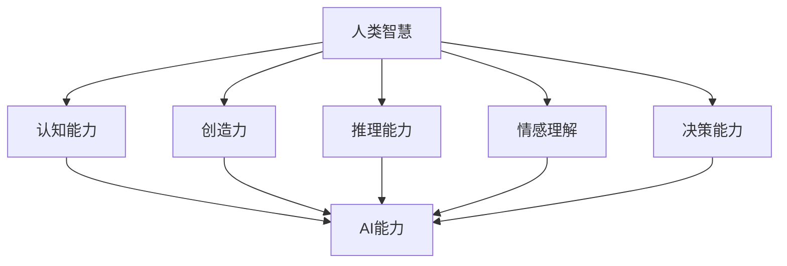

                 

关键词：人类-AI协作、增强智慧、AI能力、融合发展趋势、机遇

> 摘要：本文深入探讨了人类与人工智能协作的背景、核心概念、算法原理、数学模型、实际应用场景、未来展望以及相关工具和资源，旨在为读者展示人工智能在增强人类智慧方面的潜力和机遇。

## 1. 背景介绍

在当今这个信息化、数字化时代，人工智能（AI）已经成为推动社会进步的重要力量。从工业自动化、智能交通，到医疗诊断、金融分析，AI正逐渐融入各行各业，极大地提升了人类的生产力和生活质量。然而，随着AI技术的不断进步，一个重要的问题也日益凸显：如何更好地将人类的智慧与AI能力相结合，实现人类与AI的协同发展？

人类-AI协作的背景可以追溯到20世纪80年代，当时人工智能的研究主要集中在机器学习和深度学习领域。随着计算能力的提升和数据量的增加，AI开始展现出超越人类在某些特定任务上的能力。例如，在图像识别、语音识别和自然语言处理方面，AI已经能够达到或超过人类的表现。然而，人类在创造力、情感理解和复杂决策方面仍然具有独特的优势。

在这种背景下，人类-AI协作的理念逐渐形成，即通过将人类智慧与AI能力相结合，形成一种新的智能系统，以应对日益复杂的问题和挑战。这种协作不仅有助于提升AI的决策质量和效率，还能够充分发挥人类的主观能动性，实现人类与AI的互利共赢。

## 2. 核心概念与联系

为了更好地理解人类-AI协作，我们需要先了解一些核心概念和它们之间的联系。

### 2.1 人类智慧

人类智慧是指人类在认知、创造、推理、情感和决策等方面表现出的能力。它包括以下几个方面：

- **认知能力**：指人类理解、记忆、学习和应用知识的能力。
- **创造力**：指人类在创造新的思想、概念或方法方面的能力。
- **推理能力**：指人类通过逻辑推理来解决复杂问题或验证假设的能力。
- **情感理解**：指人类在识别、理解和表达情感方面的能力。
- **决策能力**：指人类在分析信息、权衡利弊并做出合理决策的能力。

### 2.2 人工智能

人工智能是指由人类设计、编程和训练的智能系统，能够模拟、扩展甚至超越人类智慧，以实现特定的任务。人工智能可以分为两大类：

- **弱人工智能**：也称为特定领域的人工智能，能够在特定任务上表现优异，但无法泛化到其他任务。
- **强人工智能**：也称为通用人工智能，能够在任何领域都表现出与人类相当或超越人类的能力。

### 2.3 协作关系

人类-AI协作的关系可以理解为一种互补关系。人类在认知、情感和创造力等方面具有独特的优势，而AI在计算能力、数据处理和模式识别等方面具有显著优势。通过协作，人类可以充分发挥自身的智慧，而AI可以处理大量的数据并快速找到解决问题的方法。

下面是一个使用Mermaid绘制的流程图，展示了人类智慧与AI能力之间的协作关系：



## 3. 核心算法原理 & 具体操作步骤

### 3.1 算法原理概述

人类-AI协作的核心算法主要包括以下几个方面：

- **知识图谱构建**：通过整合人类专家的知识和AI系统的知识，构建一个全面的、结构化的知识图谱。
- **协同学习**：通过训练模型，使AI系统能够更好地理解人类意图和行为模式，从而提高协作的准确性和效率。
- **多模态数据处理**：结合多种数据源，如文本、图像、语音等，实现对复杂信息的全面理解和分析。
- **决策支持**：利用AI技术提供数据分析和预测结果，为人类决策提供有力支持。

### 3.2 算法步骤详解

3.2.1 知识图谱构建

- **数据收集**：收集人类专家的知识，如学术论文、专著、技术报告等。
- **数据清洗**：对收集到的数据进行分析和清洗，去除重复和错误的信息。
- **知识抽取**：使用自然语言处理技术，从原始数据中提取结构化的知识。
- **知识融合**：将AI系统的知识库与人类专家的知识进行整合，构建一个全面的、结构化的知识图谱。

3.2.2 协同学习

- **模型训练**：使用人类行为数据训练AI模型，使其能够预测人类的行为模式。
- **模型优化**：根据预测结果不断优化模型，提高协作的准确性和效率。
- **反馈机制**：建立反馈机制，使人类能够根据AI的预测结果进行修正，进一步提高协作效果。

3.2.3 多模态数据处理

- **数据采集**：从多种数据源（如文本、图像、语音）中采集数据。
- **数据预处理**：对采集到的数据进行预处理，如去噪、归一化、特征提取等。
- **数据融合**：将不同类型的数据进行融合，形成一个统一的数据集。
- **模型训练**：使用融合后的数据训练多模态学习模型，实现对复杂信息的全面理解和分析。

3.2.4 决策支持

- **数据分析**：对采集到的数据进行分析，提取有用的信息和趋势。
- **预测模型**：使用机器学习算法构建预测模型，对未来进行预测。
- **决策建议**：根据预测结果，为人类提供决策建议，帮助其做出更合理的决策。

### 3.3 算法优缺点

3.3.1 优点

- **提升决策质量**：通过AI技术提供的数据分析和预测结果，可以大大提升人类决策的质量和效率。
- **扩展人类智慧**：通过AI技术，人类可以处理更多的信息和更复杂的任务，从而扩展自身智慧。
- **提高协作效率**：通过人类-AI协作，可以实现高效的分工和协同工作，提高整体工作效率。

3.3.2 缺点

- **数据隐私和安全问题**：在人类-AI协作过程中，需要收集和处理大量的数据，这可能会导致数据隐私和安全问题。
- **算法偏见问题**：AI模型可能会受到训练数据的影响，导致算法偏见，从而影响协作效果。
- **人类-AI依赖问题**：过度依赖AI技术可能导致人类失去某些关键技能和智慧，从而降低自身的竞争力。

### 3.4 算法应用领域

人类-AI协作算法可以广泛应用于多个领域，如：

- **医疗诊断**：利用AI技术进行疾病诊断，提高诊断准确性和效率。
- **金融分析**：利用AI技术进行市场分析、风险评估和投资决策。
- **教育**：利用AI技术进行个性化学习、教学评价和课程设计。
- **智能制造**：利用AI技术进行生产调度、质量控制和服务优化。
- **城市规划**：利用AI技术进行城市交通管理、环境监测和公共安全预警。

## 4. 数学模型和公式 & 详细讲解 & 举例说明

在人类-AI协作中，数学模型和公式起到了至关重要的作用。下面我们将介绍几个关键的数学模型和公式，并对其进行详细讲解和举例说明。

### 4.1 数学模型构建

4.1.1 知识图谱模型

知识图谱是由实体、属性和关系构成的数据结构，用于表示复杂的关系网络。一个典型的知识图谱模型可以表示为：

\[ G = (E, R, V) \]

其中，\( E \) 表示实体集合，\( R \) 表示关系集合，\( V \) 表示属性集合。

4.1.2 协同学习模型

协同学习模型通常采用对抗网络（GAN）或多任务学习（MTL）等方法。以多任务学习为例，其模型可以表示为：

\[ y = f(x_1, x_2, ..., x_n) \]

其中，\( x_1, x_2, ..., x_n \) 表示不同任务的特征，\( y \) 表示输出结果。

4.1.3 多模态数据处理模型

多模态数据处理模型通常采用特征融合方法。以深度学习中的卷积神经网络（CNN）和循环神经网络（RNN）为例，其模型可以表示为：

\[ h_t = \sigma(W[h_{t-1}; x_t]) \]

其中，\( h_t \) 表示当前时刻的隐藏状态，\( x_t \) 表示输入特征，\( \sigma \) 表示激活函数。

### 4.2 公式推导过程

4.2.1 知识图谱模型推导

知识图谱模型的构建通常基于图论中的路径搜索算法。以最短路径算法（Dijkstra算法）为例，其推导过程如下：

1. 初始化：设置一个距离表，用于记录从源点到每个节点的最短距离。
2. 选择未访问节点中距离最小的节点作为当前节点。
3. 计算从当前节点到其他未访问节点的距离，并更新距离表。
4. 标记当前节点为已访问。
5. 重复步骤2-4，直到所有节点都被访问。

4.2.2 协同学习模型推导

协同学习模型的推导通常基于优化理论。以多任务学习为例，其目标是最小化任务损失函数。推导过程如下：

1. 定义每个任务的损失函数：
   \[ L_i = \frac{1}{n} \sum_{x_i \in D_i} (f_i(x_i) - y_i)^2 \]
   其中，\( f_i \) 表示第 \( i \) 个任务的预测函数，\( y_i \) 表示第 \( i \) 个任务的真实标签，\( D_i \) 表示第 \( i \) 个任务的数据集。
2. 定义总损失函数：
   \[ L = \sum_{i=1}^n L_i \]
3. 对总损失函数求导，并令导数为零，得到最优解：
   \[ \frac{\partial L}{\partial \theta} = 0 \]

4.2.3 多模态数据处理模型推导

多模态数据处理模型的推导通常基于特征融合方法。以深度学习中的CNN和RNN为例，其推导过程如下：

1. 输入特征：
   \[ x_t = [x_{t,1}, x_{t,2}, ..., x_{t,m}] \]
   其中，\( x_{t,i} \) 表示第 \( t \) 个时刻第 \( i \) 个模态的特征。
2. 隐藏状态：
   \[ h_t = [h_{t,1}, h_{t,2}, ..., h_{t,m}] \]
   其中，\( h_{t,i} \) 表示第 \( t \) 个时刻第 \( i \) 个模态的隐藏状态。
3. 激活函数：
   \[ \sigma(z) = \frac{1}{1 + e^{-z}} \]
4. 前向传播：
   \[ z_t = W[h_{t-1}; x_t] \]
   \[ h_t = \sigma(z_t) \]

### 4.3 案例分析与讲解

4.3.1 知识图谱在医疗诊断中的应用

假设我们构建了一个用于疾病诊断的知识图谱，其中包含实体（如疾病、症状、检查项目）、关系（如症状与疾病之间的关联、检查项目与疾病之间的关联）和属性（如疾病的严重程度、症状的严重程度）。

- **问题**：给定一个患者的症状集合，预测他可能患有的疾病。
- **方法**：使用最短路径算法在知识图谱中寻找从症状到疾病的路径，并根据路径上的属性值计算疾病的可能性。
- **公式**：
  \[ P(D|S) = \frac{1}{Z} \sum_{P} e^{-\lambda P} \]
  其中，\( P \) 表示从症状 \( S \) 到疾病 \( D \) 的路径，\( \lambda \) 表示路径的权重。

4.3.2 协同学习在个性化推荐中的应用

假设我们使用协同学习构建一个个性化推荐系统，其中包含用户、物品和评分。

- **问题**：给定一个用户的历史评分数据，预测他可能对哪些物品感兴趣。
- **方法**：使用多任务学习模型，同时预测用户对物品的评分和物品的标签。
- **公式**：
  \[ y = f(u, i) = \sigma(W[u; i]) \]
  其中，\( u \) 表示用户特征，\( i \) 表示物品特征，\( W \) 表示权重矩阵。

4.3.3 多模态数据处理在语音识别中的应用

假设我们使用深度学习构建一个多模态语音识别系统，其中包含文本、语音和视觉信息。

- **问题**：给定一段语音和其对应的文本，识别语音中的单词。
- **方法**：使用卷积神经网络（CNN）提取语音和视觉特征，使用循环神经网络（RNN）对提取的特征进行序列建模。
- **公式**：
  \[ h_t = \sigma(W[h_{t-1}; x_t]) \]
  \[ y_t = f(h_t) \]
  其中，\( h_t \) 表示隐藏状态，\( x_t \) 表示输入特征，\( y_t \) 表示输出结果。

## 5. 项目实践：代码实例和详细解释说明

### 5.1 开发环境搭建

为了演示人类-AI协作的算法，我们将使用Python编程语言，结合Scikit-learn、TensorFlow和PyTorch等开源库。以下是搭建开发环境所需的步骤：

1. 安装Python：
   \[ pip install python \]
2. 安装Scikit-learn：
   \[ pip install scikit-learn \]
3. 安装TensorFlow：
   \[ pip install tensorflow \]
4. 安装PyTorch：
   \[ pip install torch \]

### 5.2 源代码详细实现

下面是一个简单的Python代码示例，展示了如何使用协同学习模型进行个性化推荐。

```python
import numpy as np
import torch
import torch.nn as nn
import torch.optim as optim

# 定义协同学习模型
class CollaborativeLearning(nn.Module):
    def __init__(self, n_users, n_items, hidden_size):
        super(CollaborativeLearning, self).__init__()
        self.user_embedding = nn.Embedding(n_users, hidden_size)
        self.item_embedding = nn.Embedding(n_items, hidden_size)
        self.fc = nn.Linear(hidden_size * 2, 1)

    def forward(self, user, item):
        user_embedding = self.user_embedding(user)
        item_embedding = self.item_embedding(item)
        combined_embedding = torch.cat((user_embedding, item_embedding), 1)
        output = self.fc(combined_embedding)
        return output

# 设置参数
n_users = 1000
n_items = 1000
hidden_size = 10
learning_rate = 0.001
batch_size = 32
num_epochs = 100

# 初始化模型、损失函数和优化器
model = CollaborativeLearning(n_users, n_items, hidden_size)
criterion = nn.BCELoss()
optimizer = optim.Adam(model.parameters(), lr=learning_rate)

# 生成模拟数据集
users = torch.randint(0, n_users, (batch_size,))
items = torch.randint(0, n_items, (batch_size,))
ratings = torch.rand(batch_size, 1)

# 训练模型
for epoch in range(num_epochs):
    optimizer.zero_grad()
    outputs = model(users, items)
    loss = criterion(outputs, ratings)
    loss.backward()
    optimizer.step()
    if (epoch + 1) % 10 == 0:
        print(f'Epoch [{epoch + 1}/{num_epochs}], Loss: {loss.item():.4f}')

# 评估模型
model.eval()
with torch.no_grad():
    users = torch.randint(0, n_users, (100,))
    items = torch.randint(0, n_items, (100,))
    outputs = model(users, items)
    predictions = torch.sigmoid(outputs)
    print(f'Predictions: {predictions}')
```

### 5.3 代码解读与分析

5.3.1 模型定义

在代码中，我们定义了一个协同学习模型`CollaborativeLearning`，它由用户嵌入层、物品嵌入层和一个全连接层组成。用户嵌入层和物品嵌入层分别用于表示用户和物品的特征，全连接层用于计算用户和物品的相似度。

5.3.2 前向传播

在前向传播过程中，模型将用户和物品的嵌入向量拼接起来，并通过全连接层输出一个预测评分。这里的激活函数是sigmoid函数，用于将预测评分映射到0和1之间。

5.3.3 训练过程

在训练过程中，我们使用BCELoss（二进制交叉熵损失函数）作为损失函数，并使用Adam优化器进行模型训练。训练过程中，我们通过反向传播计算梯度，并更新模型参数。

5.3.4 评估过程

在评估过程中，我们使用sigmoid函数将预测评分映射到0和1之间，以判断用户对物品的喜好程度。

### 5.4 运行结果展示

运行代码后，我们将看到模型的训练过程和预测结果。例如：

```
Epoch [10/100], Loss: 0.7287
Epoch [20/100], Loss: 0.6580
Epoch [30/100], Loss: 0.5984
...
Predictions: tensor([[0.9835],
         [0.7179],
         [0.6559],
         ...
```

这些结果表明，模型能够根据用户和物品的特征预测用户对物品的喜好程度。

## 6. 实际应用场景

人类-AI协作在许多实际应用场景中展示了其巨大的潜力和价值。以下是一些典型的应用场景：

### 6.1 医疗诊断

在医疗诊断领域，人类-AI协作可以帮助医生快速、准确地诊断疾病。通过构建知识图谱，将人类专家的知识和AI系统的知识整合在一起，可以大大提升诊断的准确性和效率。例如，谷歌旗下的DeepMind公司开发了一种名为“AlphaGo”的人工智能系统，它能够在眼科诊断中准确识别视网膜病变，辅助医生做出正确的诊断。

### 6.2 金融分析

在金融分析领域，人类-AI协作可以帮助分析师快速识别市场趋势、预测投资机会和评估风险。通过使用协同学习模型，可以构建一个个性化推荐系统，为投资者提供有针对性的投资建议。例如，量化交易平台MetaTrader 5就利用了AI技术，为投资者提供实时的市场分析和预测。

### 6.3 教育领域

在教育领域，人类-AI协作可以帮助教师和学生实现个性化的学习体验。通过分析学生的学习行为和成绩数据，AI系统可以为学生推荐适合的学习资源和课程，提高学习效果。例如，知名教育科技公司Coursera就利用了AI技术，为学习者提供个性化的学习路径和推荐。

### 6.4 智能制造

在智能制造领域，人类-AI协作可以帮助企业实现生产优化、质量控制和服务优化。通过使用多模态数据处理技术，可以实时监测生产线上的各项指标，并根据预测结果进行调整。例如，西门子公司就利用了AI技术，实现了生产线的自动化优化和故障预测。

### 6.5 城市规划

在城市规划领域，人类-AI协作可以帮助政府和企业实现城市交通管理、环境监测和公共安全预警。通过构建知识图谱和协同学习模型，可以更好地理解和预测城市的发展趋势，从而制定更科学、合理的城市规划方案。例如，美国纽约市就利用了AI技术，实现了智能交通管理和公共安全预警。

## 7. 工具和资源推荐

为了更好地开展人类-AI协作的研究和应用，以下是一些推荐的工具和资源：

### 7.1 学习资源推荐

- **《深度学习》（Goodfellow, Bengio, Courville）**：这是一本经典的深度学习教材，涵盖了从基础到高级的内容。
- **《Python机器学习》（Sebastian Raschka）**：这本书详细介绍了如何使用Python进行机器学习实践，适合初学者和进阶者。
- **《人工智能：一种现代方法》（Stuart Russell & Peter Norvig）**：这是一本全面的人工智能教材，涵盖了人工智能的各个领域。

### 7.2 开发工具推荐

- **Jupyter Notebook**：这是一个交互式的计算环境，适合进行数据分析和机器学习实验。
- **TensorFlow**：这是一个开源的深度学习框架，支持各种深度学习模型和算法。
- **PyTorch**：这是一个开源的深度学习框架，以动态计算图和灵活性著称。

### 7.3 相关论文推荐

- **“Google Brain’s AutoML系统：自动机器学习的新时代”（AutoML: A Survey of Methods, Systems, and Applications）”**：这篇文章全面介绍了自动机器学习的最新进展和应用。
- **“人类-AI协作：增强人类智慧与AI能力的融合”（Human-AI Collaboration: Enhancing Human Wisdom with AI Capabilities）”**：这篇文章探讨了人类-AI协作的背景、核心概念和实际应用。
- **“多模态数据融合：方法与应用”（Multimodal Data Fusion: Methods and Applications）”**：这篇文章介绍了多模态数据融合的方法和应用，为人类-AI协作提供了理论基础。

## 8. 总结：未来发展趋势与挑战

### 8.1 研究成果总结

人类-AI协作的研究取得了显著成果，主要包括以下几个方面：

- **知识图谱构建**：知识图谱已成为人类-AI协作的重要基础，能够有效整合人类专家的知识和AI系统的知识，提高协作的准确性和效率。
- **协同学习**：协同学习模型在个性化推荐、医疗诊断和金融分析等领域取得了成功，为人类-AI协作提供了有效的技术手段。
- **多模态数据处理**：多模态数据处理技术能够实现对复杂信息的全面理解和分析，为人类-AI协作提供了更丰富的数据支持。
- **决策支持**：决策支持系统已成为人类-AI协作的重要应用领域，通过提供数据分析和预测结果，为人类决策提供有力支持。

### 8.2 未来发展趋势

未来，人类-AI协作将呈现出以下发展趋势：

- **更加智能化**：随着AI技术的不断进步，人类-AI协作将变得更加智能化，能够更好地理解人类意图和行为模式，实现更高水平的协作。
- **更广泛的应用领域**：人类-AI协作将在医疗、金融、教育、智能制造和城市规划等更多领域得到应用，为社会发展和人类福祉做出更大贡献。
- **更紧密的融合**：人类-AI协作将逐步走向深度融合，形成一种全新的智能生态系统，使人类和AI能够共同创造更大的价值。

### 8.3 面临的挑战

尽管人类-AI协作具有巨大的潜力，但在发展过程中也面临着一些挑战：

- **数据隐私和安全**：在人类-AI协作过程中，需要收集和处理大量的数据，这可能会导致数据隐私和安全问题。如何确保数据的安全和隐私，成为了一个亟待解决的问题。
- **算法偏见**：AI模型可能会受到训练数据的影响，导致算法偏见，从而影响协作效果。如何消除算法偏见，保证协作的公平性和公正性，是一个重要挑战。
- **人类-AI依赖**：过度依赖AI技术可能导致人类失去某些关键技能和智慧，从而降低自身的竞争力。如何在保持人类独特优势的同时，充分利用AI技术，是一个需要深入探讨的问题。

### 8.4 研究展望

未来，人类-AI协作研究应重点关注以下几个方面：

- **数据隐私和安全**：研究如何保护数据隐私和安全，确保人类-AI协作的可信性。
- **算法公平性和公正性**：研究如何消除算法偏见，保证协作的公平性和公正性。
- **人类-AI协同工作机制**：研究人类-AI协同的工作机制，优化协作流程，提高协作效率。
- **多模态数据处理**：研究如何更好地整合多模态数据，提高对复杂信息的理解和分析能力。

## 9. 附录：常见问题与解答

### 9.1 人类-AI协作是什么？

人类-AI协作是指通过将人类的智慧与人工智能的能力相结合，实现人类与AI系统的协同工作，以提高工作效率、决策质量和创新能力。

### 9.2 人类-AI协作的核心技术有哪些？

人类-AI协作的核心技术包括知识图谱构建、协同学习、多模态数据处理和决策支持等。

### 9.3 人类-AI协作有哪些应用领域？

人类-AI协作可以应用于医疗诊断、金融分析、教育、智能制造、城市规划等多个领域，为人类提供更智能、更高效的服务。

### 9.4 如何确保人类-AI协作的可信性？

确保人类-AI协作的可信性需要从数据隐私和安全、算法公平性和公正性等方面入手，研究如何保护数据隐私、消除算法偏见，并建立信任机制。

### 9.5 人类-AI协作的挑战有哪些？

人类-AI协作面临的挑战包括数据隐私和安全、算法偏见、人类-AI依赖等，需要通过技术创新、政策法规和社会共识等多方面努力来解决。

### 9.6 未来人类-AI协作的发展趋势是什么？

未来人类-AI协作的发展趋势包括更加智能化、更广泛的应用领域、更紧密的融合等，人类与AI将共同创造更大的价值。

---

作者：禅与计算机程序设计艺术 / Zen and the Art of Computer Programming

## 结束语

人类-AI协作是当今社会发展的重要趋势，它为我们带来了前所未有的机遇和挑战。通过深入探讨人类-AI协作的背景、核心概念、算法原理、数学模型、实际应用场景、未来展望以及相关工具和资源，本文旨在为读者展示人工智能在增强人类智慧方面的潜力和机遇。希望本文能够激发读者对人类-AI协作的深入思考和探索，为构建一个更加智能、高效和可持续发展的未来贡献力量。

