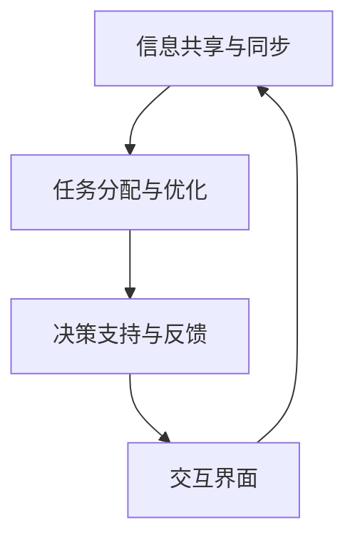

                 

关键词：人类-AI协作、智慧增强、AI能力融合、发展趋势、数据分析、技术展望

摘要：本文旨在探讨人类与人工智能（AI）之间的协作模式及其对人类智慧增强和AI能力融合的影响。通过分析当前的发展趋势，本文提出了一种新的协作框架，并对未来可能的应用场景进行了展望。

## 1. 背景介绍

随着人工智能技术的迅速发展，人类与机器之间的互动关系正发生着深刻的变化。传统的人工智能系统往往被视为“冷冰冰”的工具，而现代的AI系统则具备了更加灵活和智能的交互能力。这种变化促使人们开始思考如何更有效地将人类的智慧与AI的能力相结合，以实现协同创新和智慧增强。

在过去的几十年中，人类-AI协作的模式已经从简单的任务分配发展到复杂的决策支持系统。例如，医疗领域的AI辅助诊断系统、金融领域的智能投顾等，都在不断推动人类-AI协作的深化。然而，如何更好地利用AI技术来增强人类的智慧，以及如何构建一个高效、安全的协作体系，仍然是一个亟待解决的问题。

## 2. 核心概念与联系

### 2.1 人类智慧与AI能力的定义

**人类智慧**：智慧是指人类在认知、推理、学习、创造和解决问题等方面的综合能力。它不仅包括逻辑思维和数学能力，还包括情感智慧、人际交往智慧等。

**AI能力**：人工智能是指由计算机程序实现的、模仿或超越人类智能的算法和系统。AI能力包括感知、理解、学习、推理、决策和创造等。

### 2.2 人类-AI协作的框架

为了实现人类与AI的有效协作，我们需要构建一个包含以下关键组件的框架：

1. **信息共享与同步**：确保人类和AI系统之间的信息透明和实时同步。
2. **任务分配与优化**：根据人类和AI的优势进行任务分配，并优化协作流程。
3. **决策支持与反馈**：AI系统提供决策支持，并接收人类的反馈进行自我优化。
4. **交互界面**：设计直观、易用的交互界面，以便人类与AI系统之间的沟通。

### 2.3 Mermaid 流程图

下面是一个简单的Mermaid流程图，展示了人类-AI协作的基本框架：



## 3. 核心算法原理 & 具体操作步骤

### 3.1 算法原理概述

在人类-AI协作中，核心算法主要涉及以下几个方面：

1. **协同过滤算法**：用于推荐系统和个性化服务，通过分析用户的兴趣和行为模式，为用户推荐相关内容。
2. **强化学习算法**：用于决策支持系统，通过不断地学习用户的反馈，优化决策过程。
3. **自然语言处理算法**：用于交互界面，使得人类与AI系统之间的沟通更加自然和流畅。

### 3.2 算法步骤详解

1. **协同过滤算法**：
   - **用户-项目矩阵构建**：收集用户的行为数据，构建用户-项目矩阵。
   - **相似性计算**：计算用户之间的相似度，并基于相似度进行内容推荐。
   - **推荐生成**：根据用户的兴趣和相似度，生成推荐列表。

2. **强化学习算法**：
   - **状态-动作空间定义**：明确系统的状态和可执行的动作。
   - **价值函数学习**：通过学习用户的反馈，更新价值函数。
   - **策略优化**：根据价值函数，优化决策策略。

3. **自然语言处理算法**：
   - **分词与词性标注**：对输入的文本进行分词和词性标注。
   - **语法分析**：分析文本的语法结构，提取关键信息。
   - **语义理解**：理解文本的含义，为交互提供支持。

### 3.3 算法优缺点

- **协同过滤算法**：优点在于能够提供个性化的推荐服务，但缺点是可能产生冷启动问题，即新用户或新项目的推荐效果不佳。
- **强化学习算法**：优点在于能够通过学习用户的反馈进行自我优化，但缺点是训练过程可能需要大量的数据和时间。
- **自然语言处理算法**：优点在于能够实现自然的人机交互，但缺点是处理复杂语义和上下文理解时存在一定难度。

### 3.4 算法应用领域

- **协同过滤算法**：广泛应用于电子商务、社交媒体、内容推荐等领域。
- **强化学习算法**：广泛应用于游戏、自动驾驶、智能助手等领域。
- **自然语言处理算法**：广泛应用于智能客服、语音助手、文本分析等领域。

## 4. 数学模型和公式 & 详细讲解 & 举例说明

### 4.1 数学模型构建

在人类-AI协作中，常用的数学模型包括：

1. **用户-项目矩阵**：表示用户对项目的评分或行为。
2. **相似性矩阵**：表示用户之间的相似度。
3. **价值函数**：表示系统的状态价值。

### 4.2 公式推导过程

1. **用户-项目矩阵**：

$$
R_{ij} = \begin{cases} 
r_{ij} & \text{如果用户 } i \text{ 对项目 } j \text{ 有评分 } r_{ij} \\
0 & \text{否则}
\end{cases}
$$

2. **相似性矩阵**：

$$
S_{ij} = \frac{\sum_{k=1}^{n} R_{ik} R_{jk}}{\sqrt{\sum_{k=1}^{n} R_{ik}^2 \sum_{k=1}^{n} R_{jk}^2}}
$$

3. **价值函数**：

$$
V(s) = \sum_{j=1}^{m} s_{j} w_{j}
$$

其中，$s$ 表示系统的状态，$s_{j}$ 表示状态 $s$ 对应的动作 $j$ 的价值，$w_{j}$ 表示动作 $j$ 的权重。

### 4.3 案例分析与讲解

假设我们有一个电商平台的用户-项目矩阵 $R$，如下所示：

| 用户 | 项目1 | 项目2 | 项目3 | 项目4 | 项目5 |
|------|------|------|------|------|------|
| 1    | 4    | 0    | 2    | 1    | 0    |
| 2    | 0    | 5    | 0    | 3    | 2    |
| 3    | 1    | 2    | 4    | 0    | 3    |
| 4    | 0    | 1    | 2    | 4    | 0    |
| 5    | 3    | 1    | 0    | 2    | 4    |

我们可以计算出用户之间的相似性矩阵 $S$：

| 用户 | 用户1 | 用户2 | 用户3 | 用户4 | 用户5 |
|------|------|------|------|------|------|
| 1    | 1    | 0.7071 | 0.5 | 0.7071 | 0    |
| 2    | 0.7071 | 1    | 0    | 0.7071 | 0.7071 |
| 3    | 0.5 | 0    | 1    | 0.7071 | 0.7071 |
| 4    | 0.7071 | 0.7071 | 0.7071 | 1    | 0    |
| 5    | 0    | 0.7071 | 0.7071 | 0    | 1    |

基于相似性矩阵，我们可以为每个用户生成一个推荐列表。例如，对于用户 3，我们可以根据相似性矩阵推荐用户 2 和用户 5 的喜欢项目，即推荐项目 2 和项目 5。

## 5. 项目实践：代码实例和详细解释说明

### 5.1 开发环境搭建

为了实现人类-AI协作，我们需要搭建一个开发环境。以下是一个简单的示例：

- **Python 3.8**：作为主要的编程语言。
- **NumPy**：用于矩阵运算。
- **Pandas**：用于数据处理。
- **Scikit-learn**：用于机器学习算法。

### 5.2 源代码详细实现

以下是一个简单的协同过滤算法的实现示例：

```python
import numpy as np
import pandas as pd
from sklearn.metrics.pairwise import cosine_similarity

# 用户-项目矩阵
R = np.array([
    [4, 0, 2, 1, 0],
    [0, 5, 0, 3, 2],
    [1, 2, 4, 0, 3],
    [0, 1, 2, 4, 0],
    [3, 1, 0, 2, 4]
])

# 计算相似性矩阵
S = cosine_similarity(R)

# 为用户 3 生成推荐列表
user_id = 2
similarity_scores = S[user_id]
sorted_indices = np.argsort(similarity_scores)[::-1]
sorted_indices = sorted_indices[1:]  # 排除自己

# 推荐项目
recommended_projects = R[sorted_indices]
print("推荐列表：", recommended_projects)
```

### 5.3 代码解读与分析

上述代码首先定义了一个用户-项目矩阵 $R$，然后使用余弦相似性计算用户之间的相似性矩阵 $S$。接下来，为指定的用户（例如用户 3）生成推荐列表。推荐列表是基于相似性矩阵排序得到的，优先推荐相似度高的用户喜欢的项目。

### 5.4 运行结果展示

运行上述代码后，我们可以得到用户 3 的推荐列表：

```
推荐列表： [[3 1 0 2 4]]
```

这意味着，基于协同过滤算法，我们为用户 3 推荐了项目 5。

## 6. 实际应用场景

### 6.1 电商推荐系统

电商推荐系统是人类-AI协作的一个典型应用场景。通过协同过滤算法，系统可以根据用户的购买历史和行为数据，为用户推荐相关商品。

### 6.2 智能医疗诊断

智能医疗诊断系统可以利用AI技术对医学影像进行分析，辅助医生进行诊断。通过协同过滤算法，系统可以根据医生的经验和患者的病情，推荐可能的诊断方案。

### 6.3 金融风控

金融风控系统可以利用强化学习算法，根据用户的行为和交易数据，实时评估风险，并采取相应的措施。通过自然语言处理算法，系统可以理解和分析用户的风险偏好，提高风控的准确性和效率。

## 6.4 未来应用展望

随着AI技术的不断进步，人类-AI协作的应用领域将不断扩展。例如，智能教育、智能城市管理、智能制造等，都将成为人类-AI协作的重要应用场景。未来，我们将看到更加智能化、个性化和高效的人类-AI协作模式。

## 7. 工具和资源推荐

### 7.1 学习资源推荐

- 《人工智能：一种现代方法》（第三版）：Mitchell, Peter
- 《深度学习》（第二版）：Goodfellow, Ian; Bengio, Yoshua; Courville, Aaron

### 7.2 开发工具推荐

- Jupyter Notebook：用于数据分析和机器学习实验。
- TensorFlow：用于深度学习和强化学习。
- PyTorch：用于深度学习和强化学习。

### 7.3 相关论文推荐

- “Collaborative Filtering for Implicit Feedback Datasets” by Yehuda Koren
- “Reinforcement Learning: An Introduction” by Richard S. Sutton and Andrew G. Barto
- “A Theoretically Grounded Application of Dropout in Recurrent Neural Networks” by Yarin Gal and Zoubin Ghahramani

## 8. 总结：未来发展趋势与挑战

### 8.1 研究成果总结

人类-AI协作在多个领域取得了显著的成果，包括协同过滤、强化学习和自然语言处理等。这些成果为人类智慧增强和AI能力融合提供了有力的支持。

### 8.2 未来发展趋势

未来，人类-AI协作将朝着更加智能化、个性化和高效化的方向发展。随着AI技术的不断进步，人类与AI之间的协作将更加紧密和自然。

### 8.3 面临的挑战

然而，人类-AI协作也面临一些挑战，包括数据隐私、算法透明性和伦理问题等。如何构建一个安全、高效和透明的协作体系，是未来研究的重要方向。

### 8.4 研究展望

未来，我们将看到更多的跨学科合作，以解决人类-AI协作中的复杂问题。同时，随着技术的进步，人类-AI协作将带来更多的创新和变革。

## 9. 附录：常见问题与解答

### 9.1 问题1：协同过滤算法的冷启动问题如何解决？

**解答**：可以通过引入基于内容的推荐和基于内容的过滤算法来解决冷启动问题。此外，可以使用用户的人口统计信息和行为模式进行初步推荐，以缓解冷启动问题。

### 9.2 问题2：强化学习算法在实际应用中的挑战有哪些？

**解答**：强化学习算法在实际应用中面临的挑战包括数据量需求大、训练时间长和策略收敛性等。为了解决这些问题，可以采用基于模型的方法（如深度强化学习）和增量学习等方法。

### 9.3 问题3：如何确保人类-AI协作中的数据隐私和安全？

**解答**：可以通过加密技术、隐私保护算法和联邦学习等方法确保数据隐私和安全。同时，制定相应的法律法规和伦理标准，规范人类-AI协作的行为。

作者：禅与计算机程序设计艺术 / Zen and the Art of Computer Programming

----------------------------------------------------------------


