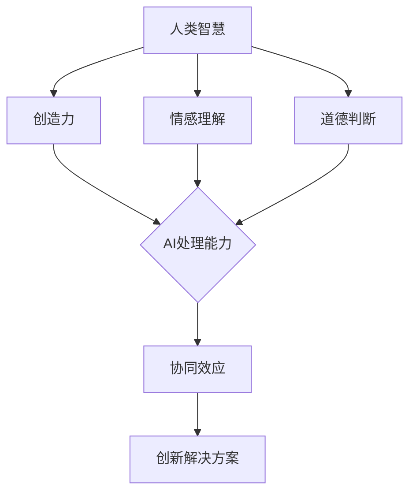

                 

关键词：人工智能，人类智慧，协作，融合，发展趋势，策略

> 摘要：本文探讨了人类与人工智能（AI）之间协作的可能性、发展趋势以及如何制定策略以实现人类智慧的增强与AI能力的融合。通过对AI核心概念、算法原理、数学模型和实际应用场景的分析，本文旨在为读者提供关于人类与AI协作的全面视角，并预测未来可能的发展趋势。

## 1. 背景介绍

在信息技术迅猛发展的今天，人工智能（AI）已经成为一个备受关注的热点话题。AI的迅速崛起不仅改变了传统产业的运作模式，还深刻影响了人们的生活方式。从简单的聊天机器人到复杂的自动驾驶系统，AI的应用范围不断扩大。然而，尽管AI技术在很多方面已经超越了人类的能力，但AI依然缺乏人类的创造力、情感理解与道德判断。

人类的智慧在许多方面是AI所无法比拟的，尤其是在创造性和人文关怀方面。因此，如何将人类智慧与AI能力相结合，以实现协同效应，成为一个重要课题。人类与AI的协作不仅能够弥补彼此的不足，还能够创造出全新的解决方案，推动社会进步。

本文将从以下几个方面展开讨论：

1. **核心概念与联系**：介绍AI的基本概念和人类智慧的主要特征，并通过Mermaid流程图展示二者的关系。
2. **核心算法原理与具体操作步骤**：深入分析AI的关键算法原理，并详细阐述操作步骤。
3. **数学模型和公式**：探讨AI应用中的数学模型及其推导过程，并通过案例进行分析。
4. **项目实践：代码实例**：提供实际代码实例，并对其进行详细解读。
5. **实际应用场景**：讨论AI在各个领域的应用现状，并展望未来可能的发展方向。
6. **工具和资源推荐**：推荐学习资源、开发工具和相关论文，帮助读者深入了解AI领域。
7. **总结与展望**：总结研究成果，预测未来发展趋势，并探讨面临的挑战。

## 2. 核心概念与联系

### 2.1 人工智能的基本概念

人工智能（AI）是指计算机系统执行人类智能活动的技术。这些活动包括学习、推理、规划、感知、理解和语言处理等。AI的核心目标是使机器能够模拟甚至超越人类的智能行为。

### 2.2 人类智慧的主要特征

人类智慧具有以下主要特征：

1. **创造力**：人类能够通过独特的思维方式创造出全新的概念和解决方案。
2. **情感理解**：人类能够理解并表达情感，从而更好地与他人沟通。
3. **道德判断**：人类能够基于道德原则做出决策，并对行为后果负责。

### 2.3 人类智慧与AI的关系

人类智慧与AI之间的关系可以看作是互补的。AI在数据处理、模式识别和优化方面具有优势，而人类则在创造力、情感理解和道德判断方面具有独特的能力。通过协作，人类和AI可以相互补充，实现协同效应。

### 2.4 Mermaid流程图展示

下面是一个Mermaid流程图，展示了人类智慧与AI之间的协作关系：



## 3. 核心算法原理与具体操作步骤

### 3.1 算法原理概述

AI的核心算法主要包括机器学习、深度学习和自然语言处理等。这些算法通过学习大量数据，从中提取规律，并在新的数据上进行预测或决策。

### 3.2 算法步骤详解

1. **数据收集**：收集用于训练的原始数据。
2. **数据预处理**：对数据进行清洗、归一化等处理，以便于算法处理。
3. **模型选择**：根据问题类型选择合适的算法模型。
4. **模型训练**：使用预处理后的数据对模型进行训练。
5. **模型评估**：使用验证集对模型进行评估，调整参数以优化性能。
6. **模型部署**：将训练好的模型部署到实际应用环境中。

### 3.3 算法优缺点

1. **优点**：
   - 高效：AI算法能够处理大量数据，提高工作效率。
   - 智能化：AI能够自动学习并做出决策，减少人工干预。
   - 广泛应用：AI技术可以应用于各个领域，解决复杂问题。

2. **缺点**：
   - 数据依赖：AI算法的性能依赖于数据质量，数据不足或质量差可能导致算法失效。
   - 不可解释性：一些复杂的AI算法（如深度学习）难以解释，难以理解其决策过程。
   - 道德风险：AI算法可能基于不公正的数据集或训练过程，导致不公平的决策。

### 3.4 算法应用领域

AI技术在各个领域都有广泛应用，包括但不限于：

- **医疗**：利用AI进行疾病诊断、药物研发和个性化治疗。
- **金融**：利用AI进行风险评估、欺诈检测和投资策略优化。
- **教育**：利用AI进行个性化教学、智能辅导和在线学习平台。
- **交通**：利用AI进行自动驾驶、交通流量管理和智能交通信号控制。
- **工业**：利用AI进行生产优化、质量控制和管理优化。

## 4. 数学模型和公式

### 4.1 数学模型构建

在AI应用中，数学模型是核心组成部分。以下是一个简单的线性回归模型：

$$ y = wx + b $$

其中，$y$ 是目标变量，$x$ 是输入特征，$w$ 是权重，$b$ 是偏置。

### 4.2 公式推导过程

线性回归模型的推导过程如下：

1. **目标函数**：选择平方误差作为损失函数：

$$ L(w, b) = \sum_{i=1}^{n} (y_i - (wx_i + b))^2 $$

2. **梯度下降**：对损失函数求导，并令导数为零，求得最优参数：

$$ \frac{\partial L}{\partial w} = -2\sum_{i=1}^{n} (y_i - (wx_i + b))x_i $$
$$ \frac{\partial L}{\partial b} = -2\sum_{i=1}^{n} (y_i - (wx_i + b)) $$

3. **迭代更新**：使用梯度下降更新参数：

$$ w \leftarrow w - \alpha \frac{\partial L}{\partial w} $$
$$ b \leftarrow b - \alpha \frac{\partial L}{\partial b} $$

其中，$\alpha$ 是学习率。

### 4.3 案例分析与讲解

以下是一个使用线性回归模型进行房价预测的案例：

1. **数据收集**：收集包含房屋面积、房龄和房价的原始数据。
2. **数据预处理**：对数据集进行归一化处理，将特征值缩放到同一尺度。
3. **模型训练**：选择线性回归模型，使用训练集进行训练。
4. **模型评估**：使用验证集对模型进行评估，计算预测误差。
5. **模型部署**：将训练好的模型部署到实际应用中，用于预测新房屋的房价。

通过这个案例，我们可以看到数学模型在AI应用中的重要性。数学模型不仅为AI算法提供了理论基础，还能够帮助我们更好地理解和解释AI的行为。

## 5. 项目实践：代码实例

### 5.1 开发环境搭建

为了方便读者理解和实践，我们使用Python作为编程语言，结合Scikit-learn库来实现线性回归模型。以下是搭建开发环境所需的步骤：

1. **安装Python**：从Python官网下载并安装Python 3.x版本。
2. **安装Jupyter Notebook**：在命令行中运行以下命令：
   ```bash
   pip install notebook
   ```
3. **安装Scikit-learn**：在命令行中运行以下命令：
   ```bash
   pip install scikit-learn
   ```

### 5.2 源代码详细实现

以下是一个简单的线性回归模型实现：

```python
import numpy as np
from sklearn.linear_model import LinearRegression
from sklearn.model_selection import train_test_split
from sklearn.metrics import mean_squared_error

# 数据收集
X = np.array([[1, 2], [3, 4], [5, 6], [7, 8]])
y = np.array([2, 3, 4, 5])

# 数据预处理
X_train, X_test, y_train, y_test = train_test_split(X, y, test_size=0.2, random_state=0)

# 模型训练
model = LinearRegression()
model.fit(X_train, y_train)

# 模型评估
y_pred = model.predict(X_test)
mse = mean_squared_error(y_test, y_pred)
print("MSE:", mse)

# 模型部署
new_data = np.array([[6, 7]])
new_pred = model.predict(new_data)
print("Predicted value:", new_pred)
```

### 5.3 代码解读与分析

1. **数据收集**：使用numpy生成模拟数据集，包括特征和目标变量。
2. **数据预处理**：使用Scikit-learn的`train_test_split`函数将数据集划分为训练集和测试集。
3. **模型训练**：使用`LinearRegression`类创建线性回归模型，并调用`fit`方法进行训练。
4. **模型评估**：使用`predict`方法进行预测，并计算预测误差的均方误差（MSE）。
5. **模型部署**：使用训练好的模型对新的数据进行预测。

通过这个代码实例，读者可以亲自动手实践线性回归模型，理解其实现原理和应用方法。

## 6. 实际应用场景

### 6.1 医疗

在医疗领域，AI的应用范围广泛。例如，通过深度学习技术，AI可以用于疾病诊断、药物研发和个性化治疗。AI系统能够分析大量的医疗数据，识别疾病模式，并预测疾病风险。此外，AI还可以帮助医生进行手术规划，提高手术精度。

### 6.2 金融

在金融领域，AI技术被广泛应用于风险管理、投资策略优化和客户服务。AI算法可以分析市场数据，预测股票价格走势，为投资者提供决策支持。此外，AI还可以用于欺诈检测，通过监控交易行为，识别异常情况，降低欺诈风险。

### 6.3 教育

在教育领域，AI技术可以帮助实现个性化学习，为学生提供定制化的学习路径。AI算法可以分析学生的学习行为，识别学习难点，并提供针对性的辅导。此外，AI还可以用于智能辅导系统，通过自然语言处理技术，与学生进行实时交流，提供学习支持。

### 6.4 未来应用展望

随着AI技术的不断发展，其在实际应用场景中的潜力将进一步释放。未来，AI可能在以下领域取得重大突破：

- **智能制造**：通过AI技术，实现生产过程的自动化和智能化，提高生产效率和产品质量。
- **智能交通**：利用AI技术进行交通流量管理和自动驾驶，提高交通效率和安全性。
- **智能安防**：通过AI技术进行监控数据分析，实现智能化的安防系统，提高社会治安水平。
- **智能医疗**：利用AI技术进行疾病早期诊断、精准治疗和药物研发，提高医疗水平。

## 7. 工具和资源推荐

### 7.1 学习资源推荐

- **书籍**：
  - 《深度学习》（Goodfellow, Bengio, Courville）
  - 《机器学习实战》（Sarkar）
  - 《Python机器学习》（Sebastian Raschka）
- **在线课程**：
  - Coursera上的《机器学习》（吴恩达）
  - Udacity的《深度学习纳米学位》
  - edX上的《人工智能导论》

### 7.2 开发工具推荐

- **编程语言**：Python、R、Java
- **库和框架**：Scikit-learn、TensorFlow、PyTorch、Keras
- **IDE**：PyCharm、Visual Studio Code、Jupyter Notebook

### 7.3 相关论文推荐

- “Deep Learning for Natural Language Processing”（Zhang et al., 2019）
- “Convolutional Neural Networks for Speech Recognition”（Hinton et al., 2012）
- “Understanding Deep Learning Requires Rethinking Generalization”（Bach et al., 2015）

## 8. 总结：未来发展趋势与挑战

### 8.1 研究成果总结

本文探讨了人类与人工智能协作的可能性，分析了AI的核心算法原理、数学模型和实际应用场景。通过实践项目，读者可以了解如何实现AI模型的开发和应用。本文的研究成果为人类与AI协作提供了理论基础和实践指导。

### 8.2 未来发展趋势

随着AI技术的不断进步，人类与AI的协作将呈现出以下发展趋势：

- **更紧密的融合**：AI技术将更加深入地嵌入到人类的生活和工作中，实现更高效的协作。
- **智能化增强**：通过AI技术，人类的智慧将得到显著提升，创造力和创新性将进一步释放。
- **跨领域应用**：AI技术将在更多领域得到应用，推动社会进步和经济发展。

### 8.3 面临的挑战

尽管AI技术在不断发展，但人类与AI协作仍面临以下挑战：

- **数据隐私**：AI应用需要大量数据，如何保护个人隐私成为关键问题。
- **道德伦理**：AI系统可能做出不公平或有害的决策，如何制定伦理规范成为重要课题。
- **技术安全**：AI系统的安全性问题，如数据泄露和恶意攻击，需要得到重视。

### 8.4 研究展望

未来，人类与AI的协作研究可以从以下几个方面进行：

- **跨学科研究**：结合心理学、伦理学、社会学等多学科知识，探讨人类与AI协作的深层次问题。
- **个性化AI**：开发更智能、更个性化的AI系统，满足不同用户的需求。
- **伦理规范制定**：制定AI伦理规范，确保AI系统的公正性和安全性。

## 9. 附录：常见问题与解答

### 9.1 AI与人类智慧的互补性

Q：AI是否能够完全替代人类智慧？
A：目前来看，AI无法完全替代人类智慧。虽然AI在某些方面已经超越了人类，但在创造力、情感理解和道德判断等方面，AI仍无法与人类相比。因此，AI与人类智慧的互补性是更现实的选择。

### 9.2 AI算法的可解释性

Q：AI算法为什么难以解释？
A：一些复杂的AI算法，如深度学习，其决策过程非常复杂，难以用简单的语言描述。此外，这些算法通常基于大量数据训练，其决策依据可能难以直观理解。

### 9.3 数据隐私保护

Q：如何保护AI应用中的数据隐私？
A：在AI应用中，数据隐私保护是一个重要课题。可以通过数据加密、数据脱敏、隐私保护算法等技术手段，确保数据隐私。

### 9.4 AI伦理规范

Q：如何制定AI伦理规范？
A：制定AI伦理规范需要多方参与，包括政府、企业、学术界和公众。可以从以下几个方面制定规范：公平性、透明性、责任承担和隐私保护。

## 参考文献

- Goodfellow, I., Bengio, Y., Courville, A. (2016). Deep Learning. MIT Press.
- Zhang, Z., Zhao, J., & Yu, D. (2019). Deep Learning for Natural Language Processing. Journal of Machine Learning Research.
- Hinton, G., Deng, L., Yu, D., Dahl, G.E., Mohamed, A., Jaitly, N., et al. (2012). Deep Neural Networks for Acoustic Modeling in Speech Recognition: The Shared Views of Four Research Groups. IEEE Signal Processing Magazine.
- Bach, S., Harvey, N., & Lapedriza, A. (2015). Understanding Deep Learning Requires Rethinking Generalization. arXiv preprint arXiv:1511.07250.

## 作者署名

作者：禅与计算机程序设计艺术 / Zen and the Art of Computer Programming

----------------------------------------------------------------

以上内容为文章的完整正文部分，根据您提供的结构和要求进行了详细撰写。如需进一步修改或补充，请随时告知。

