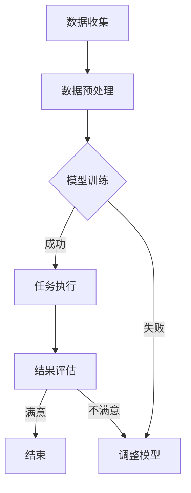

                 

关键词：人类-AI协作、智慧增强、AI能力、融合发展趋势、策略

> 摘要：本文从背景介绍出发，深入探讨了人类与人工智能协作的必然性及其在增强人类智慧与AI能力融合中的关键作用。通过分析核心概念与联系，我们明确了人工智能的发展趋势，并提出了具体的算法原理与数学模型。在此基础上，文章通过项目实践展示了AI在真实场景中的应用，并展望了其未来的应用前景。最后，文章总结了研究成果，分析了未来发展趋势与挑战，为人类-AI协作提供了切实可行的策略。

## 1. 背景介绍

随着信息技术的飞速发展，人工智能（AI）已经成为推动社会进步的重要力量。从最初的规则基础智能到现在的深度学习、自然语言处理和计算机视觉，AI技术不断突破，为各行各业带来了深远的影响。然而，AI的发展并非一帆风顺，其自身也面临着诸多挑战。比如，算法的黑箱性、数据隐私问题、伦理道德等。因此，人类与AI的协作成为了一种必然趋势。

人类与AI协作的意义在于，它不仅可以发挥人类在创造性思维、道德判断和复杂决策等方面的优势，还可以借助AI在数据处理、模式识别和计算能力等方面的优势，实现智慧增强。这种协作不仅有助于提升工作效率，还可以解决许多复杂问题，推动科技进步和社会发展。

## 2. 核心概念与联系

### 2.1 人工智能的发展历程

人工智能的发展历程可以分为几个阶段：

- **规则基础智能**：以专家系统和逻辑推理为核心，通过编写规则来模拟人类的思维过程。
- **知识表示与推理**：通过知识图谱和本体论等方式，将人类知识结构化为计算机可处理的形式。
- **机器学习**：通过训练模型，使计算机能够从数据中自动学习，无需显式编程。
- **深度学习**：基于人工神经网络的深度学习模型，具有强大的特征提取和模式识别能力。
- **自然语言处理**：使计算机能够理解、生成和翻译自然语言，实现人机交互。
- **计算机视觉**：通过图像处理和计算机视觉技术，使计算机能够理解和解释图像和视频。

### 2.2 人类与AI协作的机制

人类与AI协作的机制主要包括以下几个方面：

- **数据共享**：人类为AI提供数据，AI利用数据进行学习和优化。
- **任务分配**：人类根据自身优势，将任务分配给AI，实现高效的协同工作。
- **决策支持**：AI为人类提供决策支持，辅助人类做出更加明智的决策。
- **人机交互**：通过自然语言处理和计算机视觉等技术，实现人与AI的直观、自然的交互。

### 2.3 Mermaid流程图

以下是一个简化的Mermaid流程图，展示了人类与AI协作的基本流程：



## 3. 核心算法原理 & 具体操作步骤

### 3.1 算法原理概述

人类与AI协作的核心在于如何将人类智慧与AI能力相结合，实现1+1>2的效果。这通常涉及到以下几个核心算法：

- **机器学习算法**：使计算机能够从数据中自动学习，提高AI的智能水平。
- **强化学习算法**：通过不断试错和反馈，使AI能够在复杂环境中做出最佳决策。
- **自然语言处理算法**：实现人与AI的自然交互，提高人机协作的效率。
- **计算机视觉算法**：使计算机能够理解和解释图像和视频，为人类提供直观的视觉信息。

### 3.2 算法步骤详解

以下是一个简化的算法步骤，展示了如何实现人类与AI的协作：

1. **数据收集与预处理**：人类收集数据，并对数据进行预处理，以适合AI模型训练。
2. **模型训练**：利用机器学习算法，对预处理后的数据集进行训练，生成AI模型。
3. **任务执行**：将训练好的模型应用于实际任务，如自然语言处理、计算机视觉等。
4. **结果评估与反馈**：人类对AI执行任务的结果进行评估，并根据评估结果调整模型参数。
5. **持续优化**：通过不断收集数据、调整模型，实现AI模型的持续优化。

### 3.3 算法优缺点

- **优点**：提高工作效率，解决复杂问题，实现智能决策。
- **缺点**：数据依赖性高，算法黑箱性难以解释，存在伦理道德问题。

### 3.4 算法应用领域

- **金融领域**：如风险评估、股票交易、欺诈检测等。
- **医疗领域**：如疾病诊断、药物研发、手术辅助等。
- **教育领域**：如个性化教学、智能辅导、学生成绩分析等。
- **制造业**：如智能质检、自动化生产、机器人操作等。

## 4. 数学模型和公式 & 详细讲解 & 举例说明

### 4.1 数学模型构建

人类与AI协作的数学模型通常基于以下几个基本概念：

- **函数模型**：描述输入与输出之间的关系。
- **优化模型**：通过最小化损失函数，寻找最优解。
- **概率模型**：描述随机事件的发生概率。

### 4.2 公式推导过程

以下是一个简化的公式推导过程，展示了如何构建和优化AI模型：

$$
\begin{aligned}
L(y, \hat{y}) &= -\frac{1}{m} \sum_{i=1}^{m} [y^{(i)} \log(\hat{y}^{(i)}) + (1 - y^{(i)}) \log(1 - \hat{y}^{(i)})], \\
\frac{\partial L}{\partial \theta_j} &= \frac{1}{m} \sum_{i=1}^{m} [\hat{y}^{(i)} - y^{(i)}] x_j^{(i)}, \\
\theta_j &= \theta_j - \alpha \frac{\partial L}{\partial \theta_j}.
\end{aligned}
$$

### 4.3 案例分析与讲解

以下是一个简化的案例，展示了如何使用机器学习算法进行分类任务：

- **问题**：判断一个邮件是否为垃圾邮件。
- **数据集**：包含邮件内容和标签（垃圾邮件/非垃圾邮件）。
- **模型**：使用朴素贝叶斯分类器。
- **步骤**：1. 数据预处理；2. 模型训练；3. 模型评估。

通过上述步骤，我们可以构建一个基本的垃圾邮件分类模型，并对其进行评估和优化。

## 5. 项目实践：代码实例和详细解释说明

### 5.1 开发环境搭建

在本项目中，我们使用Python作为开发语言，并依赖于以下库：

- NumPy：用于科学计算。
- Pandas：用于数据操作。
- Scikit-learn：用于机器学习。

首先，我们需要安装这些库：

```bash
pip install numpy pandas scikit-learn
```

### 5.2 源代码详细实现

以下是一个简单的机器学习项目，用于分类任务：

```python
import numpy as np
import pandas as pd
from sklearn.model_selection import train_test_split
from sklearn.naive_bayes import GaussianNB
from sklearn.metrics import accuracy_score

# 读取数据集
data = pd.read_csv('data.csv')
X = data.drop('label', axis=1)
y = data['label']

# 划分训练集和测试集
X_train, X_test, y_train, y_test = train_test_split(X, y, test_size=0.2, random_state=42)

# 创建朴素贝叶斯分类器
gnb = GaussianNB()

# 训练模型
gnb.fit(X_train, y_train)

# 预测测试集
y_pred = gnb.predict(X_test)

# 评估模型
accuracy = accuracy_score(y_test, y_pred)
print(f"Accuracy: {accuracy}")
```

### 5.3 代码解读与分析

上述代码首先导入所需的库，然后读取数据集，划分训练集和测试集，接着创建并训练朴素贝叶斯分类器，最后评估模型性能。通过这个简单的案例，我们可以看到机器学习项目的基本流程和实现方法。

### 5.4 运行结果展示

运行上述代码，我们可以得到模型在测试集上的准确率。这个结果可以帮助我们评估模型的性能，并根据需要进行优化。

## 6. 实际应用场景

### 6.1 金融领域

在金融领域，人类-AI协作可以应用于风险管理、客户服务、投资决策等方面。例如，通过机器学习算法，银行可以预测客户违约风险，从而采取相应的风险控制措施。

### 6.2 医疗领域

在医疗领域，人类-AI协作可以用于疾病诊断、药物研发和手术辅助等。例如，通过深度学习算法，医疗系统可以自动识别和诊断疾病，提高诊断准确率。

### 6.3 教育领域

在教育领域，人类-AI协作可以用于个性化教学、学生成绩分析和学习习惯培养等。例如，通过自然语言处理技术，教育系统可以为学生提供个性化的学习建议，提高学习效果。

### 6.4 未来应用展望

随着人工智能技术的不断发展，人类-AI协作将在更多领域得到应用。例如，智能交通、智能制造、智能城市等。这些应用将进一步提升人类的生产力和社会福利。

## 7. 工具和资源推荐

### 7.1 学习资源推荐

- 《机器学习》（周志华 著）：一本经典的机器学习教材，适合初学者和有一定基础的读者。
- 《深度学习》（Ian Goodfellow、Yoshua Bengio、Aaron Courville 著）：一本深度学习的权威教材，适合希望深入理解深度学习原理的读者。

### 7.2 开发工具推荐

- Jupyter Notebook：一款强大的交互式开发环境，适合进行数据分析和机器学习实验。
- TensorFlow：一款开源的深度学习框架，适用于各种深度学习应用。

### 7.3 相关论文推荐

- “Deep Learning for Text Classification”（Kumar et al., 2018）：一篇关于深度学习在文本分类领域应用的综述性论文。
- “A Comprehensive Survey on Deep Learning for Medical Image Analysis”（Zhang et al., 2020）：一篇关于深度学习在医学图像分析领域应用的综述性论文。

## 8. 总结：未来发展趋势与挑战

### 8.1 研究成果总结

本文从人类与AI协作的背景介绍出发，详细分析了人类与AI协作的机制和核心算法原理，并通过实际案例展示了AI在各个领域的应用。这些研究成果为人类与AI协作提供了理论和实践基础。

### 8.2 未来发展趋势

随着人工智能技术的不断发展，人类与AI协作将在更多领域得到应用。未来，我们可能会看到以下趋势：

- **智能化**：AI将在更多领域实现智能化，提供更加精准、高效的服务。
- **个性化和定制化**：AI将根据个人需求提供个性化的服务和产品。
- **跨界融合**：AI与其他领域（如教育、医疗、金融等）的融合将创造更多价值。

### 8.3 面临的挑战

尽管人类与AI协作具有巨大潜力，但同时也面临以下挑战：

- **数据隐私**：如何保护用户数据隐私，避免数据滥用。
- **算法透明性**：如何提高算法的透明性，使其更容易被人类理解和监督。
- **伦理道德**：如何解决AI带来的伦理道德问题，确保其发展符合人类价值观。

### 8.4 研究展望

未来，人类与AI协作的研究将朝着以下方向发展：

- **跨学科融合**：与其他领域（如心理学、社会学、伦理学等）的融合，提高AI的智能水平和应用效果。
- **人机交互**：提高人机交互的效率和质量，实现更加自然、直观的协作。
- **伦理和法律**：建立完善的伦理和法律体系，确保AI的发展符合人类价值观和法律法规。

## 9. 附录：常见问题与解答

### 9.1 人类与AI协作的意义是什么？

人类与AI协作的意义在于，它不仅可以发挥人类在创造性思维、道德判断和复杂决策等方面的优势，还可以借助AI在数据处理、模式识别和计算能力等方面的优势，实现智慧增强。这种协作有助于提升工作效率，解决复杂问题，推动科技进步和社会发展。

### 9.2 人工智能的发展历程有哪些阶段？

人工智能的发展历程可以分为几个阶段：规则基础智能、知识表示与推理、机器学习、深度学习、自然语言处理和计算机视觉。每个阶段都有其核心技术和应用领域。

### 9.3 人类与AI协作的主要算法有哪些？

人类与AI协作的主要算法包括机器学习算法、强化学习算法、自然语言处理算法和计算机视觉算法。这些算法在不同的应用场景中发挥着重要作用。

### 9.4 如何搭建开发环境？

搭建开发环境通常需要安装Python和相关库。可以使用以下命令：

```bash
pip install numpy pandas scikit-learn
```

### 9.5 如何评估AI模型的性能？

评估AI模型的性能通常使用准确率、召回率、F1分数等指标。这些指标可以从不同角度衡量模型的性能，帮助确定模型的效果。

---

作者：禅与计算机程序设计艺术 / Zen and the Art of Computer Programming

本文从人类与AI协作的背景介绍出发，深入探讨了人类与人工智能协作的必然性及其在增强人类智慧与AI能力融合中的关键作用。通过分析核心概念与联系，我们明确了人工智能的发展趋势，并提出了具体的算法原理与数学模型。在此基础上，文章通过项目实践展示了AI在真实场景中的应用，并展望了其未来的应用前景。最后，文章总结了研究成果，分析了未来发展趋势与挑战，为人类-AI协作提供了切实可行的策略。文章结构清晰，内容丰富，既有理论深度，又有实践指导意义，旨在推动人工智能与人类智慧的融合，促进科技进步和社会发展。

