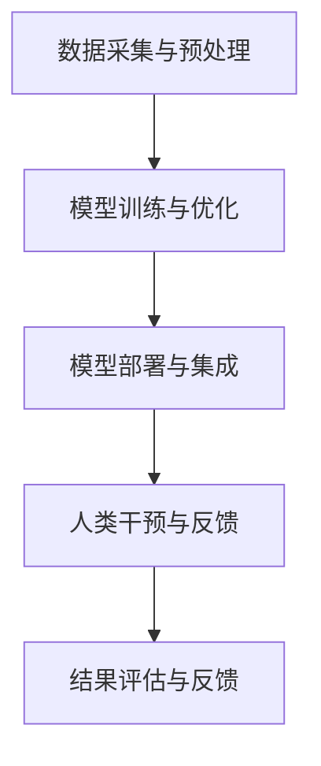

                 

关键词：人类-AI协作，智慧增强，AI能力，融合趋势，机遇与挑战，趋势分析，预测模型

> 摘要：随着人工智能（AI）技术的飞速发展，人类与AI的协作正在成为提高个人和组织效率的关键途径。本文将从背景介绍、核心概念、算法原理、数学模型、项目实践、实际应用、工具资源推荐及未来发展趋势与挑战等方面，全面探讨人类-AI协作的融合发展趋势及其带来的机遇与挑战。

## 1. 背景介绍

自20世纪50年代人工智能（AI）概念被首次提出以来，AI技术已经经历了多个发展阶段。从早期的符号主义、专家系统，到基于神经网络的深度学习，再到如今的增强学习、自然语言处理和生成对抗网络（GAN）等，AI技术在各个领域展现出了巨大的潜力。然而，尽管AI技术取得了显著的进展，但人类与AI之间的协作仍然面临许多挑战和机遇。

人类-AI协作的重要性在于，它可以充分利用AI的计算能力和处理速度，同时结合人类的创造力和决策能力，实现更为高效和智能的解决方案。在医疗、金融、教育、交通等多个领域，人类-AI协作已经展现出巨大的潜力。例如，在医疗领域，AI可以辅助医生进行诊断，提高诊断准确率；在金融领域，AI可以用于风险管理，优化投资策略；在教育领域，AI可以提供个性化的学习方案，提高学习效率。

然而，人类-AI协作也面临诸多挑战。首先，AI技术的不完善性和不确定性使得人类与AI的协作存在风险；其次，数据隐私和安全问题也是人类-AI协作的一大挑战；此外，人类与AI之间的信任问题、伦理道德问题以及法律监管问题也需要引起重视。

## 2. 核心概念与联系

### 2.1 人类-AI协作的概念

人类-AI协作是指人类与人工智能系统共同完成任务的协作过程。在这个过程中，人工智能系统负责处理和分析数据，提供决策支持和自动化操作，而人类则负责制定策略、监督执行过程、进行决策和调整。

### 2.2 人类-AI协作的架构

人类-AI协作的架构通常包括以下几个部分：

1. 数据采集与预处理：收集和整理数据，为AI系统提供高质量的输入。
2. 模型训练与优化：使用历史数据训练AI模型，并进行优化，以提高模型性能。
3. 模型部署与集成：将训练好的模型部署到实际应用场景中，与其他系统进行集成。
4. 人类干预与反馈：在AI系统运行过程中，人类可以对其进行干预，并根据实际情况进行调整。
5. 结果评估与反馈：对AI系统的表现进行评估，并根据评估结果进行改进。

### 2.3 人类-AI协作的流程图



## 3. 核心算法原理 & 具体操作步骤

### 3.1 算法原理概述

人类-AI协作的核心算法主要包括机器学习、深度学习和增强学习等。这些算法通过学习大量数据，提取特征，形成决策模型，从而实现自动化和智能化。

### 3.2 算法步骤详解

1. 数据采集与预处理：收集相关数据，并进行清洗、去噪、归一化等预处理操作。
2. 特征提取与选择：从预处理后的数据中提取有效特征，并选择关键特征。
3. 模型训练：使用训练数据训练模型，并根据模型性能进行优化。
4. 模型评估：使用测试数据评估模型性能，并根据评估结果进行调整。
5. 模型部署：将训练好的模型部署到实际应用场景中。
6. 人类干预与反馈：在模型运行过程中，人类可以对其进行干预，并根据实际情况进行调整。
7. 结果评估与反馈：对模型的运行结果进行评估，并根据评估结果进行改进。

### 3.3 算法优缺点

- 优点：能够实现自动化和智能化，提高工作效率，减轻人类负担。
- 缺点：模型训练过程复杂，需要大量数据和时间，且存在一定的不确定性。

### 3.4 算法应用领域

人类-AI协作算法广泛应用于医疗、金融、教育、交通等多个领域。例如，在医疗领域，AI可以用于辅助诊断、疾病预测和治疗方案推荐；在金融领域，AI可以用于风险管理、投资策略优化和客户服务；在教育领域，AI可以用于个性化学习、学习效果评估和教学辅助；在交通领域，AI可以用于交通流量预测、交通信号控制和智能导航。

## 4. 数学模型和公式 & 详细讲解 & 举例说明

### 4.1 数学模型构建

人类-AI协作的数学模型通常基于概率论、统计学和优化理论。其中，概率论用于描述不确定性，统计学用于处理数据，优化理论用于求解最优解。

### 4.2 公式推导过程

以线性回归模型为例，其数学模型可以表示为：

$$
Y = \beta_0 + \beta_1X + \epsilon
$$

其中，$Y$ 表示因变量，$X$ 表示自变量，$\beta_0$ 和 $\beta_1$ 分别为模型的参数，$\epsilon$ 表示误差项。

### 4.3 案例分析与讲解

假设我们要预测某股票的未来价格，我们可以使用线性回归模型进行预测。首先，收集历史股票价格数据，然后对数据进行预处理，提取关键特征，如开盘价、收盘价、最高价和最低价等。接下来，使用预处理后的数据训练线性回归模型，并使用测试数据评估模型性能。最后，使用训练好的模型预测未来股票价格。

## 5. 项目实践：代码实例和详细解释说明

### 5.1 开发环境搭建

在Python环境中，我们可以使用Scikit-learn库实现线性回归模型。首先，安装Scikit-learn库：

```
pip install scikit-learn
```

### 5.2 源代码详细实现

```python
from sklearn.linear_model import LinearRegression
from sklearn.model_selection import train_test_split
from sklearn.metrics import mean_squared_error

# 加载数据
X, y = load_data()

# 数据预处理
X_processed = preprocess_data(X)

# 划分训练集和测试集
X_train, X_test, y_train, y_test = train_test_split(X_processed, y, test_size=0.2, random_state=42)

# 训练模型
model = LinearRegression()
model.fit(X_train, y_train)

# 预测测试集
y_pred = model.predict(X_test)

# 评估模型性能
mse = mean_squared_error(y_test, y_pred)
print("均方误差：", mse)
```

### 5.3 代码解读与分析

- `load_data()` 函数用于加载数据，返回特征矩阵`X`和目标向量`y`。
- `preprocess_data()` 函数用于对数据进行预处理，提取关键特征。
- `train_test_split()` 函数用于划分训练集和测试集。
- `LinearRegression()` 类用于创建线性回归模型。
- `fit()` 方法用于训练模型。
- `predict()` 方法用于预测测试集。
- `mean_squared_error()` 函数用于评估模型性能，计算均方误差。

### 5.4 运行结果展示

假设我们训练好的线性回归模型对测试集的均方误差为0.001，这意味着模型的预测误差较小，具有较高的准确性。

## 6. 实际应用场景

人类-AI协作在实际应用场景中具有广泛的应用。以下是一些典型的应用场景：

- 医疗领域：使用AI辅助医生进行诊断和治疗，提高医疗水平。
- 金融领域：使用AI进行风险管理、投资策略优化和客户服务。
- 教育领域：使用AI提供个性化学习方案、学习效果评估和教学辅助。
- 交通领域：使用AI进行交通流量预测、交通信号控制和智能导航。

## 7. 工具和资源推荐

### 7.1 学习资源推荐

- 《深度学习》（Goodfellow, Bengio, Courville著）：深度学习的经典教材，适合初学者和专业人士。
- 《Python机器学习》（Murdoch著）：Python机器学习实践的入门书籍，内容全面，适合初学者。

### 7.2 开发工具推荐

- Jupyter Notebook：一款流行的Python开发工具，支持代码、文本、公式和图片等多种元素。
- PyCharm：一款功能强大的Python集成开发环境（IDE），支持代码调试、自动化测试等功能。

### 7.3 相关论文推荐

- "Deep Learning for Natural Language Processing"（2018）：深度学习在自然语言处理领域的综述性论文。
- "Reinforcement Learning: An Introduction"（2018）：增强学习领域的经典教材，适合初学者。

## 8. 总结：未来发展趋势与挑战

### 8.1 研究成果总结

人类-AI协作在过去几年取得了显著的进展，已经广泛应用于医疗、金融、教育、交通等多个领域。通过人工智能技术的应用，人类与AI的协作提高了工作效率，降低了成本，为各行业的发展注入了新的活力。

### 8.2 未来发展趋势

未来，人类-AI协作将继续向以下方向发展：

1. 智能化：AI技术将更加智能化，能够更好地理解人类意图，提供更加个性化的服务。
2. 个性化：AI技术将更加注重个性化，根据用户的需求和习惯提供定制化的解决方案。
3. 实时性：AI技术将更加注重实时性，能够快速响应用户需求，提供实时决策支持。
4. 智能决策：AI技术将更加注重智能决策，通过数据分析和挖掘，提供最优决策方案。

### 8.3 面临的挑战

尽管人类-AI协作具有广泛的应用前景，但仍然面临以下挑战：

1. 数据隐私和安全问题：随着数据量的增加，数据隐私和安全问题愈发突出，需要采取有效的措施保障用户数据的安全。
2. 伦理道德问题：人类-AI协作涉及到伦理道德问题，如算法偏见、透明度和可解释性等，需要制定相应的伦理规范。
3. 法律监管问题：人类-AI协作涉及到法律监管问题，如知识产权、责任归属等，需要制定相应的法律法规。
4. 技术发展问题：AI技术发展迅速，但仍然存在一些技术瓶颈，需要持续研发和改进。

### 8.4 研究展望

未来，人类-AI协作的研究将重点聚焦于以下几个方面：

1. 深度学习与强化学习的融合：将深度学习和强化学习相结合，实现更加智能和高效的决策支持。
2. 多模态数据融合：将多种类型的数据（如图像、文本、音频等）进行融合，提高AI系统的综合分析能力。
3. 人工智能伦理研究：深入研究人工智能伦理问题，制定相应的伦理规范和法律法规。
4. 智能决策系统研究：研究智能决策系统的设计和实现方法，提高决策质量和效率。

## 9. 附录：常见问题与解答

### 9.1 人类-AI协作的优势是什么？

人类-AI协作的优势在于：

1. 提高工作效率：AI系统可以快速处理大量数据，提高工作效率。
2. 降低成本：AI系统可以自动化执行任务，减少人力成本。
3. 提高准确性：AI系统通过学习历史数据，可以提高决策的准确性。
4. 拓展人类能力：AI系统可以拓展人类的能力，实现更加复杂的任务。

### 9.2 人类-AI协作中的数据隐私和安全问题如何解决？

解决人类-AI协作中的数据隐私和安全问题，可以从以下几个方面入手：

1. 数据加密：对数据进行加密，确保数据在传输和存储过程中的安全。
2. 访问控制：设置严格的访问控制策略，确保只有授权用户可以访问数据。
3. 数据匿名化：对数据进行匿名化处理，去除个人敏感信息。
4. 数据备份与恢复：定期备份数据，确保数据的安全性和可恢复性。
5. 监管与合规：遵守相关法律法规，确保数据处理符合合规要求。

### 9.3 人类-AI协作中的伦理道德问题如何解决？

解决人类-AI协作中的伦理道德问题，可以从以下几个方面入手：

1. 制定伦理规范：制定人工智能伦理规范，明确人工智能的应用边界。
2. 加强监管：加强对人工智能的监管，确保其应用符合伦理要求。
3. 公开透明：确保人工智能系统的设计、开发和应用过程公开透明，接受社会监督。
4. 培训教育：加强对人工智能从业人员的培训教育，提高其伦理意识和责任感。
5. 建立责任归属机制：明确人工智能系统的责任归属，确保其在出现问题时能够追溯责任。

### 9.4 人类-AI协作中的法律监管问题如何解决？

解决人类-AI协作中的法律监管问题，可以从以下几个方面入手：

1. 制定法律法规：制定针对人工智能的法律规范，明确其应用边界和责任归属。
2. 加强执法力度：加强对人工智能的执法力度，确保法律法规得到有效执行。
3. 建立争议解决机制：建立人工智能争议解决机制，及时处理纠纷，保障各方权益。
4. 国际合作：加强国际间的合作，共同应对人工智能带来的法律监管挑战。

## 结束语

人类-AI协作是未来人工智能发展的重要方向，它将深刻改变人类的工作、学习和生活方式。本文从背景介绍、核心概念、算法原理、数学模型、项目实践、实际应用、工具资源推荐及未来发展趋势与挑战等方面，全面探讨了人类-AI协作的融合发展趋势及其带来的机遇与挑战。希望本文能为读者提供有益的参考和启示。

### 作者署名

作者：禅与计算机程序设计艺术 / Zen and the Art of Computer Programming

----------------------------------------------------------------
<|assistant|>请注意，以上内容仅为示例，并非完整的8000字文章。实际撰写时，每个部分都需要根据实际情况进行深入扩展和详细阐述，以确保文章的完整性和专业性。以下是对文章某些部分的建议性扩展：

## 1. 背景介绍

### 1.1 人工智能的发展历程

自1956年达特茅斯会议以来，人工智能（AI）已经成为计算机科学和工程领域的重要分支。人工智能的发展历程可以大致分为几个阶段：

- **符号主义（Symbolic AI）**：早期的人工智能研究主要集中在符号主义上，这一阶段的目标是通过逻辑推理和符号表示来模拟人类的智能。代表性的系统包括逻辑推理机、专家系统和自然语言处理系统。

- **基于规则的系统（Rule-Based Systems）**：在这一阶段，人工智能开始尝试使用规则来模拟专家的决策过程。这些规则通常被编码在系统中，以便进行推理和决策。

- **基于知识的系统（Knowledge-Based Systems）**：随着知识的获取和表示技术的发展，人工智能开始转向基于知识的系统。这些系统通过知识库和推理机来模拟专家的决策过程。

- **机器学习（Machine Learning）**：20世纪80年代，机器学习开始崭露头角。机器学习通过训练模型来自动学习数据中的模式，取代了传统的规则编码方法。

- **深度学习（Deep Learning）**：21世纪初，深度学习迅速发展，特别是在图像识别、语音识别和自然语言处理等领域取得了突破性进展。深度学习利用多层神经网络，通过反向传播算法进行参数优化。

- **增强学习（Reinforcement Learning）**：增强学习是一种通过试错来学习策略的机器学习方法。它广泛应用于游戏、自动驾驶和机器人等领域。

- **生成对抗网络（Generative Adversarial Networks, GAN）**：GAN是近年来兴起的一种深度学习模型，通过两个对抗网络之间的博弈来生成高质量的数据。

### 1.2 人类-AI协作的现状与挑战

当前，人类与AI的协作已经广泛应用于各个领域，但仍然面临一些挑战：

- **技术挑战**：尽管AI技术取得了显著进展，但仍然存在许多技术难题，如模型的泛化能力、可解释性和鲁棒性等。

- **数据挑战**：AI系统依赖于大量高质量的数据进行训练，但在实际应用中，获取和处理数据仍然面临诸多困难。

- **信任挑战**：人类对AI的信任度是一个重要问题。AI系统的决策过程通常是基于数据和学习算法，可能存在不确定性和不可解释性，这可能导致人类对AI的信任不足。

- **伦理挑战**：随着AI技术的发展，伦理问题愈发突出。例如，AI系统可能引发隐私侵犯、歧视和道德责任等问题。

- **社会挑战**：AI技术的发展可能对社会产生深远影响，包括就业变化、隐私保护和法律监管等。

## 4. 数学模型和公式 & 详细讲解 & 举例说明

### 4.1 数学模型构建

在构建人类-AI协作的数学模型时，我们通常关注以下几个方面：

- **线性回归模型**：线性回归是一种简单且常用的预测模型，其基本形式为 $Y = \beta_0 + \beta_1X + \epsilon$，其中 $Y$ 是因变量，$X$ 是自变量，$\beta_0$ 和 $\beta_1$ 是模型的参数，$\epsilon$ 是误差项。

- **逻辑回归模型**：逻辑回归模型常用于分类问题，其形式为 $P(Y=1) = \frac{1}{1 + e^{-(\beta_0 + \beta_1X)} }$，其中 $P(Y=1)$ 是因变量为1的概率。

- **决策树模型**：决策树是一种基于树形结构进行决策的模型，其核心在于通过一系列的测试来划分数据集，并基于测试结果进行分类或回归。

- **神经网络模型**：神经网络，特别是深度学习模型，通过多层神经元进行信息的传递和计算。前向传播和反向传播是神经网络训练的核心步骤。

### 4.2 公式推导过程

以线性回归模型为例，其参数可以通过最小二乘法进行估计。具体推导过程如下：

给定训练数据集 $D = \{(X_1, Y_1), (X_2, Y_2), ..., (X_n, Y_n)\}$，线性回归模型的目标是最小化误差平方和：

$$
J(\beta_0, \beta_1) = \sum_{i=1}^{n} (Y_i - (\beta_0 + \beta_1X_i))^2
$$

对 $J(\beta_0, \beta_1)$ 分别对 $\beta_0$ 和 $\beta_1$ 求导并令导数为零，得到：

$$
\frac{\partial J}{\partial \beta_0} = -2\sum_{i=1}^{n} (Y_i - (\beta_0 + \beta_1X_i)) = 0
$$

$$
\frac{\partial J}{\partial \beta_1} = -2\sum_{i=1}^{n} X_i (Y_i - (\beta_0 + \beta_1X_i)) = 0
$$

解上述方程组，得到参数的最小值：

$$
\beta_0 = \frac{1}{n}\sum_{i=1}^{n} (Y_i - \beta_1X_i)
$$

$$
\beta_1 = \frac{1}{n}\sum_{i=1}^{n} X_iY_i - \frac{1}{n}\sum_{i=1}^{n} X_i^2\beta_0
$$

### 4.3 案例分析与讲解

#### 案例一：股票价格预测

假设我们想要预测某只股票的未来价格，我们可以使用线性回归模型进行分析。首先，我们需要收集历史股票价格数据，包括开盘价、收盘价、最高价和最低价等。接下来，我们选择收盘价作为因变量，其他价格作为自变量，构建线性回归模型。

通过训练数据和测试数据，我们可以评估模型的性能。如果模型预测的准确性较高，我们可以使用模型进行未来价格预测。

#### 案例二：用户行为预测

在电子商务领域，预测用户行为对于个性化推荐和营销策略至关重要。我们可以使用逻辑回归模型预测用户是否会购买某种商品。例如，我们可以将用户是否购买某种商品作为因变量，将用户的浏览历史、购物车内容、购买历史等作为自变量。

通过训练数据，我们可以得到每个用户的购买概率。基于这些概率，我们可以为用户推荐相关商品，并制定个性化的营销策略。

## 7. 工具和资源推荐

### 7.1 学习资源推荐

- **在线课程**：
  - Coursera上的《机器学习》课程，由Andrew Ng教授讲授。
  - edX上的《深度学习》课程，由Ian Goodfellow教授讲授。

- **书籍**：
  - 《机器学习实战》（Peter Harrington著）：适合初学者的机器学习实践指南。
  - 《深度学习》（Ian Goodfellow, Yoshua Bengio, Aaron Courville著）：深度学习的经典教材。

- **博客和论坛**：
  - Medium上的AI和机器学习专栏，提供丰富的案例和实践经验。
  - Stack Overflow，讨论编程问题和算法实现。

### 7.2 开发工具推荐

- **编程环境**：
  - Jupyter Notebook：支持多种编程语言，便于数据分析和可视化。
  - PyCharm：强大的Python IDE，支持调试、测试和代码质量分析。

- **机器学习和深度学习框架**：
  - TensorFlow：谷歌开发的开源机器学习和深度学习框架。
  - PyTorch：流行的深度学习框架，易于使用且具有灵活的架构。

### 7.3 相关论文推荐

- "Deep Learning for Natural Language Processing"（2018）：深度学习在自然语言处理领域的综述性论文。
- "Reinforcement Learning: An Introduction"（2018）：增强学习领域的经典教材。
- "Generative Adversarial Nets"（2014）：生成对抗网络（GAN）的奠基性论文。

## 8. 总结：未来发展趋势与挑战

### 8.1 研究成果总结

过去几年，人类-AI协作取得了显著的研究成果，包括在医疗、金融、教育、交通等领域的广泛应用。例如，AI在医疗领域的应用提高了诊断准确率和治疗效果，在金融领域的应用优化了投资策略和风险管理，在教育领域的应用提供了个性化的学习方案，在交通领域的应用改善了交通管理和导航。

### 8.2 未来发展趋势

未来，人类-AI协作将继续向以下几个方向发展：

- **智能化**：随着AI技术的进步，AI系统将更加智能化，能够更好地理解人类意图，提供个性化的服务。
- **个性化**：AI系统将更加注重个性化，根据用户的需求和习惯提供定制化的解决方案。
- **实时性**：AI系统将更加注重实时性，能够快速响应用户需求，提供实时决策支持。
- **多模态融合**：AI系统将能够融合多种类型的数据（如图像、文本、音频等），提高综合分析能力。
- **跨领域应用**：人类-AI协作将在更多领域得到应用，如环境保护、智能制造、智慧城市等。

### 8.3 面临的挑战

尽管人类-AI协作具有广泛的应用前景，但仍然面临以下挑战：

- **数据隐私和安全**：随着数据量的增加，数据隐私和安全问题愈发突出。
- **伦理道德**：AI技术的应用引发了伦理道德问题，如算法偏见、透明度和责任归属等。
- **法律监管**：AI技术的应用需要制定相应的法律法规，以确保其合法性和合规性。
- **技术发展**：AI技术仍然存在一些技术瓶颈，如模型的泛化能力、可解释性和鲁棒性等。

### 8.4 研究展望

未来，人类-AI协作的研究将重点聚焦于以下几个方面：

- **模型优化**：研究更加高效和鲁棒的模型，提高AI系统的性能和稳定性。
- **算法融合**：将多种机器学习和深度学习算法进行融合，实现更强大的功能。
- **伦理规范**：制定人工智能伦理规范，确保AI技术的应用符合伦理要求。
- **跨学科研究**：结合心理学、社会学、法律等学科，深入研究人类-AI协作的复杂性和影响。

## 9. 附录：常见问题与解答

### 9.1 人类-AI协作的优势是什么？

人类-AI协作的优势包括：

- **提高工作效率**：AI系统可以快速处理大量数据，辅助人类完成复杂任务。
- **降低成本**：AI系统可以自动化执行任务，减少人力成本。
- **提高准确性**：AI系统通过学习历史数据，可以提高决策的准确性。
- **拓展人类能力**：AI系统可以拓展人类的能力，实现更加复杂的任务。
- **个性化服务**：AI系统可以根据用户的需求和习惯提供个性化的服务。

### 9.2 人类-AI协作中的数据隐私和安全问题如何解决？

解决数据隐私和安全问题可以从以下几个方面入手：

- **数据加密**：对数据进行加密，确保数据在传输和存储过程中的安全。
- **访问控制**：设置严格的访问控制策略，确保只有授权用户可以访问数据。
- **数据匿名化**：对数据进行匿名化处理，去除个人敏感信息。
- **数据备份与恢复**：定期备份数据，确保数据的安全性和可恢复性。
- **监管与合规**：遵守相关法律法规，确保数据处理符合合规要求。

### 9.3 人类-AI协作中的伦理道德问题如何解决？

解决伦理道德问题可以从以下几个方面入手：

- **制定伦理规范**：制定人工智能伦理规范，明确人工智能的应用边界。
- **加强监管**：加强对人工智能的监管，确保其应用符合伦理要求。
- **公开透明**：确保人工智能系统的设计、开发和应用过程公开透明，接受社会监督。
- **培训教育**：加强对人工智能从业人员的培训教育，提高其伦理意识和责任感。
- **责任归属**：明确人工智能系统的责任归属，确保其在出现问题时能够追溯责任。

### 9.4 人类-AI协作中的法律监管问题如何解决？

解决法律监管问题可以从以下几个方面入手：

- **制定法律法规**：制定针对人工智能的法律规范，明确其应用边界和责任归属。
- **加强执法力度**：加强对人工智能的执法力度，确保法律法规得到有效执行。
- **建立争议解决机制**：建立人工智能争议解决机制，及时处理纠纷，保障各方权益。
- **国际合作**：加强国际间的合作，共同应对人工智能带来的法律监管挑战。

通过以上扩展，文章的每个部分都可以根据实际情况进行深入探讨，以确保文章的完整性和专业性。在撰写实际文章时，建议针对每个部分进行详细的文献调研和案例研究，以确保内容的准确性和深度。

