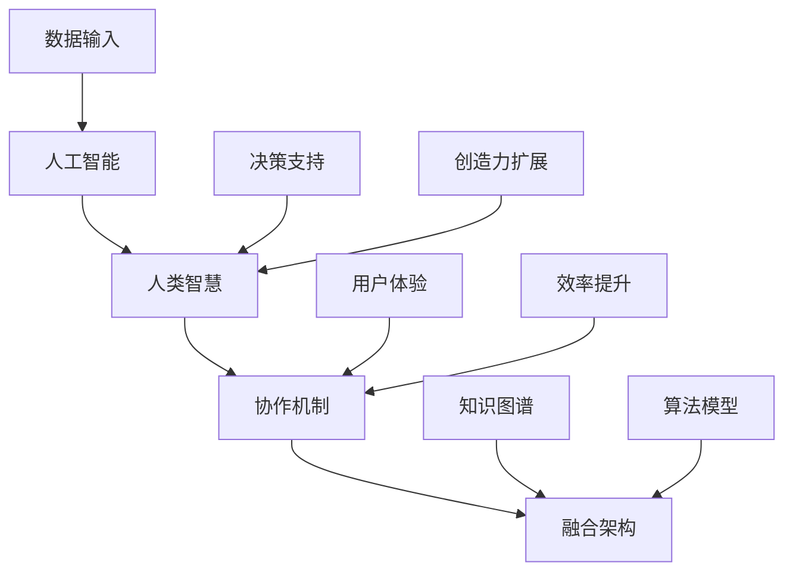

                 

关键词：人工智能，人类智慧，协作，融合，趋势预测，机遇，挑战，未来发展

摘要：随着人工智能技术的快速发展，人类与AI的协作正逐渐成为增强人类智慧的重要方式。本文将探讨人类与AI协作的核心概念、发展趋势、算法原理、数学模型、项目实践以及未来应用场景，分析其中的机遇与挑战，并对未来发展趋势进行预测。

## 1. 背景介绍

在信息技术飞速发展的今天，人工智能（AI）已经成为改变世界的重要力量。从智能助手到自动驾驶，从图像识别到自然语言处理，AI技术的应用无处不在。与此同时，人类智慧也在不断进步，尤其在解决问题、决策和创造力方面表现出色。然而，人类智慧与AI各自的优势互补，使得人类-AI协作成为一种必然的趋势。

人类-AI协作的核心在于发挥AI的计算和数据处理能力，同时利用人类的直觉、情感和创造力。这种协作模式不仅能够提升工作效率，还能够拓宽人类的认知能力，从而解决更多复杂的问题。随着AI技术的不断进步，人类-AI协作正逐渐成为提高人类智慧的重要途径。

## 2. 核心概念与联系

在探讨人类-AI协作时，我们需要明确几个核心概念，包括人工智能、人类智慧、协作机制以及融合架构。以下是这些概念及其相互关系的 Mermaid 流程图：



### 2.1 人工智能

人工智能是指通过计算机程序实现的智能行为，包括机器学习、深度学习、自然语言处理等。AI能够在大量数据中快速提取规律，并应用于各种任务，如图像识别、语音识别和预测分析。

### 2.2 人类智慧

人类智慧是指人类在解决问题、创新和决策过程中表现出的认知能力。这包括逻辑思维、创造力、情感认知和社交智慧等方面。

### 2.3 协作机制

协作机制是指人类与AI之间的交互方式，包括人机交互界面、智能助手和协同工作平台等。这些机制旨在提高人类与AI之间的沟通效率，实现无缝协作。

### 2.4 融合架构

融合架构是指将人类智慧与AI能力有机结合的框架。它包括数据输入、知识图谱、算法模型和决策支持等多个层次，旨在实现人类与AI的协同工作。

## 3. 核心算法原理 & 具体操作步骤

### 3.1 算法原理概述

人类-AI协作的核心算法主要包括机器学习算法和深度学习算法。这些算法通过训练大量数据，提取出模型参数，从而实现智能预测、决策和优化。

### 3.2 算法步骤详解

#### 3.2.1 数据收集与预处理

1. 收集大量数据，包括结构化和非结构化数据。
2. 数据清洗，去除噪声和错误。
3. 数据转换，将不同格式的数据统一转换为适合算法处理的格式。

#### 3.2.2 模型训练

1. 选择合适的机器学习或深度学习算法。
2. 输入训练数据，调整模型参数。
3. 迭代训练，优化模型性能。

#### 3.2.3 模型评估

1. 使用测试数据评估模型性能。
2. 分析模型的准确度、召回率等指标。
3. 调整模型参数，优化性能。

### 3.3 算法优缺点

#### 优点：

1. 能够处理大量数据，快速提取规律。
2. 自动化决策，提高工作效率。
3. 减少人为错误，提高决策质量。

#### 缺点：

1. 需要大量高质量数据支持。
2. 模型训练时间较长。
3. 模型解释性较差。

### 3.4 算法应用领域

人类-AI协作算法广泛应用于金融、医疗、教育、制造等多个领域。例如，在金融领域，AI可以用于股票市场预测、风险管理等；在医疗领域，AI可以用于疾病诊断、治疗方案推荐等。

## 4. 数学模型和公式 & 详细讲解 & 举例说明

### 4.1 数学模型构建

人类-AI协作的数学模型主要包括线性回归、逻辑回归、神经网络等。以下是线性回归的数学模型：

$$
y = \beta_0 + \beta_1 x
$$

其中，$y$ 表示输出结果，$x$ 表示输入特征，$\beta_0$ 和 $\beta_1$ 是模型参数。

### 4.2 公式推导过程

线性回归模型的推导过程如下：

1. 假设输入特征为 $x$，输出结果为 $y$。
2. 建立线性模型：$y = \beta_0 + \beta_1 x$。
3. 求解模型参数 $\beta_0$ 和 $\beta_1$，使得模型误差最小。

### 4.3 案例分析与讲解

假设我们有一个数据集，包含 100 个样本，每个样本包括两个特征 $x_1$ 和 $x_2$，以及对应的输出结果 $y$。我们使用线性回归模型来预测输出结果。

1. 数据收集与预处理：收集数据，并进行清洗和转换。
2. 模型训练：使用训练数据集训练线性回归模型，求解模型参数。
3. 模型评估：使用测试数据集评估模型性能，调整模型参数。
4. 预测结果：使用训练好的模型对新的样本进行预测。

## 5. 项目实践：代码实例和详细解释说明

### 5.1 开发环境搭建

1. 安装 Python 环境。
2. 安装必要的库，如 NumPy、Pandas、Scikit-learn 等。

### 5.2 源代码详细实现

```python
import numpy as np
import pandas as pd
from sklearn.linear_model import LinearRegression

# 数据收集与预处理
data = pd.read_csv('data.csv')
X = data[['x1', 'x2']]
y = data['y']

# 模型训练
model = LinearRegression()
model.fit(X, y)

# 模型评估
score = model.score(X, y)
print(f'Model accuracy: {score:.2f}')

# 预测结果
new_data = pd.DataFrame({'x1': [1, 2], 'x2': [3, 4]})
predictions = model.predict(new_data)
print(f'Predictions: {predictions}')
```

### 5.3 代码解读与分析

1. 导入必要的库。
2. 数据收集与预处理：从 CSV 文件中读取数据，并进行分割。
3. 模型训练：使用训练数据集训练线性回归模型。
4. 模型评估：计算模型准确度。
5. 预测结果：使用训练好的模型对新的数据进行预测。

## 6. 实际应用场景

人类-AI协作在实际应用中具有广泛的应用场景。以下是一些典型的应用案例：

1. **金融领域**：使用 AI 技术进行股票市场预测、风险管理、客户服务优化等。
2. **医疗领域**：使用 AI 技术进行疾病诊断、治疗方案推荐、健康数据监测等。
3. **教育领域**：使用 AI 技术进行个性化教学、学习效果评估、教育资源优化等。
4. **制造领域**：使用 AI 技术进行生产线优化、质量检测、设备维护等。

## 7. 未来应用展望

随着 AI 技术的不断发展，人类-AI协作将在更多领域得到应用。未来，AI 将更多地承担数据处理和分析的任务，人类则专注于决策和创新。以下是一些未来应用展望：

1. **智慧城市**：AI 将用于交通管理、环境监测、能源优化等方面，提升城市运行效率。
2. **智能医疗**：AI 将在疾病预防、个性化医疗、健康监测等方面发挥重要作用。
3. **智能家居**：AI 将使家居设备更加智能化，提升生活品质。
4. **智能制造**：AI 将推动制造业向智能化、自动化方向发展。

## 8. 总结：未来发展趋势与挑战

### 8.1 研究成果总结

人类-AI协作在近年来取得了显著的研究成果，包括算法优化、应用拓展和融合架构等方面。这些研究成果为人类-AI协作提供了有力的技术支持。

### 8.2 未来发展趋势

未来，人类-AI协作将朝着更加智能化、自适应化和人机协同化的方向发展。同时，跨学科合作、多领域应用和开源共享也将成为发展趋势。

### 8.3 面临的挑战

人类-AI协作仍面临许多挑战，包括数据隐私、算法透明性、人机交互和伦理问题等。这些挑战需要多方共同努力，寻求解决方案。

### 8.4 研究展望

未来，人类-AI协作研究将继续深入，探索更加高效的协作机制、更智能的算法模型和更广泛的应用场景。同时，也将加强对伦理问题的关注，确保人类-AI协作的可持续发展。

## 9. 附录：常见问题与解答

### 9.1 什么是人类-AI协作？

人类-AI协作是指人类与人工智能系统之间的合作，通过结合人类智慧和AI的计算能力，共同完成任务或解决问题。

### 9.2 人类-AI协作的优势有哪些？

人类-AI协作的优势包括：提高工作效率、减少错误、拓宽认知能力、自动化决策和提升创造力等。

### 9.3 人类-AI协作的挑战有哪些？

人类-AI协作的挑战包括：数据隐私、算法透明性、人机交互、伦理问题和技术局限等。

---

本文由禅与计算机程序设计艺术 / Zen and the Art of Computer Programming 撰写，旨在探讨人类-AI协作的发展趋势、机遇与挑战。希望本文能为读者提供有价值的参考和启示。未来，人类-AI协作将继续发展，为人类社会带来更多创新和变革。让我们共同期待这一美好未来。

