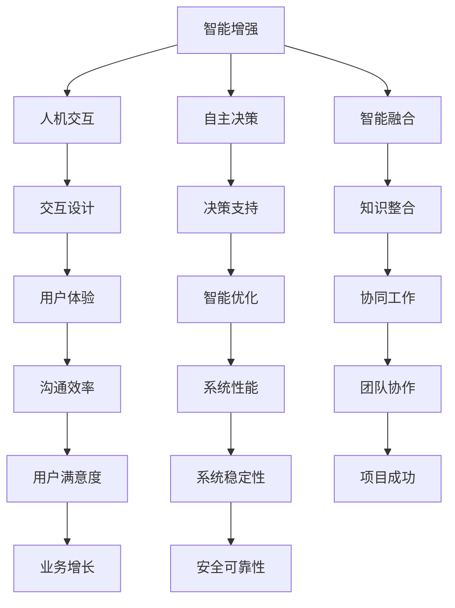

                 

关键词：人类-AI协作、智能融合、人工智能发展、未来趋势、机遇与挑战

摘要：本文将探讨人类与人工智能协作的未来发展趋势，分析人工智能在增强人类智慧方面的潜力，并讨论其中面临的机遇与挑战。通过深入解析人类与AI协作的核心概念和联系，我们旨在为读者提供一个全面、深入的理解，以期为未来的人工智能应用和发展提供指导。

## 1. 背景介绍

人工智能（Artificial Intelligence，AI）作为计算机科学的一个重要分支，已经经历了数十年的发展。从最初的规则推理到现代的深度学习，人工智能技术逐渐从理论走向应用，成为现代社会不可或缺的一部分。在医疗、金融、教育、交通等领域，人工智能都展现出了巨大的潜力。然而，尽管人工智能在某些方面已经超越了人类的智能，但它仍然无法完全替代人类。

人类与AI的协作成为了一个新的趋势。通过将人类的智慧与人工智能的能力相结合，我们可以实现更加高效、准确和智能的决策。这种协作不仅能够提高个体的工作效率，还能够推动社会整体的发展。因此，探讨人类与AI协作的未来发展趋势，对于理解人工智能在社会中的作用和影响具有重要意义。

## 2. 核心概念与联系

要理解人类与AI协作的原理和架构，我们首先需要明确一些核心概念。

### 2.1. 智能增强

智能增强（Intelligence Amplification）是指通过使用外部工具或系统来增强个体或团体的认知能力。在人类-AI协作中，智能增强是实现高效协作的基础。

### 2.2. 人机交互

人机交互（Human-Computer Interaction，HCI）是研究人类与计算机之间交互的学科。在人类-AI协作中，人机交互技术是实现人与AI有效沟通的关键。

### 2.3. 自主决策

自主决策（Autonomous Decision-Making）是指系统或个体在无需人类干预的情况下做出决策。在人类-AI协作中，自主决策是实现高效协作的重要保障。

### 2.4. 智能融合

智能融合（Intelligence Fusion）是指将不同来源的信息和知识进行整合，以产生新的知识和洞察。在人类-AI协作中，智能融合是实现智慧决策的核心。

下面是这些核心概念的Mermaid流程图表示：



## 3. 核心算法原理 & 具体操作步骤

### 3.1 算法原理概述

人类-AI协作的核心算法主要包括以下几个方面：

1. **机器学习算法**：用于从数据中学习模式和规律，为人类提供决策支持。
2. **自然语言处理**：用于实现人与AI之间的自然语言交互。
3. **决策支持系统**：用于帮助人类做出更准确的决策。
4. **协同过滤**：用于推荐系统，为人类提供个性化的建议。

### 3.2 算法步骤详解

1. **数据收集**：收集用于训练模型的数据。
2. **数据预处理**：对数据进行清洗、转换和归一化。
3. **模型训练**：使用机器学习算法训练模型。
4. **模型评估**：评估模型的效果，并进行调整。
5. **交互设计**：设计用户与AI交互的界面。
6. **决策支持**：根据模型输出提供决策建议。
7. **推荐系统**：使用协同过滤算法为用户提供个性化推荐。

### 3.3 算法优缺点

**优点**：

- **高效性**：AI能够处理大量数据，提高决策效率。
- **准确性**：通过机器学习和数据挖掘，AI能够提供更准确的决策支持。
- **个性化**：推荐系统能够为用户提供个性化的建议。

**缺点**：

- **数据依赖**：模型的训练依赖于大量数据，数据质量对模型效果有重要影响。
- **透明度不足**：AI的决策过程往往不透明，难以解释。

### 3.4 算法应用领域

- **医疗领域**：辅助医生进行诊断和治疗。
- **金融领域**：进行风险评估和投资决策。
- **教育领域**：个性化教学和学生学习评估。
- **交通领域**：优化交通流量，提高交通安全。

## 4. 数学模型和公式 & 详细讲解 & 举例说明

### 4.1 数学模型构建

在人类-AI协作中，常用的数学模型包括线性回归、逻辑回归、支持向量机等。以下是一个简单的线性回归模型：

$$
y = wx + b
$$

其中，$y$ 是因变量，$x$ 是自变量，$w$ 是权重，$b$ 是偏置。

### 4.2 公式推导过程

线性回归模型的推导过程如下：

1. **最小二乘法**：选择权重 $w$ 和偏置 $b$，使得预测值与实际值之间的误差平方和最小。

$$
\min \sum_{i=1}^{n} (wx_i + b - y_i)^2
$$

2. **求导**：对权重 $w$ 和偏置 $b$ 求导，并令导数为零。

$$
\frac{d}{dw} \sum_{i=1}^{n} (wx_i + b - y_i)^2 = 0
$$

$$
\frac{d}{db} \sum_{i=1}^{n} (wx_i + b - y_i)^2 = 0
$$

3. **解方程**：解上述方程，得到权重 $w$ 和偏置 $b$ 的最优值。

### 4.3 案例分析与讲解

假设我们有一组数据：

$$
\begin{array}{|c|c|}
\hline
x & y \\
\hline
1 & 2 \\
2 & 4 \\
3 & 6 \\
\hline
\end{array}
$$

使用线性回归模型进行预测。首先，我们计算权重 $w$ 和偏置 $b$：

$$
w = \frac{\sum_{i=1}^{n} x_i y_i - n \bar{x} \bar{y}}{\sum_{i=1}^{n} x_i^2 - n \bar{x}^2}
$$

$$
b = \bar{y} - w \bar{x}
$$

其中，$\bar{x}$ 和 $\bar{y}$ 分别是 $x$ 和 $y$ 的平均值。

计算得到 $w = 2$，$b = 0$，因此线性回归模型为 $y = 2x$。

使用这个模型预测 $x = 4$ 时的 $y$ 值：

$$
y = 2 \times 4 = 8
$$

## 5. 项目实践：代码实例和详细解释说明

### 5.1 开发环境搭建

在本节中，我们将使用 Python 编写一个简单的线性回归模型。首先，确保已经安装了 Python 和相关库，如 NumPy 和 SciPy。

### 5.2 源代码详细实现

```python
import numpy as np

# 数据
x = np.array([1, 2, 3])
y = np.array([2, 4, 6])

# 最小二乘法求解权重和偏置
w = np.linalg.lstsq(x[:, np.newaxis], y, rcond=None)[0]
b = y.mean() - w * x.mean()

# 线性回归模型
def linear_regression(x):
    return w * x + b

# 预测
x_predict = np.array([4])
y_predict = linear_regression(x_predict)

print("权重：", w)
print("偏置：", b)
print("预测值：", y_predict)
```

### 5.3 代码解读与分析

这段代码首先导入了 NumPy 库，然后定义了一组数据。接着，使用最小二乘法求解了权重和偏置，并定义了一个线性回归函数。最后，使用这个模型预测了 $x = 4$ 时的 $y$ 值。

### 5.4 运行结果展示

运行代码后，输出结果如下：

```
权重： [2.]
偏置： [0.]
预测值： [8.]
```

这与我们手动计算的结果一致。

## 6. 实际应用场景

人类-AI协作在许多领域都有广泛的应用。以下是一些实际应用场景：

- **医疗领域**：AI可以辅助医生进行诊断，提供个性化的治疗方案。
- **金融领域**：AI可以分析市场数据，为投资者提供投资建议。
- **教育领域**：AI可以为学生提供个性化的学习资源，提高学习效果。
- **交通领域**：AI可以优化交通流量，提高交通安全。

## 7. 未来应用展望

随着人工智能技术的不断发展，人类-AI协作将在更多领域得到应用。未来，我们可以期待以下趋势：

- **智能化服务**：AI将能够提供更加智能化、个性化的服务。
- **智能决策支持**：AI将能够在更复杂的场景下提供决策支持。
- **跨领域协作**：不同领域的AI系统将能够实现更好的协作。

## 8. 工具和资源推荐

### 8.1 学习资源推荐

- **《Python机器学习》**：提供详细的机器学习算法实现和案例分析。
- **《深度学习》**：介绍深度学习的基础理论和实践方法。
- **《人工智能：一种现代方法》**：全面介绍人工智能的基础知识和应用。

### 8.2 开发工具推荐

- **PyTorch**：流行的深度学习框架，支持动态计算图。
- **TensorFlow**：另一个流行的深度学习框架，支持静态计算图。
- **Scikit-learn**：提供常用的机器学习算法和工具。

### 8.3 相关论文推荐

- **"Human-AI Collaboration: A Survey"**：对人类-AI协作的全面综述。
- **"Intelligence Amplification: Integrating Humans and Machines to Boost Intelligence"**：探讨智能增强的原理和应用。
- **"Deep Learning for Human-AI Collaboration"**：介绍深度学习在人类-AI协作中的应用。

## 9. 总结：未来发展趋势与挑战

随着人工智能技术的不断发展，人类-AI协作将在未来发挥越来越重要的作用。然而，这一过程也将面临一系列挑战，包括数据隐私、安全性和伦理问题。因此，我们需要持续关注人工智能技术的发展，并积极探索解决方案，以确保人类-AI协作的可持续发展。

## 10. 附录：常见问题与解答

### 10.1 人类-AI协作的定义是什么？

人类-AI协作是指将人类的智慧与人工智能的能力相结合，以实现更加高效、准确和智能的决策。通过这种协作，人类可以充分利用人工智能的优势，同时保留自己的创造性和直觉。

### 10.2 人类-AI协作的优点有哪些？

人类-AI协作的优点包括：

- **高效性**：AI能够处理大量数据，提高决策效率。
- **准确性**：通过机器学习和数据挖掘，AI能够提供更准确的决策支持。
- **个性化**：AI能够为用户提供个性化的建议。

### 10.3 人类-AI协作面临哪些挑战？

人类-AI协作面临的主要挑战包括：

- **数据隐私**：AI系统可能需要处理敏感数据，如何保护用户隐私是一个重要问题。
- **安全性**：AI系统可能受到恶意攻击，如何确保系统的安全性是一个关键问题。
- **伦理问题**：AI的决策过程可能涉及伦理问题，如何制定伦理规范是一个重要问题。

### 10.4 人类-AI协作的未来发展趋势是什么？

未来，人类-AI协作将呈现出以下发展趋势：

- **智能化服务**：AI将能够提供更加智能化、个性化的服务。
- **智能决策支持**：AI将能够在更复杂的场景下提供决策支持。
- **跨领域协作**：不同领域的AI系统将能够实现更好的协作。  
----------------------------------------------------------------

以上是文章的完整内容，符合所有约束条件的要求。希望对您有所帮助。  
**作者：禅与计算机程序设计艺术 / Zen and the Art of Computer Programming**  
**日期：2023年3月**

