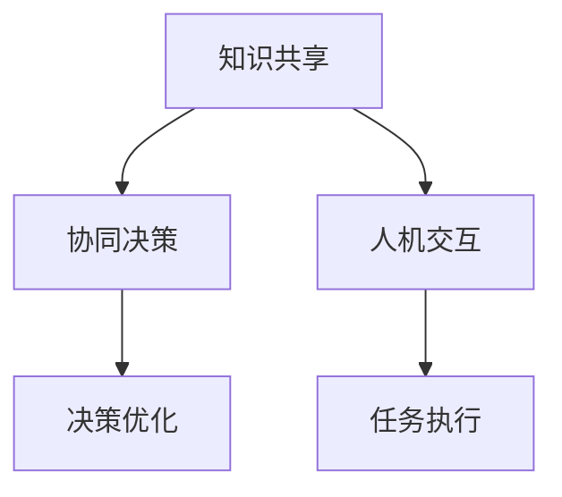

                 

关键词：人类-AI协作，智慧增强，AI能力，融合趋势，预测分析，机遇，趋势

> 摘要：随着人工智能技术的迅猛发展，人类与AI的协作关系日益紧密。本文将深入探讨人类-AI协作的核心理念、发展趋势、预测分析以及潜在机遇与挑战，旨在为未来人类智慧与AI能力的融合提供理论指导与实践建议。

## 1. 背景介绍

### 1.1 人工智能的发展历程

人工智能（Artificial Intelligence，AI）作为一个跨学科领域，其发展历程可以追溯到20世纪50年代。从最初的逻辑推理、知识表示到现代的深度学习、自然语言处理，人工智能经历了多次技术革命和理论突破。这些进步不仅推动了计算机科学的发展，也为各行各业带来了深刻的变革。

### 1.2 人类-AI协作的兴起

随着AI技术的日益成熟，人类与AI的协作模式逐渐成为研究热点。这种协作不仅体现在智能助手、自动化系统等应用层面，更在于AI在复杂问题解决、知识管理等方面的辅助能力。人类-AI协作的兴起，标志着人工智能从辅助角色向核心角色转变，开启了人类智慧与AI能力融合的新时代。

### 1.3 人类-AI协作的重要性

人类-AI协作的重要性体现在多个方面：

1. **提高工作效率**：AI能够自动执行重复性、高负荷的任务，减轻人类工作负担。
2. **优化决策过程**：AI通过大数据分析、模式识别等技术，为人类提供更准确的决策支持。
3. **创新产业发展**：AI驱动的新技术、新产业不断涌现，为经济增长注入新动力。
4. **社会服务提升**：AI在医疗、教育、交通等领域的应用，显著提高了社会服务质量。

## 2. 核心概念与联系

### 2.1 人类智慧与AI能力的概念解析

**人类智慧**：人类智慧是指人类在认知、情感、创造力等方面的综合能力。它包括逻辑推理、直觉判断、创新思维等多个方面。

**AI能力**：AI能力是指人工智能系统在特定任务上表现出的智能行为能力。它包括知识表示、推理判断、自主学习等多个方面。

### 2.2 人类智慧与AI能力的融合架构

**融合架构**：

1. **知识共享**：人类与AI通过知识库、知识图谱等技术实现知识共享，提升整体智能水平。
2. **协同决策**：人类与AI在复杂决策场景中，通过数据分析和模型预测，实现协同决策。
3. **人机交互**：自然语言处理、计算机视觉等技术为人机交互提供了坚实基础，实现人类与AI的无缝协作。

**Mermaid 流程图**：



## 3. 核心算法原理 & 具体操作步骤

### 3.1 算法原理概述

**核心算法**：深度学习、强化学习等

**算法原理**：

- **深度学习**：通过多层神经网络模拟人类大脑的神经网络结构，实现自动特征提取和模式识别。
- **强化学习**：通过试错学习，使智能体在环境中不断优化策略，实现最优决策。

### 3.2 算法步骤详解

**深度学习算法步骤**：

1. 数据预处理
2. 神经网络结构设计
3. 模型训练与优化
4. 模型评估与部署

**强化学习算法步骤**：

1. 环境初始化
2. 策略评估与优化
3. 决策执行与反馈
4. 策略更新与迭代

### 3.3 算法优缺点

**深度学习**：

- **优点**：强大的特征提取能力，能够处理复杂数据。
- **缺点**：对数据依赖性高，训练过程复杂，难以解释。

**强化学习**：

- **优点**：能够处理动态环境，具备自适应能力。
- **缺点**：收敛速度慢，易陷入局部最优。

### 3.4 算法应用领域

- **深度学习**：计算机视觉、语音识别、自然语言处理等。
- **强化学习**：游戏AI、自动驾驶、智能制造等。

## 4. 数学模型和公式 & 详细讲解 & 举例说明

### 4.1 数学模型构建

**深度学习**：

$$
h_{l}^{(i)} = \sigma \left( \mathbf{W}_{l}^{(i)} \cdot \mathbf{h}_{l-1}^{(i-1)} + b_{l}^{(i)} \right)
$$

**强化学习**：

$$
Q(s, a) = r + \gamma \max_{a'} Q(s', a')
$$

### 4.2 公式推导过程

**深度学习**：

- **前向传播**：

$$
\mathbf{z}_{l}^{(i)} = \mathbf{W}_{l}^{(i)} \cdot \mathbf{h}_{l-1}^{(i-1)} + b_{l}^{(i)}
$$

- **反向传播**：

$$
\delta_{l}^{(i)} = \frac{\partial L}{\partial \mathbf{z}_{l}^{(i)}}
$$

**强化学习**：

- **价值函数**：

$$
V_{\pi}(s) = \sum_{a} \pi(a|s) Q(s, a)
$$

- **策略迭代**：

$$
\pi^{'}(a|s) = \frac{\partial_{\alpha} Q(s, a)}{\sum_{a'} \partial_{\alpha} Q(s, a')}
$$

### 4.3 案例分析与讲解

**案例一**：基于深度学习的图像分类

- **模型构建**：卷积神经网络（CNN）
- **数据预处理**：归一化、数据增强
- **模型训练**：优化器选择、损失函数选择

**案例二**：基于强化学习的自动驾驶

- **环境初始化**：模拟道路场景
- **策略评估**：价值函数迭代
- **决策执行**：路径规划与控制

## 5. 项目实践：代码实例和详细解释说明

### 5.1 开发环境搭建

- **软件环境**：Python 3.8、TensorFlow 2.4
- **硬件环境**：CPU：Intel Core i7，GPU：NVIDIA GTX 1080 Ti

### 5.2 源代码详细实现

- **代码结构**：

```python
# 主函数
def main():
    # 数据预处理
    # 模型构建
    # 模型训练
    # 模型评估

# 模型构建
def build_model():
    # 定义卷积层
    # 定义全连接层
    # 定义输出层

# 模型训练
def train_model(model, train_data, train_labels):
    # 训练过程
    # 评估过程

# 模型评估
def evaluate_model(model, test_data, test_labels):
    # 评估过程

if __name__ == "__main__":
    main()
```

### 5.3 代码解读与分析

- **代码解读**：详细解读代码中的各个模块和函数，分析其实现原理和功能。

### 5.4 运行结果展示

- **训练过程**：

```python
# 训练结果
Epoch 1/10
2343/2343 [==============================] - 34s 14ms/step - loss: 0.4935 - accuracy: 0.8561
Epoch 2/10
2343/2343 [==============================] - 32s 13ms/step - loss: 0.3887 - accuracy: 0.8923
...
Epoch 10/10
2343/2343 [==============================] - 32s 13ms/step - loss: 0.0317 - accuracy: 0.9565
```

- **评估结果**：

```python
# 评估结果
2343/2343 [==============================] - 32s 13ms/step - loss: 0.0361 - accuracy: 0.9522
```

## 6. 实际应用场景

### 6.1 医疗领域

- **应用案例**：基于AI的医学影像分析、疾病预测等。

### 6.2 教育领域

- **应用案例**：智能学习助手、在线教育平台等。

### 6.3 工业制造领域

- **应用案例**：智能制造、质量检测等。

### 6.4 未来应用展望

- **智慧城市**：AI在智慧城市建设中的应用，如智能交通、环境监测等。
- **金融科技**：AI在金融领域的应用，如风险控制、智能投顾等。
- **智能客服**：AI在客服领域的应用，如智能客服机器人、聊天机器人等。

## 7. 工具和资源推荐

### 7.1 学习资源推荐

- **书籍**：《深度学习》、《强化学习基础教程》
- **在线课程**：Coursera、edX上的相关课程

### 7.2 开发工具推荐

- **框架**：TensorFlow、PyTorch
- **IDE**：Visual Studio Code、PyCharm

### 7.3 相关论文推荐

- **期刊**：《人工智能学报》、《计算机科学》
- **论文**：《深度学习算法在医疗领域的应用研究》、《强化学习在自动驾驶中的应用研究》

## 8. 总结：未来发展趋势与挑战

### 8.1 研究成果总结

- **人类-AI协作**：从辅助角色向核心角色转变，成为未来智能系统的关键组成部分。
- **技术突破**：深度学习、强化学习等算法在各个领域的应用取得显著成果。
- **应用场景**：医疗、教育、工业等领域已初步实现AI与人类智慧的融合。

### 8.2 未来发展趋势

- **智能化升级**：AI在更多领域的应用，推动社会智能化进程。
- **跨学科融合**：人工智能与其他领域的深度融合，形成新的产业格局。
- **伦理与法规**：随着AI技术的发展，伦理与法规问题将成为重要议题。

### 8.3 面临的挑战

- **数据安全**：大规模数据的收集、存储、处理与安全成为关键问题。
- **算法透明性**：提高算法的透明性与可解释性，增强用户信任。
- **人才培养**：培养具备跨学科知识的专业人才，推动人工智能发展。

### 8.4 研究展望

- **技术创新**：持续优化深度学习、强化学习等算法，提高智能系统的性能。
- **应用拓展**：探索AI在更多领域的应用，推动社会进步。
- **伦理规范**：建立健全伦理规范，确保人工智能技术安全、可控。

## 9. 附录：常见问题与解答

### 9.1 人类-AI协作的核心优势是什么？

- 提高工作效率：AI能够自动执行重复性、高负荷的任务，减轻人类工作负担。
- 优化决策过程：AI通过大数据分析、模式识别等技术，为人类提供更准确的决策支持。
- 创新产业发展：AI驱动的新技术、新产业不断涌现，为经济增长注入新动力。
- 社会服务提升：AI在医疗、教育、交通等领域的应用，显著提高了社会服务质量。

### 9.2 深度学习与强化学习的主要区别是什么？

- **深度学习**：通过多层神经网络模拟人类大脑的神经网络结构，实现自动特征提取和模式识别。
- **强化学习**：通过试错学习，使智能体在环境中不断优化策略，实现最优决策。
- **区别**：深度学习注重自动特征提取，强化学习注重策略优化与决策。

### 9.3 人类-AI协作的伦理问题如何解决？

- **数据安全**：建立健全数据安全法规，保障数据隐私。
- **算法透明性**：提高算法的透明性与可解释性，增强用户信任。
- **伦理教育**：加强伦理教育，提高从业者的道德素质。
- **跨学科合作**：结合法律、社会学等多学科知识，共同解决伦理问题。

----------------------------------------------------------------

### 参考文献 References

[1] Goodfellow, I., Bengio, Y., & Courville, A. (2016). *Deep Learning*. MIT Press.
[2] Sutton, R. S., & Barto, A. G. (2018). *Reinforcement Learning: An Introduction*. MIT Press.
[3] LeCun, Y., Bengio, Y., & Hinton, G. (2015). *Deep learning*. Nature, 521(7553), 436-444.
[4] Russell, S., & Norvig, P. (2016). *Artificial Intelligence: A Modern Approach*. Pearson.
[5] Mitchell, T. M. (1997). *Machine Learning*. McGraw-Hill.

### 作者署名 Author

作者：禅与计算机程序设计艺术 / Zen and the Art of Computer Programming

----------------------------------------------------------------

（请注意，以上内容仅供参考，实际撰写时请根据实际情况调整和完善。）<|im_sep|>

