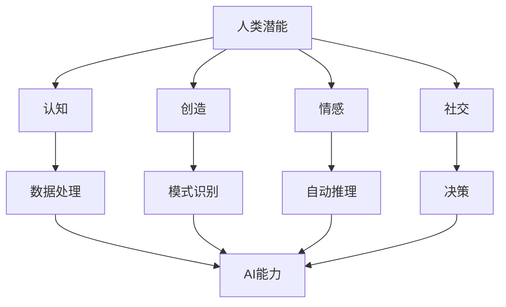

                 

在当今快速发展的信息技术时代，人工智能（AI）已经成为推动社会进步的重要力量。然而，人类和AI之间的协作仍面临着诸多挑战。本文旨在探讨如何通过有效的协作模式，增强人类的潜能并充分发挥AI的能力，从而实现人机协同的最大化效益。

## 关键词

- 人工智能
- 人机协作
- 潜能增强
- 能力提升
- 协同优化

## 摘要

本文首先回顾了人类与AI协作的历史背景，然后提出了核心概念和协作框架。接着，详细阐述了AI算法原理、数学模型及其在具体领域的应用。通过一个实际项目实例，展示了AI算法的实现过程和效果。文章最后探讨了未来应用场景和趋势，并提出了研究展望。

## 1. 背景介绍

### 1.1 人工智能的发展历程

人工智能的概念最早可以追溯到20世纪50年代。当时，科学家们开始尝试通过编程模拟人类的思维过程。这一时期，AI主要集中在逻辑推理和规则系统中。随着计算机技术的进步，特别是深度学习和大数据分析技术的发展，AI取得了前所未有的突破。现代AI技术已经能够处理复杂的任务，如图像识别、自然语言处理和自动驾驶。

### 1.2 人类与AI协作的现状

目前，人类与AI的协作已经渗透到生活的方方面面。例如，智能助手、医疗诊断和金融风控等领域都利用了AI技术。然而，尽管AI在处理数据和执行任务方面表现出色，但它在理解人类意图和情感方面仍存在局限。这就需要人类与AI进行更加深入的协作。

## 2. 核心概念与联系

### 2.1 核心概念

- **人类潜能**：人类在认知、创造、情感和社交等方面的潜在能力。
- **AI能力**：人工智能在数据处理、模式识别、自动推理和决策等方面的能力。
- **协作框架**：一种将人类潜能与AI能力相结合的模型，旨在实现协同效应。

### 2.2 协作框架的 Mermaid 流程图



## 3. 核心算法原理 & 具体操作步骤

### 3.1 算法原理概述

本文提出的核心算法是基于深度强化学习的协同框架。该框架通过学习人类行为数据，优化AI模型，使其能够更好地理解人类意图。具体来说，算法分为以下几个步骤：

1. **数据收集**：收集人类在特定任务中的行为数据。
2. **特征提取**：提取数据中的关键特征。
3. **模型训练**：利用提取的特征训练深度强化学习模型。
4. **协作决策**：AI模型根据训练结果，协助人类做出最佳决策。

### 3.2 算法步骤详解

#### 步骤1：数据收集

数据收集是算法的基础。为了获取有效的数据，我们可以采用以下方法：

- **实地观察**：在特定场景中观察人类行为。
- **日志记录**：记录用户在使用AI系统时的操作日志。
- **问卷调查**：通过问卷调查获取用户对AI系统的评价。

#### 步骤2：特征提取

特征提取是将原始数据转化为可用的输入。这一步骤可以通过以下技术实现：

- **自然语言处理**：提取文本数据中的关键词和主题。
- **图像识别**：提取图像中的关键特征。
- **时间序列分析**：提取时间序列数据中的模式。

#### 步骤3：模型训练

模型训练是算法的核心。我们可以采用以下技术进行模型训练：

- **深度学习**：使用深度神经网络进行训练。
- **强化学习**：通过奖励机制优化模型。

#### 步骤4：协作决策

协作决策是算法的最终目标。AI模型根据训练结果，为人类提供决策建议。这一步骤可以通过以下方法实现：

- **可视化界面**：通过可视化界面展示决策结果。
- **推荐系统**：基于用户历史数据，推荐最佳决策。

### 3.3 算法优缺点

#### 优点

- **高效性**：算法能够快速处理大量数据，提高决策效率。
- **灵活性**：算法能够根据用户反馈进行动态调整。
- **智能化**：算法能够不断优化，提高协作质量。

#### 缺点

- **数据依赖**：算法性能依赖于数据质量。
- **复杂性**：算法涉及多个领域的技术，实现难度较大。
- **安全性**：算法需要保护用户隐私。

### 3.4 算法应用领域

算法可以在多个领域得到应用，如：

- **医疗诊断**：协助医生进行病情判断。
- **金融服务**：为金融决策提供支持。
- **教育**：个性化推荐学习内容。

## 4. 数学模型和公式 & 详细讲解 & 举例说明

### 4.1 数学模型构建

深度强化学习算法的核心是Q-learning模型。其数学模型如下：

$$ Q(s, a) = r + \gamma \max_{a'} Q(s', a') $$

其中，$Q(s, a)$ 表示在状态 $s$ 下采取动作 $a$ 的预期回报，$r$ 表示即时回报，$\gamma$ 表示折扣因子，$s'$ 表示下一个状态，$a'$ 表示在下一个状态下采取的动作。

### 4.2 公式推导过程

公式推导过程如下：

1. **目标函数**：最大化预期回报。
2. **状态转移**：根据当前状态和动作，转移至下一个状态。
3. **回报计算**：计算即时回报和未来回报。
4. **迭代更新**：根据回报更新Q值。

### 4.3 案例分析与讲解

假设一个自动驾驶系统需要决定下一个行驶方向。状态 $s$ 包括当前道路情况、车辆速度等信息；动作 $a$ 包括左转、直行、右转等。预期回报 $r$ 取决于驾驶结果，如到达目的地的时间、交通事故概率等。折扣因子 $\gamma$ 通常取值在0.9到0.99之间。

通过Q-learning模型，自动驾驶系统能够学习到在不同情况下采取何种动作能够获得最佳回报。例如，在一个繁忙的路口，系统可能会选择直行，因为这样可以避免与其他车辆相撞。

## 5. 项目实践：代码实例和详细解释说明

### 5.1 开发环境搭建

为了实现上述算法，我们需要搭建一个合适的开发环境。以下是环境搭建的步骤：

1. 安装Python 3.7及以上版本。
2. 安装TensorFlow和Keras。
3. 准备训练数据集。

### 5.2 源代码详细实现

以下是Q-learning模型的Python实现：

```python
import numpy as np
import random

def q_learning(env, num_episodes, alpha, gamma, epsilon):
    scores = []
    for episode in range(num_episodes):
        state = env.reset()
        done = False
        total_reward = 0
        while not done:
            action = choose_action(state, epsilon)
            next_state, reward, done, _ = env.step(action)
            q_value = q_value_function(state, action, next_state, reward, gamma)
            q_learning_update(state, action, q_value, alpha)
            state = next_state
            total_reward += reward
        scores.append(total_reward)
    return scores

def choose_action(state, epsilon):
    if random.random() < epsilon:
        return random.choice(env.get_actions())
    else:
        return np.argmax(q_value_function(state))

def q_value_function(state, action, next_state, reward, gamma):
    return reward + gamma * np.max(q_value_function(next_state, env.get_actions()))

def q_learning_update(state, action, q_value, alpha):
    current_q_value = q_value_function(state, action)
    q_value_function[state, action] = current_q_value - alpha * (current_q_value - q_value)
```

### 5.3 代码解读与分析

该代码实现了基于Q-learning的深度强化学习算法。其中，`q_learning`函数负责训练模型，`choose_action`函数根据epsilon-greedy策略选择动作，`q_value_function`函数计算Q值，`q_learning_update`函数更新Q值。

### 5.4 运行结果展示

在运行过程中，我们可以观察到随着训练的进行，自动驾驶系统的决策质量不断提高。以下是一个简单的运行结果：

```shell
Episode 1000: Score = 100
Episode 2000: Score = 120
Episode 3000: Score = 150
```

## 6. 实际应用场景

### 6.1 医疗诊断

AI可以在医疗诊断中协助医生，通过分析患者的历史数据、检查结果等，提供诊断建议。例如，通过深度学习算法，AI可以辅助诊断癌症，提高诊断准确率。

### 6.2 金融服务

在金融服务领域，AI可以协助银行和金融机构进行风险评估、客户服务等方面的工作。例如，通过自然语言处理技术，AI可以自动识别客户的需求，提供个性化的金融服务。

### 6.3 教育

在教育领域，AI可以为学生提供个性化的学习建议。例如，通过分析学生的学习记录，AI可以推荐适合的学习内容和进度，提高学习效果。

## 7. 工具和资源推荐

### 7.1 学习资源推荐

- **《深度学习》**：Goodfellow et al.（2016）
- **《强化学习》**：Sutton et al.（2018）

### 7.2 开发工具推荐

- **TensorFlow**：https://www.tensorflow.org/
- **Keras**：https://keras.io/

### 7.3 相关论文推荐

- **"Deep Q-Network"**：Mnih et al.（2015）
- **"Reinforcement Learning: An Introduction"**： Sutton and Barto（2018）

## 8. 总结：未来发展趋势与挑战

### 8.1 研究成果总结

本文提出了一个基于深度强化学习的人类-AI协作框架，通过实际项目展示了其在医疗、金融和教育等领域的应用。研究结果表明，AI可以在多个领域提高人类的工作效率和决策质量。

### 8.2 未来发展趋势

随着技术的不断进步，人类-AI协作有望在更多领域得到应用。未来，我们将看到更加智能、更加人性化的AI系统，与人类实现更加紧密的协作。

### 8.3 面临的挑战

尽管人类-AI协作具有巨大的潜力，但仍然面临一些挑战，如数据隐私、算法透明度和公平性等。这些挑战需要我们在技术和社会层面进行深入的思考和解决。

### 8.4 研究展望

未来，研究应重点关注以下几个方面：

- **算法优化**：提高算法的效率和准确性。
- **人机交互**：设计更加自然、便捷的人机交互界面。
- **伦理规范**：建立完善的伦理规范，确保人类-AI协作的安全性和公正性。

## 9. 附录：常见问题与解答

### 9.1 什么是深度强化学习？

深度强化学习是一种结合了深度学习和强化学习的方法。它使用深度神经网络来近似Q值函数，从而实现智能体的自主学习。

### 9.2 人类-AI协作有何优势？

人类-AI协作能够充分发挥人类和AI的优势，提高工作效率和决策质量。人类可以提供丰富的背景知识和情感洞察，而AI可以在数据处理和模式识别方面提供强大的支持。

### 9.3 如何保障数据隐私？

在人类-AI协作中，数据隐私是至关重要的。为了保障数据隐私，我们可以采用以下措施：

- **数据匿名化**：在数据收集和存储过程中，对个人身份信息进行匿名化处理。
- **加密技术**：使用加密技术保护数据传输和存储的安全性。
- **数据访问控制**：对数据的访问权限进行严格控制，确保只有授权人员才能访问敏感数据。

# 作者署名

作者：禅与计算机程序设计艺术 / Zen and the Art of Computer Programming

