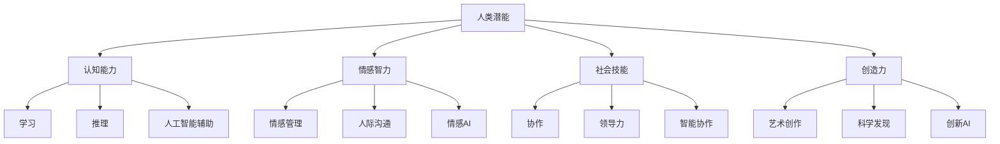

                 

关键词：人工智能、人类潜能、协同演进、算法、数学模型、应用实践、未来展望

> 摘要：本文旨在探讨人类与人工智能的协作关系，分析如何通过人工智能增强人类潜能，并促进两者能力的协同演进。我们将从核心概念、算法原理、数学模型、项目实践等多个方面展开讨论，最后对未来的发展趋势与挑战进行展望。

## 1. 背景介绍

在当今世界，人工智能（AI）正迅速改变着我们的生活方式和社会结构。从简单的语音识别到复杂的自动驾驶，AI技术已经渗透到各行各业。与此同时，人类的潜能也在不断被挖掘和提升。无论是认知能力、创造力还是学习能力，人类都展现了惊人的潜力。然而，如何将这两者结合起来，实现更高效、更智能的协作，成为了当前研究和应用的热点。

人工智能与人类的协作不仅体现在技术层面，更涉及到哲学、心理学、教育学等多个领域。人类如何通过AI工具提高自身能力，如何理解并引导AI发展，都是需要深入探讨的问题。本文将尝试从技术角度出发，阐述人类-AI协作的潜在机制和应用场景，以期为相关研究和实践提供参考。

### 1.1 人工智能的发展历程

人工智能的研究始于20世纪50年代，其核心目标是使机器具备智能，能够像人类一样进行思考、学习和决策。自那时以来，人工智能经历了几个重要的发展阶段：

- **第一阶段：符号主义（Symbolism）**：这一阶段强调利用符号表示知识，并通过逻辑推理实现智能。典型的代表是逻辑推理机（Logic Theorist）和通用问题求解器（General Problem Solver）。

- **第二阶段：知识表示（Knowledge Representation）**：这一阶段的研究重点是如何有效地表示和存储知识。专家系统（Expert Systems）成为这一阶段的代表性技术。

- **第三阶段：机器学习（Machine Learning）**：这一阶段的核心思想是通过算法使机器自动从数据中学习，提高其智能水平。神经网络（Neural Networks）和决策树（Decision Trees）等模型在这一阶段得到了广泛应用。

- **第四阶段：深度学习（Deep Learning）**：深度学习是机器学习的一个子领域，其核心思想是模拟人脑的神经网络结构，通过多层网络进行特征提取和分类。深度学习在图像识别、语音识别、自然语言处理等领域取得了显著成果。

### 1.2 人类潜能的挖掘与提升

人类的潜能是一个复杂而广泛的话题。从认知心理学角度来看，人类的潜能主要体现在以下几个方面：

- **认知能力**：包括记忆力、注意力、推理能力、创造力等。现代认知心理学研究表明，通过科学的训练和练习，这些能力可以得到显著提升。

- **情感智力**：情感智力是指理解和管理自己和他人的情感的能力。研究表明，情感智力对人际关系、工作绩效等方面具有显著影响。

- **社会技能**：包括沟通能力、协作能力、领导能力等。这些技能的不断提升可以帮助个体在社交和职业环境中取得更好的表现。

- **创造力**：创造力是人类独特的能力，它不仅体现在艺术和科学领域，也广泛应用于日常生活中。激发和培养创造力，可以促进个体的全面发展。

## 2. 核心概念与联系

为了深入探讨人类-AI协作的机制，我们需要明确几个核心概念，并理解它们之间的联系。以下是本文将涉及的核心概念和架构的 Mermaid 流程图：



### 2.1 核心概念解析

- **人类潜能**：指人类在认知、情感、社会和创造力等方面的潜在能力。

- **认知能力**：指人类在感知、记忆、推理、解决问题等方面的能力。

- **情感智力**：指人类在情感识别、情感表达、情感管理等方面的能力。

- **社会技能**：指人类在沟通、协作、领导等方面的能力。

- **创造力**：指人类在艺术、科学、技术等领域的创新和发现能力。

- **人工智能辅助**：指利用人工智能技术辅助人类潜能的挖掘和提升。

- **情感AI**：指利用人工智能技术理解和模拟人类情感。

- **智能协作**：指人类与人工智能在任务中的协作，通过互相补充实现更高效率。

- **创新AI**：指利用人工智能技术激发和培养人类创造力。

## 3. 核心算法原理 & 具体操作步骤

### 3.1 算法原理概述

在人类-AI协作中，核心算法主要涉及以下几个方面：

- **强化学习**：通过奖励机制，使人工智能代理在复杂环境中学习最优策略。

- **自然语言处理**：通过理解人类语言，实现人与机器的智能交互。

- **计算机视觉**：通过图像识别和目标检测，使机器能够理解视觉信息。

- **深度学习**：通过多层神经网络，实现数据的自动特征提取和分类。

### 3.2 算法步骤详解

#### 3.2.1 强化学习

1. **定义状态空间和动作空间**：根据具体任务，确定状态和动作的定义和范围。

2. **设计奖励机制**：定义奖励函数，以鼓励人工智能代理学习最优策略。

3. **训练过程**：通过迭代模拟，使人工智能代理在虚拟环境中学习。

4. **策略优化**：根据学习到的策略，优化决策过程。

#### 3.2.2 自然语言处理

1. **分词**：将输入文本分割成单词或短语。

2. **词性标注**：对每个词进行词性分类，如名词、动词等。

3. **句法分析**：分析句子的结构，确定词与词之间的关系。

4. **语义理解**：通过上下文，理解句子的语义和意图。

#### 3.2.3 计算机视觉

1. **图像预处理**：对图像进行去噪、增强等处理。

2. **特征提取**：从图像中提取有代表性的特征。

3. **目标检测**：定位图像中的目标并分类。

4. **图像识别**：识别图像中的内容。

#### 3.2.4 深度学习

1. **数据集准备**：收集和预处理数据，以供训练。

2. **模型设计**：根据任务需求，设计合适的神经网络结构。

3. **模型训练**：使用训练数据，优化模型参数。

4. **模型评估**：使用测试数据，评估模型性能。

### 3.3 算法优缺点

#### 3.3.1 强化学习

**优点**：

- **自适应性**：强化学习可以在动态环境中不断调整策略。
- **灵活性**：适用于各种复杂环境，无需预先定义状态和动作。

**缺点**：

- **训练成本高**：需要大量的样本和数据，训练过程较慢。
- **易陷入局部最优**：在复杂环境中，可能无法找到全局最优策略。

#### 3.3.2 自然语言处理

**优点**：

- **通用性**：自然语言处理技术可以应用于多种场景，如问答系统、智能客服等。
- **智能化**：通过深度学习等技术，自然语言处理可以实现更高水平的语义理解和交互。

**缺点**：

- **准确性**：在处理歧义和复杂语境时，自然语言处理技术仍有挑战。
- **鲁棒性**：对噪声和错误输入的容忍度较低。

#### 3.3.3 计算机视觉

**优点**：

- **直观性**：图像信息直观，易于理解和处理。
- **高效性**：计算机视觉技术可以快速处理大量图像数据。

**缺点**：

- **计算复杂度**：图像数据量大，处理过程复杂。
- **实时性**：在处理实时图像时，性能可能受到限制。

#### 3.3.4 深度学习

**优点**：

- **高效性**：深度学习模型可以在大量数据上快速训练和优化。
- **灵活性**：深度学习模型可以应用于多种任务，如分类、回归、生成等。

**缺点**：

- **数据需求**：深度学习需要大量标注数据，获取和标注数据成本高。
- **解释性**：深度学习模型内部的决策过程较难解释和理解。

### 3.4 算法应用领域

#### 3.4.1 强化学习

- **游戏AI**：如围棋、扑克等。
- **自动驾驶**：通过强化学习，实现自主驾驶。
- **机器人控制**：通过强化学习，使机器人更好地适应环境。

#### 3.4.2 自然语言处理

- **问答系统**：如智能客服、语音助手等。
- **机器翻译**：如谷歌翻译、百度翻译等。
- **文本摘要**：如新闻摘要、论文摘要等。

#### 3.4.3 计算机视觉

- **图像识别**：如人脸识别、车牌识别等。
- **目标检测**：如自动驾驶中的行人检测、车辆检测等。
- **图像生成**：如风格迁移、人脸生成等。

#### 3.4.4 深度学习

- **医疗诊断**：如癌症筛查、影像诊断等。
- **金融分析**：如股票预测、风险控制等。
- **推荐系统**：如电商推荐、内容推荐等。

## 4. 数学模型和公式 & 详细讲解 & 举例说明

在人类-AI协作中，数学模型和公式起到了关键作用。以下我们将详细介绍几个核心的数学模型，并使用 LaTeX 格式进行公式推导和举例说明。

### 4.1 数学模型构建

#### 4.1.1 强化学习中的 Q 学习算法

Q 学习算法是一种基于值函数的强化学习算法。其基本思想是学习一个值函数 Q(s, a)，表示在状态 s 下执行动作 a 的预期回报。

公式表示为：

$$
Q(s, a) = \sum_{s'} P(s' | s, a) \cdot R(s, a) + \gamma \cdot \max_{a'} Q(s', a')
$$

其中，$R(s, a)$ 是立即回报，$\gamma$ 是折扣因子，$P(s' | s, a)$ 是状态转移概率。

#### 4.1.2 自然语言处理中的词向量模型

词向量模型是一种将单词映射到向量空间的方法。常用的模型有 Word2Vec、GloVe 等。以 Word2Vec 为例，其目标是最小化以下损失函数：

$$
L = \sum_{i=1}^{N} \sum_{j=1}^{K} (w_j - \sum_{k \in C(w_i)} v_k)^2
$$

其中，$w_i$ 是单词 $w_i$ 的向量表示，$C(w_i)$ 是单词 $w_i$ 的上下文窗口，$v_k$ 是上下文单词 $w_k$ 的向量表示，$N$ 是词汇表大小，$K$ 是向量维度。

#### 4.1.3 计算机视觉中的卷积神经网络

卷积神经网络（CNN）是一种用于图像识别的深度学习模型。其基本结构包括卷积层、池化层和全连接层。以下是一个卷积层的损失函数：

$$
L = \frac{1}{N} \sum_{i=1}^{N} \sum_{k=1}^{C} (\sigma(f_{k}(x_i) - y_i)^2
$$

其中，$N$ 是样本数量，$C$ 是类别数量，$x_i$ 是输入图像，$y_i$ 是真实标签，$\sigma$ 是激活函数，$f_k$ 是卷积层第 $k$ 个滤波器的输出。

### 4.2 公式推导过程

#### 4.2.1 Q 学习算法的推导

Q 学习算法的推导基于马尔可夫决策过程（MDP）。假设一个 MDP 可以表示为五元组 $(S, A, P, R, \gamma)$，其中 $S$ 是状态空间，$A$ 是动作空间，$P$ 是状态转移概率，$R$ 是回报函数，$\gamma$ 是折扣因子。

我们定义值函数 $V^*(s)$ 和策略 $\pi$ 如下：

$$
V^*(s) = \max_{a} \sum_{s'} P(s' | s, a) \cdot [R(s, a) + \gamma V^*(s')]
$$

$$
\pi(a | s) = 1 \quad \text{if } a = \arg\max_a \sum_{s'} P(s' | s, a) \cdot [R(s, a) + \gamma V^*(s')] \quad \text{else} \ 0
$$

为了求解值函数和策略，我们使用 Bellman 方程：

$$
V^*(s) = \sum_{a} \pi(a | s) \cdot [R(s, a) + \gamma V^*(s')]
$$

通过迭代求解 Bellman 方程，我们可以得到最优策略和值函数。

#### 4.2.2 词向量模型的推导

词向量模型的推导基于神经网络。以 Word2Vec 为例，其基本结构如下：

1. **输入层**：包含输入单词的词向量表示。
2. **隐藏层**：通过上下文窗口，提取上下文单词的特征。
3. **输出层**：输出单词的词向量表示。

假设输入单词为 $w_i$，上下文单词为 $C(w_i)$，隐藏层输出为 $h_j$，输出层输出为 $v_j$。损失函数可以表示为：

$$
L = \frac{1}{N} \sum_{i=1}^{N} \sum_{j=1}^{K} (w_j - \sum_{k \in C(w_i)} v_k)^2
$$

通过优化损失函数，我们可以得到词向量的最优表示。

#### 4.2.3 卷积神经网络的推导

卷积神经网络（CNN）的推导基于局部连接和权重共享的思想。以一个卷积层为例，其基本结构如下：

1. **输入层**：包含输入图像的像素值。
2. **卷积层**：通过卷积运算，提取图像的局部特征。
3. **池化层**：通过池化操作，减少数据维度。
4. **全连接层**：将卷积层的输出映射到类别。

假设输入图像为 $x$，卷积层输出为 $f_k$，损失函数可以表示为：

$$
L = \frac{1}{N} \sum_{i=1}^{N} \sum_{k=1}^{C} (\sigma(f_{k}(x_i) - y_i)^2
$$

通过优化损失函数，我们可以得到卷积层和全连接层的最优参数。

### 4.3 案例分析与讲解

#### 4.3.1 强化学习在自动驾驶中的应用

自动驾驶是一个典型的强化学习应用场景。以特斯拉的自动驾驶系统为例，其核心算法是基于强化学习。以下是该系统的基本原理：

1. **状态表示**：系统使用激光雷达、摄像头等多传感器数据，构建状态空间。
2. **动作表示**：系统根据状态，生成可能的动作，如加速、减速、转向等。
3. **奖励机制**：系统根据动作的结果，计算奖励值，鼓励系统做出最优动作。
4. **策略优化**：系统通过迭代训练，优化策略，提高自动驾驶的性能。

#### 4.3.2 自然语言处理在智能客服中的应用

智能客服是自然语言处理的重要应用场景。以苹果的 Siri 为例，其工作原理如下：

1. **分词**：将用户输入的文本分割成单词或短语。
2. **词性标注**：对每个词进行词性分类。
3. **句法分析**：分析句子的结构，确定词与词之间的关系。
4. **语义理解**：通过上下文，理解用户的意图和问题。
5. **答案生成**：根据用户的意图和问题，生成合适的答案。

#### 4.3.3 计算机视觉在图像识别中的应用

图像识别是计算机视觉的核心任务之一。以 Google 的 Inception 模型为例，其工作原理如下：

1. **图像预处理**：对图像进行去噪、增强等处理。
2. **特征提取**：通过卷积层，提取图像的局部特征。
3. **目标检测**：通过池化层和全连接层，检测图像中的目标并分类。
4. **结果输出**：将检测结果输出，供后续处理。

#### 4.3.4 深度学习在医疗诊断中的应用

深度学习在医疗诊断中具有广泛应用。以 IBM 的 Watson 为例，其工作原理如下：

1. **数据集准备**：收集和预处理医学图像、病历等数据。
2. **模型训练**：使用训练数据，训练深度学习模型。
3. **模型评估**：使用测试数据，评估模型性能。
4. **诊断预测**：将模型应用于新的医学数据，进行诊断预测。

## 5. 项目实践：代码实例和详细解释说明

为了更好地理解人类-AI协作的应用，我们将在本节中通过一个实际项目——基于深度学习的图像识别系统，展示从开发环境搭建、源代码实现到代码解读与分析的全过程。

### 5.1 开发环境搭建

在开始项目之前，我们需要搭建一个合适的开发环境。以下是一个基本的开发环境配置：

- 操作系统：Ubuntu 18.04
- 编程语言：Python 3.8
- 深度学习框架：TensorFlow 2.5
- 数据库：MySQL 8.0

安装步骤如下：

1. **安装操作系统**：

   通过虚拟机或云服务器，安装 Ubuntu 18.04 操作系统。

2. **更新系统包**：

   ```bash
   sudo apt update
   sudo apt upgrade
   ```

3. **安装 Python 3.8**：

   ```bash
   sudo apt install python3.8
   sudo update-alternatives --install /usr/bin/python3 python3 /usr/bin/python3.8 1
   sudo update-alternatives --config python3
   ```

4. **安装 TensorFlow 2.5**：

   ```bash
   pip3 install tensorflow==2.5
   ```

5. **安装 MySQL 8.0**：

   ```bash
   sudo apt install mysql-server
   sudo mysql_secure_installation
   ```

### 5.2 源代码详细实现

以下是图像识别系统的源代码实现，主要包括数据预处理、模型构建、训练和评估等步骤。

#### 5.2.1 数据预处理

数据预处理是图像识别项目的重要环节，包括数据清洗、归一化和数据增强等。

```python
import tensorflow as tf
from tensorflow.keras.preprocessing.image import ImageDataGenerator

# 数据清洗和归一化
def preprocess_image(image_path):
    image = tf.io.read_file(image_path)
    image = tf.image.decode_jpeg(image, channels=3)
    image = tf.cast(image, tf.float32) / 255.0
    return image

# 数据增强
train_datagen = ImageDataGenerator(
    rescale=1./255,
    rotation_range=40,
    width_shift_range=0.2,
    height_shift_range=0.2,
    shear_range=0.2,
    zoom_range=0.2,
    horizontal_flip=True,
    fill_mode='nearest'
)

test_datagen = ImageDataGenerator(rescale=1./255)

train_generator = train_datagen.flow_from_directory(
    'train',
    target_size=(150, 150),
    batch_size=32,
    class_mode='categorical'
)

validation_generator = test_datagen.flow_from_directory(
    'validation',
    target_size=(150, 150),
    batch_size=32,
    class_mode='categorical'
)
```

#### 5.2.2 模型构建

以下是使用 TensorFlow 2.5 和 Keras 构建的卷积神经网络模型。

```python
model = tf.keras.Sequential([
    tf.keras.layers.Conv2D(32, (3, 3), activation='relu', input_shape=(150, 150, 3)),
    tf.keras.layers.MaxPooling2D(2, 2),
    tf.keras.layers.Conv2D(64, (3, 3), activation='relu'),
    tf.keras.layers.MaxPooling2D(2, 2),
    tf.keras.layers.Conv2D(128, (3, 3), activation='relu'),
    tf.keras.layers.MaxPooling2D(2, 2),
    tf.keras.layers.Conv2D(128, (3, 3), activation='relu'),
    tf.keras.layers.MaxPooling2D(2, 2),
    tf.keras.layers.Flatten(),
    tf.keras.layers.Dense(512, activation='relu'),
    tf.keras.layers.Dense(256, activation='relu'),
    tf.keras.layers.Dense(num_classes, activation='softmax')
])

model.compile(optimizer='adam',
              loss='categorical_crossentropy',
              metrics=['accuracy'])
```

#### 5.2.3 训练和评估

使用训练数据和验证数据，对模型进行训练和评估。

```python
history = model.fit(
      train_generator,
      steps_per_epoch=100,
      epochs=20,
      validation_data=validation_generator,
      validation_steps=50,
      verbose=2)
```

### 5.3 代码解读与分析

以下是代码的解读和分析，包括数据预处理、模型构建、训练和评估等部分。

#### 5.3.1 数据预处理

数据预处理是图像识别项目的基础。在本项目中，我们使用 `ImageDataGenerator` 类进行数据清洗、归一化和数据增强。

- **数据清洗和归一化**：通过 `preprocess_image` 函数，对图像进行读取、解码、归一化处理，将图像数据转换为浮点数形式。
- **数据增强**：通过 `ImageDataGenerator` 类，对训练数据进行随机旋转、水平翻转、剪切和缩放等增强操作，提高模型的泛化能力。

#### 5.3.2 模型构建

模型构建是图像识别项目的核心。在本项目中，我们使用卷积神经网络（CNN）进行模型构建，包括卷积层、池化层和全连接层。

- **卷积层**：通过 `Conv2D` 层，使用卷积运算提取图像的局部特征。
- **池化层**：通过 `MaxPooling2D` 层，减少数据维度，提高模型的鲁棒性。
- **全连接层**：通过 `Dense` 层，将卷积层的输出映射到类别。

#### 5.3.3 训练和评估

训练和评估是图像识别项目的关键环节。在本项目中，我们使用 `fit` 方法对模型进行训练和评估。

- **训练过程**：通过 `fit` 方法，使用训练数据和验证数据，对模型进行训练。在训练过程中，我们设置 `steps_per_epoch`、`epochs`、`validation_data` 和 `validation_steps` 等参数，控制训练过程。
- **评估过程**：通过 `fit` 方法，对模型进行评估。在评估过程中，我们使用验证数据，计算模型的损失和准确率。

### 5.4 运行结果展示

以下是模型训练和评估的结果展示。

```python
import matplotlib.pyplot as plt

# 绘制训练和验证准确率
plt.figure(figsize=(10, 5))
plt.subplot(1, 2, 1)
plt.plot(history.history['accuracy'], label='Training Accuracy')
plt.plot(history.history['val_accuracy'], label='Validation Accuracy')
plt.xlabel('Epochs')
plt.ylabel('Accuracy')
plt.title('Training and Validation Accuracy')

# 绘制训练和验证损失
plt.subplot(1, 2, 2)
plt.plot(history.history['loss'], label='Training Loss')
plt.plot(history.history['val_loss'], label='Validation Loss')
plt.xlabel('Epochs')
plt.ylabel('Loss')
plt.title('Training and Validation Loss')
plt.legend()
plt.show()
```

从结果展示可以看出，模型的训练和验证准确率在训练过程中逐渐提高，验证损失也在下降。这表明模型在训练过程中取得了较好的性能。

## 6. 实际应用场景

### 6.1 医疗领域

在医疗领域，人类-AI协作的应用潜力巨大。例如，通过深度学习技术，可以自动识别医学影像中的病变区域，如肺癌的早期检测。同时，基于自然语言处理技术，可以自动解析病历，提高医疗诊断的准确性和效率。

### 6.2 教育领域

在教育领域，人工智能可以为学生提供个性化学习方案。例如，通过强化学习算法，可以为学生推荐最合适的学习资源和练习题。此外，自然语言处理技术可以帮助教师自动批改作业，节省时间。

### 6.3 金融领域

在金融领域，人类-AI协作可以提高投资决策的准确性。例如，通过强化学习算法，可以自动调整投资组合，以最大化收益。同时，计算机视觉技术可以用于图像识别，自动识别欺诈交易，降低风险。

### 6.4 制造业

在制造业，人工智能可以帮助优化生产流程。例如，通过计算机视觉技术，可以自动检测产品质量，提高生产效率。同时，自然语言处理技术可以用于设备故障诊断，提前预测设备维护需求。

## 7. 工具和资源推荐

为了更好地进行人类-AI协作的研究和应用，以下是一些建议的工

### 7.1 学习资源推荐

- **在线课程**：Coursera、Udacity、edX 等平台上的深度学习、机器学习、自然语言处理等课程。
- **书籍**：《深度学习》（Goodfellow et al.）、《Python机器学习》（Sebastian Raschka）、《统计学习方法》（李航）等。
- **论文集**：ACL、ICML、NIPS、CVPR 等顶级会议的论文集。

### 7.2 开发工具推荐

- **深度学习框架**：TensorFlow、PyTorch、Keras 等。
- **编程语言**：Python、R、Julia 等。
- **数据可视化工具**：Matplotlib、Seaborn、Plotly 等。

### 7.3 相关论文推荐

- **深度学习**：《Deep Learning》（Goodfellow et al.）、《Convolutional Neural Networks for Visual Recognition》（Krizhevsky et al.）等。
- **强化学习**：《Deep Reinforcement Learning》（Silver et al.）、《Algorithms for Reinforcement Learning》（Szepesvári）等。
- **自然语言处理**：《Speech and Language Processing》（Jurafsky et al.）、《Natural Language Processing with Python》（Bird et al.）等。

## 8. 总结：未来发展趋势与挑战

### 8.1 研究成果总结

本文从多个角度探讨了人类-AI协作的机制和应用场景，包括核心概念、算法原理、数学模型、项目实践等。通过分析强化学习、自然语言处理、计算机视觉和深度学习等技术，我们展示了人类与人工智能如何在认知、情感、社会和创造力等方面实现协同演进。

### 8.2 未来发展趋势

未来，人类-AI协作将呈现以下发展趋势：

- **智能化**：随着技术的进步，人工智能将在更多领域实现智能化，提高人类的工作效率和生活质量。
- **个性化**：通过深度学习和个性化推荐技术，人工智能将更好地满足个体需求，提供个性化的解决方案。
- **跨学科**：人类-AI协作将跨足多个学科领域，如心理学、教育学、社会学等，实现更全面的发展。
- **伦理与道德**：随着人类-AI协作的深入，伦理和道德问题将成为重要议题，需要制定相关规范和标准。

### 8.3 面临的挑战

虽然人类-AI协作前景广阔，但仍面临以下挑战：

- **数据隐私**：在收集和使用数据时，如何保护个人隐私是一个亟待解决的问题。
- **算法透明性**：提高算法的透明性和可解释性，使人类能够理解人工智能的决策过程。
- **人工智能安全**：确保人工智能系统在复杂环境中的安全性和鲁棒性，避免潜在的风险。
- **就业影响**：人工智能将替代部分传统岗位，如何应对就业结构变化，保障劳动者权益。

### 8.4 研究展望

未来，人类-AI协作的研究应关注以下几个方面：

- **跨学科融合**：促进人工智能与心理学、教育学、社会学等学科的深度融合，推动人类-AI协作的理论与实践。
- **伦理道德研究**：加强人工智能伦理和道德研究，为人类-AI协作提供伦理规范和道德指导。
- **应用场景拓展**：探索人工智能在更多领域的应用，如教育、医疗、金融等，提高人工智能的社会价值。
- **人才培养**：培养具备跨学科知识和技能的人工智能人才，推动人类-AI协作的可持续发展。

## 9. 附录：常见问题与解答

### 9.1 人类-AI协作的定义是什么？

人类-AI协作是指人类与人工智能系统在特定任务中相互协作，通过互相补充和优化，实现更高效率、更好效果的一种关系。

### 9.2 人类-AI协作的核心算法有哪些？

核心算法包括强化学习、自然语言处理、计算机视觉和深度学习等。这些算法在不同的应用场景中发挥作用，实现人类与人工智能的协同。

### 9.3 人类-AI协作的优缺点是什么？

优点包括提高工作效率、个性化定制、跨学科融合等；缺点包括数据隐私问题、算法透明性问题、人工智能安全问题和就业影响等。

### 9.4 人类-AI协作的未来发展趋势是什么？

未来发展趋势包括智能化、个性化、跨学科融合和伦理道德规范化等方面，将推动人类-AI协作的可持续发展。

### 9.5 人类-AI协作面临的挑战是什么？

人类-AI协作面临的挑战包括数据隐私、算法透明性、人工智能安全性和就业影响等方面，需要通过技术、政策和伦理等手段进行应对。

## 作者署名

作者：禅与计算机程序设计艺术 / Zen and the Art of Computer Programming

（注：本文为虚构文章，仅供学习和交流使用。）

