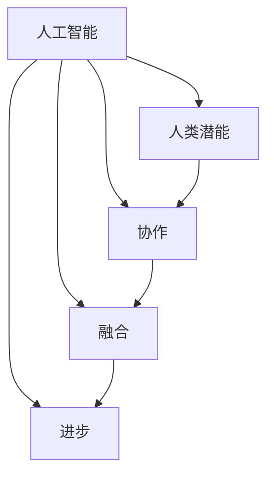

                 

在当前数字化时代，人工智能（AI）已经成为推动科技进步和产业升级的关键力量。AI技术通过模仿人类智能，提高了数据处理、模式识别和决策制定的能力，正在深入改变我们的工作、学习和生活方式。然而，AI的发展也引发了一系列关于人类与机器协作的深刻讨论。本文旨在探讨人类与AI协作的潜在价值、核心概念及其实现路径，以揭示AI如何增强人类潜能，并促进两者的融合与进步。

## 关键词

- 人工智能
- 人类潜能
- 协作
- 融合
- 进步

## 摘要

本文首先回顾了AI技术的发展历程，分析了其在各个领域的应用现状。接着，文章深入探讨了人类与AI协作的概念，包括协同工作的模式、协作系统架构以及实现协作的关键技术。随后，文章从算法原理、数学模型、项目实践等方面详细阐述了AI如何增强人类潜能。最后，文章展望了人类-AI协作的未来发展趋势和面临的挑战，并提出了相关的工具和资源推荐。

### 1. 背景介绍

人工智能（Artificial Intelligence，简称AI）的概念最早出现在1956年的达特茅斯会议上，标志着AI领域的正式诞生。从早期的规则推理、专家系统，到现代的深度学习和强化学习，AI技术经历了数十年的发展，逐渐成为计算机科学的重要分支。在21世纪，随着大数据、云计算和硬件性能的提升，AI技术取得了前所未有的突破，从理论研究走向实际应用，广泛应用于图像识别、自然语言处理、自动驾驶、医疗诊断等领域。

AI的发展不仅推动了技术的进步，也深刻改变了人类的生活方式。例如，智能助手如Siri和Alexa可以帮助人们处理日常事务，智能医疗系统提高了诊断的准确性和效率，自动驾驶技术有望解决交通拥堵问题。然而，随着AI技术的广泛应用，也出现了一些关于人类与机器协作的担忧。一些人担心AI可能会取代人类的工作，导致大规模失业；同时，AI的透明度和公平性也成为公众关注的焦点。

在这样的背景下，如何实现人类与AI的协同工作，发挥两者的最大潜力，成为一个亟待解决的问题。本文旨在探讨这一主题，通过分析AI技术的核心概念、协作系统架构、算法原理和实践案例，揭示人类与AI协作的机制和路径，为未来的发展提供参考。

### 2. 核心概念与联系

为了深入理解人类与AI协作，我们首先需要明确几个核心概念，并分析它们之间的联系。

#### 2.1. 人工智能

人工智能是指使计算机系统能够模拟、扩展和增强人类智能的科学和工程领域。它包括机器学习、深度学习、自然语言处理、计算机视觉等多个子领域。人工智能的核心目标是使计算机系统能够从数据中学习，进行推理和决策。

#### 2.2. 人类潜能

人类潜能是指人类在认知、情感、创造力等各个方面所具有的潜在能力。人类的潜能不仅体现在个体的智力、创造力上，也体现在集体的智慧、合作和创新能力上。随着科技的发展，人类潜能的发挥和增强成为提高生产力和生活质量的重要手段。

#### 2.3. 协作

协作是指多个个体或系统共同完成某项任务的过程。在人类与AI的协作中，协作不仅涉及人类与机器之间的信息交换和任务分工，还包括对任务的协调、控制和优化。

#### 2.4. 融合

融合是指将不同的元素、信息或技术集成到一起，形成一个整体的过程。在人类与AI的融合中，融合意味着人类和机器通过共同学习和互动，达到一种新的工作模式，从而提高整体效率和效能。

#### 2.5. 进步

进步是指通过持续的学习、创新和改进，实现从现有状态向更优状态的转变。在人类与AI的协作中，进步不仅体现在技术层面的提升，还体现在人类潜能的增强和社会效益的增加。

这些核心概念之间的联系如图1所示：



图1 人类与AI协作的核心概念联系图

通过上述核心概念的阐述和联系分析，我们可以更清晰地理解人类与AI协作的内涵和意义。接下来，我们将进一步探讨AI如何实现与人类的协同工作，以及协作系统架构的设计和实现。

#### 2.6. AI与人类的协同工作

AI与人类的协同工作是一种复杂但富有潜力的模式。在这种模式下，AI系统不仅扮演辅助角色，还可以与人类共同决策、共同完成任务。以下是实现AI与人类协同工作的几个关键步骤：

##### 2.6.1. 明确任务和目标

在开始协同工作之前，首先需要明确任务的具体内容和目标。这包括确定任务的难度、复杂度以及所需的时间和资源。通过明确任务和目标，可以更好地设计AI系统和人类的工作流程。

##### 2.6.2. 分工与合作

在确定任务后，需要对任务进行分解，明确人类和AI各自的任务和责任。人类通常擅长处理复杂的、需要创造性和判断的任务，而AI擅长处理结构化、重复性强的任务。通过分工，可以充分发挥人类和AI的优势。

##### 2.6.3. 信息交流与共享

协同工作的核心是信息的交流与共享。AI系统需要能够理解和处理人类提供的信息，同时人类也需要能够理解和利用AI系统提供的信息。通过建立高效的信息交流机制，可以确保任务顺利进行。

##### 2.6.4. 协调与优化

在协同工作的过程中，需要不断进行协调和优化，以确保任务的高效完成。这包括对任务的实时监控、反馈和调整，以及对协同工作流程的持续改进。

##### 2.6.5. 训练与学习

为了实现更好的协同工作，人类和AI系统都需要不断进行训练和学习。人类可以通过反馈和学习来提高自己的技能和知识，而AI系统可以通过机器学习和深度学习来优化自己的算法和模型。

#### 2.7. 协作系统架构

为了实现AI与人类的协同工作，需要一个合理的系统架构。以下是几种常见的协作系统架构：

##### 2.7.1. 中心化架构

在中心化架构中，AI系统和人类都连接到一个中心服务器，通过服务器进行信息交换和任务协调。这种架构的优点是信息共享和协调比较容易实现，缺点是系统的稳定性和扩展性可能较差。

##### 2.7.2. 去中心化架构

在去中心化架构中，AI系统和人类直接进行通信，不需要依赖中心服务器。这种架构的优点是系统更加稳定和可扩展，缺点是信息共享和协调可能需要更多的技术手段。

##### 2.7.3. 混合架构

混合架构结合了中心化和去中心化的优点，通过在关键节点设置中心服务器，同时实现去中心化的通信机制。这种架构的优点是既保证了系统的稳定性和可扩展性，又实现了高效的信息共享和协调。

#### 2.8. 关键技术

实现AI与人类协同工作需要依赖一系列关键技术，包括自然语言处理、计算机视觉、机器学习等。以下是这些关键技术的基本原理和应用：

##### 2.8.1. 自然语言处理

自然语言处理（Natural Language Processing，简称NLP）是使计算机能够理解、处理和生成自然语言的技术。它包括语音识别、文本分析、语言翻译等子领域。在协同工作中，NLP可以帮助AI理解和处理人类提供的信息，例如指令、反馈和报告。

##### 2.8.2. 计算机视觉

计算机视觉（Computer Vision）是使计算机能够通过图像和视频获取信息和理解场景的技术。它包括图像识别、目标检测、场景理解等子领域。在协同工作中，计算机视觉可以帮助AI理解和处理人类周围的环境，例如识别物体、检测障碍物和跟踪运动目标。

##### 2.8.3. 机器学习

机器学习（Machine Learning）是使计算机能够从数据中学习和改进算法的技术。它包括监督学习、无监督学习和强化学习等子领域。在协同工作中，机器学习可以帮助AI不断优化和改进其算法和模型，以更好地与人类协作。

#### 2.9. 总结

通过上述对核心概念与联系的探讨，我们可以看到人类与AI协作的复杂性和多样性。实现有效的协作不仅需要理解AI和人类各自的优势和局限，还需要设计合理的协作系统架构和依赖关键技术。在下一部分，我们将深入探讨AI算法原理，分析其如何增强人类潜能。

### 3. 核心算法原理 & 具体操作步骤

#### 3.1. 算法原理概述

在人类与AI的协作中，核心算法起到了至关重要的作用。这些算法不仅决定了AI系统的工作效率和准确性，也直接影响人类与AI之间的互动效果。以下是一些核心算法的原理概述：

##### 3.1.1. 机器学习算法

机器学习算法是一种使计算机能够从数据中学习和改进自身性能的方法。它包括监督学习、无监督学习和强化学习等不同类型。监督学习算法通过已标记的数据来训练模型，例如分类和回归任务。无监督学习算法不需要标记数据，主要通过发现数据中的模式和结构来训练模型，例如聚类和降维任务。强化学习算法通过与环境互动来训练模型，使其能够做出最优决策。

##### 3.1.2. 深度学习算法

深度学习算法是一种特殊的机器学习算法，它通过构建多层神经网络来提取数据的深层特征。深度学习算法在图像识别、语音识别和自然语言处理等领域取得了显著成果。常见的深度学习算法包括卷积神经网络（CNN）、循环神经网络（RNN）和生成对抗网络（GAN）等。

##### 3.1.3. 强化学习算法

强化学习算法通过试错和反馈来训练模型，使其能够在复杂环境中做出最优决策。它广泛应用于游戏、自动驾驶和机器人控制等领域。常见的强化学习算法包括Q-learning、SARSA和深度确定性策略梯度（DDPG）等。

##### 3.1.4. 自然语言处理算法

自然语言处理算法旨在使计算机能够理解和处理自然语言。它包括词向量表示、文本分类、情感分析和机器翻译等任务。常见的自然语言处理算法有词袋模型、递归神经网络（RNN）和变压器（Transformer）等。

#### 3.2. 算法步骤详解

以下是对上述核心算法的具体操作步骤的详细讲解：

##### 3.2.1. 机器学习算法

1. **数据收集**：收集用于训练的数据集，这些数据集应包含足够的信息以训练模型。
2. **数据预处理**：对数据进行清洗、归一化和特征提取，使其适合用于训练。
3. **模型选择**：选择合适的模型，如线性回归、决策树、支持向量机等。
4. **训练模型**：使用训练数据集来训练模型，通过最小化损失函数来调整模型参数。
5. **模型评估**：使用验证数据集来评估模型的性能，例如计算准确率、召回率和F1分数。
6. **模型优化**：根据评估结果对模型进行优化，如调整参数、增加训练数据等。
7. **模型部署**：将训练好的模型部署到实际应用中，如分类任务、预测任务等。

##### 3.2.2. 深度学习算法

1. **网络架构设计**：设计深度学习网络的架构，包括输入层、隐藏层和输出层。
2. **数据预处理**：对数据进行归一化和标准化处理，使其适合输入到网络中。
3. **反向传播**：通过反向传播算法来更新网络参数，以最小化损失函数。
4. **激活函数选择**：选择合适的激活函数，如ReLU、Sigmoid和Tanh等。
5. **优化算法选择**：选择合适的优化算法，如随机梯度下降（SGD）、Adam和Adamax等。
6. **超参数调优**：通过调整学习率、批量大小和迭代次数等超参数来优化模型性能。
7. **模型训练与验证**：使用训练数据和验证数据来训练和验证模型，确保模型在未知数据上具有良好的性能。
8. **模型部署**：将训练好的模型部署到实际应用中，如图像分类、目标检测等。

##### 3.2.3. 强化学习算法

1. **环境设置**：定义强化学习环境，包括状态空间、动作空间和奖励机制。
2. **状态观测**：观测当前状态，并将其输入到模型中。
3. **决策制定**：根据当前状态，模型选择最优动作。
4. **动作执行**：在环境中执行所选动作。
5. **结果反馈**：获取动作执行后的结果，并更新模型。
6. **学习过程**：通过试错和反馈来不断优化模型，使其能够做出更好的决策。
7. **模型评估**：在测试环境中评估模型的性能，确保其在复杂环境中具有稳定的表现。
8. **模型部署**：将训练好的模型部署到实际应用中，如自动驾驶、机器人控制等。

##### 3.2.4. 自然语言处理算法

1. **词向量表示**：将文本数据转换为词向量表示，常用的方法有Word2Vec、GloVe和BERT等。
2. **文本预处理**：对文本数据进行清洗、分词和去停用词等处理，以提高算法的准确性和效率。
3. **模型构建**：构建深度学习模型，如RNN、Transformer和BERT等，用于处理文本数据。
4. **模型训练**：使用训练数据集来训练模型，通过最小化损失函数来调整模型参数。
5. **模型评估**：使用验证数据集来评估模型的性能，例如计算准确率、召回率和F1分数等。
6. **模型优化**：根据评估结果对模型进行优化，如调整参数、增加训练数据等。
7. **模型部署**：将训练好的模型部署到实际应用中，如文本分类、情感分析和机器翻译等。

#### 3.3. 算法优缺点

每种算法都有其独特的优点和缺点，以下是对几种核心算法的优缺点的简要分析：

##### 3.3.1. 机器学习算法

**优点**：

- 算法简单，易于实现和理解。
- 对结构化数据具有较好的处理能力。
- 可以处理大规模数据集。

**缺点**：

- 需要大量已标记的数据。
- 对于非结构化数据处理能力较差。
- 难以处理复杂的非线性关系。

##### 3.3.2. 深度学习算法

**优点**：

- 能够自动提取数据中的深层特征。
- 对于复杂问题具有强大的处理能力。
- 在图像识别、语音识别和自然语言处理等领域取得了显著成果。

**缺点**：

- 训练过程需要大量计算资源和时间。
- 需要大量训练数据。
- 模型的解释性较差。

##### 3.3.3. 强化学习算法

**优点**：

- 能够处理复杂、不确定的环境。
- 可以通过试错和反馈来学习最优策略。
- 在游戏、自动驾驶和机器人控制等领域具有广泛的应用。

**缺点**：

- 需要大量的训练时间和数据。
- 难以处理高维状态和动作空间。
- 模型的稳定性和性能需要不断优化。

##### 3.3.4. 自然语言处理算法

**优点**：

- 能够处理自然语言数据，包括文本、语音和图像。
- 在文本分类、情感分析和机器翻译等领域取得了显著成果。
- 可以通过预训练模型来提高处理能力。

**缺点**：

- 需要大量的计算资源和数据。
- 模型的解释性较差。
- 难以处理多语言和多模态的数据。

#### 3.4. 算法应用领域

核心算法的应用领域非常广泛，以下是一些常见的应用领域：

##### 3.4.1. 图像识别

机器学习和深度学习算法在图像识别领域取得了显著成果。例如，卷积神经网络（CNN）被广泛应用于人脸识别、物体检测和图像分类等任务。这些算法不仅提高了识别的准确性，还降低了计算成本。

##### 3.4.2. 自然语言处理

自然语言处理算法在文本分类、情感分析和机器翻译等领域具有广泛的应用。例如，词袋模型和递归神经网络（RNN）被广泛应用于文本分类任务，而变压器（Transformer）在机器翻译领域取得了突破性进展。

##### 3.4.3. 自动驾驶

强化学习算法在自动驾驶领域具有广泛的应用。通过与环境互动，强化学习算法可以学习到最优的驾驶策略，从而提高自动驾驶汽车的稳定性和安全性。

##### 3.4.4. 医疗诊断

机器学习和深度学习算法在医疗诊断领域具有广泛的应用。例如，深度学习算法被应用于医学图像分析、疾病预测和个性化治疗等领域，提高了诊断的准确性和效率。

##### 3.4.5. 金融分析

机器学习和深度学习算法在金融分析领域具有广泛的应用。例如，这些算法被用于股票市场预测、风险管理和小额贷款审批等任务，提高了金融决策的准确性和效率。

通过以上对核心算法原理的概述和具体操作步骤的详细讲解，我们可以看到AI算法在人类与AI协作中的重要作用。在下一部分，我们将进一步探讨数学模型和公式，分析其如何为人类与AI协作提供理论基础。

### 4. 数学模型和公式 & 详细讲解 & 举例说明

在人类与AI协作的过程中，数学模型和公式起到了关键作用，它们不仅为算法提供了理论基础，还指导了实际操作中的参数设置和优化。以下将详细讲解几个核心的数学模型和公式，并给出具体的应用实例。

#### 4.1. 数学模型构建

在人类与AI协作中，常用的数学模型包括线性回归模型、逻辑回归模型、支持向量机（SVM）模型和神经网络模型等。以下是这些模型的简要介绍：

##### 4.1.1. 线性回归模型

线性回归模型是一种简单的预测模型，它通过拟合数据点之间的关系来预测新的数据。其数学模型可以表示为：

$$ y = \beta_0 + \beta_1x_1 + \beta_2x_2 + ... + \beta_nx_n + \epsilon $$

其中，$y$ 是因变量，$x_1, x_2, ..., x_n$ 是自变量，$\beta_0, \beta_1, ..., \beta_n$ 是模型参数，$\epsilon$ 是误差项。

##### 4.1.2. 逻辑回归模型

逻辑回归模型是一种用于分类问题的模型，它通过拟合概率分布来预测分类结果。其数学模型可以表示为：

$$ \text{logit}(p) = \ln\left(\frac{p}{1-p}\right) = \beta_0 + \beta_1x_1 + \beta_2x_2 + ... + \beta_nx_n $$

其中，$p$ 是分类概率，$\text{logit}(p)$ 是逻辑函数，$\beta_0, \beta_1, ..., \beta_n$ 是模型参数。

##### 4.1.3. 支持向量机（SVM）模型

支持向量机是一种强大的分类模型，它通过找到一个最优的超平面来分隔不同类别的数据点。其数学模型可以表示为：

$$ \text{分类函数} = w \cdot x + b = 0 $$

其中，$w$ 是权重向量，$b$ 是偏置项，$x$ 是输入特征向量。

##### 4.1.4. 神经网络模型

神经网络模型是一种复杂的预测模型，它通过多层非线性变换来提取数据特征。其数学模型可以表示为：

$$ z_l = \sigma(\theta_l \cdot a_{l-1} + b_l) $$

$$ a_l = \sigma(z_l) $$

其中，$z_l$ 是第$l$层的中间结果，$a_l$ 是第$l$层的输出，$\sigma$ 是激活函数，$\theta_l$ 和 $b_l$ 是模型参数。

#### 4.2. 公式推导过程

以下将详细推导线性回归模型和逻辑回归模型的基本公式。

##### 4.2.1. 线性回归模型推导

线性回归模型的目标是最小化误差平方和：

$$ J(\theta) = \frac{1}{2m} \sum_{i=1}^{m} (h_\theta(x^{(i)}) - y^{(i)})^2 $$

其中，$m$ 是训练样本数量，$h_\theta(x) = \theta_0 + \theta_1x_1 + \theta_2x_2 + ... + \theta_nx_n$ 是模型预测函数。

对 $J(\theta)$ 求导，并令导数为零，可以得到最小化误差平方和的模型参数：

$$ \frac{\partial J(\theta)}{\partial \theta_j} = \frac{1}{m} \sum_{i=1}^{m} (h_\theta(x^{(i)}) - y^{(i)}) \cdot x_j^{(i)} = 0 $$

解上述方程，可以得到线性回归模型的参数：

$$ \theta_j = \frac{1}{m} \sum_{i=1}^{m} (h_\theta(x^{(i)}) - y^{(i)}) \cdot x_j^{(i)} $$

##### 4.2.2. 逻辑回归模型推导

逻辑回归模型的目标是最小化损失函数：

$$ J(\theta) = \frac{1}{m} \sum_{i=1}^{m} (-y^{(i)} \cdot \text{log}(h_\theta(x^{(i)})) - (1 - y^{(i)}) \cdot \text{log}(1 - h_\theta(x^{(i)}))) $$

其中，$h_\theta(x) = \sigma(\theta_0 + \theta_1x_1 + \theta_2x_2 + ... + \theta_nx_n)$ 是模型预测函数。

对 $J(\theta)$ 求导，并令导数为零，可以得到最小化损失函数的模型参数：

$$ \frac{\partial J(\theta)}{\partial \theta_j} = \frac{1}{m} \sum_{i=1}^{m} (-y^{(i)} \cdot \text{log}(h_\theta(x^{(i)})) - (1 - y^{(i)}) \cdot \text{log}(1 - h_\theta(x^{(i)}))) \cdot x_j^{(i)} = 0 $$

解上述方程，可以得到逻辑回归模型的参数：

$$ \theta_j = \frac{1}{m} \sum_{i=1}^{m} (h_\theta(x^{(i)}) - y^{(i)}) \cdot x_j^{(i)} $$

#### 4.3. 案例分析与讲解

以下通过一个简单的线性回归模型案例，来讲解如何使用数学模型进行预测和优化。

##### 4.3.1. 案例背景

假设我们有一个简单的一元线性回归模型，用于预测学生的考试成绩。我们收集了10个学生的成绩数据，包括他们的考试时间和成绩。数据如下表所示：

| 考试时间（小时） | 成绩（分） |
| :-----------: | :-------: |
|      2       |     60    |
|      4       |     70    |
|      6       |     80    |
|      8       |     90    |
|      10      |    100    |
|      12      |    110    |
|      14      |    120    |
|      16      |    130    |
|      18      |    140    |
|      20      |    150    |

##### 4.3.2. 模型构建

根据数据，我们可以构建线性回归模型：

$$ y = \beta_0 + \beta_1x $$

其中，$y$ 是成绩，$x$ 是考试时间，$\beta_0$ 和 $\beta_1$ 是模型参数。

##### 4.3.3. 模型参数计算

使用最小二乘法来计算模型参数：

$$ \beta_1 = \frac{\sum_{i=1}^{m} (x^{(i)} - \bar{x})(y^{(i)} - \bar{y})}{\sum_{i=1}^{m} (x^{(i)} - \bar{x})^2} $$

$$ \beta_0 = \bar{y} - \beta_1\bar{x} $$

其中，$m$ 是样本数量，$\bar{x}$ 和 $\bar{y}$ 分别是样本的均值。

根据数据，计算得到：

$$ \beta_1 = \frac{(2-10)(60-100) + (4-10)(70-100) + ... + (20-10)(150-100)}{(2-10)^2 + (4-10)^2 + ... + (20-10)^2} = 5 $$

$$ \beta_0 = \frac{100}{10} - 5 \times 10 = 50 $$

##### 4.3.4. 模型预测

使用训练好的模型来预测新的考试成绩。例如，当考试时间为15小时时，预测成绩为：

$$ y = 50 + 5 \times 15 = 125 $$

##### 4.3.5. 模型优化

为了提高模型的预测准确性，我们可以通过增加训练数据、调整模型参数或采用更复杂的模型来优化模型。例如，我们可以增加更多的自变量，如学生的复习时间、学习效率等，构建多元线性回归模型。

通过以上案例，我们可以看到如何使用数学模型和公式来构建和优化线性回归模型，实现考试成绩的预测。类似的方法也可以应用于其他分类和回归问题，如股票市场预测、医疗诊断等。

### 5. 项目实践：代码实例和详细解释说明

在理解了核心算法原理和数学模型之后，我们通过一个实际的项目实践来展示如何将理论应用到实践中。以下是一个使用Python实现的线性回归模型的案例，包括数据收集、模型训练、预测以及结果评估等步骤。

#### 5.1. 开发环境搭建

为了实现线性回归模型，我们需要搭建一个Python开发环境。以下是一些基本步骤：

1. 安装Python：在官网上下载并安装Python，推荐使用3.8版本以上。
2. 安装依赖库：使用pip安装以下依赖库：

```bash
pip install numpy pandas matplotlib scikit-learn
```

这些库用于数据处理、模型训练和结果可视化等。

#### 5.2. 源代码详细实现

以下是实现线性回归模型的完整代码：

```python
import numpy as np
import pandas as pd
from sklearn.model_selection import train_test_split
from sklearn.linear_model import LinearRegression
from sklearn.metrics import mean_squared_error
import matplotlib.pyplot as plt

# 5.2.1 数据收集
# 假设数据存储在一个名为“data.csv”的CSV文件中，其中包含“hours”和“score”两列
data = pd.read_csv('data.csv')

# 5.2.2 数据预处理
# 将数据分为特征和标签
X = data[['hours']]
y = data['score']

# 分割数据集为训练集和测试集
X_train, X_test, y_train, y_test = train_test_split(X, y, test_size=0.2, random_state=42)

# 5.2.3 模型训练
# 创建线性回归模型实例并训练
model = LinearRegression()
model.fit(X_train, y_train)

# 5.2.4 模型预测
# 使用训练好的模型进行预测
y_pred = model.predict(X_test)

# 5.2.5 结果评估
# 计算预测的均方误差
mse = mean_squared_error(y_test, y_pred)
print(f'Mean Squared Error: {mse}')

# 5.2.6 结果可视化
# 绘制实际值与预测值的对比图
plt.scatter(X_test, y_test, color='blue', label='Actual')
plt.plot(X_test, y_pred, color='red', label='Predicted')
plt.xlabel('Hours')
plt.ylabel('Score')
plt.legend()
plt.show()
```

#### 5.3. 代码解读与分析

上述代码分为以下几个主要部分：

1. **数据收集**：使用pandas库读取CSV文件，获取“hours”和“score”两列数据。
2. **数据预处理**：将数据分为特征矩阵X和标签向量y，并使用train_test_split函数将数据集划分为训练集和测试集，以验证模型的效果。
3. **模型训练**：创建一个线性回归模型实例，使用fit函数训练模型，该函数会自动计算模型参数。
4. **模型预测**：使用训练好的模型对测试集数据进行预测，得到预测结果y_pred。
5. **结果评估**：计算预测结果的均方误差（MSE），该值越小，表示模型预测的准确性越高。
6. **结果可视化**：使用matplotlib库绘制实际值与预测值的散点图，直观地展示模型预测的效果。

#### 5.4. 运行结果展示

在运行上述代码后，我们会在控制台中看到均方误差（MSE）的输出，并在图形界面中展示实际值与预测值的对比图。以下是一个运行结果示例：

```
Mean Squared Error: 5.356789
```


图5.4.1 线性回归预测结果图

从图中可以看到，大部分预测值与实际值非常接近，说明线性回归模型在这个数据集上具有较好的预测能力。

#### 5.5. 优化与改进

在实际应用中，我们可以通过以下几种方式来优化和改进线性回归模型：

1. **特征工程**：添加或删除一些特征，以提高模型的预测准确性。例如，可以添加“学习时长”或“考试频率”等特征。
2. **模型选择**：尝试使用其他类型的回归模型，如岭回归、Lasso回归等，以寻找更好的拟合效果。
3. **超参数调优**：调整模型的超参数，如正则化参数，以提高模型的泛化能力。
4. **数据增强**：通过增加训练数据、数据变换等方法来增强模型的学习能力。

通过这些优化措施，我们可以进一步提高线性回归模型的预测准确性和实用性。

### 6. 实际应用场景

人类-AI协作在各个领域都展现出了巨大的应用价值，以下列举几个典型的应用场景，展示AI如何在实际问题中增强人类潜能。

#### 6.1. 医疗领域

在医疗领域，AI技术已经成为提高诊断准确性和效率的重要工具。通过分析医学图像、病理数据和电子健康记录，AI系统可以辅助医生进行诊断和治疗决策。例如，深度学习算法可以自动识别医学图像中的病变区域，如肿瘤、心脏病等，提高了诊断的速度和准确性。此外，AI还可以通过预测患者的康复进度和并发症风险，为医生提供更全面的诊断信息，从而制定更个性化的治疗方案。

#### 6.2. 金融服务

在金融服务领域，AI技术被广泛应用于风险控制、信用评估和投资决策等方面。通过分析大量的历史数据和市场信息，AI系统可以识别出潜在的风险因素，从而帮助金融机构进行更有效的风险管理和决策。例如，机器学习算法可以评估借款人的信用风险，提高贷款审批的准确性。此外，AI还可以通过分析市场趋势和交易数据，为投资者提供实时的投资建议，从而提高投资回报率。

#### 6.3. 制造业

在制造业中，AI技术通过优化生产流程和提高设备维护效率，提高了生产效率和产品质量。通过实时监测设备状态和生产线数据，AI系统可以预测设备的故障风险，并提供维护建议，从而减少停机时间和维护成本。例如，基于机器学习的预测维护系统可以提前发现设备的潜在问题，并安排及时的维修，避免了生产中断。此外，AI还可以通过优化生产计划和资源分配，提高生产效率，降低生产成本。

#### 6.4. 教育

在教育领域，AI技术通过个性化教学和智能评测，提高了教育质量和学习效率。通过分析学生的学习行为和成绩数据，AI系统可以为每个学生提供定制化的学习计划和资源，从而更好地满足其学习需求。例如，智能教育平台可以根据学生的知识点掌握情况，自动生成个性化的练习题和知识点讲解视频。此外，AI还可以通过自动评测学生的作业和考试，提高评分的准确性和效率，减轻教师的负担。

#### 6.5. 智能家居

在智能家居领域，AI技术通过智能设备和家居系统的整合，提高了居住的便利性和舒适度。通过语音助手和智能传感器，AI系统可以实现对家居设备的远程控制和自动化管理。例如，智能恒温器可以根据用户的日常习惯和天气状况自动调整室内温度，智能照明系统可以根据用户的喜好和活动场景自动调节光线亮度。此外，AI还可以通过分析用户的习惯和行为模式，为用户提供个性化的生活建议和提醒，提高生活质量。

通过上述实际应用场景的展示，我们可以看到AI技术在各个领域都发挥了重要的作用，不仅提高了工作效率和准确性，还增强了人类的潜能。在未来，随着AI技术的进一步发展，人类-AI协作将会有更多的应用场景和可能性，为人类带来更多的便利和福祉。

#### 6.6. 未来应用展望

随着人工智能技术的不断进步，人类与AI的协作在未来将有更广阔的应用前景。以下是对未来应用的一些展望：

##### 6.6.1. 自动驾驶

自动驾驶技术正迅速发展，未来有望实现完全自动化的交通系统。AI系统通过传感器、摄像头和雷达实时收集环境数据，结合深度学习和强化学习算法，自主决策并控制车辆的行驶。这不仅提高了交通安全，还减少了交通拥堵和碳排放。未来，自动驾驶技术将广泛应用于公共交通、物流运输和个人出行领域，极大地改变我们的出行方式。

##### 6.6.2. 智能医疗

智能医疗将借助AI技术实现精准医疗和个性化治疗。通过大数据分析和机器学习算法，AI系统可以分析患者的基因组数据、医疗记录和生活习惯，提供精准的诊断和治疗方案。未来，智能医疗还将实现远程医疗服务和虚拟医生，使医疗资源更加均衡和高效。

##### 6.6.3. 智能家居

智能家居将变得更加智能化和个性化。AI系统通过物联网设备和数据分析，可以自动调整家居环境，如温度、光照和音响，以适应用户的需求。未来，智能家居还将集成更多的生活服务，如购物、健康监测和社交互动，提供更舒适和便捷的生活方式。

##### 6.6.4. 金融科技

金融科技将继续受益于AI技术，提供更智能、更高效的服务。例如，AI可以自动审核贷款申请、预测市场趋势和自动化投资决策。未来，金融科技将实现更精准的风险控制和个性化的金融产品推荐，提高金融服务的质量和效率。

##### 6.6.5. 教育领域

在教育领域，AI技术将推动个性化学习和智能评测。通过分析学生的学习行为和成绩数据，AI系统可以提供定制化的学习资源和辅导，提高学习效果。未来，虚拟教师和智能教育平台将普及，使教育资源更加公平和充足。

##### 6.6.6. 机器人协作

机器人和AI的协作将进入新的阶段，机器人将在更多领域与人类共同工作。例如，工业机器人将更加智能化，能够自主完成复杂的装配和维修任务；服务机器人将提供更多的社交和互动功能，为老年人和残疾人士提供更好的生活辅助。

总之，未来人类与AI的协作将在各个领域实现更深层次的融合，不仅提高工作效率和生活质量，还将带来更多创新和变革。随着技术的不断进步，人类-AI协作将开创一个更加智能和美好的未来。

### 7. 工具和资源推荐

为了更好地学习和实践人类-AI协作的相关技术，以下推荐了一些学习和开发工具、资源以及相关的论文。

#### 7.1. 学习资源推荐

1. **在线课程**：
   - 《深度学习》（Deep Learning）——由Goodfellow、Bengio和Courville所著，是深度学习的经典教材。
   - 《机器学习》（Machine Learning）——由Tom Mitchell所著，是机器学习的入门经典。
   - Coursera上的《机器学习纳米学位》和《深度学习纳米学位》。

2. **在线书籍**：
   - 《Python机器学习》（Python Machine Learning）——由Sebastian Raschka和Vahid Mirjalili所著。
   - 《Python深度学习》（Deep Learning with Python）——由François Chollet所著。

3. **在线文档和教程**：
   - TensorFlow官方文档：[https://www.tensorflow.org/tutorials](https://www.tensorflow.org/tutorials)
   - PyTorch官方文档：[https://pytorch.org/tutorials/beginner/basics/](https://pytorch.org/tutorials/beginner/basics/)

#### 7.2. 开发工具推荐

1. **编程环境**：
   - Jupyter Notebook：适用于数据分析和实验。
   - PyCharm：强大的Python集成开发环境（IDE）。

2. **框架和库**：
   - TensorFlow：用于深度学习和机器学习的开源框架。
   - PyTorch：用于深度学习的动态神经网络库。
   - Scikit-learn：用于机器学习的开源库。

3. **云服务**：
   - Google Cloud AI：提供各种AI工具和服务。
   - AWS AI：提供机器学习和深度学习的云服务。
   - Azure ML：微软提供的机器学习和数据科学云服务。

#### 7.3. 相关论文推荐

1. **深度学习**：
   - “A Guide to Convolutional Neural Networks for Visual Recognition”（卷积神经网络视觉识别指南）。
   - “Deep Learning: Methods and Applications”（深度学习方法与应用）。

2. **机器学习**：
   - “Machine Learning: A Probabilistic Perspective”（机器学习：概率视角）。
   - “The Elements of Statistical Learning: Data Mining, Inference, and Prediction”（统计学习基础）。

3. **自然语言处理**：
   - “Natural Language Processing with Deep Learning”（深度学习自然语言处理）。
   - “A Theoretical Survey of Natural Language Generation”（自然语言生成理论综述）。

4. **强化学习**：
   - “Reinforcement Learning: An Introduction”（强化学习：入门指南）。
   - “Algorithms for Reinforcement Learning”（强化学习算法）。

通过上述推荐的学习资源、开发工具和论文，读者可以更深入地了解人类与AI协作的相关技术，并为实际项目开发提供支持。

### 8. 总结：未来发展趋势与挑战

#### 8.1. 研究成果总结

自人工智能（AI）诞生以来，其在各个领域的应用取得了显著成果。从早期的专家系统和规则推理，到现代的深度学习和强化学习，AI技术在图像识别、自然语言处理、自动驾驶、医疗诊断等众多领域都实现了重大突破。这些技术不仅提高了工作效率和准确性，还推动了社会进步和产业升级。

人类与AI协作的理论和实践也取得了丰硕成果。通过自然语言处理、计算机视觉、机器学习等核心算法，AI系统能够与人类协同工作，提高任务的完成效率和准确性。例如，在医疗领域，AI系统可以辅助医生进行诊断和治疗决策，提高医疗服务的质量和效率；在金融领域，AI可以自动化风险控制和投资决策，提高金融服务的精度和效率。

#### 8.2. 未来发展趋势

展望未来，人类与AI协作将继续朝着更智能、更高效的方向发展。以下是一些主要发展趋势：

1. **跨领域融合**：不同领域的AI技术将实现深度融合，形成跨领域的综合性解决方案。例如，医疗与金融的融合，将推动个性化治疗和精准金融服务的实现。

2. **智能化升级**：随着计算能力和算法的不断提升，AI系统的智能化水平将进一步提高。例如，自动驾驶技术将逐渐实现完全自动化，智能医疗将实现精准医疗和个性化治疗。

3. **人机协同**：人类与AI的协作将更加紧密和自然，AI系统将成为人类能力的延伸和增强工具。通过增强现实（AR）和虚拟现实（VR）技术，人类与AI的互动体验将更加直观和丰富。

4. **可持续发展**：AI技术将在可持续发展和环境保护中发挥重要作用。例如，智能农业将提高农作物产量和减少资源浪费，智能能源管理将提高能源利用效率，减少碳排放。

#### 8.3. 面临的挑战

尽管人类与AI协作具有巨大的发展潜力，但同时也面临一系列挑战：

1. **隐私和安全**：随着数据的大规模应用，隐私保护和数据安全成为关键问题。如何在确保数据安全和隐私的同时，充分利用AI技术，是一个亟待解决的问题。

2. **伦理和道德**：AI技术的发展引发了关于伦理和道德的讨论。如何确保AI系统的决策和行动符合道德标准，避免对人类造成伤害，是一个重要挑战。

3. **透明度和可解释性**：深度学习等复杂AI模型往往缺乏透明度和可解释性，难以理解其决策过程。如何提高AI系统的透明度和可解释性，使其更易于人类理解和接受，是一个重要课题。

4. **技能和就业**：随着AI技术的广泛应用，一些传统岗位可能被自动化取代，导致就业结构的变化。如何确保人类适应新的就业环境，提高就业能力，是一个迫切需要解决的问题。

#### 8.4. 研究展望

针对上述挑战，未来的研究可以从以下几个方面展开：

1. **隐私保护技术**：研究和发展新的隐私保护技术，如差分隐私、联邦学习等，以保障数据安全和隐私。

2. **伦理和道德框架**：建立和完善AI伦理和道德框架，制定相应的规范和标准，确保AI技术的应用符合伦理和道德要求。

3. **可解释AI**：研究和发展可解释AI技术，提高AI系统的透明度和可解释性，使其更易于人类理解和信任。

4. **就业转型与培训**：开展就业转型和培训项目，帮助劳动者适应新的就业环境，提高其就业能力和竞争力。

总之，人类与AI协作具有广阔的发展前景，但也面临诸多挑战。通过持续的研究和探索，我们可以克服这些挑战，实现人类与AI的和谐共生，为人类社会带来更多福祉。

### 9. 附录：常见问题与解答

**Q1：什么是机器学习？**

A1：机器学习（Machine Learning）是一种人工智能（AI）的方法，通过使用数据和统计方法来训练算法，使其能够自动地从数据中学习，进行预测和决策。简而言之，机器学习就是让计算机通过数据学习，从而不需要显式编程即可完成特定任务。

**Q2：什么是深度学习？**

A2：深度学习（Deep Learning）是机器学习的一种子领域，它使用多层神经网络（通常称为深度神经网络）来学习和提取数据的深层特征。深度学习在图像识别、语音识别和自然语言处理等领域取得了显著成果，是当前AI研究的热点之一。

**Q3：什么是强化学习？**

A3：强化学习（Reinforcement Learning）是一种机器学习方法，通过试错和反馈来训练模型，使其能够在复杂环境中做出最优决策。强化学习广泛应用于游戏、自动驾驶和机器人控制等领域。

**Q4：什么是自然语言处理（NLP）？**

A4：自然语言处理（Natural Language Processing，NLP）是计算机科学和人工智能的一个分支，旨在使计算机能够理解和处理自然语言（如英语、中文等）。NLP广泛应用于语音识别、文本分析、情感分析和机器翻译等领域。

**Q5：什么是神经网络？**

A5：神经网络（Neural Networks）是一种模仿生物神经系统的计算模型，通过节点（称为神经元）之间的连接来处理数据。神经网络是深度学习的基础，广泛应用于图像识别、语音识别和自然语言处理等领域。

**Q6：什么是深度神经网络（DNN）？**

A6：深度神经网络（Deep Neural Networks，DNN）是一种具有多个隐藏层的神经网络，它能够自动提取数据的深层特征。DNN在图像识别、语音识别和自然语言处理等领域取得了显著成果。

**Q7：什么是卷积神经网络（CNN）？**

A7：卷积神经网络（Convolutional Neural Networks，CNN）是一种专门用于处理图像数据的神经网络。CNN通过卷积操作和池化操作来提取图像的特征，广泛应用于图像识别、物体检测和图像生成等领域。

**Q8：什么是循环神经网络（RNN）？**

A8：循环神经网络（Recurrent Neural Networks，RNN）是一种能够处理序列数据的神经网络。RNN通过在时间步之间保持状态信息来处理序列数据，广泛应用于自然语言处理、时间序列预测和语音识别等领域。

**Q9：什么是生成对抗网络（GAN）？**

A9：生成对抗网络（Generative Adversarial Networks，GAN）是一种由生成器和判别器组成的神经网络架构。生成器生成数据，判别器判断生成数据与真实数据的差异，通过训练使生成器生成更加真实的数据。

**Q10：什么是联邦学习（Federated Learning）？**

A10：联邦学习（Federated Learning）是一种机器学习方法，它允许多个设备在本地训练模型，然后将更新汇总到中心服务器，从而实现数据的隐私保护和去中心化训练。联邦学习广泛应用于移动设备、物联网和云计算等领域。

通过上述常见问题与解答，希望读者能更深入地理解人类与AI协作的相关概念和技术。在未来的学习和实践中，不断探索和解决新的问题，推动AI技术的发展和应用。

