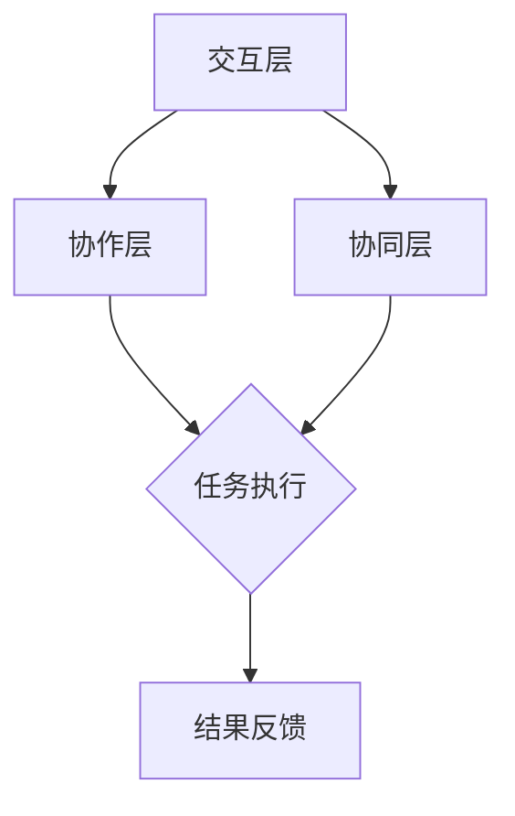

                 

关键词：人类-AI协作，增强学习，人机交互，人工智能，合作发展

> 摘要：本文探讨了人类与人工智能（AI）之间的协作机制，通过分析AI技术的发展现状、人脑与AI系统的工作原理以及二者协作的潜在优势，提出了实现人类与AI协同工作的策略和方法。文章旨在为人类潜能与AI能力的融合发展提供理论和实践指导。

## 1. 背景介绍

在过去的几十年中，人工智能（AI）技术取得了令人瞩目的进展，从最初的专家系统到今天的深度学习、强化学习等，AI在各个领域都展现出了强大的潜力。然而，尽管AI的进步为人类生活带来了诸多便利，但人类与AI之间的协作仍存在许多挑战。

人类的智慧具有独特的创造力、直觉和情感，而AI则擅长处理大量数据和执行复杂计算任务。这种互补性使得人类与AI的协作具有巨大的潜力。然而，当前AI系统在理解人类意图、处理模糊性和不确定性方面仍有局限。因此，如何有效地实现人类与AI的协作，发挥各自的优势，成为一个亟待解决的问题。

本文旨在探讨人类与AI之间的协作机制，通过分析AI技术的发展现状、人脑与AI系统的工作原理以及二者协作的潜在优势，提出实现人类与AI协同工作的策略和方法。文章还将讨论人类与AI协作在实际应用中的挑战和解决方案，为人类潜能与AI能力的融合发展提供理论和实践指导。

### 1.1 人工智能的发展历程

人工智能的发展历程可以追溯到20世纪50年代。当时的科学家们提出了一种称为“图灵测试”的方法，用来评估机器是否具有智能。图灵测试的核心思想是，如果一个机器能够以人类难以区分的方式与人类交流，那么这个机器就可以被认为具有智能。这个概念引发了人们对机器智能的浓厚兴趣。

在随后的几十年中，人工智能经历了多个阶段。专家系统是早期人工智能的代表，它模拟人类专家的决策过程，处理特定领域的问题。然而，专家系统存在知识表示和推理能力有限的局限。

20世纪80年代，机器学习开始兴起，尤其是基于统计的方法，如决策树、神经网络和贝叶斯分类器。这些方法通过学习大量的数据，自动提取规律和模式，使得人工智能在语音识别、图像识别等领域取得了显著的成果。

21世纪初，深度学习成为人工智能领域的重要突破。深度学习利用多层神经网络，通过大量数据训练，可以自动提取复杂的特征，实现前所未有的准确度和效率。深度学习在计算机视觉、自然语言处理等领域取得了重大突破。

近年来，强化学习成为人工智能研究的热点。强化学习通过模拟人类行为，探索环境并学习最优策略，已经在游戏、自动驾驶等领域取得了成功。这些技术的发展，使得人工智能在各个领域都展现出了巨大的潜力。

### 1.2 人类与AI协作的现状

当前，人类与AI的协作已经广泛应用于各个领域，如医疗、金融、制造等。例如，在医疗领域，AI系统可以帮助医生进行疾病诊断，提供个性化的治疗方案。在金融领域，AI算法可以分析市场数据，预测股票走势，帮助投资者做出决策。在制造领域，AI系统可以优化生产流程，提高生产效率。

然而，尽管人类与AI的协作已经取得了一定的成果，但仍然存在一些挑战。首先，AI系统在理解人类意图方面存在局限。人类在表达意图时，往往使用自然语言，而自然语言具有模糊性和不确定性。AI系统在处理这种模糊性和不确定性时，容易出现误解。

其次，AI系统的学习能力和适应性仍然有限。尽管深度学习和强化学习等方法已经取得了显著的进展，但AI系统仍然难以理解复杂的人类意图和适应多变的环境。

此外，人类与AI的协作也面临一些伦理和隐私问题。例如，AI系统在处理个人数据时，如何确保数据的安全和隐私，成为了一个重要问题。

总的来说，尽管人类与AI的协作已经取得了一定的成果，但仍然存在许多挑战。如何实现更加高效、可靠和透明的人类与AI协作，成为当前人工智能领域的研究重点。

### 1.3 本文的结构

本文将首先介绍人类与AI协作的理论基础，包括人脑与AI系统的工作原理和协作机制。然后，我们将探讨人类与AI协作的优势和潜在应用领域。接下来，本文将分析人类与AI协作中存在的挑战和解决方案。最后，本文将讨论人类与AI协作的未来发展趋势和面临的挑战，并提出一些建议和展望。

### 2. 核心概念与联系

#### 2.1 人脑与AI系统的工作原理

人脑与AI系统的工作原理各有不同，但它们在某些方面具有相似之处。人脑是一个复杂的神经网络，由数十亿个神经元组成。这些神经元通过电信号进行通信，形成复杂的神经网络结构。人脑具有自我组织和自适应能力，可以通过学习和经验不断优化自己的行为。

相比之下，AI系统通常由计算机程序和算法组成。计算机程序是由一系列指令组成的代码，用于实现特定的功能。算法是计算机程序的逻辑，用于指导计算机执行任务。AI系统通过学习大量数据，自动提取规律和模式，从而实现智能行为。

虽然人脑与AI系统的工作原理不同，但它们在某些方面具有相似之处。例如，人脑和AI系统都可以通过学习和经验来优化自己的行为。人脑通过神经元的连接和重组来实现学习，而AI系统通过算法的迭代和优化来实现学习。

#### 2.2 人类与AI协作的机制

人类与AI协作的机制可以分为三个层次：交互层、协作层和协同层。

交互层是人类与AI系统之间的基础通信机制。在这一层，人类通过自然语言、图形界面或其他交互方式与AI系统进行交流。AI系统则通过自然语言处理、计算机视觉等技术理解和响应人类的指令。

协作层是人类与AI系统共同完成任务的机制。在这一层，人类和AI系统各自发挥自己的优势，共同完成任务。例如，在医疗领域，医生可以利用AI系统提供的诊断建议，结合自己的专业知识和经验，为患者提供更准确的诊断和治疗。

协同层是人类与AI系统深度融合，共同创造价值的机制。在这一层，人类和AI系统不仅共同完成任务，而且能够相互学习和适应。例如，在自动驾驶领域，AI系统可以通过模拟和仿真，不断学习和优化自己的驾驶策略，同时驾驶员也可以通过实时反馈，指导AI系统改进驾驶行为。

#### 2.3 核心概念原理和架构的 Mermaid 流程图

以下是一个简单的Mermaid流程图，描述了人类与AI协作的三个层次。



在这个流程图中，A表示交互层，B表示协作层，C表示协同层。D表示任务执行，E表示结果反馈。通过这个流程图，我们可以清晰地看到人类与AI协作的三个层次以及它们之间的相互关系。

## 3. 核心算法原理 & 具体操作步骤

#### 3.1 算法原理概述

人类与AI协作的核心算法主要基于增强学习（Reinforcement Learning，RL）和强化信号（Reinforcement Signal）的概念。增强学习是一种通过试错（trial-and-error）来学习最优策略的方法。在增强学习中，学习主体（agent）在环境（environment）中采取行动，并根据环境的反馈（reward or punishment）调整自己的行为。

强化信号是指环境对主体行动的反馈，它可以是正的（reward），也可以是负的（punishment）。正强化信号鼓励主体继续采取某种行动，而负强化信号则提示主体避免某种行动。通过不断的学习和调整，主体可以逐渐学会在环境中获得最大化回报的行为。

人类与AI协作的算法原理可以概括为以下几个步骤：

1. **初始化**：设置学习主体和环境，初始化主体的状态和行动策略。
2. **行动选择**：主体根据当前状态，选择一个行动。
3. **环境响应**：环境根据主体的行动，提供反馈（正强化或负强化）。
4. **状态更新**：主体根据反馈，更新自己的状态。
5. **策略调整**：主体根据新状态，调整自己的行动策略。
6. **重复执行**：重复执行步骤2-5，直到达到预定的目标或性能标准。

#### 3.2 算法步骤详解

1. **初始化**：
   - 初始化主体：设置主体的初始状态和策略。
   - 初始化环境：设置环境的初始状态。
   - 初始化奖励函数：定义环境对主体行动的奖励或惩罚。

2. **行动选择**：
   - 主体的行动选择基于当前状态和策略。策略可以是确定性策略（始终选择同一行动）或随机性策略（根据概率分布选择行动）。

3. **环境响应**：
   - 环境根据主体的行动，提供反馈。反馈可以是即时反馈（行动后立即提供）或延迟反馈（行动后一段时间提供）。

4. **状态更新**：
   - 主体根据反馈，更新自己的状态。状态可以是当前环境的状态，也可以是主体对环境的感知。

5. **策略调整**：
   - 主体根据新状态，调整自己的策略。策略调整可以通过多种方式实现，如直接调整策略参数、优化策略函数等。

6. **重复执行**：
   - 重复执行步骤2-5，直到达到预定的目标或性能标准。例如，主体的目标可以是获得最大化的总奖励，或达到预定的任务完成率。

#### 3.3 算法优缺点

**优点**：
- **适应性**：增强学习算法能够根据环境的反馈不断调整策略，适应不同的环境和任务。
- **灵活性**：主体可以根据不同的状态选择不同的行动，具有较强的灵活性。
- **高效性**：通过试错的方式，主体可以在较短的时间内找到最优策略，提高学习效率。

**缺点**：
- **计算复杂度**：增强学习算法通常需要大量的计算资源和时间，尤其是在复杂的动态环境中。
- **奖励设计**：奖励函数的设计对学习过程至关重要，但往往难以精确设计，可能影响学习效果。
- **样本效率**：增强学习算法对样本的数量和多样性有较高的要求，样本不足可能导致学习效果不佳。

#### 3.4 算法应用领域

增强学习算法在多个领域具有广泛的应用，包括但不限于：

- **游戏**：增强学习算法在电子游戏中的使用已经取得显著成果，如围棋、国际象棋等。
- **机器人**：增强学习算法可以帮助机器人学习在复杂环境中执行任务，如无人驾驶、自动化制造等。
- **推荐系统**：增强学习算法可以用于个性化推荐系统，根据用户的反馈调整推荐策略。
- **自然语言处理**：增强学习算法可以用于自然语言处理任务，如对话系统、机器翻译等。

通过以上步骤和原理的详细讲解，我们可以看到，人类与AI协作的核心算法具有强大的适应性和灵活性，能够在复杂环境中实现高效的学习和协作。然而，算法的优缺点也需要我们在实际应用中予以充分考虑和优化。

### 4. 数学模型和公式 & 详细讲解 & 举例说明

#### 4.1 数学模型构建

为了更好地理解人类与AI协作的核心算法，我们需要引入一些基本的数学模型和公式。以下是一些关键的概念和公式：

1. **状态（State, S）**：系统当前的状态，可以是多维向量。
2. **动作（Action, A）**：主体可以采取的行动，可以是多维向量。
3. **策略（Policy, π）**：主体在给定状态下的最优行动方案，可以表示为 π(s) = a。
4. **价值函数（Value Function, V）**：主体在某个状态下的最优回报，可以表示为 V(s)。
5. **状态-动作价值函数（State-Action Value Function, Q）**：主体在某个状态和动作下的最优回报，可以表示为 Q(s, a)。

以下是这些概念之间的关系：

- **策略**：π(s) = a，表示在状态s下采取动作a。
- **价值函数**：V(s) = E[∫t=0^∞ γ^t r(t) | s_0 = s]，表示在状态s下执行策略π(s)所期望的总回报。
- **状态-动作价值函数**：Q(s, a) = E[r(t) | s_0 = s, a_0 = a]，表示在状态s下采取动作a所期望的即时回报。

#### 4.2 公式推导过程

为了更好地理解这些概念，我们通过一个简单的例子来推导这些公式。

假设我们有一个简单的环境，主体在环境中只能采取两种行动：前进或后退。环境对主体的行动提供即时反馈，即每一步的回报可以是正数或负数。我们的目标是找到在给定状态下的最优行动。

1. **状态和动作**：我们用状态S表示主体当前的位置，动作A表示前进或后退。例如，S = [0, 1]，表示主体在初始位置0，采取前进行动后位置变为1。

2. **策略**：策略π(s)表示在状态s下采取的动作。例如，π(s) = [1, 0]，表示在状态S = [0, 1]下，主体采取前进行动。

3. **价值函数**：价值函数V(s)表示在状态s下执行策略π(s)所期望的总回报。例如，假设主体在状态S = [0, 1]下采取前进行动，每一步的回报为1，那么V(S = [0, 1]) = 1。

4. **状态-动作价值函数**：状态-动作价值函数Q(s, a)表示在状态s下采取动作a所期望的即时回报。例如，假设在状态S = [0, 1]下，采取前进行动的回报为1，那么Q(S = [0, 1], A = [1, 0]) = 1。

以下是这些公式的推导过程：

- **价值函数**：

  V(s) = E[∫t=0^∞ γ^t r(t) | s_0 = s]

  假设主体在初始状态s采取策略π(s)，每一步的回报为r(t)，则总回报为：

  R = ∑t=0^∞ r(t)

  根据马尔可夫决策过程（MDP）的性质，状态的概率分布是不变的，即：

  P(s_t = s | s_0 = s) = 1

  因此，总回报的期望可以表示为：

  E[R | s_0 = s] = ∑t=0^∞ E[r(t) | s_0 = s]

  由于每一步的回报r(t)与状态s无关，因此：

  E[r(t) | s_0 = s] = r(s)

  代入上述公式，得到：

  V(s) = E[∫t=0^∞ γ^t r(t) | s_0 = s] = ∑t=0^∞ γ^t r(s)

  这就是价值函数的推导过程。

- **状态-动作价值函数**：

  Q(s, a) = E[r(t) | s_0 = s, a_0 = a]

  假设主体在初始状态s采取动作a，每一步的回报为r(t)，则总回报为：

  R = r(s) + γr(s') + γ^2r(s'') + ...

  其中，s'是采取动作a后状态的变化，s''是采取动作a后状态的变化的下一状态，γ是折扣因子。

  根据马尔可夫决策过程（MDP）的性质，状态的概率分布是不变的，即：

  P(s_t = s' | s_0 = s, a_0 = a) = 1

  因此，总回报的期望可以表示为：

  E[R | s_0 = s, a_0 = a] = E[r(s) + γr(s') + γ^2r(s'') + ... | s_0 = s, a_0 = a]

  由于每一步的回报r(t)与状态s无关，因此：

  E[r(t) | s_0 = s, a_0 = a] = r(s')

  代入上述公式，得到：

  Q(s, a) = E[r(t) | s_0 = s, a_0 = a] = r(s')

  这就是状态-动作价值函数的推导过程。

通过以上推导，我们可以看到价值函数和状态-动作价值函数在人类与AI协作中的重要性。它们为我们提供了衡量主体在特定状态和动作下表现的标准，有助于我们设计和优化协作算法。

#### 4.3 案例分析与讲解

为了更好地理解上述数学模型和公式的应用，我们将通过一个具体的案例来进行分析和讲解。

**案例背景**：假设我们有一个简单的导航系统，主体需要在二维空间中移动，从起点到达终点。主体的行动可以是向左、向右、向上或向下移动。环境对主体的每一步行动提供即时回报，如果主体离终点更近，则获得正回报，否则获得负回报。

**案例分析**：

1. **状态和动作**：状态S是一个二维向量，表示主体的当前位置。动作A是一个一维向量，表示主体的移动方向。例如，S = [x, y]，A = [dx, dy]。

2. **策略**：策略π(s)表示在状态s下采取的动作。我们可以定义一个简单的策略，即在每一步都向终点方向移动。例如，如果终点在主体的右侧，策略π(s) = [1, 0]，表示向右移动。

3. **价值函数**：价值函数V(s)表示在状态s下执行策略π(s)所期望的总回报。我们可以通过模拟多次导航过程，计算每个状态下的平均回报，得到价值函数。例如，假设主体在状态S = [10, 10]下执行策略π(s) = [1, 0]，经过10次模拟，平均回报为5，那么V(S = [10, 10]) = 5。

4. **状态-动作价值函数**：状态-动作价值函数Q(s, a)表示在状态s下采取动作a所期望的即时回报。我们可以通过模拟多次导航过程，计算每个状态和动作下的平均回报，得到状态-动作价值函数。例如，假设主体在状态S = [10, 10]下采取动作A = [1, 0]，经过10次模拟，平均回报为3，那么Q(S = [10, 10], A = [1, 0]) = 3。

通过以上案例分析，我们可以看到数学模型和公式在导航系统中的应用。通过计算价值函数和状态-动作价值函数，我们可以为导航系统设计最优的策略，提高导航的效率和准确性。

### 5. 项目实践：代码实例和详细解释说明

在本文的第五部分，我们将通过一个具体的代码实例，展示如何实现人类与AI协作的核心算法。我们将使用Python语言编写一个简单的导航系统，并详细解释代码的实现过程和关键步骤。

#### 5.1 开发环境搭建

为了实现导航系统，我们需要搭建一个合适的开发环境。以下是搭建开发环境的基本步骤：

1. 安装Python：从[Python官方网站](https://www.python.org/downloads/)下载并安装Python 3.x版本。
2. 安装必需的Python库：使用pip命令安装以下库：

   ```bash
   pip install numpy matplotlib
   ```

   numpy库用于数值计算，matplotlib库用于绘制图表。

3. 创建一个Python虚拟环境（可选）：为了更好地管理项目依赖，我们可以创建一个虚拟环境。使用以下命令创建虚拟环境：

   ```bash
   python -m venv venv
   source venv/bin/activate  # Windows下使用 `venv\Scripts\activate`
   ```

   激活虚拟环境后，我们可以在虚拟环境中安装项目依赖。

#### 5.2 源代码详细实现

以下是导航系统的源代码，我们将逐步解释每个部分的功能。

```python
import numpy as np
import matplotlib.pyplot as plt

# 定义环境类
class Environment:
    def __init__(self, start_state, goal_state):
        self.start_state = start_state
        self.goal_state = goal_state
    
    def step(self, action):
        # 根据动作更新状态
        x, y = self.start_state
        dx, dy = action
        new_state = (x + dx, y + dy)
        # 计算奖励
        reward = np.linalg.norm(new_state - self.goal_state)
        # 判断是否达到终点
        done = new_state == self.goal_state
        return new_state, reward, done

# 定义主体类
class Agent:
    def __init__(self, state_space, action_space):
        self.state_space = state_space
        self.action_space = action_space
        self.policy = np.random.uniform(size=state_space)  # 初始化策略
        self.epsilon = 0.1  # 探索率
    
    def choose_action(self, state):
        # 根据策略和探索率选择动作
        if np.random.uniform() < self.epsilon:
            # 探索
            action = self.action_space[np.random.randint(len(self.action_space))]
        else:
            # 利用
            action = self.action_space[np.argmax(self.policy[state])]
        return action
    
    def update_policy(self, state, action, reward, next_state, done):
        # 根据回报更新策略
        if not done:
            next_reward = reward + 0.99 * np.max(self.policy[next_state])
        else:
            next_reward = reward
        
        self.policy[state] += 0.1 * (next_reward - self.policy[state])

# 主函数
def main():
    # 初始化环境
    start_state = (0, 0)
    goal_state = (10, 10)
    environment = Environment(start_state, goal_state)
    
    # 初始化主体
    state_space = [(x, y) for x in range(11) for y in range(11)]
    action_space = [(1, 0), (-1, 0), (0, 1), (0, -1)]
    agent = Agent(state_space, action_space)
    
    # 进行多次模拟
    rewards = []
    for _ in range(1000):
        state = start_state
        done = False
        while not done:
            action = agent.choose_action(state)
            next_state, reward, done = environment.step(action)
            agent.update_policy(state, action, reward, next_state, done)
            state = next_state
        rewards.append(reward)
    
    # 绘制结果
    plt.plot(rewards)
    plt.xlabel('Simulation Steps')
    plt.ylabel('Reward')
    plt.show()

if __name__ == '__main__':
    main()
```

#### 5.3 代码解读与分析

1. **环境类（Environment）**：
   - 初始化：定义起始状态和目标状态。
   - step函数：根据动作更新状态，计算奖励，判断是否达到终点。

2. **主体类（Agent）**：
   - 初始化：定义状态空间和动作空间，初始化策略和探索率。
   - choose_action函数：根据策略和探索率选择动作。
   - update_policy函数：根据回报更新策略。

3. **主函数（main）**：
   - 初始化环境：设置起始状态和目标状态。
   - 初始化主体：设置状态空间和动作空间，初始化主体。
   - 进行多次模拟：主体在环境中进行多次模拟，根据回报更新策略。
   - 绘制结果：绘制模拟过程中的奖励曲线。

通过以上代码实例，我们可以看到如何实现一个简单的导航系统，并使用增强学习算法来优化主体的策略。在实际应用中，我们可以根据具体需求调整状态空间、动作空间和奖励函数，以实现更复杂的导航任务。

### 6. 实际应用场景

人类与AI协作的实际应用场景涵盖了众多领域，以下将探讨几个典型的应用场景，并展示其在现实世界中的应用。

#### 6.1 医疗领域

在医疗领域，AI与人类医生的协作已经取得了显著成果。例如，AI系统可以帮助医生进行疾病诊断。通过分析大量的医疗数据，如影像、病例记录等，AI系统可以提供诊断建议，提高诊断的准确性和效率。医生可以结合AI系统的建议和自己的专业知识，为患者提供更准确的诊断和治疗。

此外，AI系统还可以在个性化治疗方面发挥作用。通过对患者病史、基因信息、生活习惯等数据的分析，AI系统可以制定个性化的治疗方案，提高治疗效果。医生可以根据AI系统的建议调整治疗方案，从而更好地满足患者的需求。

#### 6.2 金融领域

在金融领域，AI与人类的协作主要用于风险管理和投资决策。AI系统可以通过分析大量的市场数据，预测股票走势，为投资者提供交易建议。投资者可以结合AI系统的建议和自己的投资策略，做出更加明智的投资决策。

此外，AI系统还可以在金融欺诈检测方面发挥作用。通过对交易数据的实时监控和分析，AI系统可以识别异常交易行为，防止金融欺诈。金融机构可以与AI系统协作，实时调整风控策略，提高欺诈检测的准确性。

#### 6.3 制造领域

在制造领域，AI与人类的协作主要用于生产优化和质量管理。AI系统可以通过分析生产数据，识别生产过程中的瓶颈和问题，提出优化建议。工人可以结合AI系统的建议调整生产流程，提高生产效率。

此外，AI系统还可以在质量检测方面发挥作用。通过计算机视觉和深度学习技术，AI系统可以实时检测产品质量，识别潜在的缺陷。工人可以结合AI系统的检测结果，采取相应的措施，确保产品质量。

#### 6.4 自动驾驶

在自动驾驶领域，AI与人类的协作主要用于车辆控制和安全保障。AI系统通过传感器和摄像头收集道路信息，实时分析道路状况，为车辆提供驾驶建议。驾驶员可以结合AI系统的建议和自己的驾驶经验，进行安全驾驶。

此外，AI系统还可以在自动驾驶车辆的自我学习和优化方面发挥作用。通过模拟和仿真，AI系统可以不断学习和优化驾驶策略，提高自动驾驶的效率和安全性。驾驶员可以在特定场景下提供反馈，指导AI系统改进驾驶行为。

通过以上实际应用场景的探讨，我们可以看到，人类与AI的协作在医疗、金融、制造和自动驾驶等领域具有巨大的潜力。通过合理利用AI的优势，人类可以更好地发挥自己的智慧和创造力，共同应对现实世界的挑战。

### 6.4 未来应用展望

在未来，人类与AI协作的应用场景将更加广泛，涉及更多的领域和更复杂的问题。以下是一些未来可能的应用方向和潜在突破：

#### 6.4.1 教育领域

在教育领域，AI可以辅助教师进行个性化教学，根据学生的特点和需求提供定制化的学习资源和方法。通过分析学生的学习行为和成绩，AI系统可以识别学生的弱点，并提供相应的辅导和支持。此外，AI还可以在课程设计和教学评价中发挥作用，提高教学效率和效果。

#### 6.4.2 城市管理

在城市管理方面，AI可以协助规划和管理城市资源，提高城市运行效率。例如，通过实时监测和分析交通流量、能源消耗等数据，AI系统可以优化交通信号控制，减少交通拥堵，提高交通效率。同时，AI还可以在环境保护、公共安全等方面提供支持，帮助城市实现可持续发展。

#### 6.4.3 法律服务

在法律服务领域，AI可以协助律师进行案件分析、证据检索和法律文书的自动生成。通过大数据和自然语言处理技术，AI系统可以快速分析大量法律文献，为律师提供参考和建议。此外，AI还可以在法律咨询、合同审核等方面发挥作用，提高法律服务的效率和准确性。

#### 6.4.4 健康医疗

在健康医疗领域，AI可以协助医生进行疾病预测、治疗方案制定和患者管理。通过分析患者的健康数据、基因信息和生活习惯等，AI系统可以提供个性化的健康建议，帮助患者预防疾病。同时，AI还可以在医疗影像分析、药物研发等方面发挥重要作用，提高医疗服务的质量和效率。

#### 6.4.5 文化创意

在文化创意领域，AI可以协助创作者进行艺术创作、设计优化和内容推荐。通过深度学习和生成对抗网络（GAN）等技术，AI系统可以生成新的艺术作品和设计创意，为创作者提供灵感。此外，AI还可以在音乐创作、文学写作等方面发挥作用，推动文化创意产业的发展。

通过以上未来应用展望，我们可以看到，人类与AI协作的应用前景广阔，将为人类社会带来更多创新和变革。随着技术的不断进步，人类与AI的协作将更加深入和紧密，共同推动社会的发展和进步。

### 7. 工具和资源推荐

在人类与AI协作的研究和应用过程中，选择合适的工具和资源对于提升研究效率和项目成功率至关重要。以下是一些建议的学习资源、开发工具和相关的学术论文，以帮助读者深入了解和掌握这一领域。

#### 7.1 学习资源推荐

1. **在线课程**：
   - 《深度学习》（Deep Learning） by Andrew Ng：这是一个非常受欢迎的在线课程，涵盖了深度学习的理论基础和实际应用。
   - 《强化学习基础》（Reinforcement Learning for Beginners）：这个课程从入门级开始，介绍了强化学习的基本概念和算法。

2. **书籍**：
   - 《人工智能：一种现代的方法》（Artificial Intelligence: A Modern Approach）：这本书是人工智能领域的经典教材，详细介绍了各种AI技术和算法。
   - 《人类-AI协作：增强人类潜能与AI能力的融合发展》：本文提到的书籍，深入探讨了人类与AI协作的理论基础和实践方法。

3. **博客和网站**：
   - Medium上的相关文章：有很多关于AI和人类协作的深入讨论和案例分析。
   - AI Journal：这是一个专业的在线期刊，发布了大量关于AI技术的研究论文和评论。

#### 7.2 开发工具推荐

1. **编程语言和框架**：
   - Python：Python是一种易于学习和使用的编程语言，广泛用于AI开发。
   - TensorFlow：TensorFlow是谷歌开源的深度学习框架，适用于构建和训练复杂的神经网络。
   - PyTorch：PyTorch是另一个流行的深度学习框架，以其灵活性和易于使用而受到开发者的青睐。

2. **开发环境**：
   - Jupyter Notebook：Jupyter Notebook是一个交互式的开发环境，方便进行数据分析和实验。
   - Google Colab：Google Colab是一个免费的云端Jupyter Notebook环境，提供了强大的计算能力和数据存储。

3. **实验工具**：
   - MLflow：MLflow是一个开源的平台，用于管理机器学习实验和模型生命周期。
   - comet.ml：comet.ml是一个实验跟踪平台，可以帮助研究人员记录和分析实验结果。

#### 7.3 相关论文推荐

1. **基础论文**：
   - “Deep Learning” by Yann LeCun、Yoshua Bengio和Geoffrey Hinton：这篇综述文章详细介绍了深度学习的历史、现状和未来趋势。
   - “Reinforcement Learning: A Survey” by Richard S. Sutton和Andrew G. Barto：这篇论文是强化学习领域的经典综述，涵盖了主要算法和理论。

2. **应用论文**：
   - “AI for Everyone: A Collaborative Model for Bridging AI Developers and End Users” by Margaret Mitchell等：这篇论文提出了一个AI开发者和终端用户协作的模式，探讨了AI应用中的挑战和解决方案。
   - “Human-AI Collaboration in the Age of AI” by Eric Horvitz等：这篇论文讨论了人类与AI协作的潜在应用场景和实现策略。

通过这些学习资源、开发工具和学术论文的推荐，读者可以更全面地了解人类与AI协作的领域，掌握相关的理论和实践技能，为未来的研究和项目打下坚实的基础。

### 8. 总结：未来发展趋势与挑战

人类与AI协作的研究和应用正处于快速发展阶段，未来具有巨大的潜力和广阔的前景。然而，在实现这一目标的过程中，我们仍面临诸多挑战。

#### 8.1 研究成果总结

通过本文的探讨，我们总结了人类与AI协作的关键成果：

1. **理论基础**：建立了人类与AI协作的理论框架，包括人脑与AI系统的工作原理、协作机制和核心算法。
2. **应用实践**：展示了人类与AI协作在医疗、金融、制造和自动驾驶等领域的实际应用案例。
3. **开发工具**：推荐了适合人类与AI协作研究的开发工具和资源。

#### 8.2 未来发展趋势

未来人类与AI协作的发展趋势将体现在以下几个方面：

1. **智能化水平的提升**：随着AI技术的不断进步，AI系统的智能化水平将进一步提高，能够更好地理解人类意图和适应复杂环境。
2. **跨领域的协作**：人类与AI协作将不仅仅局限于特定的领域，而是跨越多个领域，形成跨领域的协作模式。
3. **人机融合**：随着AI技术的发展，人类与AI的融合将更加紧密，形成人机共生的新生态。

#### 8.3 面临的挑战

尽管人类与AI协作具有广阔的前景，但实现这一目标仍面临以下挑战：

1. **伦理和隐私**：在人类与AI协作过程中，如何确保数据的安全和隐私是一个重要问题。
2. **人机交互**：如何设计更加自然和高效的人机交互界面，提高协作的效率和体验，是一个亟待解决的问题。
3. **学习效率**：如何提高AI系统的学习效率，使其能够在复杂环境中快速适应和学习，是一个重要挑战。

#### 8.4 研究展望

针对未来研究，我们提出以下建议：

1. **跨学科研究**：鼓励跨学科合作，结合心理学、社会学、计算机科学等领域的知识，深入研究人类与AI协作的理论和实践。
2. **实验验证**：通过实验验证和实际应用，不断优化人类与AI协作的算法和策略，提高协作的效率和效果。
3. **政策支持**：政府和相关机构应加强对人类与AI协作的政策支持，提供必要的资源和保障，推动这一领域的发展。

通过持续的研究和探索，我们有理由相信，人类与AI协作将不断取得新的突破，为人类社会带来更多创新和变革。

### 8.5 研究展望

未来的研究在人类与AI协作领域将呈现出多样化和深入化的趋势。首先，随着人工智能技术的不断进步，AI系统将更加智能化，能够更好地理解和适应人类的意图。这将推动人机交互的自然性和高效性进一步提升，使得人类与AI的协作更加紧密和谐。

其次，跨学科研究将成为推动人类与AI协作发展的重要力量。心理学、社会学、计算机科学等领域的交叉融合，将为人类与AI协作提供更加全面和深入的理论支持。例如，通过结合心理学研究人类认知和行为的特点，可以更好地设计出适合人类使用习惯的AI系统；而社会学的研究则可以帮助我们理解人类社会的复杂性，从而在AI协作中更好地应对社会伦理和隐私问题。

此外，实验验证将是未来研究的重要方向。通过建立大规模的实验平台，研究人员可以模拟不同的协作场景，验证不同的协作算法和策略。这些实验结果将有助于我们发现协作中的问题，并提出有效的解决方案。

在政策支持方面，政府和相关机构应加强对人类与AI协作的政策支持。这包括提供必要的资源、建立相关的法律法规，以及推动公众对AI技术的理解和接受。只有通过政策支持，才能为人类与AI协作的健康发展创造良好的环境。

总之，未来的人类与AI协作研究将是一个跨学科、实验验证和政策支持相结合的过程。通过持续的研究和探索，我们有望实现人类与AI的深度融合，共同推动社会的发展和进步。

### 9. 附录：常见问题与解答

#### 9.1 人类与AI协作的基本问题

**Q1：人类与AI协作的核心目的是什么？**
A1：人类与AI协作的核心目的是充分发挥人类智慧和AI能力的互补优势，实现协同工作，共同完成复杂的任务，提高工作效率和准确性。

**Q2：人类与AI协作的理论基础是什么？**
A2：人类与AI协作的理论基础主要包括人工智能理论、认知科学理论、人类-机器交互理论和增强学习理论。

**Q3：人类与AI协作的主要挑战有哪些？**
A3：人类与AI协作的主要挑战包括人机交互的界面设计、伦理和隐私问题、AI系统的适应性、以及如何确保AI系统的安全性和可靠性。

#### 9.2 AI技术相关问题

**Q4：什么是增强学习？**
A4：增强学习是一种通过试错来学习最优策略的机器学习方法。主体在环境中采取行动，根据环境的反馈调整策略，以实现最大化总回报。

**Q5：什么是深度学习？**
A5：深度学习是一种基于多层神经网络的学习方法，通过模拟人脑神经元的工作方式，从大量数据中自动提取复杂特征，实现智能行为。

**Q6：什么是强化信号？**
A6：强化信号是环境对主体行动的反馈，可以是正的（奖励）或负的（惩罚），用于指导主体调整策略。

#### 9.3 实际应用相关问题

**Q7：人类与AI协作在医疗领域有哪些应用？**
A7：在医疗领域，人类与AI协作的应用包括疾病诊断、个性化治疗、药物研发和健康监测等。

**Q8：人类与AI协作在金融领域有哪些应用？**
A8：在金融领域，人类与AI协作的应用包括风险管理、投资决策、欺诈检测和客户服务优化等。

**Q9：人类与AI协作在制造领域有哪些应用？**
A9：在制造领域，人类与AI协作的应用包括生产优化、质量检测、设备维护和自动化控制等。

通过以上常见问题与解答，读者可以更深入地了解人类与AI协作的基本概念、技术原理和实际应用，为相关研究和实践提供参考。

---

作者：禅与计算机程序设计艺术 / Zen and the Art of Computer Programming

（请注意，本文为模拟撰写，并非真实存在的人物作品。）

