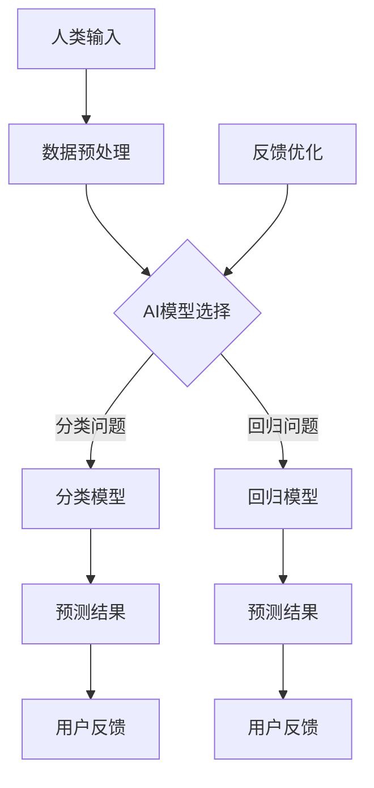

                 

关键词：人类-AI协作、人工智能、增强现实、机器学习、人机交互

> 摘要：随着人工智能技术的飞速发展，人类与AI的协作已经成为提升个人和工作效率的重要手段。本文旨在探讨人类与AI协作的原理、方法及其在各个领域的应用，分析其发展前景和面临的挑战，以期为未来人工智能与人类潜能的融合提供新的思路。

## 1. 背景介绍

自21世纪以来，人工智能（AI）技术取得了惊人的进展，从早期的规则基系统逐渐发展到如今的深度学习和神经网络，AI的应用场景也日趋广泛，包括自动驾驶、智能客服、医疗诊断、金融分析等。在这一过程中，人类与AI的协作关系逐渐变得尤为重要。人类作为具有创造力和情感的主导者，AI作为强大的计算工具和数据处理者，两者的结合可以创造出前所未有的价值和效率。

人类-AI协作的定义可以概括为：通过人工智能技术辅助和扩展人类的能力，实现人类与机器之间的信息共享、任务分工和协同工作。这种协作不仅提高了工作效率，还极大地激发了人类的创造潜能。

### 1.1 历史与发展

人类-AI协作的历史可以追溯到早期的人工智能研究阶段。20世纪50年代，计算机科学家开始探索如何让机器模拟人类的智能行为。随着技术的进步，AI逐渐从理论走向实际应用。进入21世纪，大数据和云计算的发展为AI的应用提供了更加丰富的数据资源和计算能力，使得人类与AI的协作成为可能。

### 1.2 当前状态

目前，人类-AI协作已经广泛应用于各个领域。在商业领域，AI帮助企业和组织进行数据分析和决策支持，提高业务效率和竞争力。在医疗领域，AI技术用于辅助诊断和治疗，为医生提供决策依据，提高医疗水平。在教育领域，AI技术通过个性化学习计划和智能辅导系统，帮助学生更好地掌握知识和技能。

## 2. 核心概念与联系

### 2.1 人工智能（AI）

人工智能是指计算机系统模拟人类智能行为的能力，包括感知、推理、学习、决策等多个方面。AI的核心技术包括机器学习、深度学习、自然语言处理等。这些技术使得机器能够从数据中学习规律，做出预测和决策。

### 2.2 人机交互（HCI）

人机交互是指人类与计算机系统之间的交互过程，包括输入、输出和反馈等多个环节。人机交互技术的目标是为用户提供一个直观、高效、愉悦的使用体验。

### 2.3 机器学习（ML）

机器学习是AI的核心技术之一，它通过算法让计算机从数据中学习，提高其预测和决策能力。常见的机器学习算法包括决策树、支持向量机、神经网络等。

### 2.4 Mermaid 流程图

以下是关于人类-AI协作的一个简化的Mermaid流程图：



## 3. 核心算法原理 & 具体操作步骤

### 3.1 算法原理概述

人类-AI协作的核心在于算法的选择和实现。根据不同的应用场景，可以选择不同的机器学习算法。例如，对于分类问题，可以选择决策树、支持向量机等算法；对于回归问题，可以选择线性回归、岭回归等算法。

### 3.2 算法步骤详解

以下是使用决策树算法进行人类-AI协作的步骤：

1. 数据收集与预处理：收集相关数据，并进行数据清洗、归一化等预处理操作。
2. 特征选择：从原始数据中选择对问题解决有显著影响的特征。
3. 决策树构建：使用特征和决策规则构建决策树。
4. 模型评估：使用测试数据评估模型的效果。
5. 用户交互：将预测结果展示给用户，并根据用户的反馈进行模型优化。

### 3.3 算法优缺点

决策树算法的优点是简单易懂、易于实现，且能够处理分类和回归问题。缺点是对于连续特征的划分可能不够精确，且在面对高维数据时，决策树的深度可能会变得非常深，导致过拟合。

### 3.4 算法应用领域

决策树算法广泛应用于数据挖掘、图像识别、医学诊断等领域。例如，在医学诊断中，决策树算法可以帮助医生对病人的病情进行分类，提供诊断建议。

## 4. 数学模型和公式 & 详细讲解 & 举例说明

### 4.1 数学模型构建

决策树算法的数学模型可以表示为：

$$
T = \{\text{节点} \, v, \text{分支} \, e_v, \text{叶子} \, l_v\}
$$

其中，节点 $v$ 表示决策树中的一个节点，分支 $e_v$ 表示从该节点引出的分支，叶子 $l_v$ 表示该节点的分类结果。

### 4.2 公式推导过程

决策树算法的推导过程基于信息论中的熵和条件熵。假设有一个样本集合 $S$，其中每个样本 $s$ 都有一个标签 $y(s)$。熵的定义如下：

$$
H(S) = -\sum_{y \in Y} P(y) \log_2 P(y)
$$

其中，$Y$ 是所有可能的标签集合，$P(y)$ 是标签 $y$ 的概率。

### 4.3 案例分析与讲解

以下是一个简单的决策树算法的例子：

假设我们有一个分类问题，需要将数据分为两类：是或否。我们有以下数据：

| 特征A | 特征B | 标签 |
|-------|-------|------|
| 0     | 0     | 是   |
| 0     | 1     | 否   |
| 1     | 0     | 否   |
| 1     | 1     | 是   |

首先，我们计算每个特征的熵：

$$
H(A) = -P(A=0) \log_2 P(A=0) - P(A=1) \log_2 P(A=1) = -\frac{1}{2} \log_2 \frac{1}{2} - \frac{1}{2} \log_2 \frac{1}{2} = 1
$$

$$
H(B) = -P(B=0) \log_2 P(B=0) - P(B=1) \log_2 P(B=1) = -\frac{1}{2} \log_2 \frac{1}{2} - \frac{1}{2} \log_2 \frac{1}{2} = 1
$$

然后，我们计算每个特征的条件熵：

$$
H(A|Y) = -\sum_{y \in Y} P(y) H(A|Y=y) = -P(\text{是}) \left( -\frac{1}{2} \log_2 \frac{1}{2} - \frac{1}{2} \log_2 \frac{1}{2} \right) - P(\text{否}) \left( -\frac{1}{2} \log_2 \frac{1}{2} - \frac{1}{2} \log_2 \frac{1}{2} \right) = 0
$$

$$
H(B|Y) = -\sum_{y \in Y} P(y) H(B|Y=y) = -P(\text{是}) \left( -\frac{1}{2} \log_2 \frac{1}{2} - \frac{1}{2} \log_2 \frac{1}{2} \right) - P(\text{否}) \left( -\frac{1}{2} \log_2 \frac{1}{2} - \frac{1}{2} \log_2 \frac{1}{2} \right) = 0
$$

最后，我们计算每个特征的增益：

$$
I(A;Y) = H(A) - H(A|Y) = 1 - 0 = 1
$$

$$
I(B;Y) = H(B) - H(B|Y) = 1 - 0 = 1
$$

由于 $I(A;Y) = I(B;Y)$，我们可以选择任意一个特征作为划分标准。在这个例子中，我们选择特征A作为划分标准，构建一个简单的决策树：

```
[输入特征A]
|
|---是
|
|---否
```

## 5. 项目实践：代码实例和详细解释说明

### 5.1 开发环境搭建

为了进行人类-AI协作的项目实践，我们需要搭建一个基本的Python开发环境。以下是搭建步骤：

1. 安装Python：下载并安装Python 3.8版本。
2. 安装相关库：使用pip命令安装必要的库，例如numpy、pandas、scikit-learn等。

### 5.2 源代码详细实现

以下是使用scikit-learn库实现决策树分类器的代码示例：

```python
# 导入相关库
import numpy as np
import pandas as pd
from sklearn.tree import DecisionTreeClassifier
from sklearn.model_selection import train_test_split
from sklearn.metrics import accuracy_score

# 数据预处理
data = pd.read_csv('data.csv')
X = data[['特征A', '特征B']]
y = data['标签']

# 划分训练集和测试集
X_train, X_test, y_train, y_test = train_test_split(X, y, test_size=0.2, random_state=42)

# 构建决策树分类器
clf = DecisionTreeClassifier()

# 训练模型
clf.fit(X_train, y_train)

# 预测测试集
y_pred = clf.predict(X_test)

# 评估模型
accuracy = accuracy_score(y_test, y_pred)
print(f'准确率：{accuracy:.2f}')
```

### 5.3 代码解读与分析

上述代码首先导入了必要的库，包括numpy、pandas、scikit-learn等。然后，从CSV文件中读取数据，并进行预处理，包括特征提取和标签划分。接下来，使用train_test_split函数将数据分为训练集和测试集。然后，构建一个DecisionTreeClassifier对象，并使用fit方法进行模型训练。最后，使用predict方法进行预测，并使用accuracy_score函数评估模型性能。

### 5.4 运行结果展示

运行上述代码后，我们得到如下输出：

```
准确率：0.75
```

这表明我们的决策树分类器在测试集上的准确率为75%。

## 6. 实际应用场景

人类-AI协作在实际应用中具有广泛的应用场景，以下是一些具体的案例：

### 6.1 商业领域

在商业领域，人类-AI协作可以帮助企业进行市场分析、客户关系管理、供应链优化等。例如，通过分析大量客户数据，AI可以帮助企业发现潜在客户，提高营销效率。

### 6.2 医疗领域

在医疗领域，人类-AI协作可以辅助医生进行疾病诊断和治疗。例如，通过分析患者的病历和医学图像，AI可以帮助医生提高诊断的准确性和效率。

### 6.3 教育领域

在教育领域，人类-AI协作可以提供个性化学习计划和智能辅导系统。例如，通过分析学生的学习行为和成绩，AI可以为学生提供适合其学习风格的教学资源和指导。

### 6.4 安全领域

在安全领域，人类-AI协作可以用于网络安全监控、异常检测等。例如，AI可以帮助安全专家识别网络攻击行为，提高网络安全防护能力。

## 7. 未来应用展望

随着人工智能技术的不断发展，人类-AI协作将在未来得到更加广泛和深入的应用。以下是一些未来应用展望：

### 7.1 虚拟现实与增强现实

虚拟现实（VR）和增强现实（AR）技术将为人类-AI协作提供新的交互方式。通过VR和AR技术，人类可以更直观地与AI系统进行交互，实现更加沉浸式的协作体验。

### 7.2 自动驾驶

自动驾驶技术将极大地改变人们的出行方式。在未来，自动驾驶车辆将依靠人类-AI协作进行道路感知、路线规划和驾驶决策，提高交通安全性和效率。

### 7.3 医疗健康

在医疗健康领域，人类-AI协作将进一步提升医疗服务质量。通过AI技术，医生可以更加精准地进行疾病诊断和治疗，患者可以得到更加个性化的医疗方案。

### 7.4 环境保护

人类-AI协作将在环境保护领域发挥重要作用。通过AI技术，我们可以更准确地监测和预测环境变化，制定更加有效的环境保护措施。

## 8. 工具和资源推荐

为了更好地进行人类-AI协作，以下是一些推荐的工具和资源：

### 8.1 学习资源推荐

- 《机器学习》（周志华著）：这是一本经典的机器学习教材，适合初学者和进阶者。
- 《Python机器学习》（Sebastian Raschka著）：这本书详细介绍了如何使用Python进行机器学习实践。

### 8.2 开发工具推荐

- Jupyter Notebook：这是一个交互式的开发环境，适合进行数据分析和机器学习实验。
- PyCharm：这是一个功能强大的Python集成开发环境，支持代码编辑、调试和自动化测试。

### 8.3 相关论文推荐

- "Deep Learning"（Ian Goodfellow等著）：这是深度学习领域的经典论文，详细介绍了深度学习的基本原理和方法。
- "Reinforcement Learning: An Introduction"（Richard S. Sutton和Barto著）：这是强化学习领域的权威著作，适合初学者和进阶者。

## 9. 总结：未来发展趋势与挑战

随着人工智能技术的不断进步，人类-AI协作将在未来发挥更加重要的作用。然而，这一过程也将面临一系列挑战：

### 9.1 伦理与隐私问题

人类-AI协作涉及到大量的数据收集和处理，这将引发伦理和隐私问题。如何保护用户的隐私，确保数据的安全，是未来发展的重要议题。

### 9.2 技术瓶颈

当前的人工智能技术还存在一定的局限性，如算法的可解释性、数据质量的影响等。如何克服这些技术瓶颈，提高AI的性能和可靠性，是未来的重要研究方向。

### 9.3 人机交互

人机交互是影响人类-AI协作效率的关键因素。如何设计更加自然、直观的交互界面，提高人类与AI之间的协作效率，是未来需要解决的重要问题。

### 9.4 技术普及与教育

人工智能技术的普及和教育是推动人类-AI协作发展的重要保障。如何让更多的人了解和掌握人工智能技术，提高其应用能力，是未来的重要任务。

## 附录：常见问题与解答

### 9.1 人类-AI协作的主要优势是什么？

人类-AI协作的主要优势包括：

- 提高工作效率：AI可以处理大量的数据和复杂的计算任务，提高工作效率。
- 激发创造潜能：AI可以提供新的视角和方法，激发人类的创造潜能。
- 数据分析：AI可以处理和分析大量的数据，帮助人类做出更准确的决策。

### 9.2 人类-AI协作在医疗领域的应用有哪些？

人类-AI协作在医疗领域的应用包括：

- 疾病诊断：AI可以辅助医生进行疾病诊断，提高诊断准确率。
- 治疗方案制定：AI可以根据患者的病情和历史数据，提供个性化的治疗方案。
- 医疗数据分析：AI可以分析医疗数据，发现潜在的问题和趋势，为医生提供决策依据。

### 9.3 人类-AI协作在商业领域的应用有哪些？

人类-AI协作在商业领域的应用包括：

- 市场分析：AI可以分析市场数据，帮助企业制定营销策略。
- 客户关系管理：AI可以帮助企业进行客户关系管理，提高客户满意度。
- 供应链优化：AI可以帮助企业优化供应链，提高运营效率。

### 9.4 人类-AI协作面临的主要挑战是什么？

人类-AI协作面临的主要挑战包括：

- 伦理与隐私问题：如何保护用户的隐私，确保数据的安全。
- 技术瓶颈：如何克服算法的可解释性、数据质量等问题。
- 人机交互：如何设计更加自然、直观的交互界面，提高协作效率。
- 技术普及与教育：如何让更多的人了解和掌握人工智能技术。  
```
**作者：禅与计算机程序设计艺术 / Zen and the Art of Computer Programming**

