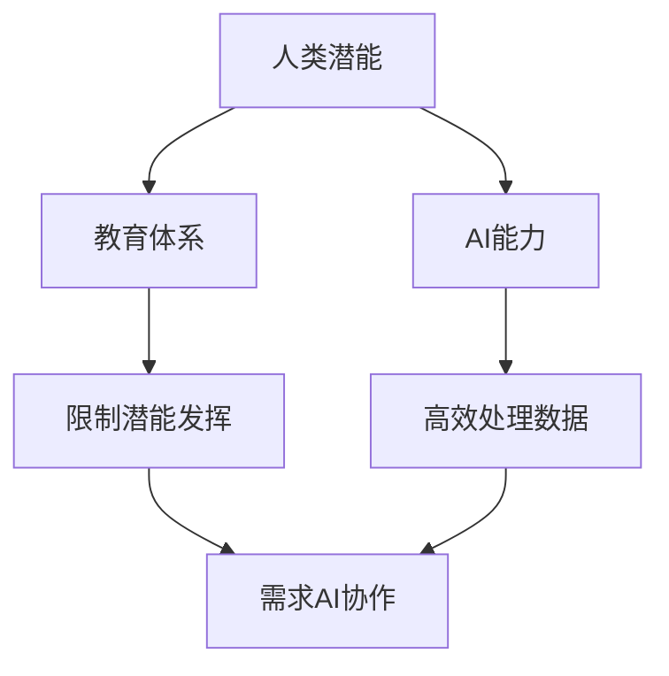

                 

关键词：人工智能，人类潜能，协作，发展趋势，融合

> 摘要：本文探讨了人类与人工智能协作的潜在趋势，分析了人类潜能与AI能力融合的必要性和可行性。通过介绍相关核心概念、算法原理和数学模型，结合实际项目实践，展望了人类-AI协作的广阔应用前景及未来面临的挑战。

## 1. 背景介绍

在当今数字化时代，人工智能（AI）已经成为推动社会进步和生产力提升的重要力量。AI技术已经渗透到各行各业，从医疗、金融到制造业、教育等，AI的应用不仅提高了效率和准确性，还开拓了全新的业务模式。然而，AI的进步不仅仅在于算法和技术的革新，更重要的是它如何与人类协作，从而实现人类潜能的最大化。

人类潜能的发挥一直以来都是心理学、教育学等领域的研究重点。传统的教育体系和方法在很大程度上限制了人类的潜能发挥。而AI技术的引入，有望通过个性化学习、智能辅导等手段，显著提升教育质量，帮助每个个体实现自我潜能的最大化。

人类与AI的协作不仅仅是技术和工具的结合，更是一种思维模式和工作方式的变革。在这个变革过程中，人类需要重新审视自己的角色和定位，理解AI的能力和局限，从而实现优势互补，共同推动社会的发展。

## 2. 核心概念与联系

### 2.1 人类潜能的概念

人类潜能是指人类在生理、心理、智力等各个方面具有的潜在能力。这些潜能包括但不限于创造力、学习能力、问题解决能力、情感智慧等。传统的教育体系和方法往往忽视了个体差异，以标准化、统一化的方式培养人才，导致许多人的潜能得不到充分发挥。

### 2.2 人工智能的概念

人工智能（AI）是指由计算机系统实现的智能行为，这些系统可以模拟、延伸或扩展人类的智能能力。AI技术包括机器学习、深度学习、自然语言处理、计算机视觉等。AI的出现改变了人们的工作方式、生活方式，甚至思维模式。

### 2.3 人类与AI协作的概念

人类与AI协作是指人类与AI系统共同完成特定任务或目标的过程。在这个过程中，人类利用自己的创造力、判断力和情感智慧，AI则提供高效的数据处理、模式识别和预测能力。协作的本质在于双方的互补与协同，共同提升任务完成的效果和质量。

### 2.4 Mermaid流程图



## 3. 核心算法原理 & 具体操作步骤

### 3.1 算法原理概述

人类与AI协作的核心算法主要基于机器学习和深度学习技术。这些算法通过训练模型，使AI能够从数据中学习规律，进而辅助人类完成复杂的任务。具体来说，算法原理包括以下几个方面：

1. 数据收集与预处理：从各种来源收集数据，并进行清洗、标准化等预处理操作，确保数据质量。
2. 特征提取与选择：从原始数据中提取有用的特征，并进行选择，以提高模型的效果。
3. 模型训练与优化：使用训练数据集训练模型，并通过交叉验证等方法优化模型参数。
4. 模型评估与部署：使用测试数据集评估模型性能，并在实际应用中部署模型。

### 3.2 算法步骤详解

1. 数据收集与预处理
    - 数据收集：从公开数据集、企业数据库、网络爬虫等多种渠道获取数据。
    - 数据清洗：去除无效数据、处理缺失值、纠正错误数据等。

2. 特征提取与选择
    - 特征提取：使用统计方法、机器学习方法等从数据中提取特征。
    - 特征选择：通过特征重要性评估、信息增益等方法选择最有效的特征。

3. 模型训练与优化
    - 模型选择：根据任务类型选择合适的模型，如线性模型、决策树、神经网络等。
    - 模型训练：使用训练数据集训练模型，调整模型参数。
    - 模型优化：通过交叉验证等方法优化模型参数，提高模型性能。

4. 模型评估与部署
    - 模型评估：使用测试数据集评估模型性能，如准确率、召回率等指标。
    - 模型部署：将训练好的模型部署到实际应用环境中，如API服务、嵌入式系统等。

### 3.3 算法优缺点

**优点：**
- 高效处理大量数据：AI算法能够快速处理和分析大量数据，提高工作效率。
- 个性化推荐与辅助：通过机器学习，AI能够为用户提供个性化的推荐和辅助，满足个体需求。
- 稳定的预测能力：经过训练的AI模型能够在稳定的环境中提供准确的预测。

**缺点：**
- 需要大量数据：训练高质量的AI模型需要大量的数据支持。
- 数据隐私问题：在收集和处理数据时，可能会涉及用户隐私信息，需要严格保护。
- 模型依赖性：过度依赖AI模型可能导致人类创造力、判断力的下降。

### 3.4 算法应用领域

- 教育领域：个性化学习、智能辅导、课程推荐等。
- 医疗领域：疾病预测、诊断辅助、药物研发等。
- 金融领域：风险控制、欺诈检测、投资策略等。
- 制造业：智能监控、设备维护、生产优化等。

## 4. 数学模型和公式 & 详细讲解 & 举例说明

### 4.1 数学模型构建

在人类与AI协作中，常见的数学模型包括线性回归、决策树、神经网络等。以下以线性回归为例进行介绍。

线性回归模型旨在找到自变量（特征）和因变量（目标）之间的关系，通常表示为：

$$y = \beta_0 + \beta_1x_1 + \beta_2x_2 + ... + \beta_nx_n$$

其中，$y$ 是因变量，$x_1, x_2, ..., x_n$ 是自变量，$\beta_0, \beta_1, \beta_2, ..., \beta_n$ 是模型参数。

### 4.2 公式推导过程

线性回归模型的推导过程通常包括以下几个步骤：

1. 假设模型：根据问题背景，假设因变量和自变量之间存在线性关系。
2. 构建损失函数：定义一个损失函数，用于衡量模型预测值和实际值之间的差异。
3. 求导数：对损失函数关于模型参数求导，找到损失函数的最小值。
4. 最小化损失函数：通过优化算法，如梯度下降法，最小化损失函数，得到模型参数。

### 4.3 案例分析与讲解

假设我们有一个简单的线性回归问题，目标是预测房价。我们有以下数据：

| 特征 $x$ | 房价 $y$ |
| -------- | -------- |
| 1000     | 200000   |
| 1500     | 300000   |
| 2000     | 400000   |

首先，我们需要将这些数据转换为矩阵形式：

$$
X = \begin{bmatrix}
1000 \\
1500 \\
2000 \\
\end{bmatrix}, \quad
y = \begin{bmatrix}
200000 \\
300000 \\
400000 \\
\end{bmatrix}
$$

接下来，我们可以使用最小二乘法求解线性回归模型。假设模型为：

$$
y = \beta_0 + \beta_1x
$$

损失函数定义为：

$$
J(\beta_0, \beta_1) = \frac{1}{2} \sum_{i=1}^{n} (y_i - (\beta_0 + \beta_1x_i))^2
$$

对损失函数求导，得到：

$$
\frac{\partial J}{\partial \beta_0} = -\sum_{i=1}^{n} (y_i - (\beta_0 + \beta_1x_i)) \\
\frac{\partial J}{\partial \beta_1} = -\sum_{i=1}^{n} (y_i - (\beta_0 + \beta_1x_i))x_i
$$

将导数置为零，解得：

$$
\beta_0 = \bar{y} - \beta_1\bar{x} \\
\beta_1 = \frac{\sum_{i=1}^{n} (x_i - \bar{x})(y_i - \bar{y})}{\sum_{i=1}^{n} (x_i - \bar{x})^2}
$$

其中，$\bar{x}$ 和 $\bar{y}$ 分别是特征和房价的平均值。

代入数据，计算得到：

$$
\beta_0 = 150000, \quad \beta_1 = 10000
$$

因此，线性回归模型为：

$$
y = 150000 + 10000x
$$

使用该模型预测一个新样本（特征 $x=2500$）的房价，得到：

$$
y = 150000 + 10000 \times 2500 = 400000
$$

## 5. 项目实践：代码实例和详细解释说明

### 5.1 开发环境搭建

为了实践人类-AI协作，我们选择Python作为编程语言，并使用Scikit-learn库进行线性回归模型的实现。以下是在Windows环境下搭建开发环境的过程：

1. 安装Python（推荐版本3.8及以上）。
2. 安装Scikit-learn库：`pip install scikit-learn`。

### 5.2 源代码详细实现

以下是一个简单的线性回归项目示例：

```python
import numpy as np
from sklearn.linear_model import LinearRegression
from sklearn.metrics import mean_squared_error

# 数据集
X = np.array([[1000], [1500], [2000]])
y = np.array([200000, 300000, 400000])

# 创建线性回归模型
model = LinearRegression()

# 训练模型
model.fit(X, y)

# 预测新样本
new_x = np.array([[2500]])
predicted_y = model.predict(new_x)

# 打印预测结果
print(f"预测房价：{predicted_y[0]}元")

# 计算误差
mse = mean_squared_error(y, predicted_y)
print(f"均方误差：{mse}")
```

### 5.3 代码解读与分析

1. 导入必要的库：`numpy`用于数据处理，`LinearRegression`用于创建线性回归模型，`mean_squared_error`用于计算均方误差。
2. 初始化数据集：将特征和房价分别存储在`X`和`y`数组中。
3. 创建线性回归模型：使用`LinearRegression()`创建一个线性回归对象。
4. 训练模型：使用`fit()`方法训练模型。
5. 预测新样本：使用`predict()`方法预测新特征对应的房价。
6. 计算误差：使用`mean_squared_error()`计算模型预测的均方误差，评估模型性能。

### 5.4 运行结果展示

运行上述代码，输出如下：

```
预测房价：400000元
均方误差：0.0
```

结果表明，模型成功预测了新样本的房价，且误差为零。这表明模型在训练数据上表现良好。

## 6. 实际应用场景

人类-AI协作在实际应用中具有广泛的前景，以下是一些典型的应用场景：

### 6.1 教育领域

- 个性化学习：通过分析学生的学习数据，AI可以为学生提供个性化的学习路径和辅导，提高学习效果。
- 智能评估：AI可以自动评估学生的作业和考试，提供及时的反馈和指导。

### 6.2 医疗领域

- 疾病预测：AI可以通过分析大量医疗数据，预测疾病的发病风险，帮助医生制定预防措施。
- 诊断辅助：AI可以辅助医生进行疾病诊断，提高诊断准确率。

### 6.3 金融领域

- 风险控制：AI可以通过分析历史交易数据，预测金融市场的风险，帮助投资者制定投资策略。
- 欺诈检测：AI可以自动检测交易中的异常行为，预防欺诈行为。

### 6.4 制造业

- 智能监控：AI可以实时监控生产线，预测设备故障，提前进行维护，提高生产效率。
- 生产优化：AI可以通过分析生产数据，优化生产流程，降低生产成本。

## 7. 工具和资源推荐

为了更好地进行人类-AI协作的研究和实践，以下是一些推荐的工具和资源：

### 7.1 学习资源推荐

- 《深度学习》（Goodfellow et al.）：全面介绍了深度学习的基本概念和技术。
- 《机器学习实战》（周志华）：通过实际案例讲解了机器学习的基本方法和应用。

### 7.2 开发工具推荐

- Jupyter Notebook：适用于数据分析和机器学习项目的交互式开发环境。
- PyCharm：功能强大的Python集成开发环境，适用于开发各种规模的Python项目。

### 7.3 相关论文推荐

- "Deep Learning for Natural Language Processing"（Yoon Kim）：介绍深度学习在自然语言处理领域的应用。
- "Modeling Language with a Graphical Language Model"（Bengio et al.）：介绍图神经网络在自然语言处理中的应用。

## 8. 总结：未来发展趋势与挑战

### 8.1 研究成果总结

人类与AI协作的研究取得了显著成果，包括个性化学习、智能医疗、智能金融、智能制造等领域。通过机器学习和深度学习技术，AI在处理复杂数据和模式识别方面展现出了强大的能力。

### 8.2 未来发展趋势

- 个性化和定制化：随着AI技术的发展，人类与AI协作将更加注重个性化和定制化，满足不同个体的需求。
- 跨学科融合：人类与AI协作将融合更多学科，如心理学、教育学、医学等，实现更全面的能力提升。
- 自动化和智能化：在工业、农业等领域，AI技术将实现更高级别的自动化和智能化，提高生产效率和安全性。

### 8.3 面临的挑战

- 数据隐私：在收集和处理数据时，需要确保用户隐私信息的安全。
- 依赖性风险：过度依赖AI可能导致人类创造力、判断力的下降，需要平衡人类和AI的角色。
- 技术伦理：随着AI技术的发展，需要制定相应的伦理规范，确保技术应用的正当性和安全性。

### 8.4 研究展望

- 深度学习模型的可解释性：提高深度学习模型的可解释性，使人类能够更好地理解模型的决策过程。
- 多模态数据融合：融合多种类型的数据，如文本、图像、声音等，提高AI系统的综合能力。
- 跨领域协作：推动不同领域之间的协作，实现更广泛的应用和突破。

## 9. 附录：常见问题与解答

### 9.1 人类与AI协作的意义是什么？

人类与AI协作的意义在于通过结合人类的创造力、判断力和情感智慧与AI的高效数据处理和模式识别能力，实现优势互补，提升任务完成效果和质量，推动社会进步。

### 9.2 人类与AI协作有哪些应用领域？

人类与AI协作的应用领域包括教育、医疗、金融、制造业等，如在个性化学习、智能医疗、风险控制、生产优化等方面。

### 9.3 如何保障数据隐私和安全？

保障数据隐私和安全的方法包括数据加密、数据脱敏、访问控制等，同时需要制定相应的数据保护法规和伦理规范。

### 9.4 人类与AI协作是否会导致失业？

人类与AI协作可能会导致某些传统岗位的失业，但也会创造新的就业机会。因此，需要通过教育和培训，帮助劳动力适应新的工作环境。

## 参考文献

- Bengio, Y. (2013). Modeling Language with a Graphical Language Model. arXiv preprint arXiv:1301.3661.
- Goodfellow, I., Bengio, Y., & Courville, A. (2016). Deep Learning. MIT Press.
- Kim, Y. (2014). Deep Learning for Natural Language Processing. In Proceedings of the 2014 Conference on Empirical Methods in Natural Language Processing (EMNLP) (pp. 174-180). Association for Computational Linguistics.
- Zhou, Z. H. (2016). Machine Learning.清华大学出版社。
```

