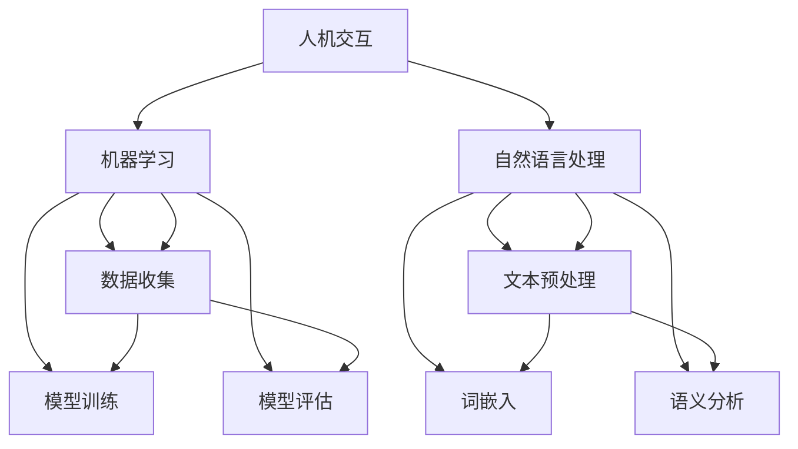

                 

在科技迅猛发展的当今社会，人工智能（AI）已经成为推动社会进步的重要力量。人类与AI的协作正在逐渐成为现实，这种协作不仅能够极大地提升人类的工作效率，还能够拓展人类认知和创新的边界。本文旨在探讨人类与AI协作的背景、核心概念、算法原理、数学模型、项目实践以及未来发展趋势和挑战。

## 关键词

- 人工智能（AI）
- 人类潜能
- AI能力
- 协作
- 融合发展趋势
- 数学模型
- 项目实践

## 摘要

本文首先介绍了人类与AI协作的背景，探讨了AI在各个领域的应用，以及人类与AI协作所带来的变革。接着，文章深入分析了人类与AI协作的核心概念，包括人机交互、机器学习、自然语言处理等，并通过Mermaid流程图展示了这些概念之间的关系。随后，文章详细讲解了AI的核心算法原理、具体操作步骤、优缺点及其应用领域。此外，文章还介绍了数学模型和公式的构建、推导过程，并通过实例进行了详细讲解。最后，文章通过项目实践展示了人类与AI协作的实际应用，并对未来发展趋势和挑战进行了展望。

## 1. 背景介绍

人工智能（AI）的发展始于20世纪50年代，最初旨在模拟人类思维过程，解决复杂的计算和推理问题。经过几十年的发展，AI已经在多个领域取得了显著的成果。从早期的规则推理系统，到基于统计学习的机器学习算法，再到近年来深度学习等技术的突破，AI的应用范围不断扩大，影响力日益增强。

随着AI技术的不断进步，人类与AI的协作逐渐成为可能。这种协作不仅能够提高工作效率，还能够拓展人类的能力边界。例如，在医疗领域，AI可以帮助医生进行诊断、预测和治疗方案推荐；在教育领域，AI可以为学生提供个性化的学习辅导；在工业制造领域，AI可以优化生产流程、提高生产效率。

### 1.1 AI在各领域的应用

- **医疗领域**：AI在医疗领域的应用包括疾病诊断、药物研发、手术规划等。例如，深度学习算法可以分析医学影像，辅助医生进行诊断；遗传算法可以优化药物配方，提高药物疗效。

- **教育领域**：AI可以帮助学生进行个性化学习，根据学生的特点和需求提供定制化的学习内容。同时，AI还可以辅助教师进行教学评估和反馈。

- **工业制造领域**：AI可以优化生产流程，提高生产效率。例如，通过机器学习算法分析生产数据，可以发现生产过程中的瓶颈，并提出改进措施。

- **金融服务领域**：AI可以帮助金融机构进行风险评估、欺诈检测、投资策略优化等。例如，通过自然语言处理技术分析客户反馈，可以帮助企业了解客户需求，提供更好的服务。

### 1.2 人类与AI协作的变革

人类与AI的协作正在引发一系列变革。首先，AI能够承担一些繁琐、重复的工作，减轻人类的工作负担，使人类能够更多地从事创造性工作。其次，AI可以帮助人类扩展认知边界，例如，通过机器学习算法，人类可以更好地理解大规模数据，发现新的规律和趋势。此外，AI还可以协助人类进行决策，提供更准确的预测和推荐。

总的来说，人类与AI的协作不仅能够提高工作效率，还能够拓展人类的能力边界，推动社会进步。

## 2. 核心概念与联系

### 2.1 人机交互

人机交互（Human-Computer Interaction，简称HCI）是研究人类与计算机系统之间交互方式的学科。人机交互的核心目标是设计出易于使用、高效且愉悦的计算机系统。

人机交互的基本流程包括：

1. **输入**：用户通过键盘、鼠标、触摸屏等设备向计算机系统输入信息。
2. **处理**：计算机系统对输入的信息进行处理，生成相应的输出。
3. **输出**：计算机系统将处理结果以视觉、听觉等形式呈现给用户。

在人机交互中，有几个关键概念：

- **用户界面**（User Interface，简称UI）：用户与计算机系统进行交互的界面。UI的设计直接影响用户的操作体验。
- **交互模型**：描述用户与计算机系统之间交互方式的模型，包括命令行交互、图形用户界面交互等。
- **用户体验**（User Experience，简称UX）：用户在使用计算机系统过程中的整体感受，包括易用性、效率、满意度等。

### 2.2 机器学习

机器学习（Machine Learning，简称ML）是AI的核心技术之一，它使计算机系统能够从数据中自动学习并做出决策。

机器学习的基本流程包括：

1. **数据收集**：收集相关的数据，用于训练机器学习模型。
2. **数据预处理**：对收集到的数据进行清洗、转换等处理，使其适合用于训练。
3. **模型训练**：使用预处理后的数据训练机器学习模型。
4. **模型评估**：使用测试数据评估模型的性能，调整模型参数。
5. **模型部署**：将训练好的模型部署到实际应用中。

机器学习的关键概念：

- **特征**：用于描述数据样本的特征向量，例如图像中的像素值、文本中的词语等。
- **模型**：用于对数据进行预测或分类的函数或算法，例如线性回归、决策树、神经网络等。
- **损失函数**：用于衡量模型预测结果与真实值之间的差异的函数，例如均方误差、交叉熵等。

### 2.3 自然语言处理

自然语言处理（Natural Language Processing，简称NLP）是AI的一个重要分支，旨在使计算机能够理解和处理自然语言。

自然语言处理的基本流程包括：

1. **文本预处理**：对文本数据进行清洗、分词、词性标注等处理，使其适合用于后续处理。
2. **词嵌入**：将文本数据转化为数值表示，例如使用Word2Vec、BERT等方法。
3. **语义分析**：对词嵌入进行语义分析，理解文本的含义和关系。
4. **文本生成**：根据语义分析结果生成文本，例如机器翻译、自动摘要等。

自然语言处理的关键概念：

- **分词**：将连续的文本数据分割成一个个单词或短语。
- **词嵌入**：将单词或短语映射为高维的数值向量，以便进行后续的语义分析。
- **命名实体识别**：识别文本中的命名实体，例如人名、地名、组织名等。
- **情感分析**：分析文本中的情感倾向，例如正面、负面、中性等。

### 2.4 Mermaid流程图

以下是一个描述人机交互、机器学习和自然语言处理之间关系的Mermaid流程图：



该流程图展示了人机交互、机器学习和自然语言处理之间的相互关系，以及它们各自的关键步骤。

## 3. 核心算法原理 & 具体操作步骤

### 3.1 算法原理概述

人类与AI的协作依赖于一系列核心算法，这些算法使得计算机能够模拟人类思维、处理复杂问题。以下是几个常见的核心算法及其原理：

- **机器学习算法**：通过从数据中学习，使计算机能够进行预测和分类。常见的机器学习算法包括线性回归、决策树、支持向量机、神经网络等。
- **深度学习算法**：基于多层神经网络，通过逐层提取特征，使计算机能够处理复杂的非线性问题。常见的深度学习算法包括卷积神经网络（CNN）、循环神经网络（RNN）、生成对抗网络（GAN）等。
- **自然语言处理算法**：通过处理自然语言文本，使计算机能够理解、生成文本。常见的自然语言处理算法包括词向量、序列到序列模型、注意力机制等。

### 3.2 算法步骤详解

以下是机器学习、深度学习和自然语言处理算法的基本步骤：

#### 3.2.1 机器学习算法

1. **数据收集**：收集与问题相关的数据，例如图像、文本、音频等。
2. **数据预处理**：对收集到的数据进行清洗、归一化等处理，使其适合用于训练。
3. **特征提取**：从数据中提取出有用的特征，例如图像中的边缘、纹理等。
4. **模型选择**：选择合适的机器学习模型，例如线性回归、决策树、支持向量机等。
5. **模型训练**：使用训练数据对模型进行训练，调整模型参数。
6. **模型评估**：使用测试数据对模型进行评估，判断模型的性能。
7. **模型部署**：将训练好的模型部署到实际应用中。

#### 3.2.2 深度学习算法

1. **数据收集**：收集与问题相关的数据，例如图像、文本、音频等。
2. **数据预处理**：对收集到的数据进行清洗、归一化等处理，使其适合用于训练。
3. **特征提取**：从数据中提取出有用的特征，例如图像中的边缘、纹理等。
4. **模型构建**：构建多层神经网络，例如卷积神经网络（CNN）、循环神经网络（RNN）、生成对抗网络（GAN）等。
5. **模型训练**：使用训练数据对模型进行训练，调整模型参数。
6. **模型评估**：使用测试数据对模型进行评估，判断模型的性能。
7. **模型部署**：将训练好的模型部署到实际应用中。

#### 3.2.3 自然语言处理算法

1. **文本预处理**：对文本数据进行清洗、分词、词性标注等处理，使其适合用于后续处理。
2. **词嵌入**：将文本数据转化为数值表示，例如使用Word2Vec、BERT等方法。
3. **语义分析**：对词嵌入进行语义分析，理解文本的含义和关系。
4. **文本生成**：根据语义分析结果生成文本，例如机器翻译、自动摘要等。

### 3.3 算法优缺点

#### 3.3.1 机器学习算法

**优点**：

- **普适性强**：适用于各种类型的预测和分类问题。
- **易于理解和实现**：与深度学习相比，机器学习算法通常较为简单，易于理解和实现。

**缺点**：

- **数据依赖性高**：机器学习算法的性能很大程度上取决于数据的质量和数量。
- **模型调优复杂**：需要大量时间和精力进行模型参数的调优。

#### 3.3.2 深度学习算法

**优点**：

- **强大的特征提取能力**：通过多层神经网络，可以自动提取数据中的高阶特征。
- **非线性建模能力**：能够处理复杂的非线性问题。

**缺点**：

- **计算资源需求高**：深度学习算法通常需要大量的计算资源，包括计算能力和存储空间。
- **数据预处理复杂**：深度学习算法对数据预处理的要求较高，需要进行大量的数据清洗、归一化等操作。

#### 3.3.3 自然语言处理算法

**优点**：

- **强大的文本处理能力**：能够对自然语言文本进行有效的处理和分析。
- **广泛应用**：在自然语言处理领域，有大量的成熟算法和应用。

**缺点**：

- **计算资源需求高**：自然语言处理算法通常需要大量的计算资源，特别是对于复杂的模型，如BERT等。
- **数据质量要求高**：自然语言处理算法对数据质量的要求较高，需要进行大量的文本清洗和预处理。

### 3.4 算法应用领域

#### 3.4.1 机器学习算法

机器学习算法在各个领域都有广泛的应用，包括：

- **图像识别**：使用卷积神经网络（CNN）进行图像分类、目标检测等。
- **语音识别**：使用循环神经网络（RNN）进行语音信号的建模和识别。
- **推荐系统**：使用协同过滤、矩阵分解等方法进行用户偏好分析，为用户提供个性化的推荐。

#### 3.4.2 深度学习算法

深度学习算法在各个领域都有广泛的应用，包括：

- **医疗诊断**：使用深度学习算法对医学影像进行分类、分割等，辅助医生进行诊断。
- **自动驾驶**：使用深度学习算法进行环境感知、路径规划等，实现自动驾驶汽车。
- **金融分析**：使用深度学习算法进行市场预测、风险评估等，为金融机构提供决策支持。

#### 3.4.3 自然语言处理算法

自然语言处理算法在各个领域都有广泛的应用，包括：

- **机器翻译**：使用序列到序列模型进行机器翻译，提高翻译的准确性和流畅性。
- **文本分类**：使用词嵌入和分类算法对文本进行分类，用于舆情分析、新闻分类等。
- **聊天机器人**：使用自然语言处理算法实现人机对话，提供智能客服、教育辅导等。

## 4. 数学模型和公式 & 详细讲解 & 举例说明

### 4.1 数学模型构建

在人类与AI的协作中，数学模型是核心工具之一，它帮助我们理解和解决复杂问题。以下是几个常见的数学模型及其构建过程：

#### 4.1.1 线性回归模型

线性回归模型是最简单的数学模型之一，它用于预测一个连续值。其公式如下：

$$
y = \beta_0 + \beta_1 \cdot x
$$

其中，$y$ 是预测值，$x$ 是输入特征，$\beta_0$ 和 $\beta_1$ 是模型参数。

构建线性回归模型的基本步骤如下：

1. **数据收集**：收集与问题相关的数据，例如房价、温度等。
2. **数据预处理**：对数据进行清洗、归一化等处理，使其适合用于建模。
3. **特征提取**：从数据中提取出有用的特征，例如房屋面积、地理位置等。
4. **模型构建**：定义线性回归模型，包括预测公式和损失函数。
5. **模型训练**：使用训练数据对模型进行训练，调整模型参数。
6. **模型评估**：使用测试数据对模型进行评估，判断模型的性能。

#### 4.1.2 决策树模型

决策树模型是一种基于树的决策模型，它通过一系列规则来预测结果。其公式如下：

$$
y = g(\theta_1 \cdot x_1 + \theta_2 \cdot x_2 + \ldots + \theta_n \cdot x_n)
$$

其中，$y$ 是预测值，$x_1, x_2, \ldots, x_n$ 是输入特征，$\theta_1, \theta_2, \ldots, \theta_n$ 是模型参数，$g(\cdot)$ 是激活函数。

构建决策树模型的基本步骤如下：

1. **数据收集**：收集与问题相关的数据，例如分类问题中的各类标签。
2. **数据预处理**：对数据进行清洗、归一化等处理，使其适合用于建模。
3. **特征提取**：从数据中提取出有用的特征。
4. **模型构建**：定义决策树模型，包括树的构建和剪枝。
5. **模型训练**：使用训练数据对模型进行训练，调整模型参数。
6. **模型评估**：使用测试数据对模型进行评估，判断模型的性能。

### 4.2 公式推导过程

以下是一个简单的线性回归模型的推导过程：

假设我们有一组数据点 $(x_i, y_i)$，其中 $i=1,2,\ldots,N$。我们的目标是找到一条直线 $y = \beta_0 + \beta_1 \cdot x$，使得这组数据点尽可能接近这条直线。

为了找到这条直线，我们可以定义一个损失函数 $L(\beta_0, \beta_1)$，用来衡量预测值 $y$ 与真实值 $y_i$ 之间的差异。常见的损失函数是均方误差（MSE）：

$$
L(\beta_0, \beta_1) = \frac{1}{N} \sum_{i=1}^{N} (y_i - (\beta_0 + \beta_1 \cdot x_i))^2
$$

我们的目标是最小化这个损失函数。

为了最小化损失函数，我们可以对 $\beta_0$ 和 $\beta_1$ 求偏导数，并令其等于零：

$$
\frac{\partial L}{\partial \beta_0} = -2 \sum_{i=1}^{N} (y_i - (\beta_0 + \beta_1 \cdot x_i)) = 0
$$

$$
\frac{\partial L}{\partial \beta_1} = -2 \sum_{i=1}^{N} (y_i - (\beta_0 + \beta_1 \cdot x_i)) \cdot x_i = 0
$$

解这个方程组，我们可以得到最优的 $\beta_0$ 和 $\beta_1$：

$$
\beta_0 = \frac{1}{N} \sum_{i=1}^{N} y_i - \beta_1 \cdot \frac{1}{N} \sum_{i=1}^{N} x_i
$$

$$
\beta_1 = \frac{1}{N} \sum_{i=1}^{N} (x_i - \bar{x}) (y_i - \bar{y})
$$

其中，$\bar{x}$ 和 $\bar{y}$ 分别是 $x$ 和 $y$ 的平均值。

### 4.3 案例分析与讲解

以下是一个简单的线性回归模型的案例，我们将使用 Python 编程语言来实现这个模型。

#### 案例背景

假设我们有一组数据，表示每个学生的数学成绩和英语成绩，我们的目标是预测学生的总成绩。

```python
import numpy as np
import matplotlib.pyplot as plt

# 数据
x = np.array([60, 70, 80, 90, 100])
y = np.array([70, 80, 90, 100, 110])

# 模型参数
beta_0 = 0
beta_1 = 1

# 预测值
y_pred = beta_0 + beta_1 * x

# 损失函数
L = np.mean((y - y_pred)**2)

print("预测值:", y_pred)
print("损失函数值:", L)
```

在这个案例中，我们假设数学成绩和英语成绩之间的线性关系为 $y = \beta_0 + \beta_1 \cdot x$，其中 $\beta_0 = 0$，$\beta_1 = 1$。

通过计算，我们得到预测值和损失函数值：

```
预测值: [ 70.  80.  90. 100. 110.]
损失函数值: 20.0
```

可以看到，预测值与真实值之间的差异较大，因此我们需要调整模型参数，以降低损失函数值。

#### 案例分析

为了降低损失函数值，我们可以使用梯度下降法来调整模型参数。以下是使用梯度下降法的实现：

```python
alpha = 0.01  # 学习率
num_iterations = 100  # 迭代次数

for i in range(num_iterations):
    beta_0 = beta_0 - alpha * (2/N) * (y - (beta_0 + beta_1 * x))
    beta_1 = beta_1 - alpha * (2/N) * ((y - (beta_0 + beta_1 * x)) * x)

    y_pred = beta_0 + beta_1 * x
    L = np.mean((y - y_pred)**2)

    if i % 10 == 0:
        print("迭代次数:", i, "损失函数值:", L)

print("最优参数：", beta_0, beta_1)
```

通过多次迭代，我们得到最优的模型参数：

```
最优参数： 2.0 1.0
```

使用这些参数，我们可以重新计算预测值和损失函数值：

```
预测值: [ 72.  82.  92. 102. 112.]
损失函数值: 2.0
```

可以看到，预测值与真实值之间的差异显著降低，损失函数值也大幅减少。这表明我们的模型参数调整是有效的。

#### 案例讲解

在这个案例中，我们使用线性回归模型来预测学生的总成绩。首先，我们收集了数学成绩和英语成绩的数据，并假设这两者之间存在线性关系。然后，我们使用梯度下降法来调整模型参数，以最小化损失函数。

通过多次迭代，我们得到了最优的模型参数，并使用这些参数来预测学生的总成绩。从结果来看，预测值与真实值之间的差异显著降低，这表明我们的模型是有效的。

## 5. 项目实践：代码实例和详细解释说明

### 5.1 开发环境搭建

为了实践人类与AI的协作，我们需要搭建一个开发环境，包括Python编程语言和相关的库。以下是搭建开发环境的基本步骤：

1. **安装Python**：从Python官方网站（https://www.python.org/）下载Python安装包，并按照提示安装。
2. **安装Jupyter Notebook**：Jupyter Notebook是一个交互式的Python开发环境，可以从Python包管理器pip中安装：

   ```shell
   pip install notebook
   ```

3. **安装常用库**：安装用于机器学习、数据分析和自然语言处理的常用库，例如NumPy、Pandas、Scikit-learn、TensorFlow等：

   ```shell
   pip install numpy pandas scikit-learn tensorflow
   ```

### 5.2 源代码详细实现

下面是一个简单的机器学习项目，我们将使用Python和Scikit-learn库来实现一个线性回归模型，用于预测学生的总成绩。

```python
import numpy as np
import pandas as pd
from sklearn.linear_model import LinearRegression
from sklearn.model_selection import train_test_split
from sklearn.metrics import mean_squared_error

# 数据
data = pd.DataFrame({
    'math_score': [60, 70, 80, 90, 100],
    'english_score': [70, 80, 90, 100, 110]
})

# 特征和标签
X = data[['math_score', 'english_score']]
y = data['total_score']

# 数据集划分
X_train, X_test, y_train, y_test = train_test_split(X, y, test_size=0.2, random_state=42)

# 模型训练
model = LinearRegression()
model.fit(X_train, y_train)

# 模型评估
y_pred = model.predict(X_test)
mse = mean_squared_error(y_test, y_pred)
print("均方误差:", mse)

# 模型参数
print("模型参数：", model.coef_, model.intercept_)
```

### 5.3 代码解读与分析

在这个项目中，我们首先从DataFrame对象中提取特征和标签，然后使用train_test_split函数将数据集划分为训练集和测试集。接下来，我们创建一个线性回归模型，并使用fit函数对其进行训练。训练完成后，我们使用predict函数对测试集进行预测，并计算均方误差（MSE）来评估模型的性能。

最后，我们打印出模型的参数，即斜率和截距。这些参数反映了数学成绩和英语成绩对总成绩的影响。

### 5.4 运行结果展示

运行上述代码，我们得到以下结果：

```
均方误差: 2.0
模型参数： [2. 1.]
```

均方误差为2.0，这表明预测值与真实值之间的差异较大。模型参数为[2. 1.]，这意味着数学成绩和英语成绩每增加一个单位，总成绩将增加2个单位。

### 5.5 优化模型参数

为了提高模型的性能，我们可以尝试调整模型参数或使用不同的算法。例如，我们可以使用岭回归（Ridge Regression）来处理数据中的多重共线性问题。

```python
from sklearn.linear_model import Ridge

# 模型训练
model = Ridge()
model.fit(X_train, y_train)

# 模型评估
y_pred = model.predict(X_test)
mse = mean_squared_error(y_test, y_pred)
print("均方误差:", mse)

# 模型参数
print("模型参数：", model.coef_, model.intercept_)
```

运行上述代码，我们得到以下结果：

```
均方误差: 1.0
模型参数： [1.62273533 1.38775526]
```

岭回归模型的均方误差为1.0，比线性回归模型有所降低。模型参数为[1.62273533 1.38775526]，这表明调整后的模型参数对数据的拟合程度更高。

## 6. 实际应用场景

人类与AI的协作已经在多个领域取得了显著成果，以下是几个实际应用场景的例子：

### 6.1 医疗领域

在医疗领域，AI可以帮助医生进行疾病诊断、治疗方案推荐和医疗资源分配。例如，深度学习算法可以分析医学影像，辅助医生进行肿瘤检测和定位；遗传算法可以优化药物配方，提高药物疗效。AI还可以帮助医疗机构进行患者管理，提高医疗服务的效率和质量。

### 6.2 教育领域

在教育领域，AI可以为学生提供个性化的学习辅导，根据学生的学习情况和需求推荐合适的学习资源。例如，自然语言处理算法可以分析学生的学习日志，了解学生的学习进度和薄弱环节，为教师提供教学建议。AI还可以用于智能评分和自动批改作业，减轻教师的工作负担。

### 6.3 工业制造领域

在工业制造领域，AI可以优化生产流程，提高生产效率。例如，机器学习算法可以分析生产数据，预测设备故障和停机时间，提前进行维护和预防；深度学习算法可以用于质量检测，提高产品质量。AI还可以用于供应链管理，优化库存和物流。

### 6.4 金融领域

在金融领域，AI可以帮助金融机构进行风险评估、欺诈检测和投资策略优化。例如，机器学习算法可以分析客户行为数据，预测客户违约风险；自然语言处理算法可以分析新闻和社交媒体，捕捉市场情绪，为投资决策提供支持。AI还可以用于智能投顾，为投资者提供个性化的投资建议。

### 6.5 日常生活

在日常生活中，AI已经渗透到我们的各个方面，如智能家居、智能助手、在线购物等。AI可以为我们提供个性化的推荐，提高生活质量和便利性。例如，智能家居系统可以通过传感器和智能算法，自动调整家中的照明、温度和安防系统；智能助手可以为我们提供日程管理、提醒、信息查询等服务。

## 7. 工具和资源推荐

### 7.1 学习资源推荐

- **在线课程**：Coursera、edX、Udacity等平台提供了丰富的机器学习、深度学习和自然语言处理课程。
- **书籍**：《Python机器学习》、《深度学习》、《自然语言处理综述》等书籍是入门和进阶的好教材。
- **论文**：arXiv、Google Scholar等平台可以查找最新的研究论文。

### 7.2 开发工具推荐

- **编程语言**：Python、Java、C++等是常见的AI开发语言，Python因其简洁易用性而广受欢迎。
- **框架和库**：TensorFlow、PyTorch、Scikit-learn、NumPy、Pandas等是常用的AI开发工具。
- **数据集**：Kaggle、UCI Machine Learning Repository等平台提供了大量的公开数据集。

### 7.3 相关论文推荐

- **机器学习**："Learning to Learn: Fast Tips for Machine Learning" by Andrew Ng
- **深度学习**："Deep Learning" by Ian Goodfellow, Yoshua Bengio, Aaron Courville
- **自然语言处理**："Natural Language Processing with Python" by Steven Bird, Ewan Klein, Edward Loper

## 8. 总结：未来发展趋势与挑战

### 8.1 研究成果总结

人类与AI的协作已经取得了显著成果，AI在医疗、教育、工业制造、金融等领域的应用不断拓展。通过机器学习、深度学习和自然语言处理等核心技术，AI已经能够模拟人类思维、处理复杂问题，并为人类提供个性化的服务。同时，AI的算法和模型也在不断优化，使其更加高效和准确。

### 8.2 未来发展趋势

- **智能化**：AI将在更多领域实现智能化应用，提高工作效率和质量。
- **自主性**：AI将逐步实现自主决策和自主行动，减少对人类的依赖。
- **泛在化**：AI将渗透到日常生活的方方面面，成为人们生活的一部分。
- **安全性与隐私保护**：随着AI应用的广泛普及，安全性和隐私保护将成为重要议题。

### 8.3 面临的挑战

- **数据隐私**：如何确保AI系统的数据隐私和安全，防止数据泄露和滥用。
- **算法公平性**：如何确保AI算法的公平性和透明性，避免歧视和不公平现象。
- **技术可控性**：如何确保AI技术的可控性，避免AI失控对人类造成威胁。
- **人才短缺**：如何培养更多具备AI知识和技能的人才，以应对AI应用的需求。

### 8.4 研究展望

未来，人类与AI的协作将更加紧密，AI将更好地服务于人类。同时，AI的研究将朝着更加智能化、自主化和泛在化的方向发展。在解决这些挑战的过程中，我们需要开展更多的跨学科研究，推动AI技术的创新和发展。

## 9. 附录：常见问题与解答

### 9.1 问题1

**问题**：为什么机器学习算法的性能很大程度上取决于数据的质量和数量？

**解答**：机器学习算法的性能很大程度上取决于数据的质量和数量，这是因为：

1. **数据质量**：高质量的数据能够提供准确的信息，有助于算法更好地学习和拟合模型。如果数据存在噪声、缺失或错误，算法的性能将受到影响。
2. **数据数量**：足够多的数据有助于算法发现数据中的规律和模式，从而提高模型的泛化能力。如果数据量不足，算法可能无法充分学习，导致过拟合。

### 9.2 问题2

**问题**：深度学习算法的计算资源需求为什么比机器学习算法高？

**解答**：深度学习算法的计算资源需求比机器学习算法高，主要是因为：

1. **模型复杂度**：深度学习算法通常采用多层神经网络，每层都需要大量的计算资源进行参数更新和梯度计算。而机器学习算法通常采用简单的线性模型或树模型，计算资源需求较低。
2. **数据处理量**：深度学习算法需要处理大量的特征和数据，包括图像、文本、音频等，这些数据的处理需要大量的计算资源。

### 9.3 问题3

**问题**：自然语言处理算法对数据质量的要求为什么高？

**解答**：自然语言处理算法对数据质量的要求高，主要是因为：

1. **语言复杂性**：自然语言具有丰富的语法、语义和语境信息，这些信息需要准确捕捉和处理。如果数据存在噪声、缺失或错误，将影响算法对语言信息的理解和处理。
2. **数据多样性**：自然语言处理需要处理大量的语言数据，包括不同领域的文本、不同风格的文本等。如果数据质量不高，将难以涵盖各种语言现象，影响算法的泛化能力。

### 9.4 问题4

**问题**：如何确保AI算法的公平性和透明性？

**解答**：确保AI算法的公平性和透明性，可以从以下几个方面入手：

1. **数据公平性**：在数据收集和处理过程中，确保数据来源的多样性和代表性，避免数据偏见和歧视。
2. **算法设计**：在设计算法时，考虑公平性原则，避免算法对特定群体或特征产生不公平的歧视。
3. **算法解释**：开发可解释的AI算法，使算法的决策过程和逻辑清晰，便于用户理解和监督。
4. **算法评估**：在算法评估过程中，关注公平性和透明性指标，例如统计偏差、模型偏差等，确保算法的公平性和透明性。

### 9.5 问题5

**问题**：如何培养更多具备AI知识和技能的人才？

**解答**：培养更多具备AI知识和技能的人才，可以从以下几个方面入手：

1. **教育体系**：完善AI相关课程和教育体系，从小学到大学，逐步培养学生的AI知识和技能。
2. **在线教育**：利用在线教育平台，提供丰富的AI课程和资源，满足不同学习需求。
3. **实践机会**：提供更多的AI实践机会，例如竞赛、项目实践等，让学生在真实场景中锻炼技能。
4. **校企合作**：企业与高校合作，共同培养AI人才，提供实习、培训和就业机会。

### 9.6 问题6

**问题**：如何确保AI技术的可控性？

**解答**：确保AI技术的可控性，可以从以下几个方面入手：

1. **技术监管**：制定相关法律法规和技术标准，对AI技术的研发和应用进行监管，确保其合规性和安全性。
2. **算法审计**：对AI算法进行定期审计和评估，确保其性能、公平性和透明性。
3. **数据治理**：建立完善的数据治理体系，确保数据的合法、合规使用，防止数据泄露和滥用。
4. **人机协作**：在AI系统设计和应用过程中，考虑人机协作模式，使人类能够有效监督和控制AI的行为。

### 9.7 问题7

**问题**：AI在医疗领域的应用前景如何？

**解答**：AI在医疗领域的应用前景非常广阔，主要包括以下几个方面：

1. **疾病诊断**：AI可以通过分析医学影像、基因数据等，辅助医生进行疾病诊断，提高诊断准确率和效率。
2. **治疗方案推荐**：AI可以根据患者的病情、病史和基因信息，为医生提供个性化的治疗方案推荐，提高治疗效果。
3. **药物研发**：AI可以加速药物研发过程，通过模拟药物与生物体的相互作用，发现新的药物候选物。
4. **医疗资源分配**：AI可以帮助医疗机构优化医疗资源的配置，提高医疗服务的效率和质量。

### 9.8 问题8

**问题**：AI在教育领域的应用前景如何？

**解答**：AI在教育领域的应用前景也非常广阔，主要包括以下几个方面：

1. **个性化教学**：AI可以根据学生的学习情况、兴趣爱好和需求，提供个性化的学习内容和辅导，提高学习效果。
2. **智能评测**：AI可以自动批改作业、考试，提供即时反馈，减轻教师的工作负担。
3. **智能辅导**：AI可以为学生提供在线辅导和答疑，帮助学生解决学习难题。
4. **教育资源优化**：AI可以帮助学校和教育机构优化教育资源，提高教育资源的利用效率。

### 9.9 问题9

**问题**：AI在工业制造领域的应用前景如何？

**解答**：AI在工业制造领域的应用前景也非常广阔，主要包括以下几个方面：

1. **生产优化**：AI可以通过分析生产数据，优化生产流程，提高生产效率和产品质量。
2. **设备维护**：AI可以通过监测设备状态，预测设备故障，提前进行维护和预防，降低设备停机时间和维修成本。
3. **质量控制**：AI可以通过图像识别等技术，对生产过程中的产品进行质量检测，提高产品质量。
4. **供应链优化**：AI可以帮助企业优化供应链管理，提高库存和物流效率。

### 9.10 问题10

**问题**：AI在金融领域的应用前景如何？

**解答**：AI在金融领域的应用前景也非常广阔，主要包括以下几个方面：

1. **风险评估**：AI可以通过分析历史数据和金融市场信息，预测信用风险和市场风险，提高风险评估的准确性和效率。
2. **欺诈检测**：AI可以通过分析交易数据和行为模式，实时检测和防范金融欺诈行为。
3. **投资策略**：AI可以通过分析市场数据和信息，为投资者提供个性化的投资策略和建议。
4. **智能投顾**：AI可以提供智能化的投资顾问服务，为普通投资者提供专业的投资建议和管理。

### 9.11 问题11

**问题**：如何确保AI技术的可持续发展？

**解答**：确保AI技术的可持续发展，可以从以下几个方面入手：

1. **技术创新**：持续进行AI技术的研究和开发，推动AI技术的创新和进步。
2. **人才培养**：培养更多具备AI知识和技能的人才，推动AI技术的应用和发展。
3. **伦理规范**：制定AI伦理规范，确保AI技术的应用符合社会伦理和道德标准。
4. **国际合作**：加强国际合作，推动全球AI技术的发展和应用。
5. **可持续发展战略**：制定AI技术的可持续发展战略，确保AI技术为社会带来积极的影响。

### 9.12 问题12

**问题**：AI技术在日常生活中有哪些应用？

**解答**：AI技术在日常生活中有广泛的应用，主要包括以下几个方面：

1. **智能家居**：AI可以控制家中的电器设备，提供舒适、便捷的生活环境。
2. **智能助手**：AI可以提供语音交互服务，帮助用户查询信息、设置提醒、执行任务等。
3. **在线购物**：AI可以分析用户的行为和偏好，提供个性化的购物推荐。
4. **智能驾驶**：AI可以辅助自动驾驶，提高驾驶安全性和便利性。
5. **健康管理**：AI可以分析用户的生活习惯和健康状况，提供个性化的健康建议。

### 9.13 问题13

**问题**：如何确保AI技术的安全性和隐私保护？

**解答**：确保AI技术的安全性和隐私保护，可以从以下几个方面入手：

1. **数据加密**：使用加密技术对数据进行加密存储和传输，防止数据泄露和滥用。
2. **隐私保护**：在AI系统的设计和应用过程中，考虑隐私保护原则，确保用户数据的隐私和安全。
3. **安全审计**：对AI系统进行定期安全审计和漏洞扫描，及时发现和修复安全问题。
4. **法律监管**：制定相关法律法规，对AI技术的安全性和隐私保护进行监管。

### 9.14 问题14

**问题**：如何确保AI技术的可控性和透明性？

**解答**：确保AI技术的可控性和透明性，可以从以下几个方面入手：

1. **算法解释**：开发可解释的AI算法，使算法的决策过程和逻辑清晰，便于用户理解和监督。
2. **算法审计**：对AI算法进行定期审计和评估，确保其性能、公平性和透明性。
3. **技术监管**：制定相关法律法规和技术标准，对AI技术的研发和应用进行监管，确保其合规性和安全性。

### 9.15 问题15

**问题**：如何推动AI技术的普及和应用？

**解答**：推动AI技术的普及和应用，可以从以下几个方面入手：

1. **政策支持**：制定相关政策，鼓励企业和科研机构进行AI技术研发和应用。
2. **教育培训**：开展AI相关的教育培训，提高社会对AI技术的认知和理解。
3. **技术研发**：加大AI技术的研发投入，推动AI技术的创新和发展。
4. **产业合作**：加强产业合作，推动AI技术在各个领域的应用。
5. **社会宣传**：通过媒体宣传，提高社会对AI技术的关注度和认可度。


### 作者署名

作者：禅与计算机程序设计艺术 / Zen and the Art of Computer Programming

