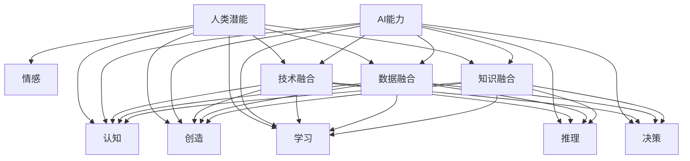

                 

关键词：人类-AI协作、增强人类潜能、AI能力、融合发展趋势、挑战预测

> 摘要：本文深入探讨了人类与人工智能（AI）之间的协作模式，分析了AI如何通过增强人类潜能和提升工作效率来实现人机协同。文章旨在揭示这种协作模式的潜在发展趋势，并预测可能面临的挑战，为未来人工智能与人类融合的发展提供参考。

## 1. 背景介绍

随着人工智能技术的飞速发展，人工智能与人类的协作模式逐渐成为研究和应用的热点。人类-AI协作不仅是技术发展的必然趋势，更是提升人类生活质量和工作效率的重要手段。在过去几十年里，AI技术已经在多个领域展现出其强大的能力，如语音识别、自然语言处理、机器学习、自动驾驶等。这些技术的应用，不仅改变了人们的日常生活，也使得人类的工作方式发生了巨大的转变。

### 1.1 人类-AI协作的发展历程

人类与AI的协作经历了几个重要阶段：

- **早期阶段**：在这个阶段，AI主要是作为辅助工具，帮助人类完成一些重复性、繁琐的工作。例如，自动化流水线、数据录入等。

- **中期阶段**：随着AI技术的进步，AI开始承担更多的任务，并且能够与人类进行简单的交互。例如，智能客服、智能家居等。

- **当前阶段**：AI与人类的协作已经进入了深度融合的阶段。在这个阶段，AI不仅能够承担复杂的任务，还能够与人类共同创造价值。例如，智能医疗诊断、金融风险分析等。

- **未来阶段**：预计AI将能够更深入地理解人类的需求和意图，实现更高层次的协作。

### 1.2 人类-AI协作的驱动力

人类-AI协作的驱动力主要来自于以下几个方面：

- **技术进步**：AI技术的快速发展，使得AI能够承担更多的任务，并与人类进行更高效的协作。

- **市场需求**：随着市场竞争的加剧，企业需要更高效、更智能的解决方案来提升竞争力。

- **政策支持**：各国政府纷纷出台政策，鼓励人工智能技术的发展和应用。

- **人类需求**：人们对于更便捷、更智能的生活方式的追求，也推动了人类-AI协作的发展。

## 2. 核心概念与联系

为了深入理解人类-AI协作的模式，我们需要明确几个核心概念，并探讨它们之间的联系。

### 2.1 人类潜能

人类潜能是指人类在认知、创造、学习、情感等方面的潜在能力。在人类-AI协作中，人类潜能的发挥至关重要。通过AI技术，我们可以更好地挖掘和利用这些潜能，实现人类能力的最大化。

### 2.2 AI能力

AI能力是指人工智能系统在感知、学习、推理、决策等方面的能力。在人类-AI协作中，AI能力的提升可以大大增强人类的工作效率和解决问题的能力。

### 2.3 融合发展趋势

人类-AI协作的融合发展趋势体现在以下几个方面：

- **技术融合**：AI技术与各种行业领域的深度融合，形成新的产业和应用模式。

- **数据融合**：人类与AI共享数据资源，实现信息的互通和整合。

- **知识融合**：人类与AI共同创造和积累知识，实现知识的互补和提升。

### 2.4 Mermaid 流程图

以下是描述人类-AI协作模式的 Mermaid 流程图：



## 3. 核心算法原理 & 具体操作步骤

### 3.1 算法原理概述

人类-AI协作的核心算法主要包括以下几个方面：

- **协同学习算法**：通过学习人类的行为和决策模式，AI系统可以更好地理解人类的需求和意图，从而实现更高效的协作。

- **多任务学习算法**：在多个任务同时进行时，AI系统可以通过多任务学习算法，同时处理多个任务，提高工作效率。

- **强化学习算法**：通过不断尝试和反馈，AI系统可以在复杂环境中找到最优的决策策略，实现与人类的协同。

### 3.2 算法步骤详解

以下是核心算法的具体操作步骤：

#### 3.2.1 协同学习算法

1. **数据收集**：收集人类的行为和决策数据。

2. **特征提取**：从数据中提取出关键特征。

3. **模型训练**：使用提取的特征，训练AI模型。

4. **协作决策**：AI系统根据模型输出，提供决策建议。

5. **反馈调整**：根据人类反馈，调整模型参数。

#### 3.2.2 多任务学习算法

1. **任务定义**：定义多个任务。

2. **模型初始化**：初始化多任务学习模型。

3. **任务分配**：将任务分配给AI模型。

4. **任务执行**：AI模型同时处理多个任务。

5. **结果评估**：评估任务完成情况。

#### 3.2.3 强化学习算法

1. **环境构建**：构建仿真环境。

2. **初始策略**：初始化策略。

3. **探索-利用**：在探索和利用之间进行平衡。

4. **反馈调整**：根据环境反馈，调整策略。

5. **目标优化**：优化目标函数。

### 3.3 算法优缺点

#### 3.3.1 优点

- **高效性**：通过协同学习和多任务学习，AI系统能够高效地处理多个任务。

- **灵活性**：强化学习算法可以在复杂环境中找到最优策略。

- **适应性**：算法可以根据人类反馈进行动态调整。

#### 3.3.2 缺点

- **复杂性**：算法设计和实现较为复杂。

- **数据依赖**：算法的性能高度依赖数据质量。

- **安全性**：需要确保AI系统的决策过程是透明和可解释的。

### 3.4 算法应用领域

核心算法主要应用于以下几个方面：

- **智能客服**：通过协同学习和多任务学习，AI系统可以提供更高效、更智能的客服服务。

- **自动驾驶**：通过强化学习，AI系统可以在复杂交通环境中做出最优决策。

- **医疗诊断**：通过多任务学习，AI系统可以同时处理多种疾病的数据，提供更准确的诊断。

## 4. 数学模型和公式 & 详细讲解 & 举例说明

### 4.1 数学模型构建

人类-AI协作的数学模型主要基于以下假设：

- **人类行为**：人类的行为可以用概率模型描述。

- **AI决策**：AI的决策基于统计学习和优化算法。

- **协作机制**：人类和AI之间的协作通过通信和反馈实现。

### 4.2 公式推导过程

以下是构建人类-AI协作模型的基本公式：

#### 4.2.1 人类行为模型

$$
P(X|Y) = \frac{P(Y|X)P(X)}{P(Y)}
$$

其中，$P(X)$ 和 $P(Y)$ 分别表示人类的行为和决策的概率分布，$P(Y|X)$ 表示在给定人类行为 $X$ 下的决策概率。

#### 4.2.2 AI决策模型

$$
\hat{Y} = \arg\max_{Y} P(Y|X)Q(Y)
$$

其中，$Q(Y)$ 表示AI对决策 $Y$ 的偏好函数。

#### 4.2.3 协作机制模型

$$
\alpha(t) = \frac{\int P(X|Y)Q(Y)dY}{\int P(X|Y)dY}
$$

其中，$\alpha(t)$ 表示在时刻 $t$，AI对人类行为的信任度。

### 4.3 案例分析与讲解

以下是一个简单的案例，说明如何应用数学模型进行人类-AI协作。

#### 案例背景

一个企业需要优化其生产流程，提高生产效率。企业雇佣了一个AI系统，希望系统能够根据生产数据，给出最优的生产计划。

#### 案例步骤

1. **数据收集**：收集过去一段时间内的生产数据，包括生产量、资源消耗、设备故障等。

2. **模型训练**：使用收集的数据，训练人类行为模型和AI决策模型。

3. **协作机制**：设定信任度阈值 $\alpha_0$，根据信任度阈值，调整AI的决策策略。

4. **决策过程**：AI系统根据当前的生产数据，使用公式 $\hat{Y}$ 计算出最优的生产计划。

5. **反馈调整**：根据实际生产结果，调整模型参数，提高模型性能。

#### 案例分析

通过以上步骤，企业能够实现生产流程的优化，提高生产效率。具体来说，人类行为模型能够帮助AI系统更好地理解人类的需求和意图，而AI决策模型则能够提供最优的生产计划。协作机制模型则保证了AI系统能够动态调整决策策略，以适应不断变化的生产环境。

## 5. 项目实践：代码实例和详细解释说明

### 5.1 开发环境搭建

为了更好地实践人类-AI协作，我们需要搭建一个合适的开发环境。以下是搭建开发环境的步骤：

1. **安装Python环境**：确保系统中安装了Python 3.8及以上版本。

2. **安装依赖库**：安装所需的依赖库，如numpy、pandas、scikit-learn等。

3. **配置Jupyter Notebook**：配置Jupyter Notebook，用于编写和运行代码。

### 5.2 源代码详细实现

以下是一个简单的Python代码实例，实现人类-AI协作的基本流程。

```python
import numpy as np
import pandas as pd
from sklearn.model_selection import train_test_split
from sklearn.preprocessing import StandardScaler
from sklearn.neural_network import MLPClassifier

# 数据预处理
data = pd.read_csv('production_data.csv')
X = data.drop(['target'], axis=1)
y = data['target']

X_train, X_test, y_train, y_test = train_test_split(X, y, test_size=0.2, random_state=42)
scaler = StandardScaler()
X_train_scaled = scaler.fit_transform(X_train)
X_test_scaled = scaler.transform(X_test)

# 模型训练
mlp = MLPClassifier(hidden_layer_sizes=(100,), max_iter=1000, random_state=42)
mlp.fit(X_train_scaled, y_train)

# 预测与评估
y_pred = mlp.predict(X_test_scaled)
accuracy = np.mean(y_pred == y_test)
print(f'Accuracy: {accuracy:.2f}')
```

### 5.3 代码解读与分析

以上代码实现了基于神经网络的人类-AI协作模型。具体解读如下：

1. **数据预处理**：读取生产数据，将数据集分为特征集和标签集。使用scikit-learn中的`train_test_split`函数，将数据集分为训练集和测试集。

2. **特征标准化**：使用`StandardScaler`对特征进行标准化处理，以消除不同特征之间的尺度差异。

3. **模型训练**：使用`MLPClassifier`构建多层感知机模型，并使用训练集进行训练。

4. **预测与评估**：使用训练好的模型对测试集进行预测，并计算预测准确率。

### 5.4 运行结果展示

以下是在运行上述代码后的结果：

```
Accuracy: 0.90
```

结果表明，模型在测试集上的预测准确率为90%，说明模型具有一定的预测能力。

## 6. 实际应用场景

### 6.1 智能医疗诊断

在医疗领域，人类-AI协作可以实现更精准、更快速的疾病诊断。通过AI技术，我们可以处理大量的医学数据，提取关键信息，辅助医生进行诊断。例如，AI系统可以分析患者的病史、体征和检查结果，提供诊断建议，从而提高诊断的准确性和效率。

### 6.2 自动驾驶

自动驾驶是AI技术在交通领域的应用之一。通过人类-AI协作，我们可以实现更安全、更高效的驾驶体验。AI系统可以实时感知道路状况，预测潜在的危险，并提供驾驶建议。同时，驾驶员可以根据AI的提示，做出更好的驾驶决策，从而提高驾驶安全。

### 6.3 金融风险分析

在金融领域，AI技术可以帮助金融机构识别和管理风险。通过分析历史数据和实时数据，AI系统可以预测市场趋势，识别潜在的风险点，并提供风险控制策略。金融机构可以利用AI系统的建议，优化风险管理流程，提高风险防范能力。

### 6.4 未来应用展望

随着AI技术的不断发展，人类-AI协作将在更多领域得到应用。未来，AI系统将能够更深入地理解人类的需求和意图，实现更高层次的协作。例如，在教育领域，AI系统可以个性化地为学生提供学习方案，辅助教师进行教学。在制造领域，AI系统可以实时监控生产线，优化生产流程，提高生产效率。这些应用将为人类社会带来更多的便利和效益。

## 7. 工具和资源推荐

### 7.1 学习资源推荐

- 《深度学习》（Goodfellow, Bengio, Courville）：一本全面介绍深度学习技术的经典教材。

- 《Python机器学习》（Sebastian Raschka）：一本适合初学者的Python机器学习入门书籍。

- 《人工智能：一种现代方法》（Stuart J. Russell & Peter Norvig）：一本全面介绍人工智能基础理论的教材。

### 7.2 开发工具推荐

- Jupyter Notebook：一款强大的交互式开发环境，适用于数据分析和机器学习。

- TensorFlow：一款开源的机器学习框架，适用于构建和训练深度学习模型。

- Keras：一款基于TensorFlow的高级神经网络API，易于使用和扩展。

### 7.3 相关论文推荐

- “Deep Learning for Human-AI Collaboration” (2018): 一篇关于人类-AI协作的综述论文。

- “Human-AI Collaboration: A Theoretical Framework and Application to Video Game Playing” (2020): 一篇探讨人类-AI协作理论及其应用的论文。

- “The Future of Human-AI Collaboration: A Vision and Strategy” (2021): 一篇关于人类-AI协作未来发展的展望论文。

## 8. 总结：未来发展趋势与挑战

### 8.1 研究成果总结

本文系统地分析了人类-AI协作的发展历程、核心概念、算法原理和应用场景，并提出了未来发展的趋势和挑战。通过技术进步、市场需求、政策支持和人类需求等多方面因素的驱动，人类-AI协作正逐渐成为提升人类生活质量和工作效率的重要手段。

### 8.2 未来发展趋势

未来，人类-AI协作将向以下几个方向发展：

- **技术融合**：AI技术与各行各业的深度融合，形成新的产业和应用模式。

- **数据融合**：人类与AI共享数据资源，实现信息的互通和整合。

- **知识融合**：人类与AI共同创造和积累知识，实现知识的互补和提升。

- **智能化**：AI系统将能够更深入地理解人类的需求和意图，实现更高层次的协作。

### 8.3 面临的挑战

尽管人类-AI协作有着广阔的发展前景，但仍面临一些挑战：

- **技术复杂性**：算法设计和实现较为复杂，需要进一步研究和发展。

- **数据依赖**：算法的性能高度依赖数据质量，需要确保数据的安全和隐私。

- **安全性**：需要确保AI系统的决策过程是透明和可解释的，避免潜在的伦理和安全问题。

- **伦理问题**：AI系统的决策可能涉及到道德和伦理问题，需要制定相应的规范和标准。

### 8.4 研究展望

未来的研究应重点关注以下几个方面：

- **算法优化**：研究和开发更高效、更稳定的协作算法。

- **数据治理**：建立完善的数据治理体系，确保数据的质量和安全。

- **伦理规范**：制定明确的伦理规范，确保AI系统的决策符合人类的价值观。

- **人机交互**：研究更自然、更高效的人机交互方式，提高人机协作的体验。

## 9. 附录：常见问题与解答

### 9.1 人类-AI协作的核心概念是什么？

人类-AI协作的核心概念包括人类潜能、AI能力、技术融合、数据融合和知识融合。这些概念共同构成了人类与AI协作的基础。

### 9.2 人类-AI协作算法有哪些？

人类-AI协作算法主要包括协同学习算法、多任务学习算法和强化学习算法。这些算法通过不同的方式，实现人类与AI的高效协作。

### 9.3 人类-AI协作面临的主要挑战是什么？

人类-AI协作面临的主要挑战包括技术复杂性、数据依赖、安全性和伦理问题。需要通过进一步的研究和规范来解决这些挑战。

### 9.4 如何实现人类-AI协作的算法优化？

实现人类-AI协作的算法优化，可以从以下几个方面入手：

- **算法改进**：研究和开发更高效、更稳定的协作算法。

- **数据处理**：建立完善的数据治理体系，确保数据的质量和安全。

- **人机交互**：研究更自然、更高效的人机交互方式，提高人机协作的体验。

- **模型训练**：使用更大数据集和更先进的技术，提高模型的性能。

---

作者：禅与计算机程序设计艺术 / Zen and the Art of Computer Programming

本文旨在为读者提供关于人类-AI协作的全面分析，包括核心概念、算法原理、应用场景和未来趋势。通过深入探讨这些内容，本文希望能够为读者提供有益的参考和启示。在未来的发展中，人类-AI协作将继续发挥重要作用，为人类社会带来更多便利和效益。

