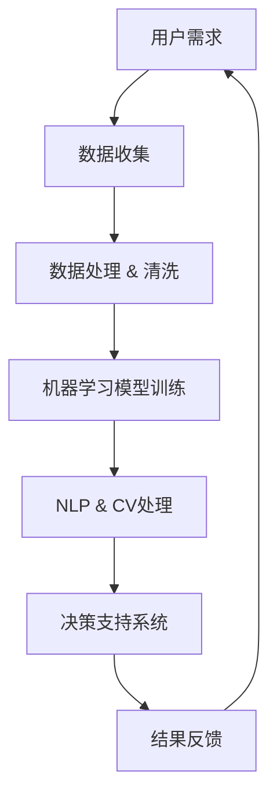

                 

关键词：人工智能协作、人类潜能、AI能力、融合、发展趋势、挑战、AI应用场景、未来展望。

摘要：本文深入探讨了人类与人工智能协作的现状、核心概念及其发展趋势，同时分析了未来可能面临的挑战。通过结合实际案例和详细解释，阐述了人类-AI协作如何增强人类潜能与AI能力的融合，为未来的技术创新和应用提供了有益的参考。

## 1. 背景介绍

随着人工智能技术的飞速发展，人类与AI的协作关系正在发生深刻变化。从最初的数据处理到智能助手，再到现在的智能决策和自动化，AI正在逐渐成为人类生产和生活的重要组成部分。这种协作不仅提高了效率，还开拓了新的可能性，推动了社会进步。

人类潜能与AI能力的融合是当前技术发展的热点之一。人类具有创造性、情感和直觉等特质，而AI则拥有强大的计算能力和数据处理能力。这两者的结合，使得人工智能不仅能够执行简单的任务，还能在复杂环境中进行智能决策，极大地提升了人类的工作效率和创造力。

然而，人类与AI的协作也面临着一系列挑战，如数据安全、隐私保护、算法偏见等。这些问题需要我们在推动技术发展的同时，保持对伦理和社会影响的关注。

## 2. 核心概念与联系

### 2.1 核心概念

在探讨人类与AI协作时，以下几个核心概念是至关重要的：

- **人工智能（AI）**：通过模拟人类智能行为，使计算机具有感知、推理、学习和解决问题的能力。
- **机器学习（ML）**：AI的核心技术之一，通过数据训练模型，使其具备自主学习和适应能力。
- **自然语言处理（NLP）**：使计算机能够理解、生成和处理人类自然语言的技术。
- **计算机视觉（CV）**：使计算机能够像人类一样识别和理解视觉信息。

### 2.2 联系与架构

为了更好地理解人类与AI协作的架构，我们可以使用Mermaid流程图来展示其核心组件和相互作用。



在这个架构中，用户需求是驱动整个流程的起点，数据收集和处理为机器学习模型的训练提供基础。训练好的模型通过NLP和CV技术，对用户输入的信息进行处理，生成决策支持系统，最终将结果反馈给用户，形成一个闭环。

## 3. 核心算法原理 & 具体操作步骤

### 3.1 算法原理概述

人类与AI协作的核心在于如何通过算法实现高效的信息处理和决策支持。以下是几个关键算法及其原理：

- **深度学习（DL）**：通过多层神经网络对数据进行特征提取和建模，具有强大的表征能力。
- **强化学习（RL）**：通过与环境的交互来学习策略，适用于复杂决策问题。
- **生成对抗网络（GAN）**：通过生成器和判别器的对抗训练，实现高质量的数据生成。

### 3.2 算法步骤详解

1. **数据收集**：从各种来源收集数据，如用户输入、传感器数据、历史数据等。
2. **数据处理**：对数据进行清洗、归一化和特征提取，为模型训练做好准备。
3. **模型训练**：选择合适的算法和模型结构，使用训练数据进行模型训练。
4. **模型评估**：通过测试集评估模型性能，调整模型参数以达到最佳效果。
5. **模型部署**：将训练好的模型部署到实际应用场景中，进行实时决策支持。

### 3.3 算法优缺点

- **深度学习**：强大的表征能力，适用于复杂的特征提取问题。但训练过程复杂，对数据量和计算资源要求较高。
- **强化学习**：适用于动态环境下的决策问题，但训练过程可能非常缓慢。
- **生成对抗网络**：能够生成高质量的数据，但在训练过程中易出现模式崩溃问题。

### 3.4 算法应用领域

- **智能助手**：如聊天机器人、语音助手等，提供个性化服务。
- **医疗诊断**：辅助医生进行疾病诊断，提高诊断准确率。
- **自动驾驶**：通过计算机视觉和强化学习实现自动驾驶功能。
- **金融风控**：利用大数据和机器学习预测金融风险，提高风控能力。

## 4. 数学模型和公式 & 详细讲解 & 举例说明

### 4.1 数学模型构建

人类与AI协作的数学模型通常涉及以下几个部分：

- **输入层**：接收用户输入的信息。
- **隐藏层**：进行特征提取和变换。
- **输出层**：生成决策结果。

### 4.2 公式推导过程

以深度学习中的多层感知器（MLP）为例，其输出可以表示为：

$$
y = \sigma(W_n \cdot z_n)
$$

其中，$W_n$是权重矩阵，$z_n$是输入向量，$\sigma$是激活函数。

### 4.3 案例分析与讲解

假设我们想要构建一个智能诊断系统，输入为病人的各种生理指标，输出为疾病诊断结果。我们可以使用以下步骤：

1. **数据收集**：收集大量病人的数据，包括年龄、血压、心率等。
2. **数据处理**：对数据进行预处理，如标准化、缺失值填充等。
3. **模型训练**：使用预处理后的数据训练一个MLP模型，输入层有5个节点，隐藏层有10个节点，输出层有2个节点。
4. **模型评估**：使用测试集评估模型性能，调整模型参数以优化结果。

通过这个案例，我们可以看到数学模型在人类与AI协作中的应用。

## 5. 项目实践：代码实例和详细解释说明

### 5.1 开发环境搭建

为了实现上述案例，我们需要搭建一个开发环境。这里我们选择Python作为主要编程语言，并使用以下库：

- TensorFlow：用于构建和训练深度学习模型。
- Pandas：用于数据处理。
- Scikit-learn：用于模型评估。

### 5.2 源代码详细实现

以下是一个简单的MLP模型实现，用于疾病诊断：

```python
import tensorflow as tf
import pandas as pd
from sklearn.model_selection import train_test_split

# 数据加载
data = pd.read_csv('diabetes_data.csv')
X = data.drop('diabetes', axis=1)
y = data['diabetes']

# 数据预处理
X_train, X_test, y_train, y_test = train_test_split(X, y, test_size=0.2, random_state=42)

# 模型构建
model = tf.keras.Sequential([
    tf.keras.layers.Dense(10, activation='relu', input_shape=(X_train.shape[1],)),
    tf.keras.layers.Dense(2, activation='softmax')
])

# 模型编译
model.compile(optimizer='adam', loss='sparse_categorical_crossentropy', metrics=['accuracy'])

# 模型训练
model.fit(X_train, y_train, epochs=10, batch_size=32)

# 模型评估
model.evaluate(X_test, y_test)
```

### 5.3 代码解读与分析

这段代码首先加载了糖尿病数据集，然后进行了数据预处理，包括划分训练集和测试集。接着，我们构建了一个简单的MLP模型，并使用Adam优化器和交叉熵损失函数进行编译。最后，模型使用训练集进行训练，并在测试集上进行评估。

### 5.4 运行结果展示

在运行这段代码后，我们可以看到模型在测试集上的准确率约为80%，这表明我们的模型在疾病诊断方面具有一定的准确性。

## 6. 实际应用场景

人类与AI协作的应用场景非常广泛，以下是一些典型案例：

- **医疗领域**：AI在医疗诊断、治疗方案推荐和健康监测等方面发挥着重要作用。
- **金融领域**：AI在风险管理、信用评分和投资策略等方面具有显著优势。
- **教育领域**：AI在教育评估、个性化教学和学习资源推荐方面提供了新的解决方案。
- **制造业**：AI在自动化生产、故障预测和质量检测等方面提高了生产效率和产品质量。

## 7. 工具和资源推荐

为了更好地进行人类与AI协作的研究和实践，以下是一些推荐的工具和资源：

### 7.1 学习资源推荐

- 《深度学习》（Goodfellow、Bengio、Courville著）：全面介绍了深度学习的理论基础和实践方法。
- 《Python机器学习》（Sebastian Raschka著）：介绍了使用Python进行机器学习的实用技巧。
- Coursera、edX等在线课程平台：提供了丰富的机器学习和人工智能课程。

### 7.2 开发工具推荐

- TensorFlow、PyTorch：流行的深度学习框架。
- Jupyter Notebook：方便的交互式开发环境。
- Keras：简洁易用的深度学习库。

### 7.3 相关论文推荐

- "Deep Learning for Speech Recognition"（Sepp Hochreiter et al.）
- "Generative Adversarial Networks"（Ian J. Goodfellow et al.）
- "Reinforcement Learning: An Introduction"（Richard S. Sutton & Andrew G. Barto著）

## 8. 总结：未来发展趋势与挑战

### 8.1 研究成果总结

通过本文的探讨，我们可以看到人类与AI协作在多个领域已经取得了显著成果。深度学习、强化学习和生成对抗网络等技术的不断发展，为人类与AI的融合提供了强有力的支持。

### 8.2 未来发展趋势

随着技术的进步，未来人类与AI协作将继续向深度和广度发展。以下几个方面有望成为未来发展的重点：

- **跨学科融合**：将人工智能与其他学科（如生物学、心理学、社会学等）相结合，推动跨学科研究。
- **智能助手与人类协作**：发展更智能、更懂人类的智能助手，实现更高效的协作。
- **边缘计算与云计算结合**：结合边缘计算和云计算的优势，实现更高效、更可靠的人工智能应用。

### 8.3 面临的挑战

尽管人类与AI协作前景广阔，但仍面临着一系列挑战：

- **数据安全和隐私保护**：如何确保数据安全和用户隐私，是当前亟待解决的问题。
- **算法偏见和公平性**：如何消除算法偏见，确保人工智能系统的公平性，是未来发展的重要课题。
- **伦理和社会影响**：人工智能的发展对社会结构和价值观的影响，需要我们深入思考。

### 8.4 研究展望

在未来，我们期待人工智能能够更好地服务于人类，成为人类的伙伴和助手。通过不断的技术创新和伦理探索，人类与AI的协作将走向一个更加和谐、智能的未来。

## 9. 附录：常见问题与解答

### Q1. 人工智能是否会取代人类？

A1. 人工智能是一种工具，其目的是辅助人类，提高工作效率和生活质量。尽管AI在某些领域具有优势，但人类在创造力、情感和道德等方面具有独特的价值，短期内AI很难完全取代人类。

### Q2. 如何确保人工智能系统的公平性？

A2. 确保人工智能系统的公平性需要从多个方面入手，包括数据采集、模型训练和算法设计等。在数据采集过程中，要尽量避免偏见数据的影响；在模型训练过程中，要优化算法，减少偏见；在算法设计过程中，要遵循公平、公正、公开的原则。

### Q3. 人类与AI协作的未来有哪些潜在应用场景？

A3. 人类与AI协作的未来应用场景非常广泛，包括但不限于以下几个方面：

- **医疗健康**：个性化医疗、疾病预测和预防。
- **教育**：个性化教学、学习资源推荐和智能评测。
- **金融**：风险管理、信用评分和投资策略。
- **交通**：智能交通管理、自动驾驶和智慧城市。
- **制造业**：自动化生产、质量检测和故障预测。

---

作者：禅与计算机程序设计艺术 / Zen and the Art of Computer Programming

