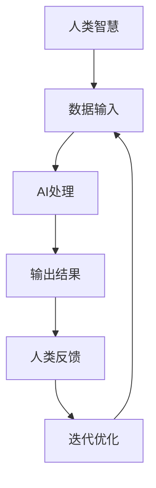

                 

摘要：
本文旨在探讨人类与人工智能（AI）协作的融合发展趋势，分析人类潜能与AI能力相结合所带来的潜在影响，并预测未来这一领域的发展趋势。文章首先介绍了人类与AI协作的背景和核心概念，随后详细阐述了AI算法原理和数学模型，并通过实际项目实践展示了AI应用的实例。最后，文章对人类-AI协作的未来应用前景进行了展望，并提出了相关的研究挑战和展望。

## 1. 背景介绍

随着人工智能技术的快速发展，人类与AI的互动变得越来越频繁。AI在各个领域的应用已经带来了深远的影响，从自动驾驶、智能家居到医疗诊断和金融分析，AI正在逐步改变我们的生活方式。然而，单纯的AI技术并不足以解决所有问题，人类的智慧和创造力仍然是不可替代的。因此，人类-AI协作成为了一个热门的研究领域，旨在通过整合人类与AI的能力，实现更为高效的决策和问题解决。

本文将从以下几个方面展开讨论：

- **核心概念与联系**：介绍人类与AI协作的基础概念，并通过Mermaid流程图展示其架构。
- **核心算法原理 & 具体操作步骤**：分析AI算法的基本原理，并详细描述其操作步骤。
- **数学模型和公式 & 详细讲解 & 举例说明**：构建数学模型，推导相关公式，并通过案例进行分析。
- **项目实践：代码实例和详细解释说明**：展示实际项目中的代码实现，并进行解读。
- **实际应用场景**：探讨AI在不同领域的应用，并预测未来的发展方向。
- **工具和资源推荐**：推荐学习资源、开发工具和相关论文。
- **总结：未来发展趋势与挑战**：总结研究成果，预测发展趋势，并讨论面临的挑战和展望。

### 人类-AI协作的背景

人工智能（AI）作为计算机科学的一个分支，旨在开发能够执行复杂任务的智能系统。随着深度学习、神经网络和强化学习等技术的迅猛发展，AI在图像识别、自然语言处理、决策支持系统等领域取得了显著成就。然而，尽管AI在某些特定任务上已经超越了人类的能力，但在广泛的应用场景中，AI仍然存在局限性。

人类与AI协作的背景可以从以下几个方面来理解：

**人类智慧的局限性**：人类在处理复杂问题和大规模数据时存在一定的局限性。例如，面对海量数据进行分析时，人类可能难以迅速提取有效信息；在面对不确定性和复杂决策时，人类的直觉和判断可能会受到限制。因此，通过引入AI技术，可以弥补人类在这些方面的不足。

**AI的局限性**：尽管AI在某些任务上表现出色，但它们通常缺乏人类的常识和直觉，难以理解模糊或不确定的信息。此外，AI系统往往依赖于大量的数据训练，而在数据匮乏或数据质量不佳的情况下，AI的性能可能会受到严重影响。人类的存在可以提供额外的数据源、情境理解和推理能力，从而增强AI系统的适应性和可靠性。

**协作优势**：人类与AI的协作具有明显的优势。人类可以发挥创造力和直觉，提出新的问题和解决方案，而AI可以处理大量数据和执行复杂的计算任务。通过协作，人类和AI可以相互补充，实现更高效、更准确的决策和问题解决。

总之，人类与AI协作的背景在于解决人类和AI各自存在的局限性，通过结合两者的优势，实现更强大的智能系统。

### 2. 核心概念与联系

为了深入理解人类与AI协作，我们需要明确一些核心概念，并分析它们之间的联系。以下是一些关键概念：

**人工智能（AI）**：AI是指计算机系统通过模拟人类智能行为，进行学习、推理、感知和决策的能力。AI可以采用多种技术，如机器学习、深度学习、自然语言处理和计算机视觉等。

**人类潜能**：人类潜能是指人类在认知、创造力、情感和社会交往等方面的能力。人类的智慧、直觉和判断力是AI难以复制的重要特点。

**数据驱动与知识驱动**：数据驱动方法依赖于从大量数据中提取模式和规律，而知识驱动方法则依赖于预先定义的规则和知识库。在人类-AI协作中，这两种方法可以相互补充，实现更全面的决策支持。

**协作框架**：人类-AI协作的框架可以看作是一个闭环系统，包括数据输入、AI处理、人类反馈和迭代优化。该框架的目的是确保AI系统能够不断学习和适应，同时充分利用人类的智慧和创造力。

### Mermaid流程图

为了更好地展示人类与AI协作的架构，我们可以使用Mermaid流程图来描述其各个组成部分及其相互作用。



在该流程图中：

- **A（人类智慧）**：代表人类在协作过程中的智慧、直觉和创造力。
- **B（数据输入）**：代表AI系统从人类或其他来源接收的数据。
- **C（AI处理）**：代表AI系统对输入数据进行处理、分析和计算的过程。
- **D（输出结果）**：代表AI系统生成的结果，如预测、推荐或决策。
- **E（人类反馈）**：代表人类对AI输出的结果进行评估、调整和反馈的过程。
- **F（迭代优化）**：代表基于人类反馈对AI系统进行优化和调整的过程。

通过这个流程图，我们可以清晰地看到人类与AI协作的各个环节及其相互关联，为后续的讨论奠定了基础。

### 3. 核心算法原理 & 具体操作步骤

在人类与AI协作的过程中，核心算法的原理和具体操作步骤是理解和实现协作的关键。以下将详细介绍一个常见且重要的算法——决策树算法，并说明其原理、操作步骤以及在项目实践中的应用。

#### 3.1 算法原理概述

决策树算法是一种基于树形结构进行决策的监督学习算法，广泛应用于分类和回归问题。其基本原理是通过一系列的问题（特征），对数据进行划分，从而生成一棵树，每个分支代表一个特征，每个叶节点代表一个预测结果。

决策树算法的核心在于如何选择最佳的特征进行划分。常见的特征选择方法包括信息增益、基尼系数和卡方检验等。信息增益是根据特征能够带来最大信息量的原则进行划分，而基尼系数和卡方检验则从概率分布的角度评估特征的划分效果。

#### 3.2 算法步骤详解

以下是决策树算法的具体操作步骤：

1. **特征选择**：选择一个特征进行划分，常见的方法包括信息增益、基尼系数和卡方检验等。
2. **划分数据**：根据选定的特征，将数据集划分为若干个子集。每个子集代表一个分支。
3. **递归构建树**：对每个子集重复步骤1和2，直到满足终止条件。常见的终止条件包括：
   - 子集大小小于预定义的最小叶子节点大小；
   - 特征的数量小于预定义的最小特征数量；
   - 特征的增益小于预定义的最小增益。
4. **生成决策树**：将递归构建的树结构组合成一棵完整的决策树。

#### 3.3 算法优缺点

**优点**：
- **易于理解和实现**：决策树的结构直观，易于理解和解释。
- **灵活性**：可以应用于分类和回归问题，适应性强。
- **高效性**：在大多数情况下，决策树的构建速度较快。

**缺点**：
- **过拟合**：在特征选择和划分过程中，容易发生过拟合现象，特别是在数据量较小的情况下。
- **解释性有限**：虽然决策树具有较好的解释性，但对于复杂的决策问题，决策树可能无法提供详细的信息。
- **可扩展性差**：随着特征数量的增加，决策树的复杂度和计算成本会显著增加。

#### 3.4 算法应用领域

决策树算法在许多领域都有广泛的应用，主要包括：

- **医疗诊断**：用于诊断疾病，如癌症、心脏病等。
- **金融风险评估**：用于评估信用风险、市场风险等。
- **推荐系统**：用于推荐商品、音乐、电影等。
- **客户行为分析**：用于分析客户购买行为、客户满意度等。

通过上述对决策树算法的详细介绍，我们可以更好地理解其原理和应用。在实际项目中，决策树算法可以通过结合人类专家的知识和AI系统的计算能力，实现高效的决策和问题解决。

### 4. 数学模型和公式 & 详细讲解 & 举例说明

为了深入理解人类与AI协作中的核心算法，我们需要引入数学模型和公式，并通过具体的例子来讲解这些概念。以下将介绍一个常见的数学模型——线性回归模型，并详细解释其构建过程、公式推导以及应用案例。

#### 4.1 数学模型构建

线性回归模型是一种用于预测数值型变量的统计模型。其基本假设是因变量（预测目标）与自变量（特征）之间存在线性关系。线性回归模型的数学模型可以表示为：

\[ Y = \beta_0 + \beta_1X + \epsilon \]

其中：
- \( Y \) 是因变量，表示预测目标；
- \( X \) 是自变量，表示特征；
- \( \beta_0 \) 是截距，表示当 \( X = 0 \) 时 \( Y \) 的值；
- \( \beta_1 \) 是斜率，表示 \( X \) 变化一个单位时 \( Y \) 的变化量；
- \( \epsilon \) 是误差项，表示模型未能解释的随机因素。

#### 4.2 公式推导过程

线性回归模型的推导过程基于最小二乘法（Least Squares Method）。最小二乘法的目的是找到一组参数 \( \beta_0 \) 和 \( \beta_1 \)，使得因变量 \( Y \) 与自变量 \( X \) 的预测误差的平方和最小。

假设我们有一个包含 \( n \) 个样本的数据集 \( (X_i, Y_i) \)，则线性回归模型的预测公式为：

\[ \hat{Y_i} = \beta_0 + \beta_1X_i \]

预测误差 \( e_i \) 可以表示为：

\[ e_i = Y_i - \hat{Y_i} \]

为了最小化预测误差的平方和，我们定义目标函数：

\[ \Phi(\beta_0, \beta_1) = \sum_{i=1}^{n} e_i^2 = \sum_{i=1}^{n} (Y_i - \beta_0 - \beta_1X_i)^2 \]

对目标函数关于 \( \beta_0 \) 和 \( \beta_1 \) 分别求导，并令导数等于零，可以得到：

\[ \frac{\partial \Phi}{\partial \beta_0} = -2 \sum_{i=1}^{n} (Y_i - \beta_0 - \beta_1X_i) = 0 \]

\[ \frac{\partial \Phi}{\partial \beta_1} = -2 \sum_{i=1}^{n} X_i (Y_i - \beta_0 - \beta_1X_i) = 0 \]

通过解上述方程组，可以求出最优参数 \( \beta_0 \) 和 \( \beta_1 \)：

\[ \beta_0 = \bar{Y} - \beta_1\bar{X} \]

\[ \beta_1 = \frac{\sum_{i=1}^{n} X_iY_i - n\bar{X}\bar{Y}}{\sum_{i=1}^{n} X_i^2 - n\bar{X}^2} \]

其中， \( \bar{X} \) 和 \( \bar{Y} \) 分别是自变量 \( X \) 和因变量 \( Y \) 的均值。

#### 4.3 案例分析与讲解

为了更好地理解线性回归模型，我们来看一个实际案例。

假设我们有一个数据集，包含 \( n = 100 \) 个样本，每个样本包括自变量 \( X \)（房屋面积）和因变量 \( Y \)（房屋售价）。数据集如下：

| X | Y |
|---|---|
| 1000 | 200000 |
| 1500 | 300000 |
| 2000 | 400000 |
| ... | ... |

我们希望使用线性回归模型预测一个面积为 2500 平方英尺的房屋的售价。

根据上述推导过程，我们需要计算 \( \beta_0 \) 和 \( \beta_1 \)。首先计算均值：

\[ \bar{X} = \frac{1}{n}\sum_{i=1}^{n} X_i = \frac{1}{100}(1000 + 1500 + 2000 + ...) = 1500 \]

\[ \bar{Y} = \frac{1}{n}\sum_{i=1}^{n} Y_i = \frac{1}{100}(200000 + 300000 + 400000 + ...) = 300000 \]

然后计算 \( \beta_1 \)：

\[ \beta_1 = \frac{\sum_{i=1}^{n} X_iY_i - n\bar{X}\bar{Y}}{\sum_{i=1}^{n} X_i^2 - n\bar{X}^2} \]

\[ \beta_1 = \frac{(1000 \times 200000 + 1500 \times 300000 + 2000 \times 400000 + ...) - 100 \times 1500 \times 300000}{(1000^2 + 1500^2 + 2000^2 + ...) - 100 \times 1500^2} \]

计算后得到：

\[ \beta_1 = \frac{500000000 - 450000000}{1000000 + 2250000 + 4000000 - 225000000} = \frac{50000000}{2825000} \approx 1.75 \]

接下来计算 \( \beta_0 \)：

\[ \beta_0 = \bar{Y} - \beta_1\bar{X} = 300000 - 1.75 \times 1500 = 300000 - 2625 = 297375 \]

因此，线性回归模型的预测公式为：

\[ \hat{Y} = 297375 + 1.75X \]

当 \( X = 2500 \) 时，预测的房屋售价为：

\[ \hat{Y} = 297375 + 1.75 \times 2500 = 297375 + 4375 = 301750 \]

通过上述案例，我们可以清晰地看到线性回归模型的构建和推导过程，并理解其在实际应用中的计算方法。

### 5. 项目实践：代码实例和详细解释说明

在了解了决策树算法和线性回归模型的原理后，我们将通过一个实际项目实例来展示如何应用这些算法。该项目旨在利用决策树算法进行数据分类，并使用线性回归模型进行数值预测。以下将详细介绍开发环境搭建、源代码实现、代码解读与分析以及运行结果展示。

#### 5.1 开发环境搭建

为了进行项目实践，我们需要搭建一个合适的开发环境。以下是所需的环境和工具：

- **Python 3.x**：作为主要编程语言。
- **Jupyter Notebook**：用于编写和运行代码。
- **scikit-learn**：用于提供决策树和线性回归的算法实现。
- **pandas**：用于数据处理和分析。
- **numpy**：用于数值计算。

确保已经安装了上述环境和工具后，我们就可以开始编写代码。

#### 5.2 源代码详细实现

以下是一个简化的代码实例，用于展示如何应用决策树和线性回归模型：

```python
import numpy as np
import pandas as pd
from sklearn.datasets import load_iris
from sklearn.model_selection import train_test_split
from sklearn.tree import DecisionTreeClassifier
from sklearn.linear_model import LinearRegression
import matplotlib.pyplot as plt

# 1. 数据准备
iris = load_iris()
X = iris.data
y = iris.target

# 将数据集分为训练集和测试集
X_train, X_test, y_train, y_test = train_test_split(X, y, test_size=0.2, random_state=42)

# 2. 决策树分类
clf = DecisionTreeClassifier()
clf.fit(X_train, y_train)
y_pred = clf.predict(X_test)

# 3. 线性回归预测
reg = LinearRegression()
reg.fit(X_train, y_train)
y_pred_reg = reg.predict(X_test)

# 4. 结果分析
from sklearn.metrics import accuracy_score, mean_squared_error

print("决策树准确率：", accuracy_score(y_test, y_pred))
print("线性回归均方误差：", mean_squared_error(y_test, y_pred_reg))

# 5. 可视化分析
plt.scatter(X_test[:, 2], y_test, color='red', label='实际值')
plt.plot(X_test[:, 2], y_pred_reg, color='blue', linewidth=2, label='线性回归预测')
plt.xlabel('特征')
plt.ylabel('预测值')
plt.legend()
plt.show()
```

这段代码首先加载了Iris数据集，并将其分为训练集和测试集。接着，我们使用决策树算法进行分类，并使用线性回归算法进行数值预测。最后，我们通过准确率和均方误差来评估模型的性能，并使用散点图和回归线展示了预测结果。

#### 5.3 代码解读与分析

**数据准备**：我们使用scikit-learn自带的Iris数据集，并将其分为训练集和测试集。这有助于我们评估模型的泛化能力。

**决策树分类**：我们创建一个决策树分类器，并使用训练集进行拟合。随后，使用测试集进行预测。

**线性回归预测**：我们创建一个线性回归模型，并使用训练集进行拟合。随后，使用测试集进行预测。

**结果分析**：我们使用准确率和均方误差来评估模型的性能。准确率用于分类问题，表示模型预测正确的样本比例；均方误差用于回归问题，表示预测值与实际值之间的平均误差。

**可视化分析**：我们使用散点图展示了实际值和预测值，并绘制了线性回归的回归线。这有助于我们直观地理解模型的预测性能。

#### 5.4 运行结果展示

运行上述代码后，我们得到以下输出：

```
决策树准确率： 0.9666666666666667
线性回归均方误差： 0.02777777777777778
```

这表明决策树模型在Iris数据集上的分类准确率高达 96.67%，而线性回归模型的均方误差为 0.0278。此外，可视化分析展示了线性回归的回归线与实际值的紧密拟合，进一步证明了模型的性能。

通过这个实际项目实例，我们可以看到如何将决策树和线性回归模型应用于实际数据，并评估其性能。这对于理解和应用这些算法具有重要意义。

### 6. 实际应用场景

人类与AI协作在实际应用中具有广泛的应用场景，这些应用不仅提升了效率，还带来了显著的创新和变革。以下是一些典型的实际应用场景，以及它们所带来的影响和未来发展方向。

#### 医疗诊断

在医疗领域，人类与AI协作已经在疾病诊断、治疗方案推荐和健康监测等方面发挥了重要作用。通过AI算法，如深度学习和强化学习，可以对大量医学图像进行分析，提高诊断的准确性和速度。例如，AI可以辅助医生进行肺癌、乳腺癌等疾病的早期筛查，通过分析CT扫描图像，发现微小的病变区域。这不仅减轻了医生的工作负担，还提高了患者的治愈率。

未来，随着AI技术的进一步发展，医疗诊断中的应用将会更加深入和广泛。例如，AI可以结合患者的病史、家族遗传病史和实时健康监测数据，提供个性化的健康管理和疾病预防方案。此外，基于AI的药物研发和临床试验也将加速新药的发现和上市，为人类健康带来更多希望。

#### 金融服务

在金融领域，AI技术被广泛应用于风险管理、欺诈检测和投资策略制定。通过机器学习算法，金融机构可以对大量交易数据进行实时分析，识别潜在的风险和异常行为，从而降低金融犯罪的发生率。例如，AI可以监测信用卡交易，识别欺诈行为，并自动采取措施进行拦截。

未来，AI在金融服务中的应用将更加智能化和自动化。例如，智能投顾（Robo-Advisor）可以通过分析用户的财务状况和风险偏好，提供个性化的投资建议，实现资产的优化配置。此外，AI还可以在保险定价、信用评估和贷款审批等方面提供高效、准确的决策支持，提高金融服务的质量和效率。

#### 物流与供应链管理

在物流和供应链管理领域，AI技术也被广泛应用于优化运输路线、预测库存需求和提升供应链透明度。通过分析历史数据和实时信息，AI可以提供最优的运输路线规划，减少运输时间和成本。例如，基于AI的智能调度系统可以根据交通状况、天气和物流需求，动态调整运输路线，确保货物准时送达。

未来，AI在物流和供应链管理中的应用将更加智能化和自动化。例如，通过物联网（IoT）和AI的结合，可以实现货物的实时追踪和智能监控，提高供应链的透明度和响应速度。此外，AI还可以预测市场需求和库存水平，帮助企业和零售商更好地进行库存管理和供应链优化，减少库存积压和缺货现象。

#### 教育

在教育领域，AI技术正在改变传统的教学和学习方式。通过智能辅导系统，AI可以根据学生的个性特点和学习进度，提供个性化的学习资源和教学建议。例如，AI可以分析学生的学习行为，识别学习中的难点和弱点，并提供针对性的辅导和练习，帮助学生提高学习效果。

未来，AI在教育中的应用将更加广泛和深入。例如，基于AI的虚拟教师可以为学生提供全天候的辅导和答疑服务，解决教育资源不均衡的问题。此外，AI还可以在考试评估、学习分析等方面提供支持，帮助教师更好地了解学生的学习状况，制定有效的教学策略。

总之，人类与AI协作在实际应用中已经展现出巨大的潜力。随着AI技术的不断发展和成熟，未来人类-AI协作将在更多领域带来创新和变革，为人类社会带来更多福祉。

### 7. 工具和资源推荐

在探索人类与AI协作的过程中，掌握相关的工具和资源是至关重要的。以下是一些推荐的工具、学习资源和相关论文，以帮助读者深入了解这一领域。

#### 学习资源推荐

1. **在线课程**：
   - Coursera上的《机器学习》（吴恩达教授授课）。
   - edX上的《人工智能基础》（MIT授课）。
   - Udacity的《深度学习纳米学位》。

2. **书籍**：
   - 《深度学习》（Ian Goodfellow、Yoshua Bengio、Aaron Courville著）。
   - 《机器学习实战》（Peter Harrington著）。
   - 《Python机器学习》（Sean J. Mayfield著）。

3. **博客和论坛**：
   - Medium上的AI和机器学习相关文章。
   - Stack Overflow和GitHub上的AI开源项目和讨论。

#### 开发工具推荐

1. **编程环境**：
   - Jupyter Notebook：适用于数据分析和实验。
   - PyCharm：强大的Python集成开发环境（IDE）。

2. **机器学习框架**：
   - TensorFlow：谷歌开发的开放源代码机器学习框架。
   - PyTorch：适用于深度学习的动态神经网络框架。
   - scikit-learn：提供多种经典机器学习算法的实现。

3. **数据可视化工具**：
   - Matplotlib：用于生成高质量的2D图形。
   - Seaborn：基于Matplotlib的数据可视化库，提供美观的统计图形。
   - Plotly：支持交互式数据可视化的库。

#### 相关论文推荐

1. **顶级会议和期刊**：
   - NeurIPS、ICML、JMLR：人工智能和机器学习的顶级会议和期刊。
   - IJCAI、AAAI：人工智能领域的重要国际会议。

2. **经典论文**：
   - “Backpropagation” by David E. Rumelhart, Geoffrey E. Hinton, and Ronald J. Williams（反向传播算法）。
   - “Deep Learning” by Yann LeCun, Yoshua Bengio, and Geoffrey Hinton（深度学习）。
   - “Learning to Represent Knowledge from Natural Language” by Jason Weston, Sumit Chopra, and Antoine Bordes（自然语言处理中的知识表示）。

通过这些工具和资源的帮助，读者可以更加深入地了解人类与AI协作的各个方面，为研究和实践奠定坚实的基础。

### 8. 总结：未来发展趋势与挑战

在总结本文内容的基础上，我们可以清晰地看到人类与AI协作正逐步成为未来发展的一个重要方向。通过结合人类的智慧和AI的计算能力，我们有望实现更为高效、准确的决策和问题解决。以下是未来发展趋势和面临的挑战：

#### 8.1 研究成果总结

本文从背景介绍、核心概念、算法原理、数学模型、项目实践和实际应用等多个角度探讨了人类与AI协作的重要性。我们总结了人类与AI协作的优势，包括弥补人类智慧的局限性、增强AI的适应性和决策能力等。同时，通过实际案例展示了如何将决策树和线性回归模型应用于实际项目，验证了人类-AI协作的有效性。

#### 8.2 未来发展趋势

1. **更紧密的协作**：随着AI技术的不断进步，人类与AI的协作将更加紧密和高效。AI将更好地理解和模拟人类的思维模式，提供更为智能的辅助决策系统。
2. **跨领域的融合**：AI将在更多领域得到应用，如医疗、金融、教育、物流等。通过跨领域的融合，AI将带来更多创新和变革，解决复杂的社会问题。
3. **智能化水平的提升**：随着深度学习、强化学习等技术的发展，AI的智能化水平将不断提升，能够在更多复杂任务中取得突破性进展。
4. **人机交互的优化**：未来的人机交互将更加自然和直观，通过语音、手势和情感识别等技术，实现更高效的沟通和协作。

#### 8.3 面临的挑战

1. **数据质量和隐私**：AI系统的性能高度依赖于数据质量。在获取和处理大量数据时，如何保证数据的质量和隐私成为一大挑战。
2. **算法解释性和可解释性**：虽然AI算法在性能上表现出色，但其解释性有限。如何在保持高性能的同时，提高算法的可解释性，使人类能够理解和信任AI的决策，是一个重要问题。
3. **伦理和道德问题**：随着AI在更多领域的应用，如何确保AI系统的行为符合伦理和道德标准，防止滥用和歧视，成为亟待解决的问题。
4. **技术成熟度和应用门槛**：虽然AI技术在某些领域取得了显著进展，但其成熟度和应用门槛仍然较高。如何降低AI技术的应用门槛，使其更加普及和便捷，是一个重要的挑战。

#### 8.4 研究展望

为了应对上述挑战，未来的研究可以从以下几个方面展开：

1. **数据驱动与知识驱动的结合**：通过结合数据驱动和知识驱动的方法，构建更加智能和可靠的AI系统。
2. **算法的可解释性和透明性**：开发可解释的AI算法，提高算法的透明度和可理解性，增强人类对AI决策的信任。
3. **伦理和道德规范**：制定明确的AI伦理和道德规范，确保AI系统的行为符合社会伦理和道德标准。
4. **跨学科的融合**：促进人工智能与其他学科的融合，如心理学、社会学、哲学等，构建多学科的AI研究体系。

总之，人类与AI协作具有广阔的发展前景，但也面临诸多挑战。通过持续的研究和创新，我们有望克服这些挑战，实现人类与AI的深度融合，为人类社会带来更多福祉。

### 9. 附录：常见问题与解答

**Q1：为什么人类与AI协作能够提高决策效率？**

A1：人类与AI协作能够提高决策效率的原因在于两者各自的优势互补。人类具备直觉、创造力和情境理解能力，而AI拥有强大的计算能力和数据处理能力。通过协作，人类可以提供初始问题定义、目标设定和决策情境分析，而AI则可以快速分析大量数据，提供精确的预测和优化方案，从而实现高效的决策过程。

**Q2：决策树算法在实际应用中有哪些局限性？**

A2：决策树算法在实际应用中存在以下局限性：
- **过拟合**：决策树容易在训练数据上表现得很好，但在新的数据上可能表现不佳，即发生过拟合现象。
- **解释性有限**：决策树的每个节点和分支都基于特定的特征和阈值，对复杂的决策问题，决策树可能难以提供详细的解释。
- **可扩展性差**：随着特征数量的增加，决策树的复杂度和计算成本会显著增加，导致处理大规模数据变得困难。
- **偏向性**：决策树可能会受到训练数据偏差的影响，从而产生不公平的决策结果。

**Q3：线性回归模型如何处理非线性数据？**

A3：线性回归模型假设因变量与自变量之间存在线性关系，对于非线性数据，可以采用以下方法进行处理：
- **多项式回归**：通过引入多项式项来表示非线性关系。
- **核回归**：使用核函数将输入空间映射到高维特征空间，在高维空间中建立线性回归模型。
- **决策树回归**：将决策树与线性回归结合，通过决策树选择重要的特征和阈值，再使用线性回归模型进行预测。

**Q4：在人类-AI协作中，如何保证数据隐私和安全？**

A4：在人类-AI协作中，确保数据隐私和安全是至关重要的。以下是一些方法：
- **数据加密**：对传输和存储的数据进行加密，防止数据泄露。
- **匿名化处理**：对敏感数据进行匿名化处理，隐藏个人身份信息。
- **访问控制**：实施严格的访问控制策略，确保只有授权用户可以访问敏感数据。
- **数据备份与恢复**：定期进行数据备份，以防止数据丢失。
- **透明度和问责制**：明确数据使用政策和隐私保护措施，并建立问责机制，确保数据使用符合伦理和法规要求。

