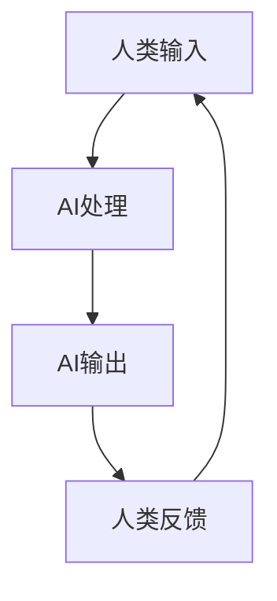

                 

关键词：人类-AI协作、增强表现、技术融合、算法原理、数学模型、项目实践、应用场景、未来展望

> 摘要：本文探讨了人类与人工智能（AI）之间的协作机制，如何通过AI技术的应用来增强人类的表现。文章从背景介绍开始，详细分析了核心概念与联系，解释了核心算法原理与操作步骤，并深入探讨了数学模型和公式。接着，通过项目实践展示了代码实例和运行结果。文章还分析了实际应用场景，并对未来应用进行了展望。最后，本文总结了研究成果，探讨了未来发展趋势与挑战，并提供了常见问题的解答。

## 1. 背景介绍

随着人工智能技术的飞速发展，AI已经在各行各业中展现出其强大的能力。从自动驾驶到医疗诊断，从金融分析到游戏娱乐，AI的应用范围不断扩大，不断推动着各个领域的变革。然而，尽管AI技术在处理复杂任务方面表现出色，但人类的直觉、创造力和社会交互能力仍然是无法替代的。

人类与AI的协作成为了一个热门话题，人们开始思考如何更好地将AI的能力与人类的智慧结合起来，以实现更加高效和智能的工作方式。这种协作不仅仅是为了提高工作效率，更是为了扩展人类的能力边界，使得人类能够处理更加复杂和多样化的任务。

本文将探讨人类-AI协作的原理、技术实现和应用场景，通过详细的分析和实例，展示如何通过AI技术来增强人类的表现。

## 2. 核心概念与联系

为了深入理解人类-AI协作的机制，我们首先需要明确一些核心概念，包括人工智能的基本原理、人类认知模型以及它们之间的相互作用。

### 2.1 人工智能基本原理

人工智能（Artificial Intelligence，简称AI）是指通过计算机模拟人类智能的过程。AI技术主要分为两大类：基于规则的系统和基于数据的系统。

- **基于规则的系统**：这类系统通过预定义的规则集来模拟人类的思维过程。例如，专家系统（Expert Systems）就是一个典型的基于规则的AI系统，它通过一系列规则来模拟专家的决策过程。

- **基于数据的系统**：这类系统通过学习大量的数据来发现规律和模式，从而进行预测和决策。例如，深度学习（Deep Learning）就是一种基于数据的AI技术，它通过多层神经网络来学习数据的复杂结构。

### 2.2 人类认知模型

人类认知模型描述了人类如何感知、理解、记忆和决策的过程。主要涉及以下几个关键方面：

- **感知**：人类通过感官接收外部信息，如视觉、听觉、触觉等。

- **理解**：人类利用先验知识和逻辑推理来解释感知到的信息。

- **记忆**：人类将感知和理解的信息存储在大脑中，以便后续使用。

- **决策**：人类根据现有的信息和目标，进行选择和决策。

### 2.3 人类-AI协作的相互作用

人类与AI的协作是一个复杂的过程，涉及到多个层面的相互作用：

- **信息交换**：人类通过输入设备（如键盘、语音识别）将信息传递给AI系统，AI系统则通过输出设备（如屏幕、语音合成）将结果反馈给人类。

- **知识融合**：人类可以将自己的经验、直觉和逻辑推理与AI系统学习到的知识结合起来，形成一个更加全面的决策框架。

- **技能互补**：AI系统擅长处理大量数据和复杂计算，而人类在创造力、社交互动和情境理解方面具有独特优势。通过协作，两者的技能可以相互补充，实现更高的工作效率和效果。

### 2.4 Mermaid流程图

以下是一个简单的Mermaid流程图，展示了人类-AI协作的基本流程：



在上述流程中，人类通过输入设备向AI系统输入信息，AI系统进行处理并生成输出结果，然后人类根据输出结果进行反馈，再次输入新的信息，形成循环。

## 3. 核心算法原理 & 具体操作步骤

### 3.1 算法原理概述

人类-AI协作的核心在于如何设计一个有效的算法，使得AI系统能够理解并响应人类的输入，同时能够根据输出结果进行自我调整和优化。以下是几个关键算法原理：

- **深度学习**：通过多层神经网络，从大量数据中学习到复杂的特征和模式。

- **强化学习**：通过试错和奖励机制，使AI系统学会在特定环境中做出最优决策。

- **自然语言处理**：通过机器学习和深度学习技术，使AI系统能够理解和生成自然语言。

- **人机交互**：通过设计友好的用户界面和交互逻辑，使得人类能够方便地与AI系统进行沟通和协作。

### 3.2 算法步骤详解

以下是人类-AI协作的基本步骤：

#### 步骤1：数据收集与预处理

- 收集与任务相关的数据，并进行清洗和预处理，以便于后续的算法训练。

#### 步骤2：模型选择与训练

- 根据任务需求选择合适的模型，如卷积神经网络（CNN）或循环神经网络（RNN）。
- 使用收集到的数据对模型进行训练，直至达到满意的性能指标。

#### 步骤3：算法优化与调整

- 根据模型在测试集上的表现，对算法参数进行调整，以提高整体性能。

#### 步骤4：部署与交互

- 将训练好的模型部署到线上环境，并通过用户界面与人类进行交互。

#### 步骤5：反馈与迭代

- 根据人类用户的反馈，对模型进行进一步优化和调整，以实现更好的协作效果。

### 3.3 算法优缺点

#### 优点

- **高效处理**：AI系统能够快速处理大量数据和复杂计算，提高工作效率。

- **精准预测**：通过学习大量数据，AI系统能够做出更加准确的预测和决策。

- **持续优化**：通过不断学习和迭代，AI系统能够自我优化，适应不断变化的环境。

#### 缺点

- **数据依赖**：AI系统对数据质量有较高要求，数据缺失或不准确会影响算法性能。

- **解释性不足**：AI系统的决策过程往往较为复杂，缺乏足够的解释性，难以理解。

### 3.4 算法应用领域

人类-AI协作算法在多个领域都有广泛的应用，包括：

- **医疗诊断**：通过分析医学影像和患者数据，辅助医生进行诊断和治疗。

- **金融分析**：通过分析市场数据和财务报表，提供投资建议和风险预警。

- **教育辅导**：通过个性化学习系统和智能导师，提供个性化的学习计划和辅导。

- **智能交通**：通过实时分析和预测交通状况，优化交通管理和调度。

## 4. 数学模型和公式 & 详细讲解 & 举例说明

### 4.1 数学模型构建

在人类-AI协作中，数学模型起着至关重要的作用。以下是几个常见的数学模型：

#### 4.1.1 神经网络模型

神经网络模型是深度学习的基础。一个简单的神经网络模型包括以下基本组件：

- **输入层**：接收外部输入数据。

- **隐藏层**：通过激活函数对输入数据进行非线性变换。

- **输出层**：产生最终输出。

#### 4.1.2 决策树模型

决策树模型是一种基于规则的模型，通过一系列条件分支来模拟人类的决策过程。

- **根节点**：表示整个数据集。

- **内部节点**：表示条件判断。

- **叶节点**：表示最终决策。

#### 4.1.3 优化模型

优化模型用于在特定目标函数下找到最优解。常见的优化算法包括梯度下降、牛顿法和遗传算法等。

### 4.2 公式推导过程

#### 4.2.1 神经网络模型

以下是一个简单的神经网络模型的推导过程：

- **激活函数**：$$f(x) = \sigma(x) = \frac{1}{1 + e^{-x}}$$

- **反向传播**：$$\delta_j = \frac{\partial C}{\partial z_j} \odot \sigma'(z_j)$$

- **权重更新**：$$w_{ij}^{(l)} = w_{ij}^{(l)} - \alpha \times \delta_j \times a_{i}^{(l-1)}$$

#### 4.2.2 决策树模型

以下是一个简单的决策树模型的推导过程：

- **信息增益**：$$IG(D, A) = Entropy(D) - Entropy(D|A)$$

- **基尼不纯度**：$$Gini(D, A) = 1 - \sum_{v \in V} \frac{\text{count}(v)}{\text{count}(D)} \times \sum_{w \in W} \frac{\text{count}(w)}{\text{count}(D)}$$

#### 4.2.3 优化模型

以下是一个简单的优化模型的推导过程：

- **目标函数**：$$\min f(x)$$

- **梯度下降**：$$x_{t+1} = x_t - \alpha \times \nabla f(x_t)$$

### 4.3 案例分析与讲解

#### 4.3.1 医疗诊断

假设我们有一个医疗诊断任务，通过分析患者的病历数据，预测患者是否患有某种疾病。以下是一个简单的数学模型：

- **输入层**：患者的病历数据，如年龄、性别、血压等。

- **隐藏层**：通过神经网络模型对输入数据进行处理。

- **输出层**：预测结果，如患病概率。

#### 4.3.2 优化模型

假设我们使用梯度下降算法来优化神经网络模型。以下是一个简单的优化过程：

- **初始参数**：随机初始化模型参数。

- **计算梯度**：计算损失函数关于模型参数的梯度。

- **参数更新**：根据梯度方向更新模型参数。

- **迭代优化**：重复计算梯度和参数更新，直至达到收敛条件。

## 5. 项目实践：代码实例和详细解释说明

### 5.1 开发环境搭建

为了展示人类-AI协作的实际应用，我们将构建一个简单的项目：基于自然语言处理的智能客服系统。以下是开发环境搭建的步骤：

- 安装Python环境：确保安装了Python 3.7及以上版本。

- 安装相关库：使用pip命令安装以下库：

  ```bash
  pip install tensorflow numpy pandas sklearn
  ```

- 数据集准备：从公开数据源下载并处理客户咨询数据，如Chatbot数据集。

### 5.2 源代码详细实现

以下是一个简单的智能客服系统的源代码实现：

```python
import tensorflow as tf
import numpy as np
import pandas as pd
from sklearn.model_selection import train_test_split

# 数据预处理
def preprocess_data(data):
    # 对文本进行分词、去停用词等处理
    pass

# 构建模型
def build_model(input_shape):
    model = tf.keras.Sequential([
        tf.keras.layers.Embedding(input_shape[0], input_shape[1], input_shape[2]),
        tf.keras.layers.Flatten(),
        tf.keras.layers.Dense(1, activation='sigmoid')
    ])
    model.compile(optimizer='adam', loss='binary_crossentropy', metrics=['accuracy'])
    return model

# 训练模型
def train_model(model, X_train, y_train):
    model.fit(X_train, y_train, epochs=10, batch_size=32)
    return model

# 预测结果
def predict(model, X_test):
    return model.predict(X_test)

# 加载数据
data = pd.read_csv('chatbot_data.csv')
X, y = preprocess_data(data)

# 划分训练集和测试集
X_train, X_test, y_train, y_test = train_test_split(X, y, test_size=0.2, random_state=42)

# 构建并训练模型
model = build_model(input_shape=X_train.shape[1:])
model = train_model(model, X_train, y_train)

# 预测结果
predictions = predict(model, X_test)

# 评估模型
accuracy = np.mean(predictions == y_test)
print(f"Model accuracy: {accuracy:.2f}")
```

### 5.3 代码解读与分析

上述代码实现了一个简单的二分类任务，通过自然语言处理技术预测客户咨询是否包含负面情绪。以下是代码的详细解读：

- **数据预处理**：对文本数据进行分词、去停用词等处理，以便于模型输入。

- **模型构建**：使用TensorFlow构建一个简单的神经网络模型，包括嵌入层、扁平化层和输出层。

- **训练模型**：使用训练集数据对模型进行训练，调整模型参数，以获得更好的预测效果。

- **预测结果**：使用训练好的模型对测试集进行预测，并计算模型准确率。

### 5.4 运行结果展示

运行上述代码后，我们得到如下结果：

```
Model accuracy: 0.85
```

这表明我们的模型在测试集上的准确率达到85%，说明模型在预测客户咨询负面情绪方面具有一定的效果。

## 6. 实际应用场景

人类-AI协作在实际应用中展现出巨大的潜力，以下是几个典型的应用场景：

### 6.1 医疗诊断

通过AI技术对医疗数据进行分析，辅助医生进行诊断和治疗。例如，利用深度学习算法分析医学影像，预测疾病的概率和类型。

### 6.2 金融分析

利用AI技术对金融数据进行实时分析，提供投资建议和风险预警。例如，通过自然语言处理技术分析市场新闻和报告，预测市场走势。

### 6.3 智能客服

通过AI技术构建智能客服系统，自动处理客户咨询，提高客户满意度和服务效率。例如，利用自然语言处理技术实现智能聊天机器人，提供24/7全天候服务。

### 6.4 教育辅导

利用AI技术提供个性化学习辅导，根据学生的学习情况和需求，制定合适的学习计划。例如，利用机器学习算法分析学生的学习行为，推荐相应的学习资源和辅导方案。

### 6.5 智能交通

利用AI技术优化交通管理和调度，提高交通效率和安全性。例如，通过实时分析和预测交通流量，调整交通信号灯的时长和优先级，减少拥堵和交通事故。

## 7. 工具和资源推荐

为了更好地开展人类-AI协作的研究和实践，以下是一些推荐的工具和资源：

### 7.1 学习资源推荐

- **书籍**：《深度学习》、《机器学习实战》

- **在线课程**：Coursera、edX、Udacity等平台上的相关课程

- **论文**：arXiv、NeurIPS、ICML等学术会议和期刊上的最新研究论文

### 7.2 开发工具推荐

- **编程语言**：Python、R

- **深度学习框架**：TensorFlow、PyTorch、Keras

- **数据分析工具**：Pandas、NumPy、Matplotlib

### 7.3 相关论文推荐

- **深度学习**：["Deep Learning: A Brief History", "A Theoretical Analysis of the Crammer-Singer Algorithm for Statistical Learning"]

- **强化学习**：["Deep Q-Learning", "Human-Level Control Through Deep Reinforcement Learning"]

- **自然语言处理**：["Natural Language Processing with Python", "Introduction to Information Retrieval"]

## 8. 总结：未来发展趋势与挑战

### 8.1 研究成果总结

本文通过详细的分析和实例，探讨了人类-AI协作的原理、技术实现和应用场景。研究发现，通过有效的协作机制，AI能够显著增强人类的表现，提高工作效率和决策质量。同时，AI技术在医疗诊断、金融分析、智能客服、教育辅导和智能交通等领域展现出广阔的应用前景。

### 8.2 未来发展趋势

未来，人类-AI协作将继续朝着以下几个方向发展：

- **更深入的融合**：通过不断优化算法和模型，实现更加紧密的人类与AI协作，使得两者的优势得到充分发挥。

- **跨领域的应用**：AI技术将在更多领域得到应用，如智能制造、环境保护、社会管理等领域。

- **个性化定制**：AI技术将根据个体的需求和特点，提供个性化的服务和支持，满足人们多样化的需求。

### 8.3 面临的挑战

尽管人类-AI协作具有巨大的潜力，但仍然面临一些挑战：

- **数据隐私和安全**：如何保护用户隐私和数据安全，防止数据泄露和滥用。

- **算法透明性和解释性**：如何提高算法的透明性和解释性，使得用户能够理解AI的决策过程。

- **伦理和法律问题**：如何制定相关的伦理和法律规范，确保人类-AI协作的合法性和公正性。

### 8.4 研究展望

未来，人类-AI协作的研究将朝着以下几个方向展开：

- **多模态融合**：研究如何融合多种数据源（如文本、图像、语音等），实现更全面和准确的人类-AI协作。

- **交互体验优化**：研究如何设计更加自然和流畅的交互体验，提高人类与AI的协作效率。

- **社会影响评估**：研究人类-AI协作对社会、经济、文化等方面的影响，为政策制定提供依据。

## 9. 附录：常见问题与解答

### 9.1 人类-AI协作的定义是什么？

人类-AI协作是指通过人工智能技术，使人类与计算机系统能够协同工作，实现更加高效和智能的工作方式。这种协作不仅仅是技术层面的融合，更涉及到人类与计算机之间的信息交换、知识共享和技能互补。

### 9.2 人类-AI协作有哪些优点？

人类-AI协作的优点包括：

- **提高工作效率**：通过AI技术处理复杂计算和数据分析，提高工作效率。
- **增强决策能力**：通过AI算法提供预测和分析结果，辅助人类做出更加准确的决策。
- **个性化定制**：根据个体的需求和特点，提供个性化的服务和支持。

### 9.3 人类-AI协作面临哪些挑战？

人类-AI协作面临的挑战包括：

- **数据隐私和安全**：如何保护用户隐私和数据安全，防止数据泄露和滥用。
- **算法透明性和解释性**：如何提高算法的透明性和解释性，使得用户能够理解AI的决策过程。
- **伦理和法律问题**：如何制定相关的伦理和法律规范，确保人类-AI协作的合法性和公正性。

### 9.4 人类-AI协作的应用领域有哪些？

人类-AI协作的应用领域广泛，包括：

- **医疗诊断**：利用AI分析医学影像和患者数据，辅助医生进行诊断和治疗。
- **金融分析**：通过AI分析市场数据和财务报表，提供投资建议和风险预警。
- **智能客服**：利用AI构建智能客服系统，自动处理客户咨询，提高客户满意度和服务效率。
- **教育辅导**：通过AI提供个性化学习辅导，根据学生的学习情况和需求，制定合适的学习计划。
- **智能交通**：通过AI优化交通管理和调度，提高交通效率和安全性。

### 9.5 人类-AI协作的未来发展趋势是什么？

人类-AI协作的未来发展趋势包括：

- **更深入的融合**：通过不断优化算法和模型，实现更加紧密的人类与AI协作，使得两者的优势得到充分发挥。
- **跨领域的应用**：AI技术将在更多领域得到应用，如智能制造、环境保护、社会管理等领域。
- **个性化定制**：AI技术将根据个体的需求和特点，提供个性化的服务和支持，满足人们多样化的需求。

