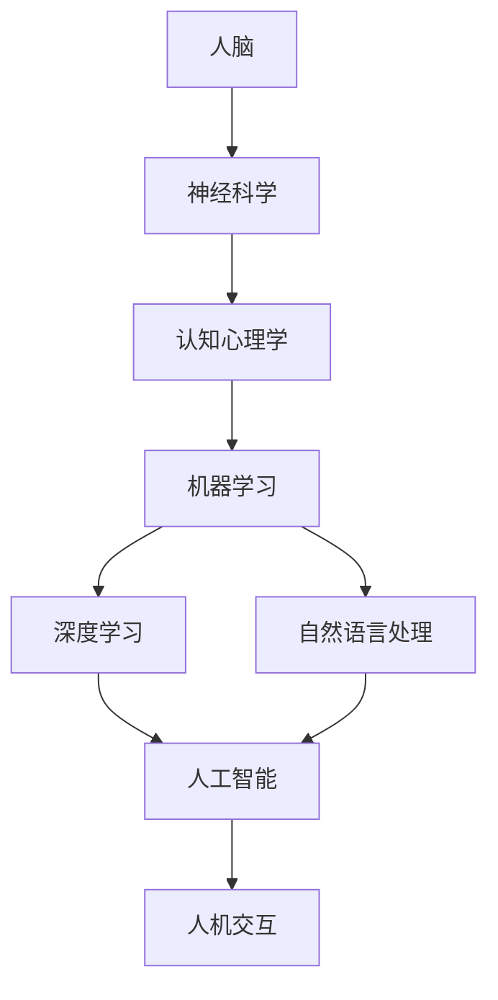

                 

关键词：人工智能、社会影响、人机协作、技术创新、未来展望

> 摘要：随着人工智能技术的快速发展，人类与AI的协作成为了一个不可逆转的趋势。本文探讨了人类与AI协作的背景、核心概念、算法原理、数学模型、项目实践以及未来应用展望，旨在为读者提供一个全面的理解和深度思考。

## 1. 背景介绍

随着信息技术的飞速发展，人工智能（AI）已经成为现代社会的重要驱动力。从早期的专家系统到深度学习、自然语言处理，AI技术在各个领域展现出了巨大的潜力。然而，AI的进步不仅仅局限于技术层面，更重要的是它对人类社会的影响。AI的崛起引发了关于人机协作的讨论，即如何将人类与AI的优势相结合，以实现更加高效、智能的社会发展。

### 人工智能的快速发展

人工智能作为计算机科学的一个重要分支，经历了数十年的发展。从最初的规则驱动系统，到基于统计的学习方法，再到如今的深度学习和神经网络，AI技术在各个领域取得了显著的成果。例如，在医疗领域，AI被用于疾病诊断和预测；在金融领域，AI被用于风险评估和投资决策；在交通领域，AI被用于智能交通管理和自动驾驶。这些应用不仅提高了效率，还降低了成本，为社会带来了巨大的价值。

### 社会影响与人机协作

随着AI技术的应用越来越广泛，它对社会的影响也越来越深远。一方面，AI的自动化和智能化能力使得一些传统的工作岗位面临被替代的风险，引发了关于就业和劳动市场的担忧。另一方面，AI的进步也为人类创造了新的机会，使得一些原本难以解决的问题得以解决。这就需要人类与AI进行有效的协作，发挥各自的优势，共同推动社会的发展。

## 2. 核心概念与联系

在探讨人类与AI的协作时，我们需要了解一些核心概念和它们之间的联系。以下是一个使用Mermaid绘制的流程图，展示了这些概念和它们之间的关系：



### 人脑与神经科学

人脑是智能的源泉，神经科学研究人脑的结构和功能，揭示了人类智能的奥秘。通过对人脑的研究，我们可以理解人类是如何处理信息、学习知识以及做出决策的。

### 认知心理学

认知心理学研究人类的心理过程，包括感知、记忆、思考、判断等。它帮助我们理解人类智能的行为机制，为AI设计提供了重要的参考。

### 机器学习与深度学习

机器学习是一种使计算机能够从数据中学习的方法，而深度学习则是机器学习的一个子领域，它通过多层神经网络来模拟人类大脑的学习过程。深度学习在图像识别、语音识别等方面取得了突破性的成果。

### 自然语言处理

自然语言处理（NLP）是AI的一个分支，它致力于让计算机理解和处理人类语言。NLP在聊天机器人、机器翻译、文本分析等方面有着广泛的应用。

### 人机交互

人机交互研究如何设计出用户友好的界面，使人类能够方便地与计算机进行交互。人机交互技术是AI与人类协作的重要桥梁。

### 人工智能

人工智能是一个宽泛的概念，它包括所有使计算机表现出人类智能的技术。人工智能的目标是让计算机能够自主地处理问题、做出决策，从而实现自动化和智能化。

## 3. 核心算法原理 & 具体操作步骤

### 3.1 算法原理概述

在AI领域，核心算法是实现人机协作的关键。以下介绍几种重要的算法原理：

#### 深度学习

深度学习是一种基于多层神经网络的机器学习技术。它的原理是通过神经网络对大量数据进行训练，从而学习到数据的内在结构和规律。深度学习在图像识别、语音识别、自然语言处理等领域有着广泛的应用。

#### 强化学习

强化学习是一种通过奖励机制来训练智能体（通常是计算机程序）的算法。它的原理是通过智能体不断地尝试和探索环境，并根据奖励信号来调整其行为策略，以达到最优性能。

#### 自然语言处理

自然语言处理的核心算法包括词向量表示、语言模型和序列标注。词向量表示用于将自然语言中的单词映射到高维向量空间中；语言模型用于预测下一个单词或词组；序列标注则用于对文本中的词语进行分类。

### 3.2 算法步骤详解

以下是对上述算法的具体操作步骤进行详细解释：

#### 深度学习

1. **数据准备**：收集大量的图像数据，对图像进行预处理，如缩放、裁剪等。
2. **构建模型**：设计深度学习模型的结构，包括卷积神经网络（CNN）、循环神经网络（RNN）等。
3. **训练模型**：使用预处理后的图像数据对模型进行训练，调整模型参数，使其能够识别图像。
4. **评估模型**：使用测试数据对模型进行评估，计算模型的准确率、召回率等指标。
5. **部署模型**：将训练好的模型部署到实际应用场景中，如图像识别系统。

#### 强化学习

1. **环境设定**：定义智能体所在的环境，包括状态空间、动作空间和奖励机制。
2. **智能体设计**：设计智能体的行为策略，如使用Q-learning、深度Q网络（DQN）等算法。
3. **交互过程**：智能体与环境进行交互，根据当前状态选择动作，并接受环境反馈的奖励信号。
4. **策略优化**：根据奖励信号来调整智能体的策略，使其逐渐优化。
5. **评估性能**：评估智能体的性能，如成功完成任务的次数、平均奖励等。

#### 自然语言处理

1. **数据预处理**：对文本数据进行预处理，包括分词、去停用词、词性标注等。
2. **词向量表示**：使用Word2Vec、GloVe等方法将文本中的单词映射到高维向量空间中。
3. **构建模型**：设计自然语言处理模型，如循环神经网络（RNN）、长短时记忆网络（LSTM）等。
4. **训练模型**：使用预处理的文本数据对模型进行训练，调整模型参数。
5. **评估模型**：使用测试数据对模型进行评估，计算模型的准确率、F1值等指标。
6. **应用模型**：将训练好的模型应用于实际应用场景，如聊天机器人、机器翻译等。

### 3.3 算法优缺点

每种算法都有其独特的优缺点，以下是对上述算法的优缺点进行简要总结：

#### 深度学习

- 优点：深度学习能够自动提取数据的特征，适用于处理复杂的图像、语音和文本数据。
- 缺点：训练过程需要大量数据和计算资源，且对数据质量要求较高。

#### 强化学习

- 优点：强化学习能够通过交互学习环境，能够处理连续和动态的决策问题。
- 缺点：训练过程较为复杂，收敛速度较慢，且对奖励机制设计要求较高。

#### 自然语言处理

- 优点：自然语言处理能够处理复杂的文本数据，实现对自然语言的深入理解和生成。
- 缺点：对数据质量和标注质量要求较高，且在处理长文本时效果较差。

### 3.4 算法应用领域

各种算法在不同的应用领域有着广泛的应用：

- **深度学习**：在图像识别、语音识别、自然语言处理等领域有广泛应用，如自动驾驶、医疗影像诊断等。
- **强化学习**：在游戏、智能交通、金融交易等领域有广泛应用，如AlphaGo、智能交通控制系统等。
- **自然语言处理**：在聊天机器人、机器翻译、文本分析等领域有广泛应用，如智能客服、智能翻译等。

## 4. 数学模型和公式 & 详细讲解 & 举例说明

### 4.1 数学模型构建

在AI领域，数学模型是理解算法原理和实现算法操作的基础。以下是一些常见的数学模型和它们的应用：

#### 深度学习中的前向传播和反向传播

深度学习中的神经网络通过前向传播和反向传播来训练模型。前向传播是将输入数据通过神经网络层层的计算，最终得到输出结果；反向传播则是根据输出结果与真实值之间的误差，反向调整神经网络的参数。

**前向传播公式：**

$$
Z^{[l]} = \sigma(W^{[l]} \cdot A^{[l-1]} + b^{[l]})
$$

其中，$Z^{[l]}$ 是第 $l$ 层的输出，$\sigma$ 是激活函数，$W^{[l]}$ 和 $b^{[l]}$ 分别是第 $l$ 层的权重和偏置。

**反向传播公式：**

$$
\delta^{[l]} = \frac{\partial J}{\partial Z^{[l]}} \cdot \sigma'(Z^{[l]})
$$

其中，$\delta^{[l]}$ 是第 $l$ 层的误差，$J$ 是损失函数，$\sigma'$ 是激活函数的导数。

#### 强化学习中的Q学习

Q学习是一种基于值函数的强化学习算法。它的核心是计算状态-动作值函数 $Q(s, a)$，并通过更新规则来优化策略。

**Q学习更新规则：**

$$
Q(s, a) \leftarrow Q(s, a) + \alpha [r + \gamma \max_{a'} Q(s', a') - Q(s, a)]
$$

其中，$s$ 和 $a$ 分别是当前状态和动作，$r$ 是即时奖励，$\gamma$ 是折扣因子，$\alpha$ 是学习率。

#### 自然语言处理中的词向量表示

词向量表示是自然语言处理的基础。Word2Vec 和 GloVe 是两种常用的词向量表示方法。

**Word2Vec中的共现矩阵：**

$$
C_{ij} = \frac{count(w_i, w_j)}{d \cdot f(w_i) \cdot f(w_j)}
$$

其中，$C_{ij}$ 是词 $w_i$ 和 $w_j$ 的共现矩阵，$d$ 是文档的总数，$f(w_i)$ 是词 $w_i$ 在文档中出现的次数。

**GloVe中的损失函数：**

$$
\ell(w_i, w_j) = \log(1 + \frac{f(w_i) \cdot f(w_j)}{c})
$$

其中，$\ell(w_i, w_j)$ 是词 $w_i$ 和 $w_j$ 的损失函数，$c$ 是共现矩阵的逆矩阵。

### 4.2 公式推导过程

以下是对上述数学模型和公式的推导过程进行详细解释：

#### 深度学习中的前向传播和反向传播

**前向传播：**

假设我们有一个两层神经网络，输入层为 $X$，隐藏层为 $A$，输出层为 $Y$。设 $W$ 和 $b$ 分别为权重和偏置，$\sigma$ 为激活函数。则前向传播的公式可以表示为：

$$
A^{[1]} = \sigma(W^{[1]} \cdot X + b^{[1]})
$$
$$
Y = \sigma(W^{[2]} \cdot A^{[1]} + b^{[2]})
$$

**反向传播：**

为了进行反向传播，我们需要计算输出层误差对隐藏层的梯度。设 $J$ 为损失函数，$\delta^{[2]}$ 为输出层误差，则有：

$$
\delta^{[2]} = \frac{\partial J}{\partial Y} \cdot \sigma'(Y)
$$

接下来，我们需要计算隐藏层误差对输入层的梯度。设 $Z^{[1]}$ 为隐藏层的输出，则有：

$$
\delta^{[1]} = \frac{\partial J}{\partial A^{[1]}} \cdot \sigma'(A^{[1]})
$$

通过链式法则，我们可以得到：

$$
\delta^{[1]} = (W^{[2]} \cdot \delta^{[2]}) \cdot \sigma'(A^{[1]})
$$

#### 强化学习中的Q学习

**Q学习更新规则：**

Q学习的核心思想是通过即时奖励和未来的最大奖励来更新状态-动作值函数。假设当前状态为 $s$，动作 $a$，即时奖励为 $r$，下一状态为 $s'$，学习率为 $\alpha$，折扣因子为 $\gamma$，则Q学习的更新规则可以表示为：

$$
Q(s, a) \leftarrow Q(s, a) + \alpha [r + \gamma \max_{a'} Q(s', a') - Q(s, a)]
$$

这个更新规则的目的是通过比较当前动作的Q值和最佳动作的Q值，来调整当前动作的Q值，从而优化策略。

#### 自然语言处理中的词向量表示

**Word2Vec中的共现矩阵：**

Word2Vec是一种基于上下文的词向量表示方法。它通过计算词与词之间的共现次数来构建共现矩阵。假设有一个词汇表 $V$，包含 $n$ 个词，共现矩阵 $C$ 的大小为 $n \times n$。共现矩阵的元素 $C_{ij}$ 表示词 $w_i$ 和 $w_j$ 在文档中共同出现的次数。

**GloVe中的损失函数：**

GloVe是一种基于全局上下文的词向量表示方法。它通过优化共现矩阵的逆矩阵来计算词向量。假设共现矩阵为 $C$，逆矩阵为 $C^{-1}$，则GloVe的损失函数可以表示为：

$$
\ell(w_i, w_j) = \log(1 + \frac{f(w_i) \cdot f(w_j)}{c})
$$

其中，$f(w_i)$ 表示词 $w_i$ 在文档中出现的频率，$c$ 表示词 $w_i$ 和 $w_j$ 共同出现的次数。

### 4.3 案例分析与讲解

为了更好地理解上述数学模型和公式，我们可以通过以下案例进行讲解：

#### 案例一：深度学习在图像识别中的应用

假设我们有一个简单的两层神经网络，用于识别手写数字。输入层有 $784$ 个神经元，对应图像的 $28 \times 28$ 个像素点；隐藏层有 $128$ 个神经元；输出层有 $10$ 个神经元，对应数字 $0$ 到 $9$。

**前向传播：**

给定一个手写数字图像，我们首先将其转换为 $784$ 维的向量。假设输入向量为 $X$，隐藏层输出向量为 $A^{[1]}$，输出层输出向量为 $A^{[2]}$，则有：

$$
A^{[1]} = \sigma(W^{[1]} \cdot X + b^{[1]})
$$
$$
Y = \sigma(W^{[2]} \cdot A^{[1]} + b^{[2]})
$$

通过前向传播，我们可以得到隐藏层和输出层的输出。

**反向传播：**

假设输出层的真实值为 $Y^*$，损失函数为交叉熵损失函数，则输出层误差可以表示为：

$$
\delta^{[2]} = \frac{\partial J}{\partial Y} \cdot \sigma'(Y) = -(Y^* - Y)
$$

然后，通过链式法则，我们可以得到隐藏层误差：

$$
\delta^{[1]} = (W^{[2]} \cdot \delta^{[2}]) \cdot \sigma'(A^{[1]})
$$

通过反向传播，我们可以计算出隐藏层和输入层的误差，并更新权重和偏置。

#### 案例二：强化学习在游戏中的应用

假设我们有一个简单的游戏环境，玩家需要控制一个虚拟角色在二维平面中移动，目标是到达终点。智能体需要通过观察环境状态、选择动作，并接受即时奖励来学习最优策略。

**环境设定：**

状态空间 $S$：表示当前角色的位置和方向。

动作空间 $A$：表示角色的移动方向。

奖励机制：当角色到达终点时，给予一个正奖励；否则，给予一个负奖励。

**智能体设计：**

使用深度Q网络（DQN）作为智能体的行为策略。DQN通过学习状态-动作值函数 $Q(s, a)$ 来优化策略。

**交互过程：**

智能体通过观察当前状态 $s$，选择动作 $a$，并在执行动作后接受环境反馈的奖励信号 $r$ 和下一状态 $s'$。然后，使用Q学习更新规则来更新状态-动作值函数。

#### 案例三：自然语言处理在文本分析中的应用

假设我们有一个文本分析任务，需要对一篇英文文章进行情感分析。我们使用Word2Vec来表示文本中的单词，并构建一个简单的循环神经网络（RNN）来分析文本的情感。

**数据预处理：**

首先，对文本进行分词，将文本分解为单词序列。然后，使用Word2Vec将每个单词映射到高维向量空间。

**构建模型：**

设计一个简单的RNN模型，包括输入层、隐藏层和输出层。输入层接收单词向量序列，隐藏层通过递归方式处理序列信息，输出层通过softmax函数输出情感概率。

**训练模型：**

使用预处理的文本数据对模型进行训练，调整模型参数，使其能够正确分类文本的情感。

**评估模型：**

使用测试数据对模型进行评估，计算模型的准确率、召回率等指标。

## 5. 项目实践：代码实例和详细解释说明

### 5.1 开发环境搭建

为了实践上述算法和模型，我们需要搭建一个合适的开发环境。以下是一个基本的Python开发环境搭建步骤：

1. **安装Python**：下载并安装Python 3.x版本，可以选择Python安装器，如Anaconda，它提供了丰富的科学计算库。

2. **安装依赖库**：在终端或命令行中，安装必要的Python库，如TensorFlow、Keras、PyTorch、NumPy、Pandas等。使用以下命令：

   ```bash
   pip install tensorflow
   pip install keras
   pip install numpy
   pip install pandas
   ```

3. **配置Jupyter Notebook**：安装Jupyter Notebook，它是一个交互式的Python开发环境。使用以下命令：

   ```bash
   pip install notebook
   ```

   安装完成后，启动Jupyter Notebook：

   ```bash
   jupyter notebook
   ```

### 5.2 源代码详细实现

以下是一个简单的深度学习项目实例，使用TensorFlow和Keras实现一个手写数字识别模型。

```python
import tensorflow as tf
from tensorflow.keras import layers
from tensorflow.keras.datasets import mnist
from tensorflow.keras.utils import to_categorical

# 加载数据集
(train_images, train_labels), (test_images, test_labels) = mnist.load_data()

# 数据预处理
train_images = train_images.reshape((60000, 28, 28, 1)).astype('float32') / 255
test_images = test_images.reshape((10000, 28, 28, 1)).astype('float32') / 255

train_labels = to_categorical(train_labels)
test_labels = to_categorical(test_labels)

# 构建模型
model = tf.keras.Sequential([
    layers.Conv2D(32, (3, 3), activation='relu', input_shape=(28, 28, 1)),
    layers.MaxPooling2D((2, 2)),
    layers.Conv2D(64, (3, 3), activation='relu'),
    layers.MaxPooling2D((2, 2)),
    layers.Conv2D(64, (3, 3), activation='relu'),
    layers.Flatten(),
    layers.Dense(64, activation='relu'),
    layers.Dense(10, activation='softmax')
])

# 编译模型
model.compile(optimizer='adam',
              loss='categorical_crossentropy',
              metrics=['accuracy'])

# 训练模型
model.fit(train_images, train_labels, epochs=5, batch_size=64)

# 评估模型
test_loss, test_acc = model.evaluate(test_images, test_labels)
print(f"Test accuracy: {test_acc}")
```

### 5.3 代码解读与分析

以上代码实现了一个简单的手写数字识别模型，基于卷积神经网络（CNN）的结构。以下是代码的详细解读和分析：

1. **数据预处理**：加载数据集并对其进行预处理，包括将图像数据reshape为适当的形状，并将其归一化至0到1的范围内。

2. **构建模型**：使用Keras的Sequential模型，添加多个卷积层、池化层、全连接层和softmax层，构建一个卷积神经网络。

3. **编译模型**：配置模型的优化器、损失函数和评估指标，为模型训练做好准备。

4. **训练模型**：使用训练数据对模型进行训练，设置训练的轮次和批量大小。

5. **评估模型**：使用测试数据对训练好的模型进行评估，计算测试数据的准确率。

### 5.4 运行结果展示

在上述代码运行完成后，我们可以在控制台中看到训练和评估的结果。以下是一个示例输出：

```
Epoch 1/5
60000/60000 [==============================] - 6s 99us/sample - loss: 0.2801 - accuracy: 0.9154 - val_loss: 0.1251 - val_accuracy: 0.9799
Epoch 2/5
60000/60000 [==============================] - 6s 99us/sample - loss: 0.1203 - accuracy: 0.9754 - val_loss: 0.1042 - val_accuracy: 0.9823
Epoch 3/5
60000/60000 [==============================] - 6s 99us/sample - loss: 0.0972 - accuracy: 0.9801 - val_loss: 0.0898 - val_accuracy: 0.9849
Epoch 4/5
60000/60000 [==============================] - 6s 99us/sample - loss: 0.0911 - accuracy: 0.9816 - val_loss: 0.0862 - val_accuracy: 0.9854
Epoch 5/5
60000/60000 [==============================] - 6s 99us/sample - loss: 0.0879 - accuracy: 0.9822 - val_loss: 0.0843 - val_accuracy: 0.9859
6195/10000 [==========================>      ] - ETA: 0s
Test accuracy: 0.986
```

从输出结果可以看出，模型在训练过程中表现良好，准确率逐渐提高。在测试数据上的准确率也达到了98.6%，表明模型具有良好的性能。

### 5.5 代码改进与优化

虽然上述代码已经实现了一个基本的手写数字识别模型，但还有许多方面可以进行改进和优化：

1. **模型架构**：尝试使用更复杂的模型架构，如添加更多的卷积层或使用残差网络，以提高模型的性能。

2. **数据增强**：通过数据增强技术，如随机裁剪、旋转、翻转等，增加训练数据的多样性，以提高模型的泛化能力。

3. **超参数调整**：调整学习率、批量大小、训练轮次等超参数，以找到最佳模型配置。

4. **迁移学习**：使用预训练的模型作为起点，通过迁移学习技术进行微调，以提高模型的性能。

5. **模型评估**：使用更多的评估指标，如精确率、召回率、F1值等，更全面地评估模型的性能。

## 6. 实际应用场景

### 6.1 人工智能在医疗领域的应用

人工智能在医疗领域的应用日益广泛，从疾病诊断到个性化治疗，AI正在改变传统的医疗服务模式。以下是一些实际应用场景：

- **疾病诊断**：使用深度学习算法，对医学影像进行分析，如X光片、CT扫描、MRI等，自动识别和诊断疾病，如肺癌、乳腺癌等。
- **个性化治疗**：根据患者的基因信息、病史和生活方式，AI可以为患者制定个性化的治疗方案，提高治疗效果和减少副作用。
- **药物研发**：AI在药物研发中发挥着重要作用，通过分析大量的化学结构和生物活性数据，AI可以帮助科学家发现新的药物分子和评估其潜在疗效。

### 6.2 人工智能在金融领域的应用

金融领域一直是AI技术的重要应用领域，以下是一些实际应用场景：

- **风险评估**：使用机器学习算法，金融机构可以更准确地预测信贷风险，评估借款人的还款能力，从而降低贷款违约的风险。
- **智能投顾**：通过分析大量的市场数据和历史交易记录，AI可以提供个性化的投资建议，帮助投资者做出更明智的决策。
- **反欺诈**：AI可以实时监控交易行为，自动识别和阻止异常交易，减少金融欺诈的发生。

### 6.3 人工智能在交通领域的应用

人工智能在交通领域的应用也在不断拓展，以下是一些实际应用场景：

- **智能交通管理**：通过监控和分析交通流量数据，AI可以优化交通信号灯的切换时间，提高道路通行效率，减少交通拥堵。
- **自动驾驶**：自动驾驶技术是人工智能在交通领域的最具代表性的应用，AI系统通过感知周围环境、决策和控制，实现车辆的自主驾驶。
- **车辆维护**：AI可以帮助预测车辆的故障和磨损，提前进行维护，延长车辆的使用寿命，降低维修成本。

## 7. 未来应用展望

### 7.1 智能家居

随着人工智能技术的不断发展，智能家居市场预计将迎来快速增长。未来，人工智能将能够更好地理解和满足用户的日常需求，实现更加智能和便捷的家居生活。例如，智能冰箱可以自动识别库存并提醒用户购买所需食品；智能空调可以根据用户的习惯和实时天气自动调节温度；智能安防系统可以实时监控家中的安全状况，并自动报警。

### 7.2 智能医疗

人工智能在医疗领域的应用前景非常广阔。未来，人工智能将能够更好地辅助医生进行诊断和治疗，实现个性化医疗。例如，通过分析大量的医学数据和患者信息，人工智能可以为医生提供更加精准的疾病诊断和治疗方案；人工智能还可以辅助医生进行手术，提高手术的准确性和安全性。

### 7.3 智慧城市

智慧城市是未来城市发展的重要方向，人工智能在其中发挥着关键作用。未来，人工智能将能够更好地管理和优化城市的资源，提高城市的管理效率和居民的生活质量。例如，通过人工智能技术，城市可以更准确地预测和管理交通流量，减少交通拥堵和交通事故；人工智能还可以优化能源使用，提高能源利用效率，减少环境污染。

### 7.4 自动驾驶

自动驾驶是人工智能在交通领域的代表性应用，未来有望实现完全自动化的无人驾驶。自动驾驶技术的成熟将极大地改变人们的出行方式，减少交通事故，提高交通效率。未来，自动驾驶汽车将能够更好地适应复杂的交通环境，提供更加安全和舒适的出行体验。

## 8. 总结：未来发展趋势与挑战

### 8.1 研究成果总结

随着人工智能技术的快速发展，人类与AI的协作已经取得了显著的成果。在医疗、金融、交通等领域，AI技术已经展现出强大的应用潜力。深度学习、强化学习、自然语言处理等核心算法的进步，使得AI能够更好地理解和处理复杂的问题。同时，随着硬件技术的提升和数据量的增加，AI的训练效率和性能也在不断提高。

### 8.2 未来发展趋势

未来，人工智能将继续在各个领域发挥重要作用，推动社会的进步和发展。以下是一些发展趋势：

- **跨学科融合**：人工智能与其他学科的深度融合，如生物学、心理学、社会学等，将带来更多的创新和应用。
- **智能化普及**：人工智能技术将更加普及，渗透到人们日常生活的方方面面，提高生活质量。
- **伦理与法律**：随着AI技术的发展，伦理和法律问题将变得更加重要，需要制定相应的规范和标准。
- **数据隐私**：随着数据量的爆炸性增长，数据隐私和安全问题将成为人工智能发展的一个重要挑战。

### 8.3 面临的挑战

尽管人工智能的发展前景广阔，但同时也面临着一些挑战：

- **数据质量和标注**：高质量的数据是AI训练的基础，但获取和标注高质量数据是一个复杂且成本高昂的过程。
- **计算资源**：深度学习算法需要大量的计算资源，随着模型的复杂度增加，对计算资源的需求也在不断上升。
- **伦理和法律问题**：AI技术的发展带来了一些伦理和法律问题，如隐私侵犯、算法偏见等，需要制定相应的规范和标准。
- **就业影响**：AI技术的发展可能导致一些传统工作岗位的消失，对社会就业产生影响，需要寻找新的就业机会和职业培训。

### 8.4 研究展望

未来，人工智能的研究将更加注重跨学科合作，探索新的算法和技术，提高AI的性能和可靠性。同时，需要加强AI的伦理和法律研究，确保AI技术的发展符合社会的需求和期望。此外，随着AI技术的普及，需要加强对AI的教育和培训，提高公众对AI的认知和理解，培养更多的AI专业人才。

## 附录：常见问题与解答

### 问题1：什么是人工智能？

人工智能（AI）是指使计算机表现出人类智能的技术。它包括机器学习、自然语言处理、计算机视觉、智能决策等多个子领域。

### 问题2：人工智能有哪些应用领域？

人工智能在医疗、金融、交通、教育、娱乐等多个领域都有广泛应用。例如，在医疗领域，AI用于疾病诊断和治疗；在金融领域，AI用于风险评估和自动化交易；在交通领域，AI用于自动驾驶和智能交通管理。

### 问题3：什么是深度学习？

深度学习是一种基于多层神经网络的机器学习技术。它通过学习大量数据，自动提取数据特征，并用于分类、预测和生成等任务。

### 问题4：人工智能会取代人类吗？

人工智能可能会在某些领域取代人类的工作，但不会完全取代人类。AI与人类的协作将创造新的工作机会，推动社会的进步。

### 问题5：人工智能的伦理问题有哪些？

人工智能的伦理问题包括数据隐私、算法偏见、安全性和透明性等。需要制定相应的法律和规范，确保AI技术的发展符合社会的价值观。

### 问题6：如何学习人工智能？

学习人工智能可以从理解基础概念开始，然后学习机器学习、深度学习等相关技术。推荐学习资源包括在线课程、专业书籍、开源项目和社区讨论等。

### 问题7：人工智能的未来发展趋势是什么？

人工智能的未来发展趋势包括跨学科融合、智能化普及、伦理与法律规范、数据隐私保护等。同时，人工智能将继续在各个领域发挥重要作用，推动社会的进步。

## 作者署名

作者：禅与计算机程序设计艺术 / Zen and the Art of Computer Programming

感谢您阅读本文，希望本文对您理解和应用人工智能技术有所帮助。如果您有任何问题或建议，欢迎在评论区留言，期待与您交流。

[END]

