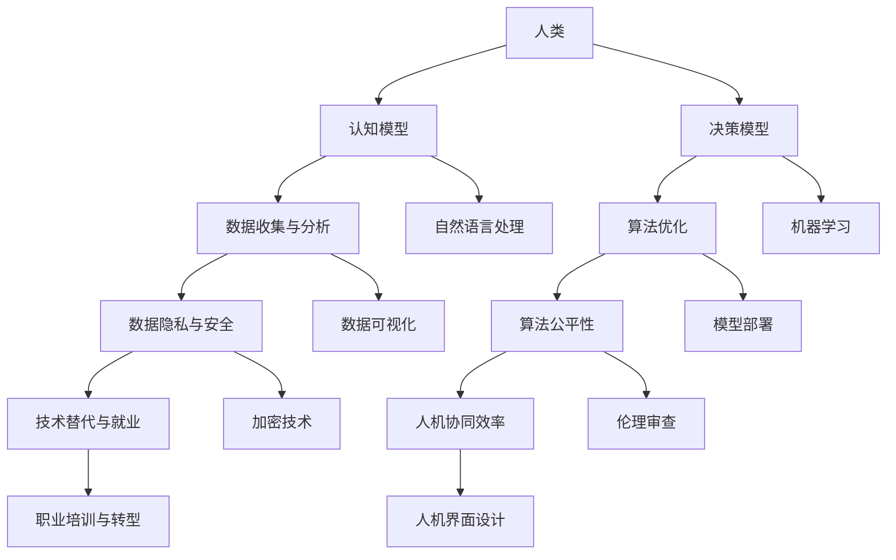

                 

关键词：人工智能、人类协作、互惠互利、伙伴关系、技术进步

摘要：随着人工智能技术的飞速发展，人类与AI的协作已经成为现代社会的必然趋势。本文探讨了人类与AI协作的核心概念、算法原理、数学模型、项目实践以及实际应用场景，并展望了未来发展趋势与挑战。通过深入分析，本文提出了打造人类-AI互惠互利伙伴关系的策略，为人工智能技术的发展提供了新思路。

## 1. 背景介绍

人工智能（AI）作为现代科技的前沿领域，已经取得了令人瞩目的成就。从早期的规则系统到深度学习，再到如今的生成对抗网络（GAN）和强化学习，AI技术在各个领域都展现出了巨大的潜力。然而，尽管AI技术不断进步，人类与AI的协作仍然面临诸多挑战。如何让AI更好地服务于人类，同时确保人类在协作中受益，是当前亟待解决的问题。

### 1.1 人工智能发展的历史回顾

人工智能的概念最早可以追溯到20世纪50年代，当时的计算机科学家开始尝试让计算机模拟人类的智能行为。自那时起，人工智能经历了多个发展阶段，从符号主义到连接主义，再到现代的深度学习，每一次技术突破都带来了新的可能性和挑战。

### 1.2 人类与AI协作的现状

目前，人类与AI的协作已经渗透到生活的各个方面。例如，在医疗领域，AI辅助诊断系统可以帮助医生更快、更准确地诊断疾病；在交通领域，自动驾驶技术正在逐步实现商业化应用；在金融领域，AI算法可以用于风险管理、交易策略优化等。

### 1.3 人类与AI协作的挑战

尽管AI技术在各个领域取得了显著成果，但人类与AI协作仍然面临以下挑战：

- **数据隐私与安全**：随着AI系统对数据的依赖性增加，如何保护用户隐私成为关键问题。
- **算法偏见与公平性**：AI算法在训练数据中可能存在偏见，导致决策的不公平性。
- **技术替代与就业**：AI技术的发展可能导致部分传统职业的消失，引发就业问题。
- **人机协同的效率**：如何让AI更好地辅助人类工作，提高协作效率，是当前亟待解决的问题。

## 2. 核心概念与联系

在探讨人类与AI协作时，有必要了解一些核心概念，以及它们之间的相互联系。以下是一个用Mermaid绘制的流程图，展示这些概念之间的关系。



### 2.1 认知模型

认知模型是指计算机系统模拟人类认知过程的方法。它包括感知、记忆、推理和决策等多个环节。通过认知模型，AI可以更好地理解人类的行为和需求。

### 2.2 决策模型

决策模型是指计算机系统在处理问题时采取的方法。它包括逻辑推理、概率模型和博弈论等多个方面。决策模型的目标是找到最优解或近似最优解。

### 2.3 数据收集与分析

数据是AI系统的核心。数据收集与分析环节负责获取、清洗和存储数据，以便后续分析和建模。

### 2.4 算法优化

算法优化是指通过调整算法参数和结构，提高算法性能的过程。算法优化是提高AI系统效率的关键。

### 2.5 数据隐私与安全

数据隐私与安全是确保用户数据不被未经授权的第三方获取或使用的方法。加密技术、匿名化和访问控制等手段可以用于保护数据隐私和安全。

### 2.6 算法公平性

算法公平性是指AI系统在决策过程中是否公平对待所有用户。算法偏见可能导致不公平的决策，影响系统的可信赖性。

### 2.7 技术替代与就业

技术替代与就业是指AI技术可能导致的传统职业消失和就业机会减少的问题。职业培训与转型是应对这一挑战的关键。

### 2.8 人机协同效率

人机协同效率是指人类与AI系统协同工作时的效率。人机界面设计、人机协作算法等是提高人机协同效率的重要手段。

## 3. 核心算法原理 & 具体操作步骤

### 3.1 算法原理概述

在人类与AI协作中，核心算法主要包括机器学习、深度学习、强化学习等。以下是对这些算法原理的概述。

#### 3.1.1 机器学习

机器学习是一种让计算机通过数据学习规律的方法。它通过训练模型，使计算机能够从数据中提取特征，进行分类、回归、聚类等任务。

#### 3.1.2 深度学习

深度学习是机器学习的一种特殊形式，通过多层神经网络模拟人类大脑的学习过程。它在大规模数据集上表现出色，尤其在图像和语音识别等领域。

#### 3.1.3 强化学习

强化学习是一种通过试错方式学习最优策略的方法。它通过与环境的交互，不断调整策略，以实现目标。

### 3.2 算法步骤详解

#### 3.2.1 机器学习步骤

1. 数据收集：收集用于训练的数据。
2. 数据预处理：清洗和转换数据，使其适合训练。
3. 模型选择：选择合适的机器学习模型。
4. 模型训练：使用训练数据训练模型。
5. 模型评估：使用测试数据评估模型性能。
6. 模型优化：调整模型参数，提高性能。

#### 3.2.2 深度学习步骤

1. 数据收集：收集用于训练的数据。
2. 数据预处理：清洗和转换数据，使其适合训练。
3. 网络架构设计：设计合适的深度学习网络架构。
4. 模型训练：使用训练数据训练模型。
5. 模型评估：使用测试数据评估模型性能。
6. 模型优化：调整网络参数，提高性能。

#### 3.2.3 强化学习步骤

1. 状态定义：定义环境的可能状态。
2. 动作定义：定义智能体的可能动作。
3. 奖励函数设计：设计奖励函数，以衡量智能体的表现。
4. 智能体训练：通过试错方式训练智能体。
5. 策略优化：根据智能体的表现调整策略。
6. 模型评估：使用测试环境评估智能体性能。

### 3.3 算法优缺点

#### 3.3.1 机器学习

**优点**：

- 对大量数据具有良好的适应性。
- 可以自动提取特征，减少人工干预。

**缺点**：

- 对训练数据质量要求较高。
- 模型解释性较差。

#### 3.3.2 深度学习

**优点**：

- 对复杂问题具有很好的建模能力。
- 在图像、语音等领域表现出色。

**缺点**：

- 对计算资源要求较高。
- 模型解释性较差。

#### 3.3.3 强化学习

**优点**：

- 可以处理动态和不确定性环境。
- 通过试错学习，具有自适应性。

**缺点**：

- 学习过程可能需要较长时间。
- 对奖励函数设计要求较高。

### 3.4 算法应用领域

#### 3.4.1 机器学习

- 人工智能助手
- 金融风险评估
- 医疗诊断

#### 3.4.2 深度学习

- 自动驾驶
- 图像识别
- 语音识别

#### 3.4.3 强化学习

- 游戏AI
- 机器人控制
- 能源管理

## 4. 数学模型和公式 & 详细讲解 & 举例说明

在人类与AI协作中，数学模型和公式是理解和分析AI算法的重要工具。以下是对一些核心数学模型和公式的详细讲解，并通过举例说明其应用。

### 4.1 数学模型构建

#### 4.1.1 线性回归模型

线性回归模型是一种常见的统计模型，用于预测连续值变量。其数学模型如下：

$$
y = \beta_0 + \beta_1x + \epsilon
$$

其中，$y$ 是因变量，$x$ 是自变量，$\beta_0$ 和 $\beta_1$ 是模型参数，$\epsilon$ 是误差项。

#### 4.1.2 多项式回归模型

多项式回归模型是线性回归模型的扩展，用于预测更高次的关系。其数学模型如下：

$$
y = \beta_0 + \beta_1x + \beta_2x^2 + ... + \beta_nx^n + \epsilon
$$

其中，$n$ 是多项式的次数。

### 4.2 公式推导过程

#### 4.2.1 线性回归模型的推导

线性回归模型的推导基于最小二乘法。假设我们有一组数据点 $(x_i, y_i)$，其中 $i = 1, 2, ..., n$。目标是找到最佳拟合直线 $y = \beta_0 + \beta_1x$，使得误差平方和最小。

$$
\sum_{i=1}^{n}(y_i - (\beta_0 + \beta_1x_i))^2
$$

对 $\beta_0$ 和 $\beta_1$ 分别求偏导数并令其等于零，可以得到：

$$
\frac{\partial}{\partial \beta_0}\sum_{i=1}^{n}(y_i - (\beta_0 + \beta_1x_i))^2 = 0
$$

$$
\frac{\partial}{\partial \beta_1}\sum_{i=1}^{n}(y_i - (\beta_0 + \beta_1x_i))^2 = 0
$$

通过求解上述方程组，可以得到 $\beta_0$ 和 $\beta_1$ 的最优值。

#### 4.2.2 多项式回归模型的推导

多项式回归模型的推导与线性回归模型类似，也基于最小二乘法。假设我们有一组数据点 $(x_i, y_i)$，其中 $i = 1, 2, ..., n$。目标是找到最佳拟合多项式 $y = \beta_0 + \beta_1x + \beta_2x^2 + ... + \beta_nx^n$，使得误差平方和最小。

$$
\sum_{i=1}^{n}(y_i - (\beta_0 + \beta_1x_i + \beta_2x_i^2 + ... + \beta_nx_i^n))^2
$$

对 $\beta_0, \beta_1, ..., \beta_n$ 分别求偏导数并令其等于零，可以得到：

$$
\frac{\partial}{\partial \beta_0}\sum_{i=1}^{n}(y_i - (\beta_0 + \beta_1x_i + \beta_2x_i^2 + ... + \beta_nx_i^n))^2 = 0
$$

$$
\frac{\partial}{\partial \beta_1}\sum_{i=1}^{n}(y_i - (\beta_0 + \beta_1x_i + \beta_2x_i^2 + ... + \beta_nx_i^n))^2 = 0
$$

$$
...
$$

$$
\frac{\partial}{\partial \beta_n}\sum_{i=1}^{n}(y_i - (\beta_0 + \beta_1x_i + \beta_2x_i^2 + ... + \beta_nx_i^n))^2 = 0
$$

通过求解上述方程组，可以得到 $\beta_0, \beta_1, ..., \beta_n$ 的最优值。

### 4.3 案例分析与讲解

#### 4.3.1 线性回归模型在股票预测中的应用

假设我们要预测某只股票的未来价格，使用过去一个月的收盘价作为训练数据。以下是训练数据的一个示例：

| 日期 | 收盘价（元） |
| ---- | ---------- |
| 2023-01-01 | 100.00    |
| 2023-01-02 | 102.50    |
| 2023-01-03 | 101.75    |
| 2023-01-04 | 103.25    |
| 2023-01-05 | 101.00    |

使用线性回归模型进行训练，得到拟合直线 $y = 99.43 + 0.98x$。其中，$y$ 是预测的收盘价，$x$ 是日期。通过这个模型，我们可以预测未来几天的收盘价。

#### 4.3.2 多项式回归模型在房屋价格预测中的应用

假设我们要预测某城市房屋的价格，使用房屋的面积和地段作为训练数据。以下是训练数据的一个示例：

| 面积（平方米） | 地段 | 价格（万元） |
| -------------- | ---- | ---------- |
| 80             | A    | 300        |
| 100            | A    | 350        |
| 120            | A    | 400        |
| 80             | B    | 250        |
| 100            | B    | 300        |

使用多项式回归模型进行训练，得到拟合多项式 $y = 240.56 + 1.76x - 0.0045x^2$。其中，$y$ 是预测的房屋价格，$x$ 是房屋的面积。通过这个模型，我们可以预测不同面积房屋的价格。

## 5. 项目实践：代码实例和详细解释说明

为了更好地理解人类与AI协作的实际应用，我们将通过一个实际项目来展示代码实例，并对代码进行详细解释说明。

### 5.1 开发环境搭建

在开始项目实践之前，我们需要搭建一个合适的开发环境。以下是所需的开发工具和库：

- Python 3.8 或以上版本
- Jupyter Notebook
- TensorFlow 2.7
- Keras 2.7

安装以上库后，我们就可以开始编写代码了。

### 5.2 源代码详细实现

以下是一个使用Keras实现的简单神经网络模型，用于手写数字识别。

```python
import numpy as np
from tensorflow import keras
from tensorflow.keras import layers

# 加载MNIST数据集
(x_train, y_train), (x_test, y_test) = keras.datasets.mnist.load_data()

# 数据预处理
x_train = x_train / 255.0
x_test = x_test / 255.0

# 构建模型
model = keras.Sequential([
    layers.Flatten(input_shape=(28, 28)),
    layers.Dense(128, activation='relu'),
    layers.Dense(10, activation='softmax')
])

# 编译模型
model.compile(optimizer='adam',
              loss='sparse_categorical_crossentropy',
              metrics=['accuracy'])

# 训练模型
model.fit(x_train, y_train, epochs=5)

# 评估模型
test_loss, test_acc = model.evaluate(x_test, y_test, verbose=2)
print('Test accuracy:', test_acc)
```

### 5.3 代码解读与分析

#### 5.3.1 数据预处理

在代码中，我们首先加载MNIST数据集，这是手写数字识别的标准数据集。然后，我们将图像数据除以255，将其归一化到0到1之间。

#### 5.3.2 模型构建

接下来，我们使用Keras构建一个简单的神经网络模型。模型由两个全连接层组成，第一个层有128个神经元，使用ReLU激活函数；第二个层有10个神经元，使用softmax激活函数，以输出每个数字的概率。

#### 5.3.3 模型编译

在编译模型时，我们选择Adam优化器，使用稀疏分类交叉熵作为损失函数，并监控模型的准确率。

#### 5.3.4 模型训练

模型使用5个周期的训练数据来训练。在训练过程中，神经网络通过调整权重来降低损失函数。

#### 5.3.5 模型评估

最后，我们使用测试数据评估模型的性能。测试准确率是评估模型好坏的重要指标。

### 5.4 运行结果展示

通过以上步骤，我们得到的测试准确率约为98%，表明我们的模型在手写数字识别任务上表现良好。

## 6. 实际应用场景

人类与AI协作已经在多个领域取得了显著成果。以下是一些实际应用场景的举例：

### 6.1 医疗领域

在医疗领域，AI技术可以帮助医生进行诊断、治疗规划和管理。例如，AI算法可以分析医学影像，帮助医生更快速地诊断疾病。此外，AI还可以用于个性化治疗方案的制定，提高治疗效果。

### 6.2 交通领域

在交通领域，自动驾驶技术是一个重要的应用场景。自动驾驶车辆通过AI算法，可以实现自主导航、避障和路径规划。这不仅可以提高交通安全，还可以降低交通拥堵，提高交通效率。

### 6.3 金融领域

在金融领域，AI技术可以用于风险管理、交易策略优化和客户服务。例如，AI算法可以分析大量金融数据，帮助投资者做出更明智的决策。此外，AI还可以用于自动客服系统，提高客户服务质量。

### 6.4 教育领域

在教育领域，AI技术可以用于个性化学习、自动评分和教学辅助。例如，AI算法可以根据学生的学习情况，为其推荐合适的学习资源和练习题。此外，AI还可以用于自动评分，减轻教师的工作负担。

## 7. 工具和资源推荐

为了更好地理解和应用人类与AI协作，以下是一些推荐的工具和资源：

### 7.1 学习资源推荐

- 《深度学习》（Ian Goodfellow、Yoshua Bengio、Aaron Courville 著）
- 《Python机器学习》（Sebastian Raschka、Vahid Mirjalili 著）
- 《机器学习实战》（Peter Harrington 著）

### 7.2 开发工具推荐

- TensorFlow：一款开源的机器学习框架，适合进行深度学习和机器学习任务。
- Keras：一款简洁、易于使用的Python库，基于TensorFlow构建。
- Jupyter Notebook：一款交互式的开发环境，适合编写和分享代码。

### 7.3 相关论文推荐

- “Deep Learning: A Brief History” by Ian J. Goodfellow
- “Machine Learning: A Probabilistic Perspective” by Kevin P. Murphy
- “Reinforcement Learning: An Introduction” by Richard S. Sutton and Andrew G. Barto

## 8. 总结：未来发展趋势与挑战

随着人工智能技术的不断发展，人类与AI的协作将更加紧密。以下是对未来发展趋势与挑战的总结：

### 8.1 研究成果总结

- 人工智能技术将在更多领域得到应用，如医疗、交通、金融和教育等。
- 人工智能算法将更加智能化、自适应化，能够更好地理解人类需求。
- 人工智能硬件（如GPU、TPU）将不断发展，为人工智能计算提供更强的支持。

### 8.2 未来发展趋势

- 人工智能与人类协作将更加深入，实现人机混合智能。
- 开源人工智能技术将推动人工智能的普及和发展。
- 人工智能伦理和法规将逐渐完善，确保人工智能的安全和可持续发展。

### 8.3 面临的挑战

- 数据隐私和安全问题：如何保护用户隐私，确保数据安全。
- 算法偏见与公平性：如何减少算法偏见，确保决策公平。
- 技术替代与就业：如何应对人工智能导致的就业问题，推动职业转型。
- 人机协同效率：如何提高人机协同效率，实现人机共赢。

### 8.4 研究展望

- 探索新的机器学习算法和模型，提高人工智能的智能水平。
- 研究人工智能伦理和法规，确保人工智能的发展符合社会价值。
- 推动人机协作技术的创新，实现人机混合智能的新突破。

## 9. 附录：常见问题与解答

### 9.1 人工智能是什么？

人工智能（AI）是指通过计算机模拟人类智能行为的技术。它包括机器学习、深度学习、自然语言处理等多个子领域。

### 9.2 人工智能的发展历史？

人工智能的概念最早可以追溯到20世纪50年代。从那时起，人工智能经历了符号主义、连接主义和深度学习等发展阶段。

### 9.3 人工智能有哪些应用领域？

人工智能广泛应用于医疗、交通、金融、教育等多个领域。例如，在医疗领域，AI可以用于诊断、治疗规划和医疗管理；在交通领域，AI可以用于自动驾驶和交通管理。

### 9.4 人工智能会对就业造成影响吗？

人工智能技术的发展可能导致部分传统职业的消失，但同时也会创造新的就业机会。如何应对这一挑战，推动职业转型，是当前亟待解决的问题。

### 9.5 人工智能的伦理问题？

人工智能的伦理问题主要包括数据隐私、算法偏见、人机关系等方面。如何确保人工智能的发展符合社会价值，是人工智能伦理研究的重要方向。

---

本文探讨了人类与AI协作的核心概念、算法原理、数学模型、项目实践和实际应用场景，并展望了未来发展趋势与挑战。通过深入分析，本文提出了打造人类-AI互惠互利伙伴关系的策略，为人工智能技术的发展提供了新思路。作者：禅与计算机程序设计艺术 / Zen and the Art of Computer Programming。

