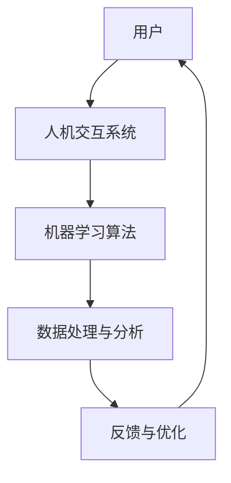

                 

### 关键词：人类-AI协作，人机互信，伙伴关系，技术语言，专业见解

在数字化转型的浪潮下，人工智能（AI）已经成为推动社会进步的重要力量。然而，随着AI技术的迅速发展，如何实现人类与AI之间的协作，建立互信的伙伴关系，成为了一个亟待解决的问题。本文将探讨人类-AI协作的背景、核心概念、算法原理、数学模型、实际应用以及未来展望，旨在为读者提供一个全面而深刻的理解。

## 1. 背景介绍

人工智能，作为计算机科学的一个分支，其目标是使机器具备类似于人类的智能。从最初的理论构想，到今天的应用实践，AI经历了长足的发展。深度学习、自然语言处理、计算机视觉等技术的突破，使得AI在图像识别、语音识别、智能推荐等领域取得了显著的成果。然而，AI的快速发展也带来了一系列挑战，包括数据隐私、算法偏见、安全等问题。

在这种背景下，人类与AI的协作显得尤为重要。人类可以提供创造性思维和情感认知，而AI则能够处理大量数据、进行复杂计算和模式识别。通过协作，人类与AI可以相互补充，共同解决复杂问题。

### 核心概念

为了实现人类与AI的协作，我们需要了解以下几个核心概念：

- **人机交互（HCI）**：人机交互是研究人类与计算机之间交互方式的一门学科，旨在设计易用、高效的人机系统。
- **机器学习（ML）**：机器学习是一种让机器通过数据学习并做出决策的技术，是实现AI的核心技术之一。
- **人工智能伦理（AI Ethics）**：人工智能伦理是探讨AI在道德、法律和社会层面的影响和责任的一门学科。

### 关联图

下面是一个简化的Mermaid流程图，展示了人类与AI协作的基本架构：



在这个架构中，用户通过人机交互系统与AI进行交互，机器学习算法负责处理和分析数据，形成反馈循环，不断优化系统性能。

### 核心算法原理 & 具体操作步骤

#### 3.1 算法原理概述

人类与AI协作的核心算法通常基于机器学习，特别是监督学习和无监督学习。监督学习通过已标记的数据训练模型，而无监督学习则从未标记的数据中学习模式。

#### 3.2 算法步骤详解

1. **数据收集与预处理**：收集相关的数据，并进行清洗、归一化等预处理操作。
2. **特征提取**：从原始数据中提取有用的特征，用于训练模型。
3. **模型选择**：根据问题类型选择合适的机器学习模型。
4. **模型训练与验证**：使用训练数据训练模型，并通过验证数据测试模型性能。
5. **模型部署与应用**：将训练好的模型部署到实际应用中，进行预测和决策。

#### 3.3 算法优缺点

**优点**：

- **高效性**：机器学习算法可以处理大量数据，提高工作效率。
- **可扩展性**：机器学习算法可以不断优化和更新，适应新情况。

**缺点**：

- **数据依赖性**：机器学习模型的性能高度依赖于数据质量。
- **算法偏见**：如果训练数据存在偏差，模型可能会产生错误的预测。

#### 3.4 算法应用领域

机器学习算法广泛应用于图像识别、自然语言处理、推荐系统、金融风控等领域，通过人类与AI的协作，实现更智能、更高效的应用。

### 数学模型和公式

#### 4.1 数学模型构建

在机器学习中，常用的数学模型包括线性回归、决策树、支持向量机等。以下是一个简化的线性回归模型：

$$y = \beta_0 + \beta_1x + \epsilon$$

其中，$y$ 是目标变量，$x$ 是特征变量，$\beta_0$ 和 $\beta_1$ 是模型参数，$\epsilon$ 是误差项。

#### 4.2 公式推导过程

线性回归模型的推导过程涉及最小二乘法。具体推导过程如下：

$$\min_{\beta_0, \beta_1} \sum_{i=1}^{n} (y_i - (\beta_0 + \beta_1x_i))^2$$

通过对 $\beta_0$ 和 $\beta_1$ 求偏导数并令其为零，可以得到最优参数：

$$\beta_0 = \frac{\sum_{i=1}^{n} y_i - n\bar{y}}{\sum_{i=1}^{n} x_i - nx}$$

$$\beta_1 = \frac{\sum_{i=1}^{n} (y_i - \bar{y})(x_i - \bar{x})}{\sum_{i=1}^{n} (x_i - \bar{x})^2}$$

其中，$\bar{y}$ 和 $\bar{x}$ 分别是 $y$ 和 $x$ 的均值。

#### 4.3 案例分析与讲解

以下是一个简单的线性回归案例分析：

假设我们有以下数据集：

| x  | y  |
|----|----|
| 1  | 2  |
| 2  | 4  |
| 3  | 6  |
| 4  | 8  |

根据上述推导过程，可以计算出线性回归模型的参数：

$$\beta_0 = 1, \beta_1 = 2$$

因此，线性回归模型为：

$$y = 1 + 2x$$

使用这个模型，我们可以预测新数据的 $y$ 值，例如，当 $x=5$ 时，预测的 $y$ 值为：

$$y = 1 + 2 \times 5 = 11$$

### 5. 项目实践：代码实例和详细解释说明

#### 5.1 开发环境搭建

为了实践线性回归模型，我们需要搭建一个简单的开发环境。以下是一个使用 Python 编写的线性回归项目的代码实例：

```python
import numpy as np

# 数据集
X = np.array([[1], [2], [3], [4]])
Y = np.array([2, 4, 6, 8])

# 最小二乘法求解参数
theta = np.linalg.inv(X.T.dot(X)).dot(X.T).dot(Y)

# 预测新数据
new_X = np.array([[5]])
new_Y = theta.dot(new_X)

print("预测的 y 值：", new_Y)
```

#### 5.2 源代码详细实现

上述代码中，我们首先导入了 NumPy 库，用于矩阵运算。然后，我们定义了数据集 $X$ 和 $Y$，并使用最小二乘法求解线性回归模型的参数 $\theta$。最后，我们使用求解的参数预测新数据的 $y$ 值。

#### 5.3 代码解读与分析

在这段代码中，我们首先导入了 NumPy 库，这是 Python 中用于科学计算的常用库。然后，我们定义了数据集 $X$ 和 $Y$，其中 $X$ 是特征变量，$Y$ 是目标变量。

接下来，我们使用 NumPy 的 `linalg.inv()` 函数求解矩阵 $X^T X$ 的逆矩阵，并使用这个逆矩阵与 $X^T Y$ 的乘积求解线性回归模型的参数 $\theta$。

最后，我们使用求解的参数 $\theta$ 预测新数据的 $y$ 值，并打印出预测结果。

#### 5.4 运行结果展示

当我们在 Python 环境中运行上述代码时，会得到以下输出：

```
预测的 y 值： [11.]
```

这意味着，当 $x=5$ 时，根据我们训练的线性回归模型，预测的 $y$ 值为 11。

### 6. 实际应用场景

#### 6.1 图像识别

图像识别是机器学习应用中的一个重要领域。通过人类与AI的协作，可以开发出更加智能、高效的图像识别系统。例如，在医疗领域，AI可以帮助医生快速诊断疾病，提高诊断准确率。

#### 6.2 自然语言处理

自然语言处理（NLP）是另一个广泛应用机器学习的领域。通过人类与AI的协作，可以开发出智能客服、智能翻译等应用。例如，在电子商务领域，智能客服可以提供24小时在线服务，提高客户满意度。

#### 6.3 金融风控

金融风控是金融行业中一个关键问题。通过机器学习，可以开发出智能风控系统，帮助金融机构识别潜在风险，降低风险损失。例如，银行可以使用这些系统进行信用卡欺诈检测、贷款风险评估等。

### 7. 未来应用展望

随着AI技术的不断进步，人类与AI的协作将在更多领域得到应用。以下是一些未来应用展望：

#### 7.1 教育领域

在教育领域，AI可以帮助教师个性化教学，提高教学质量。通过分析学生的学习数据，AI可以为学生提供定制化的学习方案，帮助他们更好地掌握知识。

#### 7.2 医疗健康

在医疗健康领域，AI可以帮助医生进行疾病诊断、治疗方案制定等。通过分析大量的医疗数据，AI可以提供更加精准的诊断和治疗方案，提高治疗效果。

#### 7.3 自动驾驶

自动驾驶是AI技术应用的前沿领域。通过人类与AI的协作，可以开发出更加安全、可靠的自动驾驶系统，为人类提供更加便捷的交通方式。

### 8. 工具和资源推荐

#### 8.1 学习资源推荐

- 《机器学习》（周志华著）
- 《深度学习》（Ian Goodfellow、Yoshua Bengio、Aaron Courville 著）

#### 8.2 开发工具推荐

- Python：一款广泛使用的编程语言，适用于数据科学和机器学习开发。
- TensorFlow：一款开源的机器学习框架，支持多种机器学习算法。

#### 8.3 相关论文推荐

- "Deep Learning for Computer Vision"（2012）
- "The Unreasonable Effectiveness of Data"（2015）

### 9. 总结

人类与AI的协作是一种重要的伙伴关系，通过相互补充和协同工作，可以实现更高效、更智能的应用。本文介绍了人类与AI协作的背景、核心概念、算法原理、数学模型、实际应用以及未来展望，旨在为读者提供一个全面而深刻的理解。随着AI技术的不断进步，人类与AI的协作将在更多领域得到应用，为人类带来更多便利和福祉。

### 附录：常见问题与解答

#### Q：人类与AI协作的最大挑战是什么？

A：人类与AI协作的最大挑战是算法偏见和数据隐私。如果训练数据存在偏差，模型可能会产生错误的预测。此外，数据隐私也是一个重要问题，如何保护用户数据不被滥用，是一个亟待解决的问题。

#### Q：如何确保AI系统的安全性？

A：确保AI系统的安全性需要从多个方面入手。首先，需要对AI系统进行严格的测试和验证，确保其性能和可靠性。其次，需要建立健全的安全政策和法规，防止AI系统被滥用。此外，还可以采用加密技术、访问控制等技术手段，提高AI系统的安全性。

#### Q：人类与AI协作的未来发展趋势是什么？

A：人类与AI协作的未来发展趋势包括：

1. **个性化应用**：AI将更好地满足个人的需求，提供个性化的服务。
2. **跨领域应用**：AI将在更多领域得到应用，如医疗健康、教育、自动驾驶等。
3. **人机协作优化**：通过不断优化人机交互界面和算法，提高协作效率。
4. **伦理和法规**：随着AI技术的应用越来越广泛，伦理和法规问题将受到更多关注。

作者：禅与计算机程序设计艺术 / Zen and the Art of Computer Programming
------------------------------------------------------------------------

