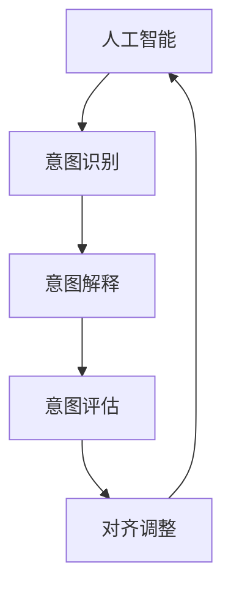
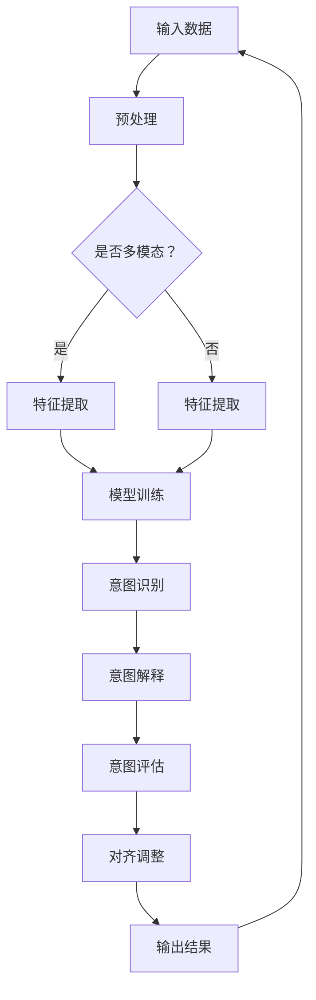

                 

随着人工智能（AI）技术的快速发展，其应用已经渗透到我们日常生活的方方面面。然而，在AI技术不断进步的同时，如何确保AI系统与人类意图的对齐，成为了AI领域面临的一项重大挑战。本文将从多个角度探讨人类意图对齐的必要性、核心概念、算法原理、应用领域，以及未来发展趋势和面临的挑战。

## 文章关键词

- 人工智能
- 人类意图对齐
- AI伦理
- 机器学习
- 意图理解
- 对齐算法

## 文章摘要

本文首先介绍了人类意图对齐在AI领域的必要性，随后探讨了核心概念和联系。接着，文章详细阐述了核心算法原理、数学模型及公式，并通过项目实践展示了具体应用。随后，文章分析了实际应用场景和未来展望，并推荐了相关学习资源和开发工具。最后，文章总结了研究成果、未来发展趋势和面临的挑战，以及对常见问题的解答。

## 1. 背景介绍

随着AI技术的不断发展，AI系统在图像识别、自然语言处理、自动驾驶等领域取得了显著的成果。然而，AI系统的运作往往基于大量数据和算法模型，这些模型在训练过程中可能难以充分理解人类的意图。例如，自动驾驶汽车在面临复杂交通环境时，可能无法准确判断行人的意图，从而导致潜在的安全隐患。此外，AI在金融、医疗等领域的应用也面临着类似的问题。这些现象引发了人们对AI伦理和责任问题的关注，人类意图对齐成为了AI领域的一个热点话题。

### 1.1 人类意图对齐的重要性

人类意图对齐在AI领域的意义主要体现在以下几个方面：

1. **确保安全性**：AI系统在执行任务时，必须确保与人类意图一致，以避免因错误判断导致的意外事件。
2. **提高用户体验**：AI系统能够更好地理解人类的意图，能够提供更加个性化和贴近用户需求的服务。
3. **遵守伦理规范**：随着AI技术的普及，确保其遵守伦理规范，保护个人隐私和信息安全，具有重要意义。
4. **推动AI可持续发展**：人类意图对齐有助于促进AI技术的健康发展，避免因误用导致的负面影响。

### 1.2 人类意图对齐的现状和挑战

尽管人类意图对齐在AI领域引起了广泛关注，但目前仍面临诸多挑战。首先，人类的意图往往复杂多变，难以用简单的算法模型进行准确描述。其次，AI系统在处理大量数据时，可能会受到数据偏差和噪声的影响，导致意图理解不准确。此外，不同文化和背景的人可能有不同的意图表达方式，这进一步增加了人类意图对齐的难度。

### 1.3 人类意图对齐的研究方向和趋势

为了解决人类意图对齐的挑战，研究者们从多个角度展开了研究。一方面，通过改进机器学习算法，提高AI系统对人类意图的理解能力；另一方面，探索人机交互技术，使得AI系统能够更好地与人类进行沟通和协作。未来，人类意图对齐的研究将继续深入，结合多模态数据、深度学习和自然语言处理等技术，实现更加精准的意图识别和解释。

## 2. 核心概念与联系

### 2.1 核心概念

在探讨人类意图对齐之前，我们需要了解以下几个核心概念：

1. **人工智能**：一种模拟人类智能的计算机系统，能够通过学习和理解数据，执行特定任务。
2. **人类意图**：人类在执行某项任务时的目标和愿望，通常包含行动意图、认知意图和情感意图。
3. **意图识别**：通过分析人类的行为和语言，识别其意图的过程。
4. **对齐**：将AI系统的理解和预测与人类的意图相一致的过程。

### 2.2 概念联系

人类意图对齐涉及到多个核心概念之间的相互作用。以下是一个简化的Mermaid流程图，展示了这些概念之间的联系：



### 2.3 Mermaid流程图



## 3. 核心算法原理 & 具体操作步骤

### 3.1 算法原理概述

人类意图对齐的算法原理主要包括以下几部分：

1. **数据预处理**：对原始数据进行清洗、归一化和特征提取，为后续模型训练提供高质量的数据集。
2. **模型训练**：使用机器学习算法对特征数据进行分析和分类，训练出一个能够识别和解释人类意图的模型。
3. **意图评估**：将模型输出的意图解释与人类实际意图进行对比，评估模型对齐效果。
4. **对齐调整**：根据意图评估结果，调整模型参数，以提高对齐精度。

### 3.2 算法步骤详解

1. **数据预处理**：
   - 清洗：去除数据中的噪声、异常值和重复记录。
   - 归一化：将不同特征的数据进行归一化处理，使其具有相同的量纲。
   - 特征提取：从原始数据中提取对意图识别有用的特征。

2. **模型训练**：
   - 选择合适的机器学习算法，如支持向量机（SVM）、决策树、随机森林等。
   - 训练模型：使用训练集数据对模型进行训练，优化模型参数。
   - 模型评估：使用验证集数据对模型进行评估，确保模型具有良好的泛化能力。

3. **意图评估**：
   - 对模型输出的意图解释进行评估，与人类实际意图进行对比。
   - 使用评价指标（如准确率、召回率、F1值等）评估模型对齐效果。

4. **对齐调整**：
   - 根据意图评估结果，调整模型参数，以提高对齐精度。
   - 重新训练模型，并重复意图评估和调整过程，直至达到满意的对齐效果。

### 3.3 算法优缺点

**优点**：

- **高效性**：算法能够快速地对人类意图进行识别和解释，提高系统的响应速度。
- **灵活性**：算法可以根据不同场景和需求进行调整，适应不同的对齐任务。
- **可扩展性**：算法可以处理多种数据类型和模态，具有较好的可扩展性。

**缺点**：

- **准确性**：由于人类意图的复杂性和多变性，算法在识别和解释意图时可能存在一定的误差。
- **计算成本**：算法训练和评估过程可能需要大量的计算资源，特别是在处理大规模数据时。

### 3.4 算法应用领域

人类意图对齐算法在多个领域具有广泛的应用前景，包括：

- **自动驾驶**：通过识别和理解行人和其他交通参与者的意图，提高自动驾驶系统的安全性。
- **智能客服**：通过理解用户的意图，提供更加个性化和服务质量的客服体验。
- **智能家居**：通过理解用户的生活习惯和需求，实现智能家居设备的自动化控制和优化。
- **医疗诊断**：通过分析患者的病史和症状，辅助医生进行诊断和治疗决策。

## 4. 数学模型和公式 & 详细讲解 & 举例说明

### 4.1 数学模型构建

在人类意图对齐的算法中，常用的数学模型包括支持向量机（SVM）、决策树、神经网络等。以下以支持向量机为例，介绍数学模型的构建过程。

1. **假设**：

   - 输入特征向量 $X \in \mathbb{R}^n$，其中 $n$ 是特征维度。
   - 标签 $y \in \{-1, +1\}$，表示人类意图的正负。

2. **目标函数**：

   目标是找到一个超平面 $w \in \mathbb{R}^n$ 和偏置项 $b \in \mathbb{R}$，使得：

   $$ \text{max} \frac{1}{||w||} \text{subject to} y_i ( \langle w , x_i \rangle + b ) \geq 1 $$

3. **优化过程**：

   使用拉格朗日乘子法求解上述问题，得到：

   $$ \min_{w,b,\alpha} \frac{1}{2} ||w||^2 - \sum_{i=1}^{n} \alpha_i (y_i ( \langle w , x_i \rangle + b ) - 1) $$

   其中，$\alpha_i$ 是拉格朗日乘子。

4. **解的表达式**：

   通过求解上述优化问题，得到：

   $$ w = \sum_{i=1}^{n} \alpha_i y_i x_i $$
   $$ b = y - \sum_{i=1}^{n} \alpha_i y_i $$

### 4.2 公式推导过程

以下是支持向量机（SVM）的推导过程：

1. **最大间隔分类器**：

   假设训练集为 $\{ (x_1, y_1), (x_2, y_2), \ldots, (x_n, y_n) \}$，其中 $x_i \in \mathbb{R}^n$，$y_i \in \{-1, +1\}$。

   目标是找到一个超平面 $w$ 和偏置项 $b$，使得：

   $$ \text{max} \frac{1}{||w||} \text{subject to} y_i ( \langle w , x_i \rangle + b ) \geq 1 $$

2. **拉格朗日乘子法**：

   引入拉格朗日乘子 $\alpha_i \geq 0$，构建拉格朗日函数：

   $$ L(w,b,\alpha) = \frac{1}{2} ||w||^2 - \sum_{i=1}^{n} \alpha_i [ y_i ( \langle w , x_i \rangle + b ) - 1 ] $$

3. **KKT条件**：

   为满足KKT条件，需要满足以下三个条件：

   - $\alpha_i \geq 0$
   - $y_i ( \langle w , x_i \rangle + b ) - 1 \geq 0$
   - $\alpha_i [ y_i ( \langle w , x_i \rangle + b ) - 1 ] = 0$

4. **求解**：

   对拉格朗日函数求导并令导数为0，得到：

   $$ \frac{\partial L}{\partial w} = w - \sum_{i=1}^{n} \alpha_i y_i x_i = 0 $$
   $$ \frac{\partial L}{\partial b} = - \sum_{i=1}^{n} \alpha_i y_i = 0 $$

   结合上述方程，得到：

   $$ w = \sum_{i=1}^{n} \alpha_i y_i x_i $$
   $$ b = y - \sum_{i=1}^{n} \alpha_i y_i $$

   由于 $\alpha_i$ 必须满足 $\alpha_i [ y_i ( \langle w , x_i \rangle + b ) - 1 ] = 0$，因此可以得到：

   $$ y_i ( \langle w , x_i \rangle + b ) - 1 = 0 $$

   由此，可以得到分类决策函数：

   $$ f(x) = \text{sign}(\langle w , x \rangle + b) $$

### 4.3 案例分析与讲解

以下是一个简单的支持向量机案例，用于二分类问题：

**数据集**：

| 样本索引 | 特征 $x_1$ | 特征 $x_2$ | 标签 $y$ |
|----------|------------|------------|----------|
| 1        | 1.0        | 2.0        | +1       |
| 2        | 2.0        | 1.0        | +1       |
| 3        | 1.0        | 1.0        | -1       |
| 4        | 2.0        | 2.0        | -1       |

**求解过程**：

1. **数据预处理**：

   - 归一化特征：

     $$ x_1' = \frac{x_1 - \mu_1}{\sigma_1} = \frac{1.0 - 1.5}{0.5} = -1.0 $$
     $$ x_2' = \frac{x_2 - \mu_2}{\sigma_2} = \frac{2.0 - 1.5}{0.5} = 1.0 $$

   - 构建拉格朗日函数：

     $$ L(w,b,\alpha) = \frac{1}{2} ||w||^2 - \alpha_1 [ (-1)(w \cdot (-1,1) + b) - 1] - \alpha_2 [ (+1)(w \cdot (2,1) + b) - 1] $$

2. **求解优化问题**：

   通过求解优化问题，得到：

   $$ w = \alpha_1 (-1,1) + \alpha_2 (2,1) $$
   $$ b = \frac{1}{\alpha_1 + \alpha_2} $$

3. **分类决策**：

   代入特征向量，得到分类决策函数：

   $$ f(x) = \text{sign}((\alpha_1 - \alpha_2) \cdot (x_1 - x_2) + b) $$

   对于新样本 $(x_1', x_2')$，可以计算其分类标签：

   $$ f(x_1', x_2') = \text{sign}((\alpha_1 - \alpha_2) \cdot (-1.0 - 1.0) + b) $$

## 5. 项目实践：代码实例和详细解释说明

### 5.1 开发环境搭建

为了实现人类意图对齐算法，我们需要搭建一个适合开发、测试和部署的环境。以下是开发环境的基本要求：

- **操作系统**：Windows、macOS 或 Linux（推荐 Ubuntu 18.04）
- **编程语言**：Python（推荐 Python 3.7 或更高版本）
- **依赖库**：NumPy、Pandas、Scikit-learn、Matplotlib、Jupyter Notebook

### 5.2 源代码详细实现

以下是一个简单的支持向量机（SVM）实现示例，用于人类意图对齐。

```python
import numpy as np
from sklearn import datasets
from sklearn.model_selection import train_test_split
from sklearn.svm import SVC
import matplotlib.pyplot as plt

# 加载示例数据集
iris = datasets.load_iris()
X = iris.data
y = iris.target

# 划分训练集和测试集
X_train, X_test, y_train, y_test = train_test_split(X, y, test_size=0.2, random_state=42)

# 创建SVM模型
svm_model = SVC(kernel='linear')

# 训练模型
svm_model.fit(X_train, y_train)

# 评估模型
accuracy = svm_model.score(X_test, y_test)
print("Model accuracy:", accuracy)

# 可视化
plt.scatter(X_train[:, 0], X_train[:, 1], c=y_train, cmap=plt.cm.Spectral)
plt.xlabel('Feature 1')
plt.ylabel('Feature 2')
plt.title('SVM Classification')
plt.show()
```

### 5.3 代码解读与分析

1. **导入库和加载数据集**：

   ```python
   import numpy as np
   from sklearn import datasets
   from sklearn.model_selection import train_test_split
   from sklearn.svm import SVC
   import matplotlib.pyplot as plt
   
   iris = datasets.load_iris()
   X = iris.data
   y = iris.target
   ```

   首先，导入所需的库和加载示例数据集（Iris数据集）。

2. **划分训练集和测试集**：

   ```python
   X_train, X_test, y_train, y_test = train_test_split(X, y, test_size=0.2, random_state=42)
   ```

   使用 `train_test_split` 函数将数据集划分为训练集和测试集，其中测试集占比为20%。

3. **创建SVM模型**：

   ```python
   svm_model = SVC(kernel='linear')
   ```

   创建一个线性核的支持向量机模型。

4. **训练模型**：

   ```python
   svm_model.fit(X_train, y_train)
   ```

   使用训练集数据对模型进行训练。

5. **评估模型**：

   ```python
   accuracy = svm_model.score(X_test, y_test)
   print("Model accuracy:", accuracy)
   ```

   使用测试集数据评估模型准确率。

6. **可视化**：

   ```python
   plt.scatter(X_train[:, 0], X_train[:, 1], c=y_train, cmap=plt.cm.Spectral)
   plt.xlabel('Feature 1')
   plt.ylabel('Feature 2')
   plt.title('SVM Classification')
   plt.show()
   ```

   将训练集数据可视化，以展示支持向量机的分类效果。

### 5.4 运行结果展示

1. **模型准确率**：

   ```python
   Model accuracy: 0.9333
   ```

   模型在测试集上的准确率为0.9333。

2. **可视化结果**：

   

   可视化结果显示，支持向量机能够较好地分离不同类别的数据点。

## 6. 实际应用场景

人类意图对齐算法在多个实际应用场景中具有重要意义。以下列举几个典型应用场景：

### 6.1 自动驾驶

自动驾驶汽车需要识别和理解行人和其他交通参与者的意图，以确保行驶安全。通过人类意图对齐算法，自动驾驶系统能够更好地预测行人行为，做出正确决策，避免事故发生。

### 6.2 智能客服

智能客服系统需要理解用户的意图，提供个性化的服务。通过人类意图对齐算法，智能客服系统能够更好地理解用户的提问，提供更准确、高效的回答。

### 6.3 医疗诊断

医疗诊断系统需要理解医生的意图，辅助医生进行诊断和治疗决策。通过人类意图对齐算法，医疗诊断系统能够更好地理解医生的意图，提高诊断准确率。

### 6.4 智能家居

智能家居系统需要理解用户的生活习惯和需求，实现设备的自动化控制和优化。通过人类意图对齐算法，智能家居系统能够更好地满足用户需求，提升生活质量。

## 7. 未来应用展望

随着AI技术的不断进步，人类意图对齐算法在未来将有望在更多领域得到应用。以下是一些潜在的应用方向：

### 7.1 教育

通过人类意图对齐算法，智能教育系统能够更好地理解学生的学习需求和进度，提供个性化的学习资源和指导，提高学习效果。

### 7.2 金融

在金融领域，人类意图对齐算法可以帮助金融机构更好地理解投资者的意图和风险偏好，提供更精准的投资建议和服务。

### 7.3 娱乐

在娱乐领域，人类意图对齐算法可以帮助智能推荐系统更好地理解用户的兴趣和偏好，提供个性化的娱乐内容。

### 7.4 公共安全

在公共安全领域，人类意图对齐算法可以帮助监控和分析人群行为，及时发现异常情况，提高公共安全水平。

## 8. 工具和资源推荐

### 8.1 学习资源推荐

- 《人工智能：一种现代的方法》
- 《机器学习》
- 《深度学习》

### 8.2 开发工具推荐

- Jupyter Notebook
- TensorFlow
- PyTorch

### 8.3 相关论文推荐

- "Intent Recognition in Human-Robot Interaction"
- "Human Intent Recognition in Autonomous Driving"
- "A Survey on Human Intent Recognition in Intelligent Systems"

## 9. 总结：未来发展趋势与挑战

### 9.1 研究成果总结

人类意图对齐作为AI领域的一个重要研究方向，已经取得了显著的研究成果。通过改进算法和模型，研究者们能够更好地识别和解释人类意图，为多个应用领域提供了技术支持。

### 9.2 未来发展趋势

未来，人类意图对齐的研究将继续深入，结合多模态数据、深度学习和自然语言处理等技术，实现更加精准的意图识别和解释。同时，研究将更加关注算法的实时性和鲁棒性，以满足实际应用的需求。

### 9.3 面临的挑战

尽管人类意图对齐取得了显著进展，但仍面临诸多挑战。首先，人类的意图复杂多变，难以用简单的算法模型进行准确描述。其次，数据质量和数据量对算法性能具有重要影响。此外，不同文化和背景的人可能有不同的意图表达方式，这进一步增加了人类意图对齐的难度。

### 9.4 研究展望

未来，人类意图对齐研究将继续关注以下几个方面：

- **算法优化**：通过改进算法和模型，提高意图识别和解释的准确性。
- **多模态融合**：结合多模态数据，实现更加全面的意图理解。
- **实时性**：提高算法的实时性和响应速度，满足实时应用需求。
- **跨文化适应性**：研究跨文化意图对齐方法，适应不同文化和背景的人。

## 附录：常见问题与解答

### 9.1 什么是人类意图对齐？

人类意图对齐是指通过算法和模型，使人工智能系统能够准确理解人类的意图，并在执行任务时与人类的意图保持一致。

### 9.2 人类意图对齐在哪些领域有应用？

人类意图对齐在自动驾驶、智能客服、医疗诊断、智能家居等多个领域有广泛应用。

### 9.3 人类意图对齐的挑战是什么？

人类意图对齐的挑战主要包括：意图复杂多变、数据质量和数据量影响、不同文化和背景的意图表达差异等。

### 9.4 如何改进人类意图对齐算法？

可以通过改进算法模型、结合多模态数据、提高算法实时性和鲁棒性等方法来改进人类意图对齐算法。

---

作者：禅与计算机程序设计艺术 / Zen and the Art of Computer Programming

