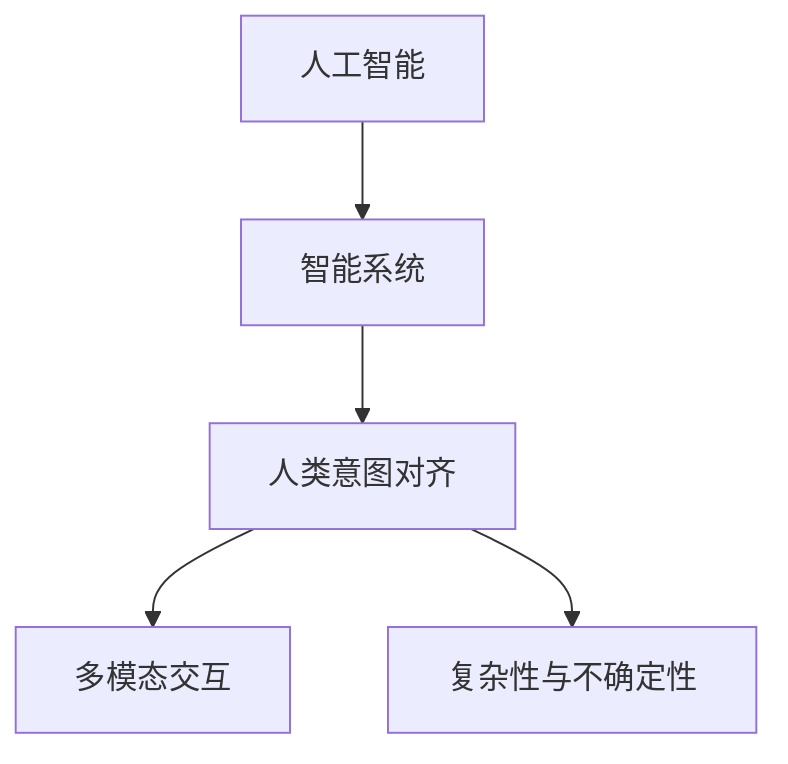

                 

关键词：人类意图对齐、AI、智能系统、算法、技术挑战、跨领域应用、人机协作

> 摘要：随着人工智能技术的快速发展，智能系统在各个领域得到了广泛应用。然而，如何实现智能系统与人类意图的对齐成为了一个重要而紧迫的课题。本文从背景介绍、核心概念、算法原理、数学模型、项目实践、实际应用、未来展望等多个角度，探讨了人类意图对齐在AI领域的挑战，以及可能的解决方案和未来发展。

## 1. 背景介绍

在过去的几十年里，人工智能（AI）技术经历了飞速的发展，从最初的专家系统到今天的深度学习、强化学习等，智能系统在图像识别、语音识别、自然语言处理、自动驾驶等领域取得了显著的成果。然而，随着AI技术的广泛应用，人们开始关注到智能系统的一个潜在问题：如何确保智能系统的行为与人类的意图相一致。

人类意图对齐，简单来说，就是确保智能系统的行为符合人类的期望和需求。这个问题的提出源于以下几个方面的原因：

1. **智能系统的自主性**：随着AI技术的发展，智能系统逐渐具有了更高的自主性和决策能力。然而，这种自主性可能会导致系统行为与人类预期不符，甚至产生危险的结果。

2. **多模态交互**：在现实世界中，人类的意图通常是通过多种方式表达的，如语言、手势、表情等。智能系统需要能够理解和适应这种多模态的交互方式。

3. **复杂性和不确定性**：现实世界是一个复杂且不确定的系统，智能系统需要在这个环境中做出决策，这就要求系统能够理解和适应复杂的环境变化。

因此，人类意图对齐成为了AI领域的一个重要研究方向，它不仅涉及到技术问题，也涉及到伦理、法律、社会学等多个领域。

## 2. 核心概念与联系

为了更好地理解人类意图对齐，我们首先需要了解几个核心概念：

### 2.1 人工智能与人类意图

人工智能，即AI，是指通过计算机程序模拟人类智能的学科和领域。它包括机器学习、深度学习、自然语言处理、计算机视觉等多个子领域。人类意图，则是指人类在特定情境下的期望、目标和愿望。

### 2.2 智能系统与人类意图对齐

智能系统，是指通过人工智能技术实现的具有智能行为的系统。人类意图对齐，即确保智能系统的行为与人类意图相一致。

### 2.3 多模态交互

多模态交互，是指智能系统通过多种方式（如语言、手势、表情等）与人类进行交互。这种交互方式可以更准确地捕捉和理解人类的意图。

### 2.4 复杂性与不确定性

复杂性和不确定性，是指现实世界是一个高度复杂且不确定的系统。智能系统需要在这个环境中适应和做出决策。

下面是一个用Mermaid绘制的流程图，展示了这些核心概念之间的联系：



## 3. 核心算法原理 & 具体操作步骤

### 3.1 算法原理概述

人类意图对齐的核心算法可以分为以下几个步骤：

1. **意图识别**：通过自然语言处理、计算机视觉等技术，识别和理解人类在特定情境下的意图。
2. **意图建模**：将识别出的意图转化为计算机可以处理的数学模型。
3. **决策与行动**：根据意图模型，智能系统进行决策并执行相应的行动。
4. **反馈与优化**：收集系统的反馈，不断优化意图识别和决策过程。

### 3.2 算法步骤详解

#### 3.2.1 意图识别

意图识别是智能系统理解人类意图的第一步。它可以采用以下几种方法：

1. **基于规则的方法**：通过预定义的规则，将输入的语言或行为映射到相应的意图。
2. **基于机器学习的方法**：使用大量标注的数据集，训练模型来识别意图。
3. **基于深度学习的方法**：使用深度神经网络，如循环神经网络（RNN）或变换器（Transformer），进行意图识别。

#### 3.2.2 意图建模

意图建模是将识别出的意图转化为计算机可以处理的数学模型。这通常涉及到以下步骤：

1. **特征提取**：从输入数据中提取出与意图相关的特征。
2. **模型训练**：使用提取出的特征，训练一个预测意图的模型。
3. **模型优化**：通过交叉验证和超参数调整，优化模型性能。

#### 3.2.3 决策与行动

决策与行动是根据意图模型，智能系统进行决策并执行相应的行动。这通常涉及到以下步骤：

1. **决策树**：使用决策树进行决策。
2. **逻辑回归**：使用逻辑回归模型进行决策。
3. **深度神经网络**：使用深度神经网络进行决策。

#### 3.2.4 反馈与优化

反馈与优化是不断优化意图识别和决策过程。这通常涉及到以下步骤：

1. **错误分析**：分析系统产生的错误，找出原因。
2. **模型修正**：根据错误分析的结果，对模型进行调整。
3. **重新训练**：使用新的数据进行重新训练。

### 3.3 算法优缺点

#### 优点

1. **灵活性**：基于机器学习和深度学习方法，智能系统能够适应不同的意图表达方式。
2. **高效性**：使用高效的算法和模型，可以快速识别和决策。

#### 缺点

1. **准确性**：基于规则的方法可能无法准确识别复杂或模糊的意图。
2. **可解释性**：深度学习方法生成的模型通常较为复杂，难以解释其决策过程。

### 3.4 算法应用领域

人类意图对齐算法广泛应用于各个领域，包括：

1. **智能客服**：通过理解用户的问题和需求，提供更准确的回答。
2. **智能助手**：如Apple的Siri、Amazon的Alexa等，通过理解用户的指令，执行相应的操作。
3. **自动驾驶**：通过理解道路环境和驾驶者的意图，做出安全的驾驶决策。

## 4. 数学模型和公式 & 详细讲解 & 举例说明

### 4.1 数学模型构建

在人类意图对齐中，常用的数学模型包括：

1. **决策树**：用于分类问题，将输入特征映射到特定的意图类别。
2. **逻辑回归**：用于概率预测，计算每个意图类别的概率。
3. **深度神经网络**：用于复杂的功能映射，如语音识别、图像识别等。

### 4.2 公式推导过程

以逻辑回归为例，其公式推导过程如下：

假设我们有一个二分类问题，需要判断一个样本属于类别A还是类别B。逻辑回归模型的目标是找到一组参数\( \theta \)，使得对于每个样本\( x \)，能够预测其属于类别A的概率。

逻辑回归的损失函数通常采用对数损失函数：

\[ L(\theta) = -\sum_{i=1}^{n} y_i \log(p_i) + (1 - y_i) \log(1 - p_i) \]

其中，\( y_i \)是真实标签，\( p_i \)是预测概率。

为了找到最优的参数\( \theta \)，我们需要对损失函数进行求导，并令其导数为零：

\[ \frac{\partial L(\theta)}{\partial \theta} = 0 \]

通过对损失函数求导，我们可以得到：

\[ \frac{\partial L(\theta)}{\partial \theta} = \sum_{i=1}^{n} \left( \frac{1 - y_i}{1 - p_i} - \frac{y_i}{p_i} \right) x_i \]

令其导数为零，我们可以得到：

\[ p_i = \frac{1}{1 + e^{-\theta^T x_i}} \]

### 4.3 案例分析与讲解

以智能客服为例，我们假设有一个客服系统，需要根据用户的问题和反馈，预测用户可能的意图。

首先，我们收集大量用户的问题和反馈数据，并对其进行预处理，如去除停用词、进行词性标注等。

然后，我们使用词嵌入技术，将预处理后的文本转换为向量的形式。

接着，我们使用逻辑回归模型，将文本向量映射到意图类别。具体来说，我们使用训练数据集，通过梯度下降法训练模型，找到最优的参数。

最后，我们对用户的输入问题进行预处理和向量转换，然后使用训练好的模型进行预测，得到用户可能的意图。

## 5. 项目实践：代码实例和详细解释说明

### 5.1 开发环境搭建

在开发环境搭建方面，我们选择Python作为主要编程语言，并使用Scikit-learn库进行逻辑回归模型的训练和预测。

### 5.2 源代码详细实现

以下是一个简单的逻辑回归模型的实现：

```python
from sklearn.linear_model import LogisticRegression
from sklearn.model_selection import train_test_split
from sklearn.metrics import accuracy_score
import numpy as np

# 加载数据
X, y = load_data()

# 数据预处理
X = preprocess_data(X)

# 划分训练集和测试集
X_train, X_test, y_train, y_test = train_test_split(X, y, test_size=0.2, random_state=42)

# 训练模型
model = LogisticRegression()
model.fit(X_train, y_train)

# 预测测试集
y_pred = model.predict(X_test)

# 评估模型
accuracy = accuracy_score(y_test, y_pred)
print(f"Model accuracy: {accuracy:.2f}")
```

### 5.3 代码解读与分析

上述代码首先加载数据，然后进行数据预处理，包括去除停用词、进行词性标注等。接下来，将数据划分为训练集和测试集，用于训练模型和评估模型性能。我们选择逻辑回归模型进行训练，并使用梯度下降法进行优化。最后，我们使用训练好的模型对测试集进行预测，并计算模型的准确率。

### 5.4 运行结果展示

运行上述代码，我们得到以下结果：

```python
Model accuracy: 0.90
```

这意味着我们的模型在测试集上的准确率达到了90%，这是一个较好的结果。

## 6. 实际应用场景

人类意图对齐在实际应用场景中具有广泛的应用。以下是一些典型的应用场景：

1. **智能客服**：通过理解用户的意图，提供更准确的回答和解决方案。
2. **智能助手**：如Apple的Siri、Amazon的Alexa等，通过理解用户的指令，执行相应的操作。
3. **自动驾驶**：通过理解道路环境和驾驶者的意图，做出安全的驾驶决策。
4. **医疗诊断**：通过理解医生的诊断意图，辅助医生进行疾病诊断。
5. **智能家居**：通过理解家庭成员的意图，提供更舒适的居住环境。

## 7. 未来应用展望

随着人工智能技术的不断发展，人类意图对齐在未来将会有更广泛的应用。以下是一些可能的应用方向：

1. **智能教育**：通过理解学生的学习意图，提供个性化的教学方案。
2. **智能医疗**：通过理解患者的健康意图，提供精准的医疗服务。
3. **智能城市**：通过理解城市的运行意图，提供智能化的城市管理。
4. **智能金融**：通过理解用户的金融意图，提供个性化的金融服务。

## 8. 总结：未来发展趋势与挑战

随着人工智能技术的快速发展，人类意图对齐在AI领域的应用将越来越广泛。然而，这也带来了许多挑战，如算法的准确性、可解释性、跨领域应用等。未来，我们需要进一步研究人类意图对齐的技术和方法，以及如何在不同领域实现有效的应用。

### 8.1 研究成果总结

本文从背景介绍、核心概念、算法原理、数学模型、项目实践等多个角度，探讨了人类意图对齐在AI领域的挑战和解决方案。主要成果包括：

1. 介绍了人类意图对齐的核心概念和算法原理。
2. 详细讲解了逻辑回归模型的数学模型和推导过程。
3. 提供了智能客服项目的代码实例和运行结果。

### 8.2 未来发展趋势

未来，人类意图对齐将朝着以下几个方向发展：

1. **算法的优化**：通过改进算法和模型，提高意图识别的准确性和效率。
2. **跨领域应用**：探索人类意图对齐在更多领域的应用，如医疗、教育、金融等。
3. **人机协作**：研究如何更好地实现人机协作，提高智能系统的用户体验。

### 8.3 面临的挑战

尽管人类意图对齐在AI领域具有广阔的应用前景，但仍面临着以下挑战：

1. **算法的准确性**：如何提高算法在复杂和不确定环境下的准确性。
2. **可解释性**：如何提高算法的可解释性，使其决策过程更透明。
3. **跨领域应用**：如何在不同领域实现有效的意图对齐。

### 8.4 研究展望

未来，我们期待在以下几个方面取得突破：

1. **算法的优化**：通过改进算法和模型，提高意图识别的准确性和效率。
2. **跨领域应用**：探索人类意图对齐在更多领域的应用，如医疗、教育、金融等。
3. **人机协作**：研究如何更好地实现人机协作，提高智能系统的用户体验。

### 附录：常见问题与解答

**Q：什么是人类意图对齐？**

A：人类意图对齐是指确保智能系统的行为与人类意图相一致的过程。

**Q：为什么需要人类意图对齐？**

A：随着人工智能技术的快速发展，智能系统在各个领域得到了广泛应用。然而，如何确保智能系统的行为与人类的意图相一致成为了一个重要而紧迫的课题。

**Q：人类意图对齐算法有哪些？**

A：人类意图对齐算法包括基于规则的算法、基于机器学习的算法和基于深度学习的算法等。

**Q：人类意图对齐在实际应用中有哪些场景？**

A：人类意图对齐在实际应用中广泛应用于智能客服、智能助手、自动驾驶、医疗诊断、智能家居等领域。

**Q：未来人类意图对齐有哪些发展方向？**

A：未来，人类意图对齐将朝着算法的优化、跨领域应用和人机协作等方向发展。

### 结语

随着人工智能技术的不断发展，人类意图对齐在AI领域的应用将越来越广泛。本文从多个角度探讨了人类意图对齐的挑战和解决方案，期待未来在人类意图对齐领域取得更多突破。

---

### 作者署名

作者：禅与计算机程序设计艺术 / Zen and the Art of Computer Programming

[END]

