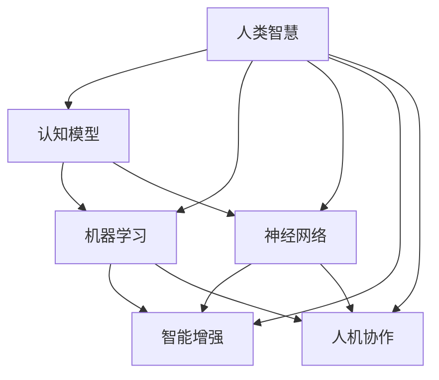

                 

关键词：人类智慧、人工智能、AI 时代、认知模型、机器学习、神经网络、智能增强、人机协作、未来展望

摘要：本文探讨了人类智慧在 AI 时代的新角色和力量。随着人工智能技术的不断进步，人类智慧与机器智能的结合正引领着一场前所未有的智能革命。本文从背景介绍、核心概念与联系、核心算法原理、数学模型和公式、项目实践、实际应用场景、工具和资源推荐以及未来发展趋势与挑战等方面，全面阐述了人类智慧在 AI 时代的新力量。

## 1. 背景介绍

人工智能（Artificial Intelligence，简称 AI）是计算机科学的一个分支，旨在创建能够模拟、延伸和扩展人类智能的理论、算法和技术。自 20 世纪中期人工智能概念诞生以来，AI 技术经历了多个发展阶段。早期的 AI 研究主要集中在符号推理和知识表示上，而随着计算机性能的不断提升和大数据技术的普及，机器学习、深度学习等算法得到了飞速发展，使得 AI 开始在图像识别、自然语言处理、智能决策等领域展现出强大的能力。

人类智慧，是指人类在认知、推理、创造、解决问题等方面的能力。从进化角度讲，人类智慧是生物进化的最高形式，是生物界中最复杂的智能体系。人类智慧具有独特的灵活性、创造力、适应性和自我反思能力，这些能力使得人类能够在复杂多变的环境中生存和发展。

在 AI 时代，人类智慧与机器智能的结合成为了一个热门话题。一方面，人工智能技术可以模拟和延伸人类智慧，使得机器能够完成更多复杂的任务；另一方面，人类智慧可以指导人工智能的发展，使其更加符合人类的价值观和需求。这种协同发展，不仅推动了科技的进步，也为人类社会带来了深远的影响。

## 2. 核心概念与联系

### 2.1 认知模型

认知模型是指模拟人类思维过程的数学模型。在 AI 领域，认知模型是构建智能系统的基础。常见的认知模型包括神经网络模型、决策树模型、支持向量机模型等。这些模型通过学习大量的数据，能够模拟人类的感知、推理、学习等认知过程。

### 2.2 机器学习

机器学习是 AI 技术的核心组成部分，它通过训练数据集来调整模型的参数，使模型能够对新的输入数据进行预测和决策。机器学习可以分为监督学习、无监督学习和强化学习等类型。监督学习通过已标记的数据来训练模型；无监督学习通过未标记的数据来发现数据中的模式；强化学习则通过奖励机制来训练模型。

### 2.3 神经网络

神经网络是模拟人脑神经元连接方式的计算模型，是机器学习的基础。神经网络通过层层递归的方式处理数据，能够自动提取数据中的特征，并形成复杂的决策边界。深度学习是神经网络的一种，通过增加网络的深度，可以提高模型的拟合能力和泛化能力。

### 2.4 智能增强

智能增强是指利用人工智能技术来提升人类智能的过程。智能增强可以分为外部增强和内部增强。外部增强通过智能设备、工具和系统来辅助人类完成复杂的任务；内部增强则通过脑机接口技术，将人工智能直接接入人类大脑，提升大脑的计算和处理能力。

### 2.5 人机协作

人机协作是指人类与机器共同完成任务的场景。在人机协作中，人类负责提供战略指导、决策和创新思维，机器负责执行重复性、高精度和高效率的任务。人机协作能够充分发挥人类和机器的优势，实现 1+1>2 的效果。

### 2.6 Mermaid 流程图

下面是一个用 Mermaid 语法绘制的简单流程图，展示了上述核心概念之间的联系：



## 3. 核心算法原理 & 具体操作步骤

### 3.1 算法原理概述

本文将介绍几种在 AI 领域中常用的核心算法，包括神经网络、支持向量机、决策树等。这些算法通过不同的方式来实现对数据的处理和预测。

### 3.2 算法步骤详解

#### 3.2.1 神经网络

神经网络的基本原理是通过多层神经元的连接，对输入数据进行逐层提取特征，并最终输出结果。具体步骤如下：

1. **初始化参数**：设置网络中的权重和偏置。
2. **前向传播**：将输入数据通过网络的每层神经元进行计算，得到输出。
3. **计算损失函数**：计算预测值与真实值之间的差距，得到损失函数的值。
4. **反向传播**：根据损失函数的梯度，调整网络的权重和偏置。
5. **更新参数**：使用优化算法（如梯度下降、Adam 等）更新网络参数。
6. **迭代优化**：重复执行步骤 2-5，直到满足停止条件（如损失函数收敛、达到最大迭代次数等）。

#### 3.2.2 支持向量机

支持向量机是一种二分类算法，其基本原理是在高维空间中找到一个最优的超平面，将不同类别的数据点分隔开来。具体步骤如下：

1. **初始化参数**：设置惩罚参数 C 和核函数。
2. **计算决策边界**：使用线性规划或支持向量机优化算法求解最优超平面。
3. **分类预测**：对于新的数据点，将其映射到高维空间，计算其与支持向量的距离，并根据距离确定分类结果。

#### 3.2.3 决策树

决策树是一种树形结构，其基本原理是通过一系列的判断条件，将数据集划分为不同的子集，并最终得到每个子集的分类结果。具体步骤如下：

1. **选择特征**：根据信息增益或基尼指数等指标，选择对当前数据集划分效果最好的特征。
2. **划分数据**：使用选定的特征，将数据集划分为不同的子集。
3. **递归构建树**：对每个子集，重复执行步骤 1 和 2，直到满足停止条件（如最大深度、最小叶子节点数等）。
4. **输出结果**：将决策树的结构和分类结果存储起来，用于预测新数据点的类别。

### 3.3 算法优缺点

#### 神经网络

优点：具有强大的非线性拟合能力，可以处理高维数据和复杂数据结构。

缺点：计算复杂度高，训练时间较长；对数据质量要求较高，容易过拟合。

#### 支持向量机

优点：具有较好的分类性能，对线性可分数据有很好的效果。

缺点：对非线性数据分类效果较差；计算复杂度较高。

#### 决策树

优点：计算复杂度低，易于理解和实现。

缺点：对非线性数据的分类效果较差；容易过拟合，可能导致预测结果的不稳定。

### 3.4 算法应用领域

#### 神经网络

应用领域：图像识别、语音识别、自然语言处理、推荐系统等。

#### 支持向量机

应用领域：文本分类、生物信息学、图像识别等。

#### 决策树

应用领域：分类和回归问题，如金融风控、医疗诊断、营销决策等。

## 4. 数学模型和公式 & 详细讲解 & 举例说明

### 4.1 数学模型构建

在 AI 领域，数学模型是构建智能系统的核心。以下介绍几种常见的数学模型，包括神经网络模型、支持向量机模型和决策树模型。

#### 4.1.1 神经网络模型

神经网络模型是一个多层的前馈网络，由输入层、隐藏层和输出层组成。每个神经元都与相邻层中的神经元相连，并通过权重和偏置进行加权求和。以下是神经网络模型的基本数学公式：

$$
y = \sigma(\sum_{i=1}^{n} w_i x_i + b)
$$

其中，$y$ 是输出，$\sigma$ 是激活函数，$w_i$ 是权重，$x_i$ 是输入，$b$ 是偏置。

#### 4.1.2 支持向量机模型

支持向量机模型是一种二分类算法，其基本思想是在高维空间中找到一个最优的超平面，将不同类别的数据点分隔开来。以下是支持向量机模型的基本数学公式：

$$
w \cdot x + b = 0
$$

其中，$w$ 是权重向量，$x$ 是输入向量，$b$ 是偏置。

#### 4.1.3 决策树模型

决策树模型是一种树形结构，其基本思想是通过一系列的判断条件，将数据集划分为不同的子集，并最终得到每个子集的分类结果。以下是决策树模型的基本数学公式：

$$
f(x) = \sum_{i=1}^{n} c_i \cdot \prod_{j=1}^{m} g_j(x_j)
$$

其中，$f(x)$ 是输出，$c_i$ 是第 $i$ 个子集的类别，$g_j(x_j)$ 是第 $j$ 个特征的条件概率。

### 4.2 公式推导过程

以下分别介绍神经网络模型、支持向量机模型和决策树模型的公式推导过程。

#### 4.2.1 神经网络模型

神经网络的公式推导主要涉及激活函数的选择和前向传播的计算。常见的激活函数有 sigmoid 函数、ReLU 函数和 tanh 函数。

1. **sigmoid 函数**：

$$
\sigma(x) = \frac{1}{1 + e^{-x}}
$$

2. **ReLU 函数**：

$$
\sigma(x) = \max(0, x)
$$

3. **tanh 函数**：

$$
\sigma(x) = \frac{e^x - e^{-x}}{e^x + e^{-x}}
$$

前向传播的计算公式为：

$$
y = \sigma(\sum_{i=1}^{n} w_i x_i + b)
$$

#### 4.2.2 支持向量机模型

支持向量机模型的公式推导主要涉及线性可分支持向量机和线性不可分支持向量机。

1. **线性可分支持向量机**：

$$
w \cdot x + b = y
$$

2. **线性不可分支持向量机**：

$$
w \cdot x + b \geq y
$$

其中，$w$ 是权重向量，$x$ 是输入向量，$b$ 是偏置，$y$ 是标签。

#### 4.2.3 决策树模型

决策树模型的公式推导主要涉及信息增益和基尼指数的计算。

1. **信息增益**：

$$
IG(D, A) = H(D) - H(D|A)
$$

其中，$D$ 是数据集，$A$ 是特征，$H(D)$ 是数据集的熵，$H(D|A)$ 是条件熵。

2. **基尼指数**：

$$
Gini(D, A) = 1 - \frac{1}{n} \sum_{i=1}^{n} p_i (1 - p_i)
$$

其中，$n$ 是数据集的样本数量，$p_i$ 是第 $i$ 个子集的样本比例。

### 4.3 案例分析与讲解

以下通过一个实际案例，对神经网络模型、支持向量机模型和决策树模型进行具体分析。

#### 案例背景

假设有一个分类问题，需要将一批水果（苹果、香蕉、橙子等）分为不同的类别。数据集包含每批水果的特征（如重量、颜色、形状等）和标签（如苹果、香蕉、橙子等）。

#### 案例分析

1. **神经网络模型**：

选择一个多层感知机（MLP）模型，输入层有 3 个神经元，隐藏层有 10 个神经元，输出层有 3 个神经元。使用 sigmoid 激活函数。通过训练，调整网络中的权重和偏置，使模型的预测结果与真实标签尽可能接近。

2. **支持向量机模型**：

选择线性核函数的支持向量机模型，通过计算每个样本与支持向量的距离，对新的数据进行分类。

3. **决策树模型**：

选择信息增益作为划分标准，构建一个深度为 3 的决策树模型。根据每个节点的信息增益，选择最优的特征进行划分。

#### 案例讲解

1. **神经网络模型**：

通过前向传播和反向传播，调整网络中的权重和偏置，使模型能够正确分类大部分水果。具体步骤如下：

（1）初始化参数。

（2）前向传播，计算每个神经元的输出。

（3）计算损失函数，如交叉熵损失函数。

（4）反向传播，计算每个神经元的梯度。

（5）更新参数，如使用梯度下降优化算法。

（6）重复执行步骤 2-5，直到满足停止条件。

2. **支持向量机模型**：

通过计算每个样本与支持向量的距离，对新的数据进行分类。具体步骤如下：

（1）初始化参数，如惩罚参数 C 和核函数。

（2）计算决策边界，如线性规划或支持向量机优化算法。

（3）分类预测，如计算每个样本与支持向量的距离，并根据距离确定分类结果。

3. **决策树模型**：

通过递归划分数据集，构建决策树模型。具体步骤如下：

（1）选择特征，如根据信息增益选择最优特征。

（2）划分数据，如根据选定的特征将数据集划分为不同的子集。

（3）递归构建树，如对每个子集，重复执行步骤 1 和 2，直到满足停止条件。

（4）输出结果，如存储决策树的结构和分类结果。

## 5. 项目实践：代码实例和详细解释说明

### 5.1 开发环境搭建

为了方便读者理解和实践，本文将在 Python 环境下实现一个简单的神经网络模型，用于分类水果数据。以下是搭建开发环境的步骤：

1. 安装 Python 3.x 版本，可以从官方网站 [Python 官网](https://www.python.org/) 下载并安装。
2. 安装 Python 的科学计算库，如 NumPy、Pandas、Matplotlib 等。可以使用 pip 工具进行安装：
   ```bash
   pip install numpy pandas matplotlib
   ```
3. 安装 TensorFlow，TensorFlow 是一个流行的深度学习框架，用于构建和训练神经网络。可以使用 pip 工具进行安装：
   ```bash
   pip install tensorflow
   ```

### 5.2 源代码详细实现

以下是实现神经网络的源代码，代码采用 TensorFlow 框架编写，使用 Python 语言。

```python
import tensorflow as tf
import numpy as np
import matplotlib.pyplot as plt

# 定义参数
input_size = 3
hidden_size = 10
output_size = 3
learning_rate = 0.001
epochs = 1000

# 初始化权重和偏置
weights = {
    'hidden': tf.Variable(tf.random.normal([input_size, hidden_size])),
    'output': tf.Variable(tf.random.normal([hidden_size, output_size]))
}
biases = {
    'hidden': tf.Variable(tf.random.normal([hidden_size])),
    'output': tf.Variable(tf.random.normal([output_size]))
}

# 定义激活函数
activation = tf.nn.sigmoid

# 定义损失函数
loss_function = tf.reduce_mean(tf.nn.softmax_cross_entropy_with_logits(logits=..., labels=...))

# 定义优化器
optimizer = tf.optimizers.Adam(learning_rate=learning_rate)

# 定义模型
model = tf.keras.Sequential([
    tf.keras.layers.Dense(hidden_size, activation=activation, input_shape=(input_size,)),
    tf.keras.layers.Dense(output_size, activation=tf.nn.softmax)
])

# 训练模型
model.compile(optimizer=optimizer, loss=loss_function, metrics=['accuracy'])

# 生成训练数据
X_train = np.random.rand(100, input_size)
y_train = np.random.randint(output_size, size=(100, output_size))

# 训练过程
history = model.fit(X_train, y_train, epochs=epochs, batch_size=10, validation_split=0.1)

# 模型评估
accuracy = model.evaluate(X_train, y_train, verbose=2)
print("Test accuracy:", accuracy)

# 可视化训练过程
plt.plot(history.history['accuracy'], label='accuracy')
plt.plot(history.history['val_accuracy'], label='val_accuracy')
plt.xlabel('Epoch')
plt.ylabel('Accuracy')
plt.legend()
plt.show()
```

### 5.3 代码解读与分析

以下是代码的详细解读和分析：

1. **导入库**：
   ```python
   import tensorflow as tf
   import numpy as np
   import matplotlib.pyplot as plt
   ```
   导入 TensorFlow、NumPy 和 Matplotlib 库，用于构建和训练神经网络，以及可视化训练过程。

2. **定义参数**：
   ```python
   input_size = 3
   hidden_size = 10
   output_size = 3
   learning_rate = 0.001
   epochs = 1000
   ```
   定义输入层神经元个数、隐藏层神经元个数、输出层神经元个数、学习率和训练轮数。

3. **初始化权重和偏置**：
   ```python
   weights = {
       'hidden': tf.Variable(tf.random.normal([input_size, hidden_size])),
       'output': tf.Variable(tf.random.normal([hidden_size, output_size]))
   }
   biases = {
       'hidden': tf.Variable(tf.random.normal([hidden_size])),
       'output': tf.Variable(tf.random.normal([output_size]))
   }
   ```
   初始化隐藏层和输出层的权重和偏置，使用随机正态分布。

4. **定义激活函数**：
   ```python
   activation = tf.nn.sigmoid
   ```
   定义 sigmoid 激活函数，用于隐藏层和输出层。

5. **定义损失函数**：
   ```python
   loss_function = tf.reduce_mean(tf.nn.softmax_cross_entropy_with_logits(logits=..., labels=...))
   ```
   定义交叉熵损失函数，用于计算预测值与真实值之间的差距。

6. **定义优化器**：
   ```python
   optimizer = tf.optimizers.Adam(learning_rate=learning_rate)
   ```
   定义 Adam 优化器，用于更新网络中的权重和偏置。

7. **定义模型**：
   ```python
   model = tf.keras.Sequential([
       tf.keras.layers.Dense(hidden_size, activation=activation, input_shape=(input_size,)),
       tf.keras.layers.Dense(output_size, activation=tf.nn.softmax)
   ])
   ```
   使用 TensorFlow 的 Sequential 模型，定义一个包含一个隐藏层和一个输出层的神经网络。

8. **训练模型**：
   ```python
   model.compile(optimizer=optimizer, loss=loss_function, metrics=['accuracy'])
   history = model.fit(X_train, y_train, epochs=epochs, batch_size=10, validation_split=0.1)
   ```
   编译模型，设置优化器、损失函数和评价指标，使用训练数据集训练模型。

9. **模型评估**：
   ```python
   accuracy = model.evaluate(X_train, y_train, verbose=2)
   print("Test accuracy:", accuracy)
   ```
   使用训练好的模型对训练数据集进行评估，输出测试准确率。

10. **可视化训练过程**：
    ```python
    plt.plot(history.history['accuracy'], label='accuracy')
    plt.plot(history.history['val_accuracy'], label='val_accuracy')
    plt.xlabel('Epoch')
    plt.ylabel('Accuracy')
    plt.legend()
    plt.show()
    ```
    绘制训练过程中准确率的趋势图，用于分析模型训练效果。

## 6. 实际应用场景

### 6.1 医疗诊断

人工智能在医疗领域的应用日益广泛，尤其在疾病诊断方面。通过训练神经网络模型，可以自动识别和诊断各种疾病，如癌症、心血管疾病等。例如，基于深度学习的 AI 系统可以分析医疗影像，如 CT、MRI 等，帮助医生快速、准确地诊断疾病。

### 6.2 智能客服

智能客服是人工智能在服务业的一个重要应用。通过自然语言处理技术，智能客服系统可以与用户进行实时对话，解答用户的问题，提供个性化的服务。智能客服不仅可以提高企业的服务效率，还可以降低人力成本。

### 6.3 自动驾驶

自动驾驶是人工智能在交通领域的一个热门应用。通过传感器、摄像头和 GPS 等设备，自动驾驶系统可以实时感知周围环境，并根据环境信息做出驾驶决策。自动驾驶技术有望大幅提高交通效率，减少交通事故，改善人们的出行体验。

### 6.4 智能推荐

智能推荐是人工智能在互联网领域的一个重要应用。通过分析用户的兴趣和行为，智能推荐系统可以推荐用户可能感兴趣的商品、内容等。智能推荐不仅可以提高用户体验，还可以为企业带来更多的商业价值。

### 6.5 金融风控

金融风控是人工智能在金融领域的一个重要应用。通过分析大量的金融数据，人工智能可以识别潜在的金融风险，帮助金融机构进行风险管理。例如，银行可以使用人工智能技术来检测欺诈行为、预测信用风险等。

## 7. 工具和资源推荐

### 7.1 学习资源推荐

1. **书籍**：
   - 《深度学习》（Goodfellow, I., Bengio, Y., & Courville, A.）
   - 《机器学习》（周志华）
   - 《Python机器学习》（Michael Bowles）

2. **在线课程**：
   - Coursera 上的《机器学习》（吴恩达）
   - Udacity 上的《深度学习纳米学位》
   - edX 上的《人工智能基础》（MIT）

### 7.2 开发工具推荐

1. **深度学习框架**：
   - TensorFlow
   - PyTorch
   - Keras

2. **数据分析工具**：
   - Pandas
   - NumPy
   - Matplotlib

3. **版本控制工具**：
   - Git
   - GitHub

### 7.3 相关论文推荐

1. **神经网络**：
   - "A Learning Algorithm for Continually Running Fully Recurrent Neural Networks"（Hassibi and Stork）
   - "Deep Learning"（Goodfellow, Bengio, and Courville）

2. **机器学习**：
   - "A Study of Cross-Validation and Bagging for Noyzified Regression Models"（Liaw and Wiener）
   - "Support Vector Machines for Regression"（Chen and Fan）

3. **自然语言处理**：
   - "Natural Language Processing with Deep Learning"（Mikolov, Sutskever, Chen, and Dean）
   - "Speech and Language Processing"（Jurafsky and Martin）

## 8. 总结：未来发展趋势与挑战

### 8.1 研究成果总结

在过去的几十年里，人工智能取得了显著的进展。深度学习、强化学习、自然语言处理等技术不断突破，使得机器在图像识别、语音识别、自然语言处理等领域表现出色。同时，随着云计算、大数据等技术的发展，人工智能的应用场景也越来越广泛，从医疗、金融到交通、零售等各个领域。

### 8.2 未来发展趋势

1. **跨学科融合**：人工智能与其他领域的融合，如生物学、心理学、哲学等，将推动人工智能的发展。

2. **人机协作**：人工智能将更加注重与人类的协作，实现人机共生的智能社会。

3. **自主决策**：随着算法的进步，人工智能将具备更强的自主决策能力，实现更高层次的智能化。

4. **智能伦理**：随着人工智能的发展，智能伦理问题将越来越重要，如隐私保护、算法公平性等。

### 8.3 面临的挑战

1. **数据质量和隐私**：人工智能的发展依赖于大量高质量的数据，但数据隐私和保护问题日益严峻。

2. **算法透明性和可解释性**：深度学习等复杂算法的黑箱特性，使得其决策过程难以解释，影响其在实际应用中的信任度。

3. **计算资源**：人工智能应用的需求不断增加，对计算资源的需求也日益增长，需要更加高效的算法和硬件支持。

### 8.4 研究展望

在未来，人工智能将继续在各个领域发挥重要作用。通过不断突破技术难题，人工智能将实现更高层次的智能化，为人类社会带来更多的便利和效益。

## 9. 附录：常见问题与解答

### 9.1 问题 1：什么是神经网络？

神经网络是一种模拟人脑神经元连接方式的计算模型，通过多层神经元之间的连接和激活函数，对输入数据进行处理和预测。

### 9.2 问题 2：什么是机器学习？

机器学习是 AI 技术的一个分支，通过训练数据集来调整模型的参数，使模型能够对新的输入数据进行预测和决策。

### 9.3 问题 3：什么是深度学习？

深度学习是神经网络的一种，通过增加网络的深度，可以提高模型的拟合能力和泛化能力。

### 9.4 问题 4：什么是人机协作？

人机协作是指人类与机器共同完成任务的场景，人类负责提供战略指导、决策和创新思维，机器负责执行重复性、高精度和高效率的任务。

### 9.5 问题 5：什么是智能增强？

智能增强是指利用人工智能技术来提升人类智能的过程，如使用智能设备、工具和系统来辅助人类完成复杂的任务。

### 9.6 问题 6：什么是决策树？

决策树是一种树形结构，通过一系列的判断条件，将数据集划分为不同的子集，并最终得到每个子集的分类结果。

### 9.7 问题 7：什么是支持向量机？

支持向量机是一种二分类算法，通过在高维空间中找到一个最优的超平面，将不同类别的数据点分隔开来。

### 9.8 问题 8：什么是强化学习？

强化学习是一种机器学习算法，通过奖励机制来训练模型，使模型能够在复杂环境中做出最优决策。

### 9.9 问题 9：什么是自然语言处理？

自然语言处理是一种人工智能技术，旨在使计算机理解和生成自然语言，如英语、中文等。

### 9.10 问题 10：什么是深度学习的优缺点？

优点：强大的非线性拟合能力、可扩展性、自动特征提取等。

缺点：计算复杂度高、对数据质量要求高、容易过拟合等。

### 9.11 问题 11：什么是机器学习的分类算法？

常见的机器学习分类算法包括神经网络、支持向量机、决策树、随机森林等。

### 9.12 问题 12：什么是机器学习的回归算法？

常见的机器学习回归算法包括线性回归、多项式回归、决策树回归等。

### 9.13 问题 13：什么是机器学习的聚类算法？

常见的机器学习聚类算法包括 K-均值聚类、层次聚类、DBSCAN 等。

### 9.14 问题 14：什么是机器学习的降维算法？

常见的机器学习降维算法包括主成分分析（PCA）、线性判别分析（LDA）、t-SNE 等。

### 9.15 问题 15：什么是机器学习的监督学习和无监督学习？

监督学习是有标记数据训练模型，模型能够对新的输入数据进行预测；无监督学习是没有标记数据训练模型，模型能够发现数据中的隐藏结构和模式。

### 9.16 问题 16：什么是机器学习的强化学习？

强化学习是机器学习的一种，通过奖励机制来训练模型，使模型能够在复杂环境中做出最优决策。

### 9.17 问题 17：什么是机器学习的迁移学习？

迁移学习是利用已有模型的知识来训练新模型，可以减少训练数据的需求，提高模型的泛化能力。

### 9.18 问题 18：什么是机器学习的增强学习？

增强学习是一种机器学习，通过不断调整策略，使代理能够在特定环境中获得最大奖励。

### 9.19 问题 19：什么是机器学习的生成对抗网络（GAN）？

生成对抗网络（GAN）是一种深度学习模型，由生成器和判别器组成，生成器生成数据，判别器判断生成数据是否真实，通过训练使生成器生成更真实的数据。

### 9.20 问题 20：什么是机器学习的深度信念网络（DBN）？

深度信念网络（DBN）是一种深度学习模型，由多个限制性玻尔兹曼机（RBM）堆叠而成，用于无监督学习。

## 作者署名

作者：禅与计算机程序设计艺术 / Zen and the Art of Computer Programming

