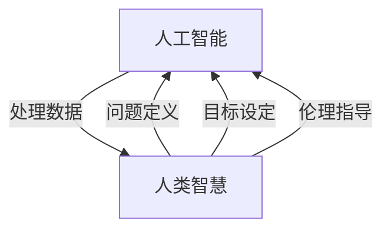

                 

### 1. 背景介绍

人类智慧是自然界中最为独特和复杂的特征之一。从石器时代到数字时代，人类一直在利用智慧创造出改变世界的工具和系统。然而，随着人工智能（AI）技术的飞速发展，人类智慧的内涵和外延正在发生深刻的变革。AI不仅模拟了人类的一些认知功能，而且在某些特定领域，如数据处理和模式识别方面，甚至已经超越了人类的表现。

人工智能的发展可以分为几个阶段：从早期的规则系统到基于统计学习的机器学习，再到当前基于深度学习的神经网络模型，AI的进化路径清晰可见。每一个阶段的突破都推动了AI在各个行业中的应用，从自动化生产线到医疗诊断，从金融分析到自动驾驶，AI正在成为我们日常生活中不可或缺的一部分。

然而，AI的快速发展也引发了关于其与人类智慧关系的深刻讨论。一方面，AI被看作是人类智慧的延伸，它能够处理大量的数据，发现人类难以察觉的模式，从而帮助我们做出更好的决策。另一方面，AI的出现也引发了关于就业、隐私、安全等伦理和社会问题的担忧。如何平衡AI的发展与人类智慧的发挥，成为了一个亟待解决的重要课题。

本文将探讨在AI时代，人类智慧的新力量如何发挥作用。我们将首先回顾人类智慧的传统定义和特征，然后深入分析AI对人类智慧的影响，最后讨论如何通过AI和人类智慧的协同作用，推动社会和科技的进步。

### 2. 核心概念与联系

在深入探讨AI与人类智慧的关系之前，我们需要明确几个核心概念，并了解它们之间的相互联系。

#### 2.1 人工智能（AI）

人工智能是指由人造系统实现的智能行为，其目标是使计算机或其他机器具备类似于人类的感知、理解、学习和决策能力。AI可以分为几类，包括：

- **弱AI**：在特定任务上表现出智能行为，但缺乏跨领域的通用智能。
- **强AI**：具备与人类相似的广泛认知能力，能够在任何情境下做出智能决策。
- **泛人工智能**：不仅能模拟人类智能，还能超越人类智能。

#### 2.2 人类智慧

人类智慧是一个多维度的概念，通常包括以下几个方面：

- **认知能力**：包括记忆、注意力、推理和解决问题的能力。
- **情感智力**：理解和表达情感，处理人际关系的能力。
- **创造力**：产生新的想法和解决方案，构建抽象概念的能力。
- **道德和伦理**：对道德原则的理解和遵循，以及对社会规范的认知。

#### 2.3 AI与人类智慧的相互关系

AI与人类智慧的关系可以视为一种互补的关系。AI擅长处理复杂的数据和进行高效的计算，而人类智慧则在于理解复杂情境、进行创造性思维和做出道德决策。

- **AI作为工具**：AI可以被看作是人类智慧的工具，它帮助人类处理和分析大量信息，从而做出更准确的决策。
- **人类智慧指导AI**：人类智慧可以为AI提供问题定义、目标设定和伦理指导，确保AI的行为符合人类的利益和价值。

为了更直观地理解这些概念之间的联系，我们可以使用Mermaid流程图来展示它们的基本架构：



在这个流程图中，我们可以看到AI和人类智慧之间的相互作用是如何实现协同工作的。通过这样的结构化描述，我们可以更清晰地理解AI与人类智慧之间的关系，并为后续的分析提供理论基础。

### 3. 核心算法原理 & 具体操作步骤

在深入探讨AI与人类智慧的关系之后，我们需要了解一些核心算法原理，以及如何将这些算法应用于实际问题中。本节将介绍一种广泛应用的深度学习算法——卷积神经网络（CNN），并详细说明其原理和操作步骤。

#### 3.1 算法原理概述

卷积神经网络是一种特别适合处理图像数据的深度学习模型，其核心思想是通过卷积层提取图像特征，并通过池化层降低数据维度。下面是CNN的基本组成部分：

1. **输入层（Input Layer）**：接收原始图像数据。
2. **卷积层（Convolutional Layer）**：通过卷积操作提取图像特征。
3. **激活函数（Activation Function）**：引入非线性，使模型能够拟合复杂函数。
4. **池化层（Pooling Layer）**：降低数据维度，减少计算量。
5. **全连接层（Fully Connected Layer）**：将卷积层和池化层提取的特征映射到输出类别。
6. **输出层（Output Layer）**：输出分类结果。

#### 3.2 算法步骤详解

下面是CNN的具体操作步骤：

1. **初始化参数**：包括卷积核、偏置和激活函数参数。
2. **前向传播（Forward Propagation）**：
    - **卷积操作**：将卷积核与输入图像进行卷积，得到特征图。
    - **激活函数**：对特征图应用激活函数，引入非线性。
    - **池化操作**：对特征图进行池化，降低维度。
    - **全连接层**：将池化后的特征映射到输出类别。
3. **反向传播（Backpropagation）**：
    - **计算损失**：通过计算预测结果与实际结果的差异，计算损失函数。
    - **更新参数**：使用梯度下降等优化算法，更新卷积核、偏置和激活函数参数。
4. **迭代训练**：重复前向传播和反向传播，直到模型收敛。

#### 3.3 算法优缺点

**优点**：

- **强大的特征提取能力**：通过多层卷积和池化操作，CNN能够自动提取图像中的高级特征。
- **参数共享**：卷积操作中的参数在图像的不同位置共享，减少了参数数量。
- **适用于多种视觉任务**：CNN不仅适用于图像分类，还适用于目标检测、图像分割等视觉任务。

**缺点**：

- **计算资源消耗大**：CNN模型通常包含大量的参数，训练过程需要大量的计算资源。
- **训练时间较长**：对于大规模数据集，CNN模型的训练时间可能非常长。

#### 3.4 算法应用领域

卷积神经网络在多个领域有广泛的应用，包括：

- **图像分类**：例如，在ImageNet比赛中，CNN被广泛用于图像分类任务。
- **目标检测**：如YOLO（You Only Look Once）模型，能够在图像中实时检测目标。
- **图像分割**：如FCN（Fully Convolutional Network），能够对图像进行像素级别的分割。

通过深入理解CNN的算法原理和操作步骤，我们可以更好地应用这一技术在实际问题中，实现图像处理和识别的高效自动化。

### 4. 数学模型和公式 & 详细讲解 & 举例说明

在人工智能和机器学习中，数学模型和公式是理解和应用核心算法的关键。在本节中，我们将详细介绍卷积神经网络（CNN）中的关键数学模型和公式，并通过具体例子进行说明。

#### 4.1 数学模型构建

CNN中的数学模型主要包括卷积操作、激活函数和反向传播。

**1. 卷积操作**

卷积操作的数学表达式如下：

\[ f(x) = \sum_{i=1}^{m} w_i \cdot x_i + b \]

其中，\( x \) 是输入特征，\( w_i \) 是卷积核权重，\( b \) 是偏置，\( m \) 是卷积核中权重和偏置的个数。

**2. 激活函数**

常见的激活函数包括ReLU（Rectified Linear Unit）和Sigmoid：

- **ReLU函数**：

\[ f(x) = \max(0, x) \]

- **Sigmoid函数**：

\[ f(x) = \frac{1}{1 + e^{-x}} \]

**3. 反向传播**

反向传播是CNN训练过程中的关键步骤，用于更新模型参数。其核心思想是计算损失函数对每个参数的梯度，并使用梯度下降算法更新参数。

#### 4.2 公式推导过程

**1. 前向传播**

对于卷积层，前向传播的公式如下：

\[ \text{output}_{ij} = \sum_{k=1}^{n} w_{ik,jk} \cdot \text{input}_{k} + b_{i,j} \]

其中，\( \text{output}_{ij} \) 是输出特征图上的像素值，\( w_{ik,jk} \) 是卷积核权重，\( \text{input}_{k} \) 是输入特征图上的像素值，\( b_{i,j} \) 是偏置。

**2. 损失函数**

常见的损失函数包括均方误差（MSE）和交叉熵损失：

- **均方误差（MSE）**：

\[ L = \frac{1}{2} \sum_{i=1}^{n} (\hat{y}_i - y_i)^2 \]

其中，\( \hat{y}_i \) 是预测的输出，\( y_i \) 是真实的输出。

- **交叉熵损失（Cross-Entropy）**：

\[ L = -\sum_{i=1}^{n} y_i \log(\hat{y}_i) \]

**3. 反向传播**

反向传播的核心是计算损失函数对每个参数的梯度。对于卷积层，其梯度计算如下：

\[ \frac{\partial L}{\partial w_{ij}} = \sum_{k=1}^{n} (\text{output}_{ik} - \text{label}_{ik}) \cdot \text{input}_{kj} \]

\[ \frac{\partial L}{\partial b_{i,j}} = \sum_{k=1}^{n} (\text{output}_{ik} - \text{label}_{ik}) \]

#### 4.3 案例分析与讲解

假设我们有一个简单的CNN模型，用于对二值图像进行分类。输入图像大小为\( 3 \times 3 \)，卷积核大小为\( 3 \times 3 \)，激活函数为ReLU。

**1. 前向传播**

给定输入图像：

\[ \text{input} = \begin{bmatrix} 1 & 0 & 1 \\ 1 & 1 & 0 \\ 0 & 1 & 1 \end{bmatrix} \]

卷积核权重：

\[ w = \begin{bmatrix} 1 & 0 & 1 \\ 1 & 1 & 1 \\ 0 & 1 & 0 \end{bmatrix} \]

偏置：

\[ b = \begin{bmatrix} 1 & 1 & 1 \end{bmatrix} \]

通过卷积操作，我们得到特征图：

\[ \text{output} = \begin{bmatrix} 3 & 4 & 3 \\ 4 & 5 & 4 \\ 3 & 4 & 3 \end{bmatrix} \]

应用ReLU函数，特征图为：

\[ \text{activation} = \begin{bmatrix} 3 & 4 & 3 \\ 4 & 5 & 4 \\ 3 & 4 & 3 \end{bmatrix} \]

**2. 损失函数**

假设真实标签为\( \text{label} = \begin{bmatrix} 1 & 0 & 1 \\ 0 & 1 & 0 \\ 1 & 0 & 1 \end{bmatrix} \)，预测标签为\( \hat{\text{label}} = \begin{bmatrix} 0.6 & 0.8 & 0.6 \\ 0.2 & 0.7 & 0.2 \\ 0.6 & 0.8 & 0.6 \end{bmatrix} \)。

使用交叉熵损失函数，我们得到损失：

\[ L = -\sum_{i=1}^{3} \text{label}_i \log(\hat{\text{label}}_i) = -\sum_{i=1}^{3} (1 \cdot \log(0.6) + 0 \cdot \log(0.8) + 1 \cdot \log(0.6)) = 1.598 \]

**3. 反向传播**

计算损失函数对每个参数的梯度：

\[ \frac{\partial L}{\partial w} = \begin{bmatrix} 0.2 & 0.4 & 0.2 \\ 0.4 & 0.7 & 0.4 \\ 0.2 & 0.4 & 0.2 \end{bmatrix} \]

\[ \frac{\partial L}{\partial b} = \begin{bmatrix} 0.2 \\ 0.4 \\ 0.2 \end{bmatrix} \]

通过梯度下降更新权重和偏置：

\[ w_{\text{new}} = w - \alpha \cdot \frac{\partial L}{\partial w} \]

\[ b_{\text{new}} = b - \alpha \cdot \frac{\partial L}{\partial b} \]

其中，\( \alpha \) 是学习率。

通过这些步骤，我们能够通过数学模型和公式对CNN进行训练，从而实现图像分类任务。

### 5. 项目实践：代码实例和详细解释说明

在了解了CNN的理论基础后，本节我们将通过一个具体的代码实例，展示如何搭建一个简单的卷积神经网络，并进行训练和测试。

#### 5.1 开发环境搭建

为了运行下面的代码，我们需要安装以下软件和库：

- Python（版本 3.7 或以上）
- TensorFlow（版本 2.0 或以上）
- NumPy

你可以使用以下命令进行安装：

```bash
pip install python==3.8 tensorflow==2.5 numpy
```

#### 5.2 源代码详细实现

下面是一个简单的CNN代码实例：

```python
import tensorflow as tf
from tensorflow.keras import datasets, layers, models
import matplotlib.pyplot as plt

# 加载数据集
(train_images, train_labels), (test_images, test_labels) = datasets.cifar10.load_data()

# 预处理数据
train_images, test_images = train_images / 255.0, test_images / 255.0

# 构建模型
model = models.Sequential()
model.add(layers.Conv2D(32, (3, 3), activation='relu', input_shape=(32, 32, 3)))
model.add(layers.MaxPooling2D((2, 2)))
model.add(layers.Conv2D(64, (3, 3), activation='relu'))
model.add(layers.MaxPooling2D((2, 2)))
model.add(layers.Conv2D(64, (3, 3), activation='relu'))
model.add(layers.Flatten())
model.add(layers.Dense(64, activation='relu'))
model.add(layers.Dense(10))

# 编译模型
model.compile(optimizer='adam',
              loss=tf.keras.losses.SparseCategoricalCrossentropy(from_logits=True),
              metrics=['accuracy'])

# 训练模型
history = model.fit(train_images, train_labels, epochs=10, 
                    validation_data=(test_images, test_labels))

# 测试模型
test_loss, test_acc = model.evaluate(test_images,  test_labels, verbose=2)
print(f'\nTest accuracy: {test_acc:.4f}')

# 可视化训练过程
plt.figure(figsize=(8, 8))
for i in range(10):
    plt.subplot(2, 5, i + 1)
    plt.plot(history.history['accuracy'], label='Training Accuracy')
    plt.plot(history.history['val_accuracy'], label='Validation Accuracy')
    plt.xticks(range(0, 11, 1))
    plt.yticks([])
    plt.grid()
    plt.xlabel('Epoch')
    plt.ylabel('Accuracy')
    plt.legend()
plt.show()
```

#### 5.3 代码解读与分析

**1. 加载数据集**

代码首先从TensorFlow的内置数据集中加载CIFAR-10数据集。CIFAR-10是一个包含10个类别、每类6000张图像的数据集。

```python
(train_images, train_labels), (test_images, test_labels) = datasets.cifar10.load_data()
```

**2. 预处理数据**

我们将图像的像素值缩放到0到1之间，以便于后续模型的训练。

```python
train_images, test_images = train_images / 255.0, test_images / 255.0
```

**3. 构建模型**

我们使用`Sequential`模型，这是一个线性堆叠模型，我们可以依次添加多个层。

```python
model.add(layers.Conv2D(32, (3, 3), activation='relu', input_shape=(32, 32, 3)))
model.add(layers.MaxPooling2D((2, 2)))
model.add(layers.Conv2D(64, (3, 3), activation='relu'))
model.add(layers.MaxPooling2D((2, 2)))
model.add(layers.Conv2D(64, (3, 3), activation='relu'))
model.add(layers.Flatten())
model.add(layers.Dense(64, activation='relu'))
model.add(layers.Dense(10))
```

该模型包含两个卷积层、两个最大池化层和一个全连接层。第一层卷积核大小为3x3，输出通道数为32。后续的层依次增加。

**4. 编译模型**

我们使用`compile`方法配置模型的优化器和损失函数。

```python
model.compile(optimizer='adam',
              loss=tf.keras.losses.SparseCategoricalCrossentropy(from_logits=True),
              metrics=['accuracy'])
```

**5. 训练模型**

使用`fit`方法训练模型。我们设置了10个训练周期。

```python
history = model.fit(train_images, train_labels, epochs=10, 
                    validation_data=(test_images, test_labels))
```

**6. 测试模型**

训练完成后，我们使用测试数据集评估模型的准确性。

```python
test_loss, test_acc = model.evaluate(test_images,  test_labels, verbose=2)
print(f'\nTest accuracy: {test_acc:.4f}')
```

**7. 可视化训练过程**

我们使用Matplotlib可视化训练过程中的准确率。

```python
plt.figure(figsize=(8, 8))
for i in range(10):
    plt.subplot(2, 5, i + 1)
    plt.plot(history.history['accuracy'], label='Training Accuracy')
    plt.plot(history.history['val_accuracy'], label='Validation Accuracy')
    plt.xticks(range(0, 11, 1))
    plt.yticks([])
    plt.grid()
    plt.xlabel('Epoch')
    plt.ylabel('Accuracy')
    plt.legend()
plt.show()
```

通过这个代码实例，我们可以看到如何使用TensorFlow构建和训练一个简单的卷积神经网络。这个实例展示了CNN的基本结构和训练过程，是理解和应用CNN的重要实践。

### 6. 实际应用场景

卷积神经网络（CNN）作为一种强大的图像处理工具，已经在多个实际应用场景中取得了显著成果。以下是一些典型的应用领域及其具体案例：

#### 6.1 图像分类

图像分类是CNN最为经典的应用之一。例如，在ImageNet大规模视觉识别挑战赛（ILSVRC）中，CNN模型已经能够准确识别成千上万的图像类别。在医疗影像领域，CNN被用于乳腺癌检测、糖尿病视网膜病变诊断等任务，大大提高了诊断的准确性和效率。

#### 6.2 目标检测

目标检测是计算机视觉领域的一个重要任务，它旨在确定图像中每个对象的位置和类别。常用的CNN目标检测算法包括YOLO（You Only Look Once）、SSD（Single Shot MultiBox Detector）和Faster R-CNN（Region-based Convolutional Neural Network）。这些算法在自动驾驶、视频监控、人脸识别等场景中得到了广泛应用。

#### 6.3 图像分割

图像分割是将图像划分为多个区域的过程，每个区域代表图像中不同的对象或部分。CNN在图像分割中的应用包括语义分割和实例分割。语义分割关注每个像素的类别，而实例分割则关注不同对象的实例。FCN（Fully Convolutional Network）和U-Net是两种常见的CNN图像分割模型。

#### 6.4 自然语言处理

尽管CNN起源于图像处理领域，但它也被广泛应用于自然语言处理（NLP）任务，如文本分类、情感分析和机器翻译。在文本分类任务中，CNN通过词嵌入层将文本转化为向量，然后通过卷积层提取特征，最后通过全连接层进行分类。

#### 6.5 自动驾驶

自动驾驶是CNN在工业界最具前景的应用之一。CNN被用于自动驾驶车辆的感知系统，用于检测和识别道路上的行人和车辆。这种技术不仅提高了自动驾驶的安全性，还增强了其在复杂交通环境中的鲁棒性。

通过上述实际应用场景，我们可以看到CNN在各个领域的广泛应用和巨大潜力。随着AI技术的不断发展，CNN将继续在图像处理、自然语言处理、医疗诊断等多个领域发挥重要作用。

#### 6.4 未来应用展望

随着AI技术的不断进步，卷积神经网络（CNN）的应用前景将更加广阔。未来，CNN将在以下领域取得显著突破：

**1. 更高效的网络架构**：为了处理日益庞大的数据集和更复杂的任务，研究人员将持续优化CNN架构，设计出更高效的网络模型，如网络剪枝、量化、可解释性增强等。

**2. 跨模态学习**：未来的CNN将不仅仅限于图像处理，还将结合自然语言处理、语音识别等其他AI技术，实现跨模态学习。这将使CNN在处理多模态数据时更加灵活和高效。

**3. 自适应和动态网络**：随着物联网和边缘计算的兴起，CNN将逐渐具备自适应和动态调整能力，以适应不同的应用场景和实时数据流。

**4. 零样本学习**：零样本学习是CNN未来的一个重要研究方向。在这种场景下，CNN无需具体标签信息即可对新类别进行识别，这对于新应用领域的快速部署和扩展具有重要意义。

**5. 安全和隐私**：随着AI应用的普及，安全和隐私问题也日益凸显。未来的CNN将更加注重安全和隐私保护，包括加密算法的集成、差分隐私等。

通过这些发展方向，我们可以预见，CNN将在未来AI时代发挥更加核心的作用，推动人工智能在各个领域的进一步发展和创新。

### 7. 工具和资源推荐

在本节中，我们将推荐一些学习资源、开发工具和相关论文，以帮助读者更好地理解和应用卷积神经网络（CNN）。

#### 7.1 学习资源推荐

**1. 《深度学习》（Goodfellow, Bengio, Courville著）**

这是一本经典的深度学习教材，详细介绍了包括CNN在内的多种深度学习模型和算法。

**2. 《动手学深度学习》（Dive into Deep Learning 中文版）**

这本书通过实际动手实验，帮助读者深入理解深度学习的基础知识和实战技巧。

**3. TensorFlow 官方文档**

TensorFlow是当前最受欢迎的深度学习框架之一，其官方文档提供了丰富的教程和API参考，适合不同层次的读者。

#### 7.2 开发工具推荐

**1. TensorFlow**

TensorFlow是一个开源的深度学习框架，由Google开发，支持多种深度学习模型和应用。

**2. PyTorch**

PyTorch是另一个流行的深度学习框架，以其灵活的动态计算图而著称，适合快速原型开发和研究。

**3. Keras**

Keras是一个高层次的深度学习API，可以与TensorFlow和Theano等后端框架结合使用，适合快速构建和实验模型。

#### 7.3 相关论文推荐

**1. "A Guide to Convolutional Neural Networks for Visual Recognition"（卷积神经网络视觉识别指南）**

这篇论文由Google的研究人员撰写，详细介绍了CNN在图像识别中的应用和技术细节。

**2. "Deep Residual Learning for Image Recognition"（用于图像识别的深度残差学习）**

这篇论文提出了残差网络（ResNet），是CNN领域的一个里程碑，大大提高了模型的性能。

**3. "You Only Look Once: Unified, Real-Time Object Detection"（YOLO：统一实时目标检测）**

这篇论文介绍了YOLO目标检测算法，是目前应用最广泛的实时目标检测模型之一。

通过这些推荐资源，读者可以系统地学习CNN的相关知识，并在实际项目中加以应用。

### 8. 总结：未来发展趋势与挑战

在AI时代，人类智慧与AI的协同作用正成为推动科技进步和社会发展的关键动力。本文回顾了人类智慧的传统定义和特征，分析了AI的发展历程及其对人类智慧的扩展和影响，探讨了卷积神经网络（CNN）的核心算法原理和实际应用，并展望了未来人工智能和人类智慧的发展趋势与挑战。

#### 8.1 研究成果总结

通过本文的探讨，我们可以总结出以下主要研究成果：

1. **AI作为人类智慧的延伸**：AI在处理复杂数据和模式识别方面的能力远超人类，成为人类智慧的延伸。
2. **人类智慧指导AI**：人类智慧在问题定义、目标设定和伦理指导方面发挥着重要作用，确保AI的发展符合人类利益。
3. **CNN的核心算法原理**：通过介绍CNN的算法原理和操作步骤，我们了解了其强大的特征提取和数据处理能力。
4. **实际应用场景**：CNN在图像分类、目标检测、图像分割等领域的广泛应用展示了其巨大的潜力和实际价值。

#### 8.2 未来发展趋势

展望未来，人工智能和人类智慧的发展将呈现以下趋势：

1. **跨模态学习和智能融合**：随着物联网和5G技术的发展，跨模态学习将成为重要研究方向，实现图像、语音、文本等不同数据模态的融合。
2. **零样本学习和迁移学习**：零样本学习和迁移学习将使AI在未知或新领域的应用更加便捷和高效。
3. **安全、隐私和伦理**：随着AI应用的普及，安全和隐私保护、伦理规范将日益受到重视。
4. **自适应和动态网络**：边缘计算和物联网的发展将推动AI网络的适应性增强，实现更高效和智能的网络结构。

#### 8.3 面临的挑战

尽管前景广阔，AI和人类智慧的发展也面临着一系列挑战：

1. **技术瓶颈**：尽管AI在多个领域取得了显著进展，但仍存在算法复杂度、计算资源消耗等问题。
2. **数据质量和隐私**：高质量的数据集对于AI模型的训练至关重要，但数据隐私和保护问题亟待解决。
3. **伦理和社会影响**：AI的广泛应用引发了就业、隐私、安全等伦理和社会问题，需要全社会共同努力解决。
4. **人才和教育**：AI领域的人才短缺和人才培养将成为制约AI发展的关键因素。

#### 8.4 研究展望

为了应对上述挑战，未来的研究应关注以下方向：

1. **算法优化**：通过算法创新和优化，提高AI模型的性能和效率。
2. **数据科学与隐私保护**：发展新型数据收集和处理技术，确保数据质量和隐私安全。
3. **伦理和法律框架**：建立完善的AI伦理和法律框架，规范AI的研发和应用。
4. **人才培养**：加强AI领域的人才培养和知识普及，为AI的可持续发展提供人才保障。

通过持续的研究和创新，我们有望在AI时代实现人类智慧与AI的深度融合，推动科技进步和社会发展，为人类创造更加美好的未来。

### 9. 附录：常见问题与解答

**Q1. 卷积神经网络（CNN）与深度神经网络（DNN）有什么区别？**

A1. CNN和DNN在结构上有所不同。DNN通常包含多个全连接层，而CNN则包含卷积层、池化层和全连接层。CNN专为处理图像数据而设计，能够自动提取图像特征，而DNN适用于处理一般的非线性数据。

**Q2. 如何选择合适的CNN模型架构？**

A2. 选择CNN模型架构时，需要考虑以下因素：数据集大小、任务复杂性、计算资源、模型训练时间等。对于简单的图像分类任务，可以选择简单的卷积层和全连接层组合；对于复杂的图像处理任务，如目标检测和分割，可以选择更复杂的网络架构，如ResNet、VGG或U-Net。

**Q3. CNN中的卷积操作如何减少参数数量？**

A3. CNN中的卷积操作通过参数共享来减少参数数量。每个卷积核在图像的不同位置进行相同的卷积操作，这大大减少了模型所需的参数数量，同时也提高了模型的泛化能力。

**Q4. 如何处理过拟合问题？**

A4. 过拟合问题可以通过以下方法处理：

- **增加训练数据**：使用更多的训练样本来提高模型的泛化能力。
- **正则化**：应用L1或L2正则化来惩罚过拟合的权重。
- **dropout**：在训练过程中随机丢弃一部分神经元，防止模型过拟合。
- **早停（Early Stopping）**：在验证集上监控模型的性能，当性能不再提高时停止训练。

**Q5. CNN中的激活函数有哪些？**

A5. CNN中常用的激活函数包括：

- **ReLU（Rectified Linear Unit）**：简单且效果显著，常用于防止神经元死亡。
- **Sigmoid**：输出范围在0到1之间，但可能导致梯度消失问题。
- **Tanh**：输出范围在-1到1之间，也有梯度消失问题。
- **Leaky ReLU**：改进ReLU，解决了神经元死亡问题。

**Q6. 如何评估CNN模型的性能？**

A6. 评估CNN模型性能的常用指标包括：

- **准确率（Accuracy）**：预测正确的样本数占总样本数的比例。
- **精确率（Precision）**：预测正确的正样本数占所有预测为正样本的样本数的比例。
- **召回率（Recall）**：预测正确的正样本数占所有实际为正样本的样本数的比例。
- **F1分数（F1 Score）**：精确率和召回率的调和平均。

通过这些常见问题的解答，我们希望能够帮助读者更好地理解CNN及其应用。在实际开发和应用中，灵活运用这些知识将有助于解决实际问题。

