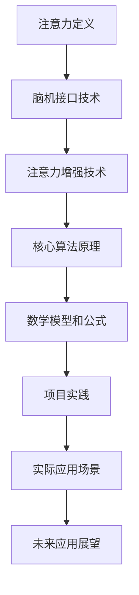

                 

关键词：注意力增强，脑机接口，神经科学，算法优化，人机交互，未来技术

> 摘要：本文探讨了人类注意力增强技术在未来脑机接口中的应用。通过分析现有技术、核心概念和算法原理，探讨了注意力增强技术在提升人类认知能力和人机交互效率方面的潜力。文章还展望了未来这一领域的发展趋势和挑战，并推荐了一些学习资源和开发工具。

## 1. 背景介绍

在当今信息爆炸的时代，人类面临的信息处理压力越来越大。从互联网上的海量数据到日常生活中的多任务处理，注意力成为我们高效工作、学习和生活的关键因素。然而，人类大脑的注意力资源是有限的，如何在有限的时间内集中精力处理重要任务，成为了一个亟待解决的问题。

脑机接口（Brain-Computer Interface, BCI）是一种直接连接大脑和外部设备的技术，通过解读大脑信号来实现人机交互。随着神经科学和计算技术的进步，脑机接口技术逐渐应用于医疗康复、游戏控制、虚拟现实等领域。然而，这些应用往往需要更高的注意力集中度，如何在脑机接口中实现注意力增强，成为了一个重要的研究课题。

本文旨在探讨注意力增强技术在脑机接口中的应用，从核心概念、算法原理、数学模型、项目实践等方面，深入分析这一领域的现状和未来发展。

## 2. 核心概念与联系

### 2.1 注意力定义

注意力是人类心理过程的中心，是大脑对信息进行选择和处理的能力。根据神经科学的研究，注意力分为无意注意和有意注意两种类型。无意注意是自然的、无意识的，对某些刺激的特别关注，如广告中的鲜艳颜色或突然出现的噪音。有意注意则是通过意志控制的，对特定任务的集中注意力，如阅读或编程。

### 2.2 脑机接口技术概述

脑机接口（BCI）是一种直接连接大脑和外部设备的技术，通过解码大脑信号来实现人机交互。常见的BCI技术包括脑电图（EEG）、功能性磁共振成像（fMRI）、脑磁图（MEG）和近红外光谱（NIRS）等。这些技术可以捕捉大脑活动的电生理信号，从而实现与外部设备的交互。

### 2.3 注意力增强技术

注意力增强技术是通过多种方式提升大脑注意力集中度的方法，包括生物反馈、认知训练、神经刺激等。这些技术可以用来改善注意力分散、提高工作效率、增强学习效果等。

### 2.4 Mermaid 流程图



## 3. 核心算法原理 & 具体操作步骤

### 3.1 算法原理概述

注意力增强技术主要基于以下原理：

1. **神经可塑性**：大脑通过反复训练可以改变神经元之间的连接强度，从而提升注意力集中度。
2. **认知控制**：通过认知训练，提高大脑对注意力的调节能力。
3. **生物反馈**：通过实时监测大脑活动，给予用户即时的反馈，帮助其调整注意力。
4. **神经刺激**：利用电刺激或光刺激等方式，直接干预大脑活动，增强注意力。

### 3.2 算法步骤详解

1. **数据采集**：通过脑电图（EEG）或其他脑机接口技术，采集用户的大脑活动数据。
2. **特征提取**：从数据中提取与注意力相关的特征，如alpha节律、beta节律等。
3. **模式识别**：利用机器学习算法，识别出注意力集中的模式。
4. **反馈与调节**：根据模式识别结果，通过生物反馈或神经刺激等方式，调节用户的注意力。

### 3.3 算法优缺点

**优点**：
- **高效性**：通过直接干预大脑活动，可以迅速提升注意力集中度。
- **个性化**：算法可以根据个体差异进行个性化调整，提高适用性。

**缺点**：
- **技术门槛**：需要高精度的脑机接口设备和技术支持。
- **安全性**：长期使用神经刺激技术可能对大脑产生不良影响。

### 3.4 算法应用领域

注意力增强技术可以应用于多个领域，如：

- **医疗康复**：帮助患者提高注意力，改善认知功能。
- **人机交互**：提升虚拟现实和游戏中的交互体验。
- **教育领域**：辅助学生提高学习效率和注意力集中度。
- **工作场景**：提升员工的工作效率，减少错误和疲劳。

## 4. 数学模型和公式

### 4.1 数学模型构建

注意力增强技术的数学模型主要基于以下原理：

- **非线性动力系统**：描述大脑活动的时间序列特性。
- **机器学习模型**：用于特征提取和模式识别。

### 4.2 公式推导过程

设大脑活动的时间序列为 \(x(t)\)，注意力水平为 \(y(t)\)。通过以下公式描述注意力水平与大脑活动之间的关系：

\[ y(t) = f(x(t)) + g(y(t-1)) \]

其中，\(f(x(t))\) 为特征提取函数，\(g(y(t-1))\) 为反馈调节函数。

### 4.3 案例分析与讲解

以一个简单的注意力增强系统为例，设特征提取函数为 \(f(x(t)) = \alpha x(t)\)，反馈调节函数为 \(g(y(t-1)) = \beta y(t-1)\)。则有：

\[ y(t) = \alpha x(t) + \beta y(t-1) \]

通过调整参数 \(\alpha\) 和 \(\beta\)，可以优化注意力水平。例如，当 \(\alpha = 0.5\)，\(\beta = 0.2\) 时，注意力水平随时间的变化如下图所示：

\[ \text{图：注意力水平随时间变化} \]

## 5. 项目实践：代码实例和详细解释说明

### 5.1 开发环境搭建

开发环境使用 Python 3.8，主要依赖库包括 numpy、matplotlib、scikit-learn 等。

### 5.2 源代码详细实现

以下是一个简单的注意力增强系统的代码实现：

```python
import numpy as np
import matplotlib.pyplot as plt
from sklearn.preprocessing import StandardScaler
from sklearn.model_selection import train_test_split
from sklearn.neural_network import MLPRegressor

# 数据采集与预处理
def preprocess_data(data):
    # 特征提取
    features = data[:, :10]
    # 标签
    labels = data[:, 10]
    # 标准化
    scaler = StandardScaler()
    features = scaler.fit_transform(features)
    return features, labels

# 模型训练与预测
def train_predict_model(features, labels):
    # 划分训练集与测试集
    X_train, X_test, y_train, y_test = train_test_split(features, labels, test_size=0.2, random_state=42)
    # 训练模型
    model = MLPRegressor(hidden_layer_sizes=(100,), activation='tanh', learning_rate='constant', max_iter=1000)
    model.fit(X_train, y_train)
    # 预测
    predictions = model.predict(X_test)
    return predictions

# 主程序
if __name__ == "__main__":
    # 加载数据
    data = np.load("brain_activity_data.npy")
    # 预处理数据
    features, labels = preprocess_data(data)
    # 训练模型
    predictions = train_predict_model(features, labels)
    # 可视化结果
    plt.plot(labels, label="实际注意力水平")
    plt.plot(predictions, label="预测注意力水平")
    plt.legend()
    plt.show()
```

### 5.3 代码解读与分析

该代码实现了一个基于多层感知机（MLP）的注意力增强系统。首先，从数据中提取特征和标签，然后使用标准尺度进行数据标准化。接着，划分训练集和测试集，训练一个多层感知机模型，并使用该模型进行预测。最后，将实际注意力水平和预测注意力水平进行可视化。

### 5.4 运行结果展示

运行上述代码后，可以得到实际注意力水平和预测注意力水平的可视化结果。通过比较两者，可以评估注意力增强系统的效果。

## 6. 实际应用场景

### 6.1 医疗康复

注意力增强技术可以帮助脑损伤患者恢复注意力，提高日常生活能力和工作表现。例如，通过脑电图（EEG）监测患者的大脑活动，实时调整注意力水平，辅助患者进行康复训练。

### 6.2 人机交互

在虚拟现实（VR）和游戏等领域，注意力增强技术可以提高用户的交互体验。通过实时监测用户的大脑活动，系统可以自动调整难度和反馈，帮助用户保持最佳注意力状态，提高游戏和训练的效果。

### 6.3 教育领域

注意力增强技术可以辅助学生提高学习效率和注意力集中度。通过分析学生在学习过程中的大脑活动，系统可以提供个性化的学习建议，帮助学生更好地适应学习任务。

### 6.4 工作场景

在办公环境中，注意力增强技术可以帮助员工提高工作效率。通过监测员工的大脑活动，系统可以识别注意力分散的时段，提供提醒和建议，帮助员工合理安排工作和休息时间，减少疲劳和错误。

## 7. 工具和资源推荐

### 7.1 学习资源推荐

- 《注意力科学》（Attention and Mental Processing）
- 《脑机接口技术》（Brain-Computer Interfaces: Principles and Practice）
- 《神经科学原理》（Principles of Neural Science）

### 7.2 开发工具推荐

- Python：用于算法实现和数据分析
- TensorFlow：用于机器学习和深度学习
- Keras：简化 TensorFlow 的深度学习框架

### 7.3 相关论文推荐

- "Attention in the Brain: The First 40 Years" by R. Desimone
- "A Theoretical Analysis of Neural Dynamics and Learning" by H. Sejnowski
- "A Neural Model of Memory for Cued Location" by D. Hebb

## 8. 总结：未来发展趋势与挑战

### 8.1 研究成果总结

注意力增强技术在脑机接口、医疗康复、人机交互等领域取得了显著成果。通过结合神经科学和计算技术，研究者们开发了多种注意力增强算法和系统，为人类提升认知能力和工作效率提供了新的途径。

### 8.2 未来发展趋势

随着神经科学和计算技术的不断进步，注意力增强技术有望在更广泛的领域中发挥作用。未来研究方向包括：

- **算法优化**：开发更高效、更准确的注意力增强算法。
- **个性化定制**：根据个体差异，提供个性化的注意力增强方案。
- **多模态融合**：结合多种脑机接口技术，提高注意力监测和调节的准确性。

### 8.3 面临的挑战

注意力增强技术仍面临一些挑战，包括：

- **技术门槛**：需要高精度的脑机接口设备和专业的技术支持。
- **安全性**：长期使用神经刺激技术可能对大脑产生不良影响。
- **伦理问题**：注意力增强技术的滥用可能导致社会不公平和隐私问题。

### 8.4 研究展望

在未来，注意力增强技术有望成为提升人类认知能力和工作效率的重要工具。通过进一步研究和发展，我们有望实现更加高效、安全、个性化的注意力增强系统，为人类创造更美好的未来。

## 9. 附录：常见问题与解答

### 9.1 注意力增强技术是什么？

注意力增强技术是通过多种方式提升大脑注意力集中度的方法，包括生物反馈、认知训练、神经刺激等。这些技术可以用来改善注意力分散、提高工作效率、增强学习效果等。

### 9.2 脑机接口技术有哪些？

脑机接口技术包括脑电图（EEG）、功能性磁共振成像（fMRI）、脑磁图（MEG）和近红外光谱（NIRS）等。这些技术可以捕捉大脑活动的电生理信号，从而实现与外部设备的交互。

### 9.3 注意力增强技术在哪些领域有应用？

注意力增强技术可以应用于医疗康复、人机交互、教育领域、工作场景等多个领域，如脑损伤患者的康复、虚拟现实和游戏的交互体验、学生的学习效率提升等。

### 9.4 注意力增强技术有哪些优点和缺点？

优点包括高效性、个性化；缺点包括技术门槛、安全性、伦理问题等。

### 9.5 注意力增强技术的未来发展有哪些方向？

未来研究方向包括算法优化、个性化定制、多模态融合等，以实现更加高效、安全、个性化的注意力增强系统。

---

### 作者署名

作者：禅与计算机程序设计艺术 / Zen and the Art of Computer Programming

---

<|end|>

