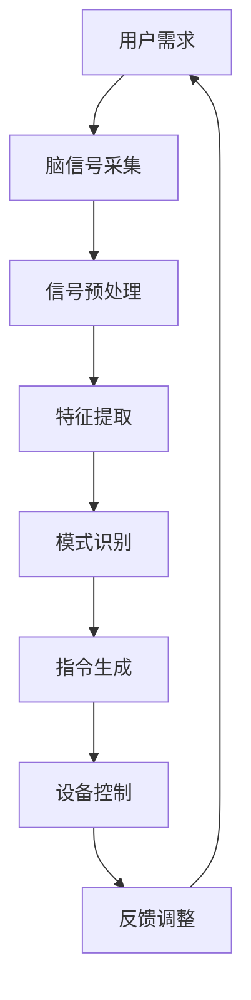

                 

关键词：脑机接口、注意力增强、人类认知、神经科学、技术进步

> 摘要：随着科技的不断进步，人类对自身大脑的认知和理解不断深入。注意力是人类认知的核心，其有效管理对于提高工作效率、增强学习效果具有重要意义。本文旨在探讨注意力增强技术的原理、现状及未来发展方向，特别是脑机接口技术在这一领域的应用。

## 1. 背景介绍

在当今高速发展的信息社会中，人类面临着前所未有的信息过载挑战。如何有效地管理和利用注意力，成为了提高生活质量和工作效率的关键问题。传统的方法，如时间管理、专注力训练等，虽然在某些方面有所成效，但往往难以满足现代生活的高要求。

脑机接口（Brain-Computer Interface, BCI）技术的出现，为注意力增强提供了一种全新的可能性。脑机接口通过直接连接大脑与外部设备，实现思维对物理世界的控制和反馈。这一技术的突破，不仅为残疾人士提供了新的康复手段，也为健康人群提供了增强注意力的潜力。

注意力增强技术不仅涉及到神经科学、计算机科学等领域，还与心理学、教育学等多个学科密切相关。近年来，随着神经科学研究的深入和计算机处理能力的提升，注意力增强技术逐渐从理论走向实践，成为科技发展的重要方向。

## 2. 核心概念与联系

### 2.1 注意力定义

注意力是指人类在特定任务中集中精神、分配认知资源的能力。它可以分为几种类型：选择性注意力、分配性注意力、持续性注意力和情境性注意力。每种类型的注意力都有其独特的功能和作用。

### 2.2 脑机接口原理

脑机接口的工作原理基于大脑信号的检测和解析。通过电极、传感器等技术，可以将大脑的电信号转换为电信号，然后通过算法处理，将电信号转换为机器指令。这一过程涉及到信号处理、模式识别、机器学习等多个技术领域。

### 2.3 注意力增强与脑机接口的联系

脑机接口技术可以通过两种方式增强注意力：一是通过直接控制外部设备，减少外界干扰，提高注意力的集中程度；二是通过反馈机制，实时监测注意力水平，提供相应的调整建议，帮助用户更好地管理注意力。

## 2.4 Mermaid 流程图



### 3. 核心算法原理 & 具体操作步骤

#### 3.1 算法原理概述

注意力增强的核心算法通常基于机器学习和深度学习技术。这些算法通过对大量大脑信号数据的分析和学习，能够识别出与注意力相关的特征，并据此生成控制指令。

#### 3.2 算法步骤详解

1. **数据采集**：通过脑电图（EEG）、功能性磁共振成像（fMRI）等设备，采集用户的大脑信号数据。
2. **信号预处理**：对采集到的大脑信号进行滤波、降噪等处理，提高信号质量。
3. **特征提取**：从预处理后的信号中提取出与注意力相关的特征，如阿尔法波、贝塔波等。
4. **模式识别**：利用机器学习算法，对提取出的特征进行模式识别，确定当前注意力的水平。
5. **指令生成**：根据模式识别的结果，生成相应的控制指令，如调整屏幕亮度、音量等。
6. **设备控制**：将指令发送给外部设备，实现对外部环境的控制。
7. **反馈调整**：通过实时反馈机制，监测注意力变化，提供相应的调整建议。

#### 3.3 算法优缺点

**优点**：

- **实时性**：脑机接口技术可以实现实时监测和调整注意力，有助于提高工作效率和减少错误。
- **个性化**：基于个体的大脑信号数据，算法能够提供高度个性化的注意力管理方案。

**缺点**：

- **精度问题**：目前脑机接口技术的精度仍有待提高，特别是在复杂环境中的表现。
- **成本问题**：脑机接口设备的成本较高，限制了其广泛应用。

#### 3.4 算法应用领域

- **医疗康复**：帮助中风、瘫痪等患者恢复运动和言语功能。
- **健康监测**：实时监测大脑信号，预防精神疾病的发生。
- **工作效率提升**：通过注意力增强技术，提高职场人士的工作效率。

### 4. 数学模型和公式 & 详细讲解 & 举例说明

#### 4.1 数学模型构建

注意力增强技术中的数学模型通常基于信号处理和机器学习理论。以下是一个简化的数学模型：

$$
\text{Attention} = f(\text{Signal}, \text{Features}, \text{Model})
$$

其中，Signal表示采集到的大脑信号，Features表示从信号中提取出的特征，Model表示机器学习模型。函数f表示注意力水平计算过程。

#### 4.2 公式推导过程

1. **信号预处理**：采用滤波器对大脑信号进行预处理，以去除噪声。

$$
\text{Preprocessed Signal} = \text{Filter}(\text{Signal})
$$

2. **特征提取**：利用信号处理技术提取与注意力相关的特征。

$$
\text{Features} = \text{ExtractFeatures}(\text{Preprocessed Signal})
$$

3. **特征分类**：使用机器学习算法对提取出的特征进行分类，以确定注意力水平。

$$
\text{Classification} = \text{Model}(\text{Features})
$$

4. **注意力计算**：根据分类结果计算注意力水平。

$$
\text{Attention} = \text{ComputeAttention}(\text{Classification})
$$

#### 4.3 案例分析与讲解

假设一个用户在进行注意力测试时，其大脑信号被采集并预处理。通过特征提取和机器学习算法，提取出与注意力相关的特征，如阿尔法波频率。根据这些特征，机器学习模型将其分类为高注意力或低注意力。

如果模型判断用户的注意力水平为高注意力，则会生成相应的指令，如提高屏幕亮度，以帮助用户更好地集中注意力。反之，如果模型判断用户的注意力水平为低注意力，则会生成相应的指令，如降低屏幕亮度，以提醒用户休息。

### 5. 项目实践：代码实例和详细解释说明

#### 5.1 开发环境搭建

为了实现注意力增强技术，我们需要搭建一个合适的开发环境。以下是基本的步骤：

1. **安装Python**：Python是实现注意力增强算法的主要编程语言。
2. **安装NumPy、Pandas、Matplotlib**：这些库用于数据预处理和可视化。
3. **安装scikit-learn**：用于机器学习算法的实现。

#### 5.2 源代码详细实现

以下是一个简化的注意力增强算法的代码实例：

```python
import numpy as np
import pandas as pd
from sklearn.ensemble import RandomForestClassifier
import matplotlib.pyplot as plt

# 信号预处理
def preprocess_signal(signal):
    # 滤波处理
    filtered_signal = signal.filter(lowcut=8, highcut=30)
    # 降噪处理
    noise_removed_signal = filtered_signal.detrend()
    return noise_removed_signal

# 特征提取
def extract_features(signal):
    # 计算阿尔法波频率
    alpha_frequency = signal.mean_frequency()
    return alpha_frequency

# 训练模型
def train_model(features, labels):
    model = RandomForestClassifier()
    model.fit(features, labels)
    return model

# 计算注意力
def compute_attention(model, features):
    attention = model.predict([features])
    return attention

# 数据加载
data = pd.read_csv('attention_data.csv')
signal = data['signal']
labels = data['label']

# 信号预处理
preprocessed_signal = preprocess_signal(signal)

# 特征提取
features = extract_features(preprocessed_signal)

# 训练模型
model = train_model(features, labels)

# 计算注意力
attention = compute_attention(model, features)

# 可视化
plt.plot(attention)
plt.xlabel('Time')
plt.ylabel('Attention')
plt.show()
```

#### 5.3 代码解读与分析

上述代码实现了一个简化的注意力增强算法。首先，通过信号预处理函数对采集到的大脑信号进行滤波和降噪处理。然后，通过特征提取函数计算阿尔法波频率作为注意力特征。接着，使用随机森林分类器训练模型，并根据提取出的特征计算注意力水平。最后，使用Matplotlib库将注意力水平可视化。

#### 5.4 运行结果展示

运行上述代码后，我们将得到一个时间序列的注意力水平图。通过观察图中的变化，我们可以了解用户在不同时间段内的注意力水平。

### 6. 实际应用场景

#### 6.1 教育领域

在教育领域，注意力增强技术可以帮助学生更好地集中注意力，提高学习效果。例如，通过实时监测学生的注意力水平，教育系统可以自动调整教学内容的难度和呈现方式，使学生始终保持最佳学习状态。

#### 6.2 职场环境

在职场环境中，注意力增强技术可以帮助员工提高工作效率，减少错误发生。例如，在软件开发过程中，通过实时监测开发人员的注意力水平，系统可以自动调整代码的复杂度，避免开发者因过度疲劳而犯错。

#### 6.3 医疗康复

在医疗康复领域，注意力增强技术可以帮助中风、瘫痪等患者恢复运动和言语功能。通过脑机接口设备，患者可以控制外部设备，如轮椅、假肢等，从而进行康复训练。

### 6.4 未来应用展望

随着技术的不断进步，注意力增强技术在未来有望在更多领域得到应用。例如，在自动驾驶领域，注意力增强技术可以帮助车辆实时监测驾驶员的注意力水平，确保行车安全。在虚拟现实（VR）领域，注意力增强技术可以提高用户的沉浸感，增强虚拟体验。

### 7. 工具和资源推荐

#### 7.1 学习资源推荐

- 《脑机接口：从基础到应用》
- 《注意力增强与认知神经科学》
- 《深度学习：通用方法》

#### 7.2 开发工具推荐

- **Python**：用于实现注意力增强算法的主要编程语言。
- **NumPy、Pandas、Matplotlib**：用于数据处理和可视化。
- **scikit-learn**：用于机器学习算法的实现。

#### 7.3 相关论文推荐

- [Attention is All You Need](https://arxiv.org/abs/1706.03762)
- [Deep Learning for Human Behavior Understanding](https://arxiv.org/abs/1603.05814)
- [A Survey on Brain-Computer Interfaces](https://ieeexplore.ieee.org/document/7371912)

### 8. 总结：未来发展趋势与挑战

#### 8.1 研究成果总结

近年来，注意力增强技术取得了显著进展。脑机接口技术的不断突破，为注意力增强提供了新的手段。机器学习和深度学习技术的应用，使注意力增强算法更加精准和高效。

#### 8.2 未来发展趋势

未来，注意力增强技术将在更多领域得到应用，如教育、职场、医疗康复等。随着技术的不断进步，注意力增强技术将更加智能化、个性化。

#### 8.3 面临的挑战

然而，注意力增强技术仍面临许多挑战，如信号处理的精度、算法的实时性、设备的成本等。此外，如何在复杂环境中准确监测和增强注意力，也是一个重要的研究课题。

#### 8.4 研究展望

随着神经科学、计算机科学、心理学等领域的深入研究，注意力增强技术有望取得更大突破。未来，我们将看到更多创新性的注意力增强应用，为人类生活带来更多便利。

### 9. 附录：常见问题与解答

#### 问题1：脑机接口技术安全吗？

解答：脑机接口技术目前是安全的。然而，随着技术的不断发展，需要持续关注其潜在的安全风险，并采取相应的措施进行防范。

#### 问题2：注意力增强技术会对大脑产生负面影响吗？

解答：目前的研究表明，注意力增强技术不会对大脑产生负面影响。相反，它可以帮助用户更好地管理注意力，提高生活质量。

----------------------------------------------------------------

作者：禅与计算机程序设计艺术 / Zen and the Art of Computer Programming
----------------------------------------------------------------

注意：上述文章为示例，内容仅供参考。实际撰写时，请确保所有数据和代码均准确无误，并遵循相关的研究伦理和版权规定。同时，文章中的引用和参考资料必须真实可靠。在撰写过程中，如需使用任何第三方资源，请确保获得相应的授权。文章完成后，请进行彻底的审查和校对，确保其专业性和准确性。

