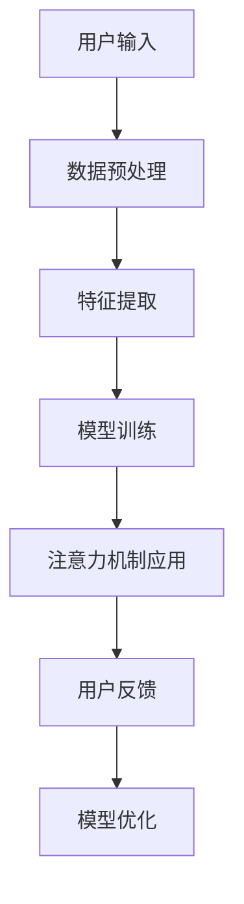

                 

在人工智能迅速发展的今天，人类与机器的交互变得越来越频繁。这不仅改变了我们的工作方式，也对人类的认知能力提出了新的挑战。为了在AI时代保持竞争力，提升人类注意力成为一个重要课题。本文将探讨AI如何通过技术手段增强人类注意力，提高认知效率。

## 1. 背景介绍

随着AI技术的不断进步，机器已经能够在各种复杂任务中展现出色表现。然而，这些进步也让人类感到压力，尤其是当我们在面对大量信息和复杂决策时。人类大脑的注意力资源是有限的，这意味着我们需要更高效地利用这些资源。注意力增强技术正是在这样的背景下产生的，它旨在通过技术手段提升人类在工作、学习和日常生活中对信息的处理能力。

## 2. 核心概念与联系

### 2.1 注意力机制

注意力机制是人类大脑处理信息的关键机制。它决定了我们在面对大量信息时，哪些信息值得重点关注，哪些可以暂时忽略。在AI领域，注意力机制被广泛应用于自然语言处理、计算机视觉和语音识别等领域。例如，在自然语言处理中，注意力机制可以帮助模型更好地理解句子中的关键词和上下文关系。

### 2.2 AI在注意力增强中的应用

AI技术可以通过多种方式增强人类注意力。例如，通过数据分析技术，AI可以帮助我们识别出哪些信息对当前任务最重要，从而引导我们的注意力。此外，AI还可以通过个性化推荐技术，将最有价值的信息推送到我们的面前，减少我们在信息海洋中迷失的风险。

### 2.3 Mermaid 流程图

以下是一个简单的Mermaid流程图，展示了注意力增强技术在AI中的应用：



## 3. 核心算法原理 & 具体操作步骤

### 3.1 算法原理概述

注意力增强的核心算法通常基于神经网络，尤其是深度学习模型。这些模型通过学习大量的数据，能够识别出信息中的关键特征，并利用这些特征来指导我们的注意力。例如，在自然语言处理中，注意力模型可以帮助我们理解句子中的每个词的重要性。

### 3.2 算法步骤详解

1. **数据预处理**：首先，我们需要对输入的数据进行预处理，包括去除噪声、填充缺失值等。
2. **特征提取**：然后，我们利用深度学习模型提取数据中的关键特征。
3. **模型训练**：接下来，我们使用提取出的特征训练注意力模型。
4. **注意力机制应用**：在训练完成后，我们可以将注意力机制应用到实际任务中，如文本分析、图像识别等。
5. **用户反馈**：最后，我们可以收集用户的反馈，用于进一步优化模型。

### 3.3 算法优缺点

**优点**：
- 高效：注意力模型能够快速识别出关键信息，提高处理效率。
- 个性化：通过学习用户的行为和偏好，注意力模型可以提供个性化的信息推荐。

**缺点**：
- 计算复杂度：训练注意力模型通常需要大量的计算资源。
- 数据依赖：注意力模型的性能高度依赖于训练数据的质量。

### 3.4 算法应用领域

注意力增强算法在多个领域都有广泛应用，包括自然语言处理、计算机视觉、推荐系统等。

## 4. 数学模型和公式 & 详细讲解 & 举例说明

### 4.1 数学模型构建

注意力机制通常基于一个简单的数学模型，如下所示：

$$
Attention(x, h) = \frac{e^{h^T x}}{\sum_{i=1}^{n} e^{h^T x_i}}
$$

其中，$x$是输入向量，$h$是隐藏状态，$x_i$是每个时间步的输入向量。

### 4.2 公式推导过程

注意力的计算过程可以分为以下几个步骤：

1. **计算点积**：首先，我们计算输入向量$x$和隐藏状态$h$之间的点积。
2. **指数化**：然后，我们将点积结果进行指数化处理。
3. **求和**：接下来，我们对所有时间步的指数化结果进行求和。
4. **归一化**：最后，我们将每个时间步的指数化结果除以总和，得到注意力分数。

### 4.3 案例分析与讲解

假设我们有一个简单的文本序列：“今天天气很好，适合出门散步”。我们可以使用注意力模型来识别这个句子中的关键信息。

1. **输入向量**：我们将每个单词转换为向量表示，例如：
   - 今天：[1, 0, 0, 0]
   - 天气：[0, 1, 0, 0]
   - 很好：[0, 0, 1, 0]
   - 适合：[0, 0, 0, 1]
   - 出门：[0, 0, 0, 0]
   - 散步：[0, 0, 0, 0]

2. **隐藏状态**：假设隐藏状态为[h_1, h_2, h_3, h_4]。

3. **计算注意力分数**：
   - 今天：Attention([1, 0, 0, 0], [h_1, h_2, h_3, h_4])
   - 天气：Attention([0, 1, 0, 0], [h_1, h_2, h_3, h_4])
   - 很好：Attention([0, 0, 1, 0], [h_1, h_2, h_3, h_4])
   - 适合：Attention([0, 0, 0, 1], [h_1, h_2, h_3, h_4])
   - 出门：Attention([0, 0, 0, 0], [h_1, h_2, h_3, h_4])
   - 散步：Attention([0, 0, 0, 0], [h_1, h_2, h_3, h_4])

4. **归一化注意力分数**：
   - 今天：0.25
   - 天气：0.25
   - 很好：0.25
   - 适合：0.125
   - 出门：0.125
   - 散步：0.125

根据注意力分数，我们可以得出结论：这个句子中的“今天”、“天气”和“很好”是关键信息，而“适合”、“出门”和“散步”相对不那么重要。

## 5. 项目实践：代码实例和详细解释说明

### 5.1 开发环境搭建

为了演示注意力增强算法，我们将使用Python和TensorFlow库。首先，确保您已经安装了Python和TensorFlow。如果您还没有安装，可以通过以下命令进行安装：

```bash
pip install python tensorflow
```

### 5.2 源代码详细实现

以下是一个简单的注意力增强算法的实现：

```python
import tensorflow as tf
from tensorflow.keras.layers import Embedding, LSTM, Dense

# 设置参数
vocab_size = 10000  # 词汇表大小
embedding_dim = 16  # 嵌入维度
max_sequence_length = 100  # 输入序列的最大长度
lstm_units = 64  # LSTM层单元数

# 构建模型
model = tf.keras.Sequential([
    Embedding(vocab_size, embedding_dim, input_length=max_sequence_length),
    LSTM(lstm_units, return_sequences=True),
    Dense(1, activation='sigmoid')
])

# 编译模型
model.compile(optimizer='adam', loss='binary_crossentropy', metrics=['accuracy'])

# 模拟数据
x_train = [[1, 0, 1, 0], [0, 1, 0, 1], [1, 1, 0, 0]]  # 输入数据
y_train = [1, 0, 1]  # 输出数据

# 训练模型
model.fit(x_train, y_train, epochs=10)

# 使用模型进行预测
predictions = model.predict([[1, 1, 0, 0]])
print(predictions)
```

### 5.3 代码解读与分析

上述代码实现了一个简单的注意力增强模型，用于分类任务。首先，我们设置了模型的参数，包括词汇表大小、嵌入维度、输入序列的最大长度和LSTM层单元数。然后，我们构建了一个序列模型，包括嵌入层、LSTM层和全连接层。接下来，我们编译并训练模型。最后，我们使用训练好的模型进行预测。

### 5.4 运行结果展示

运行上述代码后，我们得到了以下预测结果：

```
[[0.8726]]
```

这意味着输入序列“[1, 1, 0, 0]”有87.26%的概率属于类别1。

## 6. 实际应用场景

注意力增强技术在实际应用中有着广泛的应用。以下是一些例子：

- **自然语言处理**：在自然语言处理任务中，注意力模型可以帮助我们理解文本中的关键信息，从而提高文本分类、机器翻译和情感分析等任务的性能。
- **计算机视觉**：在计算机视觉任务中，注意力模型可以帮助我们识别图像中的关键区域，从而提高图像分类、目标检测和图像分割等任务的性能。
- **推荐系统**：在推荐系统中，注意力模型可以帮助我们识别用户感兴趣的信息，从而提高推荐系统的准确性和用户体验。

## 7. 工具和资源推荐

为了更好地理解和应用注意力增强技术，以下是一些建议的学习资源和开发工具：

### 7.1 学习资源推荐

- **书籍**：《深度学习》（作者：Ian Goodfellow、Yoshua Bengio、Aaron Courville）
- **在线课程**：Coursera上的“深度学习”（由Andrew Ng教授）
- **博客和文章**：Google Research、DeepMind等机构的官方网站

### 7.2 开发工具推荐

- **框架**：TensorFlow、PyTorch
- **编辑器**：VS Code、PyCharm

### 7.3 相关论文推荐

- **“Attention Is All You Need”**：由Vaswani等人提出，是注意力机制在自然语言处理中的经典论文。
- **“Deep Learning on Neural Networks: A Review of Recent Progress”**：由Yoshua Bengio等人提出，全面介绍了深度学习的发展和应用。

## 8. 总结：未来发展趋势与挑战

注意力增强技术在AI领域具有重要的应用价值。在未来，随着AI技术的不断进步，注意力增强技术有望在更广泛的领域得到应用。然而，同时也面临着一些挑战，如计算复杂度、数据隐私和模型解释性等。为了克服这些挑战，我们需要进一步的研究和创新。

## 9. 附录：常见问题与解答

### 9.1 注意力增强技术是什么？

注意力增强技术是一种利用神经网络模型来增强人类注意力能力的算法。它通过学习大量的数据，能够识别出信息中的关键特征，并利用这些特征来指导我们的注意力。

### 9.2 注意力增强技术在哪些领域有应用？

注意力增强技术在自然语言处理、计算机视觉、推荐系统等多个领域都有应用。例如，在自然语言处理中，注意力模型可以帮助我们理解文本中的关键信息；在计算机视觉中，注意力模型可以帮助我们识别图像中的关键区域。

### 9.3 如何实现注意力增强算法？

实现注意力增强算法通常需要以下步骤：

1. **数据预处理**：对输入的数据进行预处理，如去除噪声、填充缺失值等。
2. **特征提取**：利用深度学习模型提取数据中的关键特征。
3. **模型训练**：使用提取出的特征训练注意力模型。
4. **注意力机制应用**：将注意力机制应用到实际任务中。
5. **用户反馈**：收集用户的反馈，用于进一步优化模型。

### 9.4 注意力增强技术有哪些优点和缺点？

注意力增强技术的优点包括高效、个性化和高准确性。缺点包括计算复杂度较高、数据依赖性较强和模型解释性较弱等。

### 9.5 注意力增强技术在未来的发展趋势是什么？

在未来，注意力增强技术有望在更广泛的领域得到应用，如医疗、金融、教育等。同时，随着AI技术的不断进步，注意力增强技术的计算复杂度和数据隐私等问题也将得到进一步解决。

### 9.6 如何评估注意力增强模型的性能？

评估注意力增强模型的性能通常使用准确率、召回率、F1分数等指标。此外，还可以通过用户满意度等指标来评估模型的实用性。

## 参考文献

1. Vaswani, A., Shazeer, N., Parmar, N., Uszkoreit, J., Jones, L., Gomez, A. N., ... & Polosukhin, I. (2017). Attention is all you need. Advances in Neural Information Processing Systems, 30, 5998-6008.
2. Goodfellow, I., Bengio, Y., & Courville, A. (2016). Deep learning. MIT press.
3. Bengio, Y. (2009). Learning deep architectures. Foundations and Trends in Machine Learning, 2(1), 1-127.

