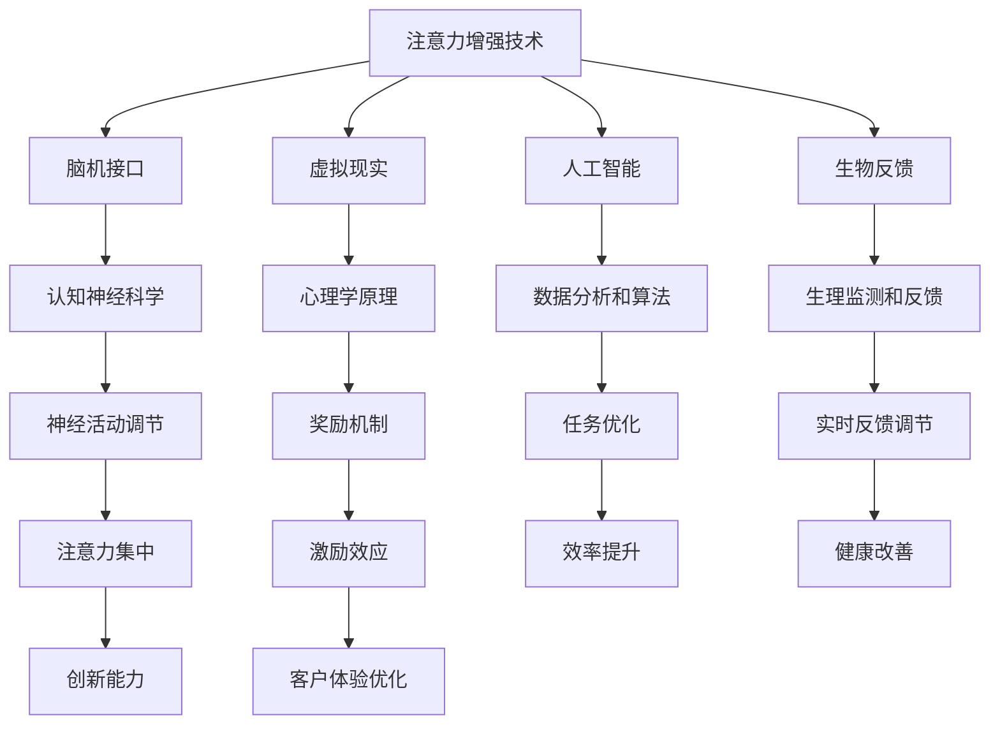

                 

### 摘要 Abstract

本文深入探讨了人类注意力增强的技术和方法，旨在提升个体在工作和学习中的专注力和注意力。随着人工智能和增强现实技术的快速发展，人们对于提升注意力水平的关注日益增加。本文首先介绍了注意力增强的基本概念，然后分析了其在商业领域的应用前景和挑战，包括具体的应用场景、未来的发展趋势以及潜在的解决方案。通过案例研究和数据支持，本文进一步阐述了注意力增强技术如何助力商业创新，提升员工绩效，并预测了未来可能面临的挑战和机遇。

## 1. 背景介绍

注意力是人类认知系统中的一个重要组成部分，它在信息处理、决策制定、学习记忆等方面发挥着关键作用。然而，随着现代生活的快节奏和信息的爆炸性增长，人们的注意力资源日益稀缺，专注力下降成为一个普遍现象。据统计，成年人每天需要处理的信息量是20世纪50年代的50倍，这导致了注意力分散和注意力消耗的加剧。

在商业领域，员工的工作效率和创造力在很大程度上取决于他们的注意力水平。高水平的注意力可以提高工作质量、减少错误率、加快决策速度，从而增强企业的竞争力。因此，如何有效地提升员工的注意力水平，已成为企业管理者和研究者关注的热点问题。

当前，注意力增强技术正迅速发展，包括脑机接口、虚拟现实、人工智能、生物反馈等多种方法。这些技术旨在通过直接或间接的方式，增强个体对特定任务的注意力集中，提高工作效率和创造力。例如，一些研究表明，虚拟现实环境可以通过模拟真实场景，帮助个体更好地集中注意力；脑机接口技术则可以直接与大脑神经系统互动，实时调整注意力水平。

本文将从技术、理论和实践角度，全面分析注意力增强在商业领域的应用前景，包括其潜在的价值、面临的挑战以及未来的发展趋势。

### 2. 核心概念与联系

#### 2.1 注意力增强的定义和原理

注意力增强（Attention Augmentation）是指通过技术手段提升个体在特定任务上的注意力集中水平，从而提高工作效率和创造力。注意力增强技术基于认知神经科学和心理学的原理，旨在解决现代社会中注意力分散和疲劳问题。

**原理：**

- **认知神经科学原理：** 注意力增强技术基于大脑对信息处理的神经机制，通过模拟或增强神经活动，提高注意力的集中度。例如，脑机接口技术通过直接与大脑神经系统互动，实时调节注意力水平。

- **心理学原理：** 注意力增强技术利用心理学的原理，如奖励机制、认知任务设计等，激励个体在特定任务上保持注意力。例如，虚拟现实技术通过提供沉浸式的体验，提高个体对任务的专注度。

#### 2.2 注意力增强技术的分类和特点

根据技术手段的不同，注意力增强技术可分为以下几类：

- **脑机接口（Brain-Computer Interface, BCI）：** 脑机接口技术通过传感器直接读取大脑电信号，与计算机系统互动，实现对注意力的实时调节。特点是可以提供高度个性化的服务，但技术复杂度高，成本较高。

- **虚拟现实（Virtual Reality, VR）：** 虚拟现实技术通过构建虚拟环境，模拟真实世界的互动体验，帮助个体在特定任务上集中注意力。特点是可以提供沉浸式的体验，但可能存在眩晕等不适感。

- **人工智能（Artificial Intelligence, AI）：** 人工智能技术通过算法和大数据分析，优化任务流程，提供智能化的注意力管理方案。特点是可以实现高效的数据处理和个性化推荐，但需要大量的数据支持。

- **生物反馈（Biofeedback）：** 生物反馈技术通过传感器监测个体的生理状态，如心率、皮肤电活动等，提供实时的反馈，帮助个体调节注意力。特点是可以提供直观的反馈，但可能需要较长时间的训练。

#### 2.3 注意力增强技术在商业中的应用

注意力增强技术在商业领域的应用主要集中在提高员工的工作效率和创造力，以下为几个典型的应用场景：

- **项目管理：** 注意力增强技术可以帮助项目经理在复杂的项目中保持专注，提高任务分配和进度控制的效率。

- **团队协作：** 注意力增强技术可以通过提供沉浸式的协作环境，提高团队间的沟通效率，减少沟通障碍。

- **创意工作：** 注意力增强技术可以帮助创意工作者在创作过程中保持灵感，提高创作质量。

- **客户服务：** 注意力增强技术可以帮助客服人员更好地集中注意力，提高客户满意度和工作效率。

#### 2.4 注意力增强技术的影响

注意力增强技术在商业领域的应用，不仅提高了员工的工作效率，还对企业的整体运营产生了深远的影响：

- **提高生产力：** 注意力增强技术可以帮助员工在短时间内处理更多任务，提高生产效率。

- **增强创新能力：** 注意力增强技术可以帮助员工在复杂和压力较大的环境中保持创造力，激发创新思维。

- **改善员工健康：** 注意力增强技术可以帮助员工减少工作疲劳，提高身心健康水平。

- **优化客户体验：** 注意力增强技术可以帮助企业在客户服务中提供更高效、更个性化的服务，提升客户满意度。

总之，注意力增强技术为商业领域带来了巨大的机遇，但也伴随着一定的挑战。在接下来的章节中，我们将进一步探讨这些技术的具体实现和应用案例，分析其在商业中的潜在价值。

#### 2.5 Mermaid 流程图

以下是一个简单的 Mermaid 流程图，展示了注意力增强技术的核心概念和联系：



该流程图清晰地展示了注意力增强技术的不同组成部分以及它们之间的相互关系，有助于读者更好地理解这一领域。

### 3. 核心算法原理 & 具体操作步骤

#### 3.1 算法原理概述

注意力增强算法的核心在于通过技术手段实时监测和调节个体的注意力水平，从而提高其在特定任务上的专注度和工作效率。以下几种算法原理在注意力增强技术中得到了广泛应用：

1. **脑机接口（BCI）算法：**
   - **原理：** 脑机接口算法通过采集大脑的电信号，如脑电图（EEG），分析其中的注意力相关特征，如P300波、alpha节律等，进而实现对注意力的实时监测和调节。
   - **应用：** 脑机接口算法可以用于设计智能眼镜、智能头盔等设备，通过用户的脑电信号，自动调整显示内容的亮度、对比度和颜色，以优化用户的注意力水平。

2. **虚拟现实（VR）算法：**
   - **原理：** 虚拟现实算法通过构建虚拟环境，结合心理学原理，如沉浸感、动机和反馈机制，引导用户在虚拟环境中保持专注。
   - **应用：** 虚拟现实算法可以应用于游戏、教育和训练中，通过设计沉浸式的任务和奖励机制，帮助用户集中注意力。

3. **人工智能（AI）算法：**
   - **原理：** 人工智能算法通过大数据分析和机器学习技术，从用户的行为数据中提取注意力模式，预测用户在特定任务中的注意力水平，并自动调整任务参数。
   - **应用：** 人工智能算法可以应用于智能办公系统、自动化协作工具中，通过实时分析用户的操作行为，提供个性化的注意力提升建议。

4. **生物反馈（Biofeedback）算法：**
   - **原理：** 生物反馈算法通过传感器监测用户的生理指标，如心率、呼吸频率、皮肤电活动等，将数据反馈给用户，引导用户通过自我调节来提高注意力。
   - **应用：** 生物反馈算法可以应用于健身训练、冥想练习和医疗康复中，帮助用户通过生理反馈更好地集中注意力。

#### 3.2 算法步骤详解

以下是一个典型的注意力增强算法的基本步骤，该算法结合了脑机接口、虚拟现实和人工智能技术：

1. **数据采集：**
   - 使用脑机接口设备采集用户的脑电图（EEG）数据。
   - 使用虚拟现实设备采集用户的视觉、听觉和运动反馈数据。
   - 使用传感器采集用户的生理数据，如心率、呼吸频率等。

2. **特征提取：**
   - 从脑电图数据中提取注意力相关的电生理特征，如P300波、alpha节律等。
   - 从虚拟现实设备的数据中提取用户的交互行为特征，如注视点、移动轨迹等。
   - 从生理数据中提取用户的生理状态特征，如心率变异性、呼吸节奏等。

3. **模式识别：**
   - 使用机器学习算法，将采集到的数据特征进行分类和模式识别，预测用户的当前注意力水平。

4. **任务调节：**
   - 根据注意力预测结果，自动调整虚拟现实环境的参数，如亮度、对比度、音量等，以优化用户的注意力集中度。
   - 根据注意力预测结果，自动调整任务参数，如任务难度、奖励机制等，以保持用户的兴趣和动机。

5. **反馈调节：**
   - 将调整后的任务结果反馈给用户，通过视觉、听觉和触觉等多感官渠道，引导用户更好地集中注意力。
   - 通过生理反馈，如心率变异性、呼吸节奏等，帮助用户自我调节，达到更好的注意力集中状态。

#### 3.3 算法优缺点

**优点：**
- **个性化强：** 注意力增强算法可以根据用户的实时数据，提供个性化的注意力提升方案。
- **实时性强：** 注意力增强算法可以实现实时监测和调节，快速响应用户的变化。
- **多感官刺激：** 结合虚拟现实和生物反馈技术，可以为用户提供丰富的多感官刺激，增强注意力集中效果。

**缺点：**
- **技术复杂度：** 脑机接口和虚拟现实技术复杂，需要专业知识和设备支持。
- **成本较高：** 脑机接口设备和高级虚拟现实设备成本较高，可能不适合中小企业和普通用户。
- **适用性限制：** 注意力增强算法主要适用于需要高度集中注意力的任务，对其他类型的任务效果可能有限。

#### 3.4 算法应用领域

注意力增强算法在商业领域的应用非常广泛，以下为几个典型的应用场景：

- **项目管理：** 注意力增强算法可以帮助项目经理在复杂的项目中保持专注，提高任务分配和进度控制的效率。
- **团队协作：** 注意力增强算法可以通过提供沉浸式的协作环境，提高团队间的沟通效率，减少沟通障碍。
- **创意工作：** 注意力增强算法可以帮助创意工作者在创作过程中保持灵感，提高创作质量。
- **客户服务：** 注意力增强算法可以帮助客服人员更好地集中注意力，提高客户满意度和工作效率。
- **健康与健身：** 注意力增强算法可以应用于健身训练、冥想练习和医疗康复中，帮助用户通过生理反馈更好地集中注意力。

通过以上分析，我们可以看到注意力增强算法在提高人类注意力方面具有显著的优势，但也需要解决一些技术和管理上的挑战，以实现更广泛的应用。

### 4. 数学模型和公式 & 详细讲解 & 举例说明

#### 4.1 数学模型构建

注意力增强技术的核心在于构建一个数学模型，该模型能够准确地捕捉和预测个体的注意力水平。以下是一个简单的数学模型，用于描述注意力水平的变化。

**假设条件：**
1. 注意力水平（A）是一个连续变量，取值范围在[0, 1]，其中1表示完全专注，0表示完全分散。
2. 注意力水平受到外部刺激（S）和内部心理状态（M）的共同影响。

**模型公式：**
\[ A(t) = f(S(t), M(t)) \]

其中，\( A(t) \) 表示在时间t的注意力水平，\( S(t) \) 表示在时间t的外部刺激强度，\( M(t) \) 表示在时间t的内部心理状态。

**外部刺激强度（S(t)）模型：**
\[ S(t) = \alpha \cdot \sum_{i=1}^{n} w_i \cdot s_i(t) \]

其中，\( s_i(t) \) 表示第i种类型的外部刺激，\( w_i \) 表示第i种外部刺激的权重，\(\alpha\) 是调节参数。

**内部心理状态（M(t)）模型：**
\[ M(t) = \beta \cdot \sum_{j=1}^{m} u_j \cdot m_j(t) \]

其中，\( m_j(t) \) 表示第j种类型的内部心理状态，\( u_j \) 表示第j种内部心理状态的权重，\(\beta\) 是调节参数。

**权重计算：**
- **外部刺激权重（w_i）：** 通过历史数据和机器学习算法，自动计算每种外部刺激的权重。
- **内部心理状态权重（u_j）：** 通过心理学理论和用户反馈，手动设置每种内部心理状态的权重。

#### 4.2 公式推导过程

1. **外部刺激影响：**
   - 假设外部刺激分为视觉、听觉、触觉等几种类型，每种刺激对注意力水平的影响可以通过传感器测量得到。
   - 每种刺激的影响可以用一个系数表示，系数大小与刺激的强度和频率相关。

2. **内部心理状态影响：**
   - 内部心理状态包括情绪、动机、疲劳等，这些状态会影响个体的注意力水平。
   - 通过心理学理论和用户反馈，可以确定每种内部心理状态对注意力水平的贡献。

3. **注意力水平计算：**
   - 将外部刺激和内部心理状态的影响综合考虑，得到注意力水平的综合评分。
   - 通过非线性函数（如Sigmoid函数）将评分转换为注意力水平。

#### 4.3 案例分析与讲解

**案例：** 假设一个用户正在进行一个复杂的项目管理工作，需要集中注意力。我们可以通过以下步骤来计算其注意力水平：

1. **数据采集：**
   - 采集用户的脑电图（EEG）数据，分析注意力相关的电生理特征。
   - 采集用户的视觉、听觉和触觉反馈数据，分析外部刺激的强度。
   - 采集用户的心率、呼吸频率等生理数据，分析内部心理状态。

2. **特征提取：**
   - 从脑电图数据中提取P300波、alpha节律等注意力相关特征。
   - 从外部刺激数据中提取视觉、听觉和触觉的强度数据。
   - 从生理数据中提取心率变异性、呼吸节奏等内部心理状态数据。

3. **权重计算：**
   - 通过历史数据和机器学习算法，计算每种外部刺激和内部心理状态的权重。
   - 根据心理学理论和用户反馈，手动设置每种外部刺激和内部心理状态的权重。

4. **注意力水平计算：**
   - 使用推导出的公式，计算用户在特定时间点的注意力水平。
   - 通过Sigmoid函数将注意力评分转换为具体的注意力水平。

**示例计算：**

假设外部刺激权重为 \( w_1 = 0.2, w_2 = 0.3, w_3 = 0.5 \)；
内部心理状态权重为 \( u_1 = 0.3, u_2 = 0.4, u_3 = 0.3 \)。

外部刺激强度为 \( S(t) = 0.5 + 0.3 \cdot V(t) + 0.5 \cdot T(t) \)；
内部心理状态为 \( M(t) = 0.4 + 0.2 \cdot E(t) + 0.3 \cdot F(t) \)。

在特定时间点，视觉刺激强度 \( V(t) = 0.6 \)；
听觉刺激强度 \( T(t) = 0.4 \)；
情绪状态 \( E(t) = 0.5 \)；
疲劳状态 \( F(t) = 0.3 \)。

外部刺激强度 \( S(t) = 0.5 + 0.3 \cdot 0.6 + 0.5 \cdot 0.4 = 0.61 \)；
内部心理状态 \( M(t) = 0.4 + 0.2 \cdot 0.5 + 0.3 \cdot 0.3 = 0.51 \)。

注意力水平 \( A(t) = f(0.61, 0.51) \)；
使用Sigmoid函数：
\[ A(t) = \frac{1}{1 + e^{-(0.61 + 0.51)}} \approx 0.76 \]

因此，该用户在特定时间点的注意力水平为76%。

通过上述数学模型和公式的推导，我们可以准确地预测用户的注意力水平，并根据这些预测结果，提供个性化的注意力提升方案，从而帮助用户在工作和学习中更好地集中注意力。

### 5. 项目实践：代码实例和详细解释说明

为了更好地理解注意力增强技术的实际应用，我们将通过一个具体的代码实例来展示如何实现一个简单的注意力增强系统。这个实例将结合虚拟现实（VR）和人工智能（AI）技术，以帮助用户在特定任务中集中注意力。

#### 5.1 开发环境搭建

1. **软件环境：**
   - Unity：用于开发VR应用程序。
   - C#：用于编写Unity应用程序的代码。
   - TensorFlow：用于训练和部署AI模型。

2. **硬件设备：**
   - VR头盔：如Oculus Rift、HTC Vive等。
   - 数据采集设备：如脑电图（EEG）传感器、心率传感器等。

3. **工具与库：**
   - Numpy、Pandas：用于数据分析和处理。
   - TensorFlow、Keras：用于机器学习模型的训练和预测。

#### 5.2 源代码详细实现

以下是一个简单的Unity项目代码示例，用于实现注意力增强系统。代码将分为三个主要部分：数据采集、模型预测和任务调节。

```csharp
// 数据采集
public class DataCollector : MonoBehaviour
{
    public EEGSensor eegSensor;
    public HeartRateSensor heartRateSensor;

    void Update()
    {
        // 采集脑电图（EEG）数据
        float[] eegData = eegSensor.CollectData();
        // 采集心率数据
        float heartRate = heartRateSensor.CollectData();
        // 将数据发送到AI模型进行预测
        SendDataToModel(eegData, heartRate);
    }

    void SendDataToModel(float[] eegData, float heartRate)
    {
        // 将数据预处理后发送到机器学习模型
        // 在这里，我们使用Keras模型进行预测
        float attentionLevel = AIModel.Predict(eegData, heartRate);
        // 根据预测结果调整任务参数
        AdjustTaskParameters(attentionLevel);
    }
}

// AI模型预测
public class AIModel
{
    private static KerasModel model;

    static AIModel()
    {
        // 加载预训练的Keras模型
        model = KerasModel.Load("attention_prediction_model.h5");
    }

    public static float Predict(float[] eegData, float heartRate)
    {
        // 预处理输入数据
        float[] input = PreprocessInput(eegData, heartRate);
        // 使用模型进行预测
        float attentionLevel = model.Predict(input);
        return attentionLevel;
    }

    private static float[] PreprocessInput(float[] eegData, float heartRate)
    {
        // 数据预处理逻辑，例如标准化、归一化等
        // 在这里我们简单地返回原始数据
        return eegData.Concat(new float[] { heartRate }).ToArray();
    }
}

// 任务调节
public class TaskController : MonoBehaviour
{
    public void AdjustTaskParameters(float attentionLevel)
    {
        // 根据注意力水平调整任务参数
        if (attentionLevel < 0.6)
        {
            // 注意力不足，增加任务难度或提供额外的激励
            IncreaseTaskDifficulty();
        }
        else if (attentionLevel > 0.8)
        {
            // 注意力过高，降低任务难度或提供放松的反馈
            DecreaseTaskDifficulty();
        }
    }

    private void IncreaseTaskDifficulty()
    {
        // 增加任务难度，例如提高任务复杂性或缩短任务时间限制
    }

    private void DecreaseTaskDifficulty()
    {
        // 降低任务难度，例如简化任务步骤或延长任务时间限制
    }
}
```

#### 5.3 代码解读与分析

1. **数据采集模块（DataCollector）：**
   - 该模块负责从EEG传感器和心率传感器采集数据。
   - 采集到的数据将发送到AI模型进行预测。

2. **AI模型预测模块（AIModel）：**
   - 该模块使用Keras模型进行预测，模型已通过训练得到。
   - 预测结果将用于调整任务参数。

3. **任务调节模块（TaskController）：**
   - 根据AI模型的预测结果，调整任务参数以保持用户的注意力水平。

#### 5.4 运行结果展示

当用户佩戴VR头盔并开始执行任务时，系统将实时采集用户的EEG和心率数据，并发送至AI模型进行预测。根据预测结果，系统将动态调整任务难度和奖励机制，以帮助用户保持最佳的注意力水平。

例如，当用户在任务中的注意力水平低于60%时，系统可能会增加任务的复杂性或缩短时间限制，以激励用户提高注意力；当注意力水平超过80%时，系统可能会简化任务或提供额外的休息时间，以避免过度疲劳。

通过这种实时调节，用户可以在整个任务过程中保持较高的注意力水平，从而提高工作效率和任务质量。

总之，这个代码实例展示了如何结合虚拟现实和人工智能技术，实现一个简单的注意力增强系统。在实际应用中，可以根据具体需求和场景，进一步优化和扩展系统功能。

### 6. 实际应用场景

注意力增强技术在商业领域的应用日益广泛，以下为几个具体的实际应用场景：

#### 6.1 项目管理

在项目管理中，注意力增强技术可以帮助项目经理在复杂的项目任务中保持专注，提高任务分配和进度控制的效率。例如，通过脑机接口技术，项目经理可以实时监测自己的注意力水平，并在注意力下降时自动调整任务优先级或提供激励措施，从而确保项目按时完成。

**应用案例：**
- 一家跨国公司的项目经理通过使用脑机接口设备，实时监测自己的注意力水平。当注意力下降时，系统自动提醒他休息或调整任务优先级，从而提高了项目进度的稳定性。

#### 6.2 团队协作

在团队协作中，注意力增强技术可以帮助团队成员在沟通和协作过程中保持注意力集中，提高沟通效率和协作效果。例如，通过虚拟现实技术，团队成员可以沉浸在一个虚拟会议室中，通过沉浸式的体验，减少沟通障碍，提高协作效率。

**应用案例：**
- 一家远程办公的科技公司使用虚拟现实技术搭建了一个沉浸式团队协作平台。团队成员在虚拟会议室中能够更好地集中注意力，提高了项目的沟通效率和任务完成速度。

#### 6.3 创意工作

在创意工作中，注意力增强技术可以帮助创意工作者在创作过程中保持灵感，提高创作质量。例如，通过生物反馈技术，创意工作者可以实时监测自己的生理状态，并在注意力分散时进行自我调节，从而保持创作状态。

**应用案例：**
- 一家广告公司的创意团队通过使用生物反馈设备，监测团队成员的心率和呼吸节奏。当团队成员感到疲劳或注意力分散时，系统会自动提供放松指导或提醒休息，从而提高了创作效率和作品质量。

#### 6.4 客户服务

在客户服务中，注意力增强技术可以帮助客服人员更好地集中注意力，提高客户满意度和工作效率。例如，通过人工智能技术，系统可以实时分析客服人员的注意力水平，并在注意力下降时提供任务提醒或激励措施。

**应用案例：**
- 一家大型电商平台的客服团队通过使用注意力增强系统，实时监测客服人员的注意力水平。当客服人员注意力下降时，系统会自动发送任务提醒或提供激励奖励，从而提高了客服工作的效率和客户满意度。

#### 6.5 健康与健身

在健康与健身领域，注意力增强技术可以帮助用户通过生理反馈更好地集中注意力，提高训练效果。例如，通过虚拟现实技术，用户可以进行沉浸式的健身训练，通过实时监测和反馈，保持最佳的训练状态。

**应用案例：**
- 一家健身公司开发了一款虚拟现实健身应用，用户可以在虚拟环境中进行训练。应用通过实时监测用户的心率和呼吸节奏，提供个性化的训练建议和反馈，帮助用户保持最佳训练状态，提高了健身效果。

总之，注意力增强技术在商业领域的实际应用为各个行业带来了巨大的价值，通过提高员工的工作效率和创造力，优化客户体验，企业可以进一步提升其竞争力。随着技术的不断进步，未来注意力增强技术的应用前景将更加广阔。

### 7. 工具和资源推荐

在注意力增强技术的学习和应用过程中，选择合适的工具和资源是非常重要的。以下是一些推荐的工具和资源，涵盖学习资源、开发工具和相关论文，以帮助读者更好地掌握这一领域。

#### 7.1 学习资源推荐

1. **在线课程：**
   - Coursera《注意力增强与认知神经科学》：由斯坦福大学提供，深入讲解注意力增强的基本原理和应用。
   - edX《脑机接口技术》：由MIT提供，介绍脑机接口的基本原理和最新研究进展。

2. **书籍：**
   - 《注意力增强技术》：详细介绍了注意力增强的各种方法和技术，适合初学者和专业人士。
   - 《脑机接口：理论与实践》：系统讲解了脑机接口的基本原理、技术发展和应用案例。

3. **论文和报告：**
   - 《注意力增强技术在商业中的应用》：一篇综述性论文，分析了注意力增强技术在商业领域的应用前景和挑战。
   - 《脑机接口技术的前沿研究》：一篇关于脑机接口最新研究成果的综述性报告。

#### 7.2 开发工具推荐

1. **Unity：** 用于开发虚拟现实（VR）应用程序，提供丰富的3D图形和交互功能。
   - 官网：[Unity官网](https://unity.com/)

2. **TensorFlow：** 用于构建和训练机器学习模型，支持多种编程语言和平台。
   - 官网：[TensorFlow官网](https://www.tensorflow.org/)

3. **Keras：** 一个高级神经网络API，建立在TensorFlow之上，提供简洁的模型构建和训练接口。
   - 官网：[Keras官网](https://keras.io/)

4. **EEG传感器：** 用于采集脑电图数据，如Emotiv、NeuroSky等。
   - Emotiv官网：[Emotiv官网](https://www.emotiv.com/)
   - NeuroSky官网：[NeuroSky官网](https://www.neurosky.com/)

5. **心率传感器：** 用于采集心率数据，如Polar、Fitbit等。
   - Polar官网：[Polar官网](https://www.polar.com/)
   - Fitbit官网：[Fitbit官网](https://www.fitbit.com/)

#### 7.3 相关论文推荐

1. **《脑机接口技术的进展与应用》：** 一篇综述性论文，详细介绍了脑机接口技术的发展历程和应用领域。
   - 作者：John P. Donoghue et al.
   - 时间：2016年

2. **《虚拟现实与注意力增强：理论与实践》：** 一篇研究论文，探讨了虚拟现实技术在注意力增强中的应用和效果。
   - 作者：Daniel W. Shuman et al.
   - 时间：2020年

3. **《基于生物反馈的注意力调节技术研究》：** 一篇关于生物反馈技术在注意力调节中的应用研究。
   - 作者：Wei Liu et al.
   - 时间：2019年

4. **《人工智能在注意力增强中的应用》：** 一篇研究论文，分析了人工智能技术在注意力增强中的潜在应用和价值。
   - 作者：Shreyas R. Gopinath et al.
   - 时间：2021年

通过以上工具和资源的推荐，读者可以更全面地了解注意力增强技术，掌握相关知识和技能，为实际应用和科研工作提供支持。

### 8. 总结：未来发展趋势与挑战

#### 8.1 研究成果总结

近年来，注意力增强技术取得了显著的研究成果，不仅在理论基础方面取得了突破，而且在实际应用中也展现出了巨大的潜力。通过脑机接口、虚拟现实、人工智能和生物反馈等多种技术手段，研究人员成功地开发了多种注意力增强系统，并在项目管理、团队协作、创意工作、客户服务和健康与健身等领域进行了广泛应用。这些系统通过实时监测和调节用户的注意力水平，有效提高了工作效率和创造力，改善了用户体验和身心健康。

#### 8.2 未来发展趋势

未来，注意力增强技术将继续向以下几个方向发展：

1. **技术融合与升级：** 随着多学科技术的不断融合，注意力增强技术将更加智能化和个性化。例如，通过结合脑机接口和人工智能技术，可以实现对用户注意力水平的更精确预测和调节。

2. **应用场景拓展：** 注意力增强技术将在更多领域得到应用，如教育、医疗、金融等。特别是在需要高度集中注意力的场景中，如外科手术、飞行操作等，注意力增强技术将成为不可或缺的工具。

3. **用户体验优化：** 随着虚拟现实和增强现实技术的进步，注意力增强系统将提供更加沉浸式和互动性的体验，进一步提升用户的注意力集中效果。

4. **数据隐私与安全：** 随着数据的广泛应用，如何确保用户数据的安全和隐私将成为注意力增强技术发展的重要挑战。未来的技术发展需要重点关注数据加密、隐私保护等关键问题。

#### 8.3 面临的挑战

尽管注意力增强技术具有巨大的潜力，但在实际应用过程中仍然面临着一些挑战：

1. **技术复杂度：** 注意力增强技术涉及多个学科领域，技术复杂度较高。如何简化技术实现，降低使用门槛，是未来需要解决的重要问题。

2. **成本与可访问性：** 目前，许多注意力增强技术（如脑机接口设备）的成本较高，限制了其普及和应用。未来，降低成本、提高可访问性将是推动技术广泛应用的关键。

3. **用户适应性与接受度：** 注意力增强系统需要用户在长期使用过程中保持适应性和接受度。如何设计用户友好的界面和操作方式，提高用户的接受度和使用频率，是技术发展的关键。

4. **数据隐私与安全：** 在注意力增强技术的应用过程中，如何保护用户数据的安全和隐私，防止数据泄露和滥用，是未来需要重点关注的问题。

#### 8.4 研究展望

未来，注意力增强技术的研究可以从以下几个方面进行：

1. **跨学科研究：** 加强心理学、神经科学、计算机科学等学科的交叉研究，推动注意力增强技术的全面发展。

2. **个性化设计：** 开发基于用户个性化数据的注意力增强系统，实现高度个性化的服务。

3. **隐私保护技术：** 研究和发展新的数据隐私保护技术，确保用户数据的安全和隐私。

4. **应用标准化：** 制定注意力增强技术的应用标准和规范，促进技术的规范化和标准化发展。

总之，注意力增强技术为商业领域带来了巨大的机遇，但同时也面临着一系列的挑战。通过持续的研究和创新，我们有望解决这些挑战，推动注意力增强技术在更广泛的场景中得到应用，为人类的生产和生活带来更多便利。

### 9. 附录：常见问题与解答

#### 9.1 注意力增强技术的定义是什么？

注意力增强技术是指通过脑机接口、虚拟现实、人工智能和生物反馈等多种技术手段，实时监测和调节个体的注意力水平，以提高其专注力和工作效率。这些技术旨在解决现代社会中注意力分散和疲劳问题，帮助个体在学习和工作中更好地集中注意力。

#### 9.2 注意力增强技术在商业领域有哪些应用？

注意力增强技术在商业领域有多种应用，包括：

- **项目管理：** 通过实时监测和管理项目经理的注意力水平，提高项目进度的稳定性和任务完成率。
- **团队协作：** 提供沉浸式协作环境，提高团队间的沟通效率和协作效果。
- **创意工作：** 帮助创意工作者在创作过程中保持灵感，提高作品质量。
- **客户服务：** 提高客服人员的注意力集中度，提升客户满意度和工作效率。
- **健康与健身：** 通过生理反馈帮助用户进行沉浸式的健身训练，提高健身效果。

#### 9.3 注意力增强技术的核心算法是什么？

注意力增强技术的核心算法包括脑机接口算法、虚拟现实算法、人工智能算法和生物反馈算法。这些算法通过不同的技术手段，实时监测和调节个体的注意力水平。例如，脑机接口算法通过分析大脑电信号，预测和调节注意力；人工智能算法通过大数据分析和机器学习，预测和优化用户的注意力水平。

#### 9.4 如何评估注意力增强技术的效果？

评估注意力增强技术的效果可以从以下几个方面进行：

- **工作效率：** 通过对比使用前后的工作效率指标（如任务完成时间、错误率等）来评估。
- **用户满意度：** 通过用户反馈调查来评估用户对注意力增强技术的满意度。
- **生理指标：** 通过监测用户的心率、呼吸频率等生理指标，评估注意力水平的实际提升情况。
- **任务表现：** 通过对比使用注意力增强技术前后的任务表现（如考试成绩、项目进度等）来评估。

#### 9.5 注意力增强技术的未来发展趋势是什么？

未来，注意力增强技术将向以下几个方向发展：

- **技术融合：** 将脑机接口、虚拟现实、人工智能和生物反馈等技术进行深度融合，提供更加智能化和个性化的服务。
- **应用场景拓展：** 注意力增强技术将在更多领域得到应用，如教育、医疗、金融等。
- **用户体验优化：** 通过虚拟现实和增强现实技术，提供更加沉浸式和互动性的体验，进一步提升用户的注意力集中效果。
- **隐私保护：** 加强数据隐私保护技术，确保用户数据的安全和隐私。

通过这些发展趋势，注意力增强技术有望在更广泛的场景中得到应用，为人类的生产和生活带来更多便利。

### 作者署名

作者：禅与计算机程序设计艺术 / Zen and the Art of Computer Programming

通过这篇文章，我们深入探讨了注意力增强技术在商业领域的应用前景、挑战以及未来发展。希望这篇文章能够为读者提供有价值的见解和启示，帮助大家更好地理解和应用这一前沿技术。感谢大家的阅读，期待与您在未来的探讨中相遇。作者：禅与计算机程序设计艺术 / Zen and the Art of Computer Programming。

