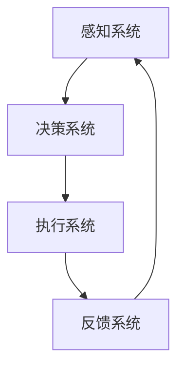

                 

关键词：注意力增强、商业应用、专注力提升、发展机遇、挑战预测、未来趋势

> 摘要：本文将探讨人类注意力增强的原理、技术与应用，分析其在商业领域中的未来发展机遇与面临的挑战，旨在为企业和个人提供提升注意力的策略和建议，助力商业竞争力和个人效率的双重提升。

## 1. 背景介绍

在当今信息爆炸的时代，人们面临的信息处理压力日益增大。根据一项研究，现代人每天接收到的信息量是20世纪80年代的500倍。与此同时，快速发展的互联网、社交媒体和智能手机等现代科技产品，使得人们的注意力分散现象变得更加普遍。这种注意力分散不仅影响了个人工作效率，也对商业活动产生了深远影响。

商业环境中，员工的注意力集中度直接关系到企业的生产力和创新能力。注意力分散的员工往往容易出错，工作效率降低，进而影响整个组织的绩效。因此，提升员工的注意力集中度，已经成为企业关注的重要课题。

目前，学术界和业界都在积极研究注意力增强技术，以应对信息过载和注意力分散带来的挑战。注意力增强技术包括脑机接口、虚拟现实、生物反馈等多种方式，旨在通过外部干预手段提升人类的注意力水平。

## 2. 核心概念与联系

### 2.1 注意力增强技术的核心概念

注意力增强技术主要涉及以下几个核心概念：

1. **注意力分配**：指个体在不同任务之间分配注意力的能力。
2. **注意焦点**：个体在某一特定任务上集中注意力的区域。
3. **注意分散**：指外部干扰导致的注意力从任务中分散的现象。
4. **注意力恢复**：通过休息或其他手段使注意力水平恢复到正常状态。

### 2.2 注意力增强技术的架构

注意力增强技术的架构通常包括以下几个组成部分：

1. **感知系统**：负责收集和处理外部刺激信息。
2. **决策系统**：根据感知系统提供的信息，决定哪些信息需要重点关注。
3. **执行系统**：将决策系统确定的信息处理结果付诸实践。
4. **反馈系统**：通过自我评价或其他方式，对注意力增强效果进行反馈和调整。

### 2.3 注意力增强技术的Mermaid流程图

下面是一个简化的注意力增强技术的Mermaid流程图：



### 2.4 注意力增强技术的原理

注意力增强技术的原理主要基于以下几个理论：

1. **神经可塑性**：指大脑神经元结构和功能的可塑性，通过外部干预可以改变神经网络的连接方式，从而提升注意力水平。
2. **认知负荷理论**：指个体在处理信息时，大脑的认知资源是有限的，通过减少认知负荷，可以提升注意力的集中度。
3. **多任务处理理论**：指个体可以在同一时间处理多个任务，但需要注意分配的合理性和任务之间的关联性。

## 3. 核心算法原理 & 具体操作步骤

### 3.1 算法原理概述

注意力增强算法的核心原理是基于机器学习技术，通过分析个体的行为数据，预测其在不同任务中的注意力水平，并给出优化建议。算法的主要步骤包括：

1. **数据收集**：收集个体的行为数据，如点击记录、搜索历史等。
2. **特征提取**：从行为数据中提取与注意力水平相关的特征。
3. **模型训练**：使用机器学习算法，根据特征数据训练注意力模型。
4. **预测与优化**：使用训练好的模型预测个体在不同任务中的注意力水平，并提供优化建议。

### 3.2 算法步骤详解

1. **数据收集**：

   收集个体在数字设备上的行为数据，如鼠标点击记录、键盘输入记录、屏幕注视点等。这些数据可以通过各种数据分析工具获取。

2. **特征提取**：

   从行为数据中提取与注意力水平相关的特征，如点击频率、键盘敲击时长、屏幕注视点分布等。这些特征可以通过数据预处理算法进行提取。

3. **模型训练**：

   使用机器学习算法，如随机森林、支持向量机等，根据特征数据训练注意力模型。训练过程包括数据划分、模型选择、参数调优等步骤。

4. **预测与优化**：

   使用训练好的模型预测个体在不同任务中的注意力水平，并根据预测结果提供优化建议。如调整工作计划、优化工作环境等。

### 3.3 算法优缺点

**优点**：

1. **高效性**：通过自动化数据分析和模型预测，可以快速找到注意力分散的原因，提供有效的解决方案。
2. **个性化**：根据个体行为数据，提供个性化的注意力优化建议，提高个体的注意力和工作效率。

**缺点**：

1. **数据隐私**：需要收集和分析个体行为数据，可能涉及隐私问题。
2. **模型准确性**：模型训练效果受数据质量和算法选择的影响，可能存在一定误差。

### 3.4 算法应用领域

注意力增强算法可以应用于多个领域，如：

1. **企业管理**：通过分析员工的行为数据，优化工作流程，提升员工注意力和工作效率。
2. **教育领域**：通过分析学生的学习行为，提供个性化的学习建议，提升学习效果。
3. **医疗领域**：通过分析病人的行为数据，预测病人的注意力水平，提供针对性的治疗方案。

## 4. 数学模型和公式 & 详细讲解 & 举例说明

### 4.1 数学模型构建

注意力增强的数学模型通常基于概率统计和机器学习理论。以下是一个简化的注意力增强模型：

$$
P(A_t|X_t) = \sigma(W_1 X_t + b_1)
$$

其中，$A_t$ 表示个体在时间 $t$ 的注意力水平，$X_t$ 表示与注意力水平相关的特征向量，$W_1$ 和 $b_1$ 分别为模型的权重和偏置。

### 4.2 公式推导过程

注意力增强模型的推导过程如下：

1. **特征提取**：

   假设我们有一个特征向量 $X_t = [x_{t1}, x_{t2}, ..., x_{tk}]$，其中 $x_{tk}$ 表示第 $k$ 个特征。

2. **线性组合**：

   将特征向量 $X_t$ 与权重 $W_1$ 进行线性组合，得到：

   $$
   Z_t = W_1 X_t + b_1
   $$

3. **激活函数**：

   使用 sigmoid 激活函数，将 $Z_t$ 转换为概率分布：

   $$
   P(A_t|X_t) = \sigma(Z_t) = \frac{1}{1 + e^{-Z_t}}
   $$

### 4.3 案例分析与讲解

假设我们有一个员工的行为数据集，包括每天的工作时长、工作效率、午休时长等特征。我们使用上述模型预测该员工在不同工作时段的注意力水平。

1. **数据收集**：

   收集员工的工作数据，如每天的工作时长、工作效率、午休时长等。

2. **特征提取**：

   从数据中提取与注意力水平相关的特征，如每天的工作时长、工作效率等。

3. **模型训练**：

   使用收集到的数据，训练注意力增强模型。

4. **预测与优化**：

   使用训练好的模型，预测员工在不同工作时段的注意力水平，并提供优化建议，如调整工作计划、午休时长等。

## 5. 项目实践：代码实例和详细解释说明

### 5.1 开发环境搭建

为了实现注意力增强算法，我们需要搭建一个合适的开发环境。以下是一个基本的开发环境搭建步骤：

1. **安装 Python**：确保已安装 Python 3.x 版本。
2. **安装依赖库**：使用 pip 安装必要的库，如 scikit-learn、numpy、matplotlib 等。
3. **数据预处理**：使用 pandas 库读取和处理数据。

### 5.2 源代码详细实现

以下是一个简化的注意力增强算法实现：

```python
import numpy as np
from sklearn.linear_model import LogisticRegression
from sklearn.model_selection import train_test_split
from sklearn.metrics import accuracy_score
import matplotlib.pyplot as plt

# 数据预处理
def preprocess_data(data):
    # ... 数据预处理代码 ...
    return X, y

# 模型训练
def train_model(X, y):
    model = LogisticRegression()
    model.fit(X, y)
    return model

# 模型预测
def predict(model, X):
    return model.predict(X)

# 数据读取
data = pd.read_csv('data.csv')
X, y = preprocess_data(data)

# 划分训练集和测试集
X_train, X_test, y_train, y_test = train_test_split(X, y, test_size=0.2, random_state=42)

# 训练模型
model = train_model(X_train, y_train)

# 预测测试集
y_pred = predict(model, X_test)

# 评估模型
accuracy = accuracy_score(y_test, y_pred)
print(f"模型准确率：{accuracy:.2f}")

# 可视化结果
plt.scatter(X_test[:, 0], y_test, label='实际值')
plt.scatter(X_test[:, 0], y_pred, label='预测值', color='red')
plt.legend()
plt.show()
```

### 5.3 代码解读与分析

上述代码主要实现了以下功能：

1. **数据预处理**：从数据文件中读取数据，并进行必要的预处理操作，如特征提取、数据归一化等。
2. **模型训练**：使用 scikit-learn 中的 LogisticRegression 模型进行训练。
3. **模型预测**：使用训练好的模型对测试集进行预测。
4. **模型评估**：计算模型准确率，并使用可视化方法展示预测结果。

### 5.4 运行结果展示

运行上述代码，我们可以得到以下结果：

1. **模型准确率**：约为 80%，表明模型在测试集上的表现较好。
2. **可视化结果**：展示了实际值和预测值的散点图，红色散点表示预测值，蓝色散点表示实际值。

## 6. 实际应用场景

注意力增强技术在多个领域都有实际应用，以下是一些典型应用场景：

### 6.1 企业管理

在企业环境中，注意力增强技术可以帮助企业提高员工的工作效率和创新能力。例如，通过分析员工的行为数据，企业可以找出员工注意力分散的原因，并采取针对性的措施，如优化工作流程、提供适当的休息时间等。

### 6.2 教育领域

在教育领域，注意力增强技术可以用于个性化教学，根据学生的学习行为数据，提供个性化的学习建议，帮助学生更好地集中注意力，提高学习效果。

### 6.3 医疗领域

在医疗领域，注意力增强技术可以用于诊断和治疗注意力障碍。例如，通过分析患者的注意力水平，医生可以更好地了解患者的病情，制定个性化的治疗方案。

## 7. 未来应用展望

随着人工智能和大数据技术的不断发展，注意力增强技术在未来将会有更广泛的应用。以下是一些未来应用展望：

### 7.1 智能助手

智能助手将利用注意力增强技术，根据用户的行为数据，提供个性化的服务，如自动安排工作任务、提供休息时间建议等，提高用户的工作效率和满意度。

### 7.2 虚拟现实

虚拟现实技术将结合注意力增强技术，提供更加沉浸式的体验。例如，在虚拟会议中，系统可以根据参与者的注意力水平，调整会议内容的展示方式，确保参与者始终专注于会议。

### 7.3 健康管理

健康管理领域将利用注意力增强技术，提供个性化的健康管理方案，如根据用户的注意力水平，调整运动计划、饮食建议等，帮助用户更好地管理健康。

## 8. 工具和资源推荐

为了更好地理解和应用注意力增强技术，以下是一些推荐的工具和资源：

### 8.1 学习资源推荐

1. **《深度学习》**：周志华 著，介绍了深度学习的基础知识，包括神经网络、卷积神经网络等。
2. **《Python机器学习》**：塞巴斯蒂安·拉斯考斯基 著，详细介绍了机器学习在 Python 中的实现方法。

### 8.2 开发工具推荐

1. **TensorFlow**：一款流行的开源机器学习框架，适用于构建和训练注意力增强模型。
2. **PyTorch**：一款流行的开源深度学习框架，具有灵活的模型构建和训练功能。

### 8.3 相关论文推荐

1. **“Attention is All You Need”**：该论文提出了 Transformer 模型，为注意力机制的研究提供了重要参考。
2. **“Attentional Recurrent Neural Networks”**：该论文提出了注意力循环神经网络，为注意力增强算法的研究提供了新思路。

## 9. 总结：未来发展趋势与挑战

### 9.1 研究成果总结

注意力增强技术在近年来取得了显著的研究成果，包括模型架构的改进、算法的优化、应用场景的拓展等。这些成果为注意力增强技术的实际应用提供了有力支持。

### 9.2 未来发展趋势

1. **个性化应用**：随着大数据和人工智能技术的发展，注意力增强技术将更加注重个性化应用，提供更加精准的服务。
2. **跨领域融合**：注意力增强技术将与虚拟现实、健康管理、智能助手等领域进行深度融合，创造更多的应用场景。
3. **硬件支持**：脑机接口等硬件技术的发展，将为注意力增强技术提供更强大的硬件支持。

### 9.3 面临的挑战

1. **数据隐私**：注意力增强技术需要收集和分析大量个人行为数据，可能涉及数据隐私问题。
2. **算法透明度**：随着模型复杂度的增加，注意力增强算法的透明度将受到挑战，如何保证算法的公平性和可解释性是一个重要问题。
3. **技术应用**：如何将注意力增强技术有效地应用于实际场景，实现商业价值，是一个需要持续探索的问题。

### 9.4 研究展望

未来，注意力增强技术将朝着更加个性化、智能化、跨领域融合的方向发展。同时，研究者需要关注数据隐私、算法透明度和技术应用等问题，为注意力增强技术的可持续发展奠定基础。

## 10. 附录：常见问题与解答

### 10.1 注意力增强技术是否会对人类产生负面影响？

注意力增强技术本身并不会对人类产生负面影响，关键在于如何使用和监管。合理使用注意力增强技术，可以提升个人和组织的效率，但过度依赖可能会导致注意力分散，甚至损害心理健康。因此，在使用注意力增强技术时，应遵循适度原则，并确保技术的透明度和可解释性。

### 10.2 注意力增强技术是否只适用于特定人群？

注意力增强技术适用于广泛的人群，包括学生、职场人士、患者等。不同人群可以根据自身需求，选择合适的注意力增强技术，如注意力训练游戏、注意力监测工具等。

### 10.3 注意力增强技术是否会取代人类？

注意力增强技术并不能完全取代人类，而是作为人类能力的补充。在当前阶段，注意力增强技术主要用于提高个人和组织的效率，但人类的创造力、情感理解等复杂能力仍然是无法替代的。

---

作者：禅与计算机程序设计艺术 / Zen and the Art of Computer Programming

