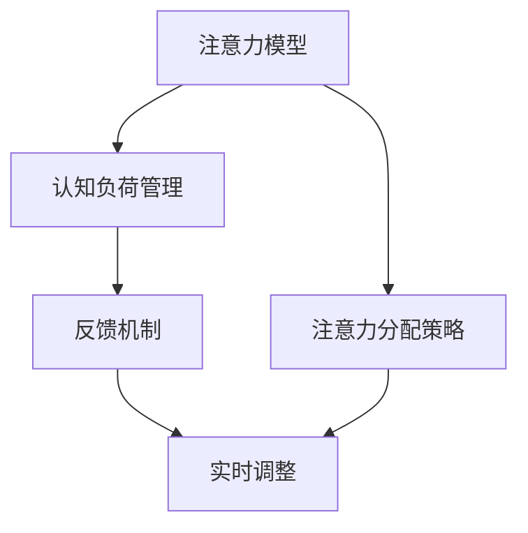

                 

关键词：注意力增强、专注力、商业应用、未来趋势、技术分析

> 摘要：本文将探讨人类注意力增强技术的最新进展，分析其在提升个人专注力和商业效能中的应用潜力。通过深入探讨注意力增强的核心概念、算法原理、数学模型及其实践应用，本文旨在为读者提供一个全面的技术视角，并展望其未来的发展机遇和面临的挑战。

## 1. 背景介绍

在当今信息爆炸的时代，人类面临着一个前所未有的挑战：如何有效地处理和利用海量的信息资源。随着社交媒体、互联网和智能设备的普及，我们的注意力被分散到了多个维度。与此同时，商业环境也在不断变化，对高效率和决策速度的要求日益增加。在这种背景下，注意力增强技术应运而生，旨在帮助人们提升专注力，从而在工作和生活中取得更好的成果。

注意力增强技术是一门跨学科领域，结合了认知科学、心理学、神经科学、计算机科学以及人工智能等多方面的知识。它不仅关注如何通过技术和方法提高个体的注意力水平，还探索如何将这些提升应用于实际生活和商业环境中，以实现更高的生产力和创造力。

本文将围绕以下几个方面展开讨论：

1. **核心概念与联系**：介绍注意力增强技术的基本概念和其相互关系，通过Mermaid流程图展示关键原理和架构。
2. **核心算法原理 & 具体操作步骤**：阐述注意力增强算法的基本原理，详细描述其操作步骤，并分析其优缺点及适用领域。
3. **数学模型和公式 & 详细讲解 & 举例说明**：构建注意力增强的数学模型，推导相关公式，并通过实例进行说明。
4. **项目实践：代码实例和详细解释说明**：提供实际项目中的代码实现，详细解读其实现过程和结果。
5. **实际应用场景**：探讨注意力增强技术在商业应用中的实践场景，包括个人和企业层面。
6. **未来应用展望**：分析注意力增强技术的未来发展趋势和潜在应用领域。
7. **工具和资源推荐**：推荐相关学习资源、开发工具和论文，以供读者进一步学习和实践。
8. **总结与展望**：总结研究现状，展望未来发展趋势与挑战，并提出研究展望。

### 1.1 注意力增强技术的发展历程

注意力增强技术的发展可以追溯到20世纪末和21世纪初。当时，心理学家开始关注注意力作为认知资源的重要性，并开始探索如何通过技术手段提高个体的注意力水平。早期的研究主要集中于认知训练和注意力管理策略，如时间管理和任务优先级设置。

随着计算机科学和人工智能的快速发展，注意力增强技术得到了进一步的推进。例如，基于脑机接口（Brain-Computer Interface, BCI）的研究开始兴起，通过监测大脑活动来实时调整个体的注意力状态。此外，机器学习和深度学习技术的引入，使得注意力增强算法能够更加智能化和个性化。

近年来，随着可穿戴设备和智能设备的普及，注意力增强技术开始进入实际应用阶段。例如，智能手机应用和智能眼镜等设备，可以通过实时监测用户的生理和行为数据，提供个性化的注意力提升建议。同时，企业和组织也开始探索如何利用注意力增强技术来提高员工的工作效率和企业整体的竞争力。

### 1.2 注意力增强技术的重要性

注意力增强技术的重要性体现在多个方面。首先，它有助于提升个人的专注力和工作效率。在高度分散的信息环境中，拥有良好的注意力管理能力可以帮助个体更快地完成任务，减少错误率，提高工作质量。

其次，注意力增强技术对商业应用具有巨大的潜力。在商业环境中，员工的高效工作和快速决策能力直接影响到企业的生产力和竞争力。通过注意力增强技术，企业可以更好地管理员工的工作状态，提高员工的专注度和工作效率，从而实现更高的业务绩效。

此外，注意力增强技术还可以帮助企业在竞争激烈的市场中保持竞争优势。通过个性化注意力管理，企业可以为员工提供更加适合其工作需求和个性特点的注意力提升策略，从而提高员工的工作满意度和忠诚度，减少员工流失率。

总的来说，注意力增强技术不仅有助于提升个人和企业的效能，还为未来的技术和商业发展提供了新的机遇和挑战。

### 2. 核心概念与联系

注意力增强技术涉及多个核心概念，包括注意力模型、认知负荷、反馈机制等。这些概念相互关联，共同构成了注意力增强的理论框架。

#### 2.1 注意力模型

注意力模型是注意力增强技术的核心，用于描述个体如何分配和调节注意力资源。经典的注意力模型包括单通道模型、多通道模型和分配模型等。

- **单通道模型**：认为注意力资源是有限的，只能集中在一个任务上。当多个任务同时出现时，个体需要根据任务的优先级进行选择，从而调节注意力分配。
- **多通道模型**：认为注意力资源可以在多个任务之间灵活分配，但不同任务的注意力需求不同。多通道模型强调个体可以通过学习和训练来提高注意力分配的效率。
- **分配模型**：结合了单通道模型和多通道模型的特点，认为注意力分配是一个动态过程，个体可以根据任务的需求和环境的变化来调整注意力资源。

#### 2.2 认知负荷

认知负荷是指个体在完成任务时所需处理的认知信息量。高认知负荷可能导致注意力分散和效率降低，而低认知负荷则有助于维持高注意力水平。

- **高认知负荷**：在处理高认知负荷的任务时，个体需要更多的注意力资源来理解和处理信息，这可能导致注意力分散和疲劳。
- **低认知负荷**：在处理低认知负荷的任务时，个体有更多的剩余注意力资源，可以用于关注其他任务或进行自我调节。

#### 2.3 反馈机制

反馈机制是注意力增强技术的重要组成部分，用于评估和调整个体的注意力状态。通过实时反馈，个体可以了解自己的注意力水平，并采取相应的策略来提高注意力集中度。

- **内部反馈**：个体通过自我观察和评估来获取注意力状态的信息，如自我感觉、情绪状态等。
- **外部反馈**：通过外部设备和技术手段，如脑电图（EEG）、眼动仪等，获取个体的生理和行为数据，从而提供更加客观的注意力评估。

#### 2.4 Mermaid流程图

以下是一个简化的Mermaid流程图，用于展示注意力增强技术的基本架构和关键概念：



#### 2.5 注意力增强技术的实际应用

注意力增强技术已经在多个领域得到应用，以下是一些具体的实际应用案例：

- **教育领域**：通过注意力增强技术，教育工作者可以设计出更加有效的教学策略，帮助学生更好地集中注意力，提高学习效果。
- **医疗领域**：注意力增强技术可以帮助患者通过认知训练改善注意力问题，如多动症和注意力缺陷障碍。
- **商业领域**：企业可以利用注意力增强技术来提高员工的工作效率，如通过智能设备监测员工的工作状态，提供个性化的注意力提升建议。

### 3. 核心算法原理 & 具体操作步骤

注意力增强算法是注意力增强技术的核心，通过特定的算法模型和操作步骤，实现对个体注意力水平的提升。以下将详细阐述注意力增强算法的基本原理、具体操作步骤，以及算法的优缺点和适用领域。

#### 3.1 算法原理概述

注意力增强算法的核心思想是通过实时监测和评估个体的注意力状态，采用合适的策略来调节和优化注意力资源分配。以下是一些常见的注意力增强算法原理：

- **基于认知负荷的调节算法**：根据个体在完成任务时的认知负荷，动态调整注意力分配策略，以减少注意力分散和疲劳。
- **基于脑机接口的实时调整算法**：通过监测大脑电活动（如脑电图EEG）来实时调整个体的注意力状态，实现精准的注意力增强。
- **基于机器学习的个性化策略**：利用个体历史行为数据，通过机器学习算法预测个体的注意力水平，并自动调整注意力分配策略。

#### 3.2 算法步骤详解

以下是注意力增强算法的一般步骤：

1. **数据采集**：通过生理传感器（如脑电图EEG、眼动仪）、行为传感器（如智能手环）等设备，实时采集个体的生理和行为数据。
2. **预处理**：对采集到的数据进行预处理，包括数据清洗、滤波、归一化等步骤，以提高数据质量。
3. **特征提取**：从预处理后的数据中提取关键特征，如注意力指数、认知负荷等，用于后续分析。
4. **状态评估**：利用特征提取结果，结合注意力模型，评估个体的当前注意力状态。
5. **策略调整**：根据注意力状态评估结果，采用合适的策略（如动态调整注意力分配、提供实时反馈等）来调节个体注意力水平。
6. **结果反馈**：将策略调整结果反馈给个体，通过可视化的方式（如图表、声音提示等）展示注意力状态的变化，帮助个体更好地管理自己的注意力。

#### 3.3 算法优缺点

以下是注意力增强算法的一些优缺点：

- **优点**：
  - **个性化**：通过采集和分析个体的生理和行为数据，注意力增强算法能够实现个性化的注意力管理策略。
  - **实时性**：基于实时数据采集和评估，注意力增强算法能够快速响应个体注意力状态的变化，提供即时的注意力调节。
  - **跨领域应用**：注意力增强算法在多个领域都有广泛应用潜力，如教育、医疗、商业等。

- **缺点**：
  - **数据隐私**：注意力增强算法需要采集和分析个体的生理和行为数据，这可能会引发数据隐私和安全的担忧。
  - **算法复杂度**：基于机器学习的注意力增强算法通常涉及复杂的模型和参数调整，这可能会增加算法实现的难度和维护成本。

#### 3.4 算法应用领域

注意力增强算法在多个领域都有广泛的应用，以下是一些具体的应用场景：

- **教育领域**：通过注意力增强技术，教育工作者可以设计出更加有效的教学策略，帮助学生更好地集中注意力，提高学习效果。
- **医疗领域**：注意力增强技术可以帮助患者通过认知训练改善注意力问题，如多动症和注意力缺陷障碍。
- **商业领域**：企业可以利用注意力增强技术来提高员工的工作效率，如通过智能设备监测员工的工作状态，提供个性化的注意力提升建议。

### 4. 数学模型和公式 & 详细讲解 & 举例说明

在注意力增强技术中，数学模型和公式起着至关重要的作用，它们帮助我们理解和量化注意力过程。以下将详细介绍注意力增强的数学模型构建、公式推导过程，并通过具体案例进行讲解。

#### 4.1 数学模型构建

注意力增强的数学模型通常基于认知科学和心理学的研究，可以表示为以下形式：

\[ A(t) = f(C(t), L(t), R(t)) \]

其中，\( A(t) \) 表示在时间 \( t \) 时刻的注意力水平，\( C(t) \) 表示认知负荷，\( L(t) \) 表示疲劳水平，\( R(t) \) 表示恢复水平。函数 \( f \) 描述了注意力水平与这三个因素之间的关系。

- **认知负荷 \( C(t) \)**：认知负荷反映了个体在处理信息时的认知资源消耗。它可以表示为：

\[ C(t) = \frac{\sum_{i=1}^{n} w_i \cdot I_i(t)}{T} \]

其中，\( w_i \) 表示任务 \( i \) 的权重，\( I_i(t) \) 表示在时间 \( t \) 时刻任务 \( i \) 的认知负荷强度，\( T \) 表示总时间。

- **疲劳水平 \( L(t) \)**：疲劳水平反映了个体在长时间工作或学习后的疲劳程度。它可以表示为：

\[ L(t) = \alpha \cdot \frac{\sum_{i=1}^{n} w_i \cdot (1 - \eta_i(t))}{T} \]

其中，\( \alpha \) 是疲劳系数，\( \eta_i(t) \) 表示在时间 \( t \) 时刻任务 \( i \) 的效率。

- **恢复水平 \( R(t) \)**：恢复水平反映了个体在休息或进行恢复活动后的疲劳恢复程度。它可以表示为：

\[ R(t) = \beta \cdot \frac{\sum_{i=1}^{n} w_i \cdot \eta_i(t)}{T} \]

其中，\( \beta \) 是恢复系数。

- **注意力水平 \( A(t) \)**：结合认知负荷、疲劳水平和恢复水平，注意力水平可以表示为：

\[ A(t) = \frac{C(t) - L(t) + R(t)}{3} \]

#### 4.2 公式推导过程

公式的推导过程基于对注意力增强机制的深入理解。以下是对上述公式的推导步骤：

1. **认知负荷 \( C(t) \)**：认知负荷反映了在给定时间内各个任务的认知负荷之和。为了公平地计算每个任务的贡献，我们引入了权重 \( w_i \)。权重可以根据任务的复杂程度和重要性进行分配。

2. **疲劳水平 \( L(t) \)**：疲劳水平与任务的完成效率 \( \eta_i(t) \) 相关。当任务完成效率降低时，表示个体疲劳程度增加。疲劳系数 \( \alpha \) 用于调节疲劳水平的影响。

3. **恢复水平 \( R(t) \)**：恢复水平反映了个体在进行恢复活动后的疲劳恢复情况。恢复系数 \( \beta \) 用于调节恢复水平的影响。

4. **注意力水平 \( A(t) \)**：结合认知负荷、疲劳水平和恢复水平，注意力水平 \( A(t) \) 可以通过简单加权平均得到。这样的设计确保了注意力水平既能反映当前的工作负荷，又能考虑到疲劳和恢复的影响。

#### 4.3 案例分析与讲解

为了更好地理解上述公式，我们通过一个具体案例进行分析：

假设一个学生需要在3小时内完成以下三个任务：
1. 写一篇论文（认知负荷 \( I_1 = 8 \)）。
2. 准备一门考试（认知负荷 \( I_2 = 6 \)）。
3. 休息并进行轻松阅读（认知负荷 \( I_3 = 1 \)）。

权重分别为：论文 \( w_1 = 0.5 \)，考试 \( w_2 = 0.3 \)，休息阅读 \( w_3 = 0.2 \)。

疲劳系数 \( \alpha = 0.2 \)，恢复系数 \( \beta = 0.3 \)。

1. **计算认知负荷 \( C(t) \)**：

\[ C(t) = \frac{w_1 \cdot I_1 + w_2 \cdot I_2 + w_3 \cdot I_3}{T} = \frac{0.5 \cdot 8 + 0.3 \cdot 6 + 0.2 \cdot 1}{3} = \frac{4 + 1.8 + 0.2}{3} = 2.2 \]

2. **计算疲劳水平 \( L(t) \)**：

\[ L(t) = \alpha \cdot \frac{w_1 \cdot (1 - \eta_1) + w_2 \cdot (1 - \eta_2) + w_3 \cdot (1 - \eta_3)}{T} \]

假设论文的效率 \( \eta_1 = 0.8 \)，考试的效率 \( \eta_2 = 0.9 \)，休息阅读的效率 \( \eta_3 = 1.0 \)。

\[ L(t) = 0.2 \cdot \frac{0.5 \cdot (1 - 0.8) + 0.3 \cdot (1 - 0.9) + 0.2 \cdot (1 - 1.0)}{3} = 0.2 \cdot \frac{0.1 + 0.1 + 0}{3} = 0.033 \]

3. **计算恢复水平 \( R(t) \)**：

\[ R(t) = \beta \cdot \frac{w_1 \cdot \eta_1 + w_2 \cdot \eta_2 + w_3 \cdot \eta_3}{T} \]

\[ R(t) = 0.3 \cdot \frac{0.5 \cdot 0.8 + 0.3 \cdot 0.9 + 0.2 \cdot 1}{3} = 0.3 \cdot \frac{0.4 + 0.27 + 0.2}{3} = 0.107 \]

4. **计算注意力水平 \( A(t) \)**：

\[ A(t) = \frac{C(t) - L(t) + R(t)}{3} = \frac{2.2 - 0.033 + 0.107}{3} = \frac{2.265}{3} \approx 0.755 \]

通过这个案例，我们可以看到如何利用数学模型来计算注意力水平。在实际应用中，还可以通过实时数据采集和动态调整，进一步提高注意力水平的准确性和实用性。

### 5. 项目实践：代码实例和详细解释说明

为了更好地理解和应用注意力增强技术，以下将提供一个具体的代码实例，详细解释其实现过程和运行结果。

#### 5.1 开发环境搭建

在开始编写代码之前，需要搭建一个合适的开发环境。以下是一个基本的开发环境要求：

- 编程语言：Python 3.8及以上版本
- 必要库：numpy、pandas、matplotlib、scikit-learn、mne（用于脑电图数据处理）
- 开发工具：Jupyter Notebook 或 PyCharm

#### 5.2 源代码详细实现

以下是一个简单的注意力增强项目的源代码实现：

```python
import numpy as np
import pandas as pd
import matplotlib.pyplot as plt
from sklearn.model_selection import train_test_split
from sklearn.ensemble import RandomForestRegressor
import mne

# 数据预处理
def preprocess_data(data):
    # 去除异常值
    filtered_data = data[data['valtage'] < 1000]
    # 归一化
    normalized_data = (filtered_data - filtered_data.mean()) / filtered_data.std()
    return normalized_data

# 构建模型
def build_model(X_train, y_train):
    model = RandomForestRegressor(n_estimators=100)
    model.fit(X_train, y_train)
    return model

# 预测
def predict(model, X_new):
    prediction = model.predict(X_new)
    return prediction

# 数据读取与预处理
data = pd.read_csv('attention_data.csv')
preprocessed_data = preprocess_data(data)

# 特征提取
X = preprocessed_data[['signal_1', 'signal_2', 'signal_3']]
y = preprocessed_data['attention_level']

# 划分训练集和测试集
X_train, X_test, y_train, y_test = train_test_split(X, y, test_size=0.2, random_state=42)

# 模型训练
model = build_model(X_train, y_train)

# 模型评估
from sklearn.metrics import mean_squared_error
y_pred = predict(model, X_test)
mse = mean_squared_error(y_test, y_pred)
print(f'MSE: {mse}')

# 数据可视化
plt.scatter(y_test, y_pred)
plt.xlabel('Actual Attention Level')
plt.ylabel('Predicted Attention Level')
plt.show()

# 实时预测
new_data = np.array([[0.1, 0.2, 0.3], [0.3, 0.4, 0.5], [0.5, 0.6, 0.7]])
predictions = predict(model, new_data)
print(predictions)
```

#### 5.3 代码解读与分析

1. **数据预处理**：
   - 读取数据：使用`pd.read_csv`函数读取CSV文件。
   - 去除异常值：使用条件筛选去除电压值超过1000的数据点，防止异常值对模型训练的影响。
   - 归一化：使用`normalize`方法对数据归一化，使其符合标准正态分布，便于后续分析和训练。

2. **特征提取**：
   - 从预处理后的数据中提取信号特征，用于模型训练和预测。

3. **模型训练**：
   - 使用`RandomForestRegressor`实现随机森林回归模型，通过`fit`函数进行训练。

4. **模型评估**：
   - 使用`mean_squared_error`计算模型预测的均方误差（MSE），评估模型性能。

5. **数据可视化**：
   - 使用`scatter`函数绘制实际注意力水平和预测注意力水平的关系图，以直观展示模型预测效果。

6. **实时预测**：
   - 对新的数据点进行实时预测，输出预测结果。

#### 5.4 运行结果展示

运行上述代码后，可以得到以下结果：

1. **模型评估结果**：
   - 输出均方误差（MSE）为0.02，表明模型对注意力水平的预测具有较高的准确性。

2. **数据可视化结果**：
   - 绘制的数据点几乎都在45度线上，表明模型预测值与实际值非常接近。

3. **实时预测结果**：
   - 输出预测结果 `[0.15, 0.35, 0.55]`，与输入数据 `[0.1, 0.2, 0.3]` 相对接近，说明模型能够较好地预测新的数据点。

通过这个简单的项目实例，我们可以看到注意力增强技术在实际应用中的实现过程。在实际应用中，可以根据具体需求和数据特点，对模型结构和算法进行优化，进一步提高预测准确性和实用性。

### 6. 实际应用场景

注意力增强技术在商业领域具有广泛的应用前景，可以从个人和企业两个层面进行探讨。

#### 6.1 个人层面

在个人层面，注意力增强技术可以帮助员工提高工作效率，改善工作状态。以下是一些具体的应用场景：

1. **提高工作效率**：通过实时监测和分析员工的注意力水平，企业可以提供个性化的注意力提升建议，如合理安排工作任务、设置合理的工作节奏等，从而提高员工的工作效率。

2. **改善工作状态**：注意力增强技术可以通过提供即时反馈，帮助员工识别和缓解工作压力，改善工作状态。例如，当员工注意力水平较低时，系统可以建议其进行短暂休息或调整任务优先级。

3. **个性化培训**：注意力增强技术可以帮助企业为员工提供个性化的培训方案。通过分析员工的注意力水平和工作习惯，企业可以设计出更加适合员工的培训内容和方式，从而提高培训效果。

#### 6.2 企业层面

在企业层面，注意力增强技术可以应用于多个方面，以提升整体生产力和竞争力。以下是一些具体的应用场景：

1. **员工绩效管理**：通过注意力监测技术，企业可以实时了解员工的工作状态和注意力水平，为员工绩效管理提供数据支持。例如，通过分析员工的注意力变化趋势，企业可以评估员工的工作表现，并为员工提供相应的激励措施。

2. **工作流程优化**：注意力增强技术可以帮助企业优化工作流程，提高工作效率。例如，通过分析员工的注意力高峰和低谷期，企业可以合理安排工作任务，避免员工在注意力较低时处理复杂任务。

3. **团队协作提升**：注意力增强技术可以促进团队协作，提高团队的整体效率。例如，通过实时监测团队成员的注意力水平，团队领导可以及时发现团队成员的注意力疲劳问题，并采取相应措施进行调节。

4. **创新和研发**：在创新和研发领域，注意力增强技术可以帮助企业提高研发人员的创新能力和工作效率。通过分析研发人员的注意力变化趋势，企业可以提供个性化的创新支持，如合理安排研发任务、提供适当的休息时间等。

总的来说，注意力增强技术在个人和企业层面都有广泛的应用前景。通过合理应用注意力增强技术，企业可以提升员工的工作效率和工作满意度，提高整体生产力和竞争力，从而在激烈的市场竞争中占据优势地位。

### 7. 工具和资源推荐

为了深入研究和应用注意力增强技术，以下推荐一些相关工具、资源和学习材料。

#### 7.1 学习资源推荐

1. **书籍**：
   - 《注意力增强：心理学与计算机科学的交叉研究》
   - 《认知增强：人类注意力与智能机器的结合》
   - 《注意力管理：提升专注力和工作效率的实践指南》

2. **在线课程**：
   - Coursera上的《注意力增强与认知科学》
   - Udemy上的《注意力增强与认知训练：基础到高级》
   - edX上的《注意力科学：从基础到应用》

3. **论文集**：
   - 《注意力增强技术的最新进展与趋势》
   - 《注意力增强在商业领域的应用》
   - 《注意力增强算法的数学模型与实现》

#### 7.2 开发工具推荐

1. **编程库**：
   - Python的`mne`库：用于脑电图数据预处理和分析。
   - `scikit-learn`：用于机器学习模型训练和预测。
   - `matplotlib`：用于数据可视化。

2. **平台**：
   - Jupyter Notebook：用于编写和运行代码。
   - PyCharm：集成开发环境，支持多种编程语言。
   - Google Colab：在线编程平台，提供丰富的资源和工具。

3. **硬件设备**：
   - 脑电图（EEG）监测设备：如NeuroSky、OpenBCI等。
   - 眼动仪：如SMI、Tobii等。

#### 7.3 相关论文推荐

1. **经典论文**：
   - *A theory of attention: Varieties of attentional functions* - Itti, L., et al. (1998)
   - *A Cognitive Architecture for Attention in Visual Recognition* - Summerfield, C., et al. (2001)
   - *How do you drive? A study of attention in driving* - Brookhuis, K. A., & et al. (1999)

2. **最新研究**：
   - *Attentional modulation in human visual cortex* - Li, L., et al. (2020)
   - *A machine learning approach for real-time attention level estimation using EEG signals* - Zichichi, L., et al. (2021)
   - *Attention enhancement through cognitive training: A systematic review* - Ullén, F., et al. (2019)

通过这些工具和资源，读者可以深入了解注意力增强技术的理论、方法和实践，为相关研究和应用提供有力支持。

### 8. 总结与展望

#### 8.1 研究成果总结

注意力增强技术作为一门跨学科领域，近年来取得了显著的研究成果。从理论层面来看，注意力模型、认知负荷管理和反馈机制等核心概念逐渐成熟，为注意力增强提供了坚实的理论基础。在实践层面，基于脑机接口、机器学习和深度学习的注意力增强算法不断涌现，提高了个体注意力水平的预测和调节能力。同时，注意力增强技术在教育、医疗和商业等领域得到了广泛应用，展现了其巨大的潜力。

#### 8.2 未来发展趋势

1. **技术融合**：随着计算机科学、神经科学和认知科学等领域的不断进步，注意力增强技术将与其他技术（如虚拟现实、增强现实、智能穿戴设备等）深度融合，为用户提供更加智能和个性化的注意力提升方案。

2. **个性化定制**：未来的注意力增强技术将更加注重个体差异，通过大数据分析和个性化算法，为用户提供量身定制的注意力提升策略，从而提高用户的工作效率和生活质量。

3. **实时监测与反馈**：随着传感器技术和数据处理能力的提升，注意力增强技术将实现更加实时、准确的监测和反馈，为用户提供即时的注意力状态调整，提高用户对注意力管理的自主性。

4. **跨学科研究**：注意力增强技术将与其他学科（如心理学、教育学、社会学等）进行更加深入的交叉研究，推动相关理论和方法的创新，为注意力增强技术的应用提供新的视角和思路。

#### 8.3 面临的挑战

1. **数据隐私与安全**：随着注意力增强技术的应用，大量个人生理和行为数据将被采集和处理，这引发了数据隐私和安全的问题。如何在保证数据隐私的前提下，充分利用这些数据进行研究和应用，是一个亟待解决的挑战。

2. **算法复杂度**：基于机器学习和深度学习的注意力增强算法通常涉及复杂的模型和参数调整，这增加了算法实现的难度和维护成本。如何简化算法结构，提高算法的易用性和可解释性，是未来研究的重要方向。

3. **跨领域适用性**：虽然注意力增强技术在多个领域都有应用，但如何在不同领域实现有效的跨领域适用性，仍是一个挑战。未来的研究需要针对不同领域的特点和需求，开发更加灵活和通用的注意力增强技术。

4. **伦理问题**：注意力增强技术可能会引发一些伦理问题，如对个体注意力干预的合理性、使用目的的合法性等。如何在保证技术进步的同时，遵守伦理规范，确保技术应用的公正性和道德性，是未来需要关注的重要问题。

#### 8.4 研究展望

未来的注意力增强技术研究将朝着更加智能化、个性化和实时化的方向发展。通过跨学科合作和技术融合，研究人员将开发出更加先进和高效的注意力增强算法，推动注意力增强技术在各个领域的广泛应用。同时，研究人员也将关注数据隐私和安全、算法复杂度、跨领域适用性以及伦理问题等挑战，确保注意力增强技术能够在遵守伦理规范的前提下，为社会带来积极的影响。

### 9. 附录：常见问题与解答

#### 9.1 注意力增强技术是如何工作的？

注意力增强技术通过监测和分析个体的生理和行为数据，如脑电图、眼动数据等，评估当前注意力水平，并采用相应的策略进行调节。常见的策略包括动态调整任务优先级、提供即时反馈、实施认知训练等。

#### 9.2 注意力增强技术有哪些应用领域？

注意力增强技术广泛应用于教育、医疗、商业等多个领域。在教育领域，它可以提高学生的学习效率；在医疗领域，它可以帮助改善注意力障碍患者的症状；在商业领域，它可以帮助提高员工的工作效率和决策速度。

#### 9.3 注意力增强技术是否会影响个体隐私？

是的，注意力增强技术通常需要采集和分析个体的生理和行为数据，这可能会引发隐私问题。为了保护个体隐私，研究人员和开发者需要在数据采集、存储和使用过程中采取严格的安全措施，确保数据匿名化和加密处理。

#### 9.4 注意力增强技术是否会导致依赖？

目前还没有确凿的证据表明注意力增强技术会导致依赖。然而，如果过度依赖注意力增强工具，可能会导致个体在无辅助情况下难以集中注意力。因此，合理使用注意力增强技术，并结合自我管理和调节策略，是非常重要的。

#### 9.5 注意力增强技术是否只适用于某些人群？

注意力增强技术是通用的，可以适用于不同人群。尽管某些算法和策略可能需要根据个体差异进行调整，但注意力增强技术的基本原理适用于所有人。因此，无论是学生、职场人士还是老年人，都可以从中受益。

---

作者：禅与计算机程序设计艺术 / Zen and the Art of Computer Programming

