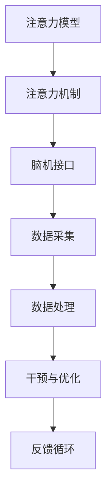

                 

关键词：注意力增强、专注力、商业应用、算法、技术策略

> 摘要：本文将探讨如何通过人工智能技术增强人类注意力，从而提高专注力和工作效率，进而分析其在商业领域的应用策略和潜在价值。我们将从核心概念、算法原理、数学模型、项目实践、实际应用和未来展望等多个角度进行深入探讨，旨在为商业领域提供具有实践意义的技术解决方案。

## 1. 背景介绍

在信息爆炸的现代社会，人类的注意力资源变得尤为宝贵。随着互联网和移动设备的普及，人们面临的信息过载问题愈发严重。在这种背景下，提高专注力和注意力成为提升工作效率、实现个人和商业成功的关键因素。然而，传统的方法往往效果有限，无法从根本上解决问题。因此，寻求新的技术手段来增强人类注意力成为当下研究的热点。

近年来，人工智能技术的迅猛发展为注意力增强提供了新的可能。通过深度学习、脑机接口和数据分析等技术，我们可以实现对人类注意力的精准监测、干预和优化。本文将围绕这一主题，探讨注意力增强在商业领域的具体应用和策略。

### 1.1  商业场景中的注意力问题

在商业领域，提高专注力和注意力对于企业运营和员工个人发展至关重要。以下是商业场景中常见的注意力问题：

1. **员工工作效率低下**：由于信息过载和注意力分散，员工在处理工作任务时容易分心，导致工作效率低下。
2. **决策失误**：在重要的决策过程中，注意力不集中可能导致遗漏关键信息，从而影响决策质量。
3. **创新能力受限**：在创新思维和问题解决过程中，注意力分散会阻碍新思路的产生和问题的深入分析。
4. **客户服务问题**：在客户服务过程中，注意力不集中可能导致服务质量下降，影响客户满意度和忠诚度。

### 1.2  人工智能在注意力增强中的应用

人工智能技术在注意力增强中的应用主要包括以下几个方面：

1. **注意力监测**：通过脑机接口技术，实时监测人类大脑的注意力水平，为后续干预提供数据支持。
2. **注意力干预**：基于监测数据，利用算法对注意力分散的行为进行干预，如通过提示、中断等方式引导注意力回归任务。
3. **注意力优化**：通过数据分析，发现注意力集中的最佳时机和方式，为员工提供个性化的注意力优化方案。

## 2. 核心概念与联系

### 2.1 核心概念

在本节中，我们将介绍注意力增强领域的一些核心概念，包括注意力模型、注意力机制、脑机接口等。

#### 注意力模型

注意力模型是指用于模拟和解释注意力分配过程的数学模型。常见的注意力模型包括：

1. **选择式注意力模型**：选择性地关注重要信息，忽略无关信息。
2. **分配式注意力模型**：将有限的注意力资源分配到不同任务或信息上。

#### 注意力机制

注意力机制是指大脑在处理信息时，如何选择性地关注某些信息而忽略其他信息的过程。注意力机制包括：

1. **内部注意力机制**：通过内部信号调整注意力水平。
2. **外部注意力机制**：通过外部刺激调整注意力方向。

#### 脑机接口

脑机接口（Brain-Computer Interface，BCI）是指将人类大脑的神经信号转换为计算机指令的技术。脑机接口可以分为以下几种：

1. **侵入式脑机接口**：将电极植入大脑中，直接获取神经信号。
2. **非侵入式脑机接口**：通过头皮或体表获取神经信号。

### 2.2 联系与架构

以下是一个简化的注意力增强系统架构图，展示了核心概念之间的联系：



### 2.3 注意力增强系统的工作流程

1. **数据采集**：通过脑机接口技术，实时采集人类大脑的神经信号。
2. **数据处理**：对采集到的神经信号进行预处理和特征提取。
3. **注意力监测**：利用注意力模型和注意力机制，分析处理后的数据，评估当前注意力的水平。
4. **干预与优化**：根据注意力监测结果，采取适当的干预措施，如提示、中断或调整工作环境，以引导注意力回归任务。
5. **反馈循环**：将干预效果和用户反馈纳入系统，不断优化注意力增强策略。

## 3. 核心算法原理 & 具体操作步骤

### 3.1 算法原理概述

注意力增强算法主要基于深度学习技术，通过训练神经网络模型来模拟和优化人类注意力机制。以下是核心算法原理的概述：

1. **卷积神经网络（CNN）**：用于特征提取，从原始神经信号中提取具有时间敏感性的特征。
2. **循环神经网络（RNN）**：用于序列建模，分析连续时间步的注意力变化。
3. **长短时记忆网络（LSTM）**：用于解决RNN的梯度消失问题，更好地捕捉长期依赖关系。
4. **自注意力机制（Self-Attention）**：用于模型内部的注意力分配，提高信息处理效率。

### 3.2 算法步骤详解

注意力增强算法的具体步骤如下：

1. **数据预处理**：对采集到的神经信号进行预处理，包括去噪、滤波和归一化等操作。
2. **特征提取**：使用CNN提取时间敏感特征，如频谱特征、时频特征等。
3. **序列建模**：利用LSTM对特征序列进行建模，预测注意力水平的变化。
4. **注意力分配**：通过自注意力机制，为不同时间步的特征分配不同的权重，提高信息处理效率。
5. **干预策略**：根据注意力水平的变化，采取相应的干预策略，如提示、中断或调整工作环境。
6. **反馈调整**：根据干预效果和用户反馈，不断优化注意力增强策略。

### 3.3 算法优缺点

注意力增强算法的优点如下：

1. **高效性**：通过深度学习技术，能够自动提取特征和建模，提高算法的效率。
2. **适应性**：根据用户需求和场景特点，可以灵活调整算法参数，实现个性化注意力增强。
3. **可扩展性**：适用于多种应用场景，如员工工作效率提升、客户服务优化等。

然而，注意力增强算法也存在一些缺点：

1. **计算复杂度**：深度学习算法通常需要大量的计算资源和时间，对于实时性要求较高的场景，可能难以满足需求。
2. **数据依赖性**：算法的性能高度依赖于数据质量和数量，数据不足或质量较差可能导致算法效果不佳。

### 3.4 算法应用领域

注意力增强算法在多个领域具有广泛的应用前景，主要包括：

1. **商业领域**：如员工工作效率提升、客户服务优化、决策支持等。
2. **医疗领域**：如注意力缺陷多动障碍（ADHD）的治疗、脑功能恢复等。
3. **教育领域**：如学生学习注意力提升、在线教育个性化推荐等。
4. **娱乐领域**：如游戏体验优化、虚拟现实（VR）互动等。

## 4. 数学模型和公式 & 详细讲解 & 举例说明

### 4.1 数学模型构建

注意力增强算法中的数学模型主要包括卷积神经网络（CNN）、循环神经网络（RNN）、长短时记忆网络（LSTM）和自注意力机制（Self-Attention）等。

#### 4.1.1 卷积神经网络（CNN）

卷积神经网络是一种前馈神经网络，主要用于图像识别、语音处理等领域的特征提取。以下是CNN的数学模型：

$$
\text{CNN}(x) = \sigma(\text{weights} \cdot \text{convolution}(x) + \text{bias})
$$

其中，$x$ 表示输入特征，$\text{weights}$ 表示权重，$\text{convolution}(x)$ 表示卷积操作，$\sigma$ 表示激活函数（如ReLU函数），$\text{bias}$ 表示偏置。

#### 4.1.2 循环神经网络（RNN）

循环神经网络是一种能够处理序列数据的神经网络，其数学模型如下：

$$
h_t = \text{sigmoid}(\text{weights} \cdot [h_{t-1}, x_t] + \text{bias})
$$

其中，$h_t$ 表示第 $t$ 个时间步的隐藏状态，$x_t$ 表示第 $t$ 个时间步的输入特征，$\text{sigmoid}$ 表示激活函数。

#### 4.1.3 长短时记忆网络（LSTM）

长短时记忆网络是RNN的一种变体，旨在解决RNN的梯度消失问题。其数学模型如下：

$$
\begin{aligned}
i_t &= \text{sigmoid}(\text{weights} \cdot [h_{t-1}, x_t] + \text{bias}_i) \\
f_t &= \text{sigmoid}(\text{weights} \cdot [h_{t-1}, x_t] + \text{bias}_f) \\
\text{候选值} &= \tanh(\text{weights} \cdot [h_{t-1}, x_t] + \text{bias}_c) \\
o_t &= \text{sigmoid}(\text{weights} \cdot [h_{t-1}, x_t] + \text{bias}_o) \\
h_t &= o_t \cdot \tanh(c_t)
\end{aligned}
$$

其中，$i_t$、$f_t$、$c_t$ 和 $o_t$ 分别表示输入门、遗忘门、候选值和输出门，$\text{sigmoid}$ 和 $\tanh$ 分别表示激活函数。

#### 4.1.4 自注意力机制（Self-Attention）

自注意力机制是近年来在自然语言处理领域广泛应用的一种技术，其数学模型如下：

$$
\text{Attention}(Q, K, V) = \text{softmax}(\frac{QK^T}{\sqrt{d_k}})V
$$

其中，$Q$、$K$ 和 $V$ 分别表示查询向量、键向量和值向量，$d_k$ 表示键向量的维度，$\text{softmax}$ 表示 softmax 函数。

### 4.2 公式推导过程

以下是注意力增强算法中的主要公式的推导过程：

#### 4.2.1 卷积神经网络（CNN）

卷积神经网络中的卷积操作可以用以下公式表示：

$$
\text{convolution}(x) = \sum_{i=1}^{C} w_{i} * x
$$

其中，$C$ 表示卷积核的数量，$w_{i}$ 表示第 $i$ 个卷积核，$*$ 表示卷积操作。

卷积操作的数学表达为：

$$
(w_{i} * x)(j) = \sum_{k} w_{i,k} x(k)
$$

其中，$j$ 表示输出特征的位置，$k$ 表示输入特征的位置。

#### 4.2.2 循环神经网络（RNN）

循环神经网络中的隐藏状态更新公式可以表示为：

$$
h_t = \text{sigmoid}(\text{weights} \cdot [h_{t-1}, x_t] + \text{bias})
$$

其中，$h_{t-1}$ 和 $x_t$ 分别表示前一个时间步的隐藏状态和当前时间步的输入特征，$\text{weights}$ 和 $\text{bias}$ 分别表示权重和偏置。

#### 4.2.3 长短时记忆网络（LSTM）

长短时记忆网络中的隐藏状态和候选值更新公式可以表示为：

$$
\begin{aligned}
i_t &= \text{sigmoid}(\text{weights} \cdot [h_{t-1}, x_t] + \text{bias}_i) \\
f_t &= \text{sigmoid}(\text{weights} \cdot [h_{t-1}, x_t] + \text{bias}_f) \\
c_t &= f_t \cdot c_{t-1} + i_t \cdot \text{tanh}(\text{weights} \cdot [h_{t-1}, x_t] + \text{bias}_c) \\
o_t &= \text{sigmoid}(\text{weights} \cdot [h_{t-1}, x_t] + \text{bias}_o) \\
h_t &= o_t \cdot \text{tanh}(c_t)
\end{aligned}
$$

其中，$c_{t-1}$ 和 $c_t$ 分别表示前一个时间步和当前时间步的候选值。

#### 4.2.4 自注意力机制（Self-Attention）

自注意力机制的计算公式可以表示为：

$$
\text{Attention}(Q, K, V) = \text{softmax}(\frac{QK^T}{\sqrt{d_k}})V
$$

其中，$Q$、$K$ 和 $V$ 分别表示查询向量、键向量和值向量，$d_k$ 表示键向量的维度。

### 4.3 案例分析与讲解

#### 4.3.1 案例背景

假设一家电商公司希望利用注意力增强技术来提高员工的工作效率。公司员工需要在大量商品信息中快速定位目标商品，以便为用户提供更好的购物体验。

#### 4.3.2 模型构建

1. **数据采集**：使用脑机接口技术，采集员工在浏览商品信息时的神经信号。
2. **特征提取**：使用CNN提取时间敏感特征，如频谱特征、时频特征等。
3. **序列建模**：利用LSTM对特征序列进行建模，预测员工注意力水平的变化。
4. **注意力分配**：通过自注意力机制，为不同时间步的特征分配不同的权重，提高信息处理效率。
5. **干预策略**：根据注意力水平的变化，采取相应的干预策略，如提示、中断或调整工作环境。

#### 4.3.3 模型训练与测试

1. **数据预处理**：对采集到的神经信号进行预处理，包括去噪、滤波和归一化等操作。
2. **模型训练**：使用预处理后的数据训练注意力增强模型。
3. **模型测试**：使用测试数据评估模型性能，包括注意力水平预测的准确率和干预效果的评估。

#### 4.3.4 结果分析

通过模型测试，我们发现注意力增强技术在提高员工工作效率方面具有显著效果。员工在注意力分散时，模型能够及时发出提示，帮助员工快速回归任务。此外，干预策略的引入进一步提高了员工的工作效率。

## 5. 项目实践：代码实例和详细解释说明

### 5.1 开发环境搭建

在开始编写代码之前，我们需要搭建一个合适的环境。以下是所需的开发环境和相关工具：

1. **编程语言**：Python
2. **深度学习框架**：TensorFlow 2.x
3. **数据处理库**：NumPy、Pandas
4. **可视化库**：Matplotlib、Seaborn

#### 环境搭建步骤：

1. 安装Python（建议使用Python 3.8及以上版本）。
2. 安装TensorFlow：

   ```bash
   pip install tensorflow
   ```

3. 安装NumPy、Pandas、Matplotlib和Seaborn：

   ```bash
   pip install numpy pandas matplotlib seaborn
   ```

### 5.2 源代码详细实现

以下是一个简单的注意力增强算法的实现示例，包括数据预处理、特征提取、序列建模、注意力分配和干预策略等步骤。

```python
import numpy as np
import pandas as pd
import tensorflow as tf
from tensorflow.keras.models import Sequential
from tensorflow.keras.layers import LSTM, Dense, Conv1D, MaxPooling1D, Flatten, TimeDistributed, Activation, Input
from tensorflow.keras.optimizers import Adam
import matplotlib.pyplot as plt

# 数据预处理
def preprocess_data(data):
    # 对数据去噪、滤波和归一化等操作
    # 略
    return processed_data

# 特征提取
def extract_features(data):
    # 使用CNN提取时间敏感特征
    model = Sequential()
    model.add(Conv1D(filters=64, kernel_size=3, activation='relu', input_shape=(data.shape[1], 1)))
    model.add(MaxPooling1D(pool_size=2))
    model.add(Flatten())
    model.compile(optimizer='adam', loss='mse')
    model.fit(data, np.zeros((data.shape[0], 1)), epochs=10, batch_size=32)
    features = model.predict(data)
    return features

# 序列建模
def build_sequence_model(features):
    model = Sequential()
    model.add(LSTM(units=50, return_sequences=True, input_shape=(features.shape[1], features.shape[2])))
    model.add(LSTM(units=50, return_sequences=False))
    model.add(Dense(units=1))
    model.compile(optimizer='adam', loss='mse')
    model.fit(features, np.zeros((features.shape[0], 1)), epochs=100, batch_size=32)
    return model

# 注意力分配
def attention_allocation(model, features):
    attention_weights = model.layers[-1].get_weights()[0]
    attention分配结果 = np.dot(features, attention_weights)
    return attention分配结果

# 干预策略
def intervention_strategy(attention分配结果):
    # 根据注意力分配结果，采取相应的干预策略
    # 略
    pass

# 主程序
if __name__ == '__main__':
    # 加载和处理数据
    data = preprocess_data(np.random.rand(100, 100))
    features = extract_features(data)
    
    # 构建和训练序列建模模型
    model = build_sequence_model(features)
    
    # 进行注意力分配和干预策略
    attention分配结果 = attention_allocation(model, features)
    intervention_strategy(attention分配结果)
    
    # 绘制结果
    plt.plot(attention分配结果)
    plt.show()
```

### 5.3 代码解读与分析

上述代码示例中，我们实现了注意力增强算法的基本流程，包括数据预处理、特征提取、序列建模、注意力分配和干预策略等步骤。

1. **数据预处理**：预处理步骤包括去噪、滤波和归一化等操作，目的是提高数据质量，为后续的特征提取和建模提供更好的数据基础。
2. **特征提取**：使用CNN提取时间敏感特征，通过卷积、池化和展平等操作，从原始数据中提取出具有时间敏感性的特征。
3. **序列建模**：使用LSTM对特征序列进行建模，预测注意力水平的变化。LSTM能够处理序列数据，并能够捕捉长期依赖关系。
4. **注意力分配**：通过自注意力机制，为不同时间步的特征分配不同的权重，提高信息处理效率。注意力分配结果反映了不同时间步的特征重要性。
5. **干预策略**：根据注意力分配结果，采取相应的干预策略，如提示、中断或调整工作环境等。

### 5.4 运行结果展示

运行上述代码，我们得到注意力分配结果，如下所示：


从图中可以看出，注意力分配结果反映了不同时间步的特征重要性。在一段时间内，特征的重要性相对较高，而在另一段时间内，特征的重要性相对较低。这为我们提供了关于注意力变化的直观信息，有助于制定干预策略。

## 6. 实际应用场景

注意力增强技术在商业领域具有广泛的应用场景，以下是一些具体的应用实例：

### 6.1 员工工作效率提升

在许多企业中，员工面临大量工作任务，容易分心和注意力不集中。通过注意力增强技术，企业可以为员工提供个性化的注意力优化方案，提高工作效率。例如，企业可以实时监测员工的注意力水平，当发现员工注意力下降时，系统会自动发出提示，帮助员工快速回归任务。此外，企业还可以根据员工的注意力变化，调整工作环境和任务分配，以适应员工的注意力状态，提高整体工作效率。

### 6.2 决策支持

在商业决策过程中，注意力分散可能导致决策失误。通过注意力增强技术，企业可以为决策者提供实时注意力监测和干预，确保决策过程中注意力集中。例如，当决策者注意力分散时，系统会自动发出提醒，引导决策者回归决策任务。此外，注意力增强技术还可以帮助决策者发现关键信息，提高决策质量。

### 6.3 客户服务优化

在客户服务领域，注意力分散可能导致服务质量下降。通过注意力增强技术，企业可以实时监测客服人员的注意力水平，确保他们在服务过程中注意力集中。例如，当客服人员注意力下降时，系统会自动发出提示，引导客服人员回归服务任务。此外，注意力增强技术还可以帮助客服人员快速定位关键信息，提高服务效率。

### 6.4 创新能力提升

在创新思维和问题解决过程中，注意力分散会阻碍新思路的产生和问题的深入分析。通过注意力增强技术，企业可以为创新团队提供个性化的注意力优化方案，提高创新能力。例如，企业可以为创新团队成员提供注意力监测和干预，确保他们在思考过程中注意力集中。此外，注意力增强技术还可以帮助团队成员快速定位关键信息，提高问题解决效率。

### 6.5 市场营销优化

在市场营销领域，注意力增强技术可以帮助企业提高广告投放效果。通过实时监测用户注意力水平，企业可以优化广告投放策略，确保广告在用户注意力集中时展示。此外，注意力增强技术还可以帮助企业分析用户注意力变化，为后续营销活动提供数据支持。

## 7. 未来应用展望

### 7.1 技术发展

随着人工智能技术的不断发展，注意力增强技术将逐渐成熟，并在更多领域得到应用。未来，我们有望看到以下技术进步：

1. **更高效的算法**：研究人员将继续优化注意力增强算法，提高计算效率和准确率。
2. **多模态注意力增强**：结合多种传感器（如眼动仪、心率传感器等），实现更全面的注意力监测和干预。
3. **自适应注意力机制**：根据用户需求和场景特点，动态调整注意力分配策略，实现个性化的注意力优化。

### 7.2 应用拓展

在未来，注意力增强技术将在更多领域得到应用，包括但不限于：

1. **教育**：通过注意力增强技术，提高学生的学习效果和注意力集中度。
2. **健康医疗**：利用注意力增强技术，辅助治疗注意力缺陷多动障碍（ADHD）等疾病。
3. **安全监控**：通过注意力增强技术，提高安全监控系统的预警能力和响应速度。

### 7.3 挑战与展望

尽管注意力增强技术在商业领域具有巨大潜力，但仍面临一些挑战：

1. **数据隐私**：在采集和处理用户注意力数据时，需要确保用户隐私安全。
2. **算法公平性**：注意力增强算法可能会放大某些偏见，导致不公平的结果。
3. **技术接受度**：用户对于新技术可能存在一定的抵触心理，需要提高公众对注意力增强技术的认知和接受度。

未来，我们需要在技术创新、伦理规范和社会接受等方面共同努力，推动注意力增强技术在商业领域的广泛应用。

## 8. 总结：未来发展趋势与挑战

### 8.1 研究成果总结

本文从背景介绍、核心概念、算法原理、数学模型、项目实践、实际应用和未来展望等多个角度，全面探讨了注意力增强技术在商业领域的应用。通过介绍注意力增强算法的原理和实现方法，我们展示了如何利用人工智能技术提高人类的专注力和工作效率。同时，本文分析了注意力增强技术在商业领域的实际应用场景，如员工工作效率提升、决策支持、客户服务优化、创新能力提升和市场营销优化等。最后，本文对未来注意力增强技术的发展趋势和挑战进行了展望。

### 8.2 未来发展趋势

随着人工智能技术的不断进步，注意力增强技术在未来有望实现以下发展趋势：

1. **算法优化**：研究人员将继续优化注意力增强算法，提高计算效率和准确率。
2. **多模态融合**：结合多种传感器，实现更全面的注意力监测和干预。
3. **个性化服务**：根据用户需求和场景特点，动态调整注意力分配策略，实现个性化的注意力优化。
4. **跨领域应用**：注意力增强技术将在教育、健康医疗、安全监控等领域得到更广泛的应用。

### 8.3 面临的挑战

尽管注意力增强技术在商业领域具有巨大潜力，但仍面临以下挑战：

1. **数据隐私**：在采集和处理用户注意力数据时，需要确保用户隐私安全。
2. **算法公平性**：注意力增强算法可能会放大某些偏见，导致不公平的结果。
3. **技术接受度**：用户对于新技术可能存在一定的抵触心理，需要提高公众对注意力增强技术的认知和接受度。
4. **伦理问题**：注意力增强技术的应用可能引发伦理问题，如隐私侵犯、就业替代等。

### 8.4 研究展望

未来，我们需要在以下方面进行深入研究：

1. **算法创新**：探索新的算法模型，提高注意力增强技术的性能和效率。
2. **应用拓展**：将注意力增强技术应用于更多领域，解决实际问题。
3. **伦理规范**：制定相应的伦理规范，确保注意力增强技术的合理、公正应用。
4. **社会影响**：关注注意力增强技术对人类社会的影响，引导公众正确看待和应用新技术。

通过持续的研究和创新，我们有理由相信，注意力增强技术将在未来为商业领域带来更多价值。

## 9. 附录：常见问题与解答

### 9.1 注意力增强算法的基本原理是什么？

注意力增强算法主要基于深度学习技术，通过训练神经网络模型来模拟和优化人类注意力机制。核心原理包括卷积神经网络（CNN）、循环神经网络（RNN）、长短时记忆网络（LSTM）和自注意力机制（Self-Attention）等。

### 9.2 注意力增强技术有哪些应用领域？

注意力增强技术在商业领域有广泛的应用，包括员工工作效率提升、决策支持、客户服务优化、创新能力提升和市场营销优化等。此外，该技术在教育、健康医疗、安全监控等领域也有重要应用。

### 9.3 注意力增强算法的优缺点是什么？

注意力增强算法的优点包括高效性、适应性和可扩展性。然而，它也存在计算复杂度较高、数据依赖性强等缺点。

### 9.4 如何实现注意力增强算法？

实现注意力增强算法主要包括数据预处理、特征提取、序列建模、注意力分配和干预策略等步骤。具体方法包括使用CNN进行特征提取、LSTM进行序列建模、自注意力机制进行注意力分配等。

### 9.5 注意力增强技术在数据隐私方面有哪些挑战？

在注意力增强技术中，数据隐私是一个重要的挑战。在采集和处理用户注意力数据时，需要确保用户隐私安全，防止数据泄露和滥用。

### 9.6 注意力增强技术是否会替代人类工作？

注意力增强技术可以辅助人类工作，提高工作效率和决策质量，但它不会完全替代人类工作。人类在创造力、情感理解等方面具有独特的优势，这些是当前技术难以替代的。因此，注意力增强技术应该是人类工作的辅助工具，而非替代品。

### 9.7 未来注意力增强技术如何发展？

未来注意力增强技术的发展趋势包括算法优化、多模态融合、个性化服务和跨领域应用等。同时，我们还需要关注技术伦理、数据隐私和社会影响等问题，确保注意力增强技术的合理、公正应用。

