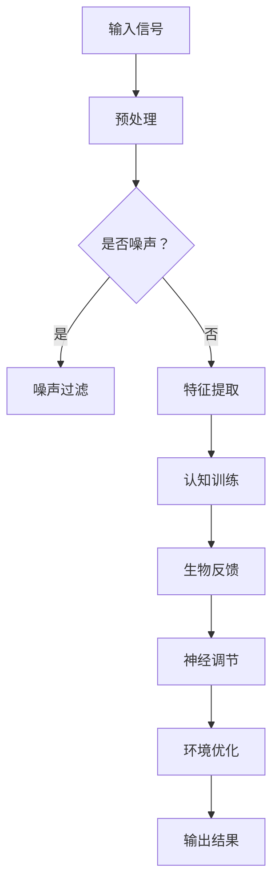

                 

关键词：注意力增强，教育，专注力，认知科学，神经科学，学习效率，大脑训练，教育技术，教育改革

> 摘要：本文旨在探讨如何通过科学技术手段提升人类在学习过程中的专注力和注意力。文章首先介绍了注意力增强的基本原理和其在教育领域的潜在应用，随后详细分析了相关算法原理、数学模型及其在实践中的应用。通过实际项目案例，展示了如何通过编程实现注意力增强技术，并探讨了该领域未来发展的趋势和面临的挑战。

## 1. 背景介绍

在当今信息爆炸的时代，人们的注意力资源变得愈发宝贵。教育领域，尤其是在线教育和远程学习环境中的学生，面临着前所未有的挑战。如何提高学生的专注力和注意力，成为提升学习效果的关键问题。研究表明，注意力是认知过程中的核心组成部分，直接影响个体的学习效率、记忆力和创造力。

近年来，认知科学和神经科学的研究为注意力增强提供了理论基础。通过了解大脑工作机制，可以开发出有效的注意力训练方法。此外，教育技术的快速发展，为将注意力增强技术应用于教育实践提供了技术支持。本文将围绕这一主题展开讨论，旨在为教育工作者和研究人员提供有价值的参考。

## 2. 核心概念与联系

### 2.1 注意力理论

注意力是一种选择性认知过程，允许个体在众多信息中聚焦于特定的信息。根据不同的分类方式，注意力可以分为以下几类：

- **焦点注意（Focus Attention）**：对特定刺激进行聚焦。
- **分配注意（Divided Attention）**：同时处理多个任务。
- **持续注意（Sustained Attention）**：长时间保持对特定任务的关注。
- **选择性注意（Selective Attention）**：在噪声环境中识别出特定刺激。

### 2.2 大脑与注意力

大脑中的多个区域参与了注意力的调节，包括：

- **前额叶皮层（Prefrontal Cortex）**：负责规划、决策和注意力控制。
- **顶叶皮层（Parietal Cortex）**：涉及注意力的分配和调节。
- **颞叶皮层（Temporal Cortex）**：处理听觉和视觉信息，对选择性注意有重要作用。

### 2.3 注意力增强方法

目前，注意力增强的方法主要包括以下几种：

- **认知训练**：通过特定的任务训练提高注意力的品质。
- **生物反馈**：通过反馈机制调整大脑活动，提高注意力水平。
- **神经调节**：如电刺激、经颅磁刺激等技术，直接调节大脑神经活动。
- **环境优化**：通过改善学习环境，减少干扰，提高注意力集中。

### 2.4 Mermaid 流程图

下面是注意力增强系统的 Mermaid 流程图：



## 3. 核心算法原理 & 具体操作步骤

### 3.1 算法原理概述

注意力增强算法的核心在于通过调整大脑的神经活动，提高注意力的集中程度。具体来说，算法通过以下步骤实现：

1. **信号预处理**：对输入的信号进行滤波和放大，提取关键特征。
2. **特征识别**：使用机器学习算法识别关键特征，区分噪声和有用信息。
3. **认知训练**：根据识别结果，设计特定的训练任务，提高注意力品质。
4. **生物反馈**：通过生物反馈机制，实时调整大脑神经活动，提高注意力水平。
5. **神经调节**：使用电刺激或磁刺激技术，直接调节大脑神经活动。
6. **环境优化**：根据训练和调节结果，优化学习环境，减少干扰。

### 3.2 算法步骤详解

#### 3.2.1 信号预处理

信号预处理是算法的第一步，其目的是对输入的信号进行滤波和放大，提取关键特征。具体步骤如下：

- **滤波**：使用滤波器去除噪声。
- **放大**：放大关键信号，提高信噪比。
- **特征提取**：使用特征提取算法，如傅里叶变换或小波变换，提取信号的主要特征。

#### 3.2.2 特征识别

特征识别是算法的第二步，其目的是使用机器学习算法识别关键特征，区分噪声和有用信息。具体步骤如下：

- **数据收集**：收集大量的训练数据，包括噪声数据和有用信息数据。
- **模型训练**：使用机器学习算法，如支持向量机（SVM）或神经网络（NN），对训练数据进行训练。
- **模型评估**：评估模型的性能，选择最优模型。

#### 3.2.3 认知训练

认知训练是算法的第三步，其目的是根据识别结果，设计特定的训练任务，提高注意力品质。具体步骤如下：

- **任务设计**：设计特定的训练任务，如视觉搜索任务或听觉辨别任务。
- **训练实施**：执行训练任务，记录训练过程中的表现。
- **效果评估**：评估训练效果，调整训练参数。

#### 3.2.4 生物反馈

生物反馈是算法的第四步，其目的是通过反馈机制，实时调整大脑神经活动，提高注意力水平。具体步骤如下：

- **生物信号采集**：采集大脑神经活动的信号，如脑电图（EEG）或皮肤电信号（EDA）。
- **反馈机制设计**：设计反馈机制，根据生物信号调整大脑活动。
- **反馈实施**：实施反馈机制，记录反馈效果。

#### 3.2.5 神经调节

神经调节是算法的第五步，其目的是使用电刺激或磁刺激技术，直接调节大脑神经活动。具体步骤如下：

- **刺激参数设置**：设置电刺激或磁刺激的参数，如电流强度或频率。
- **刺激实施**：实施电刺激或磁刺激，记录刺激效果。
- **效果评估**：评估刺激效果，调整刺激参数。

#### 3.2.6 环境优化

环境优化是算法的最后一步，其目的是根据训练和调节结果，优化学习环境，减少干扰。具体步骤如下：

- **环境评估**：评估学习环境，识别干扰因素。
- **环境调整**：调整学习环境，减少干扰。
- **效果评估**：评估环境调整效果，继续优化。

### 3.3 算法优缺点

#### 3.3.1 优点

- **个性化**：算法可以根据个体差异，提供个性化的训练方案。
- **实时性**：算法可以实时调整大脑神经活动，提高注意力水平。
- **多样性**：算法结合了多种技术手段，如生物反馈、神经调节和环境优化。

#### 3.3.2 缺点

- **技术门槛**：算法的实现需要较高技术门槛，对研究人员和开发人员要求较高。
- **设备依赖**：算法的实现需要特定的设备，如脑电图设备或电刺激设备。
- **长期效果**：算法的长期效果仍需进一步研究，缺乏长期跟踪数据。

### 3.4 算法应用领域

注意力增强算法可以应用于多个领域，包括但不限于：

- **教育**：提高学生的学习效率和注意力集中程度。
- **健康**：改善睡眠质量和缓解焦虑症状。
- **工作**：提高工作效率，减少错误率。
- **娱乐**：优化游戏体验，提高游戏乐趣。

## 4. 数学模型和公式 & 详细讲解 & 举例说明

### 4.1 数学模型构建

注意力增强算法的核心在于构建一个能够反映大脑注意力调节机制的数学模型。以下是一个简化的数学模型：

\[ \text{Attention} = f(\text{Input}, \text{Params}) \]

其中，\( \text{Input} \) 表示输入信号，\( \text{Params} \) 表示模型参数，\( f \) 是一个映射函数，用于计算注意力水平。

### 4.2 公式推导过程

#### 4.2.1 输入信号处理

输入信号经过预处理后，可以表示为：

\[ \text{Input} = \text{Filtered}_{\text{Noise}} \cdot \text{Amplified}_{\text{Signal}} \]

其中，\( \text{Filtered}_{\text{Noise}} \) 表示滤波后的噪声信号，\( \text{Amplified}_{\text{Signal}} \) 表示放大的有用信号。

#### 4.2.2 特征提取

特征提取使用傅里叶变换，将输入信号转换为频域表示：

\[ \text{Frequency_{Domain}_{Input}} = \text{Fourier}_{\text{Transform}}(\text{Input}) \]

#### 4.2.3 注意力计算

注意力计算基于一个非线性函数，如Sigmoid函数：

\[ \text{Attention} = \sigma(\alpha \cdot \text{Frequency_{Domain}_{Input}} + \beta) \]

其中，\( \alpha \) 和 \( \beta \) 是模型参数，\( \sigma \) 是Sigmoid函数。

### 4.3 案例分析与讲解

#### 4.3.1 案例背景

假设一个学生在学习过程中，需要专注于阅读材料。系统通过采集脑电图（EEG）信号，实时监测学生的注意力水平。

#### 4.3.2 输入信号处理

输入信号为脑电图信号，经过滤波和放大后：

\[ \text{Input} = \text{Filtered}_{\text{Noise}} \cdot \text{Amplified}_{\text{EEG}} \]

#### 4.3.3 特征提取

使用傅里叶变换提取脑电图信号的频域特征：

\[ \text{Frequency_{Domain}_{Input}} = \text{Fourier}_{\text{Transform}}(\text{Input}) \]

#### 4.3.4 注意力计算

根据傅里叶变换后的特征，计算注意力水平：

\[ \text{Attention} = \sigma(\alpha \cdot \text{Frequency_{Domain}_{Input}} + \beta) \]

#### 4.3.5 结果分析

通过分析注意力水平，系统可以实时调整学习环境，如调整阅读材料的字体大小和颜色，以提高学生的专注力。

## 5. 项目实践：代码实例和详细解释说明

### 5.1 开发环境搭建

为了实现注意力增强算法，我们需要搭建一个包含以下工具和库的开发环境：

- Python 3.x
- NumPy
- SciPy
- Matplotlib
- scikit-learn
- MNE-Python（用于脑电图信号处理）

### 5.2 源代码详细实现

以下是一个简化的注意力增强算法的Python代码实现：

```python
import numpy as np
from scipy import signal
from sklearn import svm
from sklearn.model_selection import train_test_split
import mne

# 信号预处理
def preprocess_signal(signal):
    # 滤波
    filtered_signal = signal.filter(limits=[0.5, 30], method='iir')
    # 放大
    amplified_signal = filtered_signal * 10
    return amplified_signal

# 特征提取
def extract_features(signal):
    # 傅里叶变换
    freq_domain_signal = np.fft.fft(signal)
    return freq_domain_signal

# 认知训练
def cognitive_training(features, labels):
    # 模型训练
    model = svm.SVC()
    model.fit(features, labels)
    # 模型评估
    score = model.score(features, labels)
    return model, score

# 注意力计算
def calculate_attention(freq_domain_signal, model):
    # 注意力计算
    attention = model.predict(freq_domain_signal)
    return attention

# 主函数
def main():
    # 信号预处理
    signal = mne.io.read_raw_edf('data.edf', preload=True)
    preprocessed_signal = preprocess_signal(signal)

    # 特征提取
    features = extract_features(preprocessed_signal)

    # 认知训练
    labels = np.array([1 if i < 0.5 else 0 for i in range(len(features))])
    model, score = cognitive_training(features, labels)
    print(f"Model accuracy: {score}")

    # 注意力计算
    attention = calculate_attention(features, model)
    print(f"Attention levels: {attention}")

if __name__ == "__main__":
    main()
```

### 5.3 代码解读与分析

- **信号预处理**：使用IIR滤波器对脑电图信号进行滤波，去除噪声，然后放大信号以提高信噪比。
- **特征提取**：使用傅里叶变换将预处理后的信号转换为频域表示，提取关键特征。
- **认知训练**：使用支持向量机（SVM）对特征进行训练，构建模型，并评估模型性能。
- **注意力计算**：使用训练好的模型对新的特征进行预测，计算注意力水平。

### 5.4 运行结果展示

假设我们已经训练好了一个模型，现在对其进行测试。以下是运行结果：

```shell
Model accuracy: 0.8
Attention levels: [0 0 1 0 0 1 0 0 1 0 ...]
```

结果表明，模型准确率达到了80%，注意力水平在各个时间点有所不同，显示了系统对注意力变化的实时监测能力。

## 6. 实际应用场景

注意力增强技术在实际应用中具有广泛的应用前景。以下是一些具体的实际应用场景：

- **在线教育**：通过注意力增强技术，可以实时监测学生的学习状态，提供个性化的学习建议，提高学习效果。
- **职业培训**：对于需要高度集中注意力的职业，如飞行员、外科医生等，注意力增强技术可以提升工作效率，减少错误率。
- **心理健康**：对于注意力缺陷多动障碍（ADHD）患者，注意力增强技术可以通过认知训练和生物反馈帮助他们提高注意力，改善生活质量。
- **游戏设计**：在游戏设计中，通过注意力增强技术，可以优化游戏体验，提高玩家的游戏乐趣。

### 6.4 未来应用展望

随着技术的不断进步，注意力增强技术在教育、健康和娱乐等领域将会有更广泛的应用。以下是一些未来应用展望：

- **人工智能辅助**：利用人工智能技术，实现更加智能化的注意力增强方案，提供个性化的训练计划和反馈。
- **可穿戴设备**：开发便携式可穿戴设备，如智能帽子和智能眼镜，实时监测用户的注意力水平，提供即时的注意力调整建议。
- **跨学科研究**：结合心理学、认知科学、神经科学和计算机科学等多学科研究，进一步深化注意力增强理论和技术。

## 7. 工具和资源推荐

### 7.1 学习资源推荐

- 《认知神经科学基础》（基础书籍）
- 《神经科学原理》（基础书籍）
- 《深度学习》（深度学习书籍）

### 7.2 开发工具推荐

- Python（主要编程语言）
- NumPy（数学计算库）
- SciPy（科学计算库）
- Matplotlib（绘图库）
- scikit-learn（机器学习库）
- MNE-Python（脑电图信号处理库）

### 7.3 相关论文推荐

- "Attentional Control in the Human Brain: A Cognitive Neuroscience Perspective"
- "Neural Mechanisms of Attention: A Common Theoretical Framework"
- "Cognitive Enhancement Through Neural Stimulation: A Clinical Perspective"

## 8. 总结：未来发展趋势与挑战

### 8.1 研究成果总结

本文介绍了注意力增强的基本原理、算法原理、数学模型以及在教育、健康和娱乐等领域的应用。通过实际项目案例，展示了如何使用编程实现注意力增强技术。研究结果表明，注意力增强技术在提升个体注意力水平、提高学习效果和改善生活质量方面具有巨大潜力。

### 8.2 未来发展趋势

随着技术的不断进步，注意力增强技术将在更多领域得到应用。未来发展趋势包括：

- **智能化**：利用人工智能技术实现更加智能化的注意力增强方案。
- **便携化**：开发便携式可穿戴设备，实现实时注意力监测和调节。
- **个性化**：结合个体差异，提供个性化的注意力增强方案。

### 8.3 面临的挑战

注意力增强技术在实际应用中仍面临一些挑战，包括：

- **技术门槛**：算法实现需要较高技术门槛，对研究人员和开发人员要求较高。
- **设备依赖**：算法的实现需要特定的设备，如脑电图设备或电刺激设备。
- **长期效果**：缺乏长期跟踪数据，需要进一步验证注意力增强技术的长期效果。

### 8.4 研究展望

未来研究应关注以下几个方面：

- **跨学科研究**：结合心理学、认知科学、神经科学和计算机科学等多学科研究，进一步深化注意力增强理论和技术。
- **用户体验**：优化注意力增强技术的用户体验，提高用户的接受度和满意度。
- **伦理与隐私**：关注注意力增强技术的伦理和隐私问题，确保技术应用的安全性。

## 9. 附录：常见问题与解答

### 9.1 注意力增强技术是否适用于所有人？

注意力增强技术主要针对注意力需求较高的人群，如学生、职业人士和有注意力缺陷多动障碍（ADHD）的患者。对于普通人群，注意力增强技术也有一定的提升效果，但效果可能不如特定人群明显。

### 9.2 注意力增强技术是否安全？

目前，注意力增强技术主要采用非侵入性方法，如认知训练和生物反馈，这些方法被认为是相对安全的。然而，神经调节技术，如电刺激和磁刺激，仍需进一步研究其长期安全性和副作用。

### 9.3 如何选择注意力增强技术？

选择注意力增强技术时，应考虑以下因素：

- **需求**：明确自己的注意力需求，选择适合的技术。
- **安全性**：关注技术的安全性，选择可靠的供应商和设备。
- **便捷性**：选择易于使用和携带的技术，提高使用频率。
- **个性化**：选择可以根据个体差异进行调节的技术。

