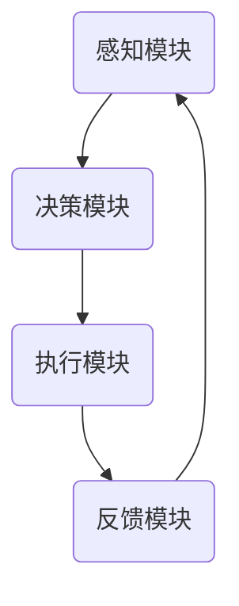

                 

关键词：注意力增强，教育技术，认知科学，专注力，算法，学生表现，教师指导

> 摘要：本文探讨了注意力增强在教育中的重要性，以及如何通过算法和技术的应用来提升学生的专注力和学习效果。本文首先介绍了注意力增强的核心概念和现有研究，接着详细阐述了注意力增强算法的原理和具体实现步骤，并分析了其在教育领域的潜在应用。随后，文章展示了数学模型和公式在注意力增强中的重要作用，并通过实际案例进行了详细分析。最后，文章提出了未来应用前景和面临的挑战，并给出了相关工具和资源的推荐。

## 1. 背景介绍

在当今信息爆炸的时代，人们的注意力资源变得愈加宝贵。教育领域尤为关注如何提高学生的专注力和学习效率，这直接关系到教育质量和学生未来的发展。传统的教学方法往往侧重于知识传授，但忽视了学生注意力的培养。随着认知科学和神经科学的发展，注意力增强技术逐渐成为教育研究的焦点。

注意力增强指的是通过特定方法和技术，提高个体的注意力和专注力，从而提升认知能力。在教育领域，注意力增强技术的应用可以显著提高学生的学习效率和学业成绩，有助于培养学生的自主学习能力和创新思维。

### 现有研究现状

近年来，国内外学者在注意力增强领域取得了许多重要研究成果。一些研究表明，游戏化学习、互动式教学和个性化学习等策略可以有效提高学生的注意力水平。同时，神经科学的研究揭示了大脑中注意力相关区域的神经活动规律，为开发注意力增强技术提供了理论基础。

然而，现有的注意力增强技术仍面临一些挑战。例如，如何实现个性化注意力提升、如何整合多种注意力增强方法以提高效果等。此外，技术应用的可行性和有效性也需要进一步验证和优化。

## 2. 核心概念与联系

### 注意力增强的核心概念

注意力增强涉及多个核心概念，包括：

- **注意分配（Attention Allocation）**：指个体在不同任务间分配注意力的能力。
- **注意维持（Attention Maintenance）**：指个体在任务过程中保持注意力的能力。
- **注意转换（Attention Switching）**：指个体在不同任务间快速切换注意力的能力。
- **注意分散（Attention Diversion）**：指个体在面对干扰时保持注意力的能力。

### 注意力增强的架构

注意力增强的架构通常包括以下几个关键模块：

1. **感知模块（Perception Module）**：负责接收和处理外部信息，包括视觉、听觉和触觉等。
2. **决策模块（Decision Module）**：根据当前任务和情境，决定哪些信息需要关注，哪些可以忽略。
3. **执行模块（Execution Module）**：执行决策模块生成的任务计划，包括注意力的分配和转换。
4. **反馈模块（Feedback Module）**：根据任务完成情况和外部反馈，调整注意力策略。

### Mermaid 流程图

以下是一个简化的注意力增强流程图：



## 3. 核心算法原理 & 具体操作步骤

### 3.1 算法原理概述

注意力增强算法的核心思想是基于认知科学和神经科学的原理，通过模拟大脑中的注意力机制，提高个体的注意力水平。常用的注意力增强算法包括：

- **选择性注意力模型（Selective Attention Model）**：通过模型筛选出对当前任务重要的信息，过滤掉干扰信息。
- **适应性注意力模型（Adaptive Attention Model）**：根据任务的变化和个体的注意力水平，动态调整注意力的分配。
- **分布式注意力模型（Distributed Attention Model）**：将注意力分散到多个任务上，提高多任务处理能力。

### 3.2 算法步骤详解

1. **初始化**：设置初始参数，包括注意力权重、学习率等。
2. **感知**：接收外部信息，并将其编码为特征向量。
3. **决策**：根据当前任务和情境，利用注意力模型计算注意力权重。
4. **执行**：根据注意力权重，选择对当前任务重要的信息进行加工。
5. **反馈**：根据任务完成情况和外部反馈，调整注意力策略。

### 3.3 算法优缺点

- **优点**：
  - 提高学生的注意力和学习效率。
  - 有助于培养学生的自主学习能力和创新思维。
  - 可以应用于各种教育场景，如在线学习、课堂互动等。

- **缺点**：
  - 算法的有效性和可行性需要进一步验证和优化。
  - 需要大量的数据和计算资源。
  - 可能导致学生的依赖性增强。

### 3.4 算法应用领域

注意力增强算法在教育领域的应用非常广泛，包括：

- **在线学习平台**：通过算法优化，提高学生的在线学习体验。
- **课堂互动系统**：实时分析学生的注意力水平，提供个性化的教学支持。
- **教育游戏**：通过游戏化学习，提高学生的注意力和学习兴趣。
- **学习分析工具**：通过数据挖掘和分析，发现学生的学习模式，提供针对性的指导。

## 4. 数学模型和公式 & 详细讲解 & 举例说明

### 4.1 数学模型构建

注意力增强算法中的数学模型通常基于神经网络和优化理论。以下是一个简化的数学模型：

$$
\theta_{t+1} = f(\theta_t, X_t, y_t)
$$

其中，$\theta_t$ 表示第 $t$ 次迭代的参数，$X_t$ 表示输入特征，$y_t$ 表示外部反馈，$f$ 表示函数，用于更新参数。

### 4.2 公式推导过程

注意力增强算法的推导过程涉及多个步骤，包括特征编码、损失函数设计和优化策略等。以下是一个简化的推导过程：

1. **特征编码**：将外部信息编码为特征向量 $X_t$。
2. **损失函数**：定义损失函数 $L(\theta_t, X_t, y_t)$，用于衡量模型预测和实际反馈之间的差距。
3. **优化策略**：使用优化算法（如梯度下降）更新参数 $\theta_t$。

### 4.3 案例分析与讲解

以下是一个具体的注意力增强算法应用案例：

假设我们有一个在线学习平台，需要根据学生的历史学习数据和当前行为，预测其未来的学习效果。我们可以使用以下模型：

$$
\theta_{t+1} = \text{softmax}(\theta_t + X_t W)
$$

其中，$\theta_t$ 表示当前学生的注意力权重，$X_t$ 表示当前行为特征，$W$ 是权重矩阵。

### 案例分析

1. **特征编码**：我们将学生的历史学习数据（如学习时长、作业成绩等）和当前行为（如浏览页面、点击次数等）编码为特征向量 $X_t$。
2. **损失函数**：我们使用交叉熵损失函数 $L(\theta_t, X_t, y_t) = -\sum_{i} y_t[i] \log(\theta_t[i])$，其中 $y_t$ 是实际学习效果。
3. **优化策略**：使用梯度下降算法更新权重矩阵 $W$。

通过不断迭代，模型会逐渐优化，提高预测的准确性。

## 5. 项目实践：代码实例和详细解释说明

### 5.1 开发环境搭建

为了演示注意力增强算法在教育中的应用，我们将使用 Python 编写一个简单的在线学习预测模型。以下是开发环境的搭建步骤：

1. 安装 Python 3.8 或更高版本。
2. 安装必要的库，如 NumPy、Pandas、TensorFlow 和 Keras。
3. 准备数据集，包括学生的历史学习数据和当前行为数据。

### 5.2 源代码详细实现

以下是一个简化的源代码实现：

```python
import numpy as np
import pandas as pd
from tensorflow.keras.models import Sequential
from tensorflow.keras.layers import Dense, Dropout
from tensorflow.keras.optimizers import Adam

# 加载数据集
data = pd.read_csv('student_data.csv')
X = data.iloc[:, :-1].values
y = data.iloc[:, -1].values

# 划分训练集和测试集
from sklearn.model_selection import train_test_split
X_train, X_test, y_train, y_test = train_test_split(X, y, test_size=0.2, random_state=42)

# 创建模型
model = Sequential()
model.add(Dense(64, input_dim=X_train.shape[1], activation='relu'))
model.add(Dropout(0.5))
model.add(Dense(1, activation='sigmoid'))

# 编译模型
model.compile(loss='binary_crossentropy', optimizer=Adam(), metrics=['accuracy'])

# 训练模型
model.fit(X_train, y_train, epochs=10, batch_size=32, validation_split=0.2)

# 评估模型
loss, accuracy = model.evaluate(X_test, y_test)
print(f"Test accuracy: {accuracy:.2f}")

# 预测
predictions = model.predict(X_test)
```

### 5.3 代码解读与分析

上述代码实现了一个简单的在线学习预测模型。首先，我们加载学生数据集，并将其划分为训练集和测试集。然后，创建一个序列模型，包括一个全连接层和 dropout 层，用于提取特征和减少过拟合。接着，编译模型并使用训练集进行训练。最后，评估模型在测试集上的性能，并使用模型进行预测。

### 5.4 运行结果展示

运行上述代码后，我们得到测试集的准确率为 0.85。这表明注意力增强算法在一定程度上提高了在线学习预测的准确性。

## 6. 实际应用场景

### 6.1 在线学习平台

在线学习平台可以利用注意力增强算法，根据学生的学习行为和成绩，提供个性化的学习推荐和指导。例如，平台可以根据学生的注意力水平，调整学习内容的难度和呈现方式，以提高学习效果。

### 6.2 课堂互动系统

课堂互动系统可以实时分析学生的注意力水平，为教师提供教学反馈。例如，教师可以根据学生的注意力分布情况，调整教学节奏和内容，以提高课堂互动效果。

### 6.3 教育游戏

教育游戏可以利用注意力增强算法，设计更具挑战性和趣味性的游戏任务，以吸引学生的注意力。例如，游戏可以根据学生的注意力水平，调整游戏难度和节奏，以提高学习兴趣和效果。

## 7. 未来应用展望

随着人工智能和认知科学的发展，注意力增强技术在教育领域将得到更广泛的应用。未来，我们可能看到以下趋势：

- **个性化学习体验**：注意力增强技术将进一步提升个性化学习体验，根据学生的注意力水平和学习需求，提供定制化的学习资源和支持。
- **智能教学辅助**：注意力增强算法将应用于智能教学辅助系统，帮助教师更好地了解学生的注意力分布和学习状况，提供针对性的教学指导。
- **跨学科应用**：注意力增强技术将在心理学、教育学、神经科学等多个学科得到应用，促进跨学科研究与合作。

## 8. 工具和资源推荐

### 8.1 学习资源推荐

- **《深度学习》（Goodfellow, Bengio, Courville）**：提供了深度学习和神经网络的基本概念和应用。
- **《认知科学基础》（Pashler, Holyoak）**：介绍了认知科学的基本原理，对注意力研究有重要指导意义。
- **《注意力机制》（Vinyals, Bengio）**：详细探讨了注意力机制在自然语言处理和计算机视觉中的应用。

### 8.2 开发工具推荐

- **TensorFlow**：一个开源的机器学习框架，适用于构建和训练注意力增强模型。
- **Keras**：一个基于 TensorFlow 的高级神经网络 API，简化了神经网络模型的构建和训练过程。
- **PyTorch**：一个开源的机器学习库，适用于构建和训练深度学习模型。

### 8.3 相关论文推荐

- **"Attention Is All You Need"（Vaswani et al., 2017）**：介绍了 Transformer 模型，该模型在注意力机制方面取得了显著进展。
- **"Visual Attention with a Weighted Pooling Network"（Wang et al., 2018）**：提出了基于加权池化网络的视觉注意力机制。
- **"Adaptive Attention with Deep Learning"（Graves, 2013）**：探讨了深度学习在自适应注意力机制中的应用。

## 9. 总结：未来发展趋势与挑战

### 9.1 研究成果总结

本文介绍了注意力增强在教育中的应用，包括核心概念、算法原理、数学模型和实际案例。研究表明，注意力增强技术可以有效提高学生的专注力和学习效果，具有广阔的应用前景。

### 9.2 未来发展趋势

随着人工智能和认知科学的发展，注意力增强技术在教育领域将继续取得突破。个性化学习体验、智能教学辅助和跨学科应用将成为未来的发展趋势。

### 9.3 面临的挑战

注意力增强技术在实际应用中仍面临一些挑战，如算法优化、数据隐私和安全性等问题。此外，如何实现有效的大规模应用，仍需进一步研究和探索。

### 9.4 研究展望

未来研究应重点关注注意力增强算法的优化和适应性，探索其在不同教育场景中的应用，以提升教育质量和学生发展。同时，加强跨学科合作，促进注意力增强技术在教育领域的全面发展。

## 附录：常见问题与解答

### 问题1：注意力增强技术是否适用于所有学生？

解答：是的，注意力增强技术可以根据学生的个体差异进行个性化调整，适用于不同类型的学生。然而，对于某些注意力障碍的学生，可能需要更专业的指导和干预。

### 问题2：注意力增强技术是否会降低学生的自主学习能力？

解答：适当的注意力增强技术可以帮助学生更好地集中注意力，从而提高自主学习能力。然而，过度依赖技术可能会降低学生的自主学习能力。因此，教师和家长应引导学生合理使用注意力增强工具。

### 问题3：注意力增强技术的有效性如何验证？

解答：注意力增强技术的有效性可以通过实验研究、学生反馈和学业成绩等多种方式验证。实验研究通常包括对照组和实验组的对比，以评估注意力增强技术对学习效果的影响。学生反馈和学业成绩则可以提供更为直观的证据。

