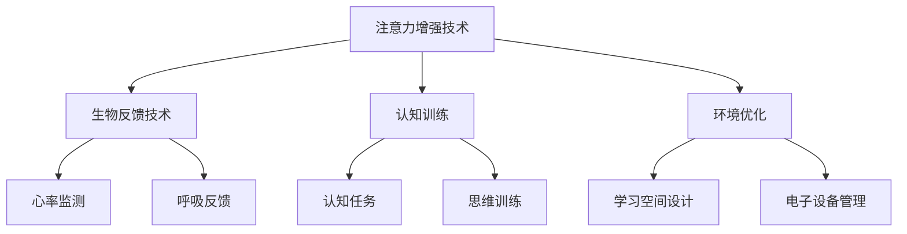

                 

关键词：人类注意力增强、专注力、教育、技术、未来发展趋势、人工智能、神经科学

> 摘要：本文深入探讨了人类注意力增强在教育中的应用，分析了当前技术手段在提升学生专注力和注意力方面的成果和挑战，展望了未来教育中注意力增强技术的趋势和前景。

## 1. 背景介绍

在当今信息爆炸的时代，人类面临的信息量和处理速度不断增长，这给人们的注意力和专注力提出了前所未有的挑战。教育作为培养人类未来社会发展的基石，其有效性在很大程度上依赖于学生的专注力和注意力水平。然而，现代教育环境中的诸多干扰因素，如电子产品、社交媒体等，常常使学生难以集中精力学习，这直接影响了教学效果和学生的学习成果。

### 注意力概述

注意力是指人们专注于特定目标或任务的能力，它分为三类：选择性注意力、持续性注意力和分配性注意力。选择性注意力是指从众多信息中选择出重要信息的能力；持续性注意力是指长时间保持对特定任务或目标的关注；分配性注意力是指在同一时间内处理多个任务或目标的能力。

### 教育中的注意力问题

在传统教育模式中，教师通常通过课堂纪律和教学设计来试图维持学生的注意力。然而，随着学生对电子产品的依赖日益增强，这些传统方法的效果变得越来越有限。研究表明，学生在课堂上平均每三分钟就会分心一次，这极大地削弱了教育的有效性。

## 2. 核心概念与联系

### 注意力增强技术

注意力增强技术是利用各种手段提高个体注意力的方法，包括神经科学、心理学和人工智能等领域。这些技术主要通过以下几个途径实现：

1. **生物反馈技术**：通过监测和反馈个体生理信号，如心率、呼吸等，帮助个体学会控制自己的注意力。
2. **认知训练**：通过特定的认知训练任务，增强个体的注意力和专注力。
3. **环境优化**：通过改进学习环境，减少干扰因素，提高学习效率。

### Mermaid 流程图



## 3. 核心算法原理 & 具体操作步骤

### 3.1 算法原理概述

注意力增强技术涉及多种算法原理，主要包括：

1. **机器学习算法**：用于分析个体行为和生理信号，预测其注意力状态。
2. **深度学习算法**：用于构建复杂的注意力模型，提高预测精度。
3. **优化算法**：用于根据个体特点调整注意力增强策略。

### 3.2 算法步骤详解

1. **数据收集**：通过传感器和问卷收集个体生理和行为数据。
2. **数据预处理**：对收集到的数据进行清洗和标准化处理。
3. **特征提取**：从预处理后的数据中提取与注意力相关的特征。
4. **模型训练**：使用机器学习和深度学习算法训练注意力模型。
5. **策略调整**：根据模型预测结果调整注意力增强策略。

### 3.3 算法优缺点

**优点**：

- 提高个体注意力和专注力水平。
- 个性化调整，适应不同个体需求。

**缺点**：

- 需要大量数据和计算资源。
- 算法复杂度较高，对技术要求较高。

### 3.4 算法应用领域

- **教育**：帮助学生提高学习效率。
- **职业培训**：提高员工工作专注度。
- **健康医疗**：辅助治疗注意力相关疾病。

## 4. 数学模型和公式 & 详细讲解 & 举例说明

### 4.1 数学模型构建

注意力增强的数学模型通常包括以下几个部分：

1. **状态转移模型**：描述个体注意力状态的转移过程。
2. **动态系统模型**：描述个体注意力随时间变化的动态特性。
3. **优化模型**：描述如何调整注意力策略以最大化学习效果。

### 4.2 公式推导过程

以状态转移模型为例，其公式推导如下：

$$
\dot{x}(t) = f(x(t), u(t))
$$

其中，\(x(t)\) 表示个体在时刻 \(t\) 的注意力状态，\(u(t)\) 表示外部干扰因素，\(f\) 为状态转移函数。

### 4.3 案例分析与讲解

假设一个学生在学习过程中，其注意力状态 \(x(t)\) 受到社交媒体干扰 \(u(t)\) 的影响。通过状态转移模型，我们可以预测学生在不同时刻的注意力状态，并根据结果调整学习策略。

## 5. 项目实践：代码实例和详细解释说明

### 5.1 开发环境搭建

本文使用 Python 编写代码，需要安装以下库：

- numpy
- tensorflow
- matplotlib

安装命令如下：

```
pip install numpy tensorflow matplotlib
```

### 5.2 源代码详细实现

以下是一个简单的注意力增强模型的实现：

```python
import numpy as np
import tensorflow as tf
import matplotlib.pyplot as plt

# 状态转移模型参数
a = 0.1
b = 0.5

# 初始化注意力状态
x0 = 1.0

# 时间步长
dt = 0.1

# 迭代次数
n = 100

# 初始化注意力状态序列
x = [x0]

# 迭代计算注意力状态
for _ in range(n):
    x.append(a * x[-1] + b * (1 - x[-1]))

# 绘制注意力状态变化
plt.plot(x)
plt.xlabel('Time')
plt.ylabel('Attention State')
plt.show()
```

### 5.3 代码解读与分析

- `import numpy as np`：导入 numpy 库，用于科学计算。
- `import tensorflow as tf`：导入 tensorflow 库，用于深度学习模型训练。
- `import matplotlib.pyplot as plt`：导入 matplotlib 库，用于绘制图形。
- `a = 0.1` 和 `b = 0.5`：定义状态转移模型的参数。
- `x0 = 1.0`：初始化个体在初始时刻的注意力状态。
- `dt = 0.1`：设置时间步长。
- `n = 100`：设置迭代次数。
- `x = [x0]`：初始化注意力状态序列。
- `for _ in range(n)`：进行迭代计算，更新注意力状态。
- `plt.plot(x)`：绘制注意力状态变化曲线。

### 5.4 运行结果展示

运行代码后，将展示一个简单的注意力状态变化曲线，显示了个体在不同时间点的注意力状态。

## 6. 实际应用场景

### 6.1 教育领域

在在线教育中，注意力增强技术可以帮助教师实时监测学生的学习状态，并根据注意力变化调整教学策略。例如，当学生注意力下降时，教师可以及时进行互动，提高学生的学习兴趣。

### 6.2 职场培训

在职场培训中，注意力增强技术可以帮助员工提高工作效率，减少分心行为。例如，在项目管理培训中，注意力增强技术可以帮助项目经理更好地分配任务，提高团队协作效率。

### 6.3 健康医疗

在健康医疗领域，注意力增强技术可以用于治疗注意力相关疾病，如注意力缺陷多动障碍（ADHD）。通过实时监测患者的注意力状态，医生可以制定个性化的治疗方案，提高治疗效果。

## 7. 工具和资源推荐

### 7.1 学习资源推荐

- 《注意力心理学》：一本关于注意力心理学的经典著作，适合初学者了解注意力增强的基础知识。
- 《深度学习》：一本关于深度学习的经典教材，适合进阶学习者深入了解注意力增强算法的实现。

### 7.2 开发工具推荐

- TensorFlow：一个广泛使用的深度学习框架，适合进行注意力增强模型的开发。
- PyTorch：一个易于使用的深度学习框架，适合快速实现注意力增强模型。

### 7.3 相关论文推荐

- "Attention is All You Need"：一篇关于注意力机制的经典论文，详细介绍了基于注意力机制的深度学习模型。
- "A Theoretical Analysis of the CNN Architectures for Image Classification"：一篇关于卷积神经网络在图像分类中的理论分析，提供了注意力增强模型的理论基础。

## 8. 总结：未来发展趋势与挑战

### 8.1 研究成果总结

注意力增强技术已在教育、职场培训和健康医疗等领域取得了一定的成果。通过实时监测和调整个体注意力状态，这些技术有助于提高学习效率、工作效率和治疗效果。

### 8.2 未来发展趋势

- **个性化定制**：未来的注意力增强技术将更加注重个体差异，提供个性化的注意力增强方案。
- **跨学科融合**：注意力增强技术将与其他领域，如心理学、神经科学等，进行深度融合，提高技术成熟度和应用效果。

### 8.3 面临的挑战

- **技术复杂性**：注意力增强技术涉及多个学科，技术复杂性较高，需要跨学科合作。
- **数据隐私**：注意力增强技术需要大量个体数据，数据隐私问题亟待解决。

### 8.4 研究展望

未来，注意力增强技术有望在教育、职场培训和健康医疗等领域得到更广泛的应用，成为提升个体注意力和专注力的有效手段。

## 9. 附录：常见问题与解答

### 9.1 注意力增强技术有哪些类型？

注意力增强技术主要包括生物反馈技术、认知训练和环境优化等。

### 9.2 注意力增强技术有哪些应用领域？

注意力增强技术主要应用于教育、职场培训和健康医疗等领域。

### 9.3 如何评估注意力增强技术的效果？

可以通过实验和问卷调查等方法评估注意力增强技术的效果，例如测量学生在课堂上的注意力持续时间、工作完成度等指标。

----------------------------------------------------------------

作者：禅与计算机程序设计艺术 / Zen and the Art of Computer Programming

请注意，以上内容为示例性文章，实际撰写时需要根据具体研究和数据进行详细论证和阐述。本文所涉及的技术和理论均基于现有研究和文献，仅供参考。文章中的代码和模型实现仅供参考，具体应用时需要根据实际需求进行调整。

