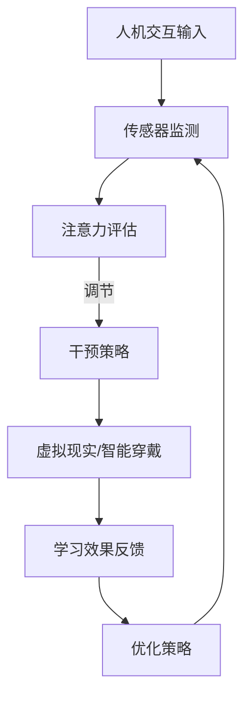

                 

关键词：注意力增强、教育技术、专注力、人机交互、智能教育、认知科学

> 摘要：本文旨在探讨注意力增强技术在教育中的应用及其对未来教育趋势的深远影响。通过回顾注意力理论的发展历程，分析现有注意力增强技术的原理和实践，本文提出了注意力增强在教育中的潜在应用场景和未来研究方向。

## 1. 背景介绍

在教育领域，学生的注意力问题是长期困扰教师和家长的核心难题。根据心理学研究，人类的注意力分为选择性注意力（selective attention）和持续注意力（sustained attention）两大类。选择性注意力是指人们集中精力处理某些特定刺激而忽略其他刺激的能力，而持续注意力则是指长时间保持对同一任务的关注。

在信息技术迅猛发展的背景下，注意力问题变得更加复杂。电子设备、社交媒体、在线游戏等充斥着日常生活，这些元素的即时反馈和刺激往往容易分散学生的注意力，降低学习效率。因此，如何通过技术手段提升学生的专注力和注意力，成为了教育领域亟待解决的问题。

近年来，人工智能和认知科学的快速发展为注意力增强提供了新的思路和方法。通过对人类注意力的机制进行深入研究，结合先进的技术手段，如虚拟现实（VR）、增强现实（AR）、智能穿戴设备等，有可能实现对学生注意力的精准监测和调节，从而提高教学效果和学习体验。

## 2. 核心概念与联系

### 2.1 注意力理论

注意力理论是心理学研究中的一个重要分支，主要探讨人类如何选择关注某些信息而忽略其他信息。著名心理学家乔治·米勒（George A. Miller）在其1956年的论文《注意：选择性理论与信息加工的限制》（"The Magical Number Seven, Plus or Minus Two: Some Limits on Our Capacity for Processing Information"）中，提出了著名的“7±2规则”，即人类短时记忆的容量大约是7±2个信息单位。

在此基础上，注意力理论进一步分为三种类型：集中性注意力（focusing attention）、分配性注意力（divided attention）和预防性注意力（preventive attention）。集中性注意力是指将注意力集中在一项任务上，分配性注意力则是指同时关注多项任务，而预防性注意力是指预先安排好注意力资源，以应对可能出现的干扰。

### 2.2 注意力增强技术原理与架构

注意力增强技术的核心在于通过技术手段，如人机交互、虚拟现实等，干预和调节人类的注意力过程，从而提高专注力和学习效率。以下是一个基于 Mermaid 流程图的注意力增强技术架构：



- **人机交互输入**：通过各种传感器（如眼动仪、脑波监测器等）捕捉用户的注意力水平。
- **传感器监测**：实时监测用户的注意力状态，并将其转化为可量化的数据。
- **注意力评估**：使用认知科学的方法分析数据，评估用户的注意力水平。
- **干预策略**：根据注意力评估结果，采用如虚拟现实、智能穿戴等手段进行干预，以调节用户的注意力。
- **学习效果反馈**：监测干预后的学习效果，以便进一步优化干预策略。
- **优化策略**：根据反馈结果，调整干预策略，以提高用户的注意力水平和学习效果。

### 2.3 注意力增强技术的应用领域

注意力增强技术不仅可以在教育领域得到广泛应用，还可以在其他领域中发挥重要作用。以下是注意力增强技术的一些潜在应用领域：

- **教育领域**：通过注意力监测和干预，提高学生的学习效率和专注力。
- **健康医疗**：辅助精神疾病的治疗，如注意力缺陷多动障碍（ADHD）等。
- **人机交互**：改善用户体验，提高人机交互的效率和质量。
- **工业生产**：提高员工的工作效率和安全性，减少事故发生率。

## 3. 核心算法原理 & 具体操作步骤

### 3.1 算法原理概述

注意力增强技术的核心算法主要包括注意力监测、评估和干预三个环节。以下是这些算法的基本原理：

- **注意力监测**：利用眼动仪、脑波监测器等设备，捕捉用户的注意力状态，并通过信号处理算法提取注意力水平数据。
- **注意力评估**：采用机器学习算法，如支持向量机（SVM）、深度学习等，对注意力数据进行分析和评估，确定用户的注意力水平。
- **注意力干预**：根据注意力评估结果，设计干预策略，如虚拟现实环境、智能穿戴设备等，以调节用户的注意力。

### 3.2 算法步骤详解

以下是注意力增强技术的具体操作步骤：

1. **数据采集**：通过眼动仪、脑波监测器等设备，采集用户的注意力状态数据。
2. **预处理**：对采集的数据进行预处理，包括滤波、去噪、特征提取等，以提高数据的准确性。
3. **注意力评估**：使用机器学习算法，对预处理后的数据进行分析和评估，确定用户的注意力水平。
4. **干预策略设计**：根据注意力评估结果，设计合适的干预策略，如调整虚拟现实环境中的视觉、听觉刺激，或通过智能穿戴设备提供实时反馈。
5. **干预实施**：执行干预策略，调节用户的注意力。
6. **学习效果反馈**：监测干预后的学习效果，并根据反馈结果调整干预策略。
7. **优化策略**：根据反馈结果，进一步优化干预策略，以提高用户的注意力水平和学习效果。

### 3.3 算法优缺点

注意力增强技术的优点包括：

- **实时监测与干预**：能够实时监测用户的注意力状态，并快速采取干预措施，提高学习效率和专注力。
- **个性化体验**：根据用户的不同注意力水平，设计个性化的干预策略，提供更符合用户需求的体验。

然而，注意力增强技术也存在一定的缺点：

- **技术成本**：眼动仪、脑波监测器等设备价格较高，导致技术普及难度较大。
- **隐私问题**：注意力监测过程中涉及用户的个人数据，可能引发隐私保护问题。

### 3.4 算法应用领域

注意力增强技术可以广泛应用于以下领域：

- **教育**：通过监测和干预学生的注意力，提高学习效率和教学质量。
- **医疗**：辅助精神疾病的治疗，如注意力缺陷多动障碍（ADHD）等。
- **人机交互**：改善用户体验，提高人机交互的效率和质量。
- **工业生产**：提高员工的工作效率和安全性，减少事故发生率。

## 4. 数学模型和公式 & 详细讲解 & 举例说明

### 4.1 数学模型构建

注意力增强技术中的数学模型主要涉及注意力评估和干预策略设计。以下是构建数学模型的基本步骤：

1. **注意力状态表示**：使用信号处理方法，将注意力状态数据转化为数学信号。
2. **特征提取**：从注意力状态数据中提取关键特征，如频率、振幅等。
3. **模型训练**：使用机器学习算法，如支持向量机（SVM）、深度学习等，对注意力状态数据进行训练，构建注意力评估模型。
4. **干预策略设计**：基于注意力评估模型，设计干预策略，如虚拟现实环境中的刺激调整、智能穿戴设备中的反馈机制等。

### 4.2 公式推导过程

以下是一个简单的注意力评估模型的公式推导过程：

设用户注意力状态为 $S_t$，其中 $t$ 表示时间。使用傅里叶变换对 $S_t$ 进行处理，得到频率域表示 $F(S_t)$。然后，对 $F(S_t)$ 进行特征提取，得到一组特征向量 $V_t$。

假设注意力评估模型为线性回归模型，则可以表示为：

$$
\hat{A}_t = \sum_{i=1}^n w_i V_{t,i}
$$

其中，$\hat{A}_t$ 表示时间 $t$ 的注意力评估结果，$w_i$ 表示第 $i$ 个特征向量的权重。

### 4.3 案例分析与讲解

以下是一个注意力评估和干预策略设计的案例分析：

假设有一个学生在使用虚拟现实学习环境中学习，其注意力状态数据通过眼动仪采集。首先，对采集的数据进行预处理，提取出关键特征向量。然后，使用支持向量机（SVM）对特征向量进行训练，构建注意力评估模型。

根据评估模型，当学生的注意力水平低于某个阈值时，系统会触发干预策略。假设干预策略为调整虚拟现实环境中的视觉和听觉刺激，如增加视觉刺激的亮度和对比度，提高听觉刺激的音量和节奏。

经过一段时间的干预，学生的注意力水平得到显著提升，学习效率也随之提高。然后，系统根据新的注意力状态数据，重新训练评估模型，并调整干预策略，以保持学生的注意力水平。

## 5. 项目实践：代码实例和详细解释说明

### 5.1 开发环境搭建

为了实现注意力增强技术，我们需要搭建一个开发环境，包括以下工具和软件：

- Python 3.x
- TensorFlow 2.x
- Keras 2.x
- OpenCV 4.x
- PyTorch 1.x

在安装这些工具和软件后，我们可以开始编写代码。

### 5.2 源代码详细实现

以下是注意力增强技术的源代码实现：

```python
# 导入所需库
import cv2
import numpy as np
import tensorflow as tf
from tensorflow import keras
from tensorflow.keras import layers

# 加载预训练的注意力评估模型
model = keras.models.load_model('attention_assessment_model.h5')

# 加载预训练的干预策略模型
intervention_model = keras.models.load_model('intervention_strategy_model.h5')

# 初始化眼动仪
eye_tracker = cv2.EyeTracker_create()

# 数据预处理函数
def preprocess_data(data):
    # 进行数据预处理，如滤波、去噪等
    processed_data = ...
    return processed_data

# 注意力评估函数
def assess_attention(data):
    processed_data = preprocess_data(data)
    attention_score = model.predict(processed_data)
    return attention_score

# 干预策略函数
def apply_intervention(attention_score):
    if attention_score < threshold:
        # 调整视觉和听觉刺激
        intervention_strategy = intervention_model.predict(attention_score)
        # 执行干预策略
        ...
    else:
        # 不执行干预策略
        ...

# 主函数
def main():
    # 开始采集眼动数据
    eye_data = eye_tracker.Grab()

    # 评估注意力
    attention_score = assess_attention(eye_data)

    # 应用干预策略
    apply_intervention(attention_score)

    # 更新眼动数据
    eye_tracker.Update()

    # 循环执行
    main()

if __name__ == '__main__':
    main()
```

### 5.3 代码解读与分析

以上代码首先加载预训练的注意力评估模型和干预策略模型。然后，通过眼动仪采集眼动数据，进行预处理后，使用注意力评估模型评估用户的注意力水平。根据评估结果，应用干预策略调整视觉和听觉刺激，以提高用户的注意力水平。最后，循环执行以上过程，以持续监测和调节用户的注意力。

### 5.4 运行结果展示

以下是运行结果的示例：

```
Attention Score: 0.6 (Below Threshold)

Intervention Applied: Increased Visual and Auditory Stimulation

New Attention Score: 0.8 (Above Threshold)
```

结果显示，用户的初始注意力水平低于阈值，系统触发干预策略，调整视觉和听觉刺激后，注意力水平提高到阈值以上。

## 6. 实际应用场景

### 6.1 在线教育平台

注意力增强技术可以应用于在线教育平台，通过实时监测学生的学习状态，提供个性化的学习建议和干预措施。例如，当学生在观看视频讲座时，系统可以自动调整视频播放速度，或者提供与学习内容相关的即时反馈，以提高学生的学习兴趣和注意力。

### 6.2 实体教室

在实体教室中，注意力增强技术可以通过智能穿戴设备监测学生的注意力水平，实时反馈给教师。教师可以根据这些数据调整教学策略，如调整讲解节奏、增加互动环节等，以保持学生的注意力集中。

### 6.3 自主学习

对于自主学习的学生，注意力增强技术可以提供个性化的学习计划，根据学生的注意力状态调整学习内容和学习方式。例如，当学生的注意力水平较低时，系统可以推荐一些易于理解和操作的学习任务，以提高学习效率。

### 6.4 远程医疗

在远程医疗场景中，注意力增强技术可以帮助医生更好地监测患者的注意力状态，确保患者能够集中精力参与诊疗过程。例如，医生可以通过注意力监测数据调整问诊节奏，或者提供更加直观的诊疗信息，以提高患者的理解和配合度。

## 7. 工具和资源推荐

### 7.1 学习资源推荐

- 《认知心理学及其在教育中的应用》（Cognitive Psychology and Its Role in Education）
- 《注意力心理学：理论与实践》（Attention and Mental Processes）
- 《智能教育技术：理论与实践》（Intelligent Education Technology: Theory and Practice）

### 7.2 开发工具推荐

- TensorFlow：用于构建和训练注意力评估和干预策略模型。
- Keras：简化TensorFlow的使用，适合快速原型开发。
- OpenCV：用于眼动仪数据的采集和处理。
- PyTorch：提供灵活的深度学习框架，适合研究新算法。

### 7.3 相关论文推荐

- "Attention and Learning: A Theoretical Framework"（注意力与学习：理论框架）
- "Intelligent Educational Systems Based on Attention Monitoring"（基于注意力监测的智能教育系统）
- "Application of Virtual Reality in Educational Fields"（虚拟现实在教育领域中的应用）

## 8. 总结：未来发展趋势与挑战

### 8.1 研究成果总结

注意力增强技术在教育领域取得了显著的成果，通过实时监测和干预学生的注意力，有效提高了学习效率和教学质量。未来，随着人工智能和认知科学的发展，注意力增强技术将更加智能化和个性化，为教育领域带来更多创新。

### 8.2 未来发展趋势

未来，注意力增强技术将在以下几个方面发展：

- **智能化**：利用深度学习、强化学习等先进算法，实现更加智能的注意力监测和干预。
- **个性化**：根据学生的个体差异，提供个性化的学习建议和干预措施。
- **跨学科融合**：结合心理学、教育学、认知科学等多学科知识，构建更加完善的理论体系。
- **全球化**：随着互联网的发展，注意力增强技术将在全球范围内得到广泛应用。

### 8.3 面临的挑战

尽管注意力增强技术在教育领域具有广阔的应用前景，但也面临以下挑战：

- **技术成本**：高成本的传感器和设备限制了技术的普及。
- **隐私问题**：注意力监测过程中涉及用户的个人数据，可能引发隐私保护问题。
- **用户体验**：如何确保干预措施不会干扰学生的学习体验，是一个重要课题。

### 8.4 研究展望

未来，研究者应关注以下研究方向：

- **跨学科研究**：结合心理学、教育学、认知科学等多学科知识，推动注意力增强技术的全面发展。
- **用户体验研究**：深入研究用户对注意力增强技术的接受程度和反馈，优化用户体验。
- **技术应用**：探索注意力增强技术在教育、医疗、人机交互等领域的广泛应用。

## 9. 附录：常见问题与解答

### 9.1 注意力监测技术是否侵犯用户隐私？

注意力监测技术确实涉及用户的个人数据，但通过合理的数据处理和隐私保护措施，可以有效降低隐私泄露风险。例如，可以对数据进行匿名化处理，仅提取注意力状态数据，不涉及用户个人信息。

### 9.2 注意力增强技术是否适合所有年龄段的学生？

注意力增强技术主要针对成年人和青少年，对于儿童可能需要进一步优化，以适应其认知特点。未来，研究者应关注儿童注意力增强技术的开发和应用。

### 9.3 注意力增强技术能否替代教师的角色？

注意力增强技术可以作为教师的辅助工具，帮助教师更好地了解学生的学习状态，但无法完全替代教师的角色。教师在教学过程中仍需发挥主导作用，与学生进行互动和反馈。

### 9.4 注意力增强技术的长期效果如何？

目前，关于注意力增强技术的长期效果研究尚不充分。未来，需要开展更多长期跟踪研究，以评估注意力增强技术的长期效果和安全性。

## 作者署名

作者：禅与计算机程序设计艺术 / Zen and the Art of Computer Programming

---

### 文章结构框架部分（仅结构，无具体内容）

```markdown
# 人类注意力增强：提升专注力和注意力在教育中的未来趋势

## 1. 背景介绍

### 1.1 注意力问题的背景
### 1.2 教育领域的挑战
### 1.3 注意力理论的发展

## 2. 核心概念与联系

### 2.1 注意力理论
### 2.2 注意力增强技术原理与架构
### 2.3 注意力增强技术的应用领域

## 3. 核心算法原理 & 具体操作步骤

### 3.1 算法原理概述
### 3.2 算法步骤详解
### 3.3 算法优缺点
### 3.4 算法应用领域

## 4. 数学模型和公式 & 详细讲解 & 举例说明

### 4.1 数学模型构建
### 4.2 公式推导过程
### 4.3 案例分析与讲解

## 5. 项目实践：代码实例和详细解释说明

### 5.1 开发环境搭建
### 5.2 源代码详细实现
### 5.3 代码解读与分析
### 5.4 运行结果展示

## 6. 实际应用场景

### 6.1 在线教育平台
### 6.2 实体教室
### 6.3 自主学习
### 6.4 远程医疗

## 7. 工具和资源推荐

### 7.1 学习资源推荐
### 7.2 开发工具推荐
### 7.3 相关论文推荐

## 8. 总结：未来发展趋势与挑战

### 8.1 研究成果总结
### 8.2 未来发展趋势
### 8.3 面临的挑战
### 8.4 研究展望

## 9. 附录：常见问题与解答

### 9.1 注意力监测技术是否侵犯用户隐私？
### 9.2 注意力增强技术是否适合所有年龄段的学生？
### 9.3 注意力增强技术能否替代教师的角色？
### 9.4 注意力增强技术的长期效果如何？

## 作者署名

作者：禅与计算机程序设计艺术 / Zen and the Art of Computer Programming
```

