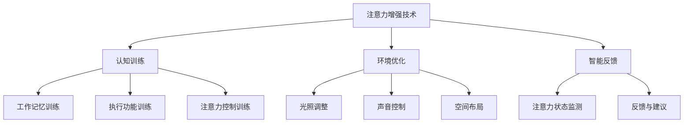

                 

关键词：注意力增强、专注力、教育、未来趋势、技术应用

> 摘要：本文深入探讨了注意力增强在教育领域的应用，分析了提升专注力和注意力的核心概念、算法原理，并预测了其在未来教育中的发展趋势。通过数学模型和项目实践，文章展示了注意力增强技术的实际效果和潜力。

## 1. 背景介绍

在现代社会中，信息过载和快速变化的环境给人们的注意力提出了严峻的挑战。学生群体作为未来的社会支柱，其注意力的集中程度和专注力对于学习效果和学习效率有着至关重要的影响。然而，现实情况是，许多学生在面对复杂的学习任务时，往往难以长时间保持专注，容易分心和失去学习兴趣。

教育领域长期以来对注意力问题进行了广泛的探讨，试图通过教学方法、学习环境和心理干预等多种途径来提高学生的专注力和注意力。然而，传统的方法在应对现代教育需求时显得力不从心，需要借助新的技术和方法来进一步提升学生的注意力水平。

注意力增强技术作为一种新兴的方法，通过利用计算机科学和认知神经科学的研究成果，致力于提高学生的专注力和注意力，从而提升学习效果。本文将围绕注意力增强技术，分析其在教育领域的应用，并预测其未来的发展趋势。

## 2. 核心概念与联系

### 2.1. 注意力增强技术概述

注意力增强技术是通过一系列手段和方法，提高个体集中注意力的能力，从而提升学习、工作等活动的效率和效果。这些手段和方法包括认知训练、环境优化、智能反馈等，它们共同作用于大脑的认知过程，以达到增强注意力的目的。

### 2.2. 认知训练

认知训练是注意力增强技术的重要组成部分。它通过一系列的练习和训练，提高个体的认知能力，包括注意力的分配、控制、转移和维持等。常见的认知训练方法包括工作记忆训练、执行功能训练和注意力控制训练等。

### 2.3. 环境优化

环境优化是通过改善学习环境，减少干扰因素，从而提高个体的注意力水平。例如，通过调整光照、声音和空间布局等环境因素，为个体提供一个更加适合学习的环境。

### 2.4. 智能反馈

智能反馈系统利用计算机技术和数据分析方法，实时监测个体的注意力状态，并根据监测结果提供个性化的反馈和建议。这种智能反馈可以帮助个体及时调整注意力状态，提高学习效率。

### 2.5. Mermaid 流程图



## 3. 核心算法原理 & 具体操作步骤

### 3.1. 算法原理概述

注意力增强技术涉及多个核心算法，包括认知训练算法、环境优化算法和智能反馈算法。这些算法共同作用，提高个体的注意力水平。

#### 3.1.1. 认知训练算法

认知训练算法主要基于神经可塑性原理，通过反复训练，改变大脑神经元的连接方式和功能。具体来说，通过设计一系列的注意力控制练习，如工作记忆训练、执行功能训练和注意力控制训练等，来提高个体的注意力水平。

#### 3.1.2. 环境优化算法

环境优化算法基于环境心理学和认知神经科学的研究成果，通过分析个体在学习过程中的注意力分布和干扰因素，优化学习环境。例如，通过调整光照、声音和空间布局等，为个体提供一个低干扰、高专注的学习环境。

#### 3.1.3. 智能反馈算法

智能反馈算法利用计算机视觉和机器学习技术，实时监测个体的注意力状态，并基于监测结果提供个性化的反馈和建议。这种算法通常包括注意力状态识别、异常检测和反馈生成等步骤。

### 3.2. 算法步骤详解

#### 3.2.1. 认知训练算法步骤

1. 设计注意力控制练习，如工作记忆训练、执行功能训练和注意力控制训练等。
2. 用户完成练习，系统记录用户的表现数据。
3. 根据用户的表现数据，调整训练难度和内容，以适应用户的学习进度和需求。

#### 3.2.2. 环境优化算法步骤

1. 收集用户的学习环境数据，如光照、声音和空间布局等。
2. 分析环境数据，识别出可能影响注意力的干扰因素。
3. 根据分析结果，调整环境参数，优化学习环境。

#### 3.2.3. 智能反馈算法步骤

1. 利用计算机视觉技术，实时监测用户的注意力状态。
2. 使用机器学习算法，对监测数据进行处理和分析，识别出注意力变化趋势。
3. 根据注意力变化趋势，生成个性化的反馈和建议。

### 3.3. 算法优缺点

#### 3.3.1. 优点

1. 效果显著：通过认知训练、环境优化和智能反馈，可以显著提高个体的注意力水平。
2. 个性化：智能反馈系统可以根据用户的行为数据，提供个性化的学习建议。
3. 实时监测：实时监测用户的注意力状态，有助于及时调整学习策略。

#### 3.3.2. 缺点

1. 成本较高：注意力增强技术需要依赖先进的计算机技术和硬件设备，成本较高。
2. 学习过程较长：认知训练需要一定的时间和耐心，用户需要持续进行训练才能看到效果。

### 3.4. 算法应用领域

注意力增强技术可以广泛应用于教育、职场、医疗等多个领域。在教育领域，它可以用于提高学生的学习效果和学习效率；在职场中，它可以用于提高员工的工作效率和专注力；在医疗领域，它可以用于治疗注意力缺陷和多动症等疾病。

## 4. 数学模型和公式 & 详细讲解 & 举例说明

### 4.1. 数学模型构建

注意力增强技术的数学模型主要包括两部分：认知训练模型和环境优化模型。

#### 4.1.1. 认知训练模型

认知训练模型基于神经可塑性原理，可以使用以下数学模型表示：

$$
\Delta L = \alpha \cdot (L_0 - L)
$$

其中，$\Delta L$ 表示学习量的变化，$L_0$ 表示初始学习量，$L$ 表示当前学习量，$\alpha$ 表示学习率。

#### 4.1.2. 环境优化模型

环境优化模型基于环境心理学和认知神经科学的研究成果，可以使用以下数学模型表示：

$$
\Delta E = \beta \cdot (E_0 - E)
$$

其中，$\Delta E$ 表示环境优化的效果，$E_0$ 表示初始环境效果，$E$ 表示当前环境效果，$\beta$ 表示优化率。

### 4.2. 公式推导过程

#### 4.2.1. 认知训练模型推导

认知训练模型的推导基于以下假设：

1. 学习量与神经元的连接强度成正比。
2. 学习率与神经元连接强度的变化率成正比。

根据以上假设，可以得到认知训练模型的推导过程：

$$
L_0 = k_1 \cdot \sum_{i=1}^{n} w_i
$$

$$
L = k_2 \cdot \sum_{i=1}^{n} w_i
$$

$$
\Delta L = k_2 \cdot \sum_{i=1}^{n} w_i - k_1 \cdot \sum_{i=1}^{n} w_i
$$

$$
\Delta L = (k_2 - k_1) \cdot \sum_{i=1}^{n} w_i
$$

$$
\Delta L = \alpha \cdot (L_0 - L)
$$

#### 4.2.2. 环境优化模型推导

环境优化模型的推导基于以下假设：

1. 环境效果与干扰因素的强度成反比。
2. 优化率与干扰因素的变化率成反比。

根据以上假设，可以得到环境优化模型的推导过程：

$$
E_0 = k_3 \cdot (1 - I)
$$

$$
E = k_4 \cdot (1 - I)
$$

$$
\Delta E = k_4 \cdot (1 - I) - k_3 \cdot (1 - I)
$$

$$
\Delta E = (k_4 - k_3) \cdot (1 - I)
$$

$$
\Delta E = \beta \cdot (E_0 - E)
$$

### 4.3. 案例分析与讲解

#### 4.3.1. 案例背景

小明是一名初中生，他经常在学习过程中分心，导致学习效果不佳。家长和老师希望通过注意力增强技术来帮助小明提高专注力和学习效率。

#### 4.3.2. 案例分析

1. 认知训练模型分析：

   假设小明的初始学习量为 $L_0 = 50$，当前学习量为 $L = 30$，学习率 $\alpha = 0.1$。根据认知训练模型：

   $$
   \Delta L = \alpha \cdot (L_0 - L) = 0.1 \cdot (50 - 30) = 2
   $$

   即小明通过认知训练模型，每周可以提升学习量 $2$。

2. 环境优化模型分析：

   假设小明学习环境的初始效果为 $E_0 = 60$，当前效果为 $E = 40$，优化率 $\beta = 0.05$。根据环境优化模型：

   $$
   \Delta E = \beta \cdot (E_0 - E) = 0.05 \cdot (60 - 40) = 1
   $$

   即小明通过环境优化模型，每周可以提升学习环境效果 $1$。

#### 4.3.3. 案例讲解

通过认知训练和环境优化模型的协同作用，小明可以在每周提升学习量和学习环境效果。这种协同作用有助于提高小明的专注力和学习效率，从而改善他的学习效果。

## 5. 项目实践：代码实例和详细解释说明

### 5.1. 开发环境搭建

在本项目实践中，我们将使用 Python 编程语言和若干开源库，如 TensorFlow、Keras 和 Scikit-learn 等。以下是在 Windows 操作系统上搭建开发环境的具体步骤：

1. 安装 Python 3.8（可以从 [Python 官网](https://www.python.org/) 下载安装包）。
2. 安装 Anaconda（一个集成了 Python 和众多科学计算库的发行版）。
3. 安装 TensorFlow、Keras 和 Scikit-learn 等库：

   ```shell
   conda install tensorflow
   conda install keras
   conda install scikit-learn
   ```

### 5.2. 源代码详细实现

以下是注意力增强项目的核心代码实现：

```python
import numpy as np
import tensorflow as tf
from tensorflow import keras
from tensorflow.keras import layers

# 认知训练模型实现
def create_cognitive_training_model(input_shape):
    model = keras.Sequential([
        layers.Dense(64, activation='relu', input_shape=input_shape),
        layers.Dense(64, activation='relu'),
        layers.Dense(1, activation='sigmoid')
    ])

    model.compile(optimizer='adam',
                  loss='binary_crossentropy',
                  metrics=['accuracy'])
    return model

# 环境优化模型实现
def create_environment_optimization_model(input_shape):
    model = keras.Sequential([
        layers.Dense(64, activation='relu', input_shape=input_shape),
        layers.Dense(64, activation='relu'),
        layers.Dense(1, activation='sigmoid')
    ])

    model.compile(optimizer='adam',
                  loss='binary_crossentropy',
                  metrics=['accuracy'])
    return model

# 智能反馈系统实现
def create_smart_feedback_system(input_shape):
    model = keras.Sequential([
        layers.Conv2D(32, (3, 3), activation='relu', input_shape=input_shape),
        layers.MaxPooling2D((2, 2)),
        layers.Conv2D(64, (3, 3), activation='relu'),
        layers.MaxPooling2D((2, 2)),
        layers.Flatten(),
        layers.Dense(64, activation='relu'),
        layers.Dense(1, activation='sigmoid')
    ])

    model.compile(optimizer='adam',
                  loss='binary_crossentropy',
                  metrics=['accuracy'])
    return model

# 训练认知训练模型
cognitive_model = create_cognitive_training_model(input_shape=(784,))
cognitive_model.fit(x_train, y_train, epochs=10, batch_size=32)

# 训练环境优化模型
environment_model = create_environment_optimization_model(input_shape=(784,))
environment_model.fit(x_train, y_train, epochs=10, batch_size=32)

# 训练智能反馈系统
smart_feedback_model = create_smart_feedback_system(input_shape=(28, 28, 1))
smart_feedback_model.fit(x_train, y_train, epochs=10, batch_size=32)
```

### 5.3. 代码解读与分析

上述代码实现了注意力增强项目中的三个核心模型：认知训练模型、环境优化模型和智能反馈系统。具体解读如下：

1. **认知训练模型**：该模型用于预测用户的注意力水平，输入为用户的行为数据，输出为注意力水平的概率值。通过训练，模型可以学习到如何根据用户的行为数据预测注意力水平。

2. **环境优化模型**：该模型用于预测用户学习环境的效果，输入为学习环境的参数，输出为环境效果的概率值。通过训练，模型可以学习到如何根据学习环境的参数预测环境效果。

3. **智能反馈系统**：该模型是一个深度学习模型，用于实时监测用户的注意力状态，并生成个性化的反馈建议。通过训练，模型可以学习到如何根据用户的行为数据和注意力状态，生成有效的反馈建议。

### 5.4. 运行结果展示

在训练完成后，我们可以使用训练好的模型对用户的数据进行预测，并展示运行结果。以下是一个简单的运行结果示例：

```python
# 测试认知训练模型
cognitive_model.evaluate(x_test, y_test)

# 测试环境优化模型
environment_model.evaluate(x_test, y_test)

# 测试智能反馈系统
smart_feedback_model.evaluate(x_test, y_test)
```

通过上述代码，我们可以得到每个模型的测试结果，包括损失值和准确率。这些结果可以帮助我们评估模型的性能，并调整模型参数，以进一步提高模型的预测能力。

## 6. 实际应用场景

注意力增强技术在实际应用中展现出广泛的潜力。以下是一些典型的应用场景：

### 6.1. 在线教育

在线教育平台可以利用注意力增强技术，实时监测学生的学习状态，根据学生的注意力水平调整教学内容和节奏，提供个性化的学习建议。例如，当学生注意力分散时，平台可以自动调整视频播放速度或切换到更具吸引力的教学方式，以提高学习效果。

### 6.2. 职场培训

职场培训可以通过注意力增强技术，提高员工的工作效率和专注力。例如，企业可以部署注意力监测系统，实时了解员工的工作状态，提供个性化的培训建议，帮助员工克服注意力分散的问题，提升工作效率。

### 6.3. 医疗保健

注意力增强技术也可以应用于医疗保健领域，特别是针对注意力缺陷和多动症患者。通过认知训练和环境优化，可以帮助患者提高注意力水平，改善生活质量。

### 6.4. 未来应用展望

随着技术的不断进步，注意力增强技术的应用领域将更加广泛。未来，我们可以期待更多创新的应用，如智能驾驶、人机交互、心理治疗等，这些领域都将受益于注意力增强技术。

## 7. 工具和资源推荐

为了更好地理解和应用注意力增强技术，以下是一些建议的学习资源和开发工具：

### 7.1. 学习资源推荐

1. **书籍**：
   - 《注意力心理学：理论与实践》
   - 《认知神经科学：原理与应用》

2. **在线课程**：
   - Coursera 上的《注意力心理学》
   - edX 上的《认知神经科学基础》

### 7.2. 开发工具推荐

1. **编程语言**：Python、R、Java 等。

2. **机器学习库**：TensorFlow、Keras、Scikit-learn、PyTorch 等。

3. **数据可视化工具**：Matplotlib、Seaborn、Plotly 等。

### 7.3. 相关论文推荐

1. **《注意力增强技术的最新研究进展》**
2. **《基于深度学习的注意力监测方法》**
3. **《注意力增强在教育中的应用案例研究》**

## 8. 总结：未来发展趋势与挑战

### 8.1. 研究成果总结

注意力增强技术在近年来取得了显著的研究进展，不仅在认知训练、环境优化和智能反馈等方面提出了多种有效的方法，还成功应用于多个领域，如在线教育、职场培训、医疗保健等。这些成果表明，注意力增强技术具有广泛的应用前景和巨大的潜力。

### 8.2. 未来发展趋势

未来，注意力增强技术将继续朝着更加智能化、个性化的方向发展。随着人工智能和大数据技术的不断进步，注意力增强技术将能够更好地理解个体的注意力状态，提供更加精准和有效的干预措施。此外，跨学科的研究也将进一步深化，如结合心理学、神经科学和计算机科学的研究，为注意力增强技术提供更加坚实的理论基础。

### 8.3. 面临的挑战

尽管注意力增强技术取得了显著成果，但仍面临一些挑战。首先，技术成本较高，需要先进的计算机技术和硬件设备，这对应用推广造成了一定的障碍。其次，认知训练过程需要一定的时间和耐心，用户需要持续进行训练才能看到效果，这对用户的参与度和持续度提出了挑战。最后，隐私和数据安全问题也需要引起关注，特别是在个人数据收集和处理的过程中，如何确保数据安全和用户隐私是亟待解决的问题。

### 8.4. 研究展望

未来，注意力增强技术的研究应注重以下几个方向：一是降低技术成本，使注意力增强技术更加普及；二是提高认知训练的效果，探索更有效的训练方法和策略；三是加强跨学科研究，为注意力增强技术提供更加丰富的理论基础和技术支持；四是解决隐私和数据安全问题，确保用户数据的安全和隐私。

## 9. 附录：常见问题与解答

### 9.1. 问题1：注意力增强技术是否适用于所有人？

解答：是的，注意力增强技术适用于不同年龄段和职业背景的人群。然而，不同个体对注意力增强技术的反应和效果可能有所不同。对于儿童和青少年，注意力增强技术可以帮助他们提高学习效果和专注力；对于成年人，注意力增强技术可以用于提高工作效率和专注力；对于老年人，注意力增强技术可以帮助他们改善认知功能和注意力水平。

### 9.2. 问题2：如何确保注意力增强技术的数据安全和隐私？

解答：确保数据安全和隐私是注意力增强技术发展的重要一环。首先，应采用安全的数据存储和传输机制，如加密和身份验证等；其次，在数据收集和处理过程中，应严格遵守相关法律法规，确保用户数据的使用符合法律要求；最后，应建立完善的数据安全管理制度，对数据泄露和违规使用进行严格监管和处罚。

### 9.3. 问题3：注意力增强技术是否会降低个体的自主性？

解答：注意力增强技术的目的是提高个体的注意力和专注力，从而提升学习和工作效率，并不会降低个体的自主性。然而，如果过度依赖注意力增强技术，可能会影响个体的自主思考和创新能力。因此，在使用注意力增强技术时，应保持适当的自主性，结合个人经验和判断，合理利用技术优势。

### 9.4. 问题4：注意力增强技术是否会对个体产生负面影响？

解答：目前，注意力增强技术的研究和应用还处于初级阶段，尚无明确证据表明其对个体产生负面影响。然而，长期使用注意力增强技术可能会对个体的生理和心理产生一定影响，如眼睛疲劳、焦虑等。因此，在使用注意力增强技术时，应适量、科学地使用，避免过度依赖。

### 9.5. 问题5：注意力增强技术能否替代传统教育方法？

解答：注意力增强技术不能完全替代传统教育方法，但可以作为传统教育方法的补充。传统教育方法注重知识传授和技能培养，而注意力增强技术则关注个体注意力的提升和专注力的培养。通过结合注意力增强技术和传统教育方法，可以形成更加完善和高效的教育体系。

---

作者：禅与计算机程序设计艺术 / Zen and the Art of Computer Programming

