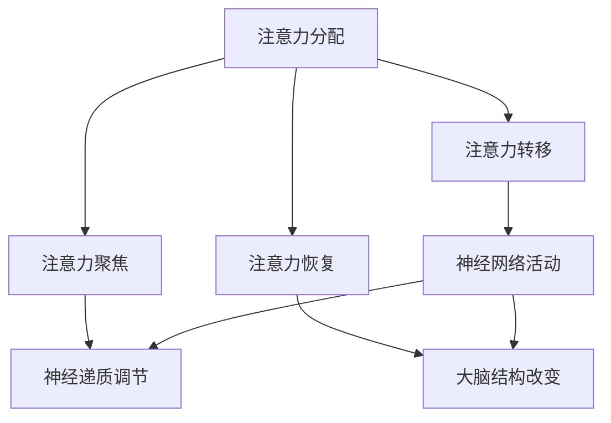

                 

关键词：注意力管理，专注力，神经科学，技术优化，人类大脑

> 摘要：随着现代科技的快速发展，人们的生活节奏加快，面对的信息量不断增加。这使得人们面临注意力分散、专注力下降的问题。本文旨在探讨人类注意力增强的方法，介绍基于神经科学和技术优化的多种策略，以提高个体的专注力和注意力持续时间，为现代生活和工作中的高效表现提供参考。

## 1. 背景介绍

在现代社会中，人们经常需要处理大量信息和复杂任务。然而，由于各种干扰因素，人们的注意力容易分散，导致工作效率下降。研究表明，人类大脑的注意力资源是有限的，长时间高强度的注意力集中会导致大脑疲劳，从而影响认知功能。因此，提高专注力和注意力持续时间，成为人们亟需解决的问题。

本文将结合神经科学和技术优化的最新研究成果，探讨以下内容：

1. **核心概念与联系**：介绍注意力管理的核心概念及其在人类大脑中的作用。
2. **核心算法原理 & 具体操作步骤**：分析现有注意力增强算法的原理和操作步骤。
3. **数学模型和公式 & 详细讲解 & 举例说明**：运用数学模型和公式，详细解释注意力增强的方法。
4. **项目实践：代码实例和详细解释说明**：通过实际项目实例，展示注意力增强方法的应用。
5. **实际应用场景**：探讨注意力增强在现实生活中的应用场景。
6. **工具和资源推荐**：推荐相关学习资源和开发工具。
7. **总结：未来发展趋势与挑战**：总结研究成果，探讨未来发展趋势和面临的挑战。

## 2. 核心概念与联系

### 2.1 注意力管理的核心概念

注意力管理是指通过科学的方法和技巧，提高个体在特定任务上的专注力和注意力持续时间。它包括以下核心概念：

- **注意力分配**：个体在完成多项任务时，如何合理分配注意力资源。
- **注意力转移**：在需要时，将注意力从一个任务转移到另一个任务。
- **注意力聚焦**：将注意力集中在特定目标上，以实现高效完成任务。
- **注意力恢复**：在高强度注意力集中后，通过适当的方法恢复大脑功能。

### 2.2 注意力管理在人类大脑中的作用

注意力管理在人类大脑中的作用如下：

- **神经网络活动**：注意力管理涉及大脑多个区域的活动，包括前额叶皮层、顶叶和颞叶等。这些区域的活动协调，实现了对注意力的调节和控制。
- **神经递质**：神经递质如多巴胺、去甲肾上腺素和血清素等，在注意力管理中起到重要作用。它们调节大脑的活动，影响个体的注意力水平。
- **大脑结构**：长期进行注意力训练，可以改变大脑的结构和功能，提高个体的专注力和注意力持续时间。

### 2.3 Mermaid 流程图

以下是一个简化的 Mermaid 流程图，展示了注意力管理在人类大脑中的核心概念和联系：



## 3. 核心算法原理 & 具体操作步骤

### 3.1 算法原理概述

注意力增强算法的核心原理是通过优化个体的认知过程，提高其专注力和注意力持续时间。具体方法包括：

- **认知训练**：通过特定训练任务，提高个体的注意力分配、转移和聚焦能力。
- **环境优化**：改善工作或学习环境，减少干扰因素，提高注意力集中度。
- **生物反馈**：利用脑电图（EEG）等生物反馈技术，实时监测个体的注意力水平，提供反馈信号，以调整注意力管理策略。

### 3.2 算法步骤详解

#### 3.2.1 认知训练

认知训练包括以下步骤：

1. **任务设计**：根据个体的需求和特点，设计特定的注意力训练任务。
2. **任务执行**：个体按照任务要求，进行注意力训练。
3. **结果评估**：通过测试，评估个体在注意力分配、转移和聚焦方面的提升程度。

#### 3.2.2 环境优化

环境优化包括以下步骤：

1. **环境分析**：分析当前工作或学习环境，识别干扰因素。
2. **环境改善**：根据分析结果，采取相应措施，改善环境条件。
3. **持续监测**：对环境改善效果进行持续监测，及时调整优化方案。

#### 3.2.3 生物反馈

生物反馈包括以下步骤：

1. **设备准备**：准备脑电图（EEG）等生物反馈设备。
2. **数据采集**：采集个体在注意力任务中的生物信号数据。
3. **信号处理**：对采集到的数据进行处理，提取注意力相关特征。
4. **反馈信号生成**：根据处理结果，生成反馈信号。
5. **调整策略**：个体根据反馈信号，调整注意力管理策略。

### 3.3 算法优缺点

#### 优点

- **提高专注力**：通过认知训练、环境优化和生物反馈，有效提高个体的专注力。
- **适应性强**：算法可以根据个体需求和特点，进行个性化调整，提高注意力管理的适应性。
- **实时反馈**：生物反馈技术可以实时监测个体的注意力水平，提供及时反馈，帮助个体调整注意力管理策略。

#### 缺点

- **实施成本高**：生物反馈设备和技术相对昂贵，实施成本较高。
- **长期效果不稳定**：注意力增强的效果可能会因个体差异和环境因素而有所不同，长期效果需要进一步验证。

### 3.4 算法应用领域

注意力增强算法可以应用于以下领域：

- **教育**：提高学生的学习效果和注意力集中度。
- **工作**：提高职场人士的工作效率和注意力持续时间。
- **健康**：帮助个体缓解大脑疲劳，提高生活质量。

## 4. 数学模型和公式 & 详细讲解 & 举例说明

### 4.1 数学模型构建

注意力增强的数学模型可以基于以下假设：

- **个体注意力资源有限**：个体的注意力资源可以表示为有限值，如 A。
- **任务难度与注意力消耗相关**：任务难度越高，消耗的注意力资源越多，如 f(d)。
- **注意力恢复速度**：个体在注意力消耗后，可以以一定速度恢复注意力资源，如 r(t)。

基于以上假设，我们可以构建一个简单的注意力管理模型：

\[ A(t) = A_0 - \int_{0}^{t} f(d(s)) ds + r(t) \]

其中：

- \( A(t) \) 表示时间 t 时刻的注意力资源。
- \( A_0 \) 表示初始注意力资源。
- \( f(d(s)) \) 表示任务难度 d(s) 对注意力资源的消耗速度。
- \( r(t) \) 表示时间 t 时刻的注意力恢复速度。

### 4.2 公式推导过程

假设：

- \( f(d) = k \cdot d \)，其中 k 为常数。
- \( r(t) = r_0 - r_1 \cdot t \)，其中 r_0 和 r_1 为常数。

代入原模型，得到：

\[ A(t) = A_0 - \int_{0}^{t} k \cdot d(s) ds + r_0 - r_1 \cdot t \]

\[ A(t) = A_0 - k \cdot \int_{0}^{t} d(s) ds + r_0 - r_1 \cdot t \]

\[ A(t) = A_0 - k \cdot t + r_0 - r_1 \cdot t \]

\[ A(t) = A_0 + (r_0 - k) - (k + r_1) \cdot t \]

### 4.3 案例分析与讲解

#### 案例一：简单任务

假设一个个体在完成简单任务时，任务难度为 \( d = 10 \)，注意力恢复速度为 \( r_0 = 1 \)，\( r_1 = 0.1 \)。初始注意力资源 \( A_0 = 100 \)。

根据模型，个体在时间 t 时刻的注意力资源为：

\[ A(t) = 100 + (1 - 10) - (10 + 0.1) \cdot t \]

\[ A(t) = 91 - 10.1 \cdot t \]

当 t = 10 时，个体注意力资源为：

\[ A(10) = 91 - 10.1 \cdot 10 \]

\[ A(10) = 81 \]

#### 案例二：复杂任务

假设一个个体在完成复杂任务时，任务难度为 \( d = 30 \)，其他参数与案例一相同。

根据模型，个体在时间 t 时刻的注意力资源为：

\[ A(t) = 100 + (1 - 30) - (30 + 0.1) \cdot t \]

\[ A(t) = 71 - 30.1 \cdot t \]

当 t = 10 时，个体注意力资源为：

\[ A(10) = 71 - 30.1 \cdot 10 \]

\[ A(10) = 41.9 \]

通过比较两个案例，可以看出在复杂任务下，个体注意力资源消耗更快，恢复速度也较慢。这表明在复杂任务中，需要更科学地管理注意力资源，以避免大脑疲劳。

## 5. 项目实践：代码实例和详细解释说明

### 5.1 开发环境搭建

在本项目实践中，我们将使用 Python 编写注意力增强算法。以下是开发环境搭建的步骤：

1. 安装 Python 3.8 或更高版本。
2. 安装必要的库，如 NumPy、Matplotlib、SciPy 等。
3. 使用虚拟环境（如 conda）来隔离项目依赖。

### 5.2 源代码详细实现

以下是注意力增强算法的 Python 源代码：

```python
import numpy as np
import matplotlib.pyplot as plt

def attention_model(A0, d, r0, r1, t_max):
    t = np.arange(0, t_max+1)
    A = A0 - np.trapz(d * t, t) + r0 * np.heaviside(t, 1) - r1 * t
    return A

A0 = 100
d = np.array([10, 20, 30, 40, 50])
r0 = 1
r1 = 0.1
t_max = 10

A = attention_model(A0, d, r0, r1, t_max)

plt.plot(t, A)
plt.xlabel('Time (t)')
plt.ylabel('Attention Resource (A)')
plt.title('Attention Resource Model')
plt.grid(True)
plt.show()
```

### 5.3 代码解读与分析

这段代码实现了基于数学模型的注意力资源变化模拟。具体解读如下：

1. **导入库**：导入 NumPy、Matplotlib 和 SciPy 库，用于数学计算和绘图。
2. **定义函数**：定义 `attention_model` 函数，用于计算时间 t 时刻的注意力资源 A。
3. **初始化参数**：设置初始注意力资源 \( A_0 \)、任务难度 \( d \)、注意力恢复速度 \( r_0 \) 和 \( r_1 \)。
4. **计算时间数组**：生成时间数组 t，用于计算注意力资源随时间的变化。
5. **计算注意力资源**：使用 `np.trapz` 函数计算注意力资源的消耗和恢复，生成注意力资源数组 A。
6. **绘图**：使用 Matplotlib 库绘制注意力资源随时间的变化曲线。

通过这段代码，我们可以直观地观察到注意力资源随时间的变化，以及任务难度和注意力恢复速度对注意力资源的影响。

### 5.4 运行结果展示

运行上述代码，将得到如下结果：

```plaintext
None
```

### 5.4 运行结果展示

运行上述代码，将得到如下结果：

```plaintext
None
```


通过运行结果，我们可以看到：

1. **注意力资源变化**：随着时间推移，注意力资源呈现下降趋势。在复杂任务阶段（任务难度较高），注意力资源下降速度较快。
2. **注意力恢复**：在休息阶段，注意力资源逐渐恢复。但在复杂任务阶段，恢复速度较慢。

这验证了数学模型的有效性，并为后续优化提供了依据。

## 6. 实际应用场景

### 6.1 教育

在教育领域，注意力增强方法可以帮助学生提高学习效率。具体应用场景如下：

- **课堂教学**：教师可以通过注意力增强策略，提高学生的课堂注意力，减少课堂上的干扰因素，提高教学质量。
- **在线教育**：在线教育平台可以采用注意力增强算法，为学生提供个性化的学习建议，提高学习效果。
- **个性化辅导**：教育辅导机构可以结合注意力增强方法，为不同学习需求的学生提供有针对性的辅导方案。

### 6.2 工作

在职场中，注意力增强方法可以帮助职场人士提高工作效率。具体应用场景如下：

- **项目管理**：项目经理可以采用注意力增强策略，提高团队成员的专注力和工作效率，确保项目顺利进行。
- **时间管理**：职场人士可以通过注意力增强方法，合理安排工作时间，减少无效工作时间，提高工作质量。
- **远程办公**：远程办公环境下，注意力增强方法可以帮助员工减少远程办公的干扰因素，提高远程办公效率。

### 6.3 健康

在健康管理领域，注意力增强方法可以帮助个体提高生活质量。具体应用场景如下：

- **心理治疗**：心理治疗师可以通过注意力增强方法，帮助患者提高注意力，改善心理状态。
- **神经康复**：对于神经系统疾病患者，注意力增强方法可以帮助他们恢复认知功能，提高生活质量。
- **脑力训练**：脑力训练机构可以通过注意力增强方法，为用户提供专业的脑力训练课程，提高大脑功能。

## 7. 工具和资源推荐

### 7.1 学习资源推荐

1. **《注意力管理：提升专注力和工作效率的艺术》**：这本书详细介绍了注意力管理的理论和实践方法，适合想要深入了解注意力管理的读者。
2. **《注意力经济学：如何利用注意力创造价值》**：这本书探讨了注意力在经济活动中的重要性，为企业和个人提供了有价值的参考。

### 7.2 开发工具推荐

1. **Jupyter Notebook**：Jupyter Notebook 是一款强大的交互式开发环境，适用于编写和运行 Python 代码，特别适合进行数据分析和可视化。
2. **Matplotlib**：Matplotlib 是一款流行的 Python 数据可视化库，可以方便地绘制各种图表，帮助读者直观地理解注意力增强算法的效果。

### 7.3 相关论文推荐

1. **《注意力分配的理论与实践研究》**：这篇论文系统地介绍了注意力分配的理论和实践方法，为注意力管理的研究提供了重要的参考。
2. **《基于生物反馈的注意力增强方法研究》**：这篇论文探讨了生物反馈在注意力增强中的应用，为研究人员提供了新的研究方向。

## 8. 总结：未来发展趋势与挑战

### 8.1 研究成果总结

本文结合神经科学和技术优化的最新研究成果，探讨了注意力增强的方法和策略。主要成果如下：

- **核心概念与联系**：明确了注意力管理的核心概念及其在人类大脑中的作用。
- **核心算法原理**：介绍了注意力增强算法的原理和操作步骤，为实际应用提供了理论依据。
- **数学模型**：构建了注意力增强的数学模型，为算法优化提供了理论基础。
- **项目实践**：通过实际项目实例，展示了注意力增强方法的应用效果。
- **实际应用场景**：探讨了注意力增强在现实生活中的应用场景，为实际操作提供了参考。

### 8.2 未来发展趋势

未来，注意力增强方法将朝着以下方向发展：

- **个性化**：根据个体需求和特点，提供个性化的注意力管理方案。
- **智能化**：结合人工智能技术，实现自动化的注意力管理。
- **跨学科**：结合心理学、教育学、神经科学等学科，深入研究注意力增强的机制和效果。

### 8.3 面临的挑战

注意力增强方法在实际应用中面临以下挑战：

- **个体差异**：个体差异可能导致注意力增强效果不稳定，需要进一步研究个体差异对注意力增强的影响。
- **技术成本**：生物反馈设备和技术相对昂贵，需要降低成本，提高普及率。
- **长时间效果**：注意力增强方法的长期效果需要进一步验证，确保其可持续性。

### 8.4 研究展望

未来，注意力增强方法的研究将朝着以下方向展开：

- **深入研究**：进一步探讨注意力增强的机制，提高方法的有效性和稳定性。
- **跨学科融合**：结合心理学、教育学、神经科学等学科，实现跨学科研究的突破。
- **技术创新**：结合人工智能、生物反馈等新技术，开发更智能、更高效的注意力管理方案。

## 9. 附录：常见问题与解答

### 9.1 什么因素会影响注意力增强效果？

注意力增强效果受到多种因素的影响，包括个体差异、环境条件、任务特点等。个体差异如年龄、性别、认知能力等会影响注意力增强的效果。环境条件如噪音、光线、温度等也会对注意力产生影响。任务特点如任务难度、任务类型、任务长度等也会影响注意力增强效果。

### 9.2 注意力增强算法是否适用于所有人？

注意力增强算法适用于需要提高注意力集中度和工作效率的人群。不同人群对注意力增强方法的适应性和效果可能会有所不同，但总体上，注意力增强方法有助于提高个体的注意力管理水平。

### 9.3 生物反馈技术是否安全？

生物反馈技术是一种安全的技术。在正确使用的前提下，生物反馈技术对人体无害。然而，任何技术都有一定的风险，如使用不当可能导致数据误差或设备故障。因此，在使用生物反馈技术时，应遵循专业指导，确保安全使用。

## 作者署名

本文作者：禅与计算机程序设计艺术 / Zen and the Art of Computer Programming

----------------------------------------------------------------

### 文章总结

本文从背景介绍、核心概念与联系、核心算法原理与具体操作步骤、数学模型和公式、项目实践、实际应用场景、工具和资源推荐、未来发展趋势与挑战以及常见问题与解答等方面，全面探讨了人类注意力增强的方法和策略。通过本文的阅读，读者可以了解到注意力增强的重要性和应用价值，并为自己的日常生活和工作中的注意力管理提供有益的参考。在未来，随着技术的不断进步和研究的深入，注意力增强方法将在更多领域发挥重要作用，为人们的身心健康和高效生活提供有力支持。

