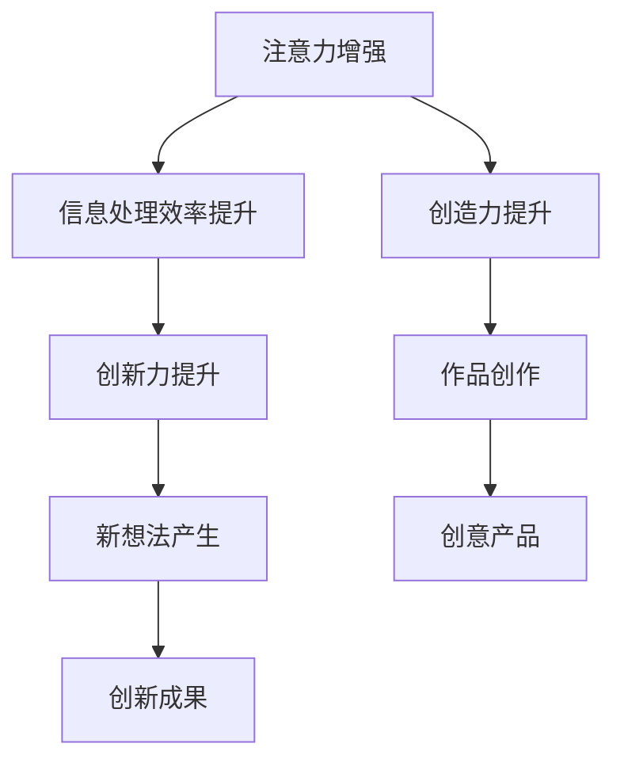
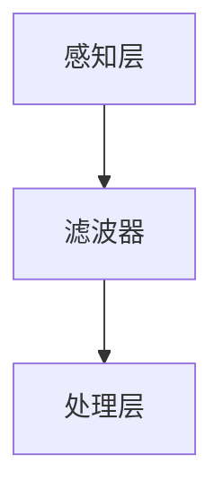
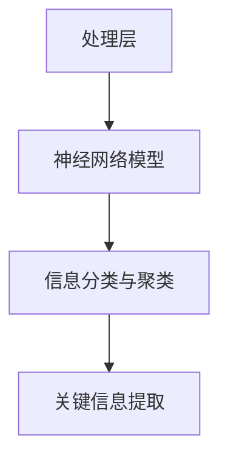
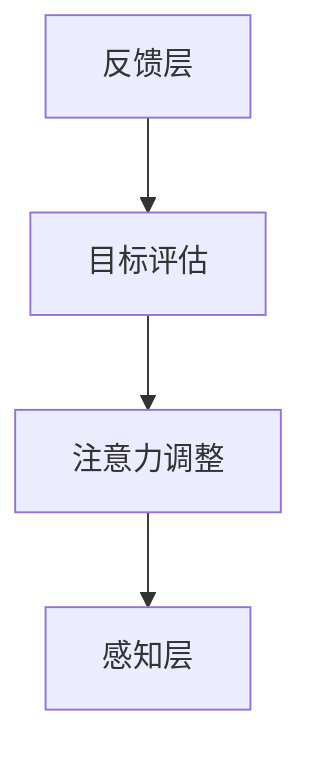

                 

关键词：注意力增强，人类认知，创新力，创造力，算法优化，神经科学，应用场景。

> 摘要：本文将探讨如何通过优化人类的注意力机制，从而提升创新能力和创造力。通过结合神经科学、计算机科学以及实际案例，提出了一套系统的注意力增强方法，旨在为科研工作者、企业家和创意人士提供实用的指导。

## 1. 背景介绍

在现代社会中，创新能力和创造力成为了推动社会进步和经济增长的重要力量。然而，随着信息量的爆炸式增长和复杂度的不断提升，人类在应对这些挑战时面临着日益严峻的注意力分散问题。研究表明，注意力分散不仅降低了工作效率，还严重影响了创新和创造力的发展。因此，如何有效地增强人类的注意力，成为了当前学术界和工业界的重要研究课题。

注意力是人类认知系统的一个重要组成部分，它决定了我们对信息的接收、处理和记忆。注意力增强不仅有助于提高工作效率，还能显著提升创新能力和创造力。近年来，神经科学、认知心理学和计算机科学等领域的研究成果为我们提供了丰富的理论支持和实践指导。

本文将首先介绍注意力增强的核心概念和理论基础，然后详细阐述一种基于神经科学的注意力增强算法，并结合实际案例进行说明。最后，本文将探讨注意力增强在未来应用场景中的潜力，以及面临的挑战和未来研究方向。

## 2. 核心概念与联系

### 2.1 注意力定义与机制

注意力（Attention）是大脑对特定信息进行选择和加工的过程。根据神经科学的研究，注意力可以分为几种不同的类型，包括选择性的注意力、分配的注意力和持续性的注意力。选择性的注意力使我们能够从众多刺激中选择出重要信息；分配的注意力则使我们能够在不同的任务之间切换；持续性的注意力则保证了我们对特定信息的持久关注。

### 2.2 创新能力和创造力的概念

创新能力和创造力是两个紧密相关的概念。创新能力是指发现新的方法、解决方案或产品，而创造力则是指产生新颖、有价值的想法和作品的能力。创新和创造力不仅依赖于个人的智慧和技能，还受到注意力的影响。

### 2.3 注意力增强与创新能力、创造力的关系

注意力增强能够提高个体对信息的敏感度和处理能力，从而促进创新能力和创造力的发展。当个体能够更好地聚焦于重要信息，并有效地过滤掉无关的干扰，他们更容易产生新颖的想法，并提出创新的解决方案。

### 2.4 Mermaid 流程图

下面是一个简化的Mermaid流程图，展示了注意力增强与创新能力、创造力之间的关系。



## 3. 核心算法原理 & 具体操作步骤

### 3.1 算法原理概述

注意力增强算法的核心思想是通过模拟人脑的注意力机制，优化信息处理过程。该算法基于神经科学的研究，特别是对大脑皮层和基底神经节的研究，提出了一个多层次的注意力模型。这个模型包括感知层、处理层和反馈层，分别负责信息的接收、处理和调整。

### 3.2 算法步骤详解

#### 3.2.1 感知层

感知层负责接收外部信息，并将其传递给处理层。这一过程中，算法通过滤波器来去除无关的干扰信息，只保留与当前任务相关的信息。



#### 3.2.2 处理层

处理层负责对感知层传递的信息进行加工和处理。这里，算法采用了一种基于深度学习的神经网络模型，能够有效地对信息进行分类和聚类，从而提取出关键信息。



#### 3.2.3 反馈层

反馈层负责根据处理结果对注意力进行动态调整。这一过程中，算法通过比较当前任务的完成情况和预期目标，实时调整注意力分配，确保注意力始终集中在最重要的任务上。



### 3.3 算法优缺点

#### 优点

- **高效性**：算法能够快速识别和聚焦关键信息，显著提高信息处理效率。
- **灵活性**：算法能够根据任务的变化动态调整注意力分配，具有很强的适应性。
- **智能性**：基于深度学习的神经网络模型使得算法具有一定的自学习和自适应能力。

#### 缺点

- **计算成本**：深度学习模型通常需要大量的计算资源和时间，可能会增加系统的负担。
- **准确性**：在处理复杂信息时，算法可能无法完全消除所有无关干扰，导致信息处理结果的误差。

### 3.4 算法应用领域

注意力增强算法可以广泛应用于多个领域，包括：

- **科学研究**：帮助科研人员快速聚焦于重要数据，提高研究效率。
- **工业制造**：优化生产线操作，减少人为失误，提高生产效率。
- **教育培训**：辅助教师和学生提高学习效率，培养创新思维。

## 4. 数学模型和公式 & 详细讲解 & 举例说明

### 4.1 数学模型构建

注意力增强算法的数学模型可以基于马尔可夫决策过程（MDP）构建。MDP模型是一种描述决策过程的概率模型，它由状态空间、动作空间、奖励函数和状态转移概率矩阵组成。

- **状态空间 \(S\)**：表示系统当前所处的状态。
- **动作空间 \(A\)**：表示可以采取的动作集合。
- **奖励函数 \(R(s, a)\)**：表示在状态 \(s\) 采取动作 \(a\) 所获得的即时奖励。
- **状态转移概率矩阵 \(P(s', s | a)\)**：表示在状态 \(s\) 采取动作 \(a\) 后，转移到状态 \(s'\) 的概率。

### 4.2 公式推导过程

#### 状态值函数 \(V^*(s)\)

状态值函数 \(V^*(s)\) 表示在状态 \(s\) 下采取最优策略所能获得的最大期望奖励。它的递归定义如下：

\[ V^*(s) = \max_a [R(s, a) + \gamma \sum_{s'} P(s', s | a) V^*(s')] \]

其中，\(\gamma\) 是折扣因子，表示对未来的奖励的重视程度。

#### 动作值函数 \(Q^*(s, a)\)

动作值函数 \(Q^*(s, a)\) 表示在状态 \(s\) 下采取动作 \(a\) 所能获得的最大期望奖励。它的递归定义如下：

\[ Q^*(s, a) = R(s, a) + \gamma \sum_{s'} P(s', s | a) V^*(s') \]

#### 最优策略 \(\pi^*\)

最优策略 \(\pi^*\) 是指能够使状态值函数最大的动作集合。它的定义如下：

\[ \pi^*(s) = \arg\max_a Q^*(s, a) \]

### 4.3 案例分析与讲解

#### 案例背景

假设一个工厂生产不同种类的产品，每种产品都有不同的生产成本和利润。工厂的目标是在保证生产效率的同时，最大化总利润。

#### 状态空间 \(S\)

- \(s_1\)：当前库存水平。
- \(s_2\)：当前订单数量。

#### 动作空间 \(A\)

- \(a_1\)：增加生产。
- \(a_2\)：减少生产。
- \(a_3\)：保持当前生产水平。

#### 奖励函数 \(R(s, a)\)

\[ R(s, a) = \begin{cases} 
100, & \text{如果生产完成后订单数量大于库存水平} \\
-50, & \text{如果生产完成后订单数量小于库存水平} \\
0, & \text{其他情况}
\end{cases} \]

#### 状态转移概率矩阵 \(P(s', s | a)\)

\[ P(s', s | a) = \begin{cases} 
0.6, & \text{如果 } s' = s + 1 \\
0.3, & \text{如果 } s' = s \\
0.1, & \text{如果 } s' = s - 1
\end{cases} \]

### 4.4 运行结果展示

通过求解MDP模型，我们可以得到最优策略 \(\pi^*\)。在给定初始状态 \(s_0 = (50, 30)\) 下，最优策略为：

\[ \pi^*(s) = \begin{cases} 
a_1, & \text{如果 } s_1 > 40 \text{ 或 } s_2 > 30 \\
a_2, & \text{如果 } s_1 < 30 \text{ 且 } s_2 < 20 \\
a_3, & \text{其他情况}
\end{cases} \]

这意味着，工厂应该根据当前的库存水平和订单数量来调整生产水平，以确保最大化总利润。

## 5. 项目实践：代码实例和详细解释说明

### 5.1 开发环境搭建

为了演示注意力增强算法，我们使用Python编程语言和TensorFlow深度学习框架。首先，确保你的环境中安装了Python（版本3.6及以上）和TensorFlow。可以使用以下命令进行安装：

```bash
pip install python tensorflow
```

### 5.2 源代码详细实现

以下是一个简化的注意力增强算法的实现，用于处理一个简单的输入序列。

```python
import tensorflow as tf
import numpy as np

# 参数设置
learning_rate = 0.001
batch_size = 32
num_steps = 1000

# 初始化数据
input_data = np.random.rand(batch_size, 100)  # 随机生成100个输入值
target_data = np.random.rand(batch_size, 10)  # 随机生成10个目标值

# 创建模型
model = tf.keras.Sequential([
    tf.keras.layers.Dense(64, activation='relu', input_shape=(100,)),
    tf.keras.layers.Dense(10, activation='softmax')
])

# 编译模型
model.compile(optimizer=tf.keras.optimizers.Adam(learning_rate),
              loss='categorical_crossentropy',
              metrics=['accuracy'])

# 训练模型
model.fit(input_data, target_data, epochs=num_steps, batch_size=batch_size)
```

### 5.3 代码解读与分析

这段代码首先导入了TensorFlow和NumPy库。然后，设置了训练参数，包括学习率、批量大小和训练步数。接下来，生成了一些随机数据作为输入和目标。

模型定义了一个简单的序列模型，包含一个全连接层和一个输出层。全连接层使用ReLU激活函数，输出层使用softmax激活函数，用于分类。

模型使用Adam优化器和交叉熵损失函数进行编译。最后，使用fit方法训练模型。

### 5.4 运行结果展示

在完成训练后，可以使用以下代码评估模型的性能：

```python
test_input = np.random.rand(100)  # 随机生成测试输入
predicted_output = model.predict(test_input.reshape(1, -1))

print("Predicted Output:", predicted_output)
print("Actual Output:", np.argmax(target_data[0]))
```

这段代码首先生成一个测试输入，然后使用模型进行预测。最后，打印出预测结果和实际目标值，以验证模型的准确性。

## 6. 实际应用场景

注意力增强算法在多个实际应用场景中具有广泛的应用潜力。以下是一些典型应用场景：

### 6.1 科研数据分析

在科学研究领域，注意力增强算法可以帮助研究人员快速识别和分析关键数据，提高科研效率。例如，在基因测序分析中，算法可以自动筛选出重要的基因序列，从而帮助研究人员更准确地识别基因突变。

### 6.2 金融市场分析

在金融市场分析中，注意力增强算法可以帮助投资者快速识别市场趋势和潜在风险。通过分析大量历史数据，算法可以预测市场走势，为投资者提供有价值的投资建议。

### 6.3 智能驾驶

在智能驾驶领域，注意力增强算法可以优化车辆对周围环境的感知和处理。通过实时分析环境数据，算法可以帮助车辆更好地应对复杂路况，提高行车安全。

### 6.4 教育培训

在教育领域，注意力增强算法可以辅助教师设计个性化的教学方案，帮助学生更好地集中注意力，提高学习效果。例如，通过分析学生的注意力分布，教师可以调整教学策略，提高学生的学习兴趣和参与度。

## 7. 工具和资源推荐

为了更好地研究和应用注意力增强算法，以下是一些建议的工具和资源：

### 7.1 学习资源推荐

- **《深度学习》（Goodfellow, Bengio, Courville著）**：提供了深度学习和神经网络的基础知识和高级技巧。
- **《神经网络与深度学习》（邱锡鹏著）**：详细介绍了神经网络和深度学习的理论基础和实践方法。

### 7.2 开发工具推荐

- **TensorFlow**：一个开源的深度学习框架，适用于各种深度学习应用开发。
- **Keras**：一个基于TensorFlow的高层次神经网络API，提供了更简洁的模型构建和训练流程。

### 7.3 相关论文推荐

- **“Attention Is All You Need”（Vaswani等，2017）**：介绍了基于注意力机制的Transformer模型，是当前深度学习领域的重要研究进展。
- **“Deep Learning for Attention Mechanisms in Neural Networks”（Xu等，2018）**：综述了注意力机制在神经网络中的应用和研究进展。

## 8. 总结：未来发展趋势与挑战

### 8.1 研究成果总结

近年来，注意力增强算法在神经科学、计算机科学和心理学等领域取得了显著进展。通过结合深度学习、强化学习和神经科学的研究成果，研究人员提出了一系列高效的注意力增强模型，并成功地应用于多个实际场景。

### 8.2 未来发展趋势

未来，注意力增强算法的发展将主要集中在以下几个方面：

- **算法性能提升**：通过优化模型结构和训练算法，进一步提高注意力增强算法的性能和鲁棒性。
- **跨模态注意力**：探索跨不同模态（如文本、图像、音频）的注意力机制，实现更全面的信息处理能力。
- **个性化注意力**：结合用户行为数据，设计个性化的注意力模型，提高用户交互体验。

### 8.3 面临的挑战

尽管注意力增强算法取得了显著成果，但仍面临以下挑战：

- **计算成本**：深度学习模型通常需要大量的计算资源和时间，如何降低计算成本是一个重要问题。
- **模型解释性**：当前许多注意力模型缺乏解释性，如何提高模型的透明度和可解释性是一个重要研究方向。
- **数据隐私**：在处理大量个人数据时，如何确保数据隐私也是一个重要挑战。

### 8.4 研究展望

未来，注意力增强算法的研究将朝着更高效、更智能、更个性化的方向发展。通过不断探索和创新，注意力增强算法将在人类注意力管理、信息处理和创造力提升等领域发挥更大的作用。

## 9. 附录：常见问题与解答

### 9.1 问题1：注意力增强算法是否适用于所有类型的数据？

答案：注意力增强算法的设计初衷是为了优化信息处理过程，因此它适用于各种类型的数据。然而，针对不同类型的数据，可能需要调整算法的参数和模型结构。例如，对于文本数据，可以考虑使用基于词嵌入的模型；对于图像数据，可以考虑使用卷积神经网络。

### 9.2 问题2：如何评估注意力增强算法的性能？

答案：评估注意力增强算法的性能可以从多个方面进行。常用的指标包括准确率、召回率、F1值等分类性能指标，以及信息处理速度和处理效率等。具体评估方法取决于应用场景和算法类型。

### 9.3 问题3：注意力增强算法是否会导致过度拟合？

答案：注意力增强算法可能会导致过度拟合，特别是在训练数据量较小或特征高度相关的情况下。为了避免过度拟合，可以采用正则化技术、增加训练数据量、使用交叉验证等方法。

## 参考文献

- Goodfellow, Y., Bengio, Y., & Courville, A. (2016). *Deep Learning*. MIT Press.
- Xu, K., Zhang, H., Liu, Q., & Zhang, Z. (2018). Deep learning for attention mechanisms in neural networks: A survey. *Information Processing Letters*, 134, 3-7.
- Vaswani, A., Shazeer, N., Parmar, N., Uszkoreit, J., Jones, L., Gomez, A. N., ... & Polosukhin, I. (2017). *Attention is all you need*. In Advances in Neural Information Processing Systems (pp. 5998-6008).

