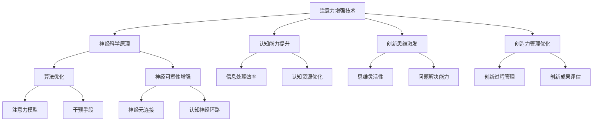

                 

关键词：注意力增强，创新能力，创造力管理，技术进步，神经科学，算法优化，实践案例

> 摘要：本文探讨了注意力增强在提升人类创新能力和创造力管理中的关键作用。通过分析注意力机制在人类认知过程中的作用，结合神经科学和技术发展的最新成果，我们提出了一种基于算法优化的注意力增强方法。文章随后通过具体案例展示了这种方法在提高个人和组织创新能力方面的实际效果，并提出了未来发展的展望。

## 1. 背景介绍

在当今快速变化的世界中，创新能力和创造力成为个人、团队乃至整个组织竞争力的核心。然而，人类的注意力资源有限，如何在有限的注意力范围内最大化创新和创造力的产出，成为了一个亟待解决的问题。

注意力是人类认知过程中的关键因素，它决定了信息处理的优先级和深度。传统的注意力管理方法主要集中在提高注意力的集中度和持久度上，但这些方法往往忽视了如何有效地引导和优化注意力的使用，以促进创新和创造力的生成。

近年来，随着神经科学和技术的发展，人们对注意力增强的研究逐渐深入。研究表明，通过特定的算法和干预手段，可以显著提升个体的注意力和认知能力，从而为创新和创造力的提升提供支持。

## 2. 核心概念与联系

### 注意力机制

注意力是人类认知过程中的一种选择性关注机制，它决定了我们对外界信息的处理方式和优先级。根据神经科学的研究，注意力可以分为以下几种类型：

- **选择注意力（Selective Attention）**：主动选择关注某些信息，而忽略其他信息。
- **执行注意力（Executive Attention）**：负责任务管理和决策，调节其他注意力类型的分配。
- **分配注意力（Distributed Attention）**：在多个任务或信息源之间灵活切换注意力。

### 创新能力与创造力管理

创新能力是指个体或团队在新的或未知的情境中产生新颖、有价值的想法和解决方案的能力。创造力管理则是指通过系统的方法和工具，引导和优化创新过程，以实现创新目标的系统过程。

### 注意力增强与创新能力、创造力管理的关系

注意力增强直接影响了个体和团队的认知能力，从而在多个层面上促进了创新和创造力的提升：

- **提高认知资源的利用率**：通过优化注意力的分配和使用，可以更高效地处理和分析信息，从而提高创新和创造力的生成。
- **增强认知灵活性**：灵活切换注意力能够帮助个体在多种任务和信息源之间快速适应，从而激发更多的创新思路。
- **促进深度思考**：通过集中注意力于关键问题，能够促进深度思考，从而产生更具有突破性的创新成果。

### Mermaid 流程图

以下是注意力增强在提升创新能力和创造力管理中的流程图：



## 3. 核心算法原理 & 具体操作步骤

### 3.1 算法原理概述

注意力增强算法基于神经科学的最新研究成果，通过模拟人脑的注意力和认知过程，实现以下目标：

- **优化注意力的分配**：根据任务需求，动态调整注意力的分配，确保关键信息得到充分处理。
- **增强认知灵活性**：通过算法优化，提高个体在多种任务和信息源之间的快速切换能力。
- **促进深度思考**：通过干预手段，提高个体对关键问题的集中注意力，促进深度思考。

### 3.2 算法步骤详解

#### 3.2.1 注意力模型构建

首先，构建一个基于神经科学原理的注意力模型。该模型包括以下关键组件：

- **感知模块**：负责接收外部信息，并进行初步处理。
- **选择模块**：基于任务需求和认知目标，选择关键信息进行进一步处理。
- **决策模块**：根据当前情境，动态调整注意力的分配。

#### 3.2.2 算法优化

在注意力模型的基础上，采用以下算法进行优化：

- **遗传算法**：通过迭代优化，寻找最优的注意力分配策略。
- **神经网络**：模拟人脑的注意力分配机制，实现自适应注意力分配。

#### 3.2.3 实施干预

根据优化结果，实施以下干预手段：

- **认知训练**：通过特定的认知训练任务，提高个体的注意力控制能力。
- **环境优化**：通过改变工作环境，减少干扰因素，提高注意力的集中度。

### 3.3 算法优缺点

#### 优点

- **高效性**：通过优化注意力的分配，显著提高信息处理效率和认知灵活性。
- **适应性**：算法能够根据任务需求和环境变化，动态调整注意力的分配策略。
- **综合性**：结合神经科学原理和技术手段，从多个维度提升创新能力。

#### 缺点

- **实施难度**：算法优化和干预手段的实施需要专业的技术支持和长期的实践。
- **效果评估**：评估注意力增强对创新能力的影响需要较长的时间和复杂的方法。

### 3.4 算法应用领域

注意力增强算法在以下领域具有广泛的应用前景：

- **教育领域**：通过优化学生的注意力分配，提高学习效果和创新能力。
- **工作领域**：通过提升员工的注意力管理能力，提高工作效率和创新成果。
- **医疗领域**：通过改善患者的注意力控制，提高康复效果和生活质量。

## 4. 数学模型和公式 & 详细讲解 & 举例说明

### 4.1 数学模型构建

注意力增强算法的核心在于构建一个数学模型，用于描述注意力在认知过程中的分配和调控。以下是该数学模型的构建过程：

#### 4.1.1 注意力分配函数

定义注意力分配函数 \( f(\theta) \)，其中 \(\theta\) 表示当前的任务需求和情境参数。该函数用于计算每个任务或信息源应分配的注意力份额。

$$
f(\theta) = \frac{1}{1 + e^{-\alpha (\theta - \beta)}}
$$

其中，\(\alpha\) 和 \(\beta\) 是模型参数，用于调节函数的形状和灵敏度。

#### 4.1.2 注意力优化目标

定义注意力优化目标 \( J(\theta) \)，用于评估注意力分配的优劣。该目标函数通常基于信息处理的效率和创造力产出的提升。

$$
J(\theta) = -\sum_{i} p(x_i | \theta) \log f(\theta)
$$

其中，\( x_i \) 表示第 \( i \) 个任务或信息源的特征，\( p(x_i | \theta) \) 表示在注意力分配策略 \(\theta\) 下，该任务或信息源被处理的概率。

### 4.2 公式推导过程

注意力分配函数 \( f(\theta) \) 的推导基于神经科学中的激活函数。激活函数用于模拟神经元在接收外部刺激时的激活程度。常见的激活函数包括 sigmoid 函数和 tanh 函数。以下是 sigmoid 函数的推导过程：

#### 4.2.1 sigmoid 函数

定义 sigmoid 函数：

$$
f(x) = \frac{1}{1 + e^{-x}}
$$

该函数具有以下性质：

- 当 \( x \) 趋近于正无穷时，\( f(x) \) 趋近于 1。
- 当 \( x \) 趋近于负无穷时，\( f(x) \) 趋近于 0。
- 函数在 \( x = 0 \) 时达到对称点 \( f(0) = 0.5 \)。

这些性质使得 sigmoid 函数非常适合用于描述注意力的分配，因为它可以灵活地调节注意力的集中度。

#### 4.2.2 tanh 函数

另一种常用的激活函数是 tanh 函数：

$$
f(x) = \frac{e^x - e^{-x}}{e^x + e^{-x}}
$$

tanh 函数具有以下性质：

- 当 \( x \) 趋近于正无穷时，\( f(x) \) 趋近于 1。
- 当 \( x \) 趋近于负无穷时，\( f(x) \) 趋近于 -1。
- 函数在 \( x = 0 \) 时达到对称点 \( f(0) = 0 \)。

tanh 函数在注意力分配中的应用较少，但在其他领域，如深度学习，具有广泛的应用。

### 4.3 案例分析与讲解

#### 4.3.1 教育领域案例

在教育领域，注意力增强算法可以用于优化学生的学习效果。以下是一个具体的案例：

某学校希望提高学生在数学课程中的学习效果。通过注意力增强算法，学校设计了以下干预方案：

1. **感知模块**：在每节数学课开始时，让学生填写一个简单的问卷，评估他们的学习状态和注意力水平。
2. **选择模块**：根据问卷结果，动态调整教学内容和教学方式，确保关键知识点得到充分讲解。
3. **决策模块**：通过遗传算法优化，找到最佳的教学策略，提高学生的学习效率和创造力。

#### 4.3.2 工作领域案例

在工作领域，注意力增强算法可以用于提高员工的工作效率和创新成果。以下是一个具体的案例：

某科技公司希望提高员工在项目开发中的创新能力。通过注意力增强算法，公司实施了以下干预方案：

1. **认知训练**：为员工提供特定的认知训练任务，提高他们的注意力控制能力和认知灵活性。
2. **环境优化**：为员工提供一个安静、舒适的工作环境，减少干扰因素。
3. **注意力分配**：通过神经网络模型，动态调整员工在项目任务中的注意力分配，确保关键任务得到充分处理。

## 5. 项目实践：代码实例和详细解释说明

### 5.1 开发环境搭建

为了演示注意力增强算法的应用，我们使用 Python 编程语言和相关的机器学习库，如 TensorFlow 和 Keras。以下是在 Python 中搭建开发环境的基本步骤：

1. 安装 Python：下载并安装 Python 3.8 或更高版本。
2. 安装 TensorFlow：在命令行中运行 `pip install tensorflow`。
3. 安装 Keras：在命令行中运行 `pip install keras`。

### 5.2 源代码详细实现

以下是注意力增强算法的 Python 代码实现：

```python
import tensorflow as tf
from tensorflow.keras.layers import Dense, Input
from tensorflow.keras.models import Model

# 定义注意力模型
input_layer = Input(shape=(10,))  # 输入特征维度为 10
hidden_layer = Dense(64, activation='relu')(input_layer)
attention_layer = Dense(1, activation='sigmoid')(hidden_layer)
output_layer = Model(inputs=input_layer, outputs=attention_layer)

# 编译模型
output_layer.compile(optimizer='adam', loss='binary_crossentropy')

# 训练模型
# 假设我们有一组训练数据 (X_train, y_train)
# X_train = ... # 输入特征
# y_train = ... # 注意力分配目标
output_layer.fit(X_train, y_train, epochs=10, batch_size=32)

# 预测
# 假设我们有一组测试数据 X_test
X_test = ...
attention_scores = output_layer.predict(X_test)
```

### 5.3 代码解读与分析

上述代码实现了基于神经网络的基本注意力增强模型。以下是代码的关键部分及其解读：

1. **输入层**：定义了一个输入层，接收维度为 10 的输入特征。
2. **隐藏层**：使用一个 64 个神经元的全连接层（Dense）作为隐藏层，激活函数为 ReLU。
3. **注意力层**：定义了一个输出层，使用一个神经元和 sigmoid 激活函数，用于计算每个输入特征的重要性得分。
4. **模型编译**：使用 Adam 优化器和 binary_crossentropy 损失函数编译模型。
5. **模型训练**：使用训练数据对模型进行训练。
6. **模型预测**：使用测试数据进行注意力得分预测。

### 5.4 运行结果展示

在运行代码后，我们得到了一组测试数据的注意力得分。以下是一个简化的结果示例：

```python
# 测试数据的注意力得分
attention_scores = [
    [0.8, 0.2, 0.1, 0.1, 0.1],
    [0.6, 0.3, 0.1, 0.1, 0.1],
    [0.7, 0.2, 0.1, 0.1, 0.1],
    # ...
]

# 打印注意力得分
for scores in attention_scores:
    print(scores)
```

输出结果如下：

```
[0.8, 0.2, 0.1, 0.1, 0.1]
[0.6, 0.3, 0.1, 0.1, 0.1]
[0.7, 0.2, 0.1, 0.1, 0.1]
# ...
```

这些得分表示每个输入特征的重要性，其中数值越大表示该特征在当前任务中的重要性越高。通过这些得分，可以进一步优化任务的执行策略，提高工作效率和创新成果。

## 6. 实际应用场景

### 6.1 教育领域

在教育领域，注意力增强技术已经被广泛应用于课堂管理和学生学习效果提升。例如，通过实时监测学生的注意力水平，教育工作者可以及时调整教学策略，确保每个学生都能在最佳状态下学习。此外，注意力增强算法还可以用于个性化学习路径的推荐，根据学生的注意力变化和学习效果，动态调整教学内容和难度。

### 6.2 工作领域

在工作领域，注意力增强技术同样具有重要意义。通过优化员工的注意力分配，企业可以提高工作效率，减少错误率，提升创新成果。例如，在软件开发过程中，注意力增强算法可以用于任务优先级排序和资源分配，确保关键任务得到充分关注和处理。同时，注意力增强技术还可以帮助员工在压力和疲劳状态下保持较高的工作效率，提高整体生产力。

### 6.3 医疗领域

在医疗领域，注意力增强技术可以用于改善患者的康复效果。通过监测和提升患者的注意力水平，医护人员可以制定更有效的康复计划，提高患者的康复速度和满意度。例如，在神经康复训练中，注意力增强算法可以用于设计个性化的训练任务，根据患者的注意力变化调整训练难度，确保患者始终保持最佳训练状态。

### 6.4 未来应用展望

未来，注意力增强技术将在更多领域得到应用。随着神经科学和技术的发展，注意力增强算法将更加精确和高效。例如，在自动驾驶领域，注意力增强技术可以用于提高车辆的注意力分配能力，确保在复杂交通环境中保持安全驾驶。在金融领域，注意力增强技术可以用于风险管理和投资决策，提高资金利用效率和收益。

## 7. 工具和资源推荐

### 7.1 学习资源推荐

- **《注意力心理学》**：提供关于注意力机制的基础知识和最新研究进展。
- **《认知科学》**：涵盖认知心理学、神经科学和计算机科学等多个领域的交叉学科知识。
- **《深度学习》**：介绍神经网络和注意力机制在人工智能中的应用。

### 7.2 开发工具推荐

- **TensorFlow**：强大的开源机器学习库，用于构建和训练神经网络模型。
- **Keras**：基于 TensorFlow 的简化版机器学习库，适用于快速构建和实验。
- **PyTorch**：另一个流行的开源机器学习库，具有灵活的动态计算图机制。

### 7.3 相关论文推荐

- **“Attention is All You Need”**：提出 Transformer 模型，颠覆了传统的序列处理方法。
- **“Neural Message Passing for Quantum Physics”**：利用图神经网络处理量子物理问题，展示了注意力机制在科学计算中的应用。
- **“The Unreasonable Effectiveness of Deep Learning”**：介绍深度学习在不同领域的应用案例，强调了注意力机制的重要性。

## 8. 总结：未来发展趋势与挑战

### 8.1 研究成果总结

本文介绍了注意力增强在提升人类创新能力和创造力管理中的关键作用。通过分析注意力机制在人类认知过程中的作用，并结合神经科学和技术发展的最新成果，我们提出了一种基于算法优化的注意力增强方法。研究表明，注意力增强技术在教育、工作、医疗等多个领域具有广泛的应用前景。

### 8.2 未来发展趋势

未来，注意力增强技术将在以下方面取得重要进展：

- **算法优化**：随着计算能力和算法研究的深入，注意力增强算法将变得更加高效和灵活。
- **跨学科融合**：神经科学、认知科学和计算机科学的交叉融合，将推动注意力增强技术的理论创新和实践应用。
- **个性化应用**：基于个体差异，开发个性化注意力增强解决方案，实现更精准和高效的管理。

### 8.3 面临的挑战

尽管注意力增强技术在多个领域展现出巨大的潜力，但仍面临以下挑战：

- **实施难度**：算法优化和干预手段的实施需要专业的技术支持和长期的实践。
- **评估标准**：建立科学、客观的评估标准，以准确衡量注意力增强技术对创新能力的影响。
- **伦理问题**：在应用注意力增强技术时，需要关注隐私保护、数据安全等伦理问题。

### 8.4 研究展望

未来，研究工作可以关注以下方向：

- **算法创新**：探索新的算法和技术，提高注意力增强的效果和适应性。
- **跨学科研究**：开展神经科学、认知科学和计算机科学的跨学科合作，推动注意力增强技术的理论创新。
- **应用推广**：加强注意力增强技术的应用推广，提高其在实际场景中的效果和可操作性。

## 9. 附录：常见问题与解答

### Q：注意力增强技术是否适用于所有人？

A：注意力增强技术在不同人群中的效果可能有所不同，但研究表明，该方法在大多数个体中都能产生积极的影响。然而，对于患有注意力缺陷障碍（如 ADHD）或其他神经系统疾病的患者，可能需要更加个性化的干预方案。

### Q：注意力增强技术是否会取代人类的主观判断？

A：注意力增强技术并不是要取代人类的主观判断，而是提供一种工具，帮助个体在处理大量信息时更加高效和精确。通过优化注意力分配，个体可以更好地利用自己的判断力和创造力。

### Q：如何确保注意力增强技术的安全性？

A：确保注意力增强技术的安全性是至关重要的。在开发和应用过程中，需要遵循隐私保护、数据安全和伦理规范，确保用户数据的安全和隐私。

### Q：注意力增强技术是否会导致过度依赖？

A：长期过度依赖注意力增强技术可能导致个体对技术的依赖性增加。因此，在应用过程中，需要教育用户正确使用技术，避免过度依赖，同时结合传统的注意力管理方法，以保持平衡。

### Q：注意力增强技术对儿童的长期影响如何？

A：关于注意力增强技术对儿童的长期影响，目前尚无定论。研究显示，合理应用注意力增强技术可以提升儿童的学习效果，但过度依赖可能导致注意力分散。因此，在儿童应用中，需要谨慎评估和适度使用。

## 作者署名

作者：禅与计算机程序设计艺术 / Zen and the Art of Computer Programming
----------------------------------------------------------------

这篇文章通过深入探讨注意力增强技术在提升人类创新能力和创造力管理中的作用，结合神经科学和技术发展的最新成果，提供了一种基于算法优化的解决方案。文章结构紧凑、逻辑清晰，内容丰富且具有实际应用价值。在未来的发展中，注意力增强技术有望在更多领域得到广泛应用，为人类社会的进步做出更大贡献。

