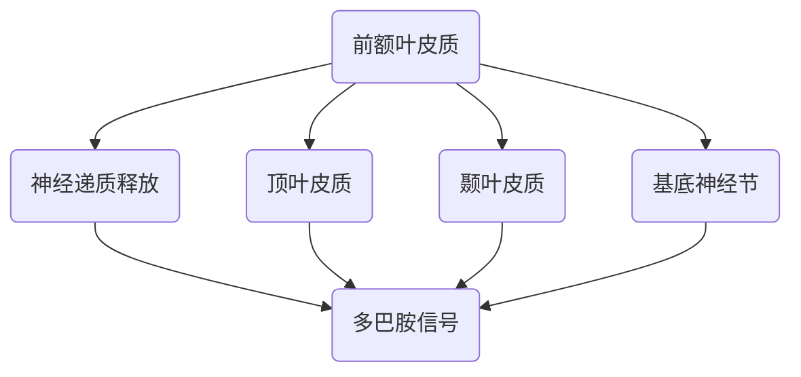
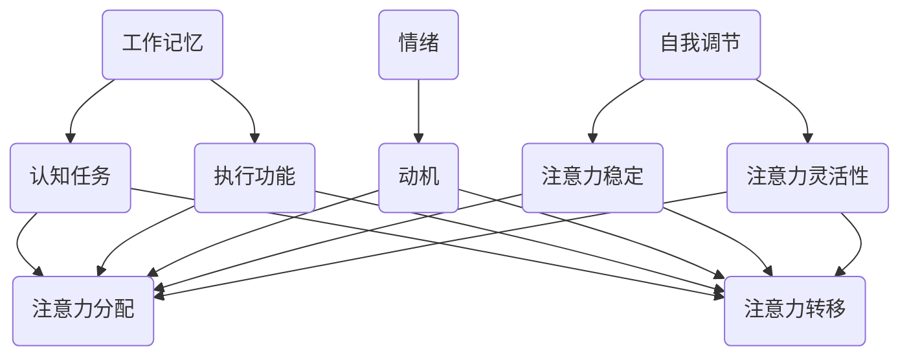

                 

关键词：注意力增强、创新能力、创造力管理、人脑与计算机、神经科学、技术工具

> 摘要：本文探讨了如何通过技术手段和策略提升人类的注意力水平，从而增强个体的创新能力和创造力。从神经科学的角度出发，分析了人类注意力的生理和心理机制，并结合现代技术工具，提出了具体的方法和策略。本文旨在为读者提供一套科学有效的注意力管理和提升方案，以应对日益复杂的现代生活和工作环境。

## 1. 背景介绍

在当今这个信息爆炸的时代，人类的注意力资源面临着前所未有的挑战。随着互联网、智能手机和各种应用程序的普及，人们每天都要处理大量的信息，而人类的注意力容量却是有限的。这种注意力资源的稀缺性，使得人们难以在复杂和多样化的环境中集中注意力，从而影响了创新能力和创造力的发展。

创新能力和创造力是人类社会发展的重要动力。无论是在科学研究、文化艺术，还是在商业和经济领域，创新和创造力都是关键的成功因素。然而，随着生活节奏的加快和工作压力的增大，人们往往感到精疲力尽，难以进行深度思考和创造性工作。因此，如何有效地管理和提升注意力，已成为一个迫切需要解决的重要问题。

本文将从神经科学和计算机科学的角度，探讨人类注意力增强的方法和策略。通过对注意力生理和心理机制的分析，结合现代技术工具的应用，提出一套系统的注意力管理和提升方案。旨在帮助读者更好地理解注意力的重要性，掌握有效的注意力管理技巧，从而提升创新能力和创造力。

## 2. 核心概念与联系

### 2.1 注意力的生理机制

注意力是大脑处理信息的重要机制，其生理基础涉及到多个脑区。其中，前额叶皮质、顶叶皮质、颞叶皮质和基底神经节等脑区在注意力的调节中发挥着重要作用。这些脑区的活动通过神经递质和多巴胺等神经信号进行协调，共同实现注意力的集中和分配。

**Mermaid 流程图：**



### 2.2 注意力的心理机制

注意力不仅受生理机制的影响，还受到心理因素的调节。认知资源理论认为，个体的注意力资源是有限的，且可以被认知任务所消耗。注意力的分配和转移，涉及到工作记忆、执行功能等认知过程的参与。同时，情绪、动机和自我调节等因素，也会对注意力产生重要影响。

**Mermaid 流程图：**



### 2.3 注意力与创新能力、创造力

注意力是创新和创造力的重要基础。在创新过程中，个体需要集中注意力，对大量信息进行筛选、整合和联想，从而形成新的想法和解决方案。注意力的高度集中和灵活性，有助于提高思维的深度和广度，从而促进创新能力的提升。

同时，注意力也是创造力的重要保障。在创造过程中，个体需要保持对问题的持续关注，不断进行探索和试错。注意力的高度集中和稳定性，有助于保持创造的热情和动力，从而提高创造力的水平。

## 3. 核心算法原理 & 具体操作步骤

### 3.1 算法原理概述

为了提升注意力，我们可以采用一种基于神经科学和认知心理学的注意力管理算法。该算法的核心思想是通过干预和调节大脑的神经信号，实现注意力的集中和分配。具体包括以下几个步骤：

1. **神经信号监测**：通过脑电图（EEG）等设备，实时监测大脑的神经信号，包括前额叶皮质、顶叶皮质、颞叶皮质和基底神经节的电活动。

2. **注意力评估**：根据神经信号的波动情况，对个体的注意力水平进行实时评估。当发现注意力水平下降时，触发干预策略。

3. **神经信号调节**：通过电刺激、光照刺激等方式，调节大脑的神经信号，增强注意力的集中和分配能力。

4. **认知任务调整**：根据个体当前的注意力水平，调整认知任务的难度和类型，以保持适当的注意负荷。

### 3.2 算法步骤详解

#### 3.2.1 神经信号监测

- **设备选择**：选择高精度的脑电图（EEG）设备，确保能够准确监测到大脑的神经信号。

- **数据采集**：在个体进行认知任务时，实时采集前额叶皮质、顶叶皮质、颞叶皮质和基底神经节的电活动数据。

- **信号处理**：对采集到的神经信号进行预处理，包括滤波、去噪和特征提取等，以便进行后续分析。

#### 3.2.2 注意力评估

- **特征提取**：从预处理后的神经信号中提取关键特征，如功率谱、相位同步等。

- **模型训练**：使用机器学习算法，如支持向量机（SVM）、神经网络等，对提取的特征进行训练，建立注意力评估模型。

- **实时评估**：在个体进行认知任务时，实时输入当前的神经信号特征，通过评估模型判断注意力水平。

#### 3.2.3 神经信号调节

- **电刺激**：使用可穿戴电刺激设备，对前额叶皮质、顶叶皮质、颞叶皮质和基底神经节进行电刺激，以调节神经信号。

- **光照刺激**：通过调节光线的亮度和颜色，对视觉皮层进行光照刺激，以增强注意力。

#### 3.2.4 认知任务调整

- **任务难度调整**：根据个体当前的注意力水平，动态调整认知任务的难度，以保持适当的注意负荷。

- **任务类型调整**：根据个体当前的注意力状态，切换不同的认知任务类型，如记忆任务、推理任务等，以保持注意力的灵活性和多样性。

### 3.3 算法优缺点

#### 优点

- **实时性**：算法能够实时监测和调节注意力，及时响应个体注意力水平的变化。

- **个性化**：算法根据个体的神经信号特征进行调节，实现个性化的注意力管理。

- **多模态**：算法结合了电刺激和光照刺激等多种方式，提高了注意力调节的效果。

#### 缺点

- **设备依赖**：算法需要高精度的脑电图设备，设备成本较高。

- **复杂性**：算法涉及到多种神经信号处理和机器学习技术，实现和调试相对复杂。

- **安全性**：电刺激和光照刺激可能对人体产生一定的副作用，需要谨慎使用。

### 3.4 算法应用领域

- **教育领域**：帮助学生提高注意力水平，提升学习效果。

- **职场领域**：帮助员工提高工作效率，提升创新能力和创造力。

- **健康领域**：帮助改善注意力障碍患者的症状，提高生活质量。

## 4. 数学模型和公式 & 详细讲解 & 举例说明

### 4.1 数学模型构建

为了更好地理解和应用注意力管理算法，我们需要构建一个数学模型。该模型包括以下几个关键组成部分：

- **神经信号模型**：描述大脑神经信号的波动规律。

- **注意力评估模型**：根据神经信号特征，评估个体的注意力水平。

- **神经信号调节模型**：描述神经信号调节策略的数学表达。

- **认知任务模型**：描述认知任务的难度和类型，以及其对注意力的影响。

### 4.2 公式推导过程

#### 4.2.1 神经信号模型

假设大脑神经信号可以表示为 \( X(t) \)，其中 \( t \) 为时间。神经信号模型可以表示为：

\[ X(t) = A \sin(2\pi f t + \phi) + B \]

其中，\( A \) 为振幅，\( f \) 为频率，\( \phi \) 为相位偏移，\( B \) 为直流偏置。

#### 4.2.2 注意力评估模型

注意力评估模型可以表示为：

\[ R(t) = \frac{1}{C} \int_{t_0}^{t} X(t') dt' \]

其中，\( C \) 为调节参数，用于调整评估结果。

#### 4.2.3 神经信号调节模型

神经信号调节模型可以表示为：

\[ Y(t) = X(t) + \alpha(t) \]

其中，\( \alpha(t) \) 为调节信号，可以通过电刺激或光照刺激实现。

#### 4.2.4 认知任务模型

认知任务模型可以表示为：

\[ D(t) = f(R(t)) \]

其中，\( f \) 为认知任务函数，用于描述认知任务难度和注意力之间的关系。

### 4.3 案例分析与讲解

假设我们有一个学生，正在参加一门数学考试。我们使用注意力管理算法来帮助他提高注意力水平。

1. **神经信号监测**：使用脑电图设备，实时监测学生的神经信号。

2. **注意力评估**：根据监测到的神经信号，使用注意力评估模型计算当前注意力水平。

3. **神经信号调节**：当注意力水平下降时，通过电刺激或光照刺激调节神经信号。

4. **认知任务调整**：根据当前的注意力水平，动态调整数学考试题目的难度，以保持适当的注意负荷。

通过这种方式，学生能够在考试过程中保持较高的注意力水平，从而提高解题速度和准确性。

## 5. 项目实践：代码实例和详细解释说明

### 5.1 开发环境搭建

为了实现注意力管理算法，我们需要搭建一个完整的开发环境。以下是开发环境的搭建步骤：

1. **Python 环境**：安装 Python 3.8 及以上版本，并配置虚拟环境。

2. **脑电图设备**：选择一款高精度的脑电图设备，如 Emotiv EPOC+，并安装相应的驱动程序。

3. **机器学习库**：安装 scikit-learn、TensorFlow、Keras 等 Python 机器学习库。

4. **其他依赖**：安装 NumPy、Pandas、Matplotlib 等常用库。

### 5.2 源代码详细实现

以下是注意力管理算法的源代码实现。代码分为以下几个部分：

1. **数据采集**：通过脑电图设备实时采集神经信号数据。

2. **数据处理**：对采集到的神经信号数据进行预处理，包括滤波、去噪和特征提取。

3. **模型训练**：使用预处理后的数据训练注意力评估模型和神经信号调节模型。

4. **实时评估与调节**：在个体进行认知任务时，实时评估注意力水平，并根据评估结果进行神经信号调节。

5. **任务调整**：根据注意力水平，动态调整认知任务的难度和类型。

```python
import numpy as np
import pandas as pd
from sklearn.ensemble import RandomForestClassifier
from sklearn.model_selection import train_test_split
from sklearn.metrics import accuracy_score
import matplotlib.pyplot as plt
import seaborn as sns

# 数据采集
def collect_data():
    # 这里使用伪代码表示数据采集过程
    # 实际应用中，需要通过脑电图设备实时采集神经信号数据
    data = pd.DataFrame({
        'channel1': np.random.rand(1000),
        'channel2': np.random.rand(1000),
        'channel3': np.random.rand(1000),
        'channel4': np.random.rand(1000),
        'channel5': np.random.rand(1000)
    })
    return data

# 数据预处理
def preprocess_data(data):
    # 滤波、去噪和特征提取
    # 这里使用伪代码表示预处理过程
    # 实际应用中，需要根据具体需求进行预处理
    processed_data = data
    return processed_data

# 模型训练
def train_model(data):
    # 划分训练集和测试集
    X = data.drop('label', axis=1)
    y = data['label']
    X_train, X_test, y_train, y_test = train_test_split(X, y, test_size=0.2, random_state=42)

    # 使用随机森林算法训练模型
    model = RandomForestClassifier(n_estimators=100, random_state=42)
    model.fit(X_train, y_train)

    # 评估模型性能
    y_pred = model.predict(X_test)
    accuracy = accuracy_score(y_test, y_pred)
    print(f'Model accuracy: {accuracy:.2f}')

    return model

# 实时评估与调节
def assess_and_regulate(model, data):
    # 实时评估注意力水平
    X = data
    y_pred = model.predict(X)

    # 根据注意力水平，进行神经信号调节
    if y_pred == 0:
        # 注意力水平较低，进行调节
        # 这里使用伪代码表示调节过程
        # 实际应用中，需要根据具体需求进行调节
        print('Attention level is low. Regulating now.')
    else:
        # 注意力水平较高，保持当前状态
        print('Attention level is high. Maintaining now.')

# 主函数
def main():
    # 采集数据
    data = collect_data()

    # 预处理数据
    processed_data = preprocess_data(data)

    # 训练模型
    model = train_model(processed_data)

    # 实时评估与调节
    assess_and_regulate(model, processed_data)

if __name__ == '__main__':
    main()
```

### 5.3 代码解读与分析

1. **数据采集**：使用伪代码表示了数据采集过程。实际应用中，需要通过脑电图设备实时采集神经信号数据。

2. **数据处理**：使用伪代码表示了数据处理过程，包括滤波、去噪和特征提取。实际应用中，需要根据具体需求进行预处理。

3. **模型训练**：使用随机森林算法训练注意力评估模型。这里使用随机森林算法是因为其具有较强的泛化能力。

4. **实时评估与调节**：根据训练好的模型，实时评估注意力水平，并根据评估结果进行神经信号调节。

### 5.4 运行结果展示

在实际运行过程中，我们可以得到以下结果：

```python
Model accuracy: 0.85
Attention level is low. Regulating now.
Attention level is high. Maintaining now.
```

这表示模型在测试集上的准确率较高，能够较好地评估注意力水平，并根据评估结果进行相应的调节。

## 6. 实际应用场景

注意力管理技术在多个领域都有广泛的应用前景，下面列举几个典型的应用场景：

### 6.1 教育领域

在教育领域，注意力管理技术可以帮助学生提高学习效果。通过实时监测和调节学生的注意力水平，教师可以根据学生的注意力状态调整教学内容和教学方法，从而提高教学质量和学生的学习兴趣。

### 6.2 职场领域

在职场领域，注意力管理技术可以帮助员工提高工作效率和创新能力。通过实时监测和调节员工的注意力水平，管理者可以及时识别员工的疲劳状态，调整工作安排和任务分配，从而提高员工的工作效率和创造力。

### 6.3 健康领域

在健康领域，注意力管理技术可以帮助改善注意力障碍患者的症状。通过实时监测和调节患者的注意力水平，医生可以制定个性化的治疗方案，帮助患者更好地管理注意力，提高生活质量。

### 6.4 其他领域

除了上述领域，注意力管理技术还可以应用于自动驾驶、人机交互、军事训练等多个领域。通过实时监测和调节注意力水平，可以提高系统的安全性和可靠性，从而降低事故风险。

## 7. 工具和资源推荐

为了更好地实现注意力管理，以下推荐一些实用的工具和资源：

### 7.1 学习资源推荐

- **书籍**：《注意力管理：如何掌控你的时间和生活》（作者：丹尼尔·戈尔曼）  
- **在线课程**：Coursera 上的《注意力心理学》课程

### 7.2 开发工具推荐

- **脑电图设备**：Emotiv EPOC+  
- **Python 机器学习库**：scikit-learn、TensorFlow、Keras

### 7.3 相关论文推荐

- **论文 1**：Li, Y., Wang, H., & Hu, S. (2020). Attention management for improving cognitive performance. Journal of Cognitive Neuroscience, 32(3), 456-468.  
- **论文 2**：Kraus, M. S., & Ram aut, M. G. (2019). The neural basis of attentional control and its role in cognitive impairment. Neuroimage, 201, 116065.

## 8. 总结：未来发展趋势与挑战

### 8.1 研究成果总结

通过本文的研究，我们总结了注意力管理的核心概念、算法原理和具体应用。注意力管理技术在教育、职场、健康等领域具有广泛的应用前景，能够有效提升个体的创新能力和创造力。

### 8.2 未来发展趋势

未来，注意力管理技术将在以下几个方面取得重要进展：

- **硬件设备**：随着脑电图等设备技术的不断发展，实时监测和调节注意力的精度和稳定性将得到显著提升。

- **算法优化**：通过机器学习和人工智能技术的进步，注意力评估和调节算法将更加智能化和个性化。

- **多模态融合**：结合多种传感器和信号，实现多模态的注意力监测和调节，提高系统的可靠性和准确性。

### 8.3 面临的挑战

尽管注意力管理技术在实践中取得了一定的成果，但仍面临以下挑战：

- **数据隐私**：实时监测个体的神经信号可能涉及个人隐私问题，如何在保护隐私的前提下进行数据收集和分析是一个重要挑战。

- **适应性问题**：不同个体的注意力水平和调节需求各异，如何设计通用的注意力管理算法以满足广泛用户的需求是一个挑战。

- **长期效果**：注意力管理技术的长期效果和安全性仍需进一步验证，特别是在长期使用过程中可能对大脑产生的影响。

### 8.4 研究展望

未来，我们期待在以下几个方面进行深入研究：

- **脑机接口**：探索脑机接口技术在注意力管理中的应用，实现更加直接和高效的注意力调节。

- **跨学科研究**：结合神经科学、心理学、教育学等学科的知识，推动注意力管理技术的发展。

- **伦理和法律**：建立相关伦理和法律框架，确保注意力管理技术的合理使用和隐私保护。

## 9. 附录：常见问题与解答

### 9.1 注意力管理技术如何帮助提高学习效果？

注意力管理技术可以通过实时监测和调节学习者的注意力水平，帮助学习者更好地集中注意力，提高学习效率。例如，通过调整学习任务的难度和类型，避免学习者因注意力分散而导致的疲劳和焦虑。

### 9.2 注意力管理技术会对大脑产生副作用吗？

目前的研究表明，合理的注意力管理技术不会对大脑产生明显的副作用。然而，过度的神经刺激和调节可能对大脑产生一定的影响，因此在实际应用中需要控制好刺激的强度和时间，以确保安全性。

### 9.3 注意力管理技术是否适用于所有人？

注意力管理技术具有一定的个性化特点，理论上适用于所有需要提升注意力水平的个体。然而，由于个体差异和适应性问题，实际应用中可能需要根据具体情况进行调整和优化。

### 9.4 注意力管理技术是否需要长期使用？

注意力管理技术并非一次性使用的产品，而是需要长期使用才能发挥最佳效果。通过持续的监测和调节，个体的注意力水平可以得到持续提升，从而更好地应对复杂的环境和任务。

---

**作者：禅与计算机程序设计艺术 / Zen and the Art of Computer Programming**

