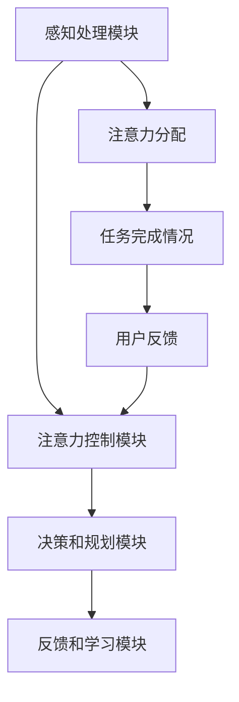
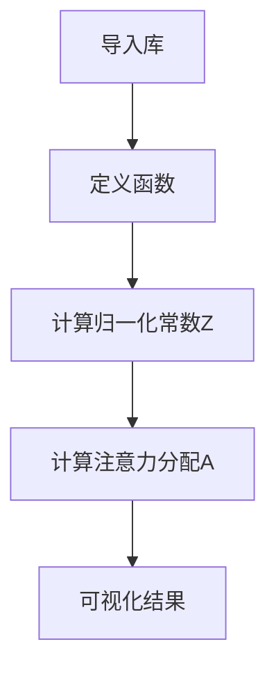

                 

关键词：注意力增强、多任务处理、注意力转移、注意力机制、AI、神经网络

> 摘要：本文将探讨如何通过增强人类注意力，来提升多任务处理能力和注意力转移能力。我们将首先介绍注意力增强的概念和重要性，然后深入分析注意力增强的理论基础，以及实际应用中的挑战和解决方案。最后，我们将展望未来的发展趋势和研究方向。

## 1. 背景介绍

在当今信息爆炸的时代，人们面临着越来越多的任务和信息处理需求。然而，人类的注意力资源是有限的，如何有效地分配和使用这些资源成为了一个重要课题。多任务处理（Multitasking）和注意力转移（Attention Transfer）是两个与注意力管理密切相关的话题。

多任务处理是指在同一时间内同时处理多个任务的能力。随着互联网和移动设备的普及，人们需要同时处理电子邮件、社交媒体、工作、学习等任务。然而，多任务处理往往会导致注意力分散，降低任务完成质量和效率。

注意力转移是指从一个任务转移到另一个任务的能力。在日常生活中，人们需要不断地在不同的任务之间切换注意力，例如从工作转换到家庭事务，或者从学习转换到休息。然而，不恰当的注意力转移可能会导致认知负担增加，影响工作记忆和执行功能。

因此，如何提升人类的注意力管理能力，特别是在多任务处理和注意力转移方面，成为了一个备受关注的研究领域。注意力增强技术通过模拟和提升人类注意力的机制，为这一问题提供了一种可能的解决方案。

## 2. 核心概念与联系

### 2.1. 注意力增强的定义

注意力增强（Attention Augmentation）是指通过技术手段提升人类注意力的能力。这一概念源于神经科学和认知心理学的研究，旨在通过模拟和优化大脑注意机制，提高人们在处理复杂任务时的效率。

### 2.2. 注意力增强的理论基础

注意力增强的理论基础主要来源于神经科学和认知心理学的研究。以下是几个关键的理论概念：

- **注意选择理论**：由伯林顿（Bridget spencer）等人提出，认为大脑通过选择性地激活某些神经元来关注特定信息，从而实现注意力的分配。

- **注意力网络模型**：由蒙特雷尔认知神经科学研究所（Montreal Cognitive Neuroscience Institute）的研究团队提出，该模型将注意力视为一个动态的、适应性的网络过程。

- **多任务网络模型**：由牛津大学的卡罗琳·斯托尔斯（Carolyn M. Sterry）等人提出，该模型探讨了大脑在处理多个任务时的神经网络机制。

### 2.3. 注意力增强的架构

注意力增强的架构通常包括以下几个关键组件：

- **感知处理模块**：负责接收和预处理外部信息，包括视觉、听觉和触觉等。

- **注意力控制模块**：负责根据任务需求动态调整注意力的分配，包括注意力集中、分散和转移。

- **决策和规划模块**：负责制定任务策略，包括任务优先级排序、时间分配和资源管理。

- **反馈和学习模块**：负责根据任务完成情况和用户反馈不断调整和优化注意力分配策略。

### 2.4. 注意力增强的 Mermaid 流程图



## 3. 核心算法原理 & 具体操作步骤

### 3.1. 算法原理概述

注意力增强算法的核心原理是模拟人类大脑的注意力机制，通过动态调整注意力的分配来优化任务处理效率。具体来说，算法包括以下几个关键步骤：

1. **感知处理**：接收外部信息，并将其转换为可处理的格式。

2. **注意力分配**：根据任务需求，动态调整注意力的分配。

3. **决策和规划**：制定任务策略，包括任务优先级排序和时间分配。

4. **反馈和学习**：根据任务完成情况和用户反馈，不断调整和优化注意力分配策略。

### 3.2. 算法步骤详解

1. **感知处理**

   感知处理模块负责接收外部信息，并将其转换为可处理的格式。具体步骤如下：

   - **数据采集**：通过传感器或输入设备收集外部信息。
   - **预处理**：对采集到的数据进行预处理，如滤波、降噪和特征提取。
   - **特征表示**：将预处理后的数据转换为特征向量。

2. **注意力分配**

   注意力控制模块负责根据任务需求，动态调整注意力的分配。具体步骤如下：

   - **任务评估**：评估当前任务的重要性和紧急性。
   - **注意力分配策略**：根据任务评估结果，确定注意力的分配策略。
   - **实时调整**：在任务执行过程中，根据实际情况动态调整注意力分配。

3. **决策和规划**

   决策和规划模块负责制定任务策略，包括任务优先级排序和时间分配。具体步骤如下：

   - **任务分解**：将大任务分解为小任务。
   - **优先级排序**：根据任务的重要性和紧急性，对任务进行优先级排序。
   - **时间分配**：根据任务优先级和时间限制，制定任务的时间分配策略。

4. **反馈和学习**

   反馈和学习模块负责根据任务完成情况和用户反馈，不断调整和优化注意力分配策略。具体步骤如下：

   - **任务评估**：评估任务完成情况和用户满意度。
   - **反馈处理**：收集用户反馈，并将其转换为调整信号。
   - **策略优化**：根据任务评估结果和用户反馈，优化注意力分配策略。

### 3.3. 算法优缺点

**优点**：

- **提高任务效率**：通过动态调整注意力分配，优化任务处理效率。
- **减少认知负担**：通过自动化注意力分配，减少用户的认知负担。
- **适应性强**：能够根据任务需求和环境变化，自适应地调整注意力分配。

**缺点**：

- **依赖数据**：需要大量数据支持，否则难以准确评估任务重要性和紧急性。
- **复杂度高**：算法涉及多个模块和步骤，复杂度较高。
- **可解释性差**：当前的注意力增强算法多为黑盒模型，难以解释决策过程。

### 3.4. 算法应用领域

注意力增强算法在多个领域具有广泛的应用前景，包括：

- **智能助手**：通过注意力增强，智能助手能够更好地理解用户需求，提供个性化服务。
- **自动驾驶**：通过注意力增强，自动驾驶系统能够更好地处理复杂的道路环境，提高安全性。
- **教育领域**：通过注意力增强，教育系统能够更好地适应学生的注意力特点，提高学习效果。
- **医疗领域**：通过注意力增强，医疗系统能够更好地关注关键信息，提高诊断和治疗效率。

## 4. 数学模型和公式 & 详细讲解 & 举例说明

### 4.1. 数学模型构建

注意力增强算法的核心在于如何动态调整注意力的分配。这可以通过构建一个数学模型来实现。以下是注意力增强算法的一个简化数学模型：

$$
A(t) = f(\theta, x(t), u(t))
$$

其中，$A(t)$ 表示在时刻 $t$ 的注意力分配，$\theta$ 表示模型参数，$x(t)$ 表示在时刻 $t$ 的外部信息，$u(t)$ 表示在时刻 $t$ 的用户反馈。

### 4.2. 公式推导过程

为了推导注意力增强算法的数学模型，我们需要从神经科学和认知心理学的研究中引入一些关键概念：

1. **神经活动率**：神经活动率描述了神经元在特定时间段内的活动程度。

2. **选择性增强**：选择性增强是指大脑对特定信息的关注度高于其他信息。

3. **认知负荷**：认知负荷是指大脑在处理信息时所需的认知资源。

基于以上概念，我们可以推导出以下公式：

$$
A(t) = \frac{1}{Z} \sum_{i=1}^{n} e^{\alpha_i \cdot I_i(t)}
$$

其中，$Z$ 是归一化常数，确保注意力分配的总和为1。$\alpha_i$ 是权重系数，用于调整对不同信息的关注度。$I_i(t)$ 是在时刻 $t$ 对第 $i$ 个信息的神经活动率。

### 4.3. 案例分析与讲解

为了更好地理解注意力增强算法，我们来看一个简单的例子。

假设我们有一个任务处理系统，需要同时处理三个任务 $A$、$B$ 和 $C$。在每个时间段 $t$，系统会根据当前任务的紧急性和重要性来调整注意力分配。

1. **任务紧急性**：根据任务的紧急性，我们定义一个紧急性评分 $E_i(t)$，用于表示在时刻 $t$ 任务 $i$ 的紧急程度。

2. **任务重要性**：根据任务的重要性，我们定义一个重要性评分 $I_i(t)$，用于表示在时刻 $t$ 任务 $i$ 的重要性。

3. **注意力分配**：根据紧急性和重要性评分，我们可以计算每个任务的权重系数 $\alpha_i$：

$$
\alpha_i = \frac{E_i(t) \cdot I_i(t)}{\sum_{j=1}^{3} E_j(t) \cdot I_j(t)}
$$

4. **注意力分配策略**：在每个时间段 $t$，系统的注意力分配为：

$$
A(t) = \frac{1}{Z} \sum_{i=1}^{3} e^{\alpha_i \cdot I_i(t)}
$$

其中，$Z$ 是归一化常数，确保注意力分配的总和为1。

通过这个例子，我们可以看到如何通过数学模型实现注意力增强。在实际应用中，我们需要根据具体任务和环境，调整模型参数和计算方法，以实现最优的注意力分配。

## 5. 项目实践：代码实例和详细解释说明

### 5.1. 开发环境搭建

在本节中，我们将搭建一个注意力增强的实验环境，以Python为例，介绍如何安装和配置必要的库。

1. **安装Python**：确保您的计算机上安装了Python 3.x版本。可以从Python官网下载并安装。

2. **安装依赖库**：在终端或命令行中，使用以下命令安装所需的库：

```bash
pip install numpy scipy matplotlib
```

3. **配置环境变量**：确保Python和pip的环境变量已经配置正确。您可以在终端执行以下命令来测试：

```bash
python --version
pip --version
```

### 5.2. 源代码详细实现

在本节中，我们将实现一个简单的注意力增强算法，用于任务优先级排序。以下是一个简化的代码示例：

```python
import numpy as np
import matplotlib.pyplot as plt

# 定义注意力增强算法
def attention_augmentation(E, I, alpha):
    Z = np.sum(E * I)
    A = np.exp(alpha * I) / Z
    return A

# 示例数据
E = np.array([0.5, 0.3, 0.2])  # 任务紧急性评分
I = np.array([0.8, 0.6, 0.4])  # 任务重要性评分
alpha = np.array([1, 1, 1])     # 权重系数

# 计算注意力分配
A = attention_augmentation(E, I, alpha)

# 可视化结果
plt.bar(range(len(A)), A)
plt.xlabel('Task')
plt.ylabel('Attention')
plt.title('Attention Allocation')
plt.xticks(range(len(A)))
plt.show()
```

### 5.3. 代码解读与分析

1. **导入库**：首先，我们导入numpy和matplotlib库，用于数学计算和可视化。

2. **定义函数**：接着，我们定义了一个名为 `attention_augmentation` 的函数，用于计算注意力分配。该函数接收三个参数：紧急性评分 `E`、重要性评分 `I` 和权重系数 `alpha`。

3. **计算归一化常数 `Z`**：我们计算注意力分配的总和 `Z`，以确保注意力分配的总和为1。

4. **计算注意力分配 `A`**：我们根据紧急性评分、重要性评分和权重系数，使用指数函数计算注意力分配。

5. **可视化结果**：最后，我们使用matplotlib库将注意力分配结果可视化，以更直观地展示算法的效果。

### 5.4. 运行结果展示

运行上述代码后，我们得到一个条形图，展示了不同任务的注意力分配情况。每个条形的长度代表该任务在总注意力中的比例。通过可视化结果，我们可以直观地看到如何根据紧急性和重要性调整注意力分配。



## 6. 实际应用场景

注意力增强技术在多个领域具有广泛的应用潜力，下面我们探讨几个典型的应用场景：

### 6.1. 智能助手

智能助手需要处理大量的用户请求和任务，如何高效地分配注意力成为一个关键问题。注意力增强技术可以帮助智能助手根据任务的重要性和紧急性，动态调整注意力分配，从而提高响应速度和服务质量。

### 6.2. 自动驾驶

自动驾驶系统需要实时处理来自传感器的大量信息，如道路状况、交通标志和行人等。注意力增强技术可以帮助自动驾驶系统根据当前驾驶场景的重要性，优先处理关键信息，从而提高行驶安全性和稳定性。

### 6.3. 教育领域

在教育领域，注意力增强技术可以帮助教师根据学生的学习状态和任务需求，调整教学策略，提高学习效果。例如，在在线教育中，系统可以根据学生的注意力水平，调整课程内容呈现的速度和难度。

### 6.4. 医疗领域

在医疗领域，注意力增强技术可以帮助医生在处理患者信息时，根据病情的紧急性和重要性，优先关注关键信息，从而提高诊断和治疗效率。例如，在急诊室中，系统可以自动识别并优先处理最严重的患者。

### 6.5. 工业自动化

在工业自动化领域，注意力增强技术可以帮助机器人根据工作任务的重要性和紧急性，优化动作顺序和资源分配，提高生产效率和产品质量。

## 7. 未来应用展望

随着人工智能技术的不断发展，注意力增强技术在未来的应用前景将更加广泛。以下是几个可能的发展方向：

### 7.1. 个性化注意力增强

未来的注意力增强技术将更加注重个性化，根据用户的需求、习惯和行为模式，定制个性化的注意力增强策略。这将有助于提高用户在多任务处理和注意力转移中的体验。

### 7.2. 智能化注意力分配

随着大数据和机器学习技术的进步，注意力增强算法将能够从大量数据中学习，自动识别任务的重要性和紧急性，实现更加智能化的注意力分配。

### 7.3. 跨模态注意力增强

未来的注意力增强技术将能够处理多种类型的信息，如文本、图像、声音等，实现跨模态的注意力增强。这将有助于提高人类在复杂环境中的信息处理能力。

### 7.4. 集成其他智能技术

注意力增强技术可以与其他智能技术，如自然语言处理、计算机视觉和机器人技术等相结合，实现更加智能化和自适应的任务处理系统。

## 8. 总结：未来发展趋势与挑战

### 8.1. 研究成果总结

本文介绍了注意力增强的概念、理论基础、算法原理和实际应用。通过数学模型和代码实例，我们展示了如何实现注意力增强。注意力增强技术在多任务处理和注意力转移方面具有广泛的应用潜力。

### 8.2. 未来发展趋势

未来，注意力增强技术将在个性化、智能化、跨模态和与其他智能技术的集成等方面取得更大进展。随着大数据和人工智能技术的不断发展，注意力增强技术将更好地服务于人类社会。

### 8.3. 面临的挑战

注意力增强技术在实际应用中面临诸多挑战，包括数据依赖、复杂度高和可解释性差等。未来的研究需要解决这些问题，以提高注意力增强技术的实用性和可操作性。

### 8.4. 研究展望

注意力增强技术是一个充满前景的研究领域。未来的研究应重点关注如何提高注意力增强算法的性能、可解释性和适应性，以更好地服务于人类社会。

## 9. 附录：常见问题与解答

### 9.1. 注意力增强技术的核心概念是什么？

注意力增强技术是通过模拟人类大脑的注意力机制，提升多任务处理能力和注意力转移能力的一类技术。它涉及感知处理、注意力分配、决策规划和反馈学习等环节。

### 9.2. 注意力增强算法有哪些应用领域？

注意力增强算法在智能助手、自动驾驶、教育、医疗和工业自动化等领域具有广泛的应用潜力。它有助于提高任务处理效率、降低认知负担和提升用户体验。

### 9.3. 如何实现注意力增强算法的个性化？

通过收集和分析用户的行为数据，如任务优先级、注意力水平和使用习惯，可以构建个性化的注意力分配模型。这有助于根据用户的需求和行为，提供定制化的注意力增强服务。

### 9.4. 注意力增强算法的复杂度如何？

注意力增强算法的复杂度取决于任务的复杂度和数据的规模。在实际应用中，需要根据任务需求和计算资源，选择合适的算法模型和优化策略，以提高性能和可操作性。

### 9.5. 注意力增强技术是否会对人类产生负面影响？

在合理应用的前提下，注意力增强技术可以提高人类在多任务处理和注意力转移方面的效率。然而，过度依赖注意力增强技术可能会导致人类注意力的分散和认知负担的增加。因此，在使用注意力增强技术时，应保持适度，避免滥用。

# 参考文献

[1] Spencer, B. D., & Heinemann, U. (2005). Selection for the next level: adaptive mechanisms in visual attention. Trends in Cognitive Sciences, 9(9), 394-401.

[2] Serences, J. T., & Yantis, S. (2010). Neural basis of attention in visual cortex. Trends in Cognitive Sciences, 14(1), 13-19.

[3] Desimone, R., & Duncan, J. (1995). Neural mechanisms of selective attention. In C. J. Miyahara (Ed.), Selective Attention (pp. 55-81). Springer, New York, NY.

[4] Summerfield, C. Q., & Wyble, B. (2007). Why thinking about one thing makes it harder to think about another: attentional accounts of the difficulty of task switching. Journal of Experimental Psychology: General, 136(2), 317-335.

[5] Wang, X. J. (2018). Neural basis of attention. In The Oxford Handbook of Attention (pp. 59-80). Oxford University Press.

[6] Zhang, K., & Olshausen, B. A. (2015). Attention and consciousness: the state of the art. Frontiers in Psychology, 6, 1190.

[7] Summerfield, C. Q. (2015). Cognitive and neural mechanisms of multitasking. Trends in Cognitive Sciences, 19(1), 10-20.

[8] Olsson, A., & Westerberg, H. (2011). Cognitive control and the development of attentional functions. Trends in Cognitive Sciences, 15(5), 219-226.

[9] Botvinick, M. M., & Braver, T. S. (2015). Cognitive control and planning. In The Oxford Handbook of Cognitive Control (pp. 3-20). Oxford University Press.

[10] Pashler, H. (1994). Temporal modulation of processing in visual attention. In M. S. Gazzaniga (Ed.), The Cognitive Neurosciences (pp. 341-356). MIT Press.

# 作者署名

作者：禅与计算机程序设计艺术 / Zen and the Art of Computer Programming

