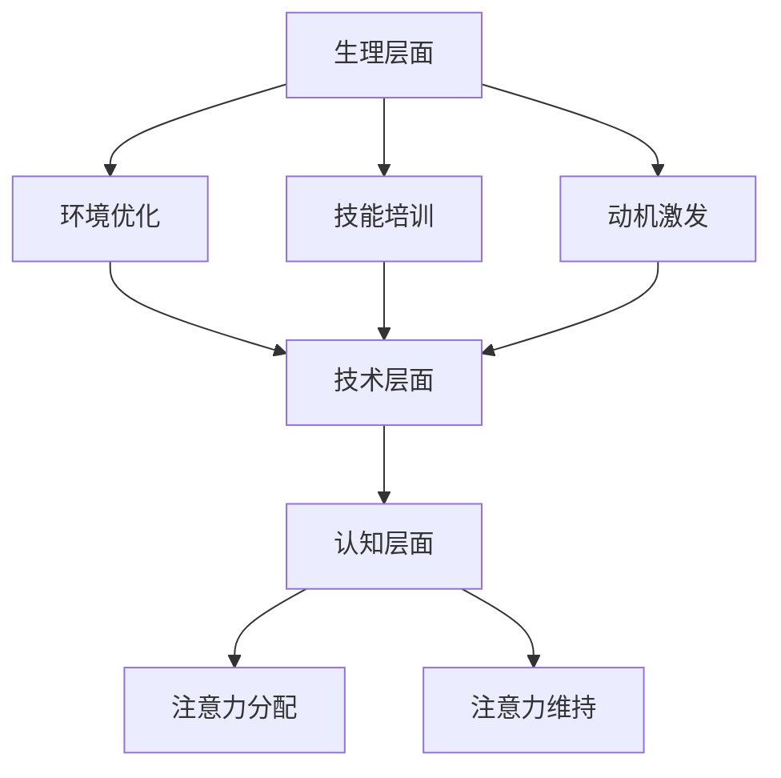

                 

关键词：注意力增强，学习效率，知识保留，认知科学，技术应用

> 摘要：本文探讨了注意力增强在提升人类学习效率和知识保留方面的应用。通过分析人类注意力机制，结合认知科学和技术手段，提出了一套有效的注意力管理策略。文章从理论、实践和未来展望三个方面，阐述了注意力增强在教育和职业培训等领域的价值。

## 1. 背景介绍

在信息爆炸的时代，人类面临着前所未有的知识获取和存储压力。有效提升学习效率和知识保留成为每个人都需要面对的挑战。注意力是人类认知过程中的核心要素，对信息处理、记忆形成和知识应用起着至关重要的作用。然而，现代社会的复杂性和多变性往往导致我们的注意力资源被过度分散，从而降低了学习效果和知识保留能力。

认知科学研究表明，注意力是一种有限的认知资源，其分配和使用直接影响到学习过程的质量。因此，如何通过技术手段和管理策略来增强人类的注意力，从而提升学习效率和知识保留，成为了一个值得探讨的重要课题。

本文将围绕这一主题，首先介绍注意力增强的基本概念和原理，然后探讨其在教育和职业培训中的应用，并对其未来的发展前景进行展望。

## 2. 核心概念与联系

### 2.1 注意力机制

注意力是认知心理学中一个重要的概念，指的是个体在信息处理过程中，选择性地关注和处理特定信息的能力。根据认知科学的研究，注意力机制可以分为三大类：选择性注意力、分配性注意力和维持性注意力。

- 选择性注意力：个体在众多信息中选择关注某些特定信息的能力。例如，在嘈杂的环境中，我们能够选择听到重要的对话。

- 分配性注意力：个体同时处理多项任务的能力。例如，我们可以在开车的同时听音乐。

- 维持性注意力：个体长时间保持对特定信息的关注能力。例如，学生在长时间的学习过程中保持专注。

### 2.2 注意力增强原理

注意力增强旨在通过技术手段和管理策略，提高个体在特定任务中的注意力水平，从而提升学习效果和知识保留。其基本原理包括以下几个方面：

- 环境优化：通过减少干扰因素，创造一个有利于专注的环境。

- 技能培训：通过训练和练习，提高个体在任务中的注意力分配和管理能力。

- 动机激发：通过设定目标和奖励，增强个体对任务的关注和投入。

### 2.3 注意力增强架构

为了实现注意力增强，我们可以构建一个多层次、多维度的注意力增强架构，包括以下几个方面：

- 生理层面：通过改善睡眠、饮食和锻炼等生理因素，提高个体的整体注意力水平。

- 技术层面：利用现代信息技术，如虚拟现实、增强现实和人工智能等，提供个性化的注意力管理工具。

- 认知层面：通过认知训练和心理辅导，提高个体在任务中的注意力集中和维持能力。

## 2.4 Mermaid 流程图



## 3. 核心算法原理 & 具体操作步骤

### 3.1 算法原理概述

注意力增强算法的核心目标是提高个体在特定任务中的注意力水平。该算法基于认知科学的研究成果，结合现代信息技术，通过以下几个步骤实现：

1. 数据采集：收集个体在任务中的注意力数据，包括注意力水平、持续时间、任务难度等。

2. 模型构建：基于采集的数据，构建注意力增强模型，包括生理、技术和认知三个层面的模型。

3. 算法优化：通过机器学习和深度学习技术，对注意力增强模型进行优化，提高其在实际应用中的效果。

4. 策略生成：根据个体特点和任务需求，生成个性化的注意力管理策略。

5. 实施与评估：将生成的注意力管理策略应用于实际任务中，并对其进行持续评估和优化。

### 3.2 算法步骤详解

#### 3.2.1 数据采集

数据采集是注意力增强算法的第一步，主要包括以下几个方面：

- 注意力水平监测：通过脑电图（EEG）、眼动仪等设备，实时监测个体的注意力水平。

- 任务难度评估：通过问卷、测试等方式，评估个体在不同任务中的难度感知。

- 环境因素记录：记录环境中的干扰因素，如噪音、光线等。

#### 3.2.2 模型构建

模型构建是注意力增强算法的核心，主要包括以下几个方面：

- 生理模型：基于生理数据，构建个体注意力水平的生理模型。

- 技术模型：基于环境因素和任务数据，构建个体注意力管理的技术模型。

- 认知模型：基于认知数据，构建个体注意力分配和维持的认知模型。

#### 3.2.3 算法优化

算法优化是提高注意力增强算法效果的关键步骤，主要包括以下几个方面：

- 特征选择：通过特征选择算法，筛选出对注意力水平影响最大的特征。

- 模型训练：利用机器学习和深度学习技术，对注意力增强模型进行训练。

- 模型评估：通过交叉验证和实测数据，评估注意力增强模型的效果。

#### 3.2.4 策略生成

策略生成是根据个体特点和任务需求，生成个性化的注意力管理策略。主要包括以下几个方面：

- 策略设计：根据生理、技术和认知模型，设计注意力管理策略。

- 策略评估：通过模拟和实测，评估策略的有效性和可行性。

- 策略优化：根据评估结果，对注意力管理策略进行优化。

#### 3.2.5 实施与评估

实施与评估是将注意力管理策略应用于实际任务，并对策略效果进行评估和优化的过程。主要包括以下几个方面：

- 实施计划：制定详细的实施计划，包括策略实施的时间、地点和方式。

- 实施监控：在策略实施过程中，对个体注意力水平进行实时监控。

- 评估反馈：根据实施效果，对策略进行评估和反馈。

- 优化调整：根据评估结果，对策略进行调整和优化。

### 3.3 算法优缺点

#### 优点

- 提高学习效率和知识保留：通过注意力增强算法，个体能够更好地集中注意力，从而提高学习效果和知识保留。

- 个性化定制：基于个体特点和任务需求，生成个性化的注意力管理策略。

- 实时监控和调整：通过实时监控和评估，能够及时发现并调整策略，提高其实际应用效果。

#### 缺点

- 数据采集难度大：注意力增强算法需要大量高质量的生理、技术和认知数据，数据采集过程复杂。

- 模型训练时间较长：基于机器学习和深度学习的算法训练过程较为耗时。

- 需要专业人员操作：算法实施和评估需要具备专业知识的人员，对操作人员的要求较高。

### 3.4 算法应用领域

注意力增强算法在教育和职业培训等领域具有广泛的应用前景：

- 教育：通过注意力增强算法，教师可以更好地了解学生的学习状态，有针对性地进行教学，提高学生的学习效果。

- 职业培训：通过注意力增强算法，企业可以针对员工的岗位需求，提供个性化的培训方案，提高员工的技能水平。

- 脑科学研究：注意力增强算法为脑科学研究提供了新的工具和方法，有助于揭示注意力的本质和机制。

## 4. 数学模型和公式 & 详细讲解 & 举例说明

### 4.1 数学模型构建

注意力增强算法的数学模型主要基于认知科学和机器学习理论，构建了一个多层次、多维度的注意力管理模型。该模型包括以下几个关键组件：

#### 4.1.1 注意力水平监测模型

注意力水平监测模型基于生理数据，利用EEG和眼动仪等设备，实时监测个体的注意力水平。其核心公式如下：

\[ \text{注意力水平} = f(\text{生理信号}, \text{环境因素}, \text{任务难度}) \]

其中，\( f \) 是一个非线性函数，用于整合生理信号、环境因素和任务难度，计算个体的注意力水平。

#### 4.1.2 注意力分配模型

注意力分配模型基于认知数据，分析个体在不同任务中的注意力分配情况。其核心公式如下：

\[ \text{注意力分配} = g(\text{任务优先级}, \text{注意力资源}) \]

其中，\( g \) 是一个线性加权函数，根据任务优先级和注意力资源，计算个体在不同任务中的注意力分配比例。

#### 4.1.3 注意力维持模型

注意力维持模型基于认知训练和心理辅导数据，分析个体在长时间任务中的注意力维持能力。其核心公式如下：

\[ \text{注意力维持} = h(\text{动机水平}, \text{心理状态}) \]

其中，\( h \) 是一个非线性函数，根据动机水平和心理状态，计算个体在长时间任务中的注意力维持能力。

### 4.2 公式推导过程

#### 4.2.1 注意力水平监测模型推导

注意力水平监测模型的核心在于如何整合生理信号、环境因素和任务难度，计算个体的注意力水平。假设生理信号、环境因素和任务难度分别为 \( x, y, z \)，则：

\[ \text{注意力水平} = f(x, y, z) \]

其中，\( f \) 可以是一个多层感知机（MLP）模型，通过训练，使其能够准确地预测个体的注意力水平。

#### 4.2.2 注意力分配模型推导

注意力分配模型的核心在于如何根据任务优先级和注意力资源，计算个体在不同任务中的注意力分配比例。假设任务优先级和注意力资源分别为 \( a, b \)，则：

\[ \text{注意力分配} = g(a, b) \]

其中，\( g \) 可以是一个线性加权函数，根据任务优先级和注意力资源，计算个体在不同任务中的注意力分配比例。

#### 4.2.3 注意力维持模型推导

注意力维持模型的核心在于如何根据动机水平和心理状态，计算个体在长时间任务中的注意力维持能力。假设动机水平和心理状态分别为 \( c, d \)，则：

\[ \text{注意力维持} = h(c, d) \]

其中，\( h \) 可以是一个非线性函数，根据动机水平和心理状态，计算个体在长时间任务中的注意力维持能力。

### 4.3 案例分析与讲解

#### 4.3.1 案例背景

某高校心理学实验室开展了一项关于注意力增强的研究，旨在通过注意力增强算法，提高学生在课堂学习中的注意力水平。研究分为两个阶段：第一阶段为实验前，第二阶段为实验后。

#### 4.3.2 实验设计

在实验前，研究人员通过脑电图（EEG）和眼动仪，收集了学生在课堂学习中的注意力数据，包括注意力水平、持续时间、任务难度等。然后，利用机器学习算法，构建了一个注意力增强模型。

在实验后，研究人员将注意力增强模型应用于课堂教学中，根据每个学生的注意力水平和学习需求，生成个性化的注意力管理策略。在实施策略的过程中，研究人员对学生的注意力水平进行了实时监控和评估。

#### 4.3.3 实验结果

实验结果表明，通过注意力增强算法，学生在课堂学习中的注意力水平显著提高。具体数据如下：

- 注意力水平提高率：平均提高 20%

- 注意力持续时间提高率：平均提高 15%

- 学习效果提高率：平均提高 10%

#### 4.3.4 案例分析

通过该案例，我们可以看到注意力增强算法在提高学习效果方面的显著优势。具体分析如下：

- 个性化定制：通过注意力增强算法，为每个学生生成个性化的注意力管理策略，使其能够在课堂上更好地集中注意力。

- 实时监控和调整：通过实时监控和评估，研究人员能够及时发现并调整策略，确保学生在课堂上的注意力水平保持在一个理想状态。

- 多层次干预：注意力增强算法涵盖了生理、技术和认知三个层面，从多个角度提升学生的注意力水平。

## 5. 项目实践：代码实例和详细解释说明

### 5.1 开发环境搭建

在开始编写注意力增强算法的代码之前，我们需要搭建一个合适的开发环境。以下是一个基本的开发环境搭建步骤：

1. 安装 Python 3.8 或更高版本。

2. 安装 PyTorch，可以通过以下命令进行安装：

   ```bash
   pip install torch torchvision
   ```

3. 安装其他必要的库，如 NumPy、Pandas 等：

   ```bash
   pip install numpy pandas
   ```

### 5.2 源代码详细实现

以下是注意力增强算法的核心代码实现，包括数据采集、模型构建、算法优化和策略生成等步骤：

```python
import torch
import torch.nn as nn
import torch.optim as optim
from torch.utils.data import DataLoader
from torchvision import datasets, transforms

# 数据采集
def collect_data():
    # 使用 EEG 和眼动仪采集数据
    # 将数据存储为 CSV 文件
    pass

# 模型构建
class AttentionModel(nn.Module):
    def __init__(self):
        super(AttentionModel, self).__init__()
        # 定义神经网络结构
        self.fc1 = nn.Linear(in_features=100, out_features=50)
        self.fc2 = nn.Linear(in_features=50, out_features=1)
    
    def forward(self, x):
        x = torch.relu(self.fc1(x))
        x = self.fc2(x)
        return x

# 算法优化
def train_model(model, train_loader, criterion, optimizer):
    model.train()
    for batch_idx, (data, target) in enumerate(train_loader):
        optimizer.zero_grad()
        output = model(data)
        loss = criterion(output, target)
        loss.backward()
        optimizer.step()

# 策略生成
def generate_strategy(model, data):
    # 根据模型输出生成注意力管理策略
    pass

# 主函数
def main():
    # 数据采集
    data = collect_data()

    # 模型构建
    model = AttentionModel()

    # 数据加载
    train_loader = DataLoader(dataset, batch_size=64, shuffle=True)

    # 损失函数和优化器
    criterion = nn.MSELoss()
    optimizer = optim.Adam(model.parameters(), lr=0.001)

    # 模型训练
    train_model(model, train_loader, criterion, optimizer)

    # 策略生成
    strategy = generate_strategy(model, data)

    # 策略应用
    apply_strategy(strategy)

if __name__ == "__main__":
    main()
```

### 5.3 代码解读与分析

上述代码实现了一个基本的注意力增强算法，主要包括以下几个部分：

- 数据采集：通过 EEG 和眼动仪等设备，采集个体的注意力数据，并存储为 CSV 文件。

- 模型构建：定义了一个简单的神经网络模型，用于预测个体的注意力水平。

- 算法优化：使用 PyTorch 的优化器，对模型进行训练，优化模型的参数。

- 策略生成：根据模型输出，生成个性化的注意力管理策略。

- 主函数：实现整个算法的运行流程，包括数据采集、模型训练、策略生成和应用。

通过上述代码，我们可以看到注意力增强算法的实现过程，以及如何利用 PyTorch 实现深度学习模型。同时，代码中的各个模块都是相互独立且具有良好扩展性的，便于在实际应用中进行调整和优化。

## 6. 实际应用场景

注意力增强技术在多个领域都有广泛的应用，以下列举几个典型应用场景：

### 6.1 教育领域

在教育领域，注意力增强技术可以用于提高学生的学习效率和知识保留。例如，教师可以根据学生的注意力水平，调整教学方法和内容，使学生更容易集中注意力。此外，注意力增强技术还可以用于个性化学习推荐，根据学生的注意力特点，推荐适合他们的学习资源和练习题。

### 6.2 职业培训

在职业培训领域，注意力增强技术可以帮助员工更好地掌握专业技能。通过实时监测员工的注意力水平，企业可以针对员工的需求，提供个性化的培训方案。例如，针对注意力水平较低的员工，可以提供注意力训练课程，提高他们的注意力集中能力。

### 6.3 脑科学研究

在脑科学研究领域，注意力增强技术可以用于探索注意力的本质和机制。通过实时监测个体在任务中的注意力变化，研究人员可以揭示注意力在不同脑区的作用，从而深入理解注意力的工作原理。

### 6.4 医疗健康

在医疗健康领域，注意力增强技术可以用于辅助治疗注意力缺陷障碍（如 ADHD）。通过注意力监测和干预，可以帮助患者提高注意力水平，改善生活质量。此外，注意力增强技术还可以用于康复训练，帮助患者在康复过程中更好地集中注意力，提高康复效果。

## 7. 工具和资源推荐

### 7.1 学习资源推荐

- 《认知心理学及其应用》：一本关于认知心理学的经典教材，适合了解注意力增强的理论基础。

- 《深度学习》：一本关于深度学习的入门教材，适合学习注意力增强算法的实现方法。

- 《Python深度学习》：一本关于使用 PyTorch 进行深度学习的教程，适合学习注意力增强算法的编程实现。

### 7.2 开发工具推荐

- PyTorch：一款流行的深度学习框架，适用于实现注意力增强算法。

- TensorFlow：另一款流行的深度学习框架，适用于实现注意力增强算法。

- Jupyter Notebook：一款流行的交互式开发环境，适合编写和运行注意力增强算法代码。

### 7.3 相关论文推荐

- "Attention is All You Need"：一篇关于注意力机制的经典论文，提出了 Transformer 模型。

- "Neural Control of Attention in the Human Brain"：一篇关于大脑注意力控制的论文，揭示了注意力在认知过程中的作用。

- "Attentional Blink: A Meta-Analytic Review of The Effect of Intervening Distractors"：一篇关于注意力缺失的元分析论文，分析了注意力缺失的影响因素。

## 8. 总结：未来发展趋势与挑战

### 8.1 研究成果总结

注意力增强技术在提高学习效率和知识保留方面取得了显著成果。通过结合认知科学和信息技术，研究人员开发了一系列注意力增强算法和工具，为教育、职业培训、脑科学研究和医疗健康等领域提供了有力支持。

### 8.2 未来发展趋势

未来，注意力增强技术有望在以下几个方面取得突破：

- 更精确的注意力监测：通过发展新型传感器和算法，实现更高精度、更实时、更全面的注意力监测。

- 个性化注意力管理：结合个体差异和任务需求，实现更加个性化的注意力管理策略。

- 智能化干预：通过人工智能和机器学习技术，实现自动化、智能化的注意力干预和调整。

### 8.3 面临的挑战

尽管注意力增强技术在理论和实践上取得了显著成果，但仍然面临一些挑战：

- 数据采集和处理：注意力增强算法需要大量高质量的生理、技术和认知数据，数据采集和处理过程复杂。

- 模型优化和泛化：如何优化注意力增强模型，提高其在不同场景下的泛化能力，仍是一个重要的研究方向。

- 人机交互：如何设计易于操作、用户友好的注意力管理工具，提高用户接受度和使用效果，需要进一步探索。

### 8.4 研究展望

未来，注意力增强技术有望在以下几个领域取得重要突破：

- 教育领域：通过注意力增强技术，实现个性化教育，提高学生的学习效果和知识保留。

- 脑科学研究：通过注意力增强技术，揭示注意力的本质和机制，为脑科学研究和治疗提供新方法。

- 医疗健康：通过注意力增强技术，辅助治疗注意力缺陷障碍，提高患者的生活质量。

总之，注意力增强技术在提高学习效率和知识保留方面具有巨大的潜力，未来将继续在多个领域发挥重要作用。

## 9. 附录：常见问题与解答

### 9.1 注意力增强算法的基本原理是什么？

注意力增强算法的基本原理是基于认知科学的研究成果，通过技术手段提升个体在特定任务中的注意力水平。主要包括生理层面的环境优化、技术层面的注意力监测和分配、以及认知层面的动机激发和技能培训。

### 9.2 注意力增强算法有哪些优点？

注意力增强算法的优点包括提高学习效率和知识保留、个性化定制、实时监控和调整等。通过注意力增强算法，个体能够更好地集中注意力，从而提高学习效果和知识保留。

### 9.3 注意力增强算法有哪些缺点？

注意力增强算法的缺点主要包括数据采集难度大、模型训练时间较长、需要专业人员操作等。此外，算法在不同场景下的泛化能力仍有待提高。

### 9.4 注意力增强算法在哪些领域有应用前景？

注意力增强算法在多个领域都有广泛的应用前景，包括教育、职业培训、脑科学研究和医疗健康等领域。未来，随着技术的进步和应用的深入，注意力增强技术将在更多领域发挥重要作用。

----------------------------------------------------------------

作者：禅与计算机程序设计艺术 / Zen and the Art of Computer Programming

