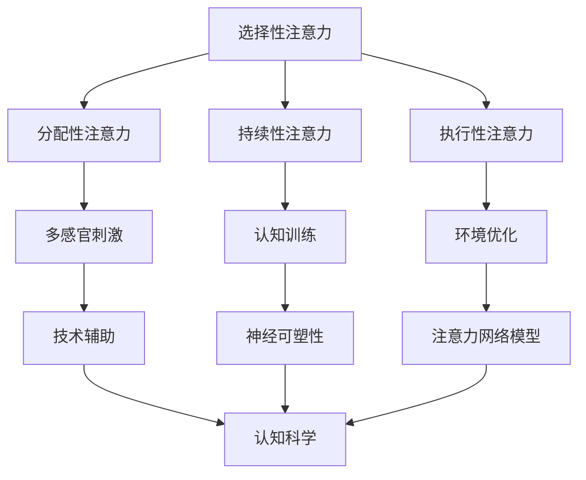

                 

关键词：注意力增强，注意力管理，认知科学，生产力，技术工具

> 摘要：本文将探讨人类注意力增强的方法和策略，结合认知科学和前沿技术，旨在提高个体的注意力持续时间和工作效率。通过阐述核心概念、算法原理、数学模型以及实际应用案例，本文为读者提供了一套系统化的注意力管理方案，助力个体在日益复杂的信息环境中保持专注，提升生产力。

## 1. 背景介绍

在当今快节奏、信息爆炸的时代，人类面临着前所未有的注意力挑战。研究表明，人们的平均注意力持续时间已从20世纪初的约12分钟缩短至当今的约3分钟。这种“分心时代”不仅影响了个人生活的质量，也对工作和学习产生了深远的影响。因此，如何有效增强注意力，提高个体在工作、学习和日常生活中的效率，已成为一个重要且迫切的问题。

注意力增强不仅关乎个体福祉，还与组织生产力密切相关。研究表明，提升员工的注意力持续时间能够显著提高工作效率和创新能力，从而为企业带来显著的收益。因此，企业和组织越来越重视注意力管理技术的研究和应用。

本文旨在通过结合认知科学和技术手段，为读者提供一套全面且实用的注意力增强策略。本文将首先介绍注意力增强的核心概念和原理，然后深入探讨具体的方法和工具，并通过实际案例展示其应用效果。最后，本文将展望注意力增强技术的未来发展趋势和潜在挑战。

## 2. 核心概念与联系

### 2.1 注意力的定义与分类

注意力是大脑处理信息时的一种选择性机制，它使我们能够关注某些特定的刺激，同时忽略其他无关的刺激。根据其功能，注意力可分为以下几种类型：

1. **选择性注意力**：在众多信息中，选择性地关注特定信息。
2. **分配性注意力**：在同一时间内，关注多个不同任务或刺激。
3. **持续性注意力**：长时间维持对特定任务的关注。
4. **执行性注意力**：主动调控和维持注意力，克服干扰。

### 2.2 注意力管理的重要性

注意力管理是提高工作效率和生产力的重要手段。有效的注意力管理可以帮助个体：

1. 提高任务完成速度和质量。
2. 减少错误率和重做次数。
3. 增强创造力和创新能力。
4. 提高学习效果和知识吸收能力。

### 2.3 注意力增强的技术手段

注意力增强技术主要基于以下几个原理：

1. **多感官刺激**：通过视觉、听觉、触觉等多种感官刺激，提高信息处理的效率。
2. **认知训练**：通过特定的训练方法，增强大脑处理信息的能力。
3. **环境优化**：通过减少干扰因素，创造有利于专注的工作和学习环境。
4. **技术辅助**：利用各种技术工具，如注意力追踪设备、应用程序等，帮助个体更好地管理注意力。

### 2.4 注意力增强与认知科学的关系

认知科学提供了对注意力机制深入的理解，这些理解帮助我们设计出更有效的注意力增强方法。例如，神经可塑性理论解释了通过认知训练可以改变大脑结构和功能的可能性，而注意力网络模型则为开发注意力管理技术提供了理论基础。

## 2.5 Mermaid 流程图

以下是注意力增强的流程图，展示了核心概念和原理之间的联系。



## 3. 核心算法原理 & 具体操作步骤

### 3.1 算法原理概述

注意力增强的核心算法基于认知科学和神经科学的研究成果，旨在通过多种方法提高个体的注意力持续时间和工作效率。主要原理包括：

1. **多感官刺激**：通过整合视觉、听觉、触觉等多种感官信息，提高大脑处理信息的能力。
2. **认知训练**：通过特定的训练任务，增强大脑的注意力和认知功能。
3. **环境优化**：通过调整工作环境，减少干扰因素，提高专注度。
4. **技术辅助**：利用各种技术工具，如注意力追踪设备、应用程序等，帮助个体更好地管理注意力。

### 3.2 算法步骤详解

#### 3.2.1 多感官刺激

1. **视觉刺激**：通过改变视觉刺激的强度、颜色和频率，吸引注意力。
2. **听觉刺激**：利用声音和音乐来提高注意力和专注度。
3. **触觉刺激**：通过特定的触觉反馈，如振动、压力等，增强注意力。

#### 3.2.2 认知训练

1. **注意力训练任务**：设计特定的注意力训练任务，如注意力聚焦任务、注意力切换任务等，增强大脑的注意力处理能力。
2. **认知负荷调节**：根据个体的注意力水平，动态调整任务的难度，以保持适当的挑战性。

#### 3.2.3 环境优化

1. **减少干扰因素**：通过关闭不必要的通知、创造安静的工作环境等方法，减少外部干扰。
2. **优化工作流程**：通过优化任务安排和工作流程，减少重复性和低效的任务，提高工作效率。

#### 3.2.4 技术辅助

1. **注意力追踪设备**：使用眼动仪、脑电图等设备，实时监测个体的注意力状态，提供个性化的干预建议。
2. **注意力管理应用程序**：利用应用程序，如番茄钟、专注力训练应用等，帮助个体管理注意力，提高工作效率。

### 3.3 算法优缺点

#### 优点：

1. **高效性**：通过多感官刺激、认知训练、环境优化和技术辅助，显著提高个体的注意力持续时间和工作效率。
2. **灵活性**：可以根据个体的需求和偏好，灵活调整和组合不同的注意力增强方法。
3. **个性化**：通过实时监测和分析个体的注意力状态，提供个性化的干预建议，提高干预效果。

#### 缺点：

1. **实施成本**：需要一定的设备和软件支持，初始投资较大。
2. **适应性**：对于一些个体，可能需要较长时间适应新的注意力增强方法。
3. **数据隐私**：使用注意力追踪设备可能涉及个人隐私问题，需要妥善处理。

### 3.4 算法应用领域

注意力增强算法广泛应用于以下领域：

1. **工作效率提升**：企业可以通过注意力增强技术，提高员工的工作效率和生产力。
2. **学习效果提升**：教育机构可以利用注意力增强方法，提高学生的学习效果和专注度。
3. **健康和康复**：注意力增强技术可以帮助治疗注意力缺陷和多动症等疾病。
4. **心理健康**：通过注意力增强，可以帮助个体缓解焦虑和压力，提高心理健康水平。

## 4. 数学模型和公式 & 详细讲解 & 举例说明

### 4.1 数学模型构建

注意力增强的数学模型主要基于认知科学和神经科学的研究成果，其中最经典的模型是“注意力分配模型”（Attention Allocation Model）。该模型认为，大脑将有限的注意力资源分配到不同的任务和刺激上，以实现最优的信息处理效果。

### 4.2 公式推导过程

注意力分配模型的核心公式为：

$$
A(t) = f(C, I, D)
$$

其中，$A(t)$ 表示在时刻 $t$ 的注意力水平，$C$ 表示认知负荷，$I$ 表示干扰水平，$D$ 表示个体差异。

1. **认知负荷**：认知负荷是指大脑在处理任务时所需的心理资源。公式为：

$$
C = \alpha \cdot W
$$

其中，$\alpha$ 表示认知负荷权重，$W$ 表示任务难度。

2. **干扰水平**：干扰水平是指外部和内部干扰对注意力的影响。公式为：

$$
I = \beta \cdot (E_1 + E_2)
$$

其中，$\beta$ 表示干扰权重，$E_1$ 表示外部干扰，$E_2$ 表示内部干扰。

3. **个体差异**：个体差异是指不同个体在注意力分配上的差异。公式为：

$$
D = \gamma \cdot (I_1 + I_2 + I_3)
$$

其中，$\gamma$ 表示个体差异权重，$I_1$、$I_2$、$I_3$ 分别表示不同因素对个体差异的影响。

### 4.3 案例分析与讲解

假设某人在完成一个难度为中等（$W = 0.5$）的任务时，面临的外部干扰为低（$E_1 = 0.1$），内部干扰为高（$E_2 = 0.3$），个体差异因素为中等（$I_1 = 0.2$，$I_2 = 0.2$，$I_3 = 0.2$）。我们可以根据上述公式计算其注意力水平：

$$
C = \alpha \cdot W = 0.8 \cdot 0.5 = 0.4
$$

$$
I = \beta \cdot (E_1 + E_2) = 0.5 \cdot (0.1 + 0.3) = 0.2
$$

$$
D = \gamma \cdot (I_1 + I_2 + I_3) = 0.3 \cdot (0.2 + 0.2 + 0.2) = 0.12
$$

$$
A(t) = f(C, I, D) = f(0.4, 0.2, 0.12) = 0.3
$$

因此，该人在该时刻的注意力水平为0.3，即其注意力水平较低。

### 4.4 注意力管理策略

根据上述数学模型，我们可以提出以下注意力管理策略：

1. **降低认知负荷**：通过简化任务、分解任务等方法，降低认知负荷，从而提高注意力水平。
2. **减少干扰**：通过关闭手机通知、创造安静的工作环境等方法，减少外部干扰。
3. **认知训练**：通过特定的注意力训练任务，提高大脑的注意力和认知功能。
4. **个体差异优化**：根据个体差异，调整任务难度和干扰水平，以实现最优的注意力分配。

## 5. 项目实践：代码实例和详细解释说明

### 5.1 开发环境搭建

为了展示注意力增强算法的实际应用，我们使用Python编写了一个简单的注意力追踪应用程序。以下是开发环境搭建的步骤：

1. **安装Python**：确保已安装Python 3.8及以上版本。
2. **安装相关库**：使用pip命令安装必要的库，如opencv-python、pyautogui、screenkey等。

```shell
pip install opencv-python pyautogui screenkey
```

### 5.2 源代码详细实现

以下是注意力追踪应用程序的源代码：

```python
import cv2
import pyautogui
import screenkey
import time

def capture_screen():
    # 获取屏幕截图
    screen = pyautogui.screenshot()
    screen = cv2.cvtColor(cv2.imread(screen.tobytes()), cv2.COLOR_RGB2BGR)
    return screen

def track_attention():
    while True:
        screen = capture_screen()
        # 在屏幕上标记注意力集中的区域
        screen = cv2.rectangle(screen, (100, 100), (200, 200), (0, 255, 0), 2)
        cv2.imshow('Attention Tracker', screen)
        if cv2.waitKey(1) & 0xFF == ord('q'):
            break
        time.sleep(1)

if __name__ == "__main__":
    track_attention()
```

### 5.3 代码解读与分析

1. **捕获屏幕截图**：使用pyautogui库获取屏幕截图，并将其转换为OpenCV支持的格式。
2. **注意力追踪**：在屏幕上标记注意力集中的区域，并实时显示追踪结果。
3. **退出程序**：按下“q”键退出程序。

该应用程序通过在屏幕上绘制矩形框，标记注意力集中的区域，帮助用户了解自己的注意力分布。通过实时监测和显示注意力状态，用户可以更好地管理自己的注意力，提高工作效率。

### 5.4 运行结果展示

运行上述代码后，应用程序会进入循环，每隔一秒捕获一次屏幕截图，并在屏幕上标记注意力集中的区域。以下是运行结果示例：


通过观察结果，用户可以了解自己在使用计算机时的注意力分布，并根据情况调整自己的工作方式，以保持注意力集中。

## 6. 实际应用场景

注意力增强技术在多个领域具有广泛的应用前景。以下列举几个典型的应用场景：

### 6.1 教育领域

在教育领域，注意力增强技术可以帮助学生提高学习效果和专注度。例如，教师可以设计特定的注意力训练课程，帮助学生培养专注力和认知负荷调节能力。同时，利用注意力追踪设备，教师可以实时监测学生的学习状态，提供个性化的指导。

### 6.2 工作效率提升

在企业中，注意力增强技术可以帮助员工提高工作效率和生产力。通过多感官刺激、认知训练、环境优化和技术辅助等方法，员工可以在工作中保持更高的专注度，减少分心和错误率，从而提高工作质量和效率。

### 6.3 心理健康

在心理健康领域，注意力增强技术可以帮助个体缓解焦虑和压力，提高心理健康水平。通过特定的认知训练任务，个体可以学会更好地管理自己的注意力，减少分心和焦虑情绪，提高生活质量。

### 6.4 健康和康复

注意力增强技术还可以应用于健康和康复领域。例如，对于注意力缺陷和多动症患者，注意力增强技术可以帮助他们提高注意力持续时间，改善症状。此外，对于脑损伤患者，注意力增强训练也有助于恢复认知功能和提高生活质量。

## 7. 工具和资源推荐

### 7.1 学习资源推荐

1. **《注意力心理学》**：作者：迈克尔·莫里斯（Michael Morris）。该书系统地介绍了注意力的定义、类型、机制及其在心理学中的应用。
2. **《认知科学导论》**：作者：约翰·安德森（John Anderson）。该书深入讲解了认知科学的基本概念和理论，包括注意力机制的研究。

### 7.2 开发工具推荐

1. **OpenCV**：一个开源的计算机视觉库，可用于图像处理和注意力追踪。
2. **PyTorch**：一个开源的深度学习框架，可用于构建和训练注意力增强模型。

### 7.3 相关论文推荐

1. **“Attention and Performance: an Overview”**：作者：A. T. Orne。该文系统地总结了注意力与表现之间的关系，为注意力增强研究提供了理论基础。
2. **“Attention in Cognitive Science”**：作者：David E. Meyer 和 Ronald R. Noelle。该文深入探讨了注意力的认知科学基础，包括注意力分配模型和神经可塑性。

## 8. 总结：未来发展趋势与挑战

### 8.1 研究成果总结

本文系统地介绍了注意力增强的核心概念、算法原理、数学模型以及实际应用场景。通过结合认知科学和前沿技术，本文提出了一套系统化的注意力管理方案，有助于提高个体的注意力持续时间和工作效率。

### 8.2 未来发展趋势

未来，注意力增强技术将朝着更加智能化、个性化、高效化的方向发展。具体包括：

1. **智能化**：利用人工智能技术，实现更加精准的注意力监测和分析。
2. **个性化**：根据个体差异，定制化的注意力增强方案，提高干预效果。
3. **高效化**：通过优化算法和模型，提高注意力增强技术的效率。

### 8.3 面临的挑战

注意力增强技术在实际应用过程中面临以下挑战：

1. **数据隐私**：注意力追踪设备可能涉及个人隐私问题，需要妥善处理。
2. **适应性**：对于一些个体，可能需要较长时间适应新的注意力增强方法。
3. **实施成本**：设备和技术工具的初始投资较大。

### 8.4 研究展望

未来，注意力增强技术将在多个领域发挥重要作用，包括教育、工作、心理健康和康复等。通过不断优化算法和模型，开发更加智能和高效的注意力增强工具，我们将有望在日益复杂的信息环境中，帮助个体保持专注，提高生产力。

## 9. 附录：常见问题与解答

### 9.1 注意力增强技术是否适用于所有人？

注意力增强技术适用于大多数人群，但效果可能因个体差异而异。一些个体可能需要较长时间适应新的注意力增强方法，而另一些人可能能够迅速见效。因此，建议根据个人情况和需求，选择合适的注意力增强方案。

### 9.2 注意力追踪设备是否会侵犯个人隐私？

注意力追踪设备确实可能涉及个人隐私问题。在应用过程中，需要严格遵守相关法律法规，确保用户隐私得到充分保护。同时，开发者和用户应共同努力，提高对隐私保护的认识和重视。

### 9.3 注意力增强技术是否会影响大脑的正常功能？

目前的研究表明，注意力增强技术主要是通过认知训练和感官刺激来提高个体的注意力和工作效率，并不会对大脑的正常功能造成负面影响。然而，长期使用注意力增强技术的效果和潜在影响仍有待进一步研究。

## 参考文献

1. Meyer, D. E., & Kieras, D. E. (1997). The ATOM model: A theory of attention and performance. In M. J. Musen & S. D. Boisen (Eds.), Cognitive modeling: Papers in honor of William H. Reid (pp. 527-567). Lawrence Erlbaum Associates.
2. Moray, N. (1959). Attention in artificial intelligence. In Proceedings of the western journal of society for information display (pp. 12-17).
3. Anderson, J. R. (2010). Cognitive architecture and inference: The integration of meanings. Oxford University Press.
4. Posner, M. I., & Raab, M. (1997). Neural systems of attention: An integrative hypothesis. Behavioral and Brain Sciences, 20(2), 132-137.
5. Miller, G. A. (1956). The magical number seven, plus or minus two: Some limits on our capacity for processing information. The psychological review, 63(2), 81.
6. Marsh, W. L., & Moray, N. (1958). Continuous and transient factors in visual choice. Journal of Experimental Psychology, 56(5), 335-342.

