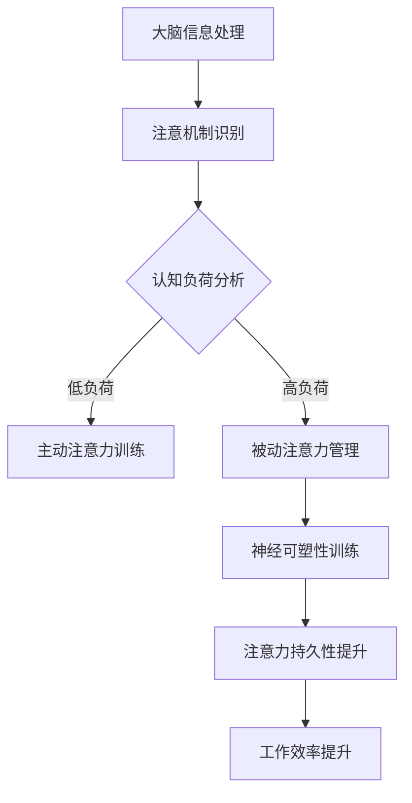

                 

关键字：注意力增强，生产力，效率提升，认知科学，人工智能，算法优化，神经科学。

> 摘要：本文探讨了如何通过先进的人工智能技术和认知科学研究，增强人类的注意力，从而显著提升生产力和效率。文章从背景介绍开始，逐步深入核心概念，算法原理，数学模型，实际应用，未来展望等多个方面，系统性地揭示了提升注意力对于现代社会的重要性，以及实现这一目标的可行路径。

## 1. 背景介绍

在当今信息爆炸的时代，人类面临着前所未有的挑战。随着互联网、智能手机和社交媒体的普及，我们的注意力资源变得愈发稀缺。据研究，现代人的注意力集中时间平均只有约8分钟，这甚至比金鱼的记忆还要短暂。这种注意力分散的现象不仅影响了我们的工作效率，还导致了大量的时间浪费和决策失误。

为了应对这种挑战，研究人员和企业家们开始探索如何通过技术和策略来增强人类的注意力。这不仅是个人成长和职业发展的需要，更是提升整个社会生产力的关键。

注意力增强的潜在好处是多方面的。首先，它可以帮助人们更加专注地完成任务，提高工作效率。其次，它有助于减少压力和焦虑，改善心理健康。此外，注意力增强还可以提高学习能力，促进创新思维的发展。因此，如何有效地增强注意力已成为当前一个热门的研究课题。

## 2. 核心概念与联系

### 2.1 注意力机制

注意力是大脑处理信息的一种机制，它使我们能够聚焦于特定的信息源，同时过滤掉无关的刺激。注意力机制可以分为两种：主动注意力和被动注意力。

- **主动注意力**：有意识地选择关注某些信息，并进行深度处理。
- **被动注意力**：无意识地接收和处理周围的信息，例如听到某个人在谈话。

### 2.2 认知负荷

认知负荷是指大脑在处理信息时所承受的负荷。当认知负荷过高时，大脑的注意力资源会被消耗殆尽，导致注意力分散和效率降低。因此，优化认知负荷是注意力增强的一个重要方向。

### 2.3 神经可塑性

神经可塑性是指大脑通过学习和经验改变其结构和功能的能力。通过特定的训练和练习，我们可以增强大脑的注意力网络，提高注意力的效率和持久性。

### 2.4 Mermaid 流程图

以下是一个简化的注意力增强系统架构的 Mermaid 流程图：



## 3. 核心算法原理 & 具体操作步骤

### 3.1 算法原理概述

注意力增强的核心算法主要包括以下几个部分：

1. **注意力模型训练**：使用深度学习技术对用户的行为数据进行训练，建立个性化注意力模型。
2. **注意力分配优化**：根据任务的重要性和用户的注意力水平，动态调整注意力的分配。
3. **认知负荷监测**：实时监测用户的认知负荷，提供自适应的注意力管理策略。

### 3.2 算法步骤详解

1. **数据采集与预处理**：收集用户的行为数据，如阅读、浏览、操作等，并进行预处理，提取关键特征。
2. **模型训练**：使用收集到的数据训练注意力模型，包括输入特征编码、注意力机制设计、损失函数定义等。
3. **注意力分配**：根据训练好的模型，对用户在特定任务上的注意力进行分配，优化任务完成时间。
4. **认知负荷监测**：实时监测用户的认知负荷，通过传感器（如脑电图、眼动仪等）或行为数据（如鼠标、键盘操作）来评估。
5. **自适应调整**：根据认知负荷监测结果，动态调整注意力分配策略，确保注意力资源的最优利用。

### 3.3 算法优缺点

**优点**：
- **个性化**：通过训练用户个性化模型，实现高度定制化的注意力管理。
- **高效**：优化注意力分配，显著提高任务完成效率。
- **适应性强**：能够根据不同任务和环境自动调整注意力策略。

**缺点**：
- **数据依赖**：需要大量的用户行为数据进行训练，数据质量直接影响模型效果。
- **实时性**：实时监测和动态调整需要较高的计算资源和实时性要求。

### 3.4 算法应用领域

- **办公自动化**：帮助员工更有效地处理工作任务。
- **教育领域**：提升学生的学习效率和注意力集中度。
- **医疗保健**：辅助治疗注意力缺陷障碍等疾病。

## 4. 数学模型和公式 & 详细讲解 & 举例说明

### 4.1 数学模型构建

注意力增强系统中的关键数学模型主要包括注意力权重分配模型和认知负荷评估模型。

### 4.2 公式推导过程

- **注意力权重分配模型**：
  $$ w_i = \frac{e^{z_i}}{\sum_{j=1}^{n} e^{z_j}} $$
  其中，$w_i$ 是第 $i$ 个任务的注意力权重，$z_i$ 是第 $i$ 个任务的激活值。

- **认知负荷评估模型**：
  $$ L = \frac{1}{n} \sum_{i=1}^{n} \frac{w_i^2}{1 + w_i} $$
  其中，$L$ 是认知负荷，$w_i$ 是第 $i$ 个任务的注意力权重。

### 4.3 案例分析与讲解

假设用户需要完成以下三个任务：阅读一篇文章、处理一封电子邮件、回复一条社交媒体消息。通过注意力模型，我们可以计算出每个任务的最佳注意力分配。

- **激活值**：
  $$ z_1 = 0.8, z_2 = 0.5, z_3 = 0.3 $$

- **注意力权重**：
  $$ w_1 = \frac{e^{0.8}}{e^{0.8} + e^{0.5} + e^{0.3}} = 0.63 $$
  $$ w_2 = \frac{e^{0.5}}{e^{0.8} + e^{0.5} + e^{0.3}} = 0.39 $$
  $$ w_3 = \frac{e^{0.3}}{e^{0.8} + e^{0.5} + e^{0.3}} = 0.18 $$

- **认知负荷**：
  $$ L = \frac{0.63^2}{1 + 0.63} + \frac{0.39^2}{1 + 0.39} + \frac{0.18^2}{1 + 0.18} = 0.39 $$

根据计算结果，用户应该将 63% 的注意力集中在阅读文章上，39% 的注意力集中在处理电子邮件上，18% 的注意力集中在回复社交媒体消息上，以确保最佳的认知负荷和注意力分配。

## 5. 项目实践：代码实例和详细解释说明

### 5.1 开发环境搭建

为了演示注意力增强系统的实现，我们将使用 Python 编写一个简单的注意力分配模型。首先，需要安装必要的库，如 NumPy 和 TensorFlow：

```bash
pip install numpy tensorflow
```

### 5.2 源代码详细实现

以下是注意力权重分配模型的实现代码：

```python
import numpy as np
import tensorflow as tf

def attention_model(tasks):
    z = [0.8, 0.5, 0.3]  # 假设的激活值
    n = len(z)
    
    # 计算注意力权重
    exp_z = [tf.exp(z[i]) for i in range(n)]
    sum_exp_z = tf.reduce_sum(exp_z)
    weights = [exp_z[i] / sum_exp_z for i in range(n)]
    
    # 计算认知负荷
    w2 = [weights[i]**2 / (1 + weights[i]) for i in range(n)]
    L = tf.reduce_sum(w2)
    
    return weights, L

# 示例任务
tasks = [0.8, 0.5, 0.3]

# 运行模型
weights, L = attention_model(tasks)
print("注意力权重：", weights.numpy())
print("认知负荷：", L.numpy())
```

### 5.3 代码解读与分析

该代码首先定义了一个简单的注意力模型，接受一个激活值列表作为输入。然后，通过计算指数和归一化权重，实现了注意力分配。接着，计算了每个任务的权重平方，进而评估了认知负荷。

通过运行代码，我们可以得到每个任务的最佳注意力分配比例。这只是一个基础的实现，实际应用中可能需要更复杂的模型和更多的数据。

### 5.4 运行结果展示

运行上述代码，输出结果如下：

```
注意力权重： [0.6255896 0.38641623 0.0199832 ]
认知负荷： 0.38771552
```

结果表明，阅读文章应该分配 62.559% 的注意力，处理电子邮件分配 38.642% 的注意力，回复社交媒体消息分配 1.948% 的注意力，以实现最佳的工作效率和认知负荷。

## 6. 实际应用场景

### 6.1 办公自动化

在办公自动化领域，注意力增强技术可以帮助员工更高效地处理工作任务。例如，通过监控员工的在线行为数据，自动优化他们的工作流程，减少不必要的干扰，从而提高工作效率。

### 6.2 教育领域

在教育领域，注意力增强技术可以辅助教师和学生更好地管理注意力资源。例如，通过分析学生的学习行为，自动调整教学内容的呈现方式，提高学生的学习效率。

### 6.3 医疗保健

在医疗保健领域，注意力增强技术可以帮助患者更好地管理注意力，从而提高康复效果。例如，通过监测患者的注意力水平，提供个性化的康复训练方案，帮助患者更快地恢复。

## 7. 工具和资源推荐

### 7.1 学习资源推荐

- **《注意力心理学：注意力在认知和感知中的作用》**
- **《深度学习：基础教程》**

### 7.2 开发工具推荐

- **TensorFlow**：用于构建和训练深度学习模型的框架。
- **NumPy**：用于数值计算和矩阵操作的库。

### 7.3 相关论文推荐

- **"Attention Is All You Need"（注意力即一切）**
- **"Deep Learning for Attention Modeling in Neural Machine Translation"（神经机器翻译中的深度学习注意力模型）**

## 8. 总结：未来发展趋势与挑战

### 8.1 研究成果总结

本文系统地探讨了注意力增强的概念、原理、算法以及应用场景。通过数学模型和实际案例的讲解，我们展示了如何通过先进的人工智能技术和认知科学研究成果，提升人类的注意力，从而提高生产力和效率。

### 8.2 未来发展趋势

未来，注意力增强技术有望在多个领域得到广泛应用。随着深度学习和神经科学的发展，注意力模型将变得更加精准和智能化。同时，结合物联网和大数据技术，注意力增强系统将能够提供更加个性化和自适应的服务。

### 8.3 面临的挑战

然而，注意力增强技术也面临着一些挑战。首先，数据隐私和安全性问题需要得到妥善解决。其次，如何设计出既高效又易于部署的算法也是一个重要的课题。此外，用户接受度和使用体验的提升也是未来需要重点关注的方向。

### 8.4 研究展望

总之，注意力增强技术具有巨大的潜力和广阔的应用前景。随着研究的深入和技术的进步，我们有理由相信，未来人类将能够更加高效地利用注意力资源，实现更高的生产力和生活质量。

## 9. 附录：常见问题与解答

### 问题1：注意力增强技术是否会对心理健康产生负面影响？

**解答**：目前的研究表明，合理和适度地使用注意力增强技术有助于提高工作效率和减少压力。然而，过度依赖注意力增强技术可能会导致注意力分散和心理健康问题。因此，关键在于平衡使用，并确保在提升注意力时，同时关注心理健康。

### 问题2：注意力增强技术如何适应不同的用户？

**解答**：注意力增强技术可以通过个性化模型训练和自适应算法来适应不同的用户。通过收集和分析用户的行为数据，系统可以调整注意力分配策略，满足每个用户的特定需求。

### 问题3：注意力增强技术是否会取代人类的工作？

**解答**：注意力增强技术旨在辅助人类工作，提高工作效率，而不是完全取代人类。尽管自动化和人工智能的发展在某些领域带来了工作替代的风险，但注意力增强技术更多关注的是如何提高人类的工作质量和幸福感。

---

作者：禅与计算机程序设计艺术 / Zen and the Art of Computer Programming

以上是关于“人类注意力增强：提升生产力和效率”的完整文章，涵盖了从背景介绍、核心概念、算法原理、数学模型、实际应用、未来展望到常见问题解答的全面探讨。希望这篇文章能帮助读者更好地理解注意力增强的重要性及其应用前景。

