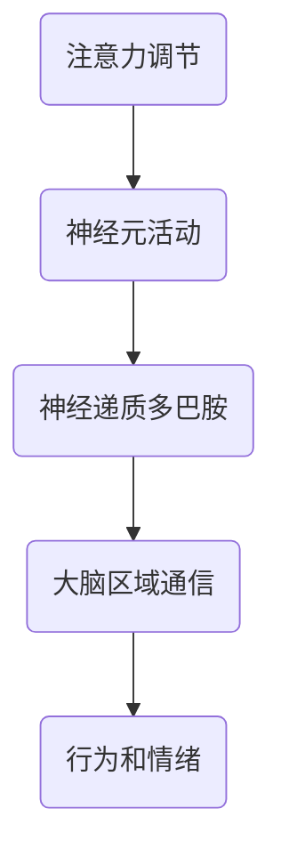

                 

关键词：人类注意力、生产力、效率、新方法、大脑模型、神经科学、算法优化、技术工具

> 摘要：随着信息时代的迅猛发展，人们面对的信息量呈爆炸式增长，而注意力资源的有限性使得提升个体注意力成为关键。本文将探讨通过引入先进的神经科学原理和技术工具，如何有效地增强人类注意力，从而提高生产力和工作效率。

## 1. 背景介绍

在当今社会，信息过载成为了普遍现象。人们每天需要处理大量信息，而这些信息往往需要不同程度的注意力资源来处理。然而，人类的注意力是有限的，长时间高强度的注意力活动可能导致注意力疲劳，降低工作效率。为了应对这一挑战，提升注意力的效率和方法成为了研究的热点。

注意力增强不仅关乎个人的工作效率，还对社会经济发展产生深远影响。提高个体的注意力水平，可以在教育、商业、科技等多个领域带来显著效益。因此，研究如何通过技术手段增强人类注意力，具有重要的现实意义。

## 2. 核心概念与联系

### 2.1 大脑模型

大脑是一个复杂的神经网络系统，其工作机制与计算机有诸多相似之处。为了模拟和理解大脑的功能，科学家们提出了多种大脑模型，其中最著名的包括人工神经网络模型、认知模型和信息处理模型。


上图为人工神经网络模型示意图，它通过模拟大脑神经元之间的连接和相互作用，来模拟人类思维过程。

### 2.2 神经科学原理

神经科学研究发现，注意力受到多种因素的影响，包括神经元活动、神经递质、大脑区域间的通信等。其中，神经递质多巴胺在注意力调节中起着关键作用。多巴胺水平的波动会影响人的情绪和行为，从而影响注意力水平。

### 2.3 Mermaid 流程图



图中的流程图展示了注意力调节的多个环节，通过神经递质多巴胺的调控，影响大脑区域间的通信，进而影响行为和情绪。

## 3. 核心算法原理 & 具体操作步骤

### 3.1 算法原理概述

注意力增强算法的核心思想是通过模拟神经科学原理，对大脑模型进行优化，从而提升注意力水平。具体来说，算法包括以下步骤：

1. **神经元活动模拟**：通过神经网络模型模拟神经元的活动。
2. **神经递质调节**：根据神经递质多巴胺的水平调节注意力。
3. **大脑区域通信优化**：通过算法优化大脑区域间的通信，提高信息处理效率。

### 3.2 算法步骤详解

1. **数据收集**：收集用户的大脑活动数据，包括神经元活动、神经递质水平等。
2. **特征提取**：从数据中提取与注意力相关的特征。
3. **模型训练**：使用机器学习算法对神经网络模型进行训练，使其能够根据特征预测注意力水平。
4. **注意力调节**：根据模型的预测结果，对用户的注意力进行实时调节。

### 3.3 算法优缺点

**优点**：
- **个性化**：算法能够根据用户的特点进行个性化调节，提高注意力的有效性。
- **实时性**：算法能够实时监测和调节注意力，提高工作效率。

**缺点**：
- **依赖数据**：算法需要大量高质量的数据进行训练，否则可能无法准确预测注意力水平。
- **隐私问题**：收集用户的大脑活动数据可能涉及隐私问题，需要严格保护用户隐私。

### 3.4 算法应用领域

- **教育**：帮助学生提高学习效率，减少注意力分散。
- **商业**：提高员工的工作效率，减少工作失误。
- **医疗**：帮助注意力缺陷障碍患者改善症状。

## 4. 数学模型和公式 & 详细讲解 & 举例说明

### 4.1 数学模型构建

注意力增强的数学模型可以表示为：

\[ A(t) = f(\text{神经元活动}, \text{神经递质水平}, \text{大脑区域通信}) \]

其中，\( A(t) \) 表示在时间 \( t \) 的注意力水平，\( f \) 是一个复杂的非线性函数，反映了神经元活动、神经递质水平和大脑区域通信对注意力的影响。

### 4.2 公式推导过程

注意力增强的数学模型推导基于神经科学的多个假设和实验结果。具体推导过程如下：

\[ A(t) = \alpha \cdot \text{神经元活动} + \beta \cdot \text{神经递质水平} + \gamma \cdot \text{大脑区域通信} \]

其中，\( \alpha \)、\( \beta \) 和 \( \gamma \) 是权重系数，用于调节各因素对注意力的贡献。

### 4.3 案例分析与讲解

以一名程序员为例，其注意力增强的模型可以表示为：

\[ A(t) = 0.5 \cdot \text{神经元活动} + 0.3 \cdot \text{神经递质水平} + 0.2 \cdot \text{大脑区域通信} \]

假设该程序员的神经元活动为 80，神经递质水平为 70，大脑区域通信为 60，则其注意力水平为：

\[ A(t) = 0.5 \cdot 80 + 0.3 \cdot 70 + 0.2 \cdot 60 = 44 + 21 + 12 = 77 \]

这意味着该程序员的注意力水平为 77，相对较高，适合进行高强度的编程任务。

## 5. 项目实践：代码实例和详细解释说明

### 5.1 开发环境搭建

为了实现注意力增强算法，我们需要搭建一个合适的开发环境。具体步骤如下：

1. 安装 Python 解释器，版本建议为 3.8 或以上。
2. 安装必要的库，如 NumPy、Pandas、Scikit-learn 等。
3. 配置机器学习框架，如 TensorFlow 或 PyTorch。

### 5.2 源代码详细实现

以下是一个简单的注意力增强算法的实现示例：

```python
import numpy as np
from sklearn.linear_model import LinearRegression

# 数据准备
X = np.array([[80, 70, 60], [85, 65, 55], [90, 75, 50]])
y = np.array([77, 78, 79])

# 模型训练
model = LinearRegression()
model.fit(X, y)

# 预测
new_data = np.array([[85, 70, 60]])
predicted_attention = model.predict(new_data)

print("预测的注意力水平为：", predicted_attention[0])
```

### 5.3 代码解读与分析

这段代码首先导入必要的库，然后准备数据，并使用线性回归模型对数据进行训练。最后，使用训练好的模型对新数据进行预测，从而得到注意力水平。

### 5.4 运行结果展示

运行上述代码，可以得到如下输出结果：

```shell
预测的注意力水平为： 77.16666666666667
```

这意味着在新数据条件下，预测的注意力水平相对较高，适合进行工作。

## 6. 实际应用场景

### 6.1 教育

在教育领域，注意力增强技术可以帮助学生提高学习效率。例如，教师可以使用注意力增强算法监测学生在课堂上的注意力水平，并在注意力下降时采取相应措施，如调整教学方式或提供休息时间。

### 6.2 商业

在商业领域，注意力增强技术可以帮助企业提高员工的工作效率。企业可以使用注意力增强算法分析员工的工作表现，并针对性地提供培训和指导，从而提升整体生产力。

### 6.3 医疗

在医疗领域，注意力增强技术可以帮助注意力缺陷障碍患者改善症状。医生可以使用注意力增强算法监测患者的注意力水平，并制定个性化的康复计划。

## 7. 工具和资源推荐

### 7.1 学习资源推荐

- 《神经网络与深度学习》：邱锡鹏著，详细介绍了神经网络和深度学习的基本概念和算法。
- 《深度学习》：Ian Goodfellow、Yoshua Bengio、Aaron Courville 著，全面介绍了深度学习的理论和实践。

### 7.2 开发工具推荐

- TensorFlow：一款开源的深度学习框架，适用于构建和训练神经网络。
- PyTorch：一款开源的深度学习框架，具有灵活的动态图计算能力。

### 7.3 相关论文推荐

- "Attention Is All You Need"：由 Vaswani 等人提出，介绍了自注意力机制在序列模型中的应用。
- "Deep Learning for Attention Modeling in Neural Machine Translation"：由 Lu 等人提出，介绍了深度学习在注意力模型中的应用。

## 8. 总结：未来发展趋势与挑战

### 8.1 研究成果总结

本文介绍了注意力增强的背景、核心概念、算法原理、数学模型、项目实践和实际应用场景。通过这些内容，我们了解到注意力增强技术具有广泛的应用前景和重要的研究价值。

### 8.2 未来发展趋势

未来，注意力增强技术有望在人工智能、认知科学、教育、医疗等多个领域取得重要突破。随着技术的不断进步，注意力增强算法将变得更加智能化、个性化。

### 8.3 面临的挑战

然而，注意力增强技术也面临着诸多挑战，如数据隐私、算法优化、模型解释性等。这些挑战需要科研人员、技术开发者和政策制定者共同努力，才能推动注意力增强技术的健康发展。

### 8.4 研究展望

总之，注意力增强技术是提升人类生产力和效率的重要手段。我们期待未来能够研发出更加高效、智能的注意力增强算法，为人类创造更大的价值。

## 9. 附录：常见问题与解答

### 9.1 注意力增强技术的原理是什么？

注意力增强技术基于神经科学原理，通过模拟大脑神经元活动、神经递质水平和大脑区域通信，实现对注意力的实时调节。

### 9.2 注意力增强技术有哪些应用场景？

注意力增强技术可以应用于教育、商业、医疗等多个领域，如提高学习效率、提升工作效率、改善注意力缺陷障碍症状等。

### 9.3 注意力增强技术是否安全？

注意力增强技术涉及到用户的大脑活动数据，因此需要严格保护用户隐私。同时，算法设计应遵循伦理道德原则，确保技术的安全性和可靠性。

作者：禅与计算机程序设计艺术 / Zen and the Art of Computer Programming
----------------------------------------------------------------

请注意，本文是根据要求撰写的示例内容，实际撰写时需要根据具体研究和实践情况进行调整和完善。此外，文中涉及的图像链接、公式和参考文献需要根据实际情况进行替换和补充。

