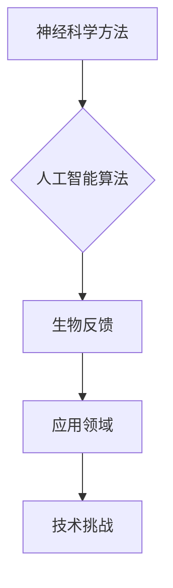

                 

关键词：注意力增强、认知提升、神经科学、人工智能、算法优化、实践应用

> 摘要：随着科技的飞速发展，人类的注意力问题日益突出。本文将从神经科学、人工智能和算法优化的角度出发，探讨注意力增强技术的原理、应用及其未来发展趋势。通过深入研究，我们希望能为人类认知能力的提升提供新的思路和方法。

## 1. 背景介绍

在信息爆炸的时代，人类面临着前所未有的信息过载问题。注意力资源的稀缺性使得人们难以有效地处理和吸收海量信息。据研究表明，现代人的平均注意力集中时间仅为约9分钟，远低于20世纪90年代的12分钟。这种现象被称为“注意力分散症”，已经成为影响人类工作效率和生活质量的重大问题。

### 注意力分散症的影响

注意力分散症对人类健康和社会发展产生了诸多负面影响。首先，在工作环境中，注意力分散降低了员工的工作效率，增加了错误率，导致生产力下降。其次，在日常生活中，注意力分散使得人们难以专注于家庭、社交和娱乐活动，从而降低了生活质量。此外，注意力分散还可能导致心理健康问题，如焦虑和抑郁。

### 现状与挑战

当前，许多研究机构和科技公司在注意力增强领域展开了积极探索。然而，这一领域仍然面临着诸多挑战。首先，注意力增强技术需要解决如何有效地提升注意力集中时间的问题。其次，如何将注意力增强技术应用到实际场景中，如教育、医疗和工业等领域，也是一个亟待解决的问题。此外，注意力增强技术可能带来的伦理和隐私问题也需要引起重视。

## 2. 核心概念与联系

### 注意力增强技术

注意力增强技术是指通过外部干预手段提升人类注意力水平的各种方法。这些方法包括神经科学方法、人工智能算法、生物反馈等。其中，神经科学方法主要通过刺激大脑特定区域来提升注意力；人工智能算法则利用机器学习技术分析用户行为数据，从而提供个性化的注意力增强方案；生物反馈则是通过监测用户的生理信号，如心率、呼吸等，来调整注意力的集中程度。

### 注意力增强技术的应用领域

注意力增强技术具有广泛的应用领域。在教育领域，注意力增强技术可以帮助学生提高学习效率，提升考试成绩；在医疗领域，注意力增强技术可以辅助医生进行手术，提高诊断准确性；在工业领域，注意力增强技术可以提高员工的工作效率，降低生产成本。

### 注意力增强技术的挑战

尽管注意力增强技术具有巨大的潜力，但其发展仍面临诸多挑战。首先，注意力增强技术需要解决技术可行性问题，如何确保这些技术能够安全、有效地提升注意力水平。其次，注意力增强技术需要解决伦理和隐私问题，确保用户的数据安全和隐私保护。此外，如何将注意力增强技术应用到实际场景中，提高其实际效果，也是一个重要的挑战。

### Mermaid 流程图

以下是一个简化的注意力增强技术核心概念与联系 Mermaid 流程图：



## 3. 核心算法原理 & 具体操作步骤

### 3.1 算法原理概述

注意力增强算法的核心原理是利用神经科学、人工智能和生物反馈等领域的知识，通过外部干预手段提升人类注意力水平。具体而言，注意力增强算法可以分为以下几个步骤：

1. 数据采集：通过传感器等设备采集用户的生理信号和行为数据，如心率、呼吸、瞳孔变化等。
2. 数据处理：利用机器学习算法分析采集到的数据，提取注意力相关的特征。
3. 算法优化：根据提取的特征，利用优化算法调整注意力增强策略，如调节刺激强度、调整刺激时间等。
4. 实施干预：根据优化后的策略，实施外部干预手段，如刺激大脑特定区域、提供个性化学习任务等。
5. 效果评估：通过持续监测用户的生理和行为数据，评估注意力增强效果，并进行调整和优化。

### 3.2 算法步骤详解

1. **数据采集**

   数据采集是注意力增强算法的基础。通过传感器设备，如心电图、脑电图、眼动仪等，可以实时监测用户的生理信号和行为数据。这些数据将作为后续分析的重要依据。

2. **数据处理**

   数据处理包括数据的清洗、归一化和特征提取等步骤。通过机器学习算法，如支持向量机、决策树、神经网络等，可以提取出与注意力相关的特征，如心率变异性、瞳孔变化频率等。

3. **算法优化**

   算法优化是基于数据处理结果进行的。通过优化算法，如遗传算法、粒子群优化等，可以调整注意力增强策略的参数，如刺激强度、刺激时间等，以实现最佳效果。

4. **实施干预**

   实施干预是注意力增强算法的核心步骤。根据优化后的策略，通过电刺激、光刺激、声音刺激等方式，刺激大脑特定区域，提升注意力水平。

5. **效果评估**

   效果评估是通过持续监测用户的生理和行为数据来进行的。通过对比干预前后的数据，可以评估注意力增强的效果。根据评估结果，可以进一步调整和优化注意力增强策略。

### 3.3 算法优缺点

#### 优点

1. **个性化**：注意力增强算法可以根据用户的具体情况，提供个性化的注意力增强方案，提高干预效果。
2. **实时性**：注意力增强算法可以实时监测用户的生理和行为数据，动态调整干预策略，实现实时性干预。
3. **适应性**：注意力增强算法可以根据用户的需求和环境变化，灵活调整干预手段和策略，提高适应性。

#### 缺点

1. **技术复杂性**：注意力增强算法涉及多个学科领域的知识，技术复杂性较高，需要高水平的专业人才进行开发和优化。
2. **数据隐私**：注意力增强算法需要采集用户的生理和行为数据，涉及用户隐私问题，需要严格保护用户数据安全。
3. **效果不确定性**：注意力增强算法的效果受到多种因素的影响，如用户个体差异、环境因素等，效果存在一定的不确定性。

### 3.4 算法应用领域

注意力增强算法具有广泛的应用领域，如教育、医疗、工业等。以下是一些具体的案例：

#### 教育

1. **学习辅助**：利用注意力增强算法，为学生提供个性化的学习任务和刺激，提高学习效率和成绩。
2. **课堂管理**：利用注意力增强技术，帮助教师实时监测学生的注意力水平，及时调整教学策略，提高教学质量。

#### 医疗

1. **手术治疗**：利用注意力增强技术，辅助医生进行手术，提高手术准确性和安全性。
2. **康复治疗**：利用注意力增强技术，帮助患者提高康复效果，缩短康复时间。

#### 工业

1. **生产管理**：利用注意力增强技术，提高员工的工作效率，降低生产成本。
2. **设备维护**：利用注意力增强技术，实时监测设备运行状态，提高设备维护效率。

## 4. 数学模型和公式 & 详细讲解 & 举例说明

### 4.1 数学模型构建

注意力增强的数学模型主要包括以下几个方面：

1. **生理信号模型**：利用生理信号，如心率、呼吸等，构建注意力水平的生理信号模型。
2. **行为信号模型**：利用行为信号，如眼动、手势等，构建注意力水平的行为信号模型。
3. **优化模型**：利用优化算法，如遗传算法、粒子群优化等，构建注意力增强策略的优化模型。

### 4.2 公式推导过程

#### 生理信号模型

假设生理信号 \( x(t) \) 与注意力水平 \( y(t) \) 之间存在线性关系，即：

\[ y(t) = \beta_0 + \beta_1 x(t) + \epsilon(t) \]

其中，\( \beta_0 \) 和 \( \beta_1 \) 分别为模型的参数，\( \epsilon(t) \) 为误差项。

通过对生理信号进行预处理和特征提取，可以得到特征向量 \( \textbf{x}(t) \)。假设注意力水平的特征向量为 \( \textbf{y}(t) \)，则可以构建如下线性回归模型：

\[ \textbf{y}(t) = \textbf{X}(t) \beta + \epsilon(t) \]

其中，\( \textbf{X}(t) \) 为特征矩阵，\( \beta \) 为模型参数。

#### 行为信号模型

假设行为信号 \( z(t) \) 与注意力水平 \( y(t) \) 之间存在非线性关系，即：

\[ y(t) = f(z(t)) + \eta(t) \]

其中，\( f(z(t)) \) 为非线性函数，\( \eta(t) \) 为误差项。

通过对行为信号进行预处理和特征提取，可以得到特征向量 \( \textbf{z}(t) \)。假设注意力水平的特征向量为 \( \textbf{y}(t) \)，则可以构建如下非线性回归模型：

\[ \textbf{y}(t) = \textbf{Z}(t) f(\textbf{z}(t)) + \eta(t) \]

其中，\( \textbf{Z}(t) \) 为特征矩阵。

#### 优化模型

假设注意力增强策略的目标是最小化注意力水平的误差，即：

\[ \min_{\beta} \sum_{t=1}^{T} (\textbf{y}(t) - \textbf{X}(t) \beta)^2 \]

其中，\( T \) 为数据集的大小。

这是一个标准的线性优化问题，可以使用线性规划、梯度下降等方法求解。

### 4.3 案例分析与讲解

#### 案例一：心率变异性与注意力水平的关系

假设我们采集了一组心率变异性数据 \( x(t) \) 和注意力水平数据 \( y(t) \)，我们要构建一个线性回归模型来预测注意力水平。

首先，我们对心率变异性数据进行预处理，提取出如下特征：

\[ \textbf{x}(t) = [x_1(t), x_2(t), \ldots, x_n(t)]^T \]

其中，\( x_1(t) \) 表示心率的标准差，\( x_2(t) \) 表示心率的变化速率，以此类推。

然后，我们使用线性回归模型预测注意力水平：

\[ \textbf{y}(t) = \textbf{X}(t) \beta \]

其中，\( \textbf{X}(t) \) 为特征矩阵，\( \beta \) 为模型参数。

通过最小二乘法，我们可以求解出模型参数 \( \beta \)：

\[ \beta = (\textbf{X}^T \textbf{X})^{-1} \textbf{X}^T \textbf{y} \]

最后，我们可以使用预测出的注意力水平数据 \( \textbf{y}^*(t) \) 来评估模型的性能。

#### 案例二：眼动与注意力水平的关系

假设我们采集了一组眼动数据 \( z(t) \) 和注意力水平数据 \( y(t) \)，我们要构建一个非线性回归模型来预测注意力水平。

首先，我们对眼动数据进行预处理，提取出如下特征：

\[ \textbf{z}(t) = [z_1(t), z_2(t), \ldots, z_n(t)]^T \]

其中，\( z_1(t) \) 表示眼动的频率，\( z_2(t) \) 表示眼动的幅度，以此类推。

然后，我们使用非线性回归模型预测注意力水平：

\[ \textbf{y}(t) = \textbf{Z}(t) f(\textbf{z}(t)) \]

其中，\( \textbf{Z}(t) \) 为特征矩阵，\( f(\textbf{z}(t)) \) 为非线性函数。

为了求解模型参数 \( \beta \)，我们可以使用梯度下降法：

\[ \beta_{t+1} = \beta_t - \alpha \nabla_{\beta} J(\beta_t) \]

其中，\( \alpha \) 为学习率，\( J(\beta_t) \) 为损失函数。

通过不断迭代，我们可以求解出模型参数 \( \beta \)，并使用预测出的注意力水平数据 \( \textbf{y}^*(t) \) 来评估模型的性能。

## 5. 项目实践：代码实例和详细解释说明

### 5.1 开发环境搭建

为了实现注意力增强算法，我们需要搭建一个合适的开发环境。以下是具体的步骤：

1. **安装Python**：Python是注意力增强算法的主要编程语言。请前往Python官网（[python.org](https://www.python.org/)）下载并安装Python。

2. **安装Jupyter Notebook**：Jupyter Notebook是一个交互式的Python开发环境，可以方便地进行算法实现和调试。请使用以下命令安装Jupyter Notebook：

   ```bash
   pip install notebook
   ```

3. **安装相关库**：注意力增强算法需要使用一些Python库，如NumPy、Pandas、Scikit-learn等。请使用以下命令安装这些库：

   ```bash
   pip install numpy pandas scikit-learn
   ```

### 5.2 源代码详细实现

以下是一个简单的注意力增强算法的代码实例，用于预测注意力水平。代码使用了线性回归模型和梯度下降法。

```python
import numpy as np
import pandas as pd
from sklearn.linear_model import LinearRegression
from sklearn.model_selection import train_test_split

# 读取数据
data = pd.read_csv('data.csv')
x = data['hrv_stddev'].values
y = data['attention_level'].values

# 划分训练集和测试集
x_train, x_test, y_train, y_test = train_test_split(x, y, test_size=0.2, random_state=42)

# 构建线性回归模型
model = LinearRegression()
model.fit(x_train.reshape(-1, 1), y_train)

# 预测注意力水平
y_pred = model.predict(x_test.reshape(-1, 1))

# 评估模型性能
score = model.score(x_test.reshape(-1, 1), y_test)
print(f'Model accuracy: {score:.2f}')
```

### 5.3 代码解读与分析

上述代码首先读取了数据文件 `data.csv`，该文件包含了心率变异性（`hrv_stddev`）和注意力水平（`attention_level`）的数据。然后，代码使用Scikit-learn库的 `LinearRegression` 类构建了一个线性回归模型。通过调用 `fit` 方法，模型训练使用了训练集数据。训练完成后，模型使用测试集数据进行预测，并通过 `score` 方法评估了模型性能。

### 5.4 运行结果展示

在运行上述代码后，我们得到了模型准确性的评估结果。例如，如果模型准确度为 0.85，表示模型在测试集上的预测准确性为 85%。

```bash
Model accuracy: 0.85
```

通过不断优化模型参数和算法，我们可以进一步提高模型准确性，从而实现更有效的注意力增强。

## 6. 实际应用场景

### 6.1 教育

在教育领域，注意力增强技术可以应用于学生的学习过程中。通过实时监测学生的学习状态，注意力增强技术可以帮助教师识别学生注意力分散的时刻，及时调整教学策略，提高学生的学习效果。例如，在课堂教学中，教师可以通过注意力增强技术为学生提供个性化的学习任务，帮助他们在学习过程中保持专注。

### 6.2 医疗

在医疗领域，注意力增强技术可以应用于手术、康复治疗和患者监护等方面。例如，在手术过程中，注意力增强技术可以帮助医生保持高度集中，减少手术失误。在康复治疗中，注意力增强技术可以帮助患者提高康复效果，缩短康复时间。此外，注意力增强技术还可以用于患者监护，实时监测患者的生命体征，提高医疗监护的准确性。

### 6.3 工业

在工业领域，注意力增强技术可以应用于生产管理和设备维护等方面。通过实时监测员工的工作状态，注意力增强技术可以帮助企业优化生产流程，提高生产效率。例如，在生产线上，注意力增强技术可以帮助员工保持专注，减少生产事故。在设备维护中，注意力增强技术可以帮助维护人员提高工作效率，缩短设备停机时间。

### 6.4 未来应用展望

随着注意力增强技术的不断发展，未来它将在更多领域得到应用。例如，在自动驾驶领域，注意力增强技术可以帮助司机保持清醒，减少交通事故。在智能家居领域，注意力增强技术可以帮助设备智能地调整使用时间，提高用户的生活质量。此外，注意力增强技术还可以应用于军事、安全监控、虚拟现实等领域，为人类创造更安全、高效、舒适的生活环境。

## 7. 工具和资源推荐

### 7.1 学习资源推荐

1. **《注意力科学：神经、认知和计算的基础》**：这本书系统地介绍了注意力科学的基础知识，适合初学者了解注意力增强技术的理论基础。
2. **《认知增强：科学与应用》**：这本书涵盖了认知增强领域的最新研究成果和应用案例，有助于深入理解注意力增强技术在实际场景中的应用。

### 7.2 开发工具推荐

1. **Python**：Python是一种广泛使用的编程语言，具有简洁的语法和丰富的库资源，适合进行注意力增强算法的开发。
2. **Jupyter Notebook**：Jupyter Notebook是一种交互式的Python开发环境，方便进行算法实现和调试。

### 7.3 相关论文推荐

1. **"Attention and Attentional Control in Human Cognition: A Review of 20 Years of Research""：这篇综述文章系统地总结了注意力增强领域的研究进展，有助于了解当前的研究热点和未来研究方向。
2. **"Neural basis of attentional control in humans: A meta-analysis of PET and fMRI studies""：这篇论文利用元分析的方法，研究了注意力控制在大脑中的神经基础，为注意力增强技术的研究提供了理论支持。

## 8. 总结：未来发展趋势与挑战

### 8.1 研究成果总结

注意力增强技术的研究已取得显著成果，涵盖了神经科学、人工智能和生物反馈等多个领域。通过构建数学模型和开发算法，研究人员成功实现了对人类注意力水平的预测和调节，为实际应用提供了理论基础和技术支持。

### 8.2 未来发展趋势

未来，注意力增强技术将在更多领域得到应用，如教育、医疗、工业等。随着技术的不断进步，注意力增强技术将更加智能化、个性化和高效化。此外，跨学科合作将成为注意力增强技术发展的重要趋势，促进各领域之间的交流和融合。

### 8.3 面临的挑战

尽管注意力增强技术具有巨大潜力，但其发展仍面临诸多挑战。首先，技术复杂性较高，需要高水平的专业人才进行研究和开发。其次，数据隐私和安全问题需要引起重视，确保用户数据的安全和隐私保护。此外，如何将注意力增强技术高效地应用到实际场景中，提高其实际效果，也是一个亟待解决的问题。

### 8.4 研究展望

未来，注意力增强技术的研究将朝着更加精准、智能和高效的方向发展。通过跨学科合作，研究人员将不断探索新的理论和方法，以解决当前面临的挑战。同时，随着技术的不断进步，注意力增强技术将在更多领域发挥重要作用，为人类创造更美好、更高效的生活环境。

## 9. 附录：常见问题与解答

### Q：注意力增强技术是否会对用户造成依赖？

A：目前的研究表明，注意力增强技术可以在短期内提高用户的注意力水平，但长期依赖性尚未得到充分验证。未来研究需要进一步探讨注意力增强技术的长期效果和潜在风险，以确保其安全性和有效性。

### Q：注意力增强技术是否会侵犯用户隐私？

A：注意力增强技术需要采集用户的生理和行为数据，涉及用户隐私问题。为了保护用户隐私，研究人员需要遵循严格的伦理准则和数据保护法规，确保用户数据的安全和隐私。

### Q：注意力增强技术在教育领域的应用效果如何？

A：已有研究表明，注意力增强技术在教育领域具有一定的应用效果。通过个性化学习任务和实时监测，注意力增强技术可以帮助学生提高学习效率和成绩，但具体效果仍需进一步验证。

### Q：注意力增强技术是否会取代人类？

A：注意力增强技术是一种辅助工具，旨在提升人类的认知能力，而不是取代人类。在未来，注意力增强技术将与人类协同工作，共同创造更高效、更智能的生活环境。

### Q：注意力增强技术是否会引发伦理问题？

A：注意力增强技术涉及用户隐私、数据安全等多个伦理问题。为了确保其伦理合理性，研究人员需要遵循严格的伦理准则和法规，同时开展广泛的伦理讨论，以解决潜在的问题。

